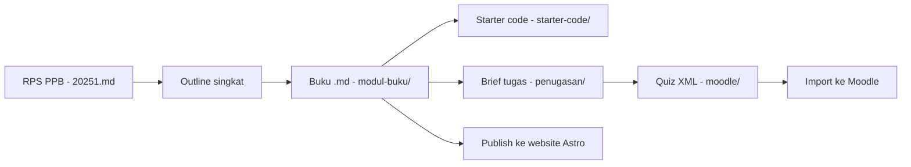

# Materi-Mobile

Repositori pengembangan materi perkuliahan **Pemrograman Mobile (Perangkat Bergerak)** berbasis **Flutter** — semester 20251, 16 pertemuan, dengan capstone project sebagai tulang punggung penilaian.

> **Repo:** https://github.com/kaqfa/materi-mobile

---

## Arsitektur Pembelajaran

| Komponen | Platform | Isi |
|---|---|---|
| **Materi/modul utama** | Website **Astro** | Modul per pertemuan (Markdown + frontmatter, `.md`), buku multi-chapter, bisa dibaca mandiri |
| **Assignment, quiz, penilaian** | **Moodle** | Brief tugas, question bank (XML), rubrik, pengumpulan & grading |

Semua konten materi disusun **di repo ini** sebagai sumber kebenaran, lalu dipublikasikan ke platform masing-masing.

### Prinsip kurikulum

- **Standar pengajaran: Flutter + Dart.** Semua modul, contoh kode, dan praktikum memakai Flutter (reference app: **StudyTracker**).
- **Stack bebas untuk mahasiswa.** Dalam mengerjakan assignment dan proyek akhir, mahasiswa boleh memakai bahasa, framework, dan tools apa pun — rubrik menilai *outcome*, bukan stack.
- **Capstone incremental** sepanjang semester (mulai P04), domain: Local Business Solutions / EdTech / Health & Wellness.
- **Integrasi AI progresif**: batasan penggunaan AI menyesuaikan fase semester (lihat RPS).
- **Modul lama dipertahankan, direvisi bertahap.** Materi semester kemarin di `modul-buku/` sudah cukup baik — improve sedikit demi sedikit, bukan rewrite. Acuan capaian tetap **RPS 20251**: materi yang menyimpang dari RPS wajib direvisi.

---

## Struktur Repo

```
.
├── README.md                      # Dokumen ini
├── AGENTS.md                      # Panduan untuk AI coding agent
├── RPS PPB - 20251.md             # SUMBER KEBENARAN kurikulum (16 pertemuan, Sub-CPMK, penilaian)
├── Standar Pengembangan Materi PPB.md   # Standar proses (legacy — akan disederhanakan)
├── Standar Tutorial Koding PPB.md       # Standar format tutorial (Progressive Checkpoint)
│
├── modul-buku/                    # [AKTIF] MODUL UTAMA — buku "Pemrograman Mobile dengan Flutter" (14 bab, .md)
├── Ujian/                         # [AKTIF] UTS/UAS — soal live coding, rubrik demo
├── starter-code/                  # [RENCANA] Starter & sample code Flutter per pertemuan
├── penugasan/                     # [RENCANA] Brief assignment, rubrik, capstone (publikasi via Moodle)
├── moodle/                        # [RENCANA] Question bank XML + generator script
│
└── modul-SA/                      # [REFERENSI] Paket remedial 7 pertemuan — acuan struktur penugasan & aset Moodle
```

`modul-buku/` berisi salinan konten dari project web Astro (repo terpisah). Repo ini = sumber kebenaran konten; perubahan di sini lalu disalin/sync ke project Astro.

---

## Pipeline Pengembangan Materi



1. **RPS dulu.** Setiap bab harus nyambung ke pertemuan + Sub-CPMK di RPS. Bab buku **tidak 1:1 dengan pertemuan** — RPS tetap acuan ritme kelas; bab buku = materi belajar mandiri.
2. **Modul `.md`** di `modul-buku/` mengikuti skema frontmatter yang sudah ada dan standar tutorial **Progressive Checkpoint** (2–4 checkpoint per bab, setiap checkpoint bisa di-run).
3. **Aset penilaian** (brief tugas, rubrik, bank soal) dibuat di repo, dipublikasikan ke Moodle.
4. Detail aturan pengembangan: lihat `AGENTS.md` dan dua file standar.

---

## Isi Buku Utama (`modul-buku/`, 14 bab)

| Bab | Judul | Status |
|---|---|---|
| 01 | Dart Fundamentals | ✅ published |
| 02 | Dart Deep Dive | ✅ |
| 03 | Flutter Fundamentals | ✅ |
| 04 | Build System & Project Structure | ✅ |
| 05 | Material Design Implementation | ✅ |
| 06 | Advanced UI & Custom Widgets | ✅ |
| 07 | State Management & SharedPreferences | ✅ |
| 08 | Local Storage & Databases | ✅ |
| 09 | REST API Integration | ✅ |
| 10 | Offline-First & SQLite | ✅ |
| 11 | Testing & Quality Assurance | ✅ |
| 12 | Platform Features & Device Integration | ✅ |
| 13 | Performance Optimization | ✅ |
| 14 | Deployment & Distribution | ✅ |

Semua bab berstatus `published` di frontmatter. Revisi berjalan inkremental (perbaikan kecil per bab).

### Gap modul vs RPS (perlu direvisi/dilengkapi)

| Topik RPS | Bab buku saat ini | Catatan |
|---|---|---|
| P07 — Responsive & Adaptive Layouts | tidak ada bab khusus (mungkin sebagian di bab 5/6) | audit & lengkapi |
| P09 — Supabase sebagai backend contoh | bab 9 REST API (backend generik?) | samakan contoh ke Supabase |
| P10 — Real-time sync (WebSocket/background sync) | bab 10 offline-first (sync lokal↔server ada, realtime?) | cek cakupan |
| P11 — BLoC/Riverpod sebagai pembanding | index buku eksplisit "tidak dibahas" | keputusan: tambah pembanding singkat vs sesuaikan penekanan RPS |
| AI Integration per pertemuan (kolom RPS) | belum ada di bab buku | tambah blok AI per bab sesuai fase |

Status: ⬜ belum · 🚧 draf · ✅ siap publish

---

## Konvensi

- **Bahasa**: konten Indonesia, istilah teknis Inggris dibiarkan (widget, state, dsb.).
- **Penamaan berkas**: bab buku `NN-slug.md` (kebab-case, `NN` = nomor bab); aset penilaian pakai prefiks `P0X_`. Saat publish ke web Astro, script publish me-rename ke `.mdx`.
- **Contoh kode Flutter**: harus lolos `flutter analyze`, null safety aktif.
- **Git**: commit kecil dengan pesan deskriptif; hasil build, `node_modules/`, `.DS_Store` tidak di-commit (lihat `.gitignore`).

## referensi cepat

- RPS lengkap (Sub-CPMK, breakdown nilai, strategi AI): `RPS PPB - 20251.md`
- Format tutorial: `Standar Tutorial Koding PPB.md`
- Contoh modul jadi: `modul-buku/01-dart-fundamentals.md`
- Contoh alur Moodle: `modul-SA/05-Assessment/Panduan-Import-Moodle.md`
