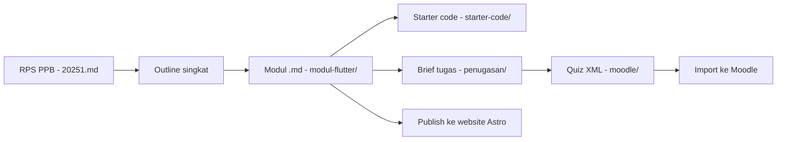

# Materi-Mobile

Repositori pengembangan materi perkuliahan **Pemrograman Mobile (Perangkat Bergerak)** berbasis **Flutter** — semester 20251, 16 pertemuan, dengan capstone project sebagai tulang punggung penilaian.

> **Repo:** https://github.com/kaqfa/materi-mobile

---

## Arsitektur Pembelajaran

| Komponen | Platform | Isi |
|---|---|---|
| **Materi/modul utama** | Website **Astro** | Modul per pertemuan (Markdown + frontmatter, `.md`), buku multi-chapter, bisa dibaca mandiri |
| **Assignment, quiz, penilaian** | **Moodle** | Brief tugas, question bank (XML), rubrik, pengumpulan & grading |

Semua konten materi disusun **di repo ini** sebagai sumber kebenaran, lalu dipublikasikan ke platform masing-masing.

### Prinsip kurikulum

- **Standar pengajaran: Flutter + Dart.** Semua modul, contoh kode, dan praktikum memakai Flutter (reference app: **StudyTracker**).
- **Stack bebas untuk mahasiswa.** Dalam mengerjakan assignment dan proyek akhir, mahasiswa boleh memakai bahasa, framework, dan tools apa pun — rubrik menilai *outcome*, bukan stack.
- **Capstone incremental** sepanjang semester (mulai P04), domain: Local Business Solutions / EdTech / Health & Wellness.
- **Integrasi AI progresif**: batasan penggunaan AI menyesuaikan fase semester (lihat RPS).

---

## Struktur Repo

```
.
├── README.md                      # Dokumen ini
├── AGENTS.md                      # Panduan untuk AI coding agent
├── RPS PPB - 20251.md             # SUMBER KEBENARAN kurikulum (16 pertemuan, Sub-CPMK, penilaian)
├── Standar Pengembangan Materi PPB.md   # Standar proses (legacy — akan disederhanakan)
├── Standar Tutorial Koding PPB.md       # Standar format tutorial (Progressive Checkpoint)
│
├── modul-flutter/                 # [AKTIF] Modul utama 20251 — Markdown/frontmatter untuk website Astro
├── starter-code/                  # [AKTIF] Starter & sample code Flutter per pertemuan
├── penugasan/                     # [AKTIF] Brief assignment, rubrik, capstone (publikasi via Moodle)
├── moodle/                        # [AKTIF] Question bank XML + generator script
├── Ujian/                         # [AKTIF] UTS/UAS — soal live coding, rubrik demo
│
├── modul-buku/                    # [REFERENSI] Buku OOP TypeScript (semester lalu) — acuan format frontmatter
└── modul-SA/                      # [REFERENSI] Paket remedial 7 pertemuan — acuan struktur penugasan & aset Moodle
```

Direktori `[REFERENSI]` tidak dikembangkan lagi, hanya jadi pola. Konten baru masuk ke direktori `[AKTIF]`.

---

## Pipeline Pengembangan Materi



1. **RPS dulu.** Setiap modul harus nyambung ke pertemuan + Sub-CPMK di RPS.
2. **Modul `.md`** mengikuti format frontmatter `modul-buku/` (buku multi-chapter) dan standar tutorial **Progressive Checkpoint** (2–4 checkpoint per pertemuan, setiap checkpoint bisa di-run).
3. **Aset penilaian** (brief tugas, rubrik, bank soal) dibuat di repo, dipublikasikan ke Moodle.
4. Detail aturan pengembangan: lihat `AGENTS.md` dan dua file standar.

---

## Roadmap Modul (16 pertemuan)

| # | Topik | Status |
|---|---|---|
| P01 | Introduction & Dart Fundamentals | ⬜ |
| P02 | Dart Deep Dive (OOP, async, null safety) | ⬜ |
| P03 | Flutter Fundamentals & Widget System | ⬜ |
| P04 | Build System & Project Structure — **Capstone Start** | ⬜ |
| P05 | UI Design & Material Design | ⬜ |
| P06 | Advanced UI & Custom Widgets | ⬜ |
| P07 | Responsive Design & Adaptive Layouts | ⬜ |
| — | **UTS** (live coding + demo) | ⬜ |
| P09 | API Integration & HTTP (Supabase) | ⬜ |
| P10 | Real-time Features & Offline Sync | ⬜ |
| P11 | Advanced State Management (Provider/BLoC) | ⬜ |
| P12 | Testing & Quality Assurance | ⬜ |
| P13 | Platform Features (camera, location) | ⬜ |
| P14 | Performance Optimization & Production Prep | ⬜ |
| P15 | Deployment & Distribution | ⬜ |
| — | **UAS** (final project presentation) | ⬜ |

Status: ⬜ belum · 🚧 draf · ✅ siap publish

---

## Konvensi

- **Bahasa**: konten Indonesia, istilah teknis Inggris dibiarkan (widget, state, dsb.).
- **Penamaan berkas**: modul `NN-slug.md` (kebab-case, `NN` = nomor pertemuan); aset penilaian pakai prefiks `P0X_`. Saat publish ke web Astro, script publish me-rename ke `.mdx`.
- **Contoh kode Flutter**: harus lolos `flutter analyze`, null safety aktif.
- **Git**: commit kecil dengan pesan deskriptif; hasil build, `node_modules/`, `.DS_Store` tidak di-commit (lihat `.gitignore`).

## referensi cepat

- RPS lengkap (Sub-CPMK, breakdown nilai, strategi AI): `RPS PPB - 20251.md`
- Format tutorial: `Standar Tutorial Koding PPB.md`
- Contoh modul jadi: `modul-buku/01-paradigma-oop-setup.md`
- Contoh alur Moodle: `modul-SA/05-Assessment/Panduan-Import-Moodle.md`
