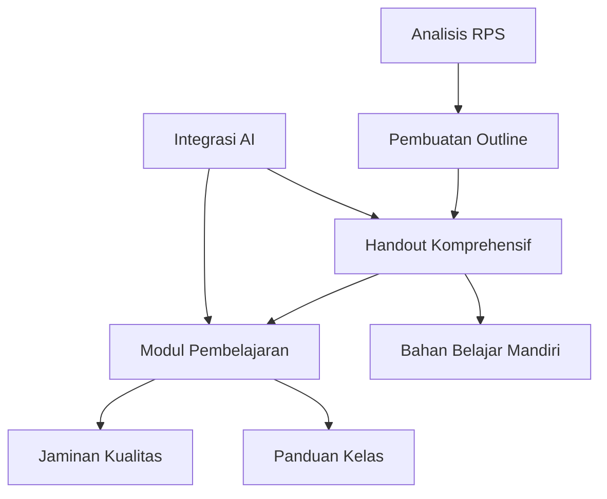

## **OVERVIEW PROSES PENGEMBANGAN**

Setiap pertemuan dalam mata kuliah Pemrograman Mobile Flutter dikembangkan melalui 3 tahapan sistematis yang saling terkait untuk memastikan pembelajaran yang komprehensif dan terstruktur.

### **Struktur Organisasi Berkas:**

```
01 Current - Projects/Kuliah - PPB 20251/
├── Outline/           # Rancangan materi dan analisis RPS
├── Handout/          # Bahan ajar lengkap untuk belajar mandiri
├── Modul/            # Panduan mengajar dan slide untuk kelas
└── Template/         # Template standar dan referensi
```

### **Tahapan Pengembangan:**



---

## **TAHAP 1: PEMBUATAN OUTLINE**

### **1.1 Analisis RPS**

**Masukan yang Diperlukan:**
- RPS mata kuliah (Sub-CPMK dan indikator)
- Capaian pembelajaran semester
- Pengetahuan prasyarat dari pertemuan sebelumnya
- Relevansi industri dan tren terkini

**Proses:**
1. **Ekstrak Sub-CPMK** untuk pertemuan tersebut
2. **Identifikasi tujuan pembelajaran** (3-4 tujuan spesifik dan terukur)
3. **Petakan pengetahuan prasyarat** yang dibutuhkan
4. **Tentukan ruang lingkup** materi (konsep + implementasi)
5. **Estimasi waktu belajar** (realistis untuk belajar mandiri)

**Lokasi Penyimpanan:** `Outline/P[X]_[TopikSingkat]_Outline.md`

**Template Keluaran (Simplified for Easy Review):**
```markdown
## OUTLINE P[X]: [TOPIC NAME]

### Learning Objectives (3-4 specific outcomes)
1. [Cognitive - understanding concepts]
2. [Psychomotor - implementation skills]
3. [Affective - professional practices]

### Content Scope
- **Core Concepts:** [2-3 fundamental ideas]
- **Practical Skills:** [Direct implementation abilities]
- **AI Integration Points:** [Where AI assistance adds value]

### Time Allocation
- **Self-Study:** 4-6 hours (handout completion)
- **Classroom:** 120 minutes (interactive practice)
- **Assignment:** 1 week completion

### Assessment Strategy
- **Formative:** Self-checks, guided practice
- **Summative:** Individual assignment with AI documentation

### Expected Outcomes
- [Specific measurable skill 1]
- [Specific measurable skill 2]
- [Specific measurable skill 3]
```

### **1.2 Arsitektur Konten**

**Prinsip:** Progressive Learning with Immediate Rewards
```
    [Creative Application]
           |
    [Professional Structure]
           |
    [Visual Enhancement]  ←-- Clear progress at each stage
           |
    [Working Functionality]  ←-- Immediate satisfaction
           |
    [Foundation & Context]  ←-- Clear 'why' and relevance
```

**Key Design Elements:**
- **Immediate Gratification:** Working code dalam 5 menit pertama
- **Visual Progress:** Setiap stage shows clear improvement
- **Practical Context:** Real-world applications dari awal
- **Building Complexity:** Natural progression tanpa overwhelming jumps

---

## **TAHAP 2: HANDOUT KOMPREHENSIF**

### **2.1 Standar Struktur Handout**

Berdasarkan Progressive Learning with Immediate Rewards philosophy yang telah terbukti efektif pada P04:

**Lokasi Penyimpanan:** `Handout/P[X]_[TopikSingkat]_Handout.md`

#### **Bagian I: Foundation & Context (2-3 halaman)**
```markdown
### TUJUAN PEMBELAJARAN
- 3-4 tujuan spesifik dan terukur
- Estimasi waktu dan pemetaan Sub-CPMK
- Expected outcomes dengan success criteria

### FONDASI KONSEPTUAL
- Why This Matters: Real-world relevance dan industry demand
- Backward/Forward Connections: Integrated learning pathway
- Ekosistem Context: How it fits dalam mobile development
```

#### **Bagian II: Core Content & Hands-On Practice (10-14 halaman)**
```markdown
### KONSEP INTI & IMMEDIATE APPLICATION
Setiap konsep dikombinasikan dengan hands-on practice:
- **Quick Intro:** Brief definition dengan immediate example
- **Practical Demo:** Working code yang bisa langsung dijalankan
- **Why & How:** Deep explanation after seeing it work
- **Guided Practice:** Step-by-step implementation
- **Connection Points:** How concepts build on each other

### PROGRESSIVE IMPLEMENTATION
Building complexity through stages:
- **Stage 1:** Basic functionality (Make it work)
- **Stage 2:** Enhancement & styling (Make it beautiful)
- **Stage 3:** Structure & best practices (Make it professional)
- **Stage 4:** Advanced features (Make it exceptional)
```

#### **Bagian III: Problem Solving & Application (4-5 halaman)**
```markdown
### TROUBLESHOOTING & DEBUGGING
- **Common Issues:** Real problems with systematic solutions
- **Debug Strategies:** Tools dan methodologies
- **Best Practices:** Professional standards integration

### INDEPENDENT CHALLENGES
- **Guided Exercises:** With starter code dan clear success criteria
- **Creative Challenges:** Open-ended applications
- **Extension Activities:** For advanced learners
```

#### **Bagian IV: Assessment & AI Integration (3-4 halaman)**
```markdown
### SELF-ASSESSMENT FRAMEWORK
- **Before/After Confidence Rating:** Clear progress tracking
- **Knowledge Verification:** Concept + practical application
- **Skill Demonstration:** Portfolio-worthy implementations

### AI-ENHANCED LEARNING
- **Strategic AI Usage:** Topic-specific productive prompts
- **Documentation Requirements:** Interaction tracking untuk accountability
- **Learning Reflection:** AI-assisted understanding validation
```

### **2.2 Standar Kualitas Handout**

**Kualitas Konten:**
- Semua contoh kode diuji dan berfungsi
- Konsep dijelaskan pada tingkat yang sesuai (semester 5)
- Contoh praktis relevan dengan pengembangan mobile
- Kompleksitas progresif (sederhana → lanjutan)
- Keterkaitan yang jelas antara teori dan praktik

**Desain Pembelajaran:**
- Beragam modalitas pembelajaran (visual, kinestetik, analitik)
- Elemen pembelajaran aktif (praktik, refleksi, kreasi)
- Ramah belajar mandiri dengan pencapaian yang jelas
- Penilaian terintegrasi sepanjang konten

**Integrasi AI:**
- Panduan yang jelas untuk penggunaan AI yang tepat
- Template dokumentasi disediakan
- Prompt refleksi pembelajaran disertakan
- Keseimbangan antara bantuan AI dan pembelajaran mandiri

**Standar Teknis:**
- Panjang total: 15-20 halaman (dapat dibaca dalam 4-6 jam)
- Sintaks kode di-highlight dan diformat dengan benar
- Screenshot/diagram untuk konsep kompleks
- Format dan styling yang konsisten

---

## **TAHAP 3: MODUL PEMBELAJARAN**

### **3.1 Standar Struktur Modul**

Berdasarkan TEMPLATE MODUL PERKULIAHAN.md:

**Lokasi Penyimpanan:** `Modul/P[X]_[TopikSingkat]_Modul.md`

#### **Section 1: Overview (1 page)**
```markdown
### TUJUAN HARI INI
- 3 specific skills yang akan dikuasai di kelas
- Direct mapping ke handout objectives

### RUNDOWN KELAS (120 menit total)
10:00-10:20  Opening + Live Demo (20 menit)
10:20-11:00  Live Coding Bareng (40 menit)
11:00-11:30  Practice Mandiri (30 menit)
11:30-11:50  Challenge Individual (20 menit)
11:50-12:00  Wrap-up + Tugas (10 menit)

### PREREQUISITE CHECK
- Technical readiness (environment setup)
- Knowledge readiness (previous topics)
- Material readiness (handout reviewed)
```

#### **Section 2: Live Coding (2-3 pages)**
```markdown
### DEMO 1: [Core Concept Implementation]
- **Interactive coding session** (not just presentation)
- **Key learning points** highlighted during coding
- **Common errors** anticipated dan addressed
- **Student participation** checkpoints

### DEMO 2: [Practical Application]
- **Building on Demo 1** dengan complexity increase
- **Real-world context** untuk student engagement
- **Testing dan debugging** demonstrated live
```

#### **Section 3: Active Learning (2 pages)**
```markdown
### PRACTICE MANDIRI (30 menit)
- **Clear task definition** dengan success criteria
- **Starter code provided** untuk efficiency
- **Progressive checklist** untuk self-monitoring
- **Help strategy** (peer → instructor)

### INDIVIDUAL CHALLENGE (20 menit)
- **3 difficulty levels** untuk differentiated learning
- **Immediate feedback** mechanism
- **Public sharing** untuk peer learning
```

#### **Section 4: Assignment & Wrap-up (1 page)**
```markdown
### TAKE-HOME ASSIGNMENT
- **Connection ke handout** untuk deepening
- **AI integration requirements** clearly specified
- **Assessment rubric** transparent
- **Submission format** standardized

### PREVIEW NEXT WEEK
- **Topic introduction** untuk preparation
- **Connection points** dengan current topic
```

### **3.2 Module Quality Standards**

**Classroom Effectiveness:**
- Time allocations realistic dan tested
- Interactive elements setiap 15-20 menit
- Multiple difficulty levels untuk diverse learners
- Clear transitions between activities

**Content Alignment:**
- Direct connection ke handout material
- Practical focus dengan immediate application
- Assessment aligned dengan learning objectives
- AI integration seamlessly integrated

**Instructor Support:**
- Clear instructor notes dan guidance
- Anticipated student questions addressed
- Troubleshooting guides untuk common issues
- Flexible timing untuk different class dynamics

---

## **AI INTEGRATION FRAMEWORK**

### **4.1 AI Learning Philosophy**

**Core Principle:** AI as Learning Accelerator, Not Dependency Creator

**Implementation Strategy:**
- **Week 1-4:** AI untuk explanation dan syntax help
- **Week 5-8:** AI untuk debugging dan code review
- **Week 9-12:** AI untuk architectural decisions dan optimization
- **Week 13-16:** AI untuk project consultation dan professional practices

### **4.2 AI Integration Points**

#### **In Handout:**
- **Productive AI Prompts:** Topic-specific question templates
- **Documentation Requirements:** Interaction tracking dan reflection
- **Learning Verification:** AI-assisted understanding checks
- **Creative Applications:** AI untuk ideation dan problem-solving

#### **In Teaching Module:**
- **Live AI Demonstration:** Real-time problem solving with AI
- **Student AI Practice:** Guided AI interaction sessions
- **AI Ethics Discussion:** Appropriate usage dalam professional context
- **Peer AI Sharing:** Students share AI learning strategies

### **4.3 AI Assessment Integration**

**Documentation Requirements:**
```markdown
### AI INTERACTION LOG
**Interaction #[X]**
- **Purpose:** [Why AI was used]
- **Question:** [Exact prompt used]
- **AI Response:** [Key insights gained]
- **Your Action:** [How you applied it]
- **Learning:** [What you understood]
- **Verification:** [How you confirmed understanding]
```

**Assessment Criteria:**
- **Appropriate Usage (25%):** AI used untuk learning, not cheating
- **Documentation Quality (25%):** Complete, reflective interaction logs
- **Learning Evidence (25%):** Clear understanding demonstration
- **Creative Application (25%):** Novel atau insightful AI usage

---

## **QUALITY ASSURANCE CHECKLIST**

### **5.1 Pre-Production Review**

**Content Review:**
- Alignment dengan RPS dan Sub-CPMK
- Technical accuracy (all code tested)
- Appropriate difficulty level (semester 5)
- Clear learning progression (simple → complex)

**Learning Design Review:**
- Multiple learning modalities addressed
- Active learning elements integrated
- Assessment aligned dengan objectives
- Self-paced friendly design

**AI Integration Review:**
- Clear guidelines untuk appropriate usage
- Documentation requirements specified
- Learning reflection framework provided
- Balance between assistance dan independence

### **5.2 Post-Production Testing**

**Handout Testing:**
- Student beta test (2-3 students)
- Time estimation validation
- Code execution verification
- Clarity feedback incorporation

**Module Testing:**
- Pilot classroom session
- Timing validation
- Interaction effectiveness
- Technology integration testing

**Iterative Improvement:**
- Student feedback collection
- Instructor reflection notes
- Performance data analysis
- Continuous improvement implementation

---

## **TIMELINE PRODUKSI**

### **Pengembangan Per Pertemuan:**

**Minggu N-3:** Pembuatan Outline (2-3 jam)
- Analisis RPS dan pemetaan tujuan
- Penentuan ruang lingkup konten
- Identifikasi titik integrasi AI

**Minggu N-2:** Pengembangan Handout (8-10 jam)
- Pembuatan konten inti
- Pengembangan dan pengujian contoh kode
- Perancangan latihan praktik
- Implementasi integrasi AI

**Minggu N-1:** Pengembangan Modul (4-5 jam)
- Pembuatan modul pembelajaran
- Perancangan urutan live coding
- Persiapan instrumen penilaian
- Jaminan kualitas akhir

**Minggu N:** Penyampaian & Umpan Balik (2 jam)
- Pelaksanaan di kelas
- Penyesuaian real-time
- Pengumpulan umpan balik mahasiswa
- Dokumentasi catatan perbaikan

### **Alokasi Sumber Daya:**
- **Total Waktu Pengembangan:** 15-20 jam per pertemuan
- **Jaminan Kualitas:** 20% dari total waktu
- **Perbaikan Iterasi:** 10% dari total waktu
- **Dokumentasi:** 15% dari total waktu

### **Konvensi Penamaan Berkas:**
```
Outline/P[X]_[TopikSingkat]_Outline.md
Handout/P[X]_[TopikSingkat]_Handout.md
Modul/P[X]_[TopikSingkat]_Modul.md

Contoh:
Outline/P01_DartFundamentals_Outline.md
Handout/P01_DartFundamentals_Handout.md
Modul/P01_DartFundamentals_Modul.md
```

---

## **PUSTAKA TEMPLATE**

### **6.1 Template Handout Lengkap**

```markdown
## PERTEMUAN [X]: [JUDUL TOPIK]

**Pemrograman Mobile Flutter - Semester 5**
**Universitas Dian Nuswantoro**

---

## **BAGIAN I: FOUNDATION & CONTEXT**

### **TUJUAN PEMBELAJARAN**

Setelah mempelajari materi ini, Anda mampu:

1. [Tujuan 1 - specific skill dengan measurable outcome]
2. [Tujuan 2 - specific skill dengan measurable outcome]
3. [Tujuan 3 - specific skill dengan measurable outcome]

**Estimasi Waktu:** [X] jam | **Sub-CPMK:** [X.X.X]

### **WHY THIS MATTERS**

#### **Real-World Relevance**
[Konkret examples dari industry applications dan job requirements]

#### **Immediate Benefits**
- **Developer Skills:** [Specific skills yang langsung applicable]
- **Career Impact:** [How this knowledge affects employability]
- **Project Value:** [Practical applications dalam capstone/portfolio]

### **LEARNING PATHWAY INTEGRATION**

#### **Building From Previous Knowledge**
- **P[X-1]:** [Specific concepts yang akan digunakan]
- **Prerequisites:** [Essential knowledge for success]

#### **Preparing for Advanced Topics**
- **P[X+1]:** [How this topic enables future learning]
- **Capstone Connection:** [Direct application dalam final project]

---

## **BAGIAN II: CORE CONTENT & HANDS-ON PRACTICE**

### **QUICK START: See It Working First**

#### **Demo Application Preview**

```dart
// Complete working example - try this first!
import 'package:flutter/material.dart';

void main() => runApp(QuickDemo());

class QuickDemo extends StatelessWidget {
  @override
  Widget build(BuildContext context) {
    return MaterialApp(
      title: '[Topic] Demo',
      home: DemoScreen(),
    );
  }
}

class DemoScreen extends StatefulWidget {
  @override
  _DemoScreenState createState() => _DemoScreenState();
}

class _DemoScreenState extends State<DemoScreen> {
  // Implementation that shows key concept immediately
  @override
  Widget build(BuildContext context) {
    return Scaffold(
      appBar: AppBar(title: Text('[Topic] in Action')),
      body: Center(
        child: Column(
          mainAxisAlignment: MainAxisAlignment.center,
          children: [
            // Visual result student can see immediately
          ],
        ),
      ),
    );
  }
}
```

**🎯 What You Should See:**
- [Specific visual outcome]
- [Behavior to observe]
- [Success indicators]

### **UNDERSTANDING THE 'WHY' AND 'HOW'**

#### **Core Concept: [Primary Topic]**

**Now that you've seen it work, let's understand how:**

- **Definition:** [Clear, practical explanation]
- **Key Characteristics:** [3-4 essential properties]
- **When to Use:** [Decision criteria dan use cases]

#### **Core Concept: [Secondary Topic]**

**Building on what you just created:**

- **Connection:** [How it relates to primary concept]
- **Enhancement:** [What additional capability it provides]
- **Implementation Pattern:** [Common usage approach]

### **PROGRESSIVE IMPLEMENTATION**

#### **Stage 1: Functionality First (Make It Work)**

**Goal:** Basic working implementation dengan core functionality

```dart
// Step-by-step implementation
class BasicImplementation extends StatefulWidget {
  @override
  _BasicImplementationState createState() => _BasicImplementationState();
}

class _BasicImplementationState extends State<BasicImplementation> {
  // Core functionality implementation
  // Focus: Make it work, not beautiful

  @override
  Widget build(BuildContext context) {
    return Scaffold(
      // Simple, functional layout
    );
  }
}
```

**✅ Stage 1 Success Criteria:**
- [Functional requirement 1]
- [Functional requirement 2]
- [Functional requirement 3]

#### **Stage 2: Visual Enhancement (Make It Beautiful)**

**🔄 Changes from Stage 1:**
**Added:**
- Material Design components dan styling
- Visual hierarchy dengan spacing dan colors
- User-friendly interface improvements

```dart
// Enhanced version with styling
class StyledImplementation extends StatefulWidget {
  @override
  _StyledImplementationState createState() => _StyledImplementationState();
}

class _StyledImplementationState extends State<StyledImplementation> {
  @override
  Widget build(BuildContext context) {
    return Scaffold(
      appBar: AppBar(
        title: Text('[App Name]'),
        backgroundColor: Colors.blue,
        elevation: 2,
      ),
      body: Container(
        padding: EdgeInsets.all(16),
        child: Card(
          elevation: 4,
          child: Padding(
            padding: EdgeInsets.all(16),
            child: Column(
              // Professional styling applied
            ),
          ),
        ),
      ),
    );
  }
}
```

**✅ Stage 2 Success Criteria:**
- [Visual requirement 1]
- [Visual requirement 2]
- [User experience improvement]

#### **Stage 3: Structure & Best Practices (Make It Professional)**

**🔄 Changes from Stage 2:**
**Added:**
- Custom widgets untuk reusability
- Separation of concerns
- File organization

```dart
// Organized, professional structure
// widgets/custom_card.dart
class CustomInfoCard extends StatelessWidget {
  final String title;
  final String content;
  final VoidCallback? onTap;

  const CustomInfoCard({
    Key? key,
    required this.title,
    required this.content,
    this.onTap,
  }) : super(key: key);

  @override
  Widget build(BuildContext context) {
    return Card(
      elevation: 2,
      child: InkWell(
        onTap: onTap,
        child: Padding(
          padding: EdgeInsets.all(16),
          child: Column(
            crossAxisAlignment: CrossAxisAlignment.start,
            children: [
              Text(
                title,
                style: Theme.of(context).textTheme.headlineSmall,
              ),
              SizedBox(height: 8),
              Text(content),
            ],
          ),
        ),
      ),
    );
  }
}
```

**✅ Stage 3 Success Criteria:**
- [Code organization requirement]
- [Reusability implementation]
- [Best practice demonstration]

#### **Stage 4: Advanced Features (Make It Exceptional)**

**🔄 Changes from Stage 3:**
**Added:**
- Advanced functionality
- Performance optimizations
- Enhanced user experience

---

## **BAGIAN III: PROBLEM SOLVING & APPLICATION**

### **COMMON CHALLENGES & SYSTEMATIC SOLUTIONS**

#### **Challenge 1: [Specific Error]**

```
Error: [Exact error message]
```

**Why This Happens:** [Root cause explanation]
**Step-by-Step Solution:**
1. [Diagnostic step]
2. [Fix implementation]
3. [Verification method]

**Prevention Strategy:** [How to avoid in future]

#### **Challenge 2: [Performance Issue]**

**Symptoms You'll Notice:**
- [Observable behavior 1]
- [Observable behavior 2]

**Debugging Approach:**
1. [Investigation method]
2. [Tool usage]
3. [Solution implementation]

### **INDEPENDENT PRACTICE**

#### **Guided Exercise: [Practical Application]**

**Scenario:** [Real-world context]
**Goal:** [Specific achievement]
**Time:** [Realistic estimate]

**Your Task:**
1. **Setup:** [Initial configuration steps]
2. **Core Implementation:** [Main development work]
3. **Enhancement:** [Additional features]
4. **Testing:** [Verification steps]

**Starter Code:**
```dart
// Foundation untuk your implementation
class YourApp extends StatefulWidget {
  @override
  _YourAppState createState() => _YourAppState();
}

class _YourAppState extends State<YourApp> {
  // TODO: Add your implementation here

  @override
  Widget build(BuildContext context) {
    return Scaffold(
      // TODO: Build your UI
    );
  }
}
```

**Success Criteria:**
- [Functional requirement dengan clear verification]
- [Design requirement dengan visual standard]
- [Code quality requirement dengan best practice]

#### **Creative Challenge: [Open-Ended Problem]**

**Problem Statement:** [Real scenario requiring creative solution]
**Constraints:** [Technical atau design limitations]
**Bonus Objectives:** [Advanced features untuk exploration]

---

## **BAGIAN IV: ASSESSMENT & AI INTEGRATION**

### **SELF-ASSESSMENT CHECKPOINT**

#### **Before Starting (Confidence Rating 1-5):**
- [Skill 1]: ⭐⭐⭐⭐⭐
- [Skill 2]: ⭐⭐⭐⭐⭐
- [Skill 3]: ⭐⭐⭐⭐⭐

#### **After Completion (Confidence Rating 1-5):**
- [Skill 1]: ⭐⭐⭐⭐⭐
- [Skill 2]: ⭐⭐⭐⭐⭐
- [Skill 3]: ⭐⭐⭐⭐⭐

#### **Skill Verification:**

**Practical Test 1:** [Hands-on verification]
- **Task:** [Specific implementation challenge]
- **Success:** [Clear success criteria]
- **Your Result:** _______________

**Practical Test 2:** [Problem-solving verification]
- **Scenario:** [Problem to solve]
- **Your Solution:** _______________
- **Effectiveness:** [How well it works]

### **AI-ENHANCED LEARNING**

#### **Strategic AI Prompts for This Topic:**

```
"Help me understand [specific concept] dengan concrete Flutter examples"
"Review this [topic] implementation dan suggest improvements"
"Explain when to use [Concept A] vs [Concept B] dalam mobile development"
"Debug this [topic] error: [specific error message]"
"What are industry best practices untuk [topic implementation]?"
```

#### **AI Interaction Documentation:**

```
=== AI LEARNING LOG ===

INTERACTION #1
Purpose: [Specific learning goal]
Prompt Used: [Exact question asked]
Key Insights: [Main takeaways from AI response]
Implementation: [How you applied the advice]
Verification: [How you confirmed it works]
Reflection: [What you learned about the concept]

INTERACTION #2
[Same format...]
```

#### **AI Usage Guidelines:**

**✅ Productive AI Usage:**
- Concept clarification dengan specific examples
- Code review untuk improvement suggestions
- Debugging assistance dengan error analysis
- Best practice validation

**❌ Avoid These Patterns:**
- Requesting complete solutions tanpa understanding
- Copy-pasting without modification atau learning
- Using AI as replacement untuk critical thinking

**📝 Required Documentation:**
- Log all AI interactions dengan learning reflection
- Verify AI suggestions through testing
- Explain your understanding dalam your own words

---

## **RESOURCES & NEXT STEPS**

### **Recommended Further Learning:**
- **Official Documentation:** [Specific relevant sections]
- **Practice Exercises:** [DartPad links atau coding challenges]
- **Video Resources:** [Curated video content dengan timestamps]

### **Preparation for Next Week:**
- **Review Topics:** [Specific concepts to reinforce]
- **Setup Requirements:** [Tools atau environment preparation]
- **Preview Reading:** [Optional advanced materials]

---

**Study Time:** [X] jam | **Difficulty:** [Level] | **Updated:** [Date]
```

### **6.2 Template Modul Pembelajaran Lengkap**

```markdown
# PERTEMUAN [X]: [JUDUL TOPIK]

**Pemrograman Mobile Flutter - Semester 5**
**Durasi: 120 menit**

---

## **BAGIAN 1: OVERVIEW (1 halaman)**

### **Tujuan Hari Ini:**

- [Skill 1 yang akan dikuasai di kelas]
- [Skill 2 yang akan dikuasai di kelas]
- [Skill 3 yang akan dikuasai di kelas]

### **Rundown Kelas:**

```
10:00-10:20  Opening + Live Demo (20 menit)
10:20-11:00  Live Coding Bareng (40 menit)
11:00-11:30  Practice Mandiri (30 menit)
11:30-11:50  Challenge Individual (20 menit)
11:50-12:00  Wrap-up + Tugas (10 menit)
```

### **Yang Harus Sudah Ready:**

- Flutter SDK installed dan `flutter doctor` success
- Handout P[X] sudah dibaca (estimasi [X] jam belajar mandiri)
- IDE setup dengan Dart plugin aktif
- [Requirement spesifik lainnya]

---

## **BAGIAN 2: LIVE CODING (2-3 halaman)**

### **Demo 1: [Nama Konsep Utama]**

_Ikuti dosen, jangan maju sendiri!_

**Demo Interaktif: [Specific implementation]**

```dart
// Code yang akan dikoding bareng
// Dengan komentar singkat untuk key points
class ExampleWidget extends StatelessWidget {
  @override
  Widget build(BuildContext context) {
    return Container(
      // Explain kenapa pakai Container
      child: Text('Hello Flutter'),
    );
  }
}
```

**Yang Penting Dipahami:**

- [Point penting 1 dengan penjelasan]
- [Point penting 2 dengan penjelasan]
- [Point penting 3 dengan penjelasan]

**Test: Jalankan code, hasilnya harus:**
- [Expected behavior 1]
- [Expected behavior 2]
- [Expected behavior 3]

**Discussion Points:**
- "[Interactive question 1]"
- "[Interactive question 2]"
- "[Interactive question 3]"

### **Demo 2: [Konsep Lanjutan]**

_Building on Demo 1_

**Live Implementation: [Advanced concept]**

```dart
// Code lanjutan yang build pada demo 1
// Pattern yang sama: code + explanation
class AdvancedExample extends StatefulWidget {
  @override
  _AdvancedExampleState createState() => _AdvancedExampleState();
}

class _AdvancedExampleState extends State<AdvancedExample> {
  // Implementation dengan complexity increase

  @override
  Widget build(BuildContext context) {
    // Real-world context implementation
    return Scaffold(
      // Testing dan debugging demonstrated live
    );
  }
}
```

**Yang Penting Dipahami:**

- [Advanced concept explanation]
- [Connection ke Demo 1]
- [Real-world application]

**Common Errors:**

```bash
Error message 1 → Solution steps
Error message 2 → Solution steps
Error message 3 → Solution steps
```

**Interactive Questions:**
- "[Question yang encourage participation]"
- "[Question yang test understanding]"

---

## **BAGIAN 3: PRACTICE MANDIRI (2 halaman)**

### **Task: Buat [Nama Aplikasi Sederhana]**

**Time: 30 menit**

**Yang Harus Dibuat:**

1. **[Feature A]** - [Deskripsi spesifik dengan criteria]
2. **[Feature B]** - [Deskripsi spesifik dengan criteria]
3. **[Feature C]** - [Deskripsi spesifik dengan criteria]

**Starter Code:**

```dart
// Basic structure untuk mulai dengan clear TODOs
void main() {
  print('=== [App Name] ===');

  // TODO: Create main objects
  var [object] = [Class]('[parameters]');

  // TODO: Implement main functionality
  [object].[method]();

  // TODO: Display results
  [object].[displayMethod]();
}

// TODO: Implement [MainClass]
class [MainClass] {
  // TODO: Add properties dan methods
}
```

**Checklist Progress:**

- [Specific measurable outcome 1]
- [Specific measurable outcome 2]
- [Specific measurable outcome 3]
- [Integration test - all features working]
- [Code quality check - no errors]

**Expected Output:**
```
[Exact expected console output atau behavior]
```

**Bantuan:**

- **Stuck di [common issue]?** [Specific guidance]
- **Error di [specific error]?** [Solution reference]
- **[Feature] tidak jalan?** [Debugging steps]

**Advanced Challenge (Bonus):**
- [Additional feature untuk advanced students]
- [Creative extension of basic requirements]

---

## **BAGIAN 4: CHALLENGE (1 halaman)**

### **Individual Challenge (20 menit)**

**Level 1 (Basic):** [Specific modification dengan clear requirements]

```dart
// Provide starter code untuk Level 1
class [LevelOneClass] {
  // TODO: Basic implementation requirements
}
```

**Level 2 (Medium):** [More complex feature dengan business logic]

```dart
// Provide structure untuk Level 2
class [LevelTwoClass] {
  // TODO: Medium complexity requirements
}
```

**Level 3 (Advanced):** [Creative challenge dengan open-ended solution]

```dart
// Provide framework untuk Level 3
class [LevelThreeClass] {
  // TODO: Advanced implementation dengan multiple approaches
}
```

**Submit:**

- Screenshot hasil akhir console output
- Paste final working code di chat/LMS
- Brief explanation of approach (2-3 sentences)

**Evaluation Criteria:**
- **Level 1:** Basic functionality working correctly
- **Level 2:** Creative feature additions dengan proper implementation
- **Level 3:** Complex logic dengan intelligent approach

---

## **BAGIAN 5: TAKE-HOME ASSIGNMENT (1 halaman)**

### **Tugas: [Nama Tugas Spesifik]**

**Due: Minggu depan via LMS**

**Requirements:**

1. **[Requirement 1]** - [Specific dan measurable criteria]
2. **[Requirement 2]** - [Specific dan measurable criteria]
3. **[Requirement 3]** - [Specific dan measurable criteria]
4. **[AI Integration]** - [Minimum AI interaction requirements]

**Core Features Yang Harus Ada:**
- [Essential feature 1 dengan acceptance criteria]
- [Essential feature 2 dengan acceptance criteria]
- [Essential feature 3 dengan acceptance criteria]

**AI Usage Rules:**

- ✅ **Boleh:** Syntax help, error explanation, concept clarification
- ✅ **Boleh:** Code review suggestions dan optimization tips
- ❌ **Jangan:** Generate complete solution tanpa understanding
- ❌ **Jangan:** Copy-paste tanpa modification atau learning
- 📝 **Wajib:** Screenshot setiap AI interaction + explanation

### **Submission Format:**

```
[NPM]_[Nama]_Tugas[PX].zip
Contents:
├── source_code/
│   ├── main.dart
│   ├── [additional files]
│   └── [project structure]
├── demo_video.mp4 (max 3 menit - screen recording)
├── ai_interactions.pdf (WAJIB - template provided)
└── learning_reflection.md
```

**Grading:**

- **Functionality ([X]%)** - [Specific functionality criteria]
- **Code Quality ([X]%)** - [Code quality standards]
- **AI Integration ([X]%)** - [AI usage documentation requirements]
- **Learning Reflection ([X]%)** - [Reflection quality criteria]

### **AI Documentation Template:**

```markdown
# AI INTEGRATION LOG

## INTERACTION #1
**Purpose:** [Specific reason untuk using AI]
**Question:** [Exact question asked]
**AI Answer:** [Summarize key insights]
**Your Action:** [How you applied suggestions]
**Learning:** [What you learned/understood]
**Verification:** [How you confirmed it works]

## INTERACTION #2
[Same format...]

## REFLECTION
**Most Helpful AI Usage:** [Analysis of most valuable interaction]
**Challenges with AI:** [Where AI wasn't helpful]
**Learning Independence:** [What you figured out independently]
**Future AI Strategy:** [How you'll improve AI collaboration]
```

---

## **BAGIAN 6: REFERENCES (0.5 halaman)**

### **For Self-Study:**

- **[Resource 1]** - [Description dan relevance]
- **[Resource 2]** - [Description dan relevance]
- **[Resource 3]** - [Description dan relevance]

### **Next Week Preview:**

**Minggu Depan:** [Topik minggu depan]
**Preparation:**
- [Specific preparation task 1]
- [Specific preparation task 2]

**Connection Points:**
- [How current topic connects to next topic]
- [Skills that will be built upon]

---

**Production Guidelines Compliance:**
- ✅ **Time-boxed:** Semua aktivitas dengan durasi jelas (120 menit total)
- ✅ **Action-oriented:** Focus pada hands-on practice dan implementation
- ✅ **Self-contained:** Semua code examples tested dan working
- ✅ **Progressive difficulty:** Basic demo → practice → challenge → assignment

**Quality Assurance:**
- Semua code ditest dalam development environment
- Time estimates realistic untuk classroom setting
- Interactive elements setiap 15-20 menit
- AI integration seamlessly woven into activities
```

### **6.3 Komponen Template Pendukung**

**Template Blok Kode:**
```dart
// [Purpose explanation]
class ExampleClass {
  // [Field explanation]
  final String property;

  // [Constructor explanation]
  ExampleClass(this.property);

  // [Method explanation]
  void demonstrate() {
    // [Implementation notes]
    print('Learning: $property');
  }
}
```

**Exercise Template Singkat:**
```markdown
### **Exercise: [Name]**
**Goal:** [Achievement target]
**Time:** [Duration]
**Difficulty:** [Level]

**Your Task:**
1. [Specific action]
2. [Building complexity]
3. [Application/creativity]

**Success Criteria:**
- [Measurable outcome]
- [Measurable outcome]
```

---

## **METRIK KEBERHASILAN**

### **7.1 Efektivitas Pembelajaran**

**Indikator Kinerja Mahasiswa:**
- **Tingkat Penyelesaian Handout:** >85% mahasiswa menyelesaikan belajar mandiri
- **Partisipasi di Kelas:** >90% partisipasi aktif dalam aktivitas
- **Kualitas Tugas:** Rata-rata skor >75 dengan dokumentasi AI yang tepat
- **Retensi Konsep:** >80% tingkat kelulusan dalam aplikasi konsep

**Keberhasilan Integrasi AI:**
- **Penggunaan yang Tepat:** >90% mahasiswa menunjukkan kolaborasi AI yang tepat
- **Kualitas Dokumentasi:** >85% log interaksi lengkap
- **Kemandirian Belajar:** Penurunan ketergantungan AI sepanjang semester
- **Aplikasi Kreatif:** Bukti penggunaan AI yang novel untuk pembelajaran

### **7.2 Perbaikan Berkelanjutan**

**Pengumpulan Umpan Balik:**
- **Survei Mingguan Mahasiswa:** Survei kepuasan dan kesulitan yang cepat
- **Tinjauan Tengah Semester:** Umpan balik komprehensif pada materi
- **Analisis Akhir Semester:** Penilaian pencapaian hasil pembelajaran
- **Refleksi Pengajar:** Efektivitas mengajar dan kualitas materi

**Implementasi Perbaikan:**
- **Penyesuaian Segera:** Klarifikasi materi dalam minggu yang sama
- **Perbaikan Jangka Pendek:** Pembaruan materi antar semester
- **Evolusi Jangka Panjang:** Tinjauan dan peningkatan kurikulum tahunan
- **Berbagi Praktik Terbaik:** Kolaborasi antar pengajar dan berbagi pengetahuan

---

**Kontrol Dokumen:**
- **Dibuat:** 2024-09-14
- **Tinjauan Terakhir:** 2024-09-14
- **Tinjauan Berikutnya:** 2025-01-15
- **Pemilik:** Kaqfa (Asisten IDA)
- **Status:** Standar Aktif