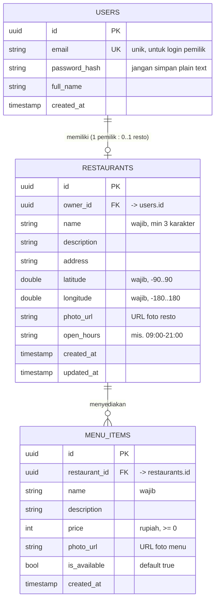

# ERD & Kontrak API, NearBite (Proyek Akhir)

## 0. Cara memakai dokumen ini

- Skema di §2 adalah **acuan minimum**. Kamu boleh menambah kolom, **tidak boleh mengurangi** entitas inti (`users`, `restaurants`, `menu_items`).
- Bila memakai **Supabase**: jalankan DDL §3 di SQL Editor, lalu REST otomatis tersedia di `https://<project>.supabase.co/rest/v1/<table>`. Auth memakai Supabase Auth (§5.1).
- Bila memakai **backend sendiri**: implementasikan endpoint §4 dengan bentuk JSON §6.
- Nama field JSON di dokumen ini memakai `snake_case` (konvensi umum REST/Postgres). Di Dart, petakan ke `camelCase` lewat `fromJson`/`toJson`.

---

## 1. ERD



### 1.1 Penjelasan relasi

| Relasi | Kardinalitas | Alasan |
|---|---|---|
| `users` → `restaurants` | 1 : 0..1 | Satu pemilik mengelola satu resto (cukup untuk scope ini). Bila ingin multi-resto, ubah ke 1 : N, konsekuensinya UI owner butuh daftar resto. |
| `restaurants` → `menu_items` | 1 : N | Satu resto punya banyak menu. Menghapus resto harus menghapus menunya (`ON DELETE CASCADE`). |

### 1.2 Catatan desain penting

- **`price` disimpan sebagai `INTEGER` (rupiah penuh), bukan `float`.** Bilangan pecahan biner tidak akurat untuk uang; `25000` lebih aman daripada `25000.0`. Format ke `Rp25.000` hanya saat menampilkan.
- **`latitude`/`longitude` sebagai `DOUBLE PRECISION`**, bukan string. Jarak dihitung di aplikasi (Haversine, §7).
- **Jangan menyimpan password plain text.** Dengan Supabase Auth, password ditangani Supabase dan tabel `users`-mu cukup menyimpan profil. Dengan backend sendiri, hash memakai bcrypt/argon2.
- **Foto disimpan sebagai URL**, bukan base64 di kolom teks. Upload ke Supabase Storage/Cloudinary lalu simpan URL-nya.

---

## 2. Kamus data

### 2.1 `users`

| Kolom | Tipe | Wajib | Aturan |
|---|---|:---:|---|
| `id` | uuid | ya | PK |
| `email` | text | ya | unik, format email |
| `password_hash` | text | ya* | *tidak perlu bila memakai Supabase Auth |
| `full_name` | text | ya | min 3 karakter |
| `created_at` | timestamptz | ya | default `now()` |

### 2.2 `restaurants`

| Kolom | Tipe | Wajib | Aturan |
|---|---|:---:|---|
| `id` | uuid | ya | PK |
| `owner_id` | uuid | ya | FK → `users.id` |
| `name` | text | ya | min 3 karakter |
| `description` | text | tidak | boleh `''` |
| `address` | text | tidak | |
| `latitude` | double | ya | −90..90 |
| `longitude` | double | ya | −180..180 |
| `photo_url` | text | tidak | URL valid bila diisi |
| `open_hours` | text | tidak | mis. `"09:00-21:00"` |
| `created_at` / `updated_at` | timestamptz | ya | default `now()` |

### 2.3 `menu_items`

| Kolom | Tipe | Wajib | Aturan |
|---|---|:---:|---|
| `id` | uuid | ya | PK |
| `restaurant_id` | uuid | ya | FK → `restaurants.id`, cascade delete |
| `name` | text | ya | min 1 karakter |
| `description` | text | tidak | |
| `price` | integer | ya | ≥ 0 |
| `photo_url` | text | tidak | |
| `is_available` | boolean | ya | default `true` |
| `created_at` | timestamptz | ya | default `now()` |

---

## 3. DDL PostgreSQL / Supabase (siap tempel)

```sql
-- 1. Tabel profil pengguna
create table if not exists public.users (
  id            uuid primary key default gen_random_uuid(),
  email         text not null unique,
  password_hash text,                    -- kosongkan bila memakai Supabase Auth
  full_name     text not null,
  created_at    timestamptz not null default now()
);

-- 2. Tabel resto
create table if not exists public.restaurants (
  id          uuid primary key default gen_random_uuid(),
  owner_id    uuid not null references public.users(id) on delete cascade,
  name        text not null check (char_length(name) >= 3),
  description text default '',
  address     text default '',
  latitude    double precision not null check (latitude between -90 and 90),
  longitude   double precision not null check (longitude between -180 and 180),
  photo_url   text,
  open_hours  text,
  created_at  timestamptz not null default now(),
  updated_at  timestamptz not null default now()
);

-- 3. Tabel menu
create table if not exists public.menu_items (
  id            uuid primary key default gen_random_uuid(),
  restaurant_id uuid not null references public.restaurants(id) on delete cascade,
  name          text not null check (char_length(name) >= 1),
  description   text default '',
  price         integer not null check (price >= 0),
  photo_url     text,
  is_available  boolean not null default true,
  created_at    timestamptz not null default now()
);

-- 4. Index untuk pencarian & join
create index if not exists idx_menu_items_restaurant on public.menu_items(restaurant_id);
create index if not exists idx_restaurants_owner     on public.restaurants(owner_id);
create index if not exists idx_restaurants_name      on public.restaurants(lower(name));
create index if not exists idx_menu_items_name       on public.menu_items(lower(name));
```

### 3.1 Data seed (minimal 8 resto, koordinat sekitar Yogyakarta)

Sesuaikan koordinat dengan lokasimu agar jarak terlihat masuk akal saat demo.

```sql
-- Owner contoh
insert into public.users (id, email, full_name) values
  ('11111111-1111-1111-1111-111111111111', 'owner1@nearbite.test', 'Owner Satu'),
  ('22222222-2222-2222-2222-222222222222', 'owner2@nearbite.test', 'Owner Dua')
on conflict (email) do nothing;

insert into public.restaurants (owner_id, name, description, address, latitude, longitude, open_hours) values
  ('11111111-1111-1111-1111-111111111111', 'Warung Gudeg Bu Sri',  'Gudeg khas Jogja',        'Jl. Kaliurang KM 5',  -7.7620, 110.3790, '06:00-14:00'),
  ('11111111-1111-1111-1111-111111111111', 'Bakmi Jawa Pak Karto', 'Bakmi godog & goreng',    'Jl. Kaliurang KM 7',  -7.7480, 110.3810, '17:00-23:00'),
  ('11111111-1111-1111-1111-111111111111', 'Sate Klathak Pak Din', 'Sate kambing klathak',    'Jl. Imogiri Timur',   -7.8700, 110.3900, '18:00-24:00'),
  ('22222222-2222-2222-2222-222222222222', 'Ayam Geprek Mbak Tin', 'Geprek level 1-10',       'Jl. Seturan Raya',    -7.7710, 110.4020, '10:00-22:00'),
  ('22222222-2222-2222-2222-222222222222', 'Soto Sapi Pak Man',    'Soto sapi kuah bening',   'Jl. Gejayan',         -7.7770, 110.3880, '07:00-15:00'),
  ('22222222-2222-2222-2222-222222222222', 'Nasi Padang Sederhana','Masakan Padang',          'Jl. Solo KM 8',       -7.7830, 110.4150, '09:00-21:00'),
  ('11111111-1111-1111-1111-111111111111', 'Kopi Tetes Malioboro', 'Kopi & roti bakar',       'Jl. Malioboro',       -7.7930, 110.3660, '08:00-23:00'),
  ('22222222-2222-2222-2222-222222222222', 'Seafood Bu Nur',       'Ikan bakar & cumi',       'Jl. Wates KM 4',      -7.8150, 110.3300, '16:00-23:00');

-- Menu contoh (ulangi pola ini untuk resto lain)
insert into public.menu_items (restaurant_id, name, description, price)
select id, 'Gudeg Komplit', 'Gudeg, telur, ayam, krecek', 25000 from public.restaurants where name = 'Warung Gudeg Bu Sri';
insert into public.menu_items (restaurant_id, name, description, price)
select id, 'Gudeg Telur',   'Gudeg dengan telur',        18000 from public.restaurants where name = 'Warung Gudeg Bu Sri';
insert into public.menu_items (restaurant_id, name, description, price)
select id, 'Bakmi Godog',   'Bakmi kuah rebus',          20000 from public.restaurants where name = 'Bakmi Jawa Pak Karto';
insert into public.menu_items (restaurant_id, name, description, price)
select id, 'Ayam Geprek',   'Ayam geprek sambal bawang', 15000 from public.restaurants where name = 'Ayam Geprek Mbak Tin';
```

### 3.2 Row Level Security (Supabase)

Supabase mengaktifkan RLS pada tabel publik. Kebijakan minimum agar app berjalan:

```sql
alter table public.restaurants enable row level security;
alter table public.menu_items  enable row level security;

-- Baca bersifat PUBLIK: pencari memakai app tanpa login (anon key saja).
-- `using (true)` berlaku untuk role anon maupun authenticated.
create policy "public read restaurants" on public.restaurants for select using (true);
create policy "public read menu"        on public.menu_items  for select using (true);

-- Hanya pemilik yang boleh mengubah restonya
create policy "owner writes own restaurant" on public.restaurants
  for all using (auth.uid() = owner_id) with check (auth.uid() = owner_id);

-- Hanya pemilik resto terkait yang boleh mengubah menunya
create policy "owner writes own menu" on public.menu_items
  for all using (
    exists (select 1 from public.restaurants r
            where r.id = menu_items.restaurant_id and r.owner_id = auth.uid())
  );
```

> **Bila datamu tidak muncul padahal tabel terisi**, RLS adalah tersangka pertama. Gejalanya: response `200` dengan array kosong `[]`, bukan error. Catat ini, sering muncul sebagai bug saat demo.

> **Uji khusus mode pencari:** buka daftar resto **dalam keadaan belum login** (atau panggil endpoint hanya dengan `apikey` anon, tanpa JWT pengguna). Bila kosong saat belum login tetapi terisi setelah login, berarti policy `select` masih menuntut `auth.uid()`, ini melanggar requirement §4.1 brief.

---

## 4. Endpoint REST

### 4.1 Bentuk Supabase (otomatis)

Base URL: `https://<project>.supabase.co/rest/v1`
Header wajib: `apikey: <anon-key>` dan `Authorization: Bearer <anon-key atau user-jwt>`

| Tujuan | Request |
|---|---|
| Semua resto | `GET /restaurants?select=*` |
| Resto + menunya sekaligus | `GET /restaurants?select=*,menu_items(*)` |
| Detail satu resto + menu | `GET /restaurants?id=eq.<id>&select=*,menu_items(*)` |
| Cari resto by nama | `GET /restaurants?name=ilike.*<query>*` |
| Cari resto by nama menu | `GET /restaurants?select=*,menu_items!inner(*)&menu_items.name=ilike.*<query>*` |
| Menu satu resto | `GET /menu_items?restaurant_id=eq.<id>&order=price.asc` |
| Tambah menu | `POST /menu_items` + body JSON |
| Ubah menu | `PATCH /menu_items?id=eq.<id>` + body JSON |
| Hapus menu | `DELETE /menu_items?id=eq.<id>` |
| Simpan/ubah profil resto | `POST /restaurants` atau `PATCH /restaurants?id=eq.<id>` |

> `Prefer: return=representation` pada POST/PATCH agar server mengembalikan baris hasilnya.

### 4.2 Bentuk backend sendiri (bila tidak memakai Supabase)

| Method | Path | Auth | Sukses | Gagal umum |
|---|---|:---:|---|---|
| `POST` | `/auth/register` | – | `201` + user + token | `409` email terpakai, `422` validasi |
| `POST` | `/auth/login` | – | `200` + user + token | `401` kredensial salah |
| `GET` | `/restaurants` | – | `200` + array resto | `500` |
| `GET` | `/restaurants?q=<query>` | – | `200` + array (cocok nama resto **atau** nama menu) | `500` |
| `GET` | `/restaurants/:id` | – | `200` + resto **beserta** `menu_items` | `404` |
| `POST` | `/restaurants` | ✅ owner | `201` + resto | `401`, `422` |
| `PATCH` | `/restaurants/:id` | ✅ owner | `200` + resto | `401`, `403`, `404` |
| `GET` | `/restaurants/:id/menu` | – | `200` + array menu | `404` |
| `POST` | `/menu-items` | ✅ owner | `201` + menu | `401`, `422` |
| `PATCH` | `/menu-items/:id` | ✅ owner | `200` + menu | `401`, `403`, `404` |
| `DELETE` | `/menu-items/:id` | ✅ owner | `204` | `401`, `403`, `404` |

---

## 5. Autentikasi

### 5.1 Supabase Auth (disarankan)

```dart
// Register
final res = await supabase.auth.signUp(
  email: email,
  password: password,
  data: {'full_name': fullName},
);

// Login
final res = await supabase.auth.signInWithPassword(email: email, password: password);

// Sesi tersimpan otomatis oleh supabase_flutter; token aktif:
final token = supabase.auth.currentSession?.accessToken;

// Logout
await supabase.auth.signOut();
```

Setelah register, **buat baris profil** di `public.users` dengan `id` = `auth.uid()` agar `owner_id` pada resto dapat merujuknya (bisa lewat trigger `on auth.user created` atau insert manual dari app).

### 5.2 Backend sendiri

```
POST /auth/login  { "email": "...", "password": "..." }
→ 200 { "token": "<jwt>", "user": { "id": "...", "full_name": "..." } }
```

Simpan `token` (mis. `SharedPreferences`), kirim sebagai `Authorization: Bearer <token>`, hapus saat logout.

> **Jangan pernah** menyimpan password di perangkat. Simpan **token** saja.

---

## 6. Bentuk objek JSON

### 6.1 Restaurant (dengan menu)

```json
{
  "id": "3f1c2b8a-0000-4a1b-9c2d-000000000001",
  "owner_id": "11111111-1111-1111-1111-111111111111",
  "name": "Warung Gudeg Bu Sri",
  "description": "Gudeg khas Jogja",
  "address": "Jl. Kaliurang KM 5",
  "latitude": -7.7620,
  "longitude": 110.3790,
  "photo_url": "https://storage.example/resto/gudeg.jpg",
  "open_hours": "06:00-14:00",
  "created_at": "2026-08-10T03:00:00.000Z",
  "menu_items": [
    {
      "id": "9a8b7c6d-0000-4e5f-8a9b-000000000010",
      "restaurant_id": "3f1c2b8a-0000-4a1b-9c2d-000000000001",
      "name": "Gudeg Komplit",
      "description": "Gudeg, telur, ayam, krecek",
      "price": 25000,
      "photo_url": "https://storage.example/menu/gudeg-komplit.jpg",
      "is_available": true,
      "created_at": "2026-08-10T03:00:00.000Z"
    }
  ]
}
```

### 6.2 Catatan parsing untuk Dart

| Field | Jebakan | Penanganan |
|---|---|---|
| `latitude`/`longitude` | JSON kadang mengirim `int` (mis. `110`) bila nilainya bulat | `(json['latitude'] as num).toDouble()` |
| `price` | Bisa datang sebagai `int` atau `String` tergantung backend | `int.parse(json['price'].toString())` atau `(json['price'] as num).toInt()` |
| `menu_items` | **Tidak ada** bila query tanpa `select=*,menu_items(*)` | `(json['menu_items'] as List?) ?? const []` |
| `photo_url` | Boleh `null` | tipe `String?` + placeholder di UI |
| `created_at` | String ISO-8601 | `DateTime.parse(...)` |
| Response list | Supabase mengirim **array langsung**; backend lain kadang `{"data": [...]}` | Cek tipe hasil `jsonDecode` (pola P05) |

---

## 7. Perhitungan jarak (Haversine)

Jarak dihitung **di sisi aplikasi**. Tulis sebagai fungsi murni terpisah agar dapat di-unit-test (requirement §4.4 brief).

```dart
import 'dart:math';

/// Jarak antar dua koordinat dalam kilometer (rumus Haversine).
double distanceInKm({
  required double lat1,
  required double lon1,
  required double lat2,
  required double lon2,
}) {
  const earthRadiusKm = 6371.0;
  final dLat = _toRadians(lat2 - lat1);
  final dLon = _toRadians(lon2 - lon1);

  final a = sin(dLat / 2) * sin(dLat / 2) +
      cos(_toRadians(lat1)) * cos(_toRadians(lat2)) * sin(dLon / 2) * sin(dLon / 2);

  return earthRadiusKm * 2 * atan2(sqrt(a), sqrt(1 - a));
}

double _toRadians(double degree) => degree * pi / 180;
```

### 7.1 Nilai acuan untuk unit test

| Kasus | Ekspektasi |
|---|---|
| Titik yang sama | `0` km |
| (−7.7620, 110.3790) → (−7.7480, 110.3810) | ≈ **1,57 km** (toleransi ±0,05) |
| (−7.7620, 110.3790) → (−7.8700, 110.3900) | ≈ **12,1 km** (toleransi ±0,2) |
| Urutan argumen dibalik | jarak sama (simetris) |

> Pakai `closeTo(expected, tolerance)` dari `package:test`, jangan `equals`, karena hasilnya bilangan pecahan.

---

## 8. Checklist kesiapan backend

- [ ] Tiga tabel (`users`, `restaurants`, `menu_items`) terbentuk dengan constraint §3.
- [ ] Seed **≥ 8 resto** dengan koordinat **tersebar** (bukan berdekatan semua) + ≥ 2 menu untuk beberapa resto.
- [ ] `GET` resto mengembalikan data saat dipanggil dari **aplikasi dalam keadaan belum login** (uji RLS anon!).
- [ ] Endpoint detail mengembalikan resto **beserta menunya**.
- [ ] Register + login mengembalikan token yang dapat dipakai untuk menulis data.
- [ ] Menulis data (POST/PATCH/DELETE) **ditolak** bila tanpa token, tetapi membaca tetap berhasil tanpa token.
- [ ] Owner A **tidak dapat** mengubah menu milik owner B (uji RLS/otorisasi).
- [ ] Base URL & key hanya lewat `--dart-define`, tidak ada di source.
- [ ] Backend **hidup dan sudah diuji dari jaringan yang akan dipakai saat demo** (brief §4.6.1).
