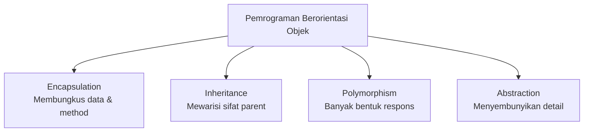
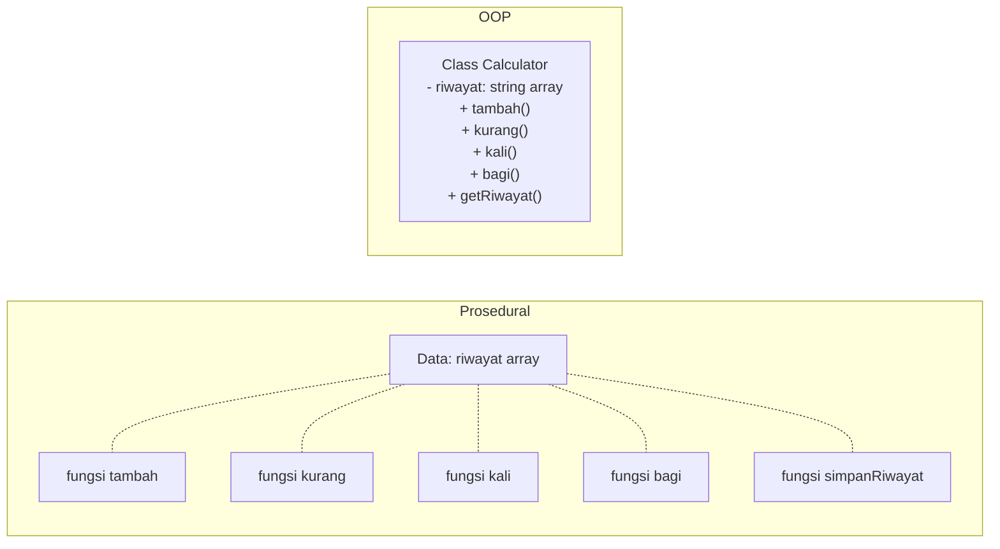

> **Mata Kuliah:** Pemrograman Berorientasi Objek
> **Minggu:** 1
> **Bagian:** Fundamentals
> **Bahasa:** TypeScript 5.x

---

## Capaian Pembelajaran Modul

Setelah mempelajari modul ini, mahasiswa mampu:
1. Menjelaskan perbedaan paradigma pemrograman prosedural dan berorientasi objek
2. Menyebutkan dan mendeskripsikan 4 pilar utama OOP (Encapsulation, Inheritance, Polymorphism, Abstraction)
3. Melakukan instalasi dan konfigurasi environment TypeScript dengan `strict: true`
4. Menulis dan menjalankan program TypeScript pertama
5. Membandingkan syntax dasar C++/PHP dengan TypeScript

---

## Prasyarat

- Pemrograman dasar (C++ atau bahasa prosedural lainnya)
- Pemahaman dasar pemrograman web (HTML, JavaScript dasar)
- Komputer dengan akses internet untuk instalasi tools

---

## Daftar Isi

- [1. Pendahuluan](#1-pendahuluan)
- [2. Landasan Konsep](#2-landasan-konsep)
- [3. Implementasi dalam TypeScript](#3-implementasi-dalam-typescript)
- [4. Perbandingan Lintas Bahasa](#4-perbandingan-lintas-bahasa)
- [5. Studi Kasus: Prosedural vs OOP](#5-studi-kasus-prosedural-vs-oop)
- [6. Kesalahan Umum & Best Practices](#6-kesalahan-umum--best-practices)
- [7. Ringkasan](#7-ringkasan)
- [8. Latihan Mandiri](#8-latihan-mandiri)

---

## 1. Pendahuluan

Selama semester-semester awal, kalian telah belajar menulis program secara **prosedural**, kode dieksekusi baris per baris, dari atas ke bawah, menggunakan fungsi-fungsi untuk mengorganisir logika. Pendekatan ini bekerja dengan baik untuk program kecil, namun ketika skala aplikasi membesar, puluhan ribu baris kode, banyak developer bekerja bersamaan, pendekatan prosedural mulai menunjukkan kelemahannya.

**Pemrograman Berorientasi Objek (OOP)** adalah paradigma yang dirancang untuk mengatasi kompleksitas tersebut. Dalam OOP, kita memodelkan dunia nyata ke dalam **objek-objek** yang memiliki data (properties) dan perilaku (methods), lalu objek-objek ini berinteraksi satu sama lain.

Di mata kuliah ini, kita akan mempelajari OOP menggunakan **TypeScript**, sebuah bahasa yang dibangun di atas JavaScript dengan menambahkan type system yang kuat. Mengapa TypeScript? Karena TypeScript memberikan keseimbangan antara kemudahan belajar (bagi yang sudah kenal JavaScript) dan ketegasan type system (yang esensial untuk memahami OOP secara benar).

> 💡 **Insight:** Konsep OOP bersifat *universal*, tidak terikat pada satu bahasa pemrograman. Setelah menguasai OOP di TypeScript, kalian akan dengan mudah menerapkannya di Java, Dart (Flutter), C#, Python, dan bahasa lainnya.

---

## 2. Landasan Konsep

### 2.1 Paradigma Pemrograman

*Paradigma pemrograman* adalah cara atau gaya berpikir dalam menyelesaikan masalah melalui kode. Dua paradigma utama yang perlu dipahami:

#### Paradigma Prosedural

Pada paradigma prosedural, program disusun sebagai urutan instruksi (prosedur/fungsi) yang memanipulasi data. Data dan fungsi terpisah, fungsi menerima data sebagai parameter, memprosesnya, dan mengembalikan hasil.

Karakteristik utama:
- Eksekusi **top-down** (atas ke bawah)
- Data dan fungsi **terpisah**
- Fokus pada **"bagaimana cara melakukan sesuatu"** (how)
- Contoh bahasa: C, Pascal, bagian prosedural dari C++ dan PHP

#### Paradigma Berorientasi Objek (OOP)

Pada paradigma OOP, program disusun sebagai kumpulan **objek** yang saling berinteraksi. Setiap objek membungkus data dan fungsi yang berkaitan menjadi satu kesatuan.

Karakteristik utama:
- Program terdiri dari **objek-objek** yang berinteraksi
- Data dan fungsi **dibungkus** dalam satu unit (class)
- Fokus pada **"apa yang bisa dilakukan objek"** (what)
- Contoh bahasa: Java, C#, TypeScript, Dart, Python

> 🔑 **Konsep Kunci:** Perbedaan mendasar antara prosedural dan OOP bukan pada syntax, melainkan pada **cara berpikir**. Prosedural berpikir dalam langkah-langkah (step-by-step), sedangkan OOP berpikir dalam entitas/objek dan interaksinya.

#### Mengapa OOP?

OOP populer di dunia industri karena beberapa alasan:

1. **Modularitas**: Kode terbagi dalam unit-unit (class) yang independen, mudah di-maintain
2. **Reusability**: Class bisa digunakan ulang di project lain tanpa modifikasi
3. **Scalability**: Mudah menambah fitur baru tanpa mengubah kode yang sudah ada
4. **Kolaborasi**: Tim developer bisa bekerja pada class yang berbeda secara paralel
5. **Mendekati dunia nyata**: Objek dalam kode merepresentasikan entitas nyata (User, Produk, Transaksi)

### 2.2 Empat Pilar OOP

OOP memiliki 4 pilar fundamental yang menjadi fondasi paradigma ini. Di modul 1 ini kita hanya berkenalan secara overview, masing-masing pilar akan dibahas mendalam di modul-modul selanjutnya.

#### 1. Encapsulation (Enkapsulasi)

*Encapsulation* adalah mekanisme membungkus data dan method yang beroperasi pada data tersebut ke dalam satu unit (class), serta **membatasi akses langsung** ke beberapa komponen internal.

Analogi: Bayangkan mesin ATM. Kita hanya berinteraksi melalui layar dan tombol (interface publik), namun mekanisme internal seperti perhitungan saldo dan koneksi ke server bank tersembunyi di dalam mesin (private).

#### 2. Inheritance (Pewarisan)

*Inheritance* adalah mekanisme di mana sebuah class (child/subclass) dapat **mewarisi** properties dan methods dari class lain (parent/superclass), sehingga menghindari duplikasi kode.

Analogi: Semua kendaraan memiliki properti umum (roda, mesin, warna). Mobil, motor, dan truk adalah "turunan" dari kendaraan yang mewarisi properti umum tersebut, namun masing-masing punya karakteristik tambahan.

#### 3. Polymorphism (Polimorfisme)

*Polymorphism* (dari bahasa Yunani: "banyak bentuk") adalah kemampuan objek untuk **merespons pesan/perintah yang sama dengan cara yang berbeda** tergantung tipe objeknya.

Analogi: Perintah "bergerak" kepada burung menghasilkan terbang, kepada ikan menghasilkan berenang, kepada ular menghasilkan merayap. Perintah sama, respons berbeda.

#### 4. Abstraction (Abstraksi)

*Abstraction* adalah proses **menyembunyikan detail implementasi** dan hanya menampilkan fungsionalitas yang relevan kepada pengguna.

Analogi: Saat mengemudi mobil, kita hanya perlu tahu cara menekan gas, rem, dan memutar setir. Kita tidak perlu memahami bagaimana mesin pembakaran internal bekerja.



---

## 3. Implementasi dalam TypeScript

### 3.1 Mengapa TypeScript?

TypeScript adalah **superset** dari JavaScript, artinya semua kode JavaScript yang valid juga merupakan kode TypeScript yang valid. TypeScript menambahkan fitur utama berupa **static type system** yang membantu menangkap error sejak waktu kompilasi (compile-time), bukan saat program dijalankan (runtime).

Keunggulan TypeScript untuk belajar OOP:
- **Type safety**: memaksa programmer mendeklarasikan tipe data, mirip Java
- **Modern syntax**: mendukung `class`, `interface`, `abstract`, `generics` layaknya bahasa OOP murni
- **Strict mode**: dengan `strict: true`, TypeScript menjadi sangat ketat dalam pengecekan tipe
- **Ecosystem besar**: digunakan oleh Angular, React (opsional), NestJS, dan banyak framework modern

### 3.2 Instalasi Environment

#### Langkah 1: Install Node.js

Node.js adalah runtime yang memungkinkan kita menjalankan JavaScript/TypeScript di luar browser.

1. Download dari [nodejs.org](https://nodejs.org/), pilih versi **LTS (Long Term Support)**
2. Ikuti wizard instalasi
3. Verifikasi instalasi:

```bash
node --version   # Minimal v18.x
npm --version    # Biasanya ikut terinstall
```

#### Langkah 2: Install TypeScript

```bash
npm install -g typescript
tsc --version    # Minimal v5.x
```

#### Langkah 3: Install tsx (TypeScript Execute)

`tsx` memungkinkan kita menjalankan file TypeScript langsung tanpa compile manual:

```bash
npm install -g tsx
```

#### Langkah 4: Install VS Code

Download dan install [Visual Studio Code](https://code.visualstudio.com/). Extension yang direkomendasikan:
- **TypeScript** (built-in)
- **Error Lens**: menampilkan error langsung di baris kode
- **Prettier**: auto-formatting

### 3.3 Konfigurasi Project TypeScript

Setiap project TypeScript memerlukan file `tsconfig.json` yang mendefinisikan bagaimana TypeScript compiler bekerja.

Buat folder project dan inisialisasi:

```bash
mkdir belajar-oop
cd belajar-oop
npm init -y
tsc --init
```

Kemudian edit `tsconfig.json` dengan konfigurasi berikut:

```json
{
  "compilerOptions": {
    "strict": true,
    "noImplicitAny": true,
    "strictNullChecks": true,
    "strictPropertyInitialization": true,
    "noImplicitOverride": true,
    "target": "ES2022",
    "module": "NodeNext",
    "moduleResolution": "NodeNext",
    "outDir": "./dist",
    "rootDir": "./src"
  },
  "include": ["src/**/*"]
}
```

> ⚠️ **Perhatian:** Setting `strict: true` adalah **wajib** di mata kuliah ini. Tanpa strict mode, TypeScript menjadi terlalu permisif dan tidak akan membantu kalian belajar OOP dengan benar. Jangan pernah set `strict: false`!

Buat folder `src/` dan file pertama:

```bash
mkdir src
```

### 3.4 Program TypeScript Pertama

Buat file `src/hello.ts`:

```typescript
// Deklarasi variabel dengan type annotation
const nama: string = "Budi";
const umur: number = 20;
const aktif: boolean = true;

// Function dengan type annotation pada parameter dan return
function spiamkan(pesan: string): void {
    console.log(pesan);
}

spiamkan(`Halo, nama saya ${nama}, umur ${umur} tahun.`);
// Output: "Halo, nama saya Budi, umur 20 tahun."
```

Menjalankan program:

```bash
# Cara 1: Compile lalu jalankan
tsc
node dist/hello.js

# Cara 2: Langsung jalankan dengan tsx (lebih praktis untuk development)
tsx src/hello.ts
```

### 3.5 Type System Dasar TypeScript

Sebelum masuk ke OOP, kita perlu memahami type system dasar TypeScript:

```typescript
// Tipe primitif
const nama: string = "Alice";
const umur: number = 21;
const aktif: boolean = true;

// Array
const nilai: number[] = [85, 90, 78];
const hobi: Array<string> = ["coding", "gaming"];

// Object type
const mahasiswa: { nama: string; nim: string; ipk: number } = {
    nama: "Budi",
    nim: "2024001",
    ipk: 3.75
};

// Union type: bisa salah satu dari beberapa tipe
let status: string | number = "aktif";
status = 1; // juga valid

// Type alias: memberi nama pada tipe
type Mahasiswa = {
    nama: string;
    nim: string;
    ipk: number;
};

const mhs: Mahasiswa = {
    nama: "Citra",
    nim: "2024002",
    ipk: 3.85
};

// Function type
function hitungRataRata(nilai: number[]): number {
    const total = nilai.reduce((sum, n) => sum + n, 0);
    return total / nilai.length;
}

console.log(hitungRataRata([85, 90, 78]));
// Output: 84.33333333333333
```

> 💡 **Insight:** Type system TypeScript jauh lebih ekspresif dibandingkan C++ atau Java. Fitur seperti union types, literal types, dan type alias membuat kode lebih aman tanpa mengorbankan fleksibilitas.

### 3.6 Preview: Prosedural vs OOP di TypeScript

Mari lihat perbedaan pendekatan prosedural dan OOP dalam menyelesaikan masalah yang sama, mengelola data mahasiswa:

**Pendekatan Prosedural:**

```typescript
// Data terpisah dari fungsi
type DataMahasiswa = {
    nama: string;
    nim: string;
    nilai: number[];
};

function buatMahasiswa(nama: string, nim: string): DataMahasiswa {
    return { nama, nim, nilai: [] };
}

function tambahNilai(mhs: DataMahasiswa, nilai: number): void {
    mhs.nilai.push(nilai);
}

function hitungIPK(mhs: DataMahasiswa): number {
    if (mhs.nilai.length === 0) return 0;
    const total = mhs.nilai.reduce((sum, n) => sum + n, 0);
    return total / mhs.nilai.length;
}

function tampilkanInfo(mhs: DataMahasiswa): string {
    return `${mhs.nama} (${mhs.nim}) - IPK: ${hitungIPK(mhs).toFixed(2)}`;
}

// Penggunaan
const budi = buatMahasiswa("Budi", "2024001");
tambahNilai(budi, 3.5);
tambahNilai(budi, 3.8);
console.log(tampilkanInfo(budi));
// Output: "Budi (2024001) - IPK: 3.65"
```

**Pendekatan OOP:**

```typescript
// Data dan fungsi dibungkus dalam satu class
class Mahasiswa {
    private nilai: number[] = [];

    constructor(
        private nama: string,
        private nim: string
    ) {}

    tambahNilai(nilai: number): void {
        this.nilai.push(nilai);
    }

    hitungIPK(): number {
        if (this.nilai.length === 0) return 0;
        const total = this.nilai.reduce((sum, n) => sum + n, 0);
        return total / this.nilai.length;
    }

    tampilkanInfo(): string {
        return `${this.nama} (${this.nim}) - IPK: ${this.hitungIPK().toFixed(2)}`;
    }
}

// Penggunaan: lebih natural dan terbaca
const budi = new Mahasiswa("Budi", "2024001");
budi.tambahNilai(3.5);
budi.tambahNilai(3.8);
console.log(budi.tampilkanInfo());
// Output: "Budi (2024001) - IPK: 3.65"
```

Perhatikan bagaimana versi OOP lebih **terorganisir**, data (`nama`, `nim`, `nilai`) dan perilaku (`tambahNilai`, `hitungIPK`, `tampilkanInfo`) dibungkus menjadi satu kesatuan di dalam class `Mahasiswa`.

---

## 4. Perbandingan Lintas Bahasa

Berikut perbandingan syntax dasar antara C++ (yang sudah kalian pelajari), TypeScript, Java, dan Dart:

| Aspek | C++ | TypeScript | Java | Dart |
|-------|-----|-----------|------|------|
| Deklarasi variabel | `int x = 5;` | `let x: number = 5;` | `int x = 5;` | `int x = 5;` |
| String | `string s = "hi";` | `let s: string = "hi";` | `String s = "hi";` | `String s = 'hi';` |
| Array/List | `vector<int> v;` | `let v: number[] = [];` | `List<Integer> v;` | `List<int> v = [];` |
| Function | `int add(int a, int b)` | `function add(a: number, b: number): number` | `int add(int a, int b)` | `int add(int a, int b)` |
| Print | `cout << "hi";` | `console.log("hi");` | `System.out.println("hi");` | `print('hi');` |
| Compile | `g++ file.cpp` | `tsc file.ts` | `javac File.java` | `dart compile exe file.dart` |
| Run | `./a.out` | `node file.js` | `java File` | `./file.exe` |

```cpp
// C++: yang sudah kalian kenal
#include <iostream>
#include <string>
using namespace std;

int main() {
    string nama = "Budi";
    int umur = 20;
    cout << "Halo, " << nama << "! Umur: " << umur << endl;
    return 0;
}
```

```typescript
// TypeScript: yang akan kita pelajari
const nama: string = "Budi";
const umur: number = 20;
console.log(`Halo, ${nama}! Umur: ${umur}`);
// Output: "Halo, Budi! Umur: 20"
```

```java
// Java: untuk perbandingan
public class Main {
    public static void main(String[] args) {
        String nama = "Budi";
        int umur = 20;
        System.out.println("Halo, " + nama + "! Umur: " + umur);
    }
}
```

```dart
// Dart: untuk perbandingan (akan ketemu di Flutter nanti)
void main() {
    String nama = 'Budi';
    int umur = 20;
    print('Halo, $nama! Umur: $umur');
}
```

> 🔄 **Perbandingan:** Perhatikan bahwa konsep dasar (variabel, tipe data, print) ada di semua bahasa. Yang berbeda hanya **syntax** dan **konvensi**. Pemahaman konsep jauh lebih penting daripada menghafal syntax.

---

## 5. Studi Kasus: Prosedural vs OOP

### 5.1 Deskripsi Masalah

Kita diminta membuat program **Kalkulator Sederhana** yang dapat melakukan operasi penjumlahan, pengurangan, perkalian, dan pembagian. Program juga harus menyimpan riwayat operasi.

### 5.2 Desain Solusi

Kita akan membandingkan dua pendekatan:



### 5.3 Implementasi

**Pendekatan Prosedural:**

```typescript
// === Pendekatan Prosedural ===
const riwayat: string[] = [];

function tambah(a: number, b: number): number {
    const hasil = a + b;
    riwayat.push(`${a} + ${b} = ${hasil}`);
    return hasil;
}

function kurang(a: number, b: number): number {
    const hasil = a - b;
    riwayat.push(`${a} - ${b} = ${hasil}`);
    return hasil;
}

function kali(a: number, b: number): number {
    const hasil = a * b;
    riwayat.push(`${a} × ${b} = ${hasil}`);
    return hasil;
}

function bagi(a: number, b: number): number {
    if (b === 0) {
        throw new Error("Tidak bisa membagi dengan nol!");
    }
    const hasil = a / b;
    riwayat.push(`${a} ÷ ${b} = ${hasil}`);
    return hasil;
}

function tampilkanRiwayat(): void {
    console.log("=== Riwayat Operasi ===");
    riwayat.forEach((r, i) => console.log(`${i + 1}. ${r}`));
}

// Penggunaan
console.log(tambah(10, 5));     // Output: 15
console.log(kali(3, 7));        // Output: 21
console.log(bagi(20, 4));       // Output: 5
tampilkanRiwayat();
// Output:
// === Riwayat Operasi ===
// 1. 10 + 5 = 15
// 2. 3 × 7 = 21
// 3. 20 ÷ 4 = 5
```

**Pendekatan OOP:**

```typescript
// === Pendekatan OOP ===
class Calculator {
    private riwayat: string[] = [];

    tambah(a: number, b: number): number {
        const hasil = a + b;
        this.simpanRiwayat(`${a} + ${b} = ${hasil}`);
        return hasil;
    }

    kurang(a: number, b: number): number {
        const hasil = a - b;
        this.simpanRiwayat(`${a} - ${b} = ${hasil}`);
        return hasil;
    }

    kali(a: number, b: number): number {
        const hasil = a * b;
        this.simpanRiwayat(`${a} × ${b} = ${hasil}`);
        return hasil;
    }

    bagi(a: number, b: number): number {
        if (b === 0) {
            throw new Error("Tidak bisa membagi dengan nol!");
        }
        const hasil = a / b;
        this.simpanRiwayat(`${a} ÷ ${b} = ${hasil}`);
        return hasil;
    }

    private simpanRiwayat(operasi: string): void {
        this.riwayat.push(operasi);
    }

    tampilkanRiwayat(): void {
        console.log("=== Riwayat Operasi ===");
        this.riwayat.forEach((r, i) => console.log(`${i + 1}. ${r}`));
    }

    bersihkanRiwayat(): void {
        this.riwayat = [];
    }
}

// Penggunaan
const calc = new Calculator();
console.log(calc.tambah(10, 5));   // Output: 15
console.log(calc.kali(3, 7));      // Output: 21
console.log(calc.bagi(20, 4));     // Output: 5
calc.tampilkanRiwayat();
// Output:
// === Riwayat Operasi ===
// 1. 10 + 5 = 15
// 2. 3 × 7 = 21
// 3. 20 ÷ 4 = 5

// Bisa membuat kalkulator kedua dengan riwayat terpisah!
const calcIlmiah = new Calculator();
calcIlmiah.tambah(100, 200);
// riwayat calcIlmiah terpisah dari calc: ini kekuatan OOP!
```

### 5.4 Analisis

| Aspek | Prosedural | OOP |
|-------|-----------|-----|
| Organisasi | Data (`riwayat`) dan fungsi terpisah | Data dan method terbungkus dalam class |
| Multiple instance | Sulit, `riwayat` bersifat global | Mudah, setiap `new Calculator()` punya riwayat sendiri |
| Keamanan data | `riwayat` bisa diakses/dimodifikasi dari mana saja | `riwayat` bersifat `private`, hanya bisa diakses via method |
| Extensibility | Menambah fitur = menambah fungsi baru + modifikasi variabel global | Menambah fitur = menambah method baru di class |
| Reusability | Sulit dipindahkan ke project lain tanpa copy semua fungsi | Class bisa di-import dan digunakan di project manapun |

> 💡 **Insight:** Di contoh kecil seperti ini, perbedaannya mungkin terlihat subtle. Namun bayangkan jika aplikasinya memiliki ratusan entitas (User, Product, Order, Payment, dll.), tanpa OOP, kode akan sangat sulit dikelola.

---

## 6. Kesalahan Umum & Best Practices

### ❌ Tidak menggunakan `strict: true`

```json
// ❌ tsconfig.json tanpa strict mode
{
  "compilerOptions": {
    "target": "ES2022"
    // strict tidak diaktifkan: BAHAYA!
  }
}
```

Tanpa strict mode, TypeScript mengizinkan kode berbahaya seperti:

```typescript
// Tanpa strict: true, ini tidak error: padahal berbahaya!
function greet(name) {     // 'name' bertipe 'any' - hilangnya type safety
    console.log(name.toUpperCase());
}
greet(42); // Runtime error! 42 tidak punya method toUpperCase()
```

### ✅ Selalu aktifkan `strict: true`

```json
// ✅ tsconfig.json yang benar
{
  "compilerOptions": {
    "strict": true,
    "target": "ES2022",
    "module": "NodeNext",
    "moduleResolution": "NodeNext"
  }
}
```

```typescript
// Dengan strict: true, TypeScript akan menolak kode di atas:
function greet(name: string): void {  // Wajib deklarasi tipe
    console.log(name.toUpperCase());
}
greet(42); // Compile error! Argument of type 'number' is not assignable to parameter of type 'string'.
```

### ❌ Menggunakan `any` secara sembarangan

```typescript
// ❌ Menggunakan 'any' menghilangkan semua manfaat TypeScript
let data: any = "hello";
data = 42;
data = true;
data.foo.bar.baz(); // Tidak ada error saat compile, CRASH saat runtime!
```

### ✅ Gunakan tipe yang spesifik

```typescript
// ✅ Deklarasikan tipe yang spesifik
let nama: string = "hello";
let umur: number = 42;
let aktif: boolean = true;

// Jika tipe bisa lebih dari satu, gunakan union type
let id: string | number = "ABC123";
id = 456; // juga valid
```

---

## 7. Ringkasan

- **Paradigma prosedural** mengorganisir kode dalam fungsi-fungsi yang memanipulasi data secara terpisah, cocok untuk program kecil
- **Paradigma OOP** mengorganisir kode dalam objek-objek yang membungkus data dan perilaku, lebih cocok untuk program berskala besar
- **4 pilar OOP** adalah Encapsulation, Inheritance, Polymorphism, dan Abstraction, akan dibahas mendalam di modul selanjutnya
- **TypeScript** dipilih karena memiliki type system yang kuat dan mendukung fitur OOP secara lengkap
- **`strict: true`** pada `tsconfig.json` adalah konfigurasi wajib agar TypeScript benar-benar membantu kita belajar OOP dengan benar
- **Konsep OOP bersifat universal**: pemahaman yang didapat dari TypeScript bisa langsung ditransfer ke Java, Dart, C#, dan bahasa lainnya

---

## 8. Latihan Mandiri

1. **Pertanyaan Konseptual:** Sebutkan 3 contoh entitas dunia nyata yang cocok dimodelkan sebagai objek dalam program. Untuk masing-masing entitas, sebutkan minimal 3 properties (data) dan 2 methods (perilaku) yang dimilikinya.

2. **Mini Exercise:** Buat program TypeScript yang mendefinisikan type alias `Buku` dengan properties `judul` (string), `penulis` (string), `harga` (number), dan `stok` (number). Buat array berisi minimal 3 buku, lalu buat function `cariBuku(daftar: Buku[], keyword: string): Buku[]` yang mengembalikan buku-buku yang judulnya mengandung keyword tersebut. Pastikan program berjalan dengan `strict: true`.

3. **Analisis Kode:** Perhatikan kode berikut. Identifikasi masalah-masalah yang muncul dari pendekatan prosedural ini, dan jelaskan bagaimana OOP bisa menyelesaikan masalah tersebut:

   ```typescript
   let saldo1: number = 1000000;
   let saldo2: number = 500000;
   let riwayat1: string[] = [];
   let riwayat2: string[] = [];

   function transfer(
       dariSaldo: number,
       keSaldo: number,
       jumlah: number,
       dariRiwayat: string[],
       keRiwayat: string[]
   ): [number, number] {
       dariSaldo -= jumlah;
       keSaldo += jumlah;
       dariRiwayat.push(`Transfer keluar: ${jumlah}`);
       keRiwayat.push(`Transfer masuk: ${jumlah}`);
       return [dariSaldo, keSaldo];
   }

   [saldo1, saldo2] = transfer(saldo1, saldo2, 200000, riwayat1, riwayat2);
   ```

---

## Referensi & Bacaan Lanjutan

- TypeScript Official Handbook: https://www.typescriptlang.org/docs/handbook/
- TypeScript Playground (coba kode langsung di browser): https://www.typescriptlang.org/play
- Node.js Download: https://nodejs.org/
- Visual Studio Code: https://code.visualstudio.com/
- "Clean Code", Robert C. Martin (Bab 6: Objects and Data Structures)
