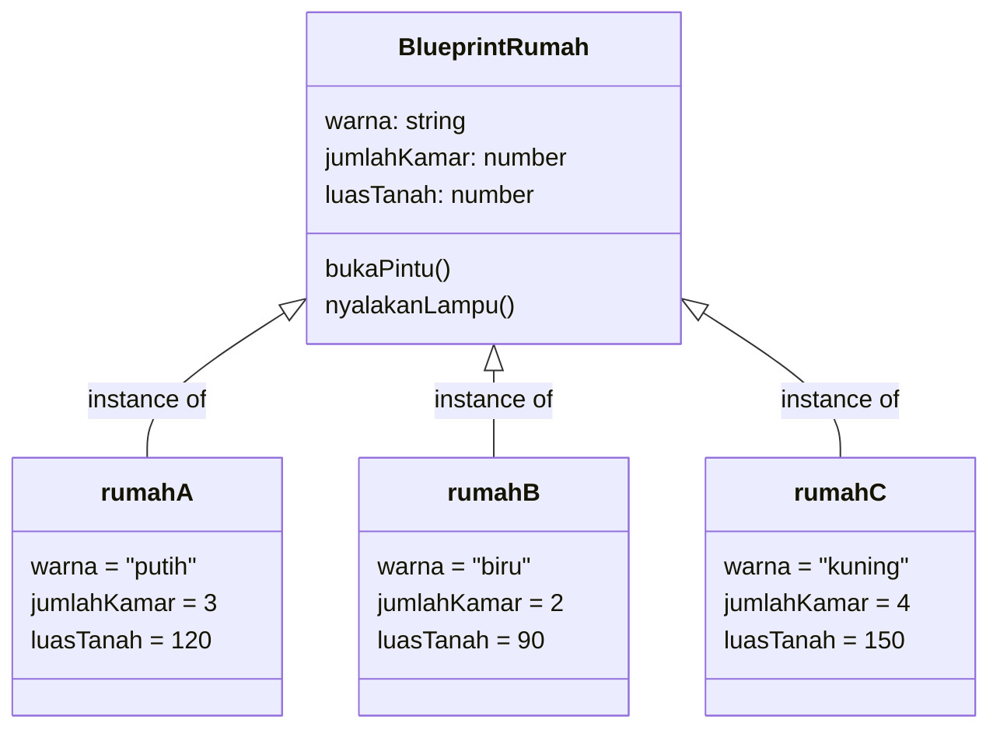
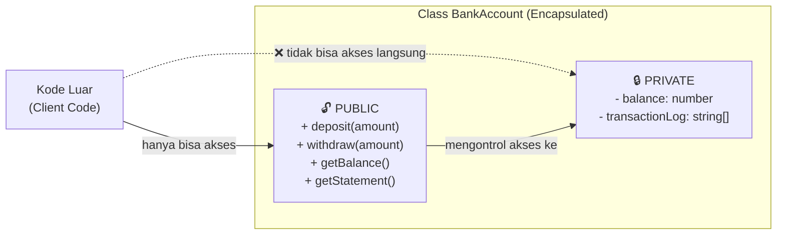
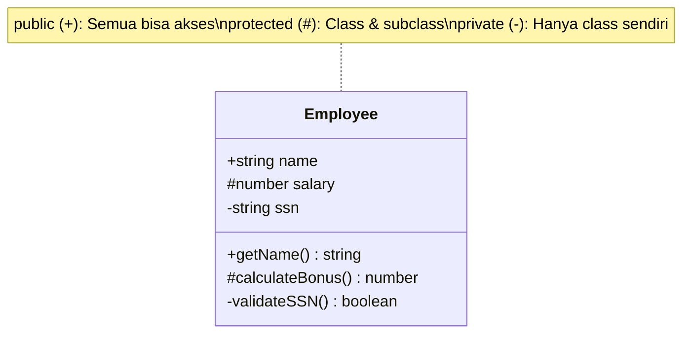
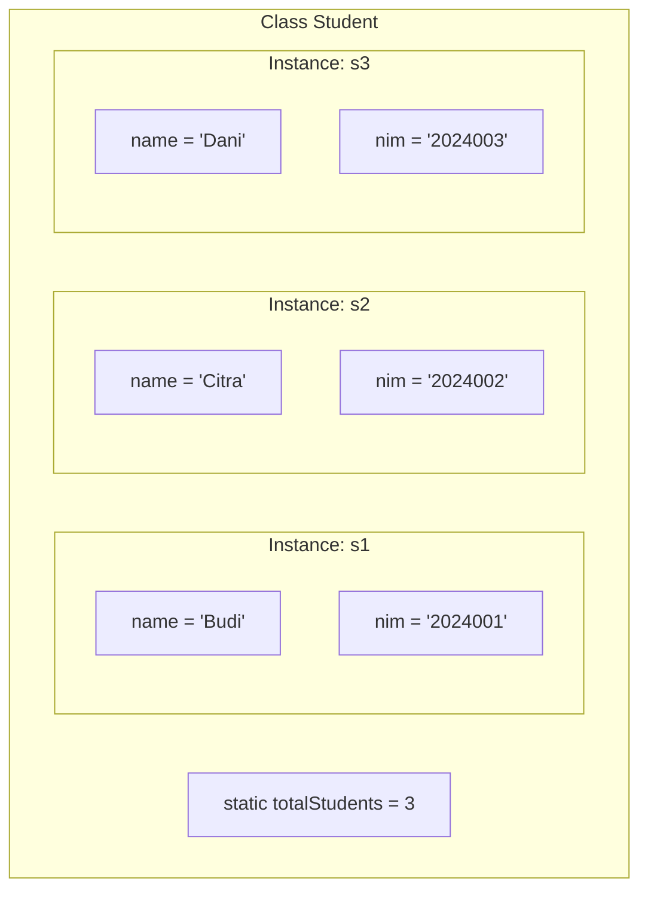
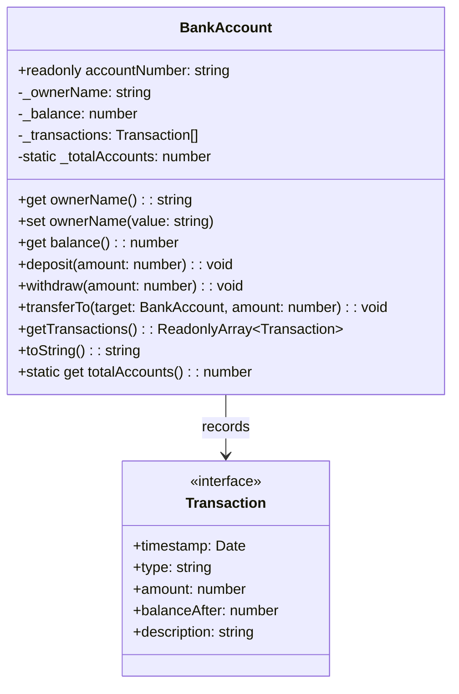

> **Mata Kuliah:** Pemrograman Berorientasi Objek
> **Minggu:** 2
> **Bagian:** Fundamentals
> **Bahasa:** TypeScript 5.x

---

## Capaian Pembelajaran Modul

Setelah mempelajari modul ini, mahasiswa mampu:
1. Menjelaskan konsep class sebagai blueprint dan object sebagai instance beserta relasinya
2. Membuat class dengan properties, constructor, methods, dan static members di TypeScript
3. Memahami dan menggunakan keyword `this`, `readonly`, serta constructor shorthand (parameter properties)
4. Menjelaskan konsep encapsulation sebagai mekanisme *bundling data + behavior* dan *information hiding*
5. Menggunakan access modifiers `public`, `private`, dan `protected` secara tepat
6. Mengimplementasikan getter dan setter (`get` / `set`) dengan validasi untuk menjaga integritas data
7. Menganalisis dampak kode tanpa encapsulation vs dengan encapsulation melalui studi kasus

---

## Prasyarat

- Modul 01: Paradigma OOP & Setup Environment TypeScript
- Environment TypeScript sudah ter-setup dengan `strict: true`

---

## Daftar Isi

- [1. Pendahuluan](#1-pendahuluan)
- [2. Landasan Konsep](#2-landasan-konsep)
- [3. Implementasi dalam TypeScript](#3-implementasi-dalam-typescript)
- [4. Perbandingan Lintas Bahasa](#4-perbandingan-lintas-bahasa)
- [5. Studi Kasus: Sistem BankAccount](#5-studi-kasus-sistem-bankaccount)
- [6. Kesalahan Umum & Best Practices](#6-kesalahan-umum--best-practices)
- [7. Ringkasan](#7-ringkasan)
- [8. Latihan Mandiri](#8-latihan-mandiri)

---

## 1. Pendahuluan

Di modul sebelumnya, kita telah mengenal paradigma OOP secara overview dan men-setup environment TypeScript. Kita juga sudah melihat preview singkat tentang bagaimana pendekatan OOP berbeda dari prosedural. Sekarang saatnya mendalami fondasi utama dari seluruh paradigma OOP: **Class** dan **Object**, serta pilar pertama OOP yang melekat erat pada desain class, **Encapsulation**.

Mengapa ketiga topik ini dibahas bersamaan? Karena dalam praktik nyata, **encapsulation tidak bisa dipisahkan dari desain class**. Saat kita mendefinisikan class, kita sekaligus memutuskan data mana yang boleh diakses dari luar dan mana yang harus dilindungi. Memahami class tanpa encapsulation ibarat membangun rumah tanpa pintu dan kunci, secara struktur lengkap, tapi tidak aman untuk dihuni.

Dalam dunia software development nyata, hampir setiap framework modern menggunakan class dan object sebagai unit organisasi utama. Ketika kalian nanti bekerja dengan React component, database model (Prisma), atau backend service (NestJS), semuanya dibangun di atas konsep class, object, dan encapsulation yang akan kita pelajari di modul ini.

> 💡 **Insight:** Jika OOP adalah sebuah bangunan, maka class dan object adalah **pondasi dan batu bata**-nya, sedangkan encapsulation adalah **dinding dan pintu** yang mengontrol siapa yang boleh masuk ke mana. Kuasai fondasi ini, dan lantai-lantai selanjutnya (inheritance, polymorphism, dll.) akan jauh lebih mudah dibangun.

---

## 2. Landasan Konsep

### 2.1 Class sebagai Blueprint

Bayangkan kalian adalah seorang arsitek yang mendesain rumah. Sebelum rumah dibangun, kalian membuat **denah/blueprint** terlebih dahulu. Blueprint ini mendefinisikan:
- **Apa yang dimiliki rumah**: berapa kamar, ada garasi atau tidak, luas tanah (-> properties/data)
- **Apa yang bisa dilakukan di rumah**: membuka pintu, menyalakan lampu, mengunci (-> methods/behavior)

Dalam OOP, **class** adalah blueprint tersebut. Class mendefinisikan **struktur** dan **perilaku** yang akan dimiliki oleh setiap object yang dibuat darinya, tetapi class itu sendiri **bukan** objek yang nyata, ia hanyalah rancangan.

> 🔑 **Konsep Kunci:** *Class* adalah blueprint atau cetakan yang mendefinisikan properties (data) dan methods (behavior) yang akan dimiliki oleh object yang dibuat dari class tersebut. Class sendiri tidak menyimpan data konkret, ia hanya mendeskripsikan "seperti apa" object nantinya.

Secara formal, sebuah class terdiri dari dua komponen utama:
- **Properties (atribut/field):** variabel yang menyimpan data/state dari object
- **Methods (operasi/fungsi):** fungsi yang mendefinisikan perilaku object

### 2.2 Object sebagai Instance

Melanjutkan analogi sebelumnya, jika blueprint adalah class, maka **rumah yang sudah dibangun** adalah object. Dari satu blueprint yang sama, kita bisa membangun **banyak rumah** (banyak object). Setiap rumah memiliki struktur yang sama (semua punya kamar, garasi, pintu), tetapi **data konkretnya bisa berbeda** (rumah A berwarna putih dengan 3 kamar, rumah B berwarna biru dengan 2 kamar).

> 🔑 **Konsep Kunci:** *Object* (atau *instance*) adalah wujud nyata dari sebuah class. Setiap object memiliki **state sendiri** (nilai properties yang unik) tetapi **berbagi struktur dan behavior** yang sama sesuai definisi class-nya.



### 2.3 Constructor: Inisialisasi Object

Ketika sebuah object dibuat, biasanya kita perlu memberikan **nilai awal** untuk properties-nya. Di sinilah peran **constructor**, sebuah method khusus yang otomatis dipanggil saat object dibuat.

Kembali ke analogi rumah: constructor adalah **proses pembangunan** rumah dari blueprint. Saat membangun, kita menentukan warna cat, jumlah kamar, dan detail lainnya. Setelah proses ini selesai, rumah siap digunakan.

Karakteristik constructor:
- Dipanggil **sekali** saat object dibuat (tidak bisa dipanggil ulang secara manual)
- Bertugas menginisialisasi **semua properties** yang diperlukan
- Bisa menerima **parameter** untuk menentukan state awal object

### 2.4 Keyword `this`

Dalam konteks OOP, `this` adalah referensi ke **object saat ini**, object yang sedang "aktif" atau sedang menjalankan method tersebut. Bayangkan `this` sebagai kata ganti "saya" bagi sebuah object.

Ketika kalian menulis `this.nama`, artinya "property `nama` milik **object ini**". Hal ini penting ketika nama parameter constructor sama dengan nama property, `this` membedakan mana yang milik object, mana yang parameter.

> ⚠️ **Perhatian:** Perilaku `this` di TypeScript/JavaScript bisa berbeda tergantung konteks pemanggilan (terutama pada arrow function vs regular function). Di dalam method class, `this` selalu merujuk ke instance object, tetapi hati-hati saat meng-extract method ke variabel terpisah. Kita akan bahas gotcha-nya di Section 6.

### 2.5 Apa Itu Encapsulation?

Setelah memahami class dan object, pertanyaan berikutnya: **bagaimana kita melindungi data di dalam object?** Di sinilah **encapsulation** berperan.

Encapsulation terdiri dari dua aspek yang saling melengkapi:

1. **Bundling (Pembungkusan)**: Menggabungkan data (properties) dan perilaku (methods) yang berkaitan ke dalam satu unit (class). Ini sudah kita lakukan di bagian sebelumnya.

2. **Information Hiding (Penyembunyian Informasi)**: Membatasi akses langsung ke detail internal objek, sehingga dunia luar hanya bisa berinteraksi melalui *public interface* yang telah ditentukan.



Analogi paling tepat adalah **mesin ATM**:
- **Public interface:** Layar, keypad, slot kartu, slot uang, ini yang bisa diakses nasabah
- **Private internal:** Mekanisme penghitung uang, koneksi ke server bank, algoritma enkripsi, tersembunyi di dalam mesin
- Nasabah tidak bisa (dan tidak perlu) memasukkan tangan ke dalam mesin untuk mengambil uang langsung. Semua harus melalui **prosedur yang telah ditentukan** (masukkan kartu -> PIN -> pilih nominal -> ambil uang).

> 🔑 **Konsep Kunci:** Encapsulation bukan hanya tentang "menyembunyikan data". Encapsulation adalah tentang **mengontrol bagaimana data diakses dan dimodifikasi**, sehingga integritas data terjaga sepanjang siklus hidup objek.

### 2.6 Access Modifiers: `public`, `private`, `protected`

Access modifiers adalah keyword yang menentukan **tingkat visibilitas** sebuah property atau method. TypeScript mendukung tiga access modifiers:

| Modifier | Akses dari Class Sendiri | Akses dari Subclass | Akses dari Luar Class |
|----------|:------------------------:|:-------------------:|:---------------------:|
| `public` | ✅ | ✅ | ✅ |
| `protected` | ✅ | ✅ | ❌ |
| `private` | ✅ | ❌ | ❌ |



> 💡 **Insight:** Jika kalian tidak menuliskan access modifier secara eksplisit, TypeScript secara default menganggapnya `public`. Ini berbeda dari bahasa seperti C++ yang default-nya `private` untuk class member, atau Java yang default-nya *package-private*.

### 2.7 Information Hiding & Validasi

Mengapa kita perlu menyembunyikan data? Tanpa encapsulation, sebuah program memiliki risiko:

1. **Inkonsistensi data**: Nilai property bisa diubah ke state yang tidak valid (misal: saldo negatif)
2. **Coupling tinggi**: Kode luar bergantung langsung pada struktur internal class, sehingga perubahan internal memaksa perubahan di banyak tempat
3. **Sulit di-debug**: Tidak ada satu titik kontrol untuk mengetahui kapan dan bagaimana data berubah
4. **Keamanan buruk**: Data sensitif bisa diakses dan dimanipulasi oleh siapa saja

Solusinya: gunakan **getter dan setter** sebagai "gerbang" akses ke data private. Setter bisa melakukan **validasi** sebelum mengubah data, sementara getter bisa mengembalikan **computed value** atau salinan aman dari data internal.

> ⚠️ **Perhatian:** Encapsulation bukan *silver bullet*. Mengubah semua property menjadi `private` lalu membuat getter dan setter tanpa logika tambahan sama saja dengan `public`, hanya menambah boilerplate. Gunakan getter/setter hanya jika ada **alasan yang jelas** (validasi, computed value, logging, dsb.).

---

## 3. Implementasi dalam TypeScript

### 3.1 Membuat Class Pertama

Mari mulai dengan membuat class sederhana di TypeScript:

```typescript
class Student {
    // Properties: mendeklarasikan data yang dimiliki setiap object
    name: string;
    nim: string;
    gpa: number;

    // Constructor: menginisialisasi properties saat object dibuat
    constructor(name: string, nim: string, gpa: number) {
        this.name = name;   // this.name = property object, name = parameter
        this.nim = nim;
        this.gpa = gpa;
    }

    // Method: mendefinisikan perilaku object
    getInfo(): string {
        return `${this.name} (${this.nim}) - GPA: ${this.gpa}`;
    }

    // Method dengan logika
    isPassing(): boolean {
        return this.gpa >= 2.0;
    }
}

// Instantiation: membuat object dengan keyword 'new'
const student1 = new Student("Budi", "2024001", 3.75);
const student2 = new Student("Citra", "2024002", 1.85);

console.log(student1.getInfo());
// Output: "Budi (2024001) - GPA: 3.75"

console.log(student2.isPassing());
// Output: false
```

> 💡 **Insight:** Setiap kali `new Student(...)` dipanggil, constructor dieksekusi dan sebuah **object baru** yang independen terbentuk di memori. Perubahan pada `student1` tidak mempengaruhi `student2`.

### 3.2 Constructor Shorthand (Parameter Properties)

TypeScript menawarkan fitur yang sangat membantu: **parameter properties**. Dengan menambahkan access modifier (`public`, `private`, `protected`) atau `readonly` di parameter constructor, TypeScript otomatis membuat property dan menginisialisasinya, menghemat banyak boilerplate.

```typescript
// Versi panjang (seperti di 3.1)
class StudentVerbose {
    name: string;
    nim: string;
    gpa: number;

    constructor(name: string, nim: string, gpa: number) {
        this.name = name;
        this.nim = nim;
        this.gpa = gpa;
    }
}

// Versi shorthand: hasilnya IDENTIK dengan versi panjang
class StudentShort {
    constructor(
        public name: string,
        public nim: string,
        public gpa: number
    ) {}
    // Tidak perlu deklarasi property terpisah!
    // Tidak perlu this.name = name; dll.

    getInfo(): string {
        return `${this.name} (${this.nim}) - GPA: ${this.gpa}`;
    }
}

const student = new StudentShort("Dani", "2024003", 3.50);
console.log(student.name);
// Output: "Dani"
```

> 🔄 **Perbandingan:** Constructor shorthand ini adalah fitur khas TypeScript yang tidak dimiliki oleh Java (tetapi Dart punya fitur serupa dengan `this.x`). Gunakan shorthand untuk class-class sederhana agar kode lebih ringkas dan mudah dibaca.

### 3.3 `readonly` Properties

Keyword `readonly` membuat sebuah property **hanya bisa diisi saat deklarasi atau di dalam constructor**, dan tidak bisa diubah setelahnya. Ini berguna untuk data yang bersifat tetap (immutable) sepanjang umur object.

```typescript
class Product {
    constructor(
        public readonly id: string,       // tidak bisa diubah setelah dibuat
        public name: string,              // bisa diubah
        public price: number              // bisa diubah
    ) {}

    getInfo(): string {
        return `[${this.id}] ${this.name} - Rp ${this.price.toLocaleString("id-ID")}`;
    }
}

const laptop = new Product("PRD-001", "Laptop Gaming", 15_000_000);

// ✅ Mengubah property biasa: diizinkan
laptop.name = "Laptop Gaming Pro";
laptop.price = 17_000_000;

// ❌ Mengubah readonly property: compile error!
// laptop.id = "PRD-999";
// Error: Cannot assign to 'id' because it is a read-only property.

console.log(laptop.getInfo());
// Output: "[PRD-001] Laptop Gaming Pro - Rp 17.000.000"
```

> 🔄 **Perbandingan:** `readonly` di TypeScript setara dengan `final` di Java/Dart. Ketiganya mencegah reassignment setelah inisialisasi, menjamin integritas data yang seharusnya tidak berubah.

### 3.4 Static Members

Sebagian besar properties dan methods bersifat **instance-level**, setiap object memiliki salinan sendiri. Namun ada kalanya kita butuh data atau fungsi yang **milik class itu sendiri**. Inilah **static members**.

```typescript
class Student {
    // Static property: milik class, bukan milik instance
    static totalStudents: number = 0;

    constructor(
        public readonly nim: string,
        public name: string,
        public gpa: number
    ) {
        // Setiap kali object baru dibuat, totalStudents bertambah
        Student.totalStudents++;
    }

    // Instance method: dipanggil via object
    getInfo(): string {
        return `${this.name} (${this.nim}) - GPA: ${this.gpa}`;
    }

    // Static method: dipanggil via class
    static getTotal(): number {
        return Student.totalStudents;
    }

    // Static method: factory pattern sederhana
    static createWithDefaultGPA(nim: string, name: string): Student {
        return new Student(nim, name, 0.0);
    }
}

const s1 = new Student("2024001", "Budi", 3.75);
const s2 = new Student("2024002", "Citra", 3.50);
const s3 = Student.createWithDefaultGPA("2024003", "Dani");

// Akses static member via nama class
console.log(Student.getTotal());
// Output: 3

// ❌ TIDAK BISA akses static member via instance
// console.log(s1.totalStudents);
// Error: Property 'totalStudents' does not exist on type 'Student'.
```



> ⚠️ **Perhatian:** Jangan bingungkan static dan instance members. Ingat aturan sederhana: **instance members** diakses via `object.member` dan punya `this`, sedangkan **static members** diakses via `ClassName.member` dan **tidak punya akses ke `this`** (karena tidak terikat pada instance manapun).

### 3.5 Access Modifiers dalam TypeScript

Setelah memahami cara membuat class, sekarang kita terapkan encapsulation menggunakan access modifiers.

**`public`**: bisa diakses dari mana saja (default):

```typescript
class Product {
    public name: string;       // eksplisit public
    price: number;             // tanpa modifier = implicit public

    constructor(name: string, price: number) {
        this.name = name;
        this.price = price;
    }
}

const item = new Product("Mouse", 150_000);
console.log(item.name);   // ✅ Bisa diakses
item.price = -100;         // ✅ Bisa diubah - tapi ini masalah!
```

**`private`**: hanya bisa diakses dari dalam class itu sendiri:

```typescript
class BankAccount {
    private balance: number;
    private transactionLog: string[] = [];

    constructor(
        public readonly owner: string,
        initialBalance: number
    ) {
        if (initialBalance < 0) {
            throw new Error("Saldo awal tidak boleh negatif");
        }
        this.balance = initialBalance;
        this.log(`Akun dibuka dengan saldo Rp${initialBalance.toLocaleString("id-ID")}`);
    }

    public deposit(amount: number): void {
        if (amount <= 0) {
            throw new Error("Jumlah deposit harus positif");
        }
        this.balance += amount;
        this.log(`Deposit: +Rp${amount.toLocaleString("id-ID")}`);
    }

    public withdraw(amount: number): void {
        if (amount <= 0) {
            throw new Error("Jumlah penarikan harus positif");
        }
        if (amount > this.balance) {
            throw new Error("Saldo tidak mencukupi");
        }
        this.balance -= amount;
        this.log(`Penarikan: -Rp${amount.toLocaleString("id-ID")}`);
    }

    public getBalance(): number {
        return this.balance;
    }

    public getStatement(): string[] {
        return [...this.transactionLog]; // return salinan, bukan referensi asli
    }

    private log(message: string): void {
        const timestamp = new Date().toISOString();
        this.transactionLog.push(`[${timestamp}] ${message}`);
    }
}

const account = new BankAccount("Budi", 1_000_000);
account.deposit(500_000);
account.withdraw(200_000);

console.log(account.getBalance());   // ✅ Output: 1300000
console.log(account.getStatement()); // ✅ Mengembalikan salinan log

// account.balance;          // ❌ Error: Property 'balance' is private
// account.balance = -100;   // ❌ Error: Property 'balance' is private
// account.log("hacked!");   // ❌ Error: Property 'log' is private
```

> 🔑 **Konsep Kunci:** Perhatikan bahwa `getStatement()` mengembalikan `[...this.transactionLog]` (spread operator untuk membuat salinan array), bukan `this.transactionLog` langsung. Jika kita mengembalikan referensi asli, kode luar bisa memodifikasi array tersebut, melanggar encapsulation!

**`protected`**: bisa diakses dari class sendiri dan subclass, tetapi tidak dari luar:

```typescript
class Vehicle {
    protected speed: number = 0;
    protected maxSpeed: number;

    constructor(
        public readonly brand: string,
        maxSpeed: number
    ) {
        this.maxSpeed = maxSpeed;
    }

    protected accelerate(increment: number): void {
        const newSpeed = this.speed + increment;
        this.speed = Math.min(newSpeed, this.maxSpeed);
    }

    public getSpeed(): number {
        return this.speed;
    }
}

class Car extends Vehicle {
    public pressGasPedal(): void {
        // ✅ Bisa akses protected member dari parent
        this.accelerate(20);
        console.log(`${this.brand} accelerating to ${this.speed} km/h`);
    }
}

const car = new Car("Toyota", 200);
car.pressGasPedal();          // ✅ Output: Toyota accelerating to 20 km/h
console.log(car.getSpeed());  // ✅ Output: 20

// car.speed;            // ❌ Error: Property 'speed' is protected
// car.accelerate(100);  // ❌ Error: Property 'accelerate' is protected
```

### 3.6 Getter & Setter

TypeScript mendukung property accessor (`get` dan `set`) yang memungkinkan kita mendefinisikan method yang bisa **dipanggil seperti property biasa**. Ini memberikan syntax yang bersih sambil tetap mempertahankan kontrol encapsulation.

```typescript
class Temperature {
    private _celsius: number;

    constructor(celsius: number) {
        this._celsius = celsius;
    }

    // Getter: dipanggil seperti property, bukan method
    get celsius(): number {
        return this._celsius;
    }

    // Setter: menerima assignment seperti property, bukan method call
    set celsius(value: number) {
        if (value < -273.15) {
            throw new Error("Suhu tidak boleh di bawah nol absolut (-273.15°C)");
        }
        this._celsius = value;
    }

    // Computed getter: menghitung nilai secara dinamis
    get fahrenheit(): number {
        return this._celsius * 9 / 5 + 32;
    }

    set fahrenheit(value: number) {
        this.celsius = (value - 32) * 5 / 9; // memanfaatkan validasi di setter celsius
    }

    get kelvin(): number {
        return this._celsius + 273.15;
    }

    toString(): string {
        return `${this._celsius}°C / ${this.fahrenheit.toFixed(1)}°F / ${this.kelvin.toFixed(1)}K`;
    }
}

const temp = new Temperature(100);
console.log(temp.celsius);      // Output: 100     - memanggil getter
console.log(temp.fahrenheit);   // Output: 212     - computed getter
console.log(temp.kelvin);       // Output: 373.15  - computed getter

temp.celsius = 0;               // Memanggil setter (dengan validasi)
console.log(temp.toString());   // Output: "0°C / 32.0°F / 273.1K"

temp.fahrenheit = 212;          // Memanggil setter fahrenheit -> setter celsius
console.log(temp.celsius);      // Output: 100

// temp.celsius = -300;         // ❌ Error: Suhu tidak boleh di bawah nol absolut
```

> 💡 **Insight:** Konvensi penamaan di TypeScript: property private yang punya getter/setter biasa diberi prefix underscore (`_celsius`), sedangkan getter/setter-nya menggunakan nama tanpa underscore (`celsius`). Ini murni konvensi, bukan aturan bahasa.

### 3.7 Validasi dalam Setter

Salah satu kekuatan utama setter adalah kemampuan melakukan **validasi** sebelum mengubah data:

```typescript
class Employee {
    private _name: string;
    private _salary: number;
    private _email: string;

    constructor(name: string, salary: number, email: string) {
        // Inisialisasi default agar setter bisa dipanggil
        this._name = "";
        this._salary = 0;
        this._email = "";

        // Validasi dilakukan melalui setter
        this.name = name;
        this.salary = salary;
        this.email = email;
    }

    get name(): string {
        return this._name;
    }

    set name(value: string) {
        const trimmed = value.trim();
        if (trimmed.length < 2) {
            throw new Error("Nama harus minimal 2 karakter");
        }
        if (trimmed.length > 100) {
            throw new Error("Nama maksimal 100 karakter");
        }
        this._name = trimmed;
    }

    get salary(): number {
        return this._salary;
    }

    set salary(value: number) {
        if (value < 0) {
            throw new Error("Gaji tidak boleh negatif");
        }
        this._salary = value;
    }

    get email(): string {
        return this._email;
    }

    set email(value: string) {
        if (!value.includes("@") || !value.includes(".")) {
            throw new Error("Format email tidak valid");
        }
        this._email = value.toLowerCase();
    }

    toString(): string {
        return `${this._name} - Gaji: Rp${this._salary.toLocaleString("id-ID")} - ${this._email}`;
    }
}

const emp = new Employee("Budi Santoso", 8_500_000, "Budi@Company.CO.ID");
console.log(emp.toString());
// Output: "Budi Santoso: Gaji: Rp8.500.000: budi@company.co.id"

emp.salary = 9_000_000;  // ✅ Valid
// emp.salary = -100;     // ❌ Error: Gaji tidak boleh negatif
// emp.name = "A";        // ❌ Error: Nama harus minimal 2 karakter
```

### 3.8 ECMAScript Private Fields (`#`) vs TypeScript `private`

TypeScript menyediakan **dua cara** untuk membuat field private. Perbedaan utamanya terletak pada **kapan proteksi berlaku**:

```typescript
// TypeScript private: proteksi hanya saat compile
class UserTS {
    private password: string;
    constructor(password: string) {
        this.password = password;
    }
}

const u1 = new UserTS("secret123");
// u1.password;              // ❌ Compile-time error
// (u1 as any).password;     // ✅ "secret123": bisa ditembus di runtime!

// ECMAScript # private: proteksi di compile-time DAN runtime
class UserES {
    #password: string;
    constructor(password: string) {
        this.#password = password;
    }
    checkPassword(input: string): boolean {
        return this.#password === input;
    }
}

const u2 = new UserES("secret123");
// u2.#password;              // ❌ Compile-time error
// (u2 as any).#password;     // ❌ JUGA error di runtime!
```

| Aspek | `private` (TS keyword) | `#` (ES private field) |
|-------|:----------------------:|:----------------------:|
| Proteksi compile-time | ✅ | ✅ |
| Proteksi runtime | ❌ | ✅ |
| Bisa ditembus `as any` | Ya | Tidak |
| Standard JavaScript | Tidak | Ya (ES2022) |

> ⚠️ **Perhatian:** Untuk kebanyakan kasus di perkuliahan ini, keyword `private` sudah cukup karena kita mengandalkan TypeScript compiler. Gunakan `#` jika benar-benar membutuhkan proteksi runtime, misalnya saat membuat library yang digunakan oleh kode JavaScript murni.

---

## 4. Perbandingan Lintas Bahasa

Konsep class, object, dan encapsulation bersifat universal di semua bahasa OOP. Berikut perbandingan sintaks antara TypeScript, Java, dan Dart:

### 4.1 Class & Object

| Aspek | TypeScript | Java | Dart |
|-------|-----------|------|------|
| Deklarasi class | `class Foo {}` | `public class Foo {}` | `class Foo {}` |
| Constructor | `constructor(...)` | `public Foo(...)` | `Foo(...)` |
| Constructor shorthand | `constructor(public x: string)` | Tidak ada | `Foo(this.x)` |
| Property declaration | `name: string;` | `String name;` | `String name;` |
| Method declaration | `getInfo(): string {}` | `String getInfo() {}` | `String getInfo() {}` |
| Instantiation | `new Foo()` | `new Foo()` | `Foo()` (tanpa `new`) |
| Static member | `static count = 0` | `static int count = 0;` | `static int count = 0;` |
| Readonly / final | `readonly x: string` | `final String x` | `final String x` |
| `this` keyword | `this.name` | `this.name` | `this.name` |

### 4.2 Encapsulation & Access Modifiers

| Fitur | TypeScript | Java | Dart |
|-------|:----------:|:----:|:----:|
| `public` | ✅ (default) | ✅ `public` | ✅ Semua identifier (default) |
| `protected` | ✅ `protected` | ✅ `protected` | ❌ Tidak ada |
| `private` | ✅ `private` (compile-time) | ✅ `private` (enforced JVM) | ✅ `_prefix` (per-library) |
| *Package-private* | ❌ Tidak ada | ✅ Default (tanpa modifier) | ❌ Tidak ada |
| Runtime private | ✅ `#field` (ES2022) | ✅ Selalu enforced | ✅ `_prefix` enforced per-library |
| Property accessor (get/set) | ✅ `get` / `set` keyword | ❌ Manual `getX()` / `setX()` | ✅ `get` / `set` keyword |

### 4.3 Contoh Perbandingan Syntax

**TypeScript:**

```typescript
class BankAccount {
    private _balance: number;

    constructor(
        public readonly owner: string,
        initialBalance: number
    ) {
        this._balance = initialBalance;
    }

    get balance(): number {
        return this._balance;
    }

    deposit(amount: number): void {
        if (amount <= 0) throw new Error("Jumlah harus positif");
        this._balance += amount;
    }

    getInfo(): string {
        return `${this.owner} - Saldo: Rp${this._balance.toLocaleString("id-ID")}`;
    }
}

const acc = new BankAccount("Budi", 1_000_000);
acc.deposit(500_000);
console.log(acc.balance); // 1500000
```

**Java:**

```java
public class BankAccount {
    private final String owner;
    private double balance;

    public BankAccount(String owner, double initialBalance) {
        this.owner = owner;
        this.balance = initialBalance;
    }

    public double getBalance() {
        return this.balance;
    }

    public void deposit(double amount) {
        if (amount <= 0) throw new IllegalArgumentException("Jumlah harus positif");
        this.balance += amount;
    }

    public String getInfo() {
        return this.owner + " - Saldo: Rp" + this.balance;
    }
}

BankAccount acc = new BankAccount("Budi", 1000000);
acc.deposit(500000);
System.out.println(acc.getBalance()); // 1500000.0
```

**Dart:**

```dart
class BankAccount {
  final String owner;
  double _balance;

  BankAccount(this.owner, this._balance);

  double get balance => _balance;

  void deposit(double amount) {
    if (amount <= 0) throw ArgumentError('Jumlah harus positif');
    _balance += amount;
  }

  String getInfo() {
    return '$owner - Saldo: Rp$_balance';
  }
}

var acc = BankAccount('Budi', 1000000);
acc.deposit(500000);
print(acc.balance); // 1500000.0
```

> 🔄 **Perbandingan:** Perhatikan bahwa TypeScript dan Dart sama-sama mendukung `get`/`set` keyword dan constructor shorthand, sementara Java lebih verbose dengan manual getter/setter. Namun **konsep di balik ketiga versi identik**, ada class, constructor, access modifiers, dan controlled access ke data. Bahasa berbeda, prinsip sama.

---

## 5. Studi Kasus: Sistem BankAccount

### 5.1 Deskripsi Masalah

Kita akan membangun sistem rekening bank yang mendemonstrasikan **class/object** sekaligus **encapsulation** secara utuh:
- Menyimpan data pemilik, nomor akun (immutable), dan saldo (protected)
- Melakukan deposit, withdrawal, dan transfer antar akun dengan validasi lengkap
- Mencatat riwayat transaksi yang tidak bisa dimanipulasi dari luar
- Melacak total akun yang terdaftar (static member)

Studi kasus ini menggabungkan semua konsep: class, object, constructor, `this`, `readonly`, `static`, access modifiers, getter/setter, dan validasi.

### 5.2 Tanpa Encapsulation (Masalah)

Pertama, mari lihat apa yang terjadi **tanpa encapsulation**:

```typescript
// ❌ Versi TANPA encapsulation: penuh masalah
class BankAccountBad {
    accountNumber: string;
    ownerName: string;
    balance: number;
    transactions: string[];

    constructor(accountNumber: string, ownerName: string, balance: number) {
        this.accountNumber = accountNumber;
        this.ownerName = ownerName;
        this.balance = balance;
        this.transactions = [];
    }
}

const acc = new BankAccountBad("ACC-001", "Budi", 1_000_000);

// Semua pelanggaran ini DIPERBOLEHKAN: tidak ada proteksi!
acc.balance = -999_999_999;           // Saldo negatif
acc.accountNumber = "CHANGED";        // Nomor akun berubah (harusnya immutable)
acc.ownerName = "";                   // Nama kosong
acc.transactions.push("hacked!");     // Riwayat dimanipulasi
acc.transactions = [];                // Riwayat dihapus paksa
```

### 5.3 Dengan Encapsulation (Solusi)



**Interface `Transaction`:**

```typescript
interface Transaction {
    timestamp: Date;
    type: string;
    amount: number;
    balanceAfter: number;
    description: string;
}
```

**Class `BankAccount`:**

```typescript
class BankAccount {
    private _ownerName: string;
    private _balance: number;
    private _transactions: Transaction[] = [];
    private static _totalAccounts: number = 0;

    constructor(
        public readonly accountNumber: string,
        ownerName: string,
        initialBalance: number
    ) {
        // Validasi
        if (accountNumber.trim().length === 0) {
            throw new Error("Nomor akun tidak boleh kosong");
        }
        if (ownerName.trim().length === 0) {
            throw new Error("Nama pemilik tidak boleh kosong");
        }
        if (initialBalance < 0) {
            throw new Error("Saldo awal tidak boleh negatif");
        }

        this._ownerName = ownerName.trim();
        this._balance = initialBalance;
        this.recordTransaction("OPEN", initialBalance, "Akun dibuka");
        BankAccount._totalAccounts++;
    }

    // --- Getter & Setter untuk ownerName (dengan validasi) ---
    get ownerName(): string {
        return this._ownerName;
    }

    set ownerName(value: string) {
        const trimmed = value.trim();
        if (trimmed.length === 0) {
            throw new Error("Nama pemilik tidak boleh kosong");
        }
        if (trimmed.length > 50) {
            throw new Error("Nama pemilik maksimal 50 karakter");
        }
        this._ownerName = trimmed;
    }

    // --- Getter untuk balance (read-only dari luar) ---
    get balance(): number {
        return this._balance;
    }

    // --- Operasi deposit ---
    deposit(amount: number): void {
        if (amount <= 0) {
            throw new Error("Jumlah deposit harus positif");
        }
        this._balance += amount;
        this.recordTransaction("DEPOSIT", amount, `Deposit tunai`);
    }

    // --- Operasi withdrawal ---
    withdraw(amount: number): void {
        if (amount <= 0) {
            throw new Error("Jumlah penarikan harus positif");
        }
        if (amount > this._balance) {
            throw new Error(
                `Saldo tidak mencukupi. Saldo: Rp${this._balance.toLocaleString("id-ID")}, ` +
                `diminta: Rp${amount.toLocaleString("id-ID")}`
            );
        }
        this._balance -= amount;
        this.recordTransaction("WITHDRAW", -amount, `Penarikan tunai`);
    }

    // --- Operasi transfer antar akun ---
    transferTo(target: BankAccount, amount: number): void {
        if (amount <= 0) {
            throw new Error("Jumlah transfer harus positif");
        }
        if (amount > this._balance) {
            throw new Error("Saldo tidak mencukupi untuk transfer");
        }

        this._balance -= amount;
        this.recordTransaction("TRANSFER_OUT", -amount, `Transfer ke ${target.accountNumber}`);

        target._balance += amount;
        target.recordTransaction("TRANSFER_IN", amount, `Transfer dari ${this.accountNumber}`);
    }

    // --- Mendapatkan riwayat transaksi (salinan, bukan referensi asli) ---
    getTransactions(): ReadonlyArray<Transaction> {
        return [...this._transactions];
    }

    // --- Private helper: mencatat transaksi ---
    private recordTransaction(type: string, amount: number, description: string): void {
        this._transactions.push({
            timestamp: new Date(),
            type,
            amount,
            balanceAfter: this._balance,
            description,
        });
    }

    // --- Static getter ---
    static get totalAccounts(): number {
        return BankAccount._totalAccounts;
    }

    // --- Representasi string ---
    toString(): string {
        return (
            `[${this.accountNumber}] ${this._ownerName}\n` +
            `  Saldo: Rp${this._balance.toLocaleString("id-ID")}`
        );
    }
}
```

### 5.4 Penggunaan

```typescript
// === Membuat akun ===
const accBudi = new BankAccount("ACC-0001", "Budi Santoso", 5_000_000);
const accCitra = new BankAccount("ACC-0002", "Citra Dewi", 3_000_000);

console.log(BankAccount.totalAccounts);
// Output: 2

// === Operasi yang valid ===
accBudi.deposit(2_000_000);
console.log(accBudi.balance);
// Output: 7000000

accBudi.withdraw(1_000_000);
console.log(accBudi.balance);
// Output: 6000000

accBudi.transferTo(accCitra, 1_500_000);
console.log(accBudi.balance);
// Output: 4500000
console.log(accCitra.balance);
// Output: 4500000

// === Informasi akun ===
console.log(accBudi.toString());
// Output:
// [ACC-0001] Budi Santoso
//   Saldo: Rp4.500.000

// === Riwayat transaksi ===
const history = accBudi.getTransactions();
history.forEach((t) => {
    const sign = t.amount >= 0 ? "+" : "";
    console.log(`[${t.type}] ${sign}Rp${Math.abs(t.amount).toLocaleString("id-ID")} → Saldo: Rp${t.balanceAfter.toLocaleString("id-ID")}`);
});
// Output:
// [OPEN] +Rp5.000.000 → Saldo: Rp5.000.000
// [DEPOSIT] +Rp2.000.000 → Saldo: Rp7.000.000
// [WITHDRAW] -Rp1.000.000 → Saldo: Rp6.000.000
// [TRANSFER_OUT] -Rp1.500.000 → Saldo: Rp4.500.000

// === Operasi yang DITOLAK oleh encapsulation ===
// accBudi.balance = -100;              // ❌ Error: tidak ada setter untuk balance
// accBudi.accountNumber = "CHANGED";   // ❌ Error: readonly property
// accBudi.withdraw(10_000_000);        // ❌ Error: Saldo tidak mencukupi
// accBudi.deposit(-500);               // ❌ Error: Jumlah deposit harus positif
```

### 5.5 Analisis Keputusan Desain

| Keputusan Desain | Alasan |
|------------------|--------|
| `accountNumber` di-set `readonly` | Nomor akun bersifat permanen, tidak boleh berubah setelah dibuat |
| `_balance` di-set `private` tanpa setter | Saldo hanya boleh berubah melalui `deposit()`, `withdraw()`, atau `transferTo()`, tidak pernah di-set langsung |
| `_ownerName` punya getter & setter | Nama bisa berubah (misal: ganti nama), tapi perlu validasi |
| `_transactions` di-set `private`, getter mengembalikan salinan | Riwayat tidak boleh dimanipulasi dari luar, defensive copy menjaga integritas |
| `_totalAccounts` di-set `static` | Total akun adalah informasi milik **class** secara keseluruhan |
| `transferTo` mengakses `target._balance` | Method dalam class yang sama boleh mengakses private member instance lain, ini fitur TypeScript yang valid |

> 💡 **Insight:** Perhatikan bagaimana `BankAccount` menyediakan operasi semantis (`deposit`, `withdraw`, `transferTo`) alih-alih membiarkan kode luar memanipulasi `balance` secara langsung. Ini adalah inti dari encapsulation yang baik, *tell, don't ask*. Kita memberitahu objek **apa yang harus dilakukan**, bukan mengambil datanya lalu memanipulasi sendiri.

---

## 6. Kesalahan Umum & Best Practices

### ❌ Lupa Menginisialisasi Property (`strictPropertyInitialization`)

Dengan `strict: true`, TypeScript mewajibkan semua property untuk diinisialisasi, baik saat deklarasi maupun di constructor.

```typescript
// ❌ Error dengan strict: true
class User {
    name: string;
    // Error: Property 'name' has no initializer and is not definitely
    //        assigned in the constructor.
}
```

### ✅ Selalu Inisialisasi Property

```typescript
// ✅ Opsi 1: Inisialisasi via constructor
class User {
    name: string;
    constructor(name: string) {
        this.name = name;
    }
}

// ✅ Opsi 2: Constructor shorthand
class UserShort {
    constructor(public name: string) {}
}

// ✅ Opsi 3: Default value saat deklarasi
class UserDefault {
    name: string = "Anonymous";
}
```

### ❌ Mengakses Static Member via Instance

```typescript
class Counter {
    static count: number = 0;
    increment(): void {
        // ❌ this.count++;          // Salah
        Counter.count++;             // ✅ Benar
    }
}

const c = new Counter();
// console.log(c.count);            // ❌ Salah
console.log(Counter.count);         // ✅ Benar
```

### ❌ Kehilangan Konteks `this` saat Meng-extract Method

```typescript
class Timer {
    constructor(public label: string) {}
    start(): void {
        console.log(`${this.label} dimulai`);
    }
}

const timer = new Timer("Stopwatch");
const startFn = timer.start;
// startFn(); // ❌ Runtime error: Cannot read properties of undefined (reading 'label')
```

### ✅ Gunakan Arrow Function untuk Mempertahankan `this`

```typescript
class Timer {
    constructor(public label: string) {}
    // ✅ Arrow function: 'this' selalu terikat ke instance
    start = (): void => {
        console.log(`${this.label} dimulai`);
    };
}

const timer = new Timer("Stopwatch");
const startFn = timer.start;
startFn(); // ✅ Output: "Stopwatch dimulai"
```

### ❌ Getter/Setter tanpa Logika Tambahan

```typescript
// ❌ Tidak menambah nilai apapun: hanya boilerplate
class BadExample {
    private _name: string;
    constructor(name: string) { this._name = name; }
    get name(): string { return this._name; }
    set name(value: string) { this._name = value; } // Tidak ada validasi
}
```

### ✅ Sesuaikan Akses dengan Kebutuhan

```typescript
// ✅ Jika tidak perlu validasi, cukup public / public readonly
class SimpleProduct {
    constructor(
        public readonly name: string,
        public price: number
    ) {}
}

// ✅ Gunakan getter/setter hanya jika ADA validasi
class ValidatedProduct {
    private _price: number;
    constructor(public readonly name: string, price: number) {
        this._price = 0;
        this.price = price; // memanggil setter
    }
    get price(): number { return this._price; }
    set price(value: number) {
        if (value <= 0) throw new Error("Harga harus positif");
        this._price = value;
    }
}
```

### ❌ Mengembalikan Referensi Langsung ke Koleksi Private

```typescript
// ❌ Kode luar bisa memodifikasi array internal!
class Classroom {
    private students: string[] = [];
    addStudent(name: string): void { this.students.push(name); }
    getStudents(): string[] {
        return this.students; // ❌ Referensi langsung
    }
}

const room = new Classroom();
room.addStudent("Alice");
const list = room.getStudents();
list.push("HACKER");              // Memodifikasi array internal!
console.log(room.getStudents());  // ["Alice", "HACKER"] - data tercemar!
```

### ✅ Kembalikan Salinan (Defensive Copy)

```typescript
// ✅ Kembalikan salinan array, bukan referensi asli
class Classroom {
    private students: string[] = [];
    addStudent(name: string): void { this.students.push(name); }
    getStudents(): readonly string[] {
        return [...this.students]; // ✅ Spread operator -> salinan baru
    }
}

const room = new Classroom();
room.addStudent("Alice");
const list = room.getStudents();
// list.push("HACKER");           // ❌ Compile error: readonly
console.log(room.getStudents());  // ["Alice"] - data aman!
```

### ❌ Membuat Semua Property Private Secara Membabi Buta

```typescript
// ❌ Over-encapsulation tanpa manfaat
class Point {
    private _x: number;
    private _y: number;
    constructor(x: number, y: number) { this._x = x; this._y = y; }
    get x(): number { return this._x; }
    set x(v: number) { this._x = v; }  // Tidak ada validasi - sia-sia
    get y(): number { return this._y; }
    set y(v: number) { this._y = v; }  // Tidak ada validasi - sia-sia
}
```

### ✅ Point Tidak Perlu Validasi: Cukup Public

```typescript
class Point {
    constructor(public x: number, public y: number) {}
    distanceTo(other: Point): number {
        return Math.sqrt((this.x - other.x) ** 2 + (this.y - other.y) ** 2);
    }
}
```

> 🔑 **Konsep Kunci:** Prinsip encapsulation yang baik: **mulai dari `private`/`readonly`, baru buka akses jika ada kebutuhan jelas.** Namun, jika data memang tidak perlu proteksi (seperti koordinat `x`, `y` pada `Point`), jangan tambahkan proteksi hanya demi "best practice", itu justru over-engineering.

---

## 7. Ringkasan

### Class & Object
- **Class** adalah blueprint/cetakan yang mendefinisikan properties (data) dan methods (behavior). Class sendiri bukan object, ia hanya rancangan.
- **Object** (instance) adalah wujud nyata dari class yang dibuat dengan keyword `new`. Setiap object punya state sendiri yang independen.
- **Constructor** (`constructor(...)`) adalah method khusus yang dipanggil otomatis saat object dibuat, bertugas menginisialisasi properties.
- TypeScript mendukung **constructor shorthand** (parameter properties), tambahkan `public`, `private`, `protected`, atau `readonly` di parameter constructor untuk otomatis membuat property.
- **`this`** merujuk ke instance object yang sedang aktif.
- **`readonly`** mencegah property diubah setelah inisialisasi, setara dengan `final` di Java/Dart.
- **`static`** membuat member menjadi milik class, bukan milik instance. Diakses via `ClassName.member`.

### Encapsulation
- **Encapsulation** terdiri dari dua aspek: *bundling* (menggabungkan data dan method) dan *information hiding* (menyembunyikan detail internal).
- **Access modifiers** di TypeScript: `public` (default), `protected` (class + subclass), `private` (class sendiri).
- **Property accessor** (`get` / `set`) memungkinkan method yang dipanggil seperti property, ideal untuk validasi dan computed value.
- **Validasi di setter** adalah mekanisme utama untuk menjaga integritas data.
- **`#privateField`** (ECMAScript) memberikan proteksi runtime, `private` keyword hanya compile-time.
- **Defensive copy** (mengembalikan salinan, bukan referensi asli) penting untuk menjaga encapsulation pada koleksi.
- Encapsulation yang baik bukan tentang membuat **semua** property private, melainkan memberikan **tingkat akses yang tepat** sesuai kebutuhan.

---

## 8. Latihan Mandiri

### Latihan 1: Pertanyaan Konseptual

1. Jelaskan perbedaan antara class dan object menggunakan **dua analogi dunia nyata** yang berbeda (jangan gunakan analogi "cetakan kue" atau "blueprint rumah" yang sudah dibahas). Untuk masing-masing analogi, identifikasi mana yang merepresentasikan class dan mana yang object, serta sebutkan contoh properties dan methods-nya.

2. Perhatikan kode berikut. Apakah ada masalah encapsulation? Jika ya, jelaskan dan perbaiki:

   ```typescript
   class UserAccount {
       public username: string;
       public password: string;
       public loginAttempts: number = 0;

       constructor(username: string, password: string) {
           this.username = username;
           this.password = password;
       }

       login(inputPassword: string): boolean {
           this.loginAttempts++;
           return this.password === inputPassword;
       }
   }
   ```

### Latihan 2: Sistem Produk dengan Inventaris

Buat class `InventoryItem` dengan ketentuan berikut:
- `readonly sku: string` (Stock Keeping Unit, tidak bisa diubah)
- Property accessor `name` dengan validasi (tidak boleh kosong, maks 100 karakter)
- Property accessor `price` dengan validasi (harus positif, kenaikan maksimal 50% per update)
- `private` stock yang hanya bisa berubah melalui method `restock(quantity)` dan `sell(quantity)`, keduanya dengan validasi
- Riwayat perubahan stok yang hanya bisa dibaca (bukan dimodifikasi) dari luar
- Static property `totalItems` yang bertambah setiap kali item baru dibuat

Buat minimal 3 instance, lakukan operasi sell dan restock, lalu tampilkan informasi setiap item.

### Latihan 3: BankAccount dengan Transfer

Buat class `BankAccount` yang memiliki:
- `readonly accountNumber` (format: "ACC-XXXX", tidak bisa diubah)
- `private` balance (hanya bisa diubah melalui `deposit`, `withdraw`, `transferTo`)
- Property accessor `ownerName` dengan validasi (tidak boleh kosong, maks 50 karakter)
- Method `deposit(amount)` dan `withdraw(amount)` dengan validasi
- Method `transferTo(target: BankAccount, amount: number)` yang memindahkan saldo antar akun
- Getter `balance` (read-only)
- Riwayat transaksi yang hanya bisa dibaca dari luar (defensive copy)

### Latihan 4: Analisis Kode

Perhatikan kode berikut. Identifikasi **semua error** dan jelaskan penyebab masing-masing. Kemudian tulis versi yang sudah diperbaiki.

```typescript
class Counter {
    count: number;
    readonly name: string;
    static totalCounters: number;

    increment() {
        this.count++;
    }

    getCount() {
        return this.count;
    }

    rename(newName: string) {
        this.name = newName;
    }
}

const c1 = new Counter();
c1.increment();
console.log(c1.getCount());
console.log(Counter.totalCounters);

const fn = c1.increment;
fn();
```

> 🎯 **Tujuan:** Latihan-latihan di atas dirancang untuk menguji pemahaman terhadap seluruh konsep yang dibahas di modul ini, mulai dari class/object dasar hingga encapsulation. Latihan 1 menguji pemahaman konseptual, latihan 2 & 3 menguji kemampuan implementasi, dan latihan 4 menguji kemampuan debugging dan analisis.

---

## Referensi & Bacaan Lanjutan

- TypeScript Handbook, Classes: https://www.typescriptlang.org/docs/handbook/2/classes.html
- MDN, JavaScript Classes: https://developer.mozilla.org/en-US/docs/Web/JavaScript/Reference/Classes
- MDN, Private Properties: https://developer.mozilla.org/en-US/docs/Web/JavaScript/Reference/Classes/Private_properties
- TypeScript Playground (coba kode langsung di browser): https://www.typescriptlang.org/play
- "Clean Code", Robert C. Martin, Bab 6: Objects and Data Structures
- "Effective TypeScript", Dan Vanderkam (Item 4: Get Comfortable with Structural Typing)
