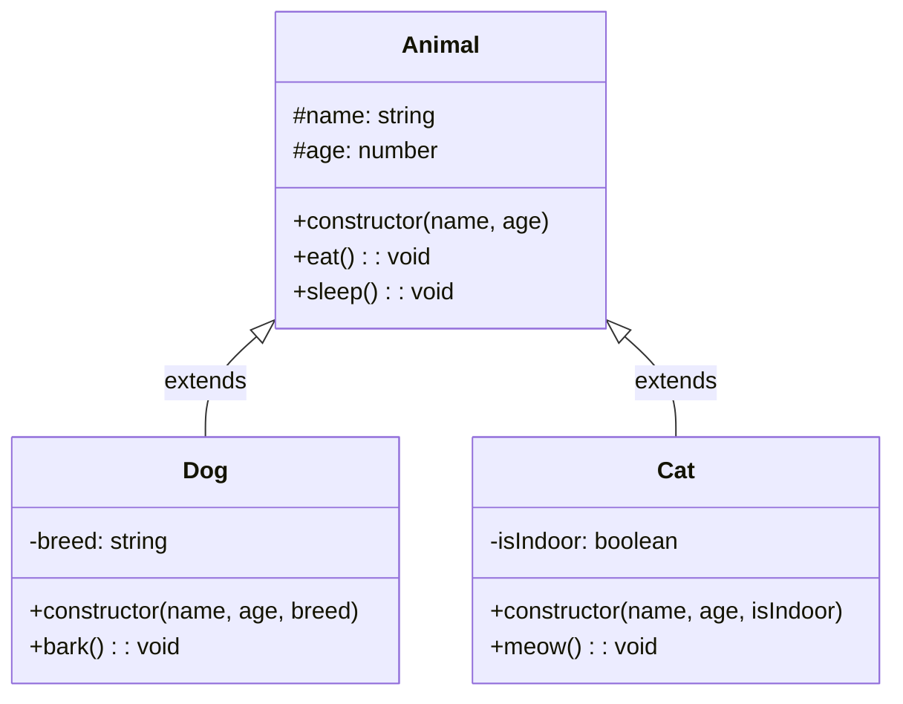
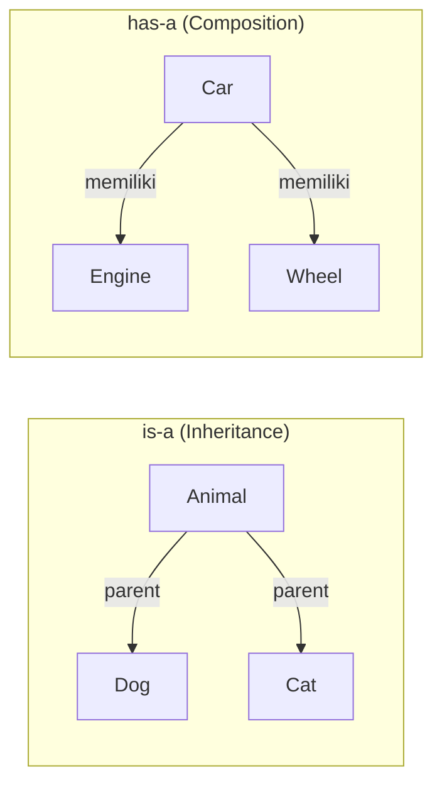
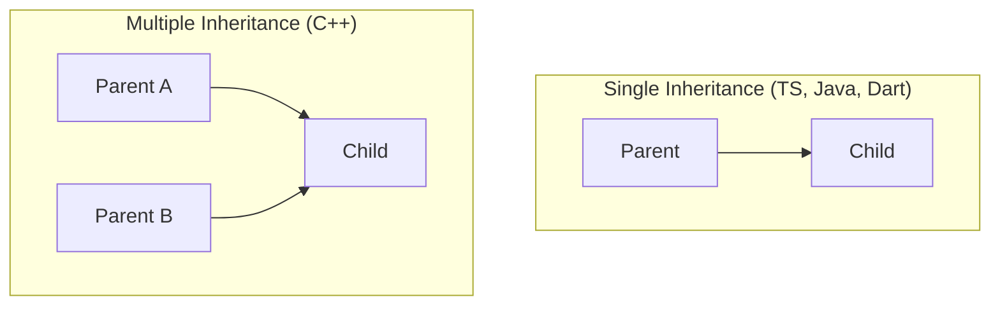
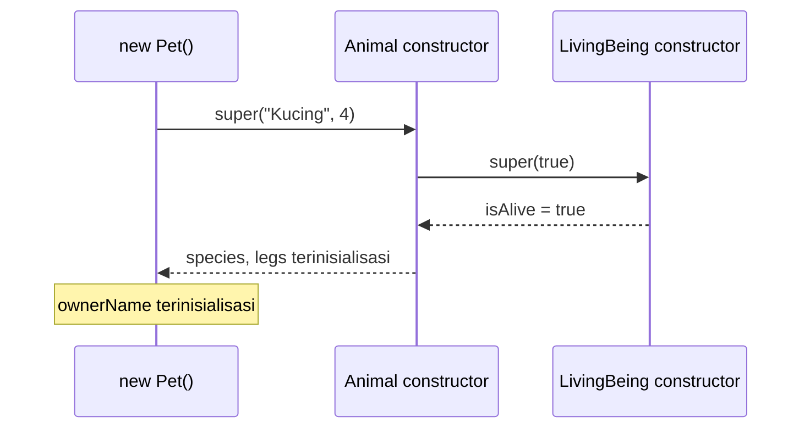
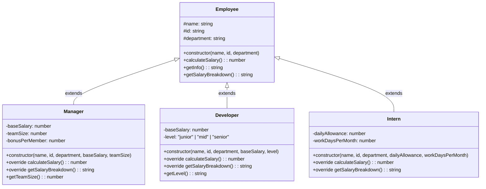

> **Mata Kuliah:** Pemrograman Berorientasi Objek
> **Minggu:** 3
> **Bagian:** Fundamentals
> **Bahasa:** TypeScript 5.x

---

## Capaian Pembelajaran Modul

Setelah mempelajari modul ini, mahasiswa mampu:
1. Menjelaskan konsep inheritance sebagai mekanisme pewarisan sifat dari parent class ke child class
2. Membedakan hubungan "is-a" (inheritance) dan "has-a" (composition) serta menentukan kapan menggunakan masing-masing
3. Mengimplementasikan inheritance di TypeScript menggunakan keyword `extends`, `super`, dan `override`
4. Menerapkan method overriding dengan benar dan memahami constructor chaining
5. Membandingkan sintaks dan aturan inheritance di TypeScript, Java, dan Dart

---

## Prasyarat

- Modul 01: Paradigma OOP & Setup Environment TypeScript
- Modul 02: Class, Object & Encapsulation, memahami pembuatan class, constructor, properties, methods, access modifiers, dan getter/setter
- Environment TypeScript sudah ter-setup dengan `strict: true` dan `noImplicitOverride: true`

---

## Daftar Isi

- [1. Pendahuluan](#1-pendahuluan)
- [2. Landasan Konsep](#2-landasan-konsep)
- [3. Implementasi dalam TypeScript](#3-implementasi-dalam-typescript)
- [4. Perbandingan Lintas Bahasa](#4-perbandingan-lintas-bahasa)
- [5. Studi Kasus: Hierarki Kelas Employee](#5-studi-kasus-hierarki-kelas-employee)
- [6. Kesalahan Umum & Best Practices](#6-kesalahan-umum--best-practices)
- [7. Ringkasan](#7-ringkasan)
- [8. Latihan Mandiri](#8-latihan-mandiri)

---

## 1. Pendahuluan

Di modul sebelumnya, kita telah mempelajari bagaimana **encapsulation** membungkus data dan perilaku ke dalam satu unit class, serta mengontrol akses melalui access modifiers. Sekarang bayangkan situasi berikut: kalian sedang membangun sistem informasi kampus. Kalian sudah membuat class `Mahasiswa` dengan properties `nama`, `nim`, dan method `getInfo()`. Lalu, kalian diminta menambahkan entitas `MahasiswaBeasiswa` yang memiliki semua sifat `Mahasiswa` ditambah informasi beasiswa.

Apakah kalian harus **menulis ulang** seluruh kode `Mahasiswa` di dalam `MahasiswaBeasiswa`? Tentu tidak. Di sinilah pilar kedua OOP berperan: **Inheritance** (pewarisan).

Inheritance memungkinkan kita membuat class baru yang **mewarisi** properties dan methods dari class yang sudah ada, tanpa harus menulis ulang kode tersebut. Ini adalah salah satu mekanisme paling kuat dalam OOP untuk mencapai **code reuse** dan membangun **hierarki kelas** yang terstruktur.

> 💡 **Insight:** Inheritance bukan hanya tentang mengurangi duplikasi kode. Ia juga merepresentasikan hubungan konseptual antar entitas, bahwa satu entitas adalah **spesialisasi** dari entitas lain. `MahasiswaBeasiswa` *adalah* `Mahasiswa` dengan properti tambahan.

---

## 2. Landasan Konsep

### 2.1 Apa Itu Inheritance?

*Inheritance* (pewarisan) adalah mekanisme di mana sebuah class (**child class** / **subclass** / **derived class**) dapat mewarisi properties dan methods dari class lain (**parent class** / **superclass** / **base class**). Child class mendapatkan semua anggota `public` dan `protected` dari parent class, dan bisa menambahkan anggota baru atau **mengubah perilaku** anggota yang diwarisi (*method overriding*).

Istilah-istilah penting:
- **Parent class** (superclass / base class), class yang mewariskan sifatnya
- **Child class** (subclass / derived class), class yang mewarisi sifat dari parent
- **Hierarki kelas**: struktur pohon yang terbentuk dari relasi inheritance



Pada diagram di atas, `Dog` dan `Cat` mewarisi properties `name`, `age` dan methods `eat()`, `sleep()` dari `Animal`. Masing-masing child class juga memiliki anggota tambahan yang spesifik, `Dog` punya `bark()` dan `Cat` punya `meow()`.

> 🔑 **Konsep Kunci:** Inheritance membentuk relasi **generalisasi-spesialisasi**. Parent class merepresentasikan konsep yang lebih *umum* (general), sedangkan child class merepresentasikan konsep yang lebih *khusus* (specialized).

### 2.2 Hubungan "is-a" vs "has-a"

Salah satu pertanyaan terpenting dalam desain OOP adalah: **kapan menggunakan inheritance, dan kapan tidak?** Jawabannya terletak pada pemahaman dua jenis hubungan fundamental:

#### Hubungan "is-a" (Inheritance)

Hubungan "is-a" berarti child class **adalah jenis dari** parent class. Jika pernyataan "A is a B" masuk akal secara semantik, maka inheritance tepat digunakan.

Contoh yang benar:
- `Dog` **is a** `Animal`, Anjing adalah Hewan ✅
- `Manager` **is an** `Employee`, Manager adalah Karyawan ✅
- `Circle` **is a** `Shape`, Lingkaran adalah Bentuk ✅

Contoh yang salah:
- `Engine` **is a** `Car`, Mesin adalah Mobil? ❌ (Mesin adalah **bagian dari** Mobil)
- `Wheel` **is a** `Car`, Roda adalah Mobil? ❌ (Roda adalah **bagian dari** Mobil)

#### Hubungan "has-a" (Composition)

Hubungan "has-a" berarti sebuah class **memiliki** instance dari class lain sebagai property-nya. Ini disebut **composition** atau **aggregation**.

Contoh:
- `Car` **has an** `Engine`, Mobil memiliki Mesin ✅
- `University` **has many** `Student`, Universitas memiliki banyak Mahasiswa ✅
- `Order` **has many** `OrderItem`, Pesanan memiliki banyak Item ✅



> ⚠️ **Perhatian:** Kesalahan umum pemula adalah menggunakan inheritance padahal seharusnya menggunakan composition. Ingat prinsip: **"Favor composition over inheritance"**, gunakan inheritance hanya jika relasi "is-a" benar-benar valid. Jika ragu, pilih composition.

### 2.3 Code Reuse melalui Inheritance

Tanpa inheritance, jika dua class berbagi perilaku yang sama, kita harus menduplikasi kode:

```
// Tanpa inheritance: banyak duplikasi
Class Mahasiswa:
    nama, nim
    getInfo() → "nama (nim)"

Class Dosen:
    nama, nip
    getInfo() → "nama (nip)"

Class TenagaKependidikan:
    nama, nik
    getInfo() → "nama (nik)"
```

Dengan inheritance, kita bisa mengekstrak bagian yang sama ke parent class:

```
// Dengan inheritance: DRY (Don't Repeat Yourself)
Class CivitasAkademika:            ← Parent (base)
    nama
    getInfo() → "nama"

Class Mahasiswa extends CivitasAkademika:   ← Child
    nim
    getInfo() → "nama (nim)"        ← override

Class Dosen extends CivitasAkademika:       ← Child
    nip
    getInfo() → "nama (nip)"        ← override
```

> 🔑 **Konsep Kunci:** Inheritance mencapai code reuse melalui prinsip **DRY (Don't Repeat Yourself)**. Shared behavior didefinisikan sekali di parent class, dan semua child class mewarisinya secara otomatis.

### 2.4 Single Inheritance vs Multiple Inheritance

Beberapa bahasa seperti C++ mendukung **multiple inheritance**, di mana satu class bisa mewarisi dari lebih dari satu parent class. Namun, ini sering menimbulkan masalah yang dikenal sebagai **Diamond Problem**, ketika dua parent class memiliki method yang sama, child class menjadi ambigu tentang method mana yang harus digunakan.

TypeScript, Java, dan Dart hanya mendukung **single inheritance**, satu class hanya bisa `extends` dari satu parent class. Untuk kebutuhan mewarisi perilaku dari banyak sumber, bahasa-bahasa ini menyediakan mekanisme alternatif: **interface** (TypeScript & Java) atau **mixin** (Dart), yang akan dibahas di modul selanjutnya.



---

## 3. Implementasi dalam TypeScript

### 3.1 Keyword `extends`

Di TypeScript, inheritance diimplementasikan menggunakan keyword `extends`. Child class yang menggunakan `extends` mewarisi semua anggota `public` dan `protected` dari parent class.

```typescript
// Parent class
class Animal {
    constructor(
        protected name: string,
        protected age: number
    ) {}

    eat(): void {
        console.log(`${this.name} sedang makan.`);
    }

    sleep(): void {
        console.log(`${this.name} sedang tidur.`);
    }

    getInfo(): string {
        return `${this.name}, umur ${this.age} tahun`;
    }
}

// Child class: mewarisi semua dari Animal
class Dog extends Animal {
    private breed: string;

    constructor(name: string, age: number, breed: string) {
        super(name, age); // Memanggil constructor parent
        this.breed = breed;
    }

    // Method tambahan: hanya milik Dog
    bark(): void {
        console.log(`${this.name} menggonggong: Guk! Guk!`);
    }

    // Method tambahan
    getBreed(): string {
        return this.breed;
    }
}

// Penggunaan
const myDog = new Dog("Buddy", 3, "Golden Retriever");

// Method yang diwarisi dari Animal
myDog.eat();        // Output: "Buddy sedang makan."
myDog.sleep();      // Output: "Buddy sedang tidur."

// Method milik Dog sendiri
myDog.bark();       // Output: "Buddy menggonggong: Guk! Guk!"

// Method yang diwarisi dari Animal
console.log(myDog.getInfo());
// Output: "Buddy, umur 3 tahun"
```

Perhatikan bahwa `Dog` tidak mendefinisikan ulang method `eat()` dan `sleep()`, tetapi bisa menggunakannya karena mewarisi dari `Animal`.

> 💡 **Insight:** Property `name` dan `age` di parent class dideklarasikan sebagai `protected`, bukan `private`. Ini memungkinkan child class mengaksesnya secara langsung. Jika menggunakan `private`, child class harus mengakses melalui public getter/setter yang disediakan parent.

### 3.2 Keyword `super`

Keyword `super` memiliki dua kegunaan utama:

#### 1. Memanggil Constructor Parent: `super(...)`

Setiap child class yang memiliki constructor **wajib** memanggil `super()` sebelum mengakses `this`. Panggilan `super()` menjalankan constructor parent class, memastikan properties yang diwarisi terinisialisasi dengan benar.

```typescript
class Vehicle {
    constructor(
        protected brand: string,
        protected year: number
    ) {
        console.log("Vehicle constructor dipanggil");
    }
}

class Car extends Vehicle {
    private doors: number;

    constructor(brand: string, year: number, doors: number) {
        // super() HARUS dipanggil SEBELUM mengakses this
        super(brand, year);
        console.log("Car constructor dipanggil");
        this.doors = doors;
    }

    getDetails(): string {
        return `${this.brand} (${this.year}) - ${this.doors} pintu`;
    }
}

const myCar = new Car("Toyota", 2024, 4);
// Output:
// "Vehicle constructor dipanggil"
// "Car constructor dipanggil"

console.log(myCar.getDetails());
// Output: "Toyota (2024) - 4 pintu"
```

#### 2. Memanggil Method Parent: `super.methodName()`

Selain constructor, `super` juga bisa digunakan untuk memanggil method parent class dari dalam child class. Ini sangat berguna ketika kita ingin **memperluas** perilaku parent, bukan menggantikannya sepenuhnya.

```typescript
class Person {
    constructor(
        protected name: string,
        protected email: string
    ) {}

    introduce(): string {
        return `Halo, saya ${this.name} (${this.email})`;
    }
}

class Student extends Person {
    constructor(
        name: string,
        email: string,
        private studentId: string
    ) {
        super(name, email);
    }

    // Memperluas method parent: bukan menggantikan
    override introduce(): string {
        // Memanggil method parent terlebih dahulu
        const parentIntro = super.introduce();
        return `${parentIntro}, NIM: ${this.studentId}`;
    }
}

const mhs = new Student("Andi", "andi@univ.ac.id", "2024001");
console.log(mhs.introduce());
// Output: "Halo, saya Andi (andi@univ.ac.id), NIM: 2024001"
```

### 3.3 Constructor Chaining

**Constructor chaining** adalah pola di mana constructor child class memanggil constructor parent melalui `super()`, dan jika parent juga merupakan child dari class lain, maka rantai panggilan berlanjut hingga root class. Ini memastikan setiap level hierarki terinisialisasi dengan benar.

```typescript
class LivingBeing {
    constructor(protected isAlive: boolean) {
        console.log("1. LivingBeing constructor");
    }
}

class Animal extends LivingBeing {
    constructor(
        protected species: string,
        protected legs: number
    ) {
        super(true); // Semua animal hidup
        console.log("2. Animal constructor");
    }
}

class Pet extends Animal {
    constructor(
        species: string,
        legs: number,
        private ownerName: string
    ) {
        super(species, legs);
        console.log("3. Pet constructor");
    }

    getDescription(): string {
        return `${this.species} (${this.legs} kaki), pemilik: ${this.ownerName}, hidup: ${this.isAlive}`;
    }
}

const myPet = new Pet("Kucing", 4, "Sari");
// Output:
// "1. LivingBeing constructor"
// "2. Animal constructor"
// "3. Pet constructor"

console.log(myPet.getDescription());
// Output: "Kucing (4 kaki), pemilik: Sari, hidup: true"
```



> 🔑 **Konsep Kunci:** Constructor chaining menjamin bahwa **setiap level hierarki** menginisialisasi property-nya masing-masing. Urutan eksekusi selalu dari **parent paling atas (root) ke child paling bawah**.

### 3.4 Method Overriding dengan Keyword `override`

**Method overriding** adalah mekanisme di mana child class **mendefinisikan ulang** method yang sudah ada di parent class. Ini memungkinkan child class memberikan implementasi yang berbeda (lebih spesifik) untuk perilaku yang sama.

Sejak TypeScript 4.3, keyword `override` secara eksplisit menandai bahwa sebuah method dimaksudkan untuk meng-override method parent. Dengan mengaktifkan opsi `noImplicitOverride: true` di `tsconfig.json`, TypeScript akan **memaksa** penggunaan keyword ini, membantu menangkap kesalahan saat compile-time.

```json
{
  "compilerOptions": {
    "strict": true,
    "noImplicitOverride": true
  }
}
```

```typescript
class Shape {
    constructor(protected color: string) {}

    calculateArea(): number {
        return 0;
    }

    describe(): string {
        return `Bentuk berwarna ${this.color}`;
    }
}

class Circle extends Shape {
    constructor(
        color: string,
        private radius: number
    ) {
        super(color);
    }

    // override WAJIB ditulis karena noImplicitOverride: true
    override calculateArea(): number {
        return Math.PI * this.radius ** 2;
    }

    override describe(): string {
        return `Lingkaran berwarna ${this.color}, radius ${this.radius}`;
    }
}

class Rectangle extends Shape {
    constructor(
        color: string,
        private width: number,
        private height: number
    ) {
        super(color);
    }

    override calculateArea(): number {
        return this.width * this.height;
    }

    override describe(): string {
        return `Persegi panjang berwarna ${this.color}, ${this.width}x${this.height}`;
    }
}

// Penggunaan
const circle = new Circle("merah", 7);
console.log(circle.describe());
// Output: "Lingkaran berwarna merah, radius 7"
console.log(`Luas: ${circle.calculateArea().toFixed(2)}`);
// Output: "Luas: 153.94"

const rect = new Rectangle("biru", 5, 10);
console.log(rect.describe());
// Output: "Persegi panjang berwarna biru, 5x10"
console.log(`Luas: ${rect.calculateArea()}`);
// Output: "Luas: 50"
```

> ⚠️ **Perhatian:** Tanpa `noImplicitOverride: true`, kita bisa salah ketik nama method (misalnya `calcualteArea()` bukan `calculateArea()`) dan TypeScript akan menganggapnya sebagai method baru, bukan override. Dengan opsi ini aktif, TypeScript akan memberikan error jika method bertanda `override` ternyata tidak ada di parent class.

### 3.5 Aturan Override dan Kompatibilitas Tipe

Saat meng-override method, ada aturan penting yang harus dipatuhi: **signature method child harus kompatibel dengan parent**. Artinya, parameter dan return type harus konsisten.

```typescript
class Logger {
    log(message: string): void {
        console.log(`[LOG] ${message}`);
    }

    format(data: string): string {
        return data.toUpperCase();
    }
}

class TimestampLogger extends Logger {
    // ✅ Override valid: signature kompatibel
    override log(message: string): void {
        const timestamp = new Date().toISOString();
        console.log(`[${timestamp}] ${message}`);
    }

    // ✅ Override valid: signature tetap sama
    override format(data: string): string {
        const timestamp = new Date().toISOString();
        return `[${timestamp}] ${data.toUpperCase()}`;
    }
}

const logger = new TimestampLogger();
logger.log("Server started");
// Output: "[2026-02-15T10:30:00.000Z] Server started"

console.log(logger.format("hello"));
// Output: "[2026-02-15T10:30:00.000Z] HELLO"
```

### 3.6 Access Modifier `protected` dalam Konteks Inheritance

Modifier `protected` menjadi sangat relevan dalam inheritance. Property atau method `protected` **tidak bisa diakses dari luar class** (seperti `private`), tetapi **bisa diakses dari child class** (berbeda dari `private`).

```typescript
class BankAccount {
    private accountNumber: string;     // Hanya BankAccount yang bisa akses
    protected balance: number;         // BankAccount dan child-nya bisa akses

    constructor(accountNumber: string, initialBalance: number) {
        this.accountNumber = accountNumber;
        this.balance = initialBalance;
    }

    getBalance(): number {
        return this.balance;
    }
}

class SavingsAccount extends BankAccount {
    private interestRate: number;

    constructor(accountNumber: string, initialBalance: number, interestRate: number) {
        super(accountNumber, initialBalance);
        this.interestRate = interestRate;
    }

    applyInterest(): void {
        // ✅ Bisa akses 'balance' karena protected
        this.balance += this.balance * this.interestRate;

        // ❌ Tidak bisa akses 'accountNumber' karena private
        // console.log(this.accountNumber); // Error!
    }

    getDetails(): string {
        return `Saldo: Rp ${this.balance.toLocaleString("id-ID")}, Bunga: ${(this.interestRate * 100).toFixed(1)}%`;
    }
}

const savings = new SavingsAccount("123-456", 10_000_000, 0.05);
savings.applyInterest();
console.log(savings.getDetails());
// Output: "Saldo: Rp 10.500.000, Bunga: 5.0%"

// ❌ Dari luar class, protected juga tidak bisa diakses
// console.log(savings.balance); // Error!
```

---

## 4. Perbandingan Lintas Bahasa

### 4.1 Tabel Perbandingan Syntax

| Aspek | TypeScript | Java | Dart |
|-------|-----------|------|------|
| Keyword inheritance | `extends` | `extends` | `extends` |
| Panggil constructor parent | `super(...)` | `super(...)` | `super(...)` |
| Panggil method parent | `super.method()` | `super.method()` | `super.method()` |
| Keyword override | `override method()` | `@Override method()` | `@override method()` |
| Override enforcement | `noImplicitOverride: true` | Warning/lint rule | Lint rule |
| Multiple inheritance | Tidak (gunakan interface) | Tidak (gunakan interface) | Tidak (gunakan mixin) |
| Access modifier `protected` | `protected` | `protected` | Tidak ada (konvensi `_`) |
| Final class (tidak bisa di-extend) | Tidak ada built-in | `final class` | `final class` (Dart 3) |

### 4.2 Contoh Perbandingan Kode

**TypeScript:**

```typescript
class Animal {
    constructor(protected name: string) {}

    makeSound(): string {
        return "...";
    }
}

class Dog extends Animal {
    constructor(name: string) {
        super(name);
    }

    override makeSound(): string {
        return `${this.name} berkata: Guk!`;
    }
}
```

**Java:**

```java
public class Animal {
    protected String name;

    public Animal(String name) {
        this.name = name;
    }

    public String makeSound() {
        return "...";
    }
}

public class Dog extends Animal {
    public Dog(String name) {
        super(name);
    }

    @Override
    public String makeSound() {
        return this.name + " berkata: Guk!";
    }
}
```

**Dart:**

```dart
class Animal {
  final String name;

  Animal(this.name);

  String makeSound() {
    return '...';
  }
}

class Dog extends Animal {
  Dog(super.name);

  @override
  String makeSound() {
    return '$name berkata: Guk!';
  }
}
```

> 🔄 **Perbandingan:** Ketiga bahasa menggunakan keyword `extends` yang identik. Perbedaan utama ada pada cara menandai override: TypeScript menggunakan keyword `override` (huruf kecil, di depan nama method), Java menggunakan annotation `@Override` (huruf kapital), dan Dart menggunakan annotation `@override` (huruf kecil). Ketiganya berfungsi sama, membantu compiler/linter mendeteksi kesalahan override.

---

## 5. Studi Kasus: Hierarki Kelas Employee

### 5.1 Deskripsi Masalah

Sebuah perusahaan teknologi memiliki tiga jenis karyawan:
- **Manager**: mendapat gaji pokok ditambah bonus kepemimpinan berdasarkan jumlah anggota tim
- **Developer**: mendapat gaji pokok ditambah tunjangan berdasarkan level (junior/mid/senior)
- **Intern**: mendapat uang saku harian dikali jumlah hari kerja per bulan

Kita diminta membuat sistem yang bisa menghitung gaji (`calculateSalary()`) dan menampilkan informasi (`getInfo()`) untuk semua jenis karyawan ini. Semua karyawan berbagi atribut umum: `name`, `id`, dan `department`.

### 5.2 Desain Solusi



### 5.3 Implementasi

#### Parent Class: `Employee`

```typescript
class Employee {
    constructor(
        protected name: string,
        protected id: string,
        protected department: string
    ) {}

    // Method dasar: akan di-override oleh child class
    calculateSalary(): number {
        return 0;
    }

    getInfo(): string {
        return `[${this.id}] ${this.name} - Dept: ${this.department}`;
    }

    getSalaryBreakdown(): string {
        return `Gaji: Rp ${this.calculateSalary().toLocaleString("id-ID")}`;
    }
}
```

#### Child Class: `Manager`

```typescript
class Manager extends Employee {
    private readonly bonusPerMember: number = 1_500_000;

    constructor(
        name: string,
        id: string,
        department: string,
        private baseSalary: number,
        private teamSize: number
    ) {
        super(name, id, department);
    }

    override calculateSalary(): number {
        const leadershipBonus = this.teamSize * this.bonusPerMember;
        return this.baseSalary + leadershipBonus;
    }

    override getSalaryBreakdown(): string {
        const bonus = this.teamSize * this.bonusPerMember;
        return [
            `Gaji Pokok   : Rp ${this.baseSalary.toLocaleString("id-ID")}`,
            `Bonus (${this.teamSize} anggota): Rp ${bonus.toLocaleString("id-ID")}`,
            `---`,
            `Total        : Rp ${this.calculateSalary().toLocaleString("id-ID")}`,
        ].join("\n");
    }

    getTeamSize(): number {
        return this.teamSize;
    }
}
```

#### Child Class: `Developer`

```typescript
type DeveloperLevel = "junior" | "mid" | "senior";

class Developer extends Employee {
    private static readonly LEVEL_MULTIPLIER: Record<DeveloperLevel, number> = {
        junior: 1.0,
        mid: 1.3,
        senior: 1.6,
    };

    constructor(
        name: string,
        id: string,
        department: string,
        private baseSalary: number,
        private level: DeveloperLevel
    ) {
        super(name, id, department);
    }

    override calculateSalary(): number {
        const multiplier = Developer.LEVEL_MULTIPLIER[this.level];
        return this.baseSalary * multiplier;
    }

    override getSalaryBreakdown(): string {
        const multiplier = Developer.LEVEL_MULTIPLIER[this.level];
        return [
            `Gaji Pokok   : Rp ${this.baseSalary.toLocaleString("id-ID")}`,
            `Level        : ${this.level} (x${multiplier})`,
            `---`,
            `Total        : Rp ${this.calculateSalary().toLocaleString("id-ID")}`,
        ].join("\n");
    }

    getLevel(): DeveloperLevel {
        return this.level;
    }
}
```

#### Child Class: `Intern`

```typescript
class Intern extends Employee {
    constructor(
        name: string,
        id: string,
        department: string,
        private dailyAllowance: number,
        private workDaysPerMonth: number
    ) {
        super(name, id, department);
    }

    override calculateSalary(): number {
        return this.dailyAllowance * this.workDaysPerMonth;
    }

    override getSalaryBreakdown(): string {
        return [
            `Uang Saku/Hari  : Rp ${this.dailyAllowance.toLocaleString("id-ID")}`,
            `Hari Kerja/Bulan : ${this.workDaysPerMonth} hari`,
            `---`,
            `Total            : Rp ${this.calculateSalary().toLocaleString("id-ID")}`,
        ].join("\n");
    }
}
```

#### Penggunaan Lengkap

```typescript
// Membuat instance berbagai jenis karyawan
const manager = new Manager("Budi Santoso", "MGR-001", "Engineering", 20_000_000, 5);
const developer = new Developer("Andi Wijaya", "DEV-042", "Engineering", 15_000_000, "senior");
const intern = new Intern("Citra Dewi", "INT-007", "Engineering", 150_000, 22);

// Array bertipe Employee: bisa menampung semua child class
const employees: Employee[] = [manager, developer, intern];

// Iterasi dan tampilkan informasi semua karyawan
for (const emp of employees) {
    console.log("=".repeat(45));
    console.log(emp.getInfo());
    console.log(emp.getSalaryBreakdown());
}
console.log("=".repeat(45));

// Output:
// =============================================
// [MGR-001] Budi Santoso - Dept: Engineering
// Gaji Pokok   : Rp 20.000.000
// Bonus (5 anggota): Rp 7.500.000
// ---
// Total        : Rp 27.500.000
// =============================================
// [DEV-042] Andi Wijaya - Dept: Engineering
// Gaji Pokok   : Rp 15.000.000
// Level        : senior (x1.6)
// ---
// Total        : Rp 24.000.000
// =============================================
// [INT-007] Citra Dewi - Dept: Engineering
// Uang Saku/Hari  : Rp 150.000
// Hari Kerja/Bulan : 22 hari
// ---
// Total            : Rp 3.300.000
// =============================================
```

### 5.4 Analisis

Beberapa keputusan desain penting dalam studi kasus ini:

1. **`protected` pada properties parent**: `name`, `id`, dan `department` menggunakan `protected` agar child class bisa mengaksesnya langsung, tanpa perlu memanggil getter setiap kali.

2. **`override` pada semua method yang di-override**: Dengan `noImplicitOverride: true`, setiap method yang meng-override parent wajib ditandai `override`. Jika suatu hari method di parent di-rename, TypeScript langsung mendeteksi bahwa child class meng-override method yang tidak ada.

3. **`static readonly` untuk konstanta**: `LEVEL_MULTIPLIER` di `Developer` bersifat `static` karena nilainya sama untuk semua instance dan `readonly` agar tidak bisa dimodifikasi.

4. **Union type untuk `level`**: `DeveloperLevel = "junior" | "mid" | "senior"` memastikan hanya nilai-nilai valid yang bisa diberikan. Ini lebih aman daripada `string` biasa.

5. **Array bertipe `Employee`**: Kita bisa menyimpan `Manager`, `Developer`, dan `Intern` dalam satu array bertipe `Employee[]`, karena semua child class "is an" `Employee`. Ini adalah preview dari konsep **polymorphism** yang akan dibahas mendalam di modul berikutnya.

> 💡 **Insight:** Perhatikan baris `const employees: Employee[] = [manager, developer, intern]`. Meskipun setiap objek adalah tipe yang berbeda, method `calculateSalary()` yang dipanggil adalah versi **masing-masing child class**. Ini menunjukkan kekuatan inheritance yang bekerja bersama method overriding, fondasi dari polymorphism.

---

## 6. Kesalahan Umum & Best Practices

### ❌ Lupa memanggil `super()` di constructor child

```typescript
// ❌ Error: Constructors for derived classes must contain a 'super' call
class Animal {
    constructor(protected name: string) {}
}

class Dog extends Animal {
    constructor(name: string, private breed: string) {
        // Lupa memanggil super(name)!
        this.breed = breed; // Error: 'super' must be called before accessing 'this'
    }
}
```

### ✅ Selalu panggil `super()` sebelum mengakses `this`

```typescript
// ✅ Benar: super() dipanggil sebelum this
class Dog extends Animal {
    constructor(name: string, private breed: string) {
        super(name); // Wajib dipanggil pertama kali
        // sekarang baru boleh akses this
    }
}
```

### ❌ Override tanpa keyword `override` (saat `noImplicitOverride: true`)

```typescript
// ❌ Error saat noImplicitOverride: true
class Shape {
    calculateArea(): number { return 0; }
}

class Circle extends Shape {
    // Error: This member must have an 'override' modifier because
    // it overrides a member in the base class 'Shape'
    calculateArea(): number {
        return Math.PI * 10 ** 2;
    }
}
```

### ✅ Selalu gunakan keyword `override`

```typescript
// ✅ Benar: override ditulis secara eksplisit
class Circle extends Shape {
    override calculateArea(): number {
        return Math.PI * 10 ** 2;
    }
}
```

### ❌ Typo pada nama method override (tanpa `override` keyword)

```typescript
// ❌ Tidak error tapi BUG: method baru, bukan override!
class Shape {
    calculateArea(): number { return 0; }
}

class Circle extends Shape {
    // Typo: 'calcualteArea' bukan 'calculateArea'
    // Tanpa keyword override, TypeScript menganggap ini method BARU
    calcualteArea(): number {
        return Math.PI * 10 ** 2;
    }
}

const c = new Circle();
console.log(c.calculateArea()); // Output: 0 - BUKAN yang diharapkan!
```

### ✅ Keyword `override` menangkap typo saat compile-time

```typescript
// ✅ Dengan override, typo langsung terdeteksi
class Circle extends Shape {
    // Error: This member cannot have an 'override' modifier because
    // it is not declared in the base class 'Shape'
    override calcualteArea(): number {
        return Math.PI * 10 ** 2;
    }
}
```

### ❌ Menggunakan inheritance saat seharusnya composition

```typescript
// ❌ Engine BUKAN jenis Car: hubungan "has-a", bukan "is-a"
class Car {
    start(): void { console.log("Mobil menyala"); }
}

class Engine extends Car {
    // Salah! Engine bukan turunan dari Car
    horsepower: number = 150;
}
```

### ✅ Gunakan composition untuk hubungan "has-a"

```typescript
// ✅ Benar: Engine adalah BAGIAN DARI Car (has-a)
class Engine {
    constructor(private horsepower: number) {}

    start(): void {
        console.log(`Mesin ${this.horsepower} HP menyala`);
    }
}

class Car {
    private engine: Engine;

    constructor(brand: string, hp: number) {
        this.engine = new Engine(hp);
    }

    start(): void {
        this.engine.start();
        console.log("Mobil siap berjalan");
    }
}

const car = new Car("Toyota", 150);
car.start();
// Output:
// "Mesin 150 HP menyala"
// "Mobil siap berjalan"
```

### ❌ Hierarki terlalu dalam (deep inheritance)

```typescript
// ❌ Hierarki terlalu dalam: sulit dipahami dan di-maintain
class A {}
class B extends A {}
class C extends B {}
class D extends C {}
class E extends D {}
class F extends E {} // 6 level! Terlalu dalam.
```

### ✅ Batasi kedalaman hierarki (maksimal 2-3 level)

```typescript
// ✅ Hierarki dangkal dan jelas
class Employee {}
class Manager extends Employee {}
class SeniorManager extends Manager {} // Maksimal 3 level masih wajar
```

> ⚠️ **Perhatian:** Sebagai panduan umum, batasi hierarki inheritance hingga **maksimal 3 level**. Jika hierarki terlalu dalam, pertimbangkan untuk menggunakan composition atau interface sebagai alternatif. Semakin dalam hierarki, semakin sulit memahami dari mana sebuah behavior berasal.

---

## 7. Ringkasan

- **Inheritance** adalah mekanisme pewarisan properties dan methods dari parent class ke child class, menciptakan hierarki generalisasi-spesialisasi
- Hubungan **"is-a"** menunjukkan inheritance sudah tepat digunakan; hubungan **"has-a"** menunjukkan composition lebih sesuai
- Keyword **`extends`** digunakan untuk mendeklarasikan inheritance di TypeScript
- Keyword **`super`** memiliki dua fungsi: memanggil constructor parent (`super(...)`) dan memanggil method parent (`super.method()`)
- **Constructor chaining** memastikan setiap level hierarki terinisialisasi dari root hingga leaf
- Keyword **`override`** (wajib dengan `noImplicitOverride: true`) menandai method yang meng-override parent, memberikan keamanan compile-time terhadap typo dan perubahan parent
- TypeScript, Java, dan Dart hanya mendukung **single inheritance**, satu class hanya bisa `extends` satu parent
- Modifier **`protected`** memungkinkan child class mengakses property/method parent yang tidak boleh diakses dari luar hierarki
- **Best practice**: batasi kedalaman hierarki, gunakan `override` secara eksplisit, dan pilih composition jika ragu antara "is-a" vs "has-a"

---

## 8. Latihan Mandiri

1. **Pertanyaan Konseptual:**
   Diberikan entitas-entitas berikut, tentukan apakah hubungan yang tepat adalah **"is-a" (inheritance)** atau **"has-a" (composition)**, dan jelaskan alasannya:
   - `Smartphone` dan `Battery`
   - `ElectricCar` dan `Car`
   - `University` dan `Faculty`
   - `SavingsAccount` dan `BankAccount`
   - `Laptop` dan `Computer`

2. **Mini Exercise:**
   Buat hierarki kelas untuk sistem perpustakaan:
   - Parent class `LibraryItem` dengan properties `title` (string), `year` (number), dan method `getInfo(): string`
   - Child class `Book` yang menambahkan `author` (string) dan `pages` (number), serta meng-override `getInfo()`
   - Child class `DVD` yang menambahkan `director` (string) dan `duration` (number, dalam menit), serta meng-override `getInfo()`
   - Child class `Magazine` yang menambahkan `issue` (number) dan `publisher` (string), serta meng-override `getInfo()`

   Buat array bertipe `LibraryItem[]` berisi minimal satu instance dari setiap child class, lalu iterasi dan tampilkan informasinya. Pastikan kompilasi dengan `strict: true` dan `noImplicitOverride: true`.

3. **Analisis Kode:**
   Perhatikan kode berikut. Identifikasi **semua masalah** yang ada dan jelaskan bagaimana cara memperbaikinya:

   ```typescript
   class Vehicle {
       constructor(private brand: string, private speed: number) {}

       accelerate(amount: number): void {
           this.speed += amount;
       }

       getInfo(): string {
           return `${this.brand} - ${this.speed} km/h`;
       }
   }

   class Truck extends Vehicle {
       constructor(brand: string, speed: number, private payload: number) {
           this.payload = payload;
           super(brand, speed);
       }

       getInfo(): string {
           return `Truk: ${this.brand}, payload: ${this.payload} ton`;
       }

       accelerate(amount: number): void {
           const reducedAmount = amount * 0.8;
           super.accelerate(reducedAmount);
       }
   }
   ```

4. **Tantangan Tambahan:**
   Perluas studi kasus Employee di Section 5 dengan menambahkan:
   - Child class `Freelancer` yang dihitung berdasarkan tarif per jam (`hourlyRate`) dikali jam kerja per bulan (`hoursPerMonth`)
   - Method `compareSalary(other: Employee): string` di parent class `Employee` yang membandingkan gaji dua karyawan dan mengembalikan siapa yang gajinya lebih tinggi
   - Pastikan semua method override menggunakan keyword `override`

---

## Referensi & Bacaan Lanjutan

- TypeScript Handbook, Classes: https://www.typescriptlang.org/docs/handbook/2/classes.html
- TypeScript Handbook, Class Heritage: https://www.typescriptlang.org/docs/handbook/2/classes.html#class-heritage
- TypeScript 4.3 Release Notes, `override` keyword: https://www.typescriptlang.org/docs/handbook/release-notes/typescript-4-3.html
- MDN, JavaScript Inheritance: https://developer.mozilla.org/en-US/docs/Web/JavaScript/Inheritance_and_the_prototype_chain
- "Head First Object-Oriented Analysis and Design", McLaughlin et al. (Chapter 8: Inheritance)
- "Effective Java", Joshua Bloch (Item 18: Favor composition over inheritance)
- "Clean Code", Robert C. Martin (Chapter 6: Objects and Data Structures)
