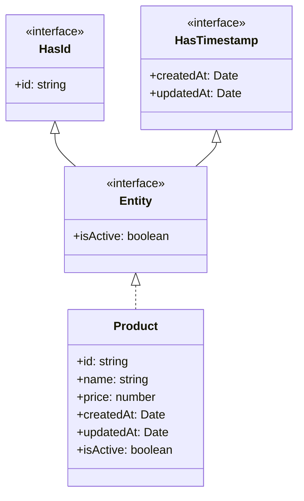
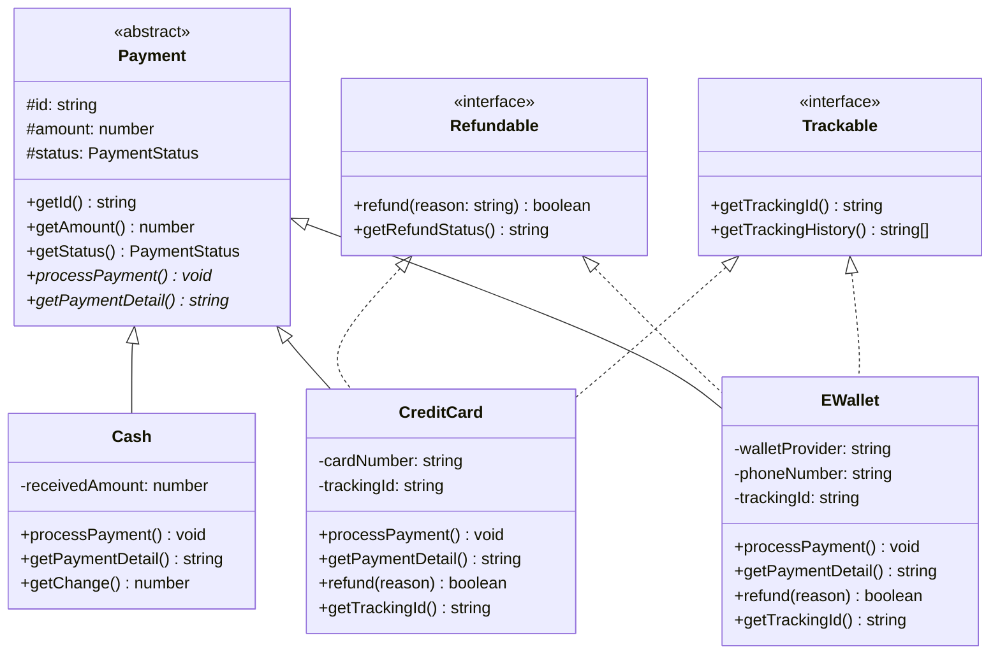

> **Mata Kuliah:** Pemrograman Berorientasi Objek
> **Minggu:** 4
> **Bagian:** Fundamentals
> **Bahasa:** TypeScript 5.x

---

## Capaian Pembelajaran Modul

Setelah mempelajari modul ini, mahasiswa mampu:
1. Memahami konsep **abstraksi** sebagai pilar keempat OOP dan menjelaskan perannya dalam desain perangkat lunak
2. Menjelaskan perbedaan mendasar antara **abstract class** dan **interface** serta kapan menggunakan masing-masing
3. Menggunakan keyword **`implements`** untuk menerapkan interface pada sebuah class
4. Menerapkan **multiple interface implementation** pada satu class
5. Merancang hierarki class menggunakan kombinasi abstract class dan interface untuk studi kasus nyata

---

## Prasyarat

- **Modul 01:** Paradigma OOP & Setup Environment TypeScript
- **Modul 02:** Class, Object & Encapsulation
- **Modul 03:** Inheritance & Method Overriding

---

## Daftar Isi

- [1. Pendahuluan](#1-pendahuluan)
- [2. Landasan Konsep](#2-landasan-konsep)
- [3. Implementasi dalam TypeScript](#3-implementasi-dalam-typescript)
- [4. Perbandingan Lintas Bahasa](#4-perbandingan-lintas-bahasa)
- [5. Studi Kasus: Sistem Pembayaran](#5-studi-kasus-sistem-pembayaran)
- [6. Kesalahan Umum & Best Practices](#6-kesalahan-umum--best-practices)
- [7. Ringkasan](#7-ringkasan)
- [8. Latihan Mandiri](#8-latihan-mandiri)

---

## 1. Pendahuluan

Di modul sebelumnya, kita telah mempelajari **encapsulation**, menyembunyikan detail internal melalui access modifier, dan **inheritance**, membentuk hierarki class melalui pewarisan. Kedua konsep tersebut sudah memberikan kemampuan membangun struktur kode yang terorganisir dan reusable.

Namun ada pertanyaan penting yang belum terjawab: *bagaimana kita mendefinisikan "kontrak" yang memastikan setiap class turunan memiliki perilaku tertentu, tanpa memaksakan implementasi spesifik?*

Inilah peran **Abstraction**, pilar keempat OOP. Abstraction memungkinkan kita mendefinisikan **apa yang harus dilakukan** oleh sebuah objek tanpa menentukan **bagaimana cara melakukannya**. Dalam TypeScript, abstraction diwujudkan melalui dua mekanisme: **abstract class** dan **interface**.

> 🔑 **Konsep Kunci:** Encapsulation menyembunyikan *data internal*, sedangkan Abstraction menyembunyikan *detail implementasi*. Keduanya saling melengkapi, encapsulation fokus pada "bagaimana menyembunyikan", abstraction fokus pada "apa yang ditampilkan".

---

## 2. Landasan Konsep

### 2.1 Konsep Abstraksi

**Abstraksi** adalah proses menyembunyikan detail implementasi yang kompleks dan hanya menampilkan fungsionalitas yang relevan. Analogi: ketika menggunakan remote TV, kita hanya menekan tombol tanpa perlu tahu proses encoding sinyal infrared di dalamnya. Tombol remote adalah **abstraksi** dari seluruh proses tersebut.

Dalam OOP, abstraksi dicapai melalui:
- **Abstract class**: kerangka umum dengan sebagian implementasi
- **Interface**: kontrak murni yang mendefinisikan "bentuk" (shape) dari sebuah objek

### 2.2 Abstract Class

**Abstract class** adalah class yang **tidak bisa di-instantiate langsung**. Ia berfungsi sebagai *blueprint* yang harus di-extend oleh class konkret.

Karakteristik:
- Ditandai keyword `abstract` sebelum `class`
- **Tidak bisa** di-instantiate (`new AbstractClass()` akan error)
- **Bisa** memiliki property, method biasa (dengan implementasi), dan constructor
- **Bisa** memiliki abstract method (tanpa implementasi)
- Hanya mendukung **single inheritance**

> 💡 **Insight:** Abstract class berada di antara class biasa dan interface, bisa menyediakan implementasi default untuk sebagian method, sambil memaksa subclass mengimplementasikan method tertentu.

### 2.3 Abstract Method

**Abstract method** adalah method yang dideklarasikan tanpa body implementasi. Ia berfungsi sebagai "kontrak", setiap subclass **wajib** mengimplementasikannya.

Karakteristik:
- Ditandai keyword `abstract` sebelum method signature
- **Tidak memiliki body** (tanpa kurung kurawal `{}`)
- Hanya bisa ada di dalam abstract class
- Subclass wajib implementasi, atau subclass juga harus `abstract`

### 2.4 Interface

**Interface** adalah **pure contract**, mendefinisikan "shape" yang harus dimiliki objek tanpa implementasi sama sekali. Interface menjawab: *"method dan property apa saja yang harus dimiliki?"*

Karakteristik:
- Ditandai keyword `interface`
- **Tidak bisa** punya implementasi, constructor, atau access modifier pada member
- Semua member bersifat publik
- Sebuah class bisa implement **banyak interface** (multiple implementation)
- Interface bisa meng-extend interface lain

> 🔑 **Konsep Kunci:** Interface mendefinisikan "apa yang bisa dilakukan" (capability). Penamaan sering menggunakan adjective: `Printable`, `Serializable`, `Refundable`, `Trackable`.

### 2.5 Perbedaan Abstract Class vs Interface

| Aspek | Abstract Class | Interface |
|-------|---------------|-----------|
| Implementasi method | Bisa (concrete + abstract) | Tidak bisa (hanya signature) |
| Constructor | Bisa | Tidak bisa |
| Property dengan nilai | Bisa | Tidak bisa |
| Access modifier | `private`, `protected`, `public` | Semua otomatis `public` |
| Inheritance model | Single (`extends` satu) | Multiple (`implements` banyak) |
| Cocok untuk | Hierarki "is-a" + shared logic | Kontrak "can-do" / capability |

**Kapan abstract class?** Ketika ada logika bersama (shared implementation) dan relasi "is-a" yang kuat.

**Kapan interface?** Ketika mendefinisikan kontrak/kemampuan yang bisa dimiliki class-class yang tidak berhubungan, atau saat butuh multiple contracts.

> 🔄 **Perbandingan:** Abstract class seperti "template resep masakan" yang menyediakan langkah umum namun menyerahkan langkah spesifik ke chef. Interface seperti "daftar sertifikasi", seorang chef bisa punya `HalalCertified`, `OrganicCertified`, dan `VeganCertified` sekaligus.

---

## 3. Implementasi dalam TypeScript

### 3.1 Abstract Class with Abstract Methods

```typescript
abstract class Shape {
    constructor(protected color: string) {}

    // Abstract method: wajib di-override subclass
    abstract calculateArea(): number;
    abstract calculatePerimeter(): number;

    // Method biasa: diwarisi subclass
    describe(): string {
        return `${this.color} shape, area = ${this.calculateArea().toFixed(2)}`;
    }
}

// ❌ const s = new Shape("red"); // Error: Cannot create an instance of an abstract class.

class Circle extends Shape {
    constructor(color: string, private radius: number) {
        super(color);
    }

    calculateArea(): number {
        return Math.PI * this.radius ** 2;
    }

    calculatePerimeter(): number {
        return 2 * Math.PI * this.radius;
    }
}

class Rectangle extends Shape {
    constructor(color: string, private width: number, private height: number) {
        super(color);
    }

    calculateArea(): number {
        return this.width * this.height;
    }

    calculatePerimeter(): number {
        return 2 * (this.width + this.height);
    }
}

// Penggunaan + polymorphism
const shapes: Shape[] = [new Circle("red", 5), new Rectangle("blue", 4, 6)];
shapes.forEach((s) => console.log(s.describe()));
// Output: "red shape, area = 78.54"
// Output: "blue shape, area = 24.00"
```

> ⚠️ **Perhatian:** Jika subclass tidak mengimplementasikan **semua** abstract method, TypeScript akan menampilkan compile error. Compiler memastikan tidak ada method yang terlewat.

### 3.2 Interface Declaration and Implementation

```typescript
interface Printable {
    print(): void;
    getFormattedOutput(): string;
}

class Report implements Printable {
    constructor(private title: string, private content: string) {}

    print(): void {
        console.log(this.getFormattedOutput());
    }

    getFormattedOutput(): string {
        return `=== ${this.title} ===\n${this.content}`;
    }
}

const report = new Report("Laporan Bulanan", "Penjualan naik 15%.");
report.print();
// Output:
// === Laporan Bulanan ===
// Penjualan naik 15%.
```

### 3.3 `implements` Keyword

Keyword `implements` menyatakan bahwa class **berkomitmen memenuhi kontrak** interface. Berbeda dengan `extends` yang mewarisi implementasi, `implements` hanya mewajibkan class menyediakan implementasi sendiri.

```typescript
interface Serializable {
    serialize(): string;
    deserialize(data: string): void;
}

class UserProfile implements Serializable {
    constructor(public name: string, public email: string) {}

    serialize(): string {
        return JSON.stringify({ name: this.name, email: this.email });
    }

    deserialize(data: string): void {
        const parsed = JSON.parse(data) as { name: string; email: string };
        this.name = parsed.name;
        this.email = parsed.email;
    }
}

const profile = new UserProfile("Budi", "budi@mail.com");
console.log(profile.serialize());
// Output: {"name":"Budi","email":"budi@mail.com"}
```

### 3.4 Multiple Interface Implementation

Satu class bisa mengimplementasikan **banyak interface** sekaligus, keunggulan utama dibanding abstract class.

```typescript
interface Printable {
    print(): void;
}

interface Exportable {
    exportToJSON(): string;
}

interface Validatable {
    validate(): boolean;
    getErrors(): string[];
}

class Invoice implements Printable, Exportable, Validatable {
    private errors: string[] = [];

    constructor(
        private invoiceNumber: string,
        private amount: number,
        private customerName: string
    ) {}

    print(): void {
        console.log(`Invoice #${this.invoiceNumber}: ${this.customerName} - Rp${this.amount.toLocaleString("id-ID")}`);
    }

    exportToJSON(): string {
        return JSON.stringify({
            invoiceNumber: this.invoiceNumber,
            amount: this.amount,
            customerName: this.customerName,
        });
    }

    validate(): boolean {
        this.errors = [];
        if (this.amount <= 0) this.errors.push("Amount harus > 0");
        if (this.customerName.trim() === "") this.errors.push("Nama customer kosong");
        return this.errors.length === 0;
    }

    getErrors(): string[] {
        return [...this.errors];
    }
}

const inv = new Invoice("INV-001", 500000, "PT Maju Jaya");
inv.print();           // Invoice #INV-001: PT Maju Jaya - Rp500.000
console.log(inv.validate()); // true
```

> 💡 **Insight:** Multiple interface implementation sejalan dengan prinsip **Interface Segregation**, memecah kontrak besar menjadi kontrak kecil yang spesifik. Class hanya implement interface yang relevan.

### 3.5 Interface Extending Interface

Interface bisa meng-extend interface lain untuk membentuk kontrak yang lebih lengkap.

```typescript
interface HasId {
    id: string;
}

interface HasTimestamp {
    createdAt: Date;
    updatedAt: Date;
}

// Meng-extend dua interface sekaligus
interface Entity extends HasId, HasTimestamp {
    isActive: boolean;
}

class Product implements Entity {
    public createdAt: Date;
    public updatedAt: Date;
    public isActive: boolean = true;

    constructor(public id: string, public name: string, public price: number) {
        this.createdAt = new Date();
        this.updatedAt = new Date();
    }
}
```



---

## 4. Perbandingan Lintas Bahasa

### TypeScript vs Java vs Dart

| Aspek | TypeScript | Java | Dart |
|-------|-----------|------|------|
| Abstract class | `abstract class Foo {}` | `abstract class Foo {}` | `abstract class Foo {}` |
| Interface keyword | `interface Foo {}` | `interface Foo {}` | Tidak ada (semua class bisa jadi interface) |
| Implement | `class A implements X {}` | `class A implements X {}` | `class A implements X {}` |
| Multiple implement | Ya | Ya | Ya |
| Interface punya implementasi? | **TIDAK** | **YA** (`default` method, Java 8+) | **TIDAK** |
| Type system | **Structural** (duck typing) | **Nominal** (eksplisit) | **Nominal** (eksplisit) |

### Perbedaan Krusial 1: Default Method di Java

Sejak Java 8, interface di Java bisa memiliki **default method**, method dengan implementasi. TypeScript interface **sama sekali tidak bisa** punya implementasi.

```java
// Java: interface BISA punya default method
public interface Greetable {
    String getName();

    default void greet() {  // ← implementasi di interface!
        System.out.println("Hello, " + getName() + "!");
    }
}
```

```typescript
// TypeScript: interface TIDAK BISA punya implementasi
interface Greetable {
    getName(): string;
    greet(): void;  // ✅ Hanya signature, tanpa body
}
```

> ⚠️ **Perhatian:** Jika membaca tutorial Java yang menunjukkan implementasi di interface, jangan bingung. Di TypeScript, gunakan **abstract class** jika butuh implementasi default.

### Perbedaan Krusial 2: Structural vs Nominal Typing

**TypeScript (structural):** objek dianggap compatible jika punya **shape yang sama**, tanpa perlu `implements`.

**Java (nominal):** class **harus eksplisit** mendeklarasikan `implements`.

```typescript
// TypeScript: Structural Typing
interface Printable {
    print(): void;
}

// obj ini TIDAK mendeklarasikan "implements Printable"
const obj = {
    print() {
        console.log("hello");
    },
};

function doSomething(p: Printable): void {
    p.print();
}

doSomething(obj); // ✅ Works! Structural typing - shape cocok, otomatis compatible
```

```java
// Java: Nominal Typing
public class MyObject {
    public void print() { System.out.println("hello"); }
}
// ❌ Printable p = new MyObject(); // Error! Harus eksplisit implements
```

> 🔄 **Perbandingan:** Structural typing membuat TypeScript lebih fleksibel, cocok untuk ekosistem JavaScript yang dinamis. Nominal typing di Java lebih ketat, cocok untuk aplikasi enterprise dengan kontrak eksplisit. Keduanya punya trade-off masing-masing.

---

## 5. Studi Kasus: Sistem Pembayaran

### 5.1 Deskripsi Masalah

Rancang sistem pembayaran e-commerce yang mendukung tiga metode: **Cash** (COD), **CreditCard**, dan **EWallet** (GoPay, OVO, dll.). Sistem harus mendukung **refund** (tidak semua metode bisa refund, Cash tidak bisa) dan **tracking** (pelacakan status untuk pembayaran digital).

### 5.2 Desain Solusi



### 5.3 Implementasi

```typescript
type PaymentStatus = "pending" | "processing" | "completed" | "failed" | "refunded";

// === Abstract Class: Payment ===
abstract class Payment {
    protected status: PaymentStatus = "pending";

    constructor(protected id: string, protected amount: number) {}

    getId(): string { return this.id; }
    getAmount(): number { return this.amount; }
    getStatus(): PaymentStatus { return this.status; }

    abstract processPayment(): void;
    abstract getPaymentDetail(): string;
}

// === Interfaces ===
interface Refundable {
    refund(reason: string): boolean;
    getRefundStatus(): string;
}

interface Trackable {
    getTrackingId(): string;
    getTrackingHistory(): string[];
}

// === Cash: hanya extends Payment (tidak bisa refund/track) ===
class Cash extends Payment {
    constructor(id: string, amount: number, private receivedAmount: number) {
        super(id, amount);
    }

    processPayment(): void {
        if (this.receivedAmount < this.amount) {
            this.status = "failed";
            console.log(`[Cash] Gagal. Uang kurang.`);
            return;
        }
        this.status = "completed";
        console.log(`[Cash] Berhasil. Kembalian: Rp${this.getChange().toLocaleString("id-ID")}`);
    }

    getPaymentDetail(): string {
        return `Cash #${this.id} | Rp${this.amount.toLocaleString("id-ID")} | Diterima: Rp${this.receivedAmount.toLocaleString("id-ID")}`;
    }

    getChange(): number {
        return Math.max(0, this.receivedAmount - this.amount);
    }
}

// === CreditCard: extends Payment + implements Refundable, Trackable ===
class CreditCard extends Payment implements Refundable, Trackable {
    private trackingId: string;
    private history: string[] = [];
    private refundStatus: string = "none";

    constructor(id: string, amount: number, private cardNumber: string) {
        super(id, amount);
        this.trackingId = `TRK-CC-${id}`;
    }

    processPayment(): void {
        const masked = this.cardNumber.slice(-4).padStart(this.cardNumber.length, "*");
        this.status = "completed";
        this.history.push(`Pembayaran via kartu ${masked} berhasil`);
        console.log(`[CC] Rp${this.amount.toLocaleString("id-ID")} berhasil via ${masked}`);
    }

    getPaymentDetail(): string {
        const masked = this.cardNumber.slice(-4).padStart(this.cardNumber.length, "*");
        return `CC #${this.id} | ${masked} | Rp${this.amount.toLocaleString("id-ID")}`;
    }

    refund(reason: string): boolean {
        if (this.status !== "completed") { this.refundStatus = "failed"; return false; }
        this.status = "refunded";
        this.refundStatus = "approved";
        this.history.push(`Refund: ${reason}`);
        console.log(`[CC] Refund Rp${this.amount.toLocaleString("id-ID")} berhasil.`);
        return true;
    }

    getRefundStatus(): string { return this.refundStatus; }
    getTrackingId(): string { return this.trackingId; }
    getTrackingHistory(): string[] { return [...this.history]; }
}

// === EWallet: extends Payment + implements Refundable, Trackable ===
class EWallet extends Payment implements Refundable, Trackable {
    private trackingId: string;
    private history: string[] = [];
    private refundStatus: string = "none";

    constructor(id: string, amount: number, private provider: string, private phone: string) {
        super(id, amount);
        this.trackingId = `TRK-EW-${id}`;
    }

    processPayment(): void {
        this.status = "completed";
        this.history.push(`Pembayaran via ${this.provider} (${this.phone}) berhasil`);
        console.log(`[EWallet] Rp${this.amount.toLocaleString("id-ID")} berhasil via ${this.provider}`);
    }

    getPaymentDetail(): string {
        return `EWallet #${this.id} | ${this.provider} (${this.phone}) | Rp${this.amount.toLocaleString("id-ID")}`;
    }

    refund(reason: string): boolean {
        if (this.status !== "completed") { this.refundStatus = "failed"; return false; }
        this.status = "refunded";
        this.refundStatus = "approved";
        this.history.push(`Refund ke ${this.provider}: ${reason}`);
        console.log(`[EWallet] Refund Rp${this.amount.toLocaleString("id-ID")} ke ${this.provider} berhasil.`);
        return true;
    }

    getRefundStatus(): string { return this.refundStatus; }
    getTrackingId(): string { return this.trackingId; }
    getTrackingHistory(): string[] { return [...this.history]; }
}

// === Penggunaan ===
const cash = new Cash("PAY-001", 150000, 200000);
cash.processPayment();  // [Cash] Berhasil. Kembalian: Rp50.000

const cc = new CreditCard("PAY-002", 750000, "4111111111111234");
cc.processPayment();    // [CC] Rp750.000 berhasil via ************1234

const ewallet = new EWallet("PAY-003", 50000, "GoPay", "081234567890");
ewallet.processPayment(); // [EWallet] Rp50.000 berhasil via GoPay
ewallet.refund("Barang tidak sesuai"); // [EWallet] Refund Rp50.000 ke GoPay berhasil.

// Polymorphism: semua disimpan sebagai Payment[]
const payments: Payment[] = [cash, cc, ewallet];
payments.forEach((p) => console.log(`${p.getPaymentDetail()} | ${p.getStatus()}`));

// Type guard: filter yang Refundable saja
function showRefundStatus(payments: Payment[]): void {
    for (const p of payments) {
        if ("refund" in p && "getRefundStatus" in p) {
            console.log(`${p.getId()}: refund = ${(p as Refundable).getRefundStatus()}`);
        } else {
            console.log(`${p.getId()}: tidak mendukung refund`);
        }
    }
}
showRefundStatus(payments);
// PAY-001: tidak mendukung refund
// PAY-002: refund = none
// PAY-003: refund = approved
```

### 5.4 Analisis Keputusan Desain

1. **Mengapa `Payment` sebagai abstract class?** Karena ada shared state (`id`, `amount`, `status`) dan shared logic (`getId()`, `getAmount()`) yang identik di semua subclass. Abstract class memungkinkan penulisan sekali dan pewarisan.

2. **Mengapa `Refundable` dan `Trackable` sebagai interface?** Karena tidak semua pembayaran mendukung refund (Cash tidak bisa). Interface memungkinkan penerapan selektif. Selain itu, `CreditCard` dan `EWallet` perlu implement keduanya sekaligus, multiple inheritance abstract class tidak mungkin, tapi multiple interface implementation bisa.

3. **Mengapa `Cash` tidak implement `Refundable`?** Secara bisnis, pembayaran tunai COD tidak mendukung refund melalui sistem. Tidak meng-implement berarti **compile-time safety**, mustahil secara tidak sengaja memanggil `refund()` pada Cash.

> 🔑 **Konsep Kunci:** Abstract class untuk **shared "is-a" relationship**, interface untuk **optional "can-do" capabilities**. Kombinasi keduanya menghasilkan arsitektur fleksibel dan type-safe.

---

## 6. Kesalahan Umum & Best Practices

### ❌ Mencoba meng-instantiate abstract class

```typescript
abstract class Animal {
    abstract makeSound(): void;
}
// ❌ const a = new Animal(); // Error: Cannot create an instance of an abstract class.
```

### ✅ Selalu extend dengan class konkret

```typescript
class Dog extends Animal {
    makeSound(): void { console.log("Woof!"); }
}
const dog = new Dog(); // ✅
```

### ❌ Lupa mengimplementasikan abstract method

```typescript
abstract class Vehicle {
    abstract start(): void;
    abstract stop(): void;
}
// ❌ Error: 'Car' does not implement 'stop' from 'Vehicle'.
class Car extends Vehicle {
    start(): void { console.log("Started"); }
    // Lupa stop()!
}
```

### ❌ Menulis implementasi di dalam interface

```typescript
interface Calculable {
    // ❌ Error! Interface members cannot have body
    // calculate(): number { return 0; }
    calculate(): number; // ✅ Hanya signature
}
```

### ❌ God Interface: satu interface terlalu besar

```typescript
// ❌ Terlalu banyak tanggung jawab
interface SuperEntity {
    save(): void;
    delete(): void;
    print(): void;
    export(): string;
    validate(): boolean;
    log(): void;
}
```

### ✅ Pecah menjadi interface kecil yang spesifik

```typescript
// ✅ Interface Segregation Principle
interface Persistable {
    save(): void;
    delete(): void;
}

interface Printable {
    print(): void;
}

interface Exportable {
    export(): string;
}

// Class hanya implement yang dibutuhkan
class Invoice implements Persistable, Printable {
    save(): void { /* ... */ }
    delete(): void { /* ... */ }
    print(): void { /* ... */ }
}
```

> 💡 **Insight:** Prinsip **Interface Segregation** (salah satu SOLID principles) menyatakan: "client tidak boleh dipaksa bergantung pada interface yang tidak digunakannya." Pecah interface besar menjadi interface kecil yang fokus.

---

## 7. Ringkasan

- **Abstraksi** menyembunyikan detail implementasi dan mengekspos fungsionalitas relevan, pilar keempat OOP
- **Abstract class** tidak bisa di-instantiate; bisa punya method concrete dan abstract; cocok untuk relasi **"is-a"** dengan shared logic
- **Abstract method** adalah method tanpa body yang menjadi kontrak wajib bagi subclass
- **Interface** adalah pure contract yang mendefinisikan "shape" objek; tidak bisa punya implementasi; cocok untuk relasi **"can-do"**
- **`implements`** menyatakan class memenuhi kontrak interface, berbeda dengan `extends` yang mewarisi implementasi
- **Multiple interface implementation** memungkinkan satu class memenuhi banyak kontrak, tidak mungkin dengan abstract class
- TypeScript menggunakan **structural typing**, shape cocok berarti compatible, tanpa perlu eksplisit `implements`
- Java interface bisa punya `default` method (sejak Java 8), TypeScript interface **tidak bisa** sama sekali
- Kombinasi abstract class + interface menghasilkan desain yang fleksibel dan type-safe

---

## 8. Latihan Mandiri

### Latihan 1: Pertanyaan Konseptual

1. Jelaskan perbedaan antara "menyembunyikan data" (encapsulation) dan "menyembunyikan detail implementasi" (abstraction). Berikan masing-masing satu contoh analogi.

2. Sebuah aplikasi memiliki fitur notifikasi via Email, SMS, dan Push Notification. Mana yang lebih tepat sebagai base: abstract class atau interface? Jelaskan alasannya.

3. Apakah kode berikut valid di TypeScript? Mengapa?
   ```typescript
   interface Flyable {
       fly(): void;
   }

   const airplane = {
       fly() { console.log("Flying at 30,000 feet"); },
       land() { console.log("Landing..."); },
   };

   const f: Flyable = airplane;
   f.fly();
   ```

### Latihan 2: Mini Exercise

Buatlah sistem notifikasi dengan ketentuan:
- Abstract class `Notification` dengan property `recipient` (string), `message` (string), dan abstract method `send(): boolean`
- Interface `Schedulable` dengan method `scheduleAt(date: Date): void` dan `getScheduledTime(): Date | null`
- Interface `Retryable` dengan method `retry(): boolean` dan `getRetryCount(): number`
- Class `EmailNotification` extends `Notification`, implements `Schedulable` dan `Retryable`
- Class `SMSNotification` extends `Notification`, implements `Retryable` saja
- Class `PushNotification` extends `Notification`, implements `Schedulable` saja

Pastikan semua kode compile dengan `strict: true`.

### Latihan 3: Analisis Kode

Identifikasi **semua masalah** pada kode berikut dan jelaskan cara memperbaikinya:

```typescript
abstract class Database {
    abstract connect(): void;
    abstract query(sql: string): any[];

    log(message: string): void {
        console.log(`[DB] ${message}`);
    }
}

interface Cacheable {
    cache(key: string, data: any): void;
    getFromCache(key: string): any;
    clearCache(): void;
}

class MySQLDatabase extends Database implements Cacheable {
    connect(): void {
        this.log("Connected to MySQL");
    }
    // Apakah ada method yang hilang?
    // Apakah ada masalah dengan tipe data?
    // Apakah desain interface-nya sudah tepat?
}
```

Petunjuk: periksa (a) kelengkapan implementasi method, (b) penggunaan `any`, dan (c) proporsionalitas interface `Cacheable`.

---

## Referensi & Bacaan Lanjutan

- TypeScript Handbook, Classes: https://www.typescriptlang.org/docs/handbook/2/classes.html
- TypeScript Handbook, Abstract Classes: https://www.typescriptlang.org/docs/handbook/2/classes.html#abstract-classes-and-members
- TypeScript Handbook, Object Types (Interfaces): https://www.typescriptlang.org/docs/handbook/2/objects.html
- TypeScript Deep Dive, Interfaces: https://basarat.gitbook.io/typescript/type-system/interfaces
- "Design Patterns: Elements of Reusable Object-Oriented Software", Erich Gamma et al. (Gang of Four)
- SOLID Principles, Interface Segregation Principle: https://en.wikipedia.org/wiki/Interface_segregation_principle
