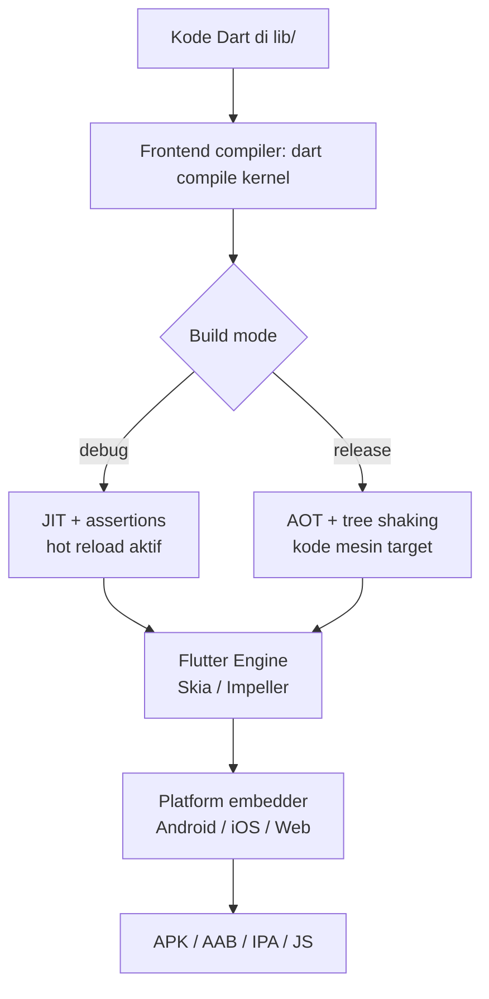
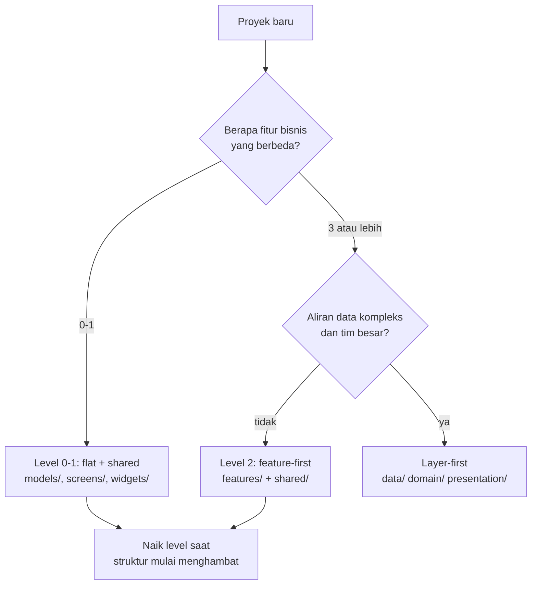

## Tujuan Pembelajaran

Bab 3 menutup dengan Tracker yang hidup: daftar tugas, dialog tambah, layar detail. Semuanya masih hidup di dua tempat, `lib/main.dart` dan folder `lib/models/`. Selama aplikasi sekecil itu, struktur bukan masalah. Namun begitu kode bertambah, tiga pertanyaan mulai muncul: file baru diletakkan di mana, dependency ditambahkan kapan dan bagaimana, dan pengaturan Android yang mana yang boleh disentuh.

Bab ini menjawab ketiganya dari arah yang sering dilewati tutorial: memahami apa yang sebenarnya terjadi ketika Anda menekan `flutter run`. Setelah menyelesaikan bab ini, Anda bisa:

1. Menjelaskan perjalanan kode Dart menjadi aplikasi: kompilasi kernel, build mode, hot reload, dan tree shaking.
2. Membaca dan mengubah `pubspec.yaml` dengan sengaja: batas versi SDK, dependency, dev dependency, dan assets.
3. Membaca konfigurasi Android modern (Kotlin DSL) dan tahu bagian mana yang tidak perlu disentuh.
4. Memilih struktur folder yang sesuai skala aplikasi, bukan struktur terbesar yang bisa dibayangkan.
5. Membedakan environment dengan `--dart-define` dan memahami kapan flavor sungguhan dibutuhkan.

Estimasi: baca sekitar 45 menit, praktik sekitar 60 menit.

## Anatomi Proyek Hasil `flutter create`

Jalankan `flutter create tracker` dan Anda mendapat proyek yang langsung bisa dijalankan, bukan kerangka kosong. Struktur pentingnya:

```
tracker/
├── lib/
│   └── main.dart          # kode aplikasi Anda
├── test/
│   └── widget_test.dart   # test bawaan, dijalankan flutter test
├── android/               # host aplikasi di Android
├── ios/                   # host aplikasi di iOS
├── web/                   # host aplikasi di browser
├── pubspec.yaml           # identitas, dependency, assets
├── pubspec.lock           # versi dependency terkunci (hasil pub get)
├── analysis_options.yaml  # aturan linter untuk dart analyze
└── .metadata              # metadata tooling Flutter
```

Aturan praktisnya sederhana: sehari-hari Anda bekerja di `lib/`, `test/`, dan `pubspec.yaml`. Folder `android/` dan `ios/` hanya disentuh untuk pengaturan platform, identitas aplikasi, permission, atau signing saat rilis nanti di bab 14. Folder host ini diurus oleh `flutter create` dan migrasi otomatis Flutter; mengedit isinya secara massal hampir selalu kesalahan.

Sejak Flutter 3.29, template Android memakai Gradle Kotlin DSL, file build bernama `build.gradle.kts`, bukan `build.gradle` gaya Groovy. Tutorial lama yang menampilkan `def`, `apply plugin:`, dan `minSdkVersion 21` di file `.gradle` adalah tulisan dari era sebelumnya; bagian Android nanti menunjukkan bentuk modernnya.

## Build System: Dari Dart ke Aplikasi

`flutter run` terasa seperti satu tombol, padahal ada rangkaian panjang di belakangnya:



Tahap pertama selalu sama: frontend compiler mengubah kode Dart Anda menjadi kernel binary. Yang membedakan adalah ke mana kernel itu pergi. Di mode debug ia dijalankan oleh Dart VM dengan JIT (just-in-time), sehingga kode baru bisa disuntikkan ke proses yang sedang berjalan, itulah mesin di balik hot reload. Di mode release kernel dikompilasi AOT (ahead-of-time) menjadi kode mesin untuk arsitektur target, dengan tree shaking yang membuang kode tak terpakai agar aplikasi ramping.

### Tiga build mode

| Mode    | Kompilasi | Ukuran | Kecepatan   | Dipakai untuk                                  |
| ------- | --------- | ------ | ----------- | ---------------------------------------------- |
| debug   | JIT       | besar  | lambat      | pengembangan harian: hot reload, assertions on |
| profile | AOT       | sedang | dekat rilis | mengukur performa realistis di DevTools        |
| release | AOT       | kecil  | tercepat    | distribusi ke pengguna                         |

Mode `profile` sering dilupakan pemula: mengukur performa di build debug menghasilkan angka yang menyesatkan karena assertions dan overhead JIT ikut terukur. Saat tiba di bab 13, semua pengukuran dilakukan di mode ini.

### Hot reload, hot restart, dan cold build

Tiga istilah yang sering tertukar:

- **Hot reload** (`r` di `flutter run`): kode baru disuntikkan, **state aplikasi dipertahankan**. Anda berada di tengah daftar tugas setelah menambah tiga item, mengubah warna chip, tekan `r`, tiga item itu masih ada. Ini alasan utama iterasi UI di Flutter terasa cepat.
- **Hot restart** (`R`): kode baru dimuat ulang, **state kembali ke awal**. Dipakai saat perubahan menyentuh `main()` atau `initState` yang ingin diulang dari nol.
- **Cold build** (menjalankan ulang `flutter run`): proses aplikasi dibangun dan dijalankan dari awal. Dipakai saat konfigurasi native berubah, dependency baru, perubahan manifest, atau perubahan `pubspec.yaml`.

Ketergantungan pada hot reload juga menjelaskan disiplin kode bab 3: alokasi di `initState` dan pembersihan di `dispose` menjaga state tetap sehat lintas ratusan reload. State yang bocor akan terasa: daftar tugas berlipat, controller mati dipakai lagi.

### Perintah yang perlu dikenal

```bash
flutter run                 # jalankan di debug dengan hot reload
flutter run --profile       # jalankan dalam mode profil performa
flutter analyze             # periksa kode terhadap linter
flutter test                # jalankan seluruh test di test/
flutter build apk --debug   # APK debug
flutter build appbundle     # AAB release untuk Play Store (bab 14)
flutter clean               # hapus artefak build saat keadaan aneh
```

`flutter clean` adalah palu terakhir, bukan rutinitas. Sebelum menyentuhnya, baca dulu pesan errornya; mayoritas masalah build punya penyebab spesifik yang ditulis di log.

## pubspec.yaml: Pusat Konfigurasi

Semua yang masuk ke aplikasi Anda dari luar kode Dart dikendalikan dari satu file. Versi Tracker yang kita pakai di buku ini terlihat seperti ini:

```yaml
name: tracker
description: Aplikasi pencatat tugas - aplikasi acuan buku Pemrograman Flutter.
publish_to: 'none'
version: 1.0.0+1

environment:
  sdk: ^3.11.0

dependencies:
  flutter:
    sdk: flutter

dev_dependencies:
  flutter_test:
    sdk: flutter
  flutter_lints: ^6.0.0

flutter:
  uses-material-design: true
```

Bagian per bagian:

- **`name`** menjadi nama package Dart, harus huruf kecil dengan underscore, tanpa strip. Semua `import 'package:tracker/...'` di kode merujuk nama ini.
- **`publish_to: 'none'`** menyatakan aplikasi ini bukan package yang akan dipublikasikan ke pub.dev. Biarkan untuk aplikasi.
- **`version: 1.0.0+1`** adalah versi aplikasi dengan format `versi+build`. Angka build inilah yang naik setiap rilis ke Play Store.
- **`environment.sdk`** membatasi versi Dart yang boleh membangun proyek. Salin nilai ini dari template `flutter create` Anda, jangan tulis dari ingatan, nilai di atas adalah contoh dengan baseline September 2026. Naikkan batas bawah hanya saat Anda memakai fitur bahasa baru, karena setiap kenaikan menutup pintu bagi toolchain lama.
- **`dependencies`** untuk paket yang ikut terbang ke aplikasi; **`dev_dependencies`** hanya dipakai saat pengembangan, `flutter_test` dan `flutter_lints` tidak menambah ukuran APK.

### Menambah dependency: saat dibutuhkan, lewat perintah

Cara yang benar menambahkan paket bukan mengedit YAML manual lalu berdoa, melainkan:

```bash
flutter pub add http           # dependency aplikasi
flutter pub add --dev build_runner  # dev dependency
flutter pub get                # pasang sesuai pubspec (biasanya otomatis)
```

`flutter pub add http` menuliskan `http: ^1.x.y` dengan versi terbaru yang kompatibel sekaligus menjalankan `pub get`. Notasi caret berarti "versi ini atau yang lebih baru selama masih 1.x", `^1.2.3` mengizinkan `1.9.0` namun menolak `2.0.0`. Itulah ringkasan semantic versioning yang perlu Anda pegang di tahap ini: major version naik berarti ada perubahan yang bisa memutus kode Anda, dan caret menjauhkannya secara otomatis.

Dua file pendamping yang perlu dipahami:

- **`pubspec.lock`** mencatat versi persis yang terpasang setelah `pub get` menyelesaikan grafik dependency. Untuk **aplikasi**, commit file ini, rekan tim dan CI Anda membangun dengan versi yang sama persis. Untuk **package** yang akan dipublikasikan, jangan commit, karena konsumen package menyelesaikan versinya sendiri. Jangan pernah mengeditnya dengan tangan.
- **`.dart_tool/package_config.json`** adalah artefak internal; abaikan.

### Prinsip dependency minimal

Godaan besar setelah paham pubspec adalah memasang semua paket yang "kelak pasti dipakai" di awal proyek: state management, database, charts, rich text editor. Tahan. Setiap dependency adalah biaya: versi yang harus mengikuti rilis Flutter, permukaan API yang bisa berubah, dan permission platform yang bisa ikut aktif diam-diam lewat manifest paket.

Aturan buku ini: **paket ditambahkan pada bab yang mengimplementasikan fiturnya, tidak lebih awal**. `shared_preferences` baru hadir di bab 7, `http` di bab 9, `sqflite` di bab 8 dan 10. Sampai bab ini berakhir, Tracker justru membuktikan sebaliknya: aplikasi yang berfungsi penuh, model, state, navigasi, tidak butuh satu pun paket pihak ketiga. Dependency yang tidak ada tidak bisa rusak.

### Assets

Gambar, font, dan file data didaftarkan di bagian `flutter`:

```yaml
flutter:
  uses-material-design: true
  assets:
    - assets/images/empty_state.png
    - assets/data/
```

Dua hal yang membedakan perilakunya: mendaftarkan satu file hanya memasukkan file itu, sedangkan mendaftarkan direktori (`assets/data/`) memasukkan semua file di dalamnya **tanpa** menelusuri subdirektorinya. Flutter juga otomatis memilih varian resolusi bila Anda menyediakan `2.0x/` dan `3.0x/` di samping file dasar, buat gambar penting dalam tiga ukuran itu, biarkan framework memilih sesuai kepadatan layar.

Aset yang lupa didaftarkan memunculkan error `Unable to load asset` saat runtime, bukan saat build. Kebiasaan yang menghemat waktu: setelah menambah aset, jalankan ulang aplikasi (cold build, karena `pubspec.yaml` berubah) sebelum menuduh kodenya salah.

## Lints dan analysis_options.yaml

`analysis_options.yaml` hasil template hanya berisi satu baris:

```yaml
include: package:flutter_lints/flutter.yaml
```

Baris itu mengaktifkan kumpulan aturan resmi tim Flutter: anggota privat diawali underscore, `const` yang bisa disimpulkan, `Widget` yang sebaiknya `const`, dan puluhan lainnya. Sebagian bisa Anda perketat sendiri, misalnya:

```yaml
include: package:flutter_lints/flutter.yaml

linter:
  rules:
    prefer_const_constructors: true
    prefer_final_locals: true
    avoid_print: true
```

Aturan `avoid_print` layak ditegakkan sejak awal: `print` yang tertinggal ikut ke build release. Untuk mencatat sesuatu, pakai `dart developer.log` yang tampil di DevTools dan tidak menodai aplikasi rilis.

Seluruh aturan ini dijalankan oleh `flutter analyze` dan ditandai langsung oleh editor. Perhatikan pola bab-bab sebelumnya: kode di buku ini nyaris selalu lolos analyze bersih. Menjaga hijau sejak baris pertama jauh lebih murah daripada menumpuk utang lalu membereskan seratus peringatan sekaligus.

## Konfigurasi Android: Kotlin DSL dan Variabel Flutter

Saat tiba saatnya menyentuh `android/`, misalnya mengubah identitas aplikasi, file yang dituju adalah `android/app/build.gradle.kts`. Bentuk modernnya:

```kotlin
plugins {
    id("com.android.application")
    id("kotlin-android")
    id("dev.flutter.flutter-gradle-plugin")
}

android {
    namespace = "com.example.tracker"
    compileSdk = flutter.compileSdkVersion
    ndkVersion = flutter.ndkVersion

    compileOptions {
        sourceCompatibility = JavaVersion.VERSION_17
        targetCompatibility = JavaVersion.VERSION_17
    }

    defaultConfig {
        applicationId = "com.example.tracker"
        minSdk = flutter.minSdkVersion
        targetSdk = flutter.targetSdkVersion
        versionCode = flutter.versionCode
        versionName = flutter.versionName
    }

    buildTypes {
        release {
            signingConfig = signingConfigs.getByName("debug")
        }
    }
}
```

Perhatikan bahwa tidak ada satu pun angka SDK yang ditulis manual. `flutter.compileSdkVersion`, `flutter.minSdkVersion`, dan `flutter.targetSdkVersion` adalah variabel yang diinjeksi oleh Flutter tooling sesuai versi Flutter yang Anda pakai, nilainya berpindah otomatis saat toolchain diperbarui. `versionCode` dan `versionName` diambil dari `version:` di `pubspec.yaml`, sehingga sumber kebenaran versi tetap satu.

Ini bukan gaya-gayaan. Kebijakan Google Play mewajibkan aplikasi menargetkan API level tertentu untuk bisa diperbarui, target API 36 (Android 16) berlaku untuk update aplikasi sejak 31 Agustus 2026 (https://support.google.com/googleplay/android-developer/answer/11926878). Angka syarat itu akan terus naik. Kode yang memakai variabel template hanya perlu memperbarui Flutter; kode yang menulis `targetSdkVersion 34` secara manual akan menolak dijalankan berbulan-bulan kemudian tanpa ada yang menyentuhnya.

Bagian `signingConfig` di atas memakai kunci debug agar `flutter run --release` bisa dicoba, ini bawaan template. Signing sungguhan untuk Play Store dibahas di bab 14.

### Permission: ditambah saat fiturnya hadir

Buka `android/app/src/main/AndroidManifest.xml` hasil template dan Anda tidak akan menemukan satu pun `<uses-permission>`. Template memang tidak meminta apa pun, dan itulah kondisi yang benar: **permission ditambahkan bersama fitur yang benar-benar membutuhkannya, pada bab yang mengimplementasikan fitur itu**, bukan ditanam di awal sebagai persiapan.

Beberapa fakta yang meluruskan kebiasaan lama:

- Internet untuk pengembangan (hot reload, DevTools) diurus oleh manifest `debug/` dan `profile/` khusus; ia tidak otomatis ada di build release. Saat Tracker mulai memanggil REST API di bab 9, baris `<uses-permission android:name="android.permission.INTERNET" />` ditambahkan ke manifest utama.
- Akses galeri lewat photo picker modern Android **tidak butuh** permission storage: picker berjalan di proses sistem dan hanya mengembalikan file yang dipilih pengguna. Menuliskan `READ_EXTERNAL_STORAGE` atau `READ_MEDIA_IMAGES` untuk kebutuhan itu sudah usang. Detail kamera dan file menyusul di bab 12.
- Permission lokasi baru relevan di bab 12 bersama `geolocator`.

Menahan permission sampai fiturnya ada bukan hanya kerapian: setiap permission tampil ke pengguna saat instal dan menurunkan kepercayaan bila tidak jelas gunanya.

## Struktur Folder yang Tumbuh Bersama Aplikasi

Sekarang pertanyaan besarnya: di mana meletakkan file baru? Jawaban yang jujur: **sesuai skala aplikasi, dinaikkan saat rasa sakitnya nyata, bukan sebelumnya**.

### Level 0: satu titik masuk dan satu folder model

Tracker Anda saat ini:

```
lib/
├── main.dart          # TrackerApp, TaskListScreen, TaskTile, TaskDetailScreen
└── models/
    ├── task.dart
    └── task_repository.dart
```

Lima kelas di satu file terdengar kotor? Belum tentu, semuanya masih terbaca sekali gulung, dan setiap kelas tahu persis di mana tetangganya. Struktur ini justru tepat untuk aplikasi dengan satu alur utama. Marker pertama bahwa level ini mulai sesak: file melebihi ~300 baris, atau Anda harus men-scroll jauh untuk berpindah antar kelas yang sedang diedit bersama.

### Level 1: pisahkan layar dan barang bersama

Saat itu terjadi, pecah menurut peran, bukan menurut fitur:

```
lib/
├── main.dart          # main() + TrackerApp saja
├── screens/
│   ├── task_list_screen.dart
│   └── task_detail_screen.dart
├── widgets/
│   └── priority_chip.dart
└── models/
    ├── task.dart
    └── task_repository.dart
```

Folder `widgets/` menampung komponen yang dipakai lintas layar. Di titik ini Anda mungkin juga memindahkan tema ke `theme.dart`. Aplikasi dengan dua-tiga layar hidup nyaman lama di level ini.

### Level 2: feature-first saat fitur benar-benar beragam

Feature-first mengorganisir kode menurut **kemampuan bisnis**, bukan jenis file. Kuncinya memahami apa itu "fitur": bukan layar, melainkan kapabilitas yang punya model data dan aturan sendiri, `auth` (login, sesi, lupa password), `tasks` (CRUD tugas dan prioritasnya), `analytics` (rekap dan grafik). `TaskDetailScreen` bukan fitur; ia layar di dalam fitur tasks.

Struktur lengkapnya untuk aplikasi yang sudah sampai situ:

```
lib/
├── main.dart
├── features/
│   ├── auth/
│   │   ├── models/
│   │   ├── screens/
│   │   └── widgets/
│   └── tasks/
│       ├── models/
│       ├── screens/
│       └── widgets/
└── shared/
    ├── widgets/
    ├── theme/
    └── utils/
```

Keunggulannya: satu folder = satu kapabilitas yang bisa dikembangkan relatif mandiri, dan dua orang mengerjakan dua fitur tanpa saling menabrak file. Harganya: file-file peran sama (semua `models/`, semua `screens/`) tersebar, dan struktur foldernya lebih dalam.

### Pembanding: layer-first / repository-first

Pendekatan lain mengorganisir menurut lapisan teknis:

```
lib/
├── data/          # repository, sumber data (API, database)
├── domain/        # model dan aturan bisnis
└── presentation/  # widget dan layar
```

Ini pola clean architecture. Kekuatannya nyata: kontrak antar lapisan tegas, `domain` tidak tahu apa-apa tentang UI maupun HTTP, sehingga logika bisnis bisa dites tanpa emulator dan sumber data bisa ditukar (repository in-memory saat test, REST saat rilis, teknik yang sudah Anda cicipi di bab 3 lewat `TaskRepository`). Harganya juga nyata: satu perubahan kecil menyentuh tiga lapisan dan sejumlah file perancah; untuk aplikasi dua layar, lapisan-lapisan itu hanya menambah jarak antara sebab dan akibat.

Perbandingannya yang jujur, tanpa mengultuskan salah satu:

| Aspek                | Flat + shared (level 0-1) | Feature-first (level 2) | Layer-first                         |
| -------------------- | ------------------------- | ----------------------- | ----------------------------------- |
| Cocok untuk          | aplikasi 1-3 layar        | 3+ fitur bisnis berbeda | aliran data kompleks, tim besar     |
| Biaya awal           | minimal                   | sedang                  | tinggi                              |
| Menambah fitur       | mudah jadi campur aduk    | folder baru, mandiri    | menyentuh banyak lapisan            |
| Menelusuri satu alur | dekat, kadang penuh sesak | masuk satu folder fitur | melompat antar lapisan              |
| Kapan berlebihan     | setelah ~3 fitur          | fitur masih 1           | hampir selalu, untuk aplikasi kecil |



Untuk Tracker di buku ini, keputusannya eksplisit: **tetap di level 0-1** selama bab-bab UI (5-6), lalu menimbang naik ke feature-first ketika fitur penyimpanan dan autentikasi mulai hadir di bab 8-9. Refactor struktur folder adalah operasi murah di Flutter, memindah file dan membetulkan import, sehingga menunda keputusan tidak menutup pintu apa pun. Yang mahal adalah menjalani kompleksitas yang belum dibutuhkan.

## Environment Berbeda: --dart-define dan Flavors

Aplikasi nyata hampir selalu butuh membedakan lingkungan: server development atau produksi, tampilkan log atau tidak. Cara termurah di Flutter adalah `--dart-define`:

```bash
flutter run --dart-define=APP_ENV=dev
flutter build apk --dart-define=APP_ENV=prod
```

Nilainya dibaca sebagai konstanta kompilasi:

```dart
const appEnv = String.fromEnvironment('APP_ENV', defaultValue: 'dev');

// Konstanta kompilasi: cabang yang tidak terpilih ikut ter-tree-shake
// dari build, jadi log dev tidak pernah terbawa ke APK produksi.
if (appEnv == 'dev') {
  // pengaturan khusus pengembangan
}
```

Karena `String.fromEnvironment` adalah konstanta kompilasi, ini lebih dari sekadar membaca variabel: cabang environment yang tidak terpilih benar-benar hilang dari binary hasil build. Tracker akan memakai pola ini di bab 9 untuk alamat API.

Kebutuhan yang tidak bisa dipenuhi `--dart-define` adalah **dua aplikasi berbeda terpasang berdampingan** di satu ponsel: versi dev dan versi prod dengan ikon dan nama berbeda. Solusi platformnya adalah flavor Android (dan scheme iOS): identitas aplikasi diberi akhiran per lingkungan lewat `applicationIdSuffix ".dev"` di `build.gradle.kts`, dan setiap flavor bisa membawa resource serta define sendiri. Konfigurasinya panjang dan berbatasan dengan persiapan rilis, sehingga dibahas tuntas di bab 14; sampai di sana, `--dart-define` menutup seluruh kebutuhan development Anda.

## Ringkasan

- Proyek hasil `flutter create` sudah bisa berjalan; pekerjaan harian berada di `lib/`, `test/`, dan `pubspec.yaml`. Folder platform hanya disentuh untuk pengaturan platform.
- Build debug memakai JIT demi hot reload dengan state yang dipertahankan; build release memakai AOT plus tree shaking; pengukuran performa dilakukan di mode profile.
- `pubspec.yaml` adalah pusat kendali: batas versi SDK di `environment`, paket ditambah dengan `flutter pub add` saat fiturnya diimplementasikan, aplikasi meng-commit `pubspec.lock`, aset didaftarkan eksplisit.
- `flutter_lints` lewat `analysis_options.yaml` dijaga hijau sejak awal; `flutter analyze` dan `flutter test` adalah gerbang kualitas yang murah.
- Konfigurasi Android modern adalah Kotlin DSL dengan `flutter.compileSdkVersion` dan kawan-kawan, tanpa satu angka SDK manual, sehingga kebijakan Play (target API 36 sejak 31 Agustus 2026) dikejar lewat pembaruan toolchain, bukan edit file.
- Permission ditambahkan saat fiturnya hadir; photo picker modern tidak butuh permission storage, dan INTERNET untuk rilis ditambahkan bersama bab 9.
- Struktur folder naik tingkat mengikuti skala: flat, lalu shared, lalu feature-first saat fitur bisnis beragam; layer-first adalah pembanding sah untuk aliran data kompleks, bukan pakaian default.
- Environment berbeda cukup dengan `--dart-define` dan konstanta kompilasi; flavor penuh menanti bab 14.

Tracker Anda berakhir di bab ini tanpa satu baris konfigurasi platform yang disentuh, dan itu kabar baik. Bab 5 memperkaya tampilannya dengan sistem Material 3, bab 6 merakit custom widget, dan semuanya berdiri di atas struktur yang tadi diputuskan sekali: sederhana dulu, naik saat perlu.

## Bekerja dengan AI di Bab Ini

**Pantas didelegasikan:** menanyakan arti berkas konfigurasi Gradle atau entri `pubspec.yaml` yang tidak Anda kenali, dan menafsirkan kegagalan build yang pesannya panjang.

**Tulis sendiri:** keputusan struktur folder. Struktur yang benar bergantung pada bentuk aplikasi Anda dan cara Anda mencari berkas; struktur yang disalin dari jawaban umum akan terasa asing setiap kali Anda membukanya. Bagian ini yang menentukan apakah bab ini benar-benar Anda kuasai.

**Latihan:** Tempelkan satu kegagalan build lengkap ke AI dan minta ia menunjuk baris yang benar-benar menyebabkannya. Kegagalan build biasanya berisi ratusan baris dengan penyebab sebenarnya terselip di tengah. Sesudahnya, temukan sendiri baris itu di log tanpa melihat jawaban AI, dan bandingkan.

## Referensi Lanjutan

- Anatomi proyek dan perintah Flutter CLI: https://docs.flutter.dev/reference/flutter-cli
- Build modes dan hot reload: https://docs.flutter.dev/testing/build-modes serta https://docs.flutter.dev/tools/hot-reload
- Pubspec dan manajemen dependency: https://docs.flutter.dev/tools/pubspec
- Aset dan gambar (termasuk varian resolusi): https://docs.flutter.dev/ui/assets/assets-and-images
- Konfigurasi Gradle untuk Android: https://docs.flutter.dev/deployment/android dan https://flutter.dev/to/review-gradle-config
- Kebijakan target API Google Play: https://support.google.com/googleplay/android-developer/answer/11926878
- Konfigurasi flavor: https://docs.flutter.dev/deployment/flavors
