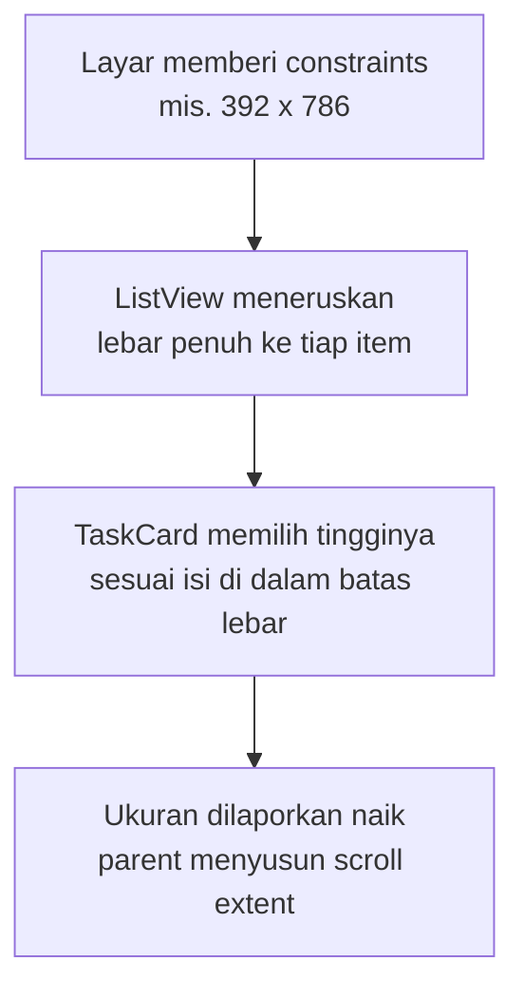

## Tujuan Pembelajaran

Tracker Anda berakhir di bab 4 dengan struktur rapi: `lib/main.dart` dan `lib/models/`, tanpa satu dependency pihak ketiga. Fungsinya jalan, daftar tugas, dialog tambah, layar detail, tapi tampilannya masih "templatenya Flutter": `TaskTile` berisi `Checkbox` dan judul, tanpa identitas visual, tanpa prioritas yang terlihat, tanpa tenggat yang menonjol.

Bab ini mengisi lapisan tampilan itu secara sistematis. Kata kuncinya _sistem_, bukan dekorasi: alih-alih mewarnai widget satu per satu, Anda menetapkan tema sekali dan membiarkan seluruh aplikasi mengikuti. Setelah menyelesaikan bab ini, Anda bisa:

1. Membangun tema Material 3 terpusat dengan `ColorScheme.fromSeed` dan memilih peran warna yang tepat untuk setiap elemen.
2. Merakit `TaskCard`, komponen kanonik buku ini, dengan kontrak yang jelas untuk dipakai ulang.
3. Membuat layout adaptif berbasis ruang yang tersedia, bukan menebak jenis perangkat.
4. Mengubah struktur tata letak di ruang lebar, bukan sekadar melonggarkan margin.
5. Menangani pengguna yang memperbesar ukuran teks tanpa merusak layout.
6. Menerapkan fondasi aksesibilitas: semantics, kontras, target sentuh, dan state interaksi.

Estimasi: baca sekitar 60 menit, praktik sekitar 130 menit, terbagi dalam empat checkpoint.

## Material 3: Sistem, Bukan Katalog Warna

Material 3 (M3) aktif sebagai tampilan bawaan Flutter sejak versi 3.16. Anda tidak perlu menyalakan apa pun, `ThemeData()` sekarang berarti Material 3. Yang berubah dibanding tulisan tutorial era sebelumnya adalah cara berpikirnya: M3 tidak menyuruh Anda memilih warna, melainkan memilih **peran** warna. `primary` untuk tombol utama, `surface` untuk latar kartu, `error` untuk keadaan gagal. Nilai pasti setiap peran diturunkan dari satu warna benih:

```dart
final scheme = ColorScheme.fromSeed(seedColor: Color(0xFF1E88E5));
```

Dari satu benih biru itu Flutter membangun puluhan warna yang saling selaras, versi terang dan gelap, varian tonal untuk kontainer. Mengganti identitas visual aplikasi nanti cukup mengganti satu baris ini.

### Peran-peran yang dipakai Tracker

| Peran                                      | Dipakai untuk               | Di Tracker                          |
| ------------------------------------------ | --------------------------- | ----------------------------------- |
| `primary` / `onPrimary`                    | tombol utama dan isinya     | `FilledButton`, judul seksi detail  |
| `surface` / `onSurface`                    | latar kartu, teks utama     | `Card`, judul tugas                 |
| `onSurfaceVariant`                         | teks sekunder               | judul tugas selesai, tenggat normal |
| `error` / `onError`                        | keadaan gagal, kontras kuat | teks tenggat terlambat              |
| `errorContainer` / `onErrorContainer`      | versi tonal dari error      | latar geser hapus, chip "Terlambat" |
| `secondaryContainer` / `tertiaryContainer` | aksen tonal                 | chip prioritas rendah/sedang        |

Perhatikan polanya: peran kontainer selalu berpasangan dengan peran `on`-nya (`errorContainer` dengan `onErrorContainer`). Pasangan ini dirancang sistem agar kontrasnya memadai, memakai warna acak untuk teks di atas warna acak adalah cara paling umum merusak keterbacaan, dan akan kembali menghantui di bagian aksesibilitas.

Satu catatan migrasi yang sering membetulkan kode lama: metode `withOpacity()` telah usang sejak Flutter 3.27 dan digantikan `withValues(alpha: ...)`. Perilakunya sama untuk kebutuhan umum, tetapi API baru mendukung gamut warna yang lebih lebar. Semua kode di buku ini memakai `withValues`.

### Dynamic color: tahu, tapi tunda

Android 12+ memungkinkan aplikasi mengambil warna wallpaper pengguna lewat package `dynamic_color`. Ini fitur khas M3 yang bagus, namun Tracker belum memasangnya, sesuai aturan dependency minimal dari bab 4: paket ditambahkan saat fiturnya benar-benar diimplementasikan. Pola integrasinya sekali lagi sederhana (mengganti `scheme` di tema bila tersedia), sehingga menunda tidak menutup pintu apa pun.

## Checkpoint 1: Tema Terpusat dan TaskCard Kanonik

**Target:** tema di satu file, `TaskCard` sebagai komponen pertama struktur level 1.
**Waktu:** sekitar 45 menit.

Bab 4 menutup dengan aturan "naik struktur saat rasa sakitnya nyata". Rasanya kini nyata: `main.dart` menampung lima kelas dan tema baru tidak punya rumah. Naik ke level 1:

```
lib/
├── main.dart          # main() + TrackerApp saja
├── theme.dart         # tema Material 3
├── screens/
│   ├── task_list_screen.dart
│   └── task_detail_screen.dart
├── widgets/
│   ├── task_card.dart       # komponen kanonik bab ini
│   └── priority_chip.dart
└── models/
    ├── task.dart
    └── task_repository.dart
```

### Langkah 1.1: theme.dart

File baru `lib/theme.dart`:

```dart
import 'package:flutter/material.dart';

/// Tema Tracker (kanonik bab 5): satu sumber kebenaran untuk warna
/// dan elevasi seluruh aplikasi. Seluruh widget membaca peran warna
/// dari sini, bukan warna hardcode.
abstract final class TrackerTheme {
  /// Warna benih merek Tracker; seluruh tonal palette diturunkan
  /// dari warna ini oleh ColorScheme.fromSeed.
  static const seedColor = Color(0xFF1E88E5);

  static ThemeData light() {
    final scheme = ColorScheme.fromSeed(seedColor: seedColor);

    return ThemeData(
      colorScheme: scheme,
      cardTheme: const CardThemeData(elevation: 1),
    );
  }
}
```

`abstract final class` membuat kelas ini tidak bisa diinstansiasi, ia sekadar kumpulan konstanta dan fungsi tema, dan Dart 3 menyediakan sintaks itu persis untuk kebutuhan ini. Elevasi kartu ditetapkan sekali di `cardTheme` sehingga setiap `Card` di aplikasi konsisten tanpa mengulang `elevation:` di tiap tempat.

### Langkah 1.2: PriorityChip dengan peran warna

`PriorityChip` yang tadinya tinggal di `main.dart` pindah ke `lib/widgets/priority_chip.dart` sekaligus naik kelas: alih-alih satu warna primary untuk semua prioritas, ia memetakan prioritas ke pasangan peran kontainer:

```dart
import 'package:flutter/material.dart';

import '../models/task.dart';

/// Chip prioritas tugas: memetakan prioritas ke pasangan peran warna
/// container/onContainer yang kontrasnya dijamin sistem, bukan warna
/// hardcode.
class PriorityChip extends StatelessWidget {
  const PriorityChip({super.key, required this.priority});

  final Priority priority;

  @override
  Widget build(BuildContext context) {
    final scheme = Theme.of(context).colorScheme;
    final (background, foreground) = switch (priority) {
      Priority.high => (scheme.errorContainer, scheme.onErrorContainer),
      Priority.medium => (
        scheme.tertiaryContainer,
        scheme.onTertiaryContainer,
      ),
      Priority.low => (scheme.secondaryContainer, scheme.onSecondaryContainer),
    };

    return Container(
      padding: const EdgeInsets.symmetric(horizontal: 8, vertical: 4),
      decoration: BoxDecoration(
        color: background,
        borderRadius: BorderRadius.circular(8),
      ),
      child: Text(
        priority.label,
        style: Theme.of(context).textTheme.labelSmall?.copyWith(
          color: foreground,
          fontWeight: FontWeight.w600,
        ),
      ),
    );
  }
}
```

Ekspresi `switch` yang mengembalikan record `(background, foreground)` lalu di-destructuring adalah idiom Dart 3 yang menggantikan tiga fungsi getter terpisah. Prioritas tinggi memakai pasangan error, merah tonal, bukan merah pekat, agar tetap terbaca sebagai informasi tanpa berteriak.

### Langkah 1.3: TaskCard

Komponen inti bab ini, file baru `lib/widgets/task_card.dart`:

```dart
import 'package:flutter/material.dart';

import '../models/task.dart';
import 'priority_chip.dart';

/// Kartu tugas kanonik (bab 5).
///
/// Kontrak yang dipertahankan lintas bab:
/// - menampilkan satu [Task]: judul, prioritas, tenggat, status selesai;
/// - [onToggle] dipanggil checkbox berubah, [onTap] saat kartu ditekan;
/// - stateless: tidak memegang state dan tidak tahu cara memperoleh data.
///
/// Bab 6 hanya me-refactor/memperluas komponen ini, bukan menulis ulang.
class TaskCard extends StatelessWidget {
  const TaskCard({
    super.key,
    required this.task,
    required this.onToggle,
    required this.onTap,
  });

  final Task task;
  final ValueChanged<bool?> onToggle;
  final VoidCallback onTap;

  @override
  Widget build(BuildContext context) {
    final theme = Theme.of(context);
    final scheme = theme.colorScheme;

    return Card(
      margin: const EdgeInsets.only(bottom: 8),
      child: InkWell(
        onTap: onTap,
        child: Padding(
          padding: const EdgeInsets.symmetric(horizontal: 8, vertical: 8),
          child: Row(
            crossAxisAlignment: CrossAxisAlignment.center,
            children: [
              Checkbox(value: task.done, onChanged: onToggle),
              const SizedBox(width: 8),
              Expanded(
                child: Column(
                  crossAxisAlignment: CrossAxisAlignment.start,
                  children: [
                    Text(
                      task.title,
                      maxLines: 2,
                      overflow: TextOverflow.ellipsis,
                      style: theme.textTheme.titleMedium?.copyWith(
                        fontWeight: FontWeight.w600,
                        color: task.done
                            ? scheme.onSurfaceVariant
                            : scheme.onSurface,
                        decoration: task.done
                            ? TextDecoration.lineThrough
                            : null,
                        decorationColor: scheme.onSurfaceVariant,
                      ),
                    ),
                    const SizedBox(height: 4),
                    // Wrap, bukan Row: saat text scale besar, label
                    // turun ke baris berikutnya alih-alih overflow.
                    Wrap(
                      spacing: 8,
                      runSpacing: 4,
                      crossAxisAlignment: WrapCrossAlignment.center,
                      children: [
                        PriorityChip(priority: task.priority),
                        if (task.dueDate != null)
                          _DueDateLabel(
                            date: task.dueDate!,
                            overdue: task.isOverdue,
                          ),
                      ],
                    ),
                  ],
                ),
              ),
            ],
          ),
        ),
      ),
    );
  }
}

/// Label tenggat dengan ikon dekoratif: ikon kalender disembunyikan
/// dari pembaca layar (ExcludeSemantics) karena teks "Tenggat ..."
/// sudah menyampaikan maknanya.
class _DueDateLabel extends StatelessWidget {
  const _DueDateLabel({required this.date, required this.overdue});

  final DateTime date;
  final bool overdue;

  @override
  Widget build(BuildContext context) {
    final theme = Theme.of(context);
    final color = overdue
        ? theme.colorScheme.error
        : theme.colorScheme.onSurfaceVariant;

    return Text.rich(
      TextSpan(
        children: [
          WidgetSpan(
            child: ExcludeSemantics(
              child: Icon(Icons.event, size: 16, color: color),
            ),
          ),
          const WidgetSpan(child: SizedBox(width: 4)),
          TextSpan(
            text: 'Tenggat ${date.day}/${date.month}/${date.year}',
          ),
        ],
      ),
      style: theme.textTheme.labelMedium?.copyWith(color: color),
    );
  }
}
```

Beberapa keputusan yang tertanam di sini:

- **Kartu dibungkus `InkWell` di dalam `Card`**, bukan `ListTile`, seluruh kartu jadi area sentuh dengan ripple Material, dan tata letaknya milik kita sepenuhnya.
- **Teks memakai `titleMedium`/`labelMedium` dari `textTheme`**, bukan `fontSize` angka. Skala tipografi M3 sudah dirancang berhierarki; menimpanya dengan angka manual menghapus konsistensi itu.
- **Tanggal diformat manual** (`day/month/year`). Library `intl` memang standar untuk format tanggal lokal, tetapi aturan dependency minimal berlaku: kebutuhan Tracker sekarang satu pola sederhana; `intl` masuk daftar saat bab-bab berikutnya benar-benar membutuhkan lokalisasi penuh.
- **`_DueDateLabel` memakai `Text.rich` dengan `WidgetSpan`** sehingga ikon dan teks menjadi satu alur teks, dan `Wrap` bisa memutus baris dengan benar saat ruang sempit.
- **`Checkbox` langsung dipakai tanpa pembungkus**. Material 3 menjamin area sentuhnya minimal 48×48 dp lewat `materialTapTargetSize` bawaan; jangan pernah mengecilkan area ini demi kerapian visual.

### Langkah 1.4: main.dart mengecil

```dart
import 'package:flutter/material.dart';

import 'models/task_repository.dart';
import 'screens/task_list_screen.dart';
import 'theme.dart';

/// Aplikasi acuan Task Tracker: versi akhir bab 5:
/// tema Material 3 terpusat, struktur level 1, TaskCard kanonik,
/// layout adaptif berbasis ruang, dan interaksi yang aksesibel.
void main() {
  runApp(const TrackerApp());
}

class TrackerApp extends StatelessWidget {
  const TrackerApp({super.key});

  @override
  Widget build(BuildContext context) {
    return MaterialApp(
      title: 'Task Tracker Gate',
      theme: TrackerTheme.light(),
      home: TaskListScreen(repository: MemoryTaskRepository()),
    );
  }
}
```

`TaskListScreen` dan `TaskDetailScreen` pindah ke `lib/screens/` dengan isi yang sama seperti bab 3, hanya ganti `TaskTile` menjadi `TaskCard` di pembangun item daftar. Pemindahan file plus perbaikan import; tidak ada logika yang berubah.

**Validasi checkpoint:**

- `flutter analyze` bersih tanpa peringatan.
- Aplikasi berjalan; kartu tugas menampilkan judul, chip prioritas berwarna tonal, dan tenggat berwarna merah untuk tugas yang lewat.
- Mengetuk kartu membuka detail; checkbox tetap berfungsi.
- Mengganti `seedColor` di `theme.dart` mengubah nuansa seluruh aplikasi, bukti satu sumber kebenaran bekerja.

## Checkpoint 2: Layout yang Mengikuti Ruang

**Target:** aplikasi terbaca enak di ponsel potret, tablet, dan landscape.
**Waktu:** sekitar 25 menit.

### Constraints turun, ukuran naik

Layout Flutter berjalan satu arah bergantian: parent memberi **constraints** (batas ukuran) kepada anak, anak memilih ukuran di dalam batas itu, lalu melaporkannya ke parent. Semua widget layout, `Padding`, `Expanded`, `Center`, `Row`, hanyalah cara berbeda menyusuri aturan main ini:



Konsekuensi praktisnya: pertanyaan yang benar bukan "ini layar berapa inci?", melainkan **"berapa ruang yang tersedia untuk bagian ini?"** Karena itu Flutter tidak punya API `isTablet()`, dan tutorial yang meminta Anda menghitung `screenWidth * 0.045` untuk ukuran font sedang menempatkan jawaban di pertanyaan yang salah, ukuran teks milik preferensi pengguna (lihat text scaling di bawah), bukan lebar layar.

### Breakpoint berbasis ruang

Dua tempat di Tracker membutuhkan adaptasi, keduanya diselesaikan dengan `LayoutBuilder` dan `ConstrainedBox`:

**Daftar:** margin samping tumbuh saat ruang longgar. Di `TaskListScreen`, bungkus `ListView.builder` dengan `LayoutBuilder`:

```dart
body: _tasks.isEmpty
    ? _buildEmptyState()
    : LayoutBuilder(
        builder: (context, constraints) {
          // Breakpoint berbasis ruang tersedia, bukan jenis
          // perangkat: margin sempit di ponsel potret, lebar di
          // tablet/landscape.
          final horizontal = constraints.maxWidth < 600 ? 12.0 : 48.0;
          return ListView.builder(
            padding: EdgeInsets.symmetric(
              horizontal: horizontal,
              vertical: 12,
            ),
            itemCount: _tasks.length,
            itemBuilder: (context, index) =>
                _buildDismissible(_tasks[index]),
          );
        },
      ),
```

Angka 600 dp bukan kebetulan, itu batas lebar jendela ponsel potret menurut panduan window size class, dan Flutter menyediakan `MediaQuery.sizeOf` bila Anda butuh nilainya di luar `LayoutBuilder`. Yang penting bukan angkanya, melainkan alasannya: "sisa ruang kurang dari 600, baris teks akan terlalu panjang kalau margin besar."

**Detail:** konten berhenti di tengah. `TaskDetailScreen` membelit `ListView`-nya:

```dart
body: Center(
  // Breakpoint berbasis ruang: di ponsel potret Center + batas 600
  // tidak berpengaruh (konten mengisi layar), di tablet/landscape
  // konten berhenti di 600 dp.
  child: ConstrainedBox(
    constraints: const BoxConstraints(maxWidth: 600),
    child: ListView(
      padding: const EdgeInsets.all(16),
      // ... isi layar detail
    ),
  ),
),
```

`Center` + `ConstrainedBox(maxWidth: 600)` adalah pola paling murah di Flutter untuk masalah "teks terbentang selebar tablet": di layar sempit keduanya transparan (konten mengisi layar seperti biasa), di layar lebar konten berhenti di 600 dp dan berada di tengah. Tidak ada cabang if, tidak ada dua widget tree.

### Text scaling: desain untuk skala yang lebih besar

Pengguna mengatur ukuran teks sistem di pengaturan aksesibilitas, dan Flutter menerapkannya otomatis ke seluruh `Text`. Jika perlu tahu skalanya, misalnya menghitung tinggi untuk custom painter, bacanya lewat:

```dart
final scaler = MediaQuery.textScalerOf(context);
final tinggi = scaler.scale(14); // 14 logis dikali skala pengguna
```

Aturan utamanya satu kalimat: **jangan pernah menonaktifkan text scaler.** Menemukan `MediaQuery` lalu menimpa `textScaler` agar layout tidak rusak sama dengan memindahkan masalah ke pengguna yang paling tidak mampu mengatasinya. Yang benar adalah membuat layout bertahan saat teks membesar, dan `TaskCard` sudah mempraktikkan tiga tekniknya:

- `Expanded` pada kolom isi kartu, judul dan label mendapat sisa lebar berapa pun itu.
- `Wrap` alih-alih `Row` untuk baris chip dan tenggat, saat membesar, label turun ke baris baru, bukan meluber keluar layar.
- `maxLines: 2` + `TextOverflow.ellipsis` pada judul, judul sangat panjang terpotong rapi dengan elipsis, bukan menggeser layout.

Ketiganya juga otomatis mengurus satu kasus yang sama sering diabaikan: teks bahasa yang lebih panjang setelah diterjemahkan. Layout yang tahan text scale umumnya tahan pula lokalisasi.

**Validasi checkpoint:**

- Jalankan aplikasi, putar perangkat ke landscape, margin daftar melebar, detail tetap terbaca.
- Di emulator, set pengaturan sistem **Settings > Accessibility > Display size and text > Font size** ke maksimal: kartu menumpuk rapi label turun-baris, tidak ada garis kuning-hitam overflow.
- `flutter analyze` tetap bersih.

## Checkpoint 3: Struktur yang Berubah, Bukan Sekadar Margin

**Target:** di ruang lebar, Tracker tidak hanya melonggarkan margin, tetapi menampilkan daftar dan detail berdampingan. **Estimasi: 40 menit.**

**Sudah ada:** tema terpusat, `TaskCard`, margin dan lebar baca yang mengikuti ruang, layout yang bertahan saat teks membesar.
**Yang ditambahkan:** satu titik percabangan tata letak, dan konsekuensinya pada cara "memilih tugas" bekerja.

### Responsif berhenti di margin, adaptif mengubah bentuk

Checkpoint sebelumnya menyelesaikan masalah "teks terbentang selebar tablet" dengan `Center` dan `ConstrainedBox`. Itu jawaban yang benar, tetapi hanya untuk satu pertanyaan. Pertanyaan keduanya belum dijawab: pada layar selebar 1000 dp, dua pertiga layar dibiarkan kosong sementara detail tugas tetap dibuka sebagai layar penuh yang menutupi daftar. Ruangnya ada, tetapi tidak dipakai.

Di sinilah batas antara dua istilah yang sering dipakai bergantian. **Responsif** berarti tata letak yang sama menyesuaikan ukurannya. **Adaptif** berarti tata letak yang berbeda dipilih menurut ruang yang tersedia. Sampai sekarang Tracker baru responsif.

### Dua cabang, satu ambang

```dart
// lib/screens/task_home_screen.dart
class TaskHomeScreen extends StatefulWidget {
  const TaskHomeScreen({super.key});

  @override
  State<TaskHomeScreen> createState() => _TaskHomeScreenState();
}

class _TaskHomeScreenState extends State<TaskHomeScreen> {
  String? _selectedId;

  @override
  Widget build(BuildContext context) {
    return LayoutBuilder(
      builder: (context, constraints) {
        // Ambang yang sama dengan Checkpoint 2: di bawah ini satu
        // kolom sudah memakai seluruh lebar yang nyaman dibaca.
        final wide = constraints.maxWidth >= 600;
        return wide ? _buildWide(context) : _buildNarrow(context);
      },
    );
  }
}
```

Cabang sempit adalah aplikasi yang sudah Anda punya: daftar memenuhi layar, `BottomNavigationBar` di bawah, dan memilih tugas berarti mendorong layar baru.

```dart
  Widget _buildNarrow(BuildContext context) {
    return Scaffold(
      appBar: AppBar(title: const Text('Tugas')),
      body: TaskListView(
        onSelect: (task) => Navigator.of(context).push(
          MaterialPageRoute(builder: (_) => TaskDetailScreen(id: task.id)),
        ),
      ),
      bottomNavigationBar: const TrackerBottomNav(),
    );
  }
```

Cabang lebar menukar dua hal sekaligus: navigasi bawah menjadi `NavigationRail` di samping, dan detail berhenti menjadi layar terpisah.

```dart
  Widget _buildWide(BuildContext context) {
    return Scaffold(
      body: Row(
        children: [
          const TrackerNavigationRail(),
          const VerticalDivider(width: 1),
          SizedBox(
            width: 360,
            child: TaskListView(
              selectedId: _selectedId,
              onSelect: (task) => setState(() => _selectedId = task.id),
            ),
          ),
          const VerticalDivider(width: 1),
          Expanded(
            child: _selectedId == null
                ? const Center(child: Text('Pilih tugas untuk melihat detail'))
                : TaskDetailView(id: _selectedId!),
          ),
        ],
      ),
    );
  }
```

### Pelajaran yang sebenarnya: memilih itu dua hal yang berbeda

Perhatikan `onSelect` pada kedua cabang. Di layar sempit, memilih tugas berarti `Navigator.push`. Di layar lebar, memilih tugas berarti `setState` mengubah `_selectedId`. Perbuatan penggunanya sama, artinya bagi aplikasi berbeda.

Konsekuensi inilah alasan `TaskDetailScreen` dan `TaskDetailView` dipisah menjadi dua. `TaskDetailView` adalah isinya: menerima `id`, menampilkan detail, tidak tahu apa-apa soal `Scaffold` maupun tombol kembali. `TaskDetailScreen` hanyalah pembungkus tipis yang menambahkan `Scaffold` dan `AppBar` di sekeliling `TaskDetailView` untuk keperluan layar sempit. Satu isi, dua cara menyajikan.

Kalau Anda melewatkan pemisahan ini dan langsung menempelkan layar penuh ke dalam `Row`, akibatnya segera terlihat: dua `AppBar` bertumpuk, dan tombol kembali yang tidak punya tujuan untuk dituju.

Itulah sebabnya adaptif bukan soal widget. Widgetnya gampang; yang menuntut pemikiran adalah menyadari bahwa satu perbuatan pengguna bisa berarti dua hal berbeda, dan menyusun kode supaya keduanya tidak saling menyandera.

### Orientasi bukan jawaban, ruang yang jawaban

Godaan berikutnya adalah memakai orientasi sebagai penentu:

```dart
// Hindari ini sebagai keputusan utama tata letak.
final wide = MediaQuery.orientationOf(context) == Orientation.landscape;
```

Ponsel dalam landscape memang lebih lebar, tetapi juga jauh lebih pendek. Dua kolom di ponsel landscape menghasilkan dua kolom sempit yang keduanya terlalu pendek untuk berguna. Sebaliknya, tablet dalam potret punya ruang berlimpah untuk dua kolom padahal orientasinya potret. Orientasi berkorelasi dengan ruang, tetapi bukan ruang itu sendiri, dan yang Anda butuhkan adalah ruangnya.

`OrientationBuilder` tetap berguna untuk keputusan yang memang tentang bentuk, bukan tentang luas: jumlah kolom pada kisi foto, atau apakah gambar sampul ditampilkan lebar dan pendek atau sempit dan tinggi. Untuk memilih struktur navigasi, ambang lebar dari `LayoutBuilder` adalah jawaban yang benar.

### Daftar Periksa Checkpoint 3

Jalankan pada tiga konfigurasi, dan tandai satu per satu. Daftar ini pula yang dipakai menilai gate capstone pertama.

- [ ] **Ponsel potret**: tampilan persis seperti sebelum checkpoint ini; tidak ada yang berubah, tidak ada yang rusak
- [ ] **Ponsel landscape**: tetap satu kolom, tidak ada meluap, bilah bawah tetap terjangkau
- [ ] **Tablet atau jendela lebar**: dua kolom muncul, `NavigationRail` menggantikan bilah bawah
- [ ] Memilih tugas di layar lebar **tidak** mendorong layar baru
- [ ] Hanya ada satu `AppBar` di layar lebar
- [ ] Jendela diperkecil pelan-pelan melewati ambang 600 dp: tata letak berpindah tanpa crash, dan tugas yang sedang dipilih tidak hilang
- [ ] Skala teks dinaikkan ke 150% pada ketiga konfigurasi, tidak ada yang meluap

Butir keenam paling sering gagal, dan paling mudah diuji di desktop atau di emulator tablet dengan jendela yang bisa diubah ukurannya.

### Batas Bab Ini

Buku ini memakai satu makna "adaptif": tata letak yang menyesuaikan **ruang yang tersedia**. Ada makna kedua yang tidak dibahas, yaitu menyesuaikan **konvensi platform**, misalnya menampilkan widget bergaya Cupertino di iOS dan Material di Android.

Alasannya bukan karena tidak penting, melainkan karena biayanya tidak sebanding di sini: Tracker dikembangkan dan dirilis ke Android sampai bab 14, dan setiap widget bergaya ganda melipatduakan permukaan yang harus diuji tanpa mengajarkan konsep baru. Bila Anda kelak merilis ke iOS, masuki topik itu lewat dokumentasi `Theme.of(context).platform` dan konstruktor `.adaptive` yang disediakan sebagian widget Material.

## Checkpoint 4: Interaksi dan Aksesibilitas

**Target:** interaksi geser-hapus dengan konfirmasi, dan fondasi aksesibilitas yang menyertainya.
**Waktu:** sekitar 20 menit.

### State interaksi adalah bagian dari desain

Setiap widget interaktif Material membawa state bawaan: ditekan, di-hover, difokus, dinonaktifkan. `InkWell` yang membungkus `TaskCard` otomatis mendapat efek ripple dan state `highlight` saat ditekan; `Checkbox` dan `FilledButton` mendapat warna state-nya dari `ColorScheme`. Anda tidak menulis kode apa pun untuk ini, dan justru karena itu jangan mengganti widget interaktif dengan `Container` + `GestureDetector` demi "custom": Anda membuang state visual sekaligus semantik aksesibilitasnya. `GestureDetector` tidak tahu apa pun untuk pembaca layar; `InkWell` tahu ia sebuah tombol.

Untuk tombol destruktif, warna state masih bisa diarahkan tanpa hardcode, dialog konfirmasi hapus memakai pasangan container:

```dart
FilledButton.tonal(
  style: FilledButton.styleFrom(
    backgroundColor: Theme.of(dialogContext).colorScheme.errorContainer,
    foregroundColor:
        Theme.of(dialogContext).colorScheme.onErrorContainer,
  ),
  onPressed: () => Navigator.pop(dialogContext, true),
  child: const Text('Hapus'),
),
```

### Geser untuk menghapus, dengan konfirmasi

Pola `Dismissible` di layar daftar: geser kartu ke kiri memunculkan latar merah tonal; lepas jari memunculkan dialog konfirmasi; setuju berarti hapus dari repository dan tampilkan snackbar. Tiga fungsi di `_TaskListScreenState`:

```dart
Future<bool> _confirmDelete(Task task) async {
  final confirmed = await showDialog<bool>(
    context: context,
    builder: (dialogContext) => AlertDialog(
      title: const Text('Hapus tugas?'),
      content: Text('Tugas "${task.title}" akan dihapus.'),
      actions: [
        TextButton(
          onPressed: () => Navigator.pop(dialogContext, false),
          child: const Text('Batal'),
        ),
        FilledButton.tonal(
          style: FilledButton.styleFrom(
            backgroundColor:
                Theme.of(dialogContext).colorScheme.errorContainer,
            foregroundColor:
                Theme.of(dialogContext).colorScheme.onErrorContainer,
          ),
          onPressed: () => Navigator.pop(dialogContext, true),
          child: const Text('Hapus'),
        ),
      ],
    ),
  );
  return confirmed ?? false;
}

Future<void> _delete(Task task) async {
  await widget.repository.delete(task.id);
  await _load();
  if (!mounted) return;
  ScaffoldMessenger.of(context)
    ..hideCurrentSnackBar()
    ..showSnackBar(
      const SnackBar(
        content: Text('Tugas dihapus'),
        duration: Duration(seconds: 2),
      ),
    );
}

Widget _buildDismissible(Task task) {
  final scheme = Theme.of(context).colorScheme;
  return Dismissible(
    key: ValueKey(task.id),
    direction: DismissDirection.endToStart,
    background: DecoratedBox(
      decoration: BoxDecoration(
        color: scheme.errorContainer,
        borderRadius: const BorderRadius.all(Radius.circular(12)),
      ),
      child: Align(
        alignment: Alignment.centerRight,
        child: Padding(
          padding: const EdgeInsets.only(right: 20),
          child: ExcludeSemantics(
            child: Icon(
              Icons.delete_outline,
              color: scheme.onErrorContainer,
            ),
          ),
        ),
      ),
    ),
    confirmDismiss: (_) => _confirmDelete(task),
    onDismissed: (_) => _delete(task),
    child: TaskCard(
      task: task,
      onToggle: (_) => _toggle(task),
      onTap: () => _openDetail(task),
    ),
  );
}
```

Tiga hal yang patut dicermati:

- **`key: ValueKey(task.id)`** wajib dan harus unik, `Dismissible` membedakan kartu lewat key, dan key duplikat melempar exception. Inilah alasan bab 2 bersikeras soal `id` pada model.
- **`confirmDismiss` mengembalikan `Future<bool>`** sehingga dialog bisa memveto penghapusan; kembalikan `false` (bukan `null`) saat dibatalkan.
- **Snackbar muncul setelah `mounted` dicek ulang**, pola guard yang sama dengan bab 3, karena dua `await` memisahkan pembacaan `context`.

### Aksesibilitas yang sudah Anda tulis

Bab ini sengaja tidak menambah widget "fitur aksesibilitas" terpisah, fondasinya terbentuk dari keputusan-keputusan di atas. Rangkumannya, karena inilah yang membedakan aplikasi yang dipakai banyak orang dari yang enak dilihat sendiri:

- **Semantik bawaan dipertahankan.** `InkWell` mengumumkan "button", `Checkbox` mengumumkan status centang, `Text` dibacakan isinya. Pembaca layar (TalkBack di Android, VoiceOver di iOS) menelusuri pohon semantics yang Flutter bangun otomatis dari widget-widget ini.
- **Ikon dekoratif disembunyikan.** Ikon kalender dan ikon tempat sampah tidak menambah informasi, `ExcludeSemantics` mencegah pembaca layar mengumumkan "icon" tanpa makna. Ikon yang justru satu-satunya pembawa makna (tombol ikon tanpa teks) butuh kebalikannya: label eksplisit, misalnya `tooltip` pada FAB Tracker:

```dart
floatingActionButton: FloatingActionButton(
  // Tooltip berfungsi ganda: label panjang saat hover dan label
  // semantik untuk pembaca layar.
  tooltip: 'Tambah tugas',
  onPressed: _openAddDialog,
  child: const Icon(Icons.add),
),
```

- **Kontras dijamin oleh peran.** Teks sekunder memakai `onSurfaceVariant`, keadaan gagal memakai `error`, chip memakai pasangan container/`on`Container. Anda tidak mengukur rasio kontras satu per satu karena sistem peran sudah menguruskannya, selama Anda tidak memilih pasangan sendiri.
- **Target sentuh minimal 48×48 dp.** Dijamin bawaan M3 pada `Checkbox`, tombol, dan chip; area yang lebih kecil dari itu sulit dikenai jari dan memicu ketukan salah.
- **Text scale dihormati.** Bagian sebelumnya: `Expanded`, `Wrap`, `maxLines`. Pengguna dengan penglihatan terbatas adalah pengguna aplikasi Anda.

Ketika kelak Anda merakit komposit widget yang menggabungkan banyak elemen menjadi satu interaksi, kartu yang seluruhnya bisa ditekan tetapi berisi teks-teks terpisah, barulah `Semantics` dan `MergeSemantics` masuk panggung: menggabungkan anak-anak jadi satu node yang diumumkan bersama. Bab 6 menyentuhnya saat me-refactor komponen.

**Validasi checkpoint:**

- Geser kartu ke kiri: latar merah tonal muncul; lepas: dialog konfirmasi.
- Pilih "Hapus": kartu hilang, snackbar "Tugas dihapus" tampil, penghitung di bawah berkurang; pilih "Batal": kartu kembali seperti semula.
- Hapus semua tugas: muncul keadaan kosong, ikon besar dan teks "Belum ada tugas".
- Aktifkan TalkBack/VoiceOver di emulator: FAB diumumkan sebagai "Tambah tugas", kartu sebagai tombol, status checkbox terbaca.

## TaskCard sebagai Komponen Kanonik

Sebelum menutup bab, tetapkan status `TaskCard` secara eksplisit, karena bab-bab berikutnya terus membangun di atasnya:

| Aspek    | Keputusan                                                        |
| -------- | ---------------------------------------------------------------- |
| Lokasi   | `lib/widgets/task_card.dart`                                     |
| Kontrak  | tampilkan satu `Task` (judul, prioritas, tenggat, selesai)       |
| Callback | `onToggle(bool?)` untuk checkbox, `onTap()` untuk membuka detail |
| Batas    | stateless; tidak memegang state; tidak tahu sumber data          |
| Warna    | hanya dari `Theme.of(context)`, tanpa nilai warna literal        |

Dua janji yang mengikat bab-bab selanjutnya: **tidak ada penulisan ulang** kartu dari nol, dan **semua perubahan berbentuk delta**, bab 6 memperkenalkan komposisi widget lanjutan dan animasi dengan mengekstrak bagian kartu (`_DueDateLabel` sudah contoh pertamanya), bukan dengan mengetik ulang keseluruhan class. Kontrak kecil seperti ini yang membuat aplikasi tetap bisa berevolusi tanpa kode bercabang-cabang.

## Ringkasan

- Material 3 aktif bawaan sejak Flutter 3.16; pekerjaan Anda memilih **peran** warna (`primary`, `surface`, `error`, pasangan container/`on`Container), bukan nilai warna, dan seluruhnya diturunkan dari satu benih lewat `ColorScheme.fromSeed`.
- `theme.dart` adalah satu sumber kebenaran tampilan; mengganti benih mengubah seluruh aplikasi.
- `withOpacity()` usang sejak Flutter 3.27; ganti dengan `withValues(alpha:)`.
- Responsif berhenti pada penyesuaian ukuran; adaptif memilih struktur yang berbeda menurut ruang. Di ruang lebar Tracker menampilkan daftar dan detail berdampingan, dan konsekuensi terbesarnya bukan pada widget melainkan pada makna "memilih tugas" yang berbeda di tiap cabang.
- Layout Flutter berjalan lewat constraints turun dan ukuran naik; pertanyaan yang benar adalah "berapa ruang tersedia", dijawab `LayoutBuilder` dan `ConstrainedBox`, `Center` + `maxWidth: 600` menyelesaikan teks terbentang selebar tablet tanpa cabang if.
- Text scale milik pengguna dan tidak pernah dinonaktifkan; `Expanded`, `Wrap`, dan `maxLines` membuat layout bertahan saat teks membesar.
- Interaksi memakai widget Material (`InkWell`, `Checkbox`, `FilledButton`) sehingga state visual dan semantiknya gratis; `GestureDetector` adalah pilihan terakhir.
- `Dismissible` butuh key unik dan `confirmDismiss` untuk konfirmasi; snackbar setelahnya tetap menjaga guard `mounted`.
- Aksesibilitas fondasinya: semantik bawaan dipertahankan, ikon dekoratif di-`ExcludeSemantics`, ikon bermakna diberi `tooltip`, kontras lewat peran warna, target sentuh 48 dp.

Tracker kini punya wajah: tema terpusat, kartu kanonik, layout yang mengikuti ruang, dan interaksi yang ramah pembaca layar, masih tanpa satu pun paket pihak ketiga. Bab 6 mengangkat komponen ini ke level berikutnya: komposisi custom widget lanjutan, form, dan animasi, semuanya sebagai delta di atas kontrak yang baru saja Anda tetapkan.

## Bekerja dengan AI di Bab Ini

**Pantas didelegasikan:** menanyakan peran warna Material 3 mana yang pantas untuk sebuah elemen, dan meminta penjelasan model constraints saat perilaku layout Anda tidak terduga.

**Tulis sendiri:** menetapkan ambang adaptif Anda sendiri. Angka 600 di bab ini punya alasan; angka di aplikasi Anda harus punya alasannya sendiri, dan alasan itu datang dari melihat layout Anda rusak di lebar tertentu. Bagian ini yang menentukan apakah bab ini benar-benar Anda kuasai.

**Latihan:** Minta AI membuat layout responsif untuk satu layar Anda. Kemungkinan besar jawabannya memakai `MediaQuery.of(context).size.width` dan mengalikannya dengan pecahan untuk ukuran font. Temukan kedua hal itu, jelaskan kenapa keduanya keliru menurut bab ini, lalu tulis ulang dengan `LayoutBuilder`. Ini latihan menolak saran yang kelihatan benar.

## Referensi Lanjutan

- Material 3 di Flutter dan migrasinya: https://docs.flutter.dev/release/breaking-changes/material-3-migration serta https://m3.material.io/develop/flutter
- `ColorScheme` dan membangun tema: https://api.flutter.dev/flutter/material/ColorScheme-class.html
- Peran warna dan pasangan aksesibilitasnya: https://m3.material.io/styles/color/roles
- `withValues` sebagai pengganti `withOpacity`: https://api.flutter.dev/flutter/dart-ui/Color/withValues.html
- Layout constraints ("constraints turun, ukuran naik"): https://docs.flutter.dev/ui/layout/constraints
- Window size class dan breakpoint 600 dp: https://m3.material.io/foundations/layout/applying-layout/window-size-classes
- Text scaling dan `TextScaler`: https://api.flutter.dev/flutter/painting/TextScaler-class.html
- Aksesibilitas Flutter (semantics, kontras, target sentuh): https://docs.flutter.dev/ui/accessibility-and-internationalization/accessibility
- `Dismissible` dan pola konfirmasi: https://api.flutter.dev/flutter/widgets/Dismissible-class.html
