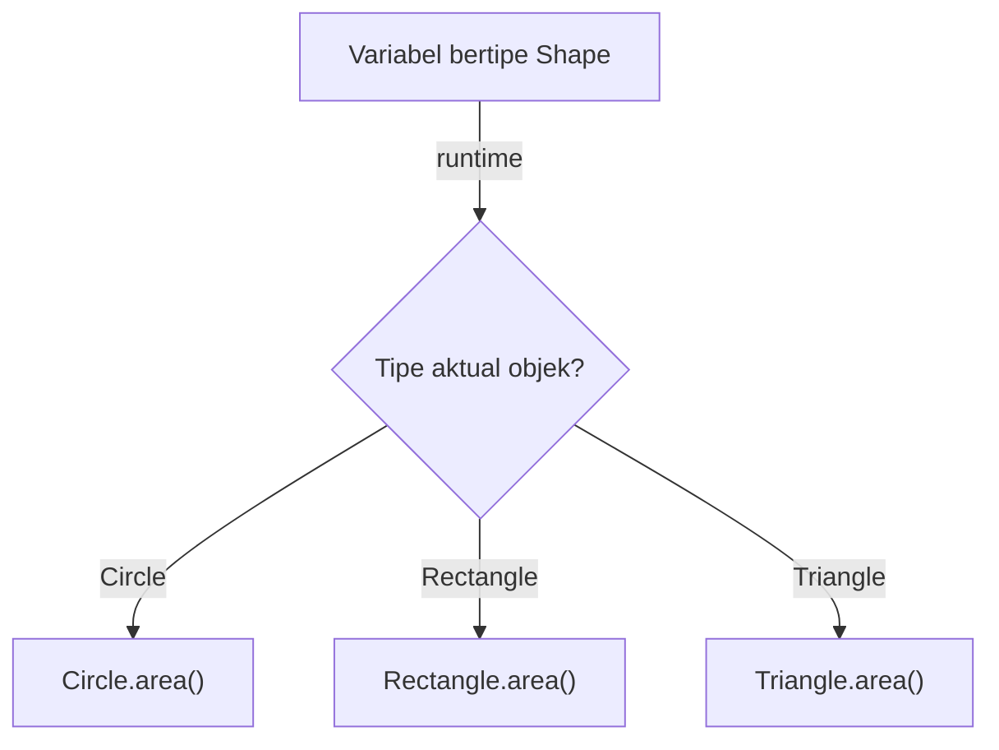
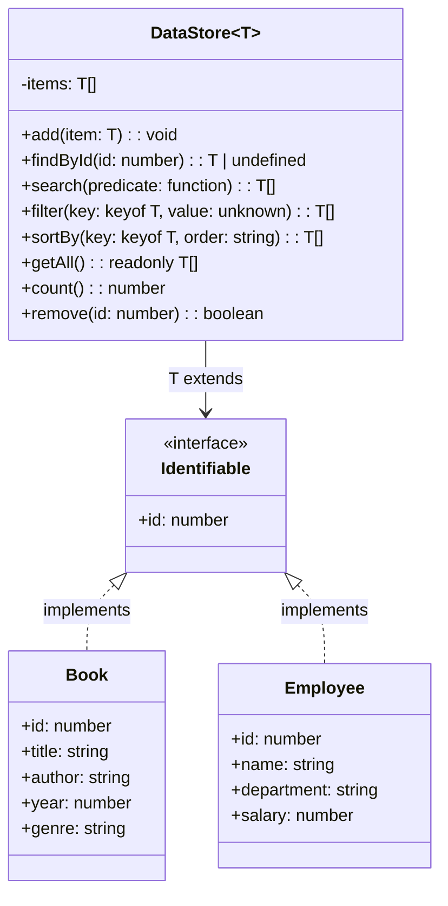

> **Mata Kuliah:** Pemrograman Berorientasi Objek
> **Minggu:** 5
> **Bagian:** Fundamentals
> **Bahasa:** TypeScript 5.x

---

## Capaian Pembelajaran Modul

Setelah mempelajari modul ini, mahasiswa mampu:
1. Menjelaskan perbedaan runtime polymorphism dan compile-time polymorphism
2. Mengimplementasikan method overriding dan method overloading di TypeScript
3. Menggunakan type narrowing dan type guards (`instanceof`, `typeof`, discriminated unions)
4. Mendefinisikan dan menggunakan generic class, generic function, serta generic constraints
5. Menerapkan generics pada struktur data koleksi (`Array<T>`, `Map<K,V>`, `Set<T>`)
6. Membandingkan mekanisme polymorphism dan generics di TypeScript, Java, dan Dart

---

## Prasyarat

- **Modul 01:** Paradigma OOP & Setup Environment TypeScript
- **Modul 02:** Class, Object & Encapsulation
- **Modul 03:** Inheritance & Method Overriding
- **Modul 04:** Abstraction, Abstract Class & Interface

---

## Daftar Isi

- [1. Pendahuluan](#1-pendahuluan)
- [2. Landasan Konsep](#2-landasan-konsep)
- [3. Implementasi dalam TypeScript](#3-implementasi-dalam-typescript)
- [4. Perbandingan Lintas Bahasa](#4-perbandingan-lintas-bahasa)
- [5. Studi Kasus: Generic DataStore](#5-studi-kasus-generic-datastore)
- [6. Kesalahan Umum & Best Practices](#6-kesalahan-umum--best-practices)
- [7. Ringkasan](#7-ringkasan)
- [8. Latihan Mandiri](#8-latihan-mandiri)

---

## 1. Pendahuluan

Di modul-modul sebelumnya, kalian telah berkenalan dengan polymorphism melalui method overriding pada inheritance dan implementasi interface. Namun polymorphism sesungguhnya jauh lebih luas dari sekadar overriding. Modul ini akan membawa kalian menyelami polymorphism secara mendalam --- mulai dari runtime polymorphism yang sudah familiar, hingga compile-time polymorphism melalui method overloading dan **Generics**.

Generics adalah salah satu fitur terpenting dalam bahasa bertipe statis modern. Dengan generics, kita bisa menulis class dan function yang **bekerja dengan berbagai tipe data** tanpa mengorbankan type safety. Bayangkan sebuah wadah penyimpanan yang bisa menyimpan buku, DVD, atau pakaian --- wadahnya sama, isinya bisa berbeda, tapi kita tetap tahu persis apa yang ada di dalamnya.

> 💡 **Insight:** Generics adalah jembatan antara fleksibilitas dan keamanan tipe. Tanpa generics, kita harus memilih antara kode yang fleksibel (menggunakan `any`) tapi rawan error, atau kode yang aman tapi penuh duplikasi untuk setiap tipe data.

---

## 2. Landasan Konsep

### 2.1 Runtime Polymorphism (Method Overriding) --- Review & Deep Dive

*Runtime polymorphism* terjadi ketika keputusan method mana yang dipanggil ditentukan **saat program berjalan** (runtime), bukan saat kompilasi. Mekanisme utamanya adalah **method overriding** --- subclass menyediakan implementasi berbeda untuk method yang sudah ada di superclass.

Konsep kunci runtime polymorphism:

- **Dynamic dispatch** --- saat memanggil method pada variabel bertipe parent, sistem akan mencari implementasi di class aktual (child) dari objek tersebut
- **Substitutability** --- objek subclass bisa digunakan di mana pun objek superclass diharapkan (Liskov Substitution Principle)
- **Late binding** --- pengikatan method ke implementasi terjadi saat runtime, bukan compile-time

> 🔑 **Konsep Kunci:** Kekuatan runtime polymorphism terletak pada kemampuannya memungkinkan kode yang **terbuka untuk ekstensi tapi tertutup untuk modifikasi** (Open/Closed Principle). Kita bisa menambah subclass baru tanpa mengubah kode yang sudah menggunakan tipe parent.



### 2.2 Compile-time Polymorphism: Method Overloading di TypeScript

*Compile-time polymorphism* terjadi ketika keputusan perilaku ditentukan **saat kompilasi**. Mekanisme utamanya adalah **method overloading** --- satu nama method/function dengan beberapa *signature* yang berbeda.

Di TypeScript, method overloading bekerja berbeda dari Java atau C++. TypeScript menggunakan **overload signatures** --- kita mendeklarasikan beberapa signature, lalu menyediakan **satu implementasi** yang menangani semua kasus.

Mengapa TypeScript berbeda? Karena TypeScript dikompilasi ke JavaScript, dan JavaScript tidak mendukung overloading secara native. Overload signatures di TypeScript hanya ada di level type checker --- saat runtime, hanya satu function body yang ada.

> 🔄 **Perbandingan:** Di Java, `add(int a, int b)` dan `add(double a, double b)` adalah dua method terpisah di bytecode. Di TypeScript, overload signatures hanya membantu type checker --- implementasi tetap satu.

### 2.3 Type Narrowing dan Type Guards

*Type narrowing* adalah proses mempersempit tipe variabel dari tipe umum menjadi tipe yang lebih spesifik. TypeScript cukup cerdas untuk memahami konteks dan mempersempit tipe secara otomatis.

Mekanisme type narrowing:

1. **`typeof` guard** --- untuk tipe primitif (`string`, `number`, `boolean`)
2. **`instanceof` guard** --- untuk mengecek apakah objek merupakan instance dari class tertentu
3. **Discriminated unions** --- menggunakan property literal sebagai "tag" untuk membedakan tipe dalam union
4. **Custom type guards** --- function yang mengembalikan `x is Type` sebagai predicate

> 🔑 **Konsep Kunci:** Type narrowing adalah bentuk polymorphism yang unik di TypeScript. Dengan discriminated unions, kita bisa mencapai polimorfisme tanpa class hierarchy --- cukup menggunakan union type dan property pembeda.

### 2.4 Generics: Konsep, Syntax `<T>`, Generic Class & Function

**Generics** memungkinkan kita mendefinisikan class, function, atau interface yang bekerja dengan **tipe sebagai parameter**. Alih-alih menentukan tipe data konkret, kita menggunakan *type parameter* (biasanya `T`, `U`, `K`, `V`) yang akan ditentukan saat penggunaan.

Terminologi penting:
- **Type parameter** --- placeholder untuk tipe, ditulis dalam angle brackets: `<T>`
- **Type argument** --- tipe konkret yang diberikan saat penggunaan: `Array<number>`
- **Generic constraint** --- pembatasan pada type parameter: `<T extends HasId>`

Mengapa generics penting:
- **Reusability** --- satu implementasi untuk banyak tipe data
- **Type safety** --- compiler tetap bisa memvalidasi tipe, tidak seperti `any`
- **Documentation** --- kode menjadi self-documenting tentang relasi antar tipe

Konvensi penamaan type parameter:
- `T` --- Type (tipe umum)
- `K` --- Key (kunci)
- `V` --- Value (nilai)
- `E` --- Element (elemen)
- `R` --- Return (nilai kembalian)

### 2.5 Generic Constraints (`extends`)

Terkadang kita ingin generic bekerja dengan tipe apa pun, namun tetap memastikan tipe tersebut memiliki **property atau method tertentu**. Di sinilah generic constraints berperan.

Dengan keyword `extends` pada type parameter, kita bisa membatasi tipe yang diterima. Constraint bisa berupa:
- **Interface** --- `<T extends HasId>` artinya `T` harus punya semua property di `HasId`
- **Type literal** --- `<T extends { name: string }>` artinya `T` harus punya property `name`
- **Union** --- `<T extends string | number>` artinya `T` hanya boleh `string` atau `number`
- **keyof** --- `<K extends keyof T>` artinya `K` harus salah satu key dari tipe `T`

> ⚠️ **Perhatian:** `extends` dalam konteks generics berbeda artinya dari `extends` dalam inheritance. Pada generics, `extends` berarti "harus memenuhi/kompatibel dengan", bukan "mewarisi dari".

---

## 3. Implementasi dalam TypeScript

### 3.1 Polymorphism: Array of Shape dengan Berbagai Subclass

Contoh klasik runtime polymorphism --- memanggil `area()` secara polimorfis pada array berisi berbagai bentuk geometri:

```typescript
abstract class Shape {
  abstract area(): number;
  abstract describe(): string;

  toString(): string {
    return `${this.describe()} memiliki luas ${this.area().toFixed(2)}`;
  }
}

class Circle extends Shape {
  constructor(private readonly radius: number) {
    super();
  }

  override area(): number {
    return Math.PI * this.radius ** 2;
  }

  override describe(): string {
    return `Lingkaran (r=${this.radius})`;
  }
}

class Rectangle extends Shape {
  constructor(
    private readonly width: number,
    private readonly height: number
  ) {
    super();
  }

  override area(): number {
    return this.width * this.height;
  }

  override describe(): string {
    return `Persegi Panjang (${this.width}x${this.height})`;
  }
}

class Triangle extends Shape {
  constructor(
    private readonly base: number,
    private readonly height: number
  ) {
    super();
  }

  override area(): number {
    return 0.5 * this.base * this.height;
  }

  override describe(): string {
    return `Segitiga (alas=${this.base}, tinggi=${this.height})`;
  }
}

// Polymorphism in action: semua elemen bertipe Shape,
// tapi masing-masing memanggil area() sesuai class aktualnya
const shapes: Shape[] = [
  new Circle(7),
  new Rectangle(5, 10),
  new Triangle(8, 6),
  new Circle(3),
];

let totalArea = 0;
for (const shape of shapes) {
  console.log(shape.toString()); // dynamic dispatch terjadi di sini
  totalArea += shape.area();
}
console.log(`Total luas: ${totalArea.toFixed(2)}`);
// Output:
// Lingkaran (r=7) memiliki luas 153.94
// Persegi Panjang (5x10) memiliki luas 50.00
// Segitiga (alas=8, tinggi=6) memiliki luas 24.00
// Lingkaran (r=3) memiliki luas 28.27
// Total luas: 256.21
```

### 3.2 Method Overloading di TypeScript

TypeScript menggunakan overload signatures diikuti satu implementation signature:

```typescript
class Calculator {
  // Overload signatures --- yang "terlihat" oleh pemanggil
  add(a: number, b: number): number;
  add(a: string, b: string): string;
  add(a: number[], b: number[]): number[];

  // Implementation signature --- harus kompatibel dengan semua overload
  add(a: number | string | number[], b: number | string | number[]): number | string | number[] {
    if (typeof a === "number" && typeof b === "number") {
      return a + b;
    }
    if (typeof a === "string" && typeof b === "string") {
      return a + b;
    }
    if (Array.isArray(a) && Array.isArray(b)) {
      return [...a, ...b];
    }
    throw new Error("Parameter types tidak cocok");
  }
}

const calc = new Calculator();
const numResult: number = calc.add(10, 20);       // 30
const strResult: string = calc.add("Halo", " Dunia"); // "Halo Dunia"
const arrResult: number[] = calc.add([1, 2], [3, 4]); // [1, 2, 3, 4]

console.log(numResult);  // Output: 30
console.log(strResult);  // Output: Halo Dunia
console.log(arrResult);  // Output: [1, 2, 3, 4]

// calc.add(10, "hello"); // Compile error! Tidak ada overload yang cocok
```

> ⚠️ **Perhatian:** Implementation signature **tidak bisa dipanggil langsung** oleh kode luar. Pemanggil hanya bisa menggunakan overload signatures yang dideklarasikan di atas implementation.

### 3.3 Type Guards dan Narrowing

```typescript
// --- typeof guard untuk tipe primitif ---
function formatValue(value: string | number | boolean): string {
  if (typeof value === "string") {
    return value.toUpperCase(); // TS tahu 'value' adalah string di sini
  }
  if (typeof value === "number") {
    return value.toFixed(2); // TS tahu 'value' adalah number di sini
  }
  return value ? "Ya" : "Tidak"; // TS tahu 'value' adalah boolean di sini
}

// --- instanceof guard untuk class ---
function printShapeInfo(shape: Shape): void {
  if (shape instanceof Circle) {
    console.log("Ini lingkaran"); // TS tahu 'shape' adalah Circle
  } else if (shape instanceof Rectangle) {
    console.log("Ini persegi panjang"); // TS tahu 'shape' adalah Rectangle
  }
  console.log(`Luas: ${shape.area()}`);
}

// --- Discriminated unions ---
interface SuccessResult {
  status: "success";
  data: string;
}

interface ErrorResult {
  status: "error";
  message: string;
  code: number;
}

type ApiResult = SuccessResult | ErrorResult;

function handleResult(result: ApiResult): void {
  switch (result.status) {
    case "success":
      console.log(`Data diterima: ${result.data}`); // TS tahu result.data ada
      break;
    case "error":
      console.log(`Error ${result.code}: ${result.message}`); // TS tahu result.code ada
      break;
  }
}

// --- Custom type guard ---
interface Fish {
  swim(): void;
}

interface Bird {
  fly(): void;
}

function isFish(animal: Fish | Bird): animal is Fish {
  return (animal as Fish).swim !== undefined;
}

function move(animal: Fish | Bird): void {
  if (isFish(animal)) {
    animal.swim(); // TS tahu 'animal' adalah Fish
  } else {
    animal.fly(); // TS tahu 'animal' adalah Bird
  }
}
```

> 💡 **Insight:** Discriminated unions adalah pola yang sangat kuat di TypeScript. Berbeda dengan class hierarchy yang membutuhkan inheritance, discriminated unions memungkinkan polymorphism berbasis data --- setiap varian cukup memiliki property `status` (atau tag lain) untuk dibedakan.

### 3.4 Generic Class: `Repository<T>`

```typescript
interface HasId {
  id: number;
}

class Repository<T extends HasId> {
  private items: T[] = [];

  add(item: T): void {
    // Cegah duplikasi ID
    if (this.items.some((existing) => existing.id === item.id)) {
      throw new Error(`Item dengan id ${item.id} sudah ada`);
    }
    this.items.push(item);
  }

  findById(id: number): T | undefined {
    return this.items.find((item) => item.id === id);
  }

  getAll(): readonly T[] {
    return [...this.items]; // kembalikan salinan agar data internal aman
  }

  remove(id: number): boolean {
    const index = this.items.findIndex((item) => item.id === id);
    if (index === -1) return false;
    this.items.splice(index, 1);
    return true;
  }

  count(): number {
    return this.items.length;
  }
}

// --- Penggunaan dengan tipe konkret ---
interface User extends HasId {
  id: number;
  name: string;
  email: string;
}

interface Product extends HasId {
  id: number;
  title: string;
  price: number;
}

const userRepo = new Repository<User>();
userRepo.add({ id: 1, name: "Budi", email: "budi@email.com" });
userRepo.add({ id: 2, name: "Ani", email: "ani@email.com" });

const foundUser = userRepo.findById(1);
if (foundUser) {
  console.log(foundUser.name); // Output: Budi --- type-safe!
}

const productRepo = new Repository<Product>();
productRepo.add({ id: 1, title: "Laptop", price: 15000000 });

const foundProduct = productRepo.findById(1);
if (foundProduct) {
  console.log(foundProduct.title); // Output: Laptop --- type-safe!
}

// productRepo.add({ id: 2, name: "Invalid" }); // Compile error! 'title' dan 'price' wajib ada
```

> 🔑 **Konsep Kunci:** `Repository<T extends HasId>` artinya: "Repository bekerja dengan tipe `T` apapun, asalkan `T` memiliki property `id: number`." Constraint `extends HasId` memastikan kita bisa memanggil `.id` pada setiap item tanpa error.

### 3.5 Generic Function: `sortBy<T>`

```typescript
function sortBy<T>(items: T[], key: keyof T, order: "asc" | "desc" = "asc"): T[] {
  return [...items].sort((a, b) => {
    const valA = a[key];
    const valB = b[key];

    let comparison = 0;
    if (typeof valA === "string" && typeof valB === "string") {
      comparison = valA.localeCompare(valB);
    } else if (typeof valA === "number" && typeof valB === "number") {
      comparison = valA - valB;
    }

    return order === "desc" ? -comparison : comparison;
  });
}

// --- Penggunaan ---
interface Student {
  name: string;
  gpa: number;
  semester: number;
}

const students: Student[] = [
  { name: "Citra", gpa: 3.85, semester: 4 },
  { name: "Andi", gpa: 3.92, semester: 6 },
  { name: "Budi", gpa: 3.70, semester: 4 },
];

const byName = sortBy(students, "name");
console.log(byName.map((s) => s.name));
// Output: ["Andi", "Budi", "Citra"]

const byGpaDesc = sortBy(students, "gpa", "desc");
console.log(byGpaDesc.map((s) => `${s.name}: ${s.gpa}`));
// Output: ["Andi: 3.92", "Citra: 3.85", "Budi: 3.7"]

// sortBy(students, "alamat"); // Compile error! 'alamat' bukan key dari Student
```

> 💡 **Insight:** `keyof T` adalah operator TypeScript yang menghasilkan union dari semua nama property di tipe `T`. Untuk `Student`, `keyof Student` menghasilkan `"name" | "gpa" | "semester"`. Ini memastikan kita hanya bisa mengurutkan berdasarkan property yang benar-benar ada.

### 3.6 Menggunakan Generics di Collections Bawaan

TypeScript menyediakan tipe koleksi generik bawaan yang sangat berguna:

```typescript
// --- Array<T> ---
const numbers: Array<number> = [10, 20, 30];
const names: Array<string> = ["Andi", "Budi", "Citra"];
// Shorthand: number[] dan string[] --- sama persis

// --- Map<K, V> ---
const studentGrades = new Map<string, number>();
studentGrades.set("Andi", 85);
studentGrades.set("Budi", 92);
studentGrades.set("Citra", 78);

for (const [name, grade] of studentGrades) {
  console.log(`${name}: ${grade}`);
}
// Output:
// Andi: 85
// Budi: 92
// Citra: 78

const andiGrade: number | undefined = studentGrades.get("Andi");
// TypeScript tahu hasilnya bisa undefined (jika key tidak ada)

// --- Set<T> ---
const uniqueIds = new Set<number>();
uniqueIds.add(1);
uniqueIds.add(2);
uniqueIds.add(1); // diabaikan --- Set hanya menyimpan nilai unik

console.log(uniqueIds.size); // Output: 2
console.log(uniqueIds.has(1)); // Output: true

// --- Kombinasi: Map dengan Array sebagai value ---
const courseStudents = new Map<string, Array<string>>();
courseStudents.set("PBO", ["Andi", "Budi"]);
courseStudents.set("Basis Data", ["Citra", "Dian"]);

const pboStudents = courseStudents.get("PBO");
if (pboStudents) {
  pboStudents.push("Eka");
  console.log(pboStudents); // Output: ["Andi", "Budi", "Eka"]
}
```

---

## 4. Perbandingan Lintas Bahasa

### Method Overloading

| Aspek | TypeScript | Java | Dart |
|-------|-----------|------|------|
| Mekanisme | Overload signatures + 1 implementasi | Method terpisah di bytecode | Tidak didukung (gunakan optional/named params) |
| Runtime behavior | Satu function body | Method dipilih saat compile | Satu method body |
| Return type berbeda | Bisa (via overload signatures) | Bisa (jika parameter berbeda) | N/A |

```typescript
// TypeScript: overload signatures + satu implementasi
function greet(name: string): string;
function greet(name: string, age: number): string;
function greet(name: string, age?: number): string {
  return age !== undefined
    ? `Halo ${name}, umur ${age}`
    : `Halo ${name}`;
}
```

```java
// Java: benar-benar method terpisah
public class Greeter {
    public String greet(String name) {
        return "Halo " + name;
    }
    public String greet(String name, int age) {
        return "Halo " + name + ", umur " + age;
    }
}
```

```dart
// Dart: tidak ada overloading, gunakan optional parameter
String greet(String name, [int? age]) {
  return age != null
      ? 'Halo $name, umur $age'
      : 'Halo $name';
}
```

### Generics

| Aspek | TypeScript | Java | Dart |
|-------|-----------|------|------|
| Syntax | `<T>` | `<T>` | `<T>` |
| Constraint | `<T extends X>` | `<T extends X>` | `<T extends X>` |
| Type erasure | Ya (compile ke JS tanpa tipe) | Ya (tipe dihapus saat runtime) | Tidak (tipe tersedia saat runtime) |
| `keyof` operator | Ada | Tidak ada | Tidak ada |
| Mapped types | Ada | Tidak ada | Tidak ada |
| Wildcard | Tidak ada (gunakan conditional types) | `<? extends T>`, `<? super T>` | Tidak ada |

```typescript
// TypeScript --- keyof dan mapped types (superpower TS!)
function pick<T, K extends keyof T>(obj: T, keys: K[]): Pick<T, K> {
  const result = {} as Pick<T, K>;
  for (const key of keys) {
    result[key] = obj[key];
  }
  return result;
}

const user = { id: 1, name: "Budi", email: "budi@email.com", age: 21 };
const nameOnly = pick(user, ["name", "email"]);
// Tipe nameOnly: { name: string; email: string } --- otomatis!
console.log(nameOnly); // Output: { name: "Budi", email: "budi@email.com" }
```

> 🔄 **Perbandingan:** Generics di TypeScript, Java, dan Dart memiliki syntax yang hampir identik (`<T>`, `extends` untuk constraint). Jika kalian sudah paham generics di TypeScript, transisi ke Java atau Dart akan sangat mulus. Fitur ekstra TypeScript seperti `keyof` dan mapped types adalah bonus yang tidak ada di bahasa lain.

---

## 5. Studi Kasus: Generic DataStore

### 5.1 Deskripsi Masalah

Kita diminta membangun sebuah **DataStore generik** yang mampu:
- Menyimpan item bertipe apapun (selama punya `id`)
- Mencari item berdasarkan ID atau kriteria tertentu
- Memfilter item berdasarkan kondisi
- Mengurutkan item berdasarkan property apapun

### 5.2 Desain



### 5.3 Implementasi Lengkap

```typescript
// --- Interface dasar ---
interface Identifiable {
  id: number;
}

// --- Generic DataStore ---
class DataStore<T extends Identifiable> {
  private items: T[] = [];

  add(item: T): void {
    if (this.items.some((existing) => existing.id === item.id)) {
      throw new Error(`Item dengan id ${item.id} sudah ada di DataStore`);
    }
    this.items.push(item);
  }

  findById(id: number): T | undefined {
    return this.items.find((item) => item.id === id);
  }

  search(predicate: (item: T) => boolean): T[] {
    return this.items.filter(predicate);
  }

  filter(key: keyof T, value: T[keyof T]): T[] {
    return this.items.filter((item) => item[key] === value);
  }

  sortBy(key: keyof T, order: "asc" | "desc" = "asc"): T[] {
    return [...this.items].sort((a, b) => {
      const valA = a[key];
      const valB = b[key];

      let comparison = 0;
      if (typeof valA === "string" && typeof valB === "string") {
        comparison = valA.localeCompare(valB);
      } else if (typeof valA === "number" && typeof valB === "number") {
        comparison = valA - valB;
      }

      return order === "desc" ? -comparison : comparison;
    });
  }

  getAll(): readonly T[] {
    return [...this.items];
  }

  count(): number {
    return this.items.length;
  }

  remove(id: number): boolean {
    const index = this.items.findIndex((item) => item.id === id);
    if (index === -1) return false;
    this.items.splice(index, 1);
    return true;
  }
}

// --- Tipe data konkret ---
interface Book extends Identifiable {
  id: number;
  title: string;
  author: string;
  year: number;
  genre: string;
}

interface Employee extends Identifiable {
  id: number;
  name: string;
  department: string;
  salary: number;
}

// --- Penggunaan: DataStore untuk Book ---
const bookStore = new DataStore<Book>();
bookStore.add({ id: 1, title: "Clean Code", author: "Robert C. Martin", year: 2008, genre: "Programming" });
bookStore.add({ id: 2, title: "Refactoring", author: "Martin Fowler", year: 2018, genre: "Programming" });
bookStore.add({ id: 3, title: "Dune", author: "Frank Herbert", year: 1965, genre: "Sci-Fi" });
bookStore.add({ id: 4, title: "Design Patterns", author: "Gang of Four", year: 1994, genre: "Programming" });

// Cari berdasarkan ID
const book = bookStore.findById(2);
console.log(book?.title); // Output: Refactoring

// Search dengan predicate
const recentBooks = bookStore.search((b) => b.year >= 2000);
console.log(recentBooks.map((b) => b.title));
// Output: ["Clean Code", "Refactoring"]

// Filter berdasarkan property
const programmingBooks = bookStore.filter("genre", "Programming");
console.log(programmingBooks.map((b) => b.title));
// Output: ["Clean Code", "Refactoring", "Design Patterns"]

// Sort berdasarkan tahun (ascending)
const byYear = bookStore.sortBy("year");
console.log(byYear.map((b) => `${b.title} (${b.year})`));
// Output: ["Dune (1965)", "Design Patterns (1994)", "Clean Code (2008)", "Refactoring (2018)"]

// --- Penggunaan: DataStore untuk Employee ---
const employeeStore = new DataStore<Employee>();
employeeStore.add({ id: 1, name: "Andi", department: "Engineering", salary: 12000000 });
employeeStore.add({ id: 2, name: "Budi", department: "Marketing", salary: 10000000 });
employeeStore.add({ id: 3, name: "Citra", department: "Engineering", salary: 15000000 });

// Filter engineering team
const engineers = employeeStore.filter("department", "Engineering");
console.log(engineers.map((e) => e.name));
// Output: ["Andi", "Citra"]

// Sort berdasarkan gaji (descending)
const bySalary = employeeStore.sortBy("salary", "desc");
console.log(bySalary.map((e) => `${e.name}: Rp${e.salary.toLocaleString()}`));
// Output: ["Citra: Rp15,000,000", "Andi: Rp12,000,000", "Budi: Rp10,000,000"]
```

### 5.4 Analisis

| Aspek | Tanpa Generics | Dengan Generics (`DataStore<T>`) |
|-------|---------------|----------------------------------|
| Jumlah class | Satu class per tipe data (`BookStore`, `EmployeeStore`, ...) | Satu class `DataStore<T>` untuk semua tipe |
| Type safety | Penuh (tapi banyak duplikasi) | Penuh --- compiler tahu tipe `T` saat penggunaan |
| Kode duplikat | Banyak --- setiap store punya logika yang sama | Nol --- logika ditulis sekali |
| Maintenance | Sulit --- perbaikan harus dilakukan di banyak class | Mudah --- perbaikan cukup di satu class |
| Extensibility | Perlu buat class baru untuk tipe data baru | Cukup definisikan interface baru yang `extends Identifiable` |

> 💡 **Insight:** Studi kasus ini menunjukkan kekuatan utama generics: **write once, use everywhere with full type safety**. Kita menulis logika store satu kali, namun mendapat store yang sepenuhnya type-safe untuk `Book`, `Employee`, atau tipe data apapun di masa depan.

---

## 6. Kesalahan Umum & Best Practices

### Kesalahan 1: Menggunakan `any` Alih-alih Generics

```typescript
// ❌ Kehilangan type safety --- compiler tidak bisa membantu
class BadStore {
  private items: any[] = [];

  add(item: any): void {
    this.items.push(item);
  }

  findById(id: number): any {
    return this.items.find((item) => item.id === id);
  }
}

const store = new BadStore();
store.add({ id: 1, name: "Budi" });
const result = store.findById(1);
console.log(result.alamat.kota); // Tidak ada error saat compile, CRASH saat runtime!
```

```typescript
// ✅ Gunakan generics --- compiler menjadi pelindung kita
class GoodStore<T extends HasId> {
  private items: T[] = [];

  add(item: T): void {
    this.items.push(item);
  }

  findById(id: number): T | undefined {
    return this.items.find((item) => item.id === id);
  }
}

interface UserData extends HasId {
  id: number;
  name: string;
}

const store = new GoodStore<UserData>();
store.add({ id: 1, name: "Budi" });
const result = store.findById(1);
// result?.alamat; // Compile error! Property 'alamat' does not exist on type 'UserData'
```

### Kesalahan 2: Lupa Menangani `undefined` pada Hasil Pencarian

```typescript
// ❌ Mengasumsikan findById selalu mengembalikan hasil
const user = userRepo.findById(999);
console.log(user.name); // Compile error dengan strictNullChecks: Object is possibly 'undefined'
```

```typescript
// ✅ Selalu cek apakah hasilnya undefined
const user = userRepo.findById(999);
if (user) {
  console.log(user.name); // Aman --- TS tahu user bukan undefined
} else {
  console.log("User tidak ditemukan");
}

// Atau gunakan optional chaining
console.log(user?.name ?? "User tidak ditemukan");
```

### Kesalahan 3: Generic Tanpa Constraint yang Cukup

```typescript
// ❌ Terlalu longgar --- tidak bisa akses property apapun
function getId<T>(item: T): number {
  return item.id; // Compile error! Property 'id' does not exist on type 'T'
}
```

```typescript
// ✅ Tambahkan constraint sesuai kebutuhan
function getId<T extends { id: number }>(item: T): number {
  return item.id; // Aman --- TS tahu T pasti punya 'id'
}
```

### Kesalahan 4: Overload Signatures Tidak Konsisten

```typescript
// ❌ Implementation signature tidak di-cover oleh overload
function process(input: string): string;
function process(input: number): number;
function process(input: string | number): string | number {
  return input; // Implementasi ini valid, tapi kurang aman
}

// Pemanggil tidak bisa memanggil dengan boolean meskipun implementation bisa menerimanya
```

```typescript
// ✅ Pastikan implementation menangani setiap overload dengan benar
function process(input: string): string;
function process(input: number): number;
function process(input: string | number): string | number {
  if (typeof input === "string") {
    return input.trim(); // Tangani string secara spesifik
  }
  return Math.abs(input); // Tangani number secara spesifik
}
```

### Best Practices Ringkas

1. **Gunakan generics** alih-alih `any` untuk kode yang bekerja dengan berbagai tipe
2. **Berikan constraint** (`extends`) pada type parameter agar compiler bisa memvalidasi akses property
3. **Selalu tangani `undefined`** pada operasi pencarian --- gunakan optional chaining (`?.`) dan nullish coalescing (`??`)
4. **Gunakan `readonly`** pada return type array agar data internal class tidak bisa diubah dari luar
5. **Gunakan `keyof`** untuk memastikan nama property selalu valid saat compile-time
6. **Gunakan discriminated unions** sebagai alternatif class hierarchy untuk data sederhana

---

## 7. Ringkasan

- **Runtime polymorphism** (method overriding) memungkinkan subclass memberikan implementasi berbeda untuk method parent; keputusan method dipilih saat runtime melalui dynamic dispatch
- **Compile-time polymorphism** di TypeScript menggunakan overload signatures --- beberapa deklarasi method diikuti satu implementasi
- **Type narrowing** (`typeof`, `instanceof`, discriminated unions) memungkinkan TypeScript mempersempit tipe variabel secara otomatis berdasarkan konteks
- **Generics** (`<T>`) memungkinkan class dan function bekerja dengan tipe sebagai parameter --- menghindari duplikasi kode tanpa mengorbankan type safety
- **Generic constraints** (`<T extends X>`) membatasi tipe yang diterima generic, memastikan type parameter memiliki property atau method yang dibutuhkan
- **`keyof T`** dan mapped types adalah fitur unggulan TypeScript yang tidak dimiliki Java atau Dart --- memungkinkan kode yang sangat fleksibel namun tetap type-safe
- Konsep generics di TypeScript **sangat transferable** ke Java dan Dart berkat syntax yang hampir identik

---

## 8. Latihan Mandiri

### Latihan 1: Generic Stack

Implementasikan class `Stack<T>` yang mendukung operasi:
- `push(item: T): void` --- menambahkan item ke atas stack
- `pop(): T | undefined` --- mengambil dan menghapus item teratas
- `peek(): T | undefined` --- melihat item teratas tanpa menghapus
- `isEmpty(): boolean` --- mengecek apakah stack kosong
- `size(): number` --- mengembalikan jumlah item

Uji coba dengan `Stack<number>` dan `Stack<string>`. Pastikan semua operasi type-safe.

### Latihan 2: Polymorphism pada Payment System

Buat abstract class `Payment` dengan method abstract `process(): boolean` dan `describe(): string`. Buat minimal 3 subclass:
- `CreditCardPayment` (dengan nomor kartu dan CVV)
- `BankTransferPayment` (dengan nomor rekening dan bank tujuan)
- `EWalletPayment` (dengan provider dan nomor telepon)

Buat function `processPayments(payments: Payment[]): void` yang memanggil `process()` dan `describe()` secara polimorfis. Gunakan `instanceof` type guard untuk menampilkan informasi spesifik masing-masing tipe pembayaran.

### Latihan 3: Generic Filter Engine

Buat generic function `filterEngine<T>` yang menerima:
- `items: T[]` --- array item
- `filters: Partial<T>` --- object berisi key-value untuk filter (tidak semua key wajib diisi)

Function mengembalikan item yang cocok dengan **semua** filter yang diberikan. Contoh penggunaan:

```typescript
interface Movie {
  title: string;
  genre: string;
  year: number;
  rating: number;
}

const movies: Movie[] = [
  { title: "Inception", genre: "Sci-Fi", year: 2010, rating: 8.8 },
  { title: "Interstellar", genre: "Sci-Fi", year: 2014, rating: 8.6 },
  { title: "The Dark Knight", genre: "Action", year: 2008, rating: 9.0 },
];

const sciFiMovies = filterEngine(movies, { genre: "Sci-Fi" });
// Hasil: [Inception, Interstellar]

const highRatedSciFi = filterEngine(movies, { genre: "Sci-Fi", rating: 8.8 });
// Hasil: [Inception]
```

---

## Referensi & Bacaan Lanjutan

- TypeScript Handbook --- Generics: https://www.typescriptlang.org/docs/handbook/2/generics.html
- TypeScript Handbook --- Narrowing: https://www.typescriptlang.org/docs/handbook/2/narrowing.html
- TypeScript Handbook --- Overloads: https://www.typescriptlang.org/docs/handbook/2/functions.html#function-overloads
- TypeScript Playground (coba kode di browser): https://www.typescriptlang.org/play
- "Effective TypeScript" --- Dan Vanderkam (Item 26: Understand How Context Is Used in Type Inference)
- "Design Patterns: Elements of Reusable Object-Oriented Software" --- Gang of Four (Strategy Pattern sebagai contoh polymorphism)
