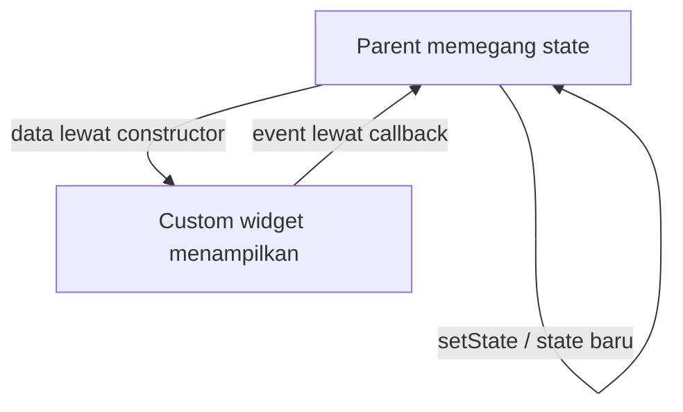

## Tujuan Pembelajaran

Bab 5 menutup dengan janji yang mengikat: `TaskCard` adalah komponen kanonik, dan bab-bab berikutnya hanya mengubahnya sebagai delta, mengekstrak bagian, bukan mengetik ulang keseluruhan class. Bab ini menepati janji itu. Anda akan memecah `TaskCard` menjadi komposisi widget yang lebih kecil, membangun layar form penuh yang menggantikan dialog satu kolom dari bab 3, dan menambahkan dua animasi: satu implisit, satu eksplisit.

Pekerjaan ini memakai keahlian yang berbeda dari bab sebelumnya. Bab 5 soal sistem warna dan ruang; bab 6 soal **merancang batas antar komponen**, data masuk lewat apa, event keluar lewat apa, siapa yang memegang state, dan siapa yang membersihkan resource. Setelah menyelesaikan bab ini, Anda bisa:

1. Merancang API custom widget: parameter wajib versus opsional, callback, dan const constructor.
2. Me-refactor `TaskCard` menjadi komposisi tanpa mengubah kontraknya.
3. Membangun form dengan validasi, state error, siklus hidup controller dan focus node.
4. Menerapkan animasi implisit dan eksplisit, masing-masing di tempat yang tepat.

Estimasi: baca sekitar 50 menit, praktik sekitar 100 menit, terbagi dalam tiga checkpoint.

## API Custom Widget: Kontrak Kecil yang Bisa Dipegang

Setiap custom widget yang Anda tulis adalah API kecil bagi pemakainya, biasanya diri sendiri tiga bulan kemudian. Tiga keputusan membentuk kualitas API itu:

**Wajib atau opsional.** Parameter wajib (`required`) untuk data yang membuat widget tidak bermakna tanpanya: `TaskCard` tanpa `task` bukan apa-apa. Parameter opsional dengan nilai bawaan untuk variasi yang punya default yang masuk akal. Callback umumnya opsional, widget tetap bisa menampilkan apa pun tanpa handler, seperti kartu di layar preview.

**Satu tanggung jawab.** Widget yang mencoba menampilkan data, mengelola input, memanggil repository, sekaligus menganimasikan dirinya akan sulit diuji dan mustahil dipakai ulang. Aturan praktisnya: kalau deskripsi widget perlu kata "dan", pertimbangkan memecahnya.

**`const` constructor.** Constructor diberi `const` dan parameter yang diberi `const` di titik pemakaian membuat instance widget di-cache oleh framework, tidak dibangun ulang saat parent rebuild tanpa alasan. Widget yang menerima callback runtime tetap bisa punya constructor `const`; yang tidak bisa `const` adalah _instance_-nya.

Widget baru pertama bab ini, `PrioritySelector`, mempraktikkan ketiganya:

```dart
import 'package:flutter/material.dart';

import '../models/task.dart';

/// Pemilih prioritas untuk form (bab 6): deretan ChoiceChip dalam Wrap.
///
/// Custom widget kecil dengan API minimal: satu data masuk ([selected]),
/// satu event keluar ([onSelected]). Callback opsional: widget tetap
/// bisa menampilkan pilihan tanpa handler (mis. mode baca).
class PrioritySelector extends StatelessWidget {
  const PrioritySelector({
    super.key,
    required this.selected,
    this.onSelected,
  });

  final Priority selected;
  final ValueChanged<Priority>? onSelected;

  @override
  Widget build(BuildContext context) {
    return Wrap(
      spacing: 8,
      runSpacing: 4,
      children: [
        for (final priority in Priority.values)
          ChoiceChip(
            label: Text(priority.label),
            selected: selected == priority,
            onSelected: onSelected == null
                ? null
                : (_) => onSelected!(priority),
          ),
      ],
    );
  }
}
```

Perhatikan tiga keputusan yang tersembunyi di balik kesederhanaannya:

- **`ChoiceChip`, bukan `Container` + `GestureDetector` yang digayakan.** ChoiceChip membawa state terpilih bawaan, target sentuh memadai, dan semantik untuk pembaca layar, pelajaran bab 5 yang kini berlaku juga saat menulis widget sendiri.
- **`Wrap`, bukan `Row`.** Saat text scale besar, chip keempat turun ke baris berikutnya alih-alih meluber keluar layar.
- **Callback diuji null sekali, di titik pemakaian.** `onSelected == null ? null : (_) => onSelected!(priority)` membuat `ChoiceChip` otomatis nonaktif ketika handler tidak diberikan, tidak ada panggilan `!` yang tersebar.

Aliran data yang dipegang widget seperti ini selalu satu pola:



Data turun lewat constructor, event naik lewat callback, dan hanya parent yang memanggil `setState`. Widget stateless yang patuh pola ini bisa diuji terpisah dan dipakai di layar mana pun.

## Checkpoint 1: TaskCard Menjadi Komposisi

**Target:** `TaskCard` pecah menjadi tiga widget tanpa kontrak berubah.
**Waktu:** sekitar 30 menit.

`TaskCard` bab 5 masih satu file berisi dua class: kartu dan `_DueDateLabel` privat. Itu sehat untuk ukurannya, tetapi kartu akan bertambah isi (potongan catatan, kelak gambar), dan menumbuhkan semuanya di satu `build` membuat method itu membengkak. Refactor bab ini memisahkan tiga hal:

1. `DueDateLabel` dipromosikan dari `_DueDateLabel` privat menjadi widget publik di file sendiri, karena kini dipakai `TaskCardSummary`, bukan hanya `TaskCard`.
2. `TaskCardSummary` baru menampung isi kartu: judul, potongan catatan, baris chip.
3. `TaskCard` tinggal cangkang: `Card` + `InkWell` + baris checkbox dan isi.

File `lib/widgets/due_date_label.dart` berisi kode yang sama persis dengan `_DueDateLabel` bab 5, hanya berubah nama dan visibilitas:

```dart
import 'package:flutter/material.dart';

/// Label tenggat dengan ikon dekoratif (bab 6: dipromosikan dari
/// `_DueDateLabel` privat di task_card.dart menjadi widget publik).
///
/// Ikon kalender disembunyikan dari pembaca layar (ExcludeSemantics)
/// karena teks "Tenggat ..." sudah menyampaikan maknanya.
class DueDateLabel extends StatelessWidget {
  const DueDateLabel({super.key, required this.date, required this.overdue});

  final DateTime date;
  final bool overdue;

  @override
  Widget build(BuildContext context) {
    final theme = Theme.of(context);
    final color = overdue
        ? theme.colorScheme.error
        : theme.colorScheme.onSurfaceVariant;

    return Text.rich(
      TextSpan(
        children: [
          WidgetSpan(
            child: ExcludeSemantics(
              child: Icon(Icons.event, size: 16, color: color),
            ),
          ),
          const WidgetSpan(child: SizedBox(width: 4)),
          TextSpan(text: 'Tenggat ${date.day}/${date.month}/${date.year}'),
        ],
      ),
      style: theme.textTheme.labelMedium?.copyWith(color: color),
    );
  }
}
```

File `lib/widgets/task_card_summary.dart`, isi kartu, sekaligus satu fitur baru, yaitu potongan catatan:

```dart
import 'package:flutter/material.dart';

import '../models/task.dart';
import 'due_date_label.dart';
import 'priority_chip.dart';

/// Kolom isi kartu tugas (bab 6): judul, potongan catatan, dan baris
/// chip prioritas + tenggat. Diekstrak dari TaskCard supaya cangkang
/// kartu (Card + InkWell + baris checkbox) dan isi kartu bisa berevolusi
/// terpisah.
class TaskCardSummary extends StatelessWidget {
  const TaskCardSummary({super.key, required this.task});

  final Task task;

  @override
  Widget build(BuildContext context) {
    final theme = Theme.of(context);
    final scheme = theme.colorScheme;

    return Column(
      crossAxisAlignment: CrossAxisAlignment.start,
      children: [
        Text(
          task.title,
          maxLines: 2,
          overflow: TextOverflow.ellipsis,
          style: theme.textTheme.titleMedium?.copyWith(
            fontWeight: FontWeight.w600,
            color: task.done ? scheme.onSurfaceVariant : scheme.onSurface,
            decoration: task.done ? TextDecoration.lineThrough : null,
            decorationColor: scheme.onSurfaceVariant,
          ),
        ),
        if (task.note != null) ...[
          const SizedBox(height: 2),
          // Potongan catatan: satu baris, sisanya elipsis.
          Text(
            task.note!,
            maxLines: 1,
            overflow: TextOverflow.ellipsis,
            style: theme.textTheme.labelMedium?.copyWith(
              color: scheme.onSurfaceVariant,
            ),
          ),
        ],
        const SizedBox(height: 4),
        // Wrap, bukan Row: saat text scale besar, label turun ke
        // baris berikutnya alih-alih overflow.
        Wrap(
          spacing: 8,
          runSpacing: 4,
          crossAxisAlignment: WrapCrossAlignment.center,
          children: [
            PriorityChip(priority: task.priority),
            if (task.dueDate != null)
              DueDateLabel(date: task.dueDate!, overdue: task.isOverdue),
          ],
        ),
      ],
    );
  }
}
```

Dan `lib/widgets/task_card.dart` menyusut menjadi cangkang yang membaca seperti ringkasan struktur kartu:

```dart
import 'package:flutter/material.dart';

import '../models/task.dart';
import 'task_card_summary.dart';

/// Kartu tugas kanonik (bab 5, delta bab 6).
///
/// Kontrak yang dipertahankan lintas bab:
/// - menampilkan satu [Task]: judul, prioritas, tenggat, status selesai;
/// - [onToggle] dipanggil checkbox berubah, [onTap] saat kartu ditekan;
/// - stateless: tidak memegang state dan tidak tahu cara memperoleh data.
///
/// Delta bab 6: isi kartu diekstrak ke [TaskCardSummary] dan label
/// tenggat dipromosikan menjadi widget publik DueDateLabel: cangkang
/// kartu kini murni komposisi, bukan tumpukan kode.
class TaskCard extends StatelessWidget {
  const TaskCard({
    super.key,
    required this.task,
    required this.onToggle,
    required this.onTap,
  });

  final Task task;
  final ValueChanged<bool?> onToggle;
  final VoidCallback onTap;

  @override
  Widget build(BuildContext context) {
    return Card(
      margin: const EdgeInsets.only(bottom: 8),
      child: InkWell(
        onTap: onTap,
        child: Padding(
          padding: const EdgeInsets.symmetric(horizontal: 8, vertical: 8),
          child: Row(
            crossAxisAlignment: CrossAxisAlignment.center,
            children: [
              Checkbox(value: task.done, onChanged: onToggle),
              const SizedBox(width: 8),
              Expanded(child: TaskCardSummary(task: task)),
            ],
          ),
        ),
      ),
    );
  }
}
```

Yang penting dari refactor ini bukan barisnya berkurang, bertambah pun tidak apa-apa. Yang penting: **kontrak `TaskCard` tidak berubah sama sekali.** `TaskListScreen` memanggil kartu dengan parameter yang sama seperti akhir bab 5; tidak satu baris pun di layar daftar perlu disentuh untuk perubahan ini. Fitur baru (potongan catatan) masuk lewat `TaskCardSummary` tanpa menyentuh cangkang. Beginilah kode berevolusi tanpa bercabang-cabang.

**Validasi checkpoint:**

- `flutter analyze` bersih.
- Aplikasi berjalan; tampilan kartu identik dengan akhir bab 5 (refactor tidak boleh terlihat).
- Tugas yang memiliki catatan (mis. "Kirim laporan mingguan") menampilkan potongan catatannya satu baris di bawah judul.
- Ketuk kartu tetap membuka detail; checkbox tetap berfungsi.

## Checkpoint 2: Form Tambah Tugas

**Target:** dialog satu kolom bab 3 naik kelas menjadi layar form penuh.
**Waktu:** sekitar 40 menit.

Dialog `AlertDialog` dengan satu `TextField` mencukupi saat tugas hanya punya judul. Model `Task` kini punya catatan, prioritas, dan tenggat, input yang tidak muat wajar di sebuah dialog. Form penuh juga menghadirkan masalah yang tidak muncul di dialog: validasi, state error, perpindahan fokus antar field, dan pembersihan resource. Empat hal itulah inti checkpoint ini, bukan sekadar menambah field.

### Anatomi form

Lima bagian bekerja sama dalam satu layar form:

| Bagian                  | Peran                                                                                  |
| ----------------------- | -------------------------------------------------------------------------------------- |
| `Form` + `GlobalKey`    | wadah yang menyimpan state validasi seluruh field; `validate()` memicu semua validator |
| `TextFormField`         | field dengan `validator` yang mengembalikan pesan error atau `null`                    |
| `TextEditingController` | jembatan dua arah antara teks dan field; dibuat dan dibuang oleh pemiliknya            |
| `FocusNode`             | kendali fokus: memindahkan kursor, memutuskan keyboard Action berikutnya               |
| `autovalidateMode`      | kapan validator dijalankan: sekali submit, tiap interaksi, atau dinonaktifkan          |

Validator adalah fungsi biasa `String? Function(String?)`, mengembalikan `null` berarti lolos, mengembalikan `String` berarti string itu ditampilkan sebagai error. Karena biasa, ia bisa berupa method statis, diuji tanpa widget, dan dipakai ulang:

```dart
static String? _validateTitle(String? value) {
  final title = value?.trim() ?? '';
  if (title.isEmpty) return 'Judul wajib diisi';
  if (title.length < 3) return 'Judul minimal 3 karakter';
  return null;
}
```

`autovalidateMode: AutovalidateMode.onUserInteraction` menentukan error muncul setelah pengguna berinteraksi dengan field, bukan sebelum ia sempat mengetik satu huruf. Tanpa mode ini, form yang baru dibuka langsung penuh pesan merah; pengguna dibebani pesan untuk kesalahan yang belum ia buat.

### Layar form lengkap

File baru `lib/screens/add_task_screen.dart`:

```dart
import 'package:flutter/material.dart';

import '../models/task.dart';
import '../models/task_repository.dart';
import '../widgets/priority_selector.dart';

/// Layar tambah tugas (bab 6): form dengan validasi, siklus hidup
/// controller dan focus node, state error, serta layout adaptif
/// Center + batas 600 dp. Menggantikan dialog satu kolom bab 3.
class AddTaskScreen extends StatefulWidget {
  const AddTaskScreen({super.key, required this.repository});

  final TaskRepository repository;

  @override
  State<AddTaskScreen> createState() => _AddTaskScreenState();
}

class _AddTaskScreenState extends State<AddTaskScreen> {
  final _formKey = GlobalKey<FormState>();
  final _titleController = TextEditingController();
  final _noteController = TextEditingController();
  final _titleFocus = FocusNode();
  final _noteFocus = FocusNode();

  Priority _priority = Priority.medium;
  DateTime? _dueDate;
  var _saving = false;

  @override
  void dispose() {
    // Semua resource yang dibuat di State wajib dibuang dengan urutan
    // bebas, tetapi sebelum super.dispose().
    _noteFocus.dispose();
    _titleFocus.dispose();
    _noteController.dispose();
    _titleController.dispose();
    super.dispose();
  }

  static String? _validateTitle(String? value) {
    final title = value?.trim() ?? '';
    if (title.isEmpty) return 'Judul wajib diisi';
    if (title.length < 3) return 'Judul minimal 3 karakter';
    return null;
  }

  Future<void> _pickDueDate() async {
    final now = DateTime.now();
    final picked = await showDatePicker(
      context: context,
      initialDate: _dueDate ?? now.add(const Duration(days: 1)),
      firstDate: now, // tidak bisa memilih tanggal yang sudah lewat
      lastDate: now.add(const Duration(days: 365)),
    );
    if (picked != null && mounted) {
      setState(() => _dueDate = picked);
    }
  }

  Future<void> _submit() async {
    if (!(_formKey.currentState?.validate() ?? false)) return;
    FocusScope.of(context).unfocus(); // tutup keyboard sebelum simpan

    setState(() => _saving = true);

    // Id dari timestamp hanya untuk demo; produksi memakai UUID (bab 9)
    // atau autoincrement SQLite (bab 10).
    final task = Task(
      id: 't-${DateTime.now().millisecondsSinceEpoch}',
      title: _titleController.text.trim(),
      note: _noteController.text.trim().isEmpty
          ? null
          : _noteController.text.trim(),
      priority: _priority,
      dueDate: _dueDate,
    );
    await widget.repository.save(task);

    if (!mounted) return;
    Navigator.of(context).pop(true); // true: daftar perlu dimuat ulang
  }

  @override
  Widget build(BuildContext context) {
    return Scaffold(
      appBar: AppBar(title: const Text('Tugas baru')),
      body: Center(
        // Adaptif ala bab 5: di ponsel potret pola ini transparan,
        // di layar lebar kolom form berhenti di 600 dp.
        child: ConstrainedBox(
          constraints: const BoxConstraints(maxWidth: 600),
          child: Form(
            key: _formKey,
            child: ListView(
              padding: const EdgeInsets.all(16),
              children: [
                TextFormField(
                  controller: _titleController,
                  focusNode: _titleFocus,
                  autofocus: true,
                  textInputAction: TextInputAction.next,
                  onFieldSubmitted: (_) => _noteFocus.requestFocus(),
                  textCapitalization: TextCapitalization.sentences,
                  validator: _validateTitle,
                  // Error tampil setelah interaksi pertama, bukan sebelum
                  // pengguna sempat mengetik.
                  autovalidateMode: AutovalidateMode.onUserInteraction,
                  decoration: const InputDecoration(
                    labelText: 'Judul',
                    helperText: 'Minimal 3 karakter',
                    prefixIcon: Icon(Icons.title),
                  ),
                ),
                const SizedBox(height: 16),
                TextFormField(
                  controller: _noteController,
                  focusNode: _noteFocus,
                  maxLines: 4,
                  textCapitalization: TextCapitalization.sentences,
                  decoration: const InputDecoration(
                    labelText: 'Catatan (opsional)',
                    alignLabelWithHint: true,
                    prefixIcon: Icon(Icons.notes),
                  ),
                ),
                const SizedBox(height: 24),
                Text('Prioritas', style: Theme.of(context).textTheme.titleSmall),
                const SizedBox(height: 8),
                PrioritySelector(
                  selected: _priority,
                  onSelected: (priority) =>
                      setState(() => _priority = priority),
                ),
                const SizedBox(height: 24),
                InkWell(
                  onTap: _pickDueDate,
                  borderRadius: BorderRadius.circular(4),
                  child: InputDecorator(
                    decoration: const InputDecoration(
                      labelText: 'Tenggat (opsional)',
                      prefixIcon: Icon(Icons.event),
                      border: OutlineInputBorder(),
                    ),
                    child: Text(
                      _dueDate == null
                          ? 'Pilih tanggal'
                          : '${_dueDate!.day}/${_dueDate!.month}/${_dueDate!.year}',
                    ),
                  ),
                ),
                const SizedBox(height: 32),
                FilledButton(
                  onPressed: _saving ? null : _submit,
                  child: Text(_saving ? 'Menyimpan…' : 'Simpan'),
                ),
              ],
            ),
          ),
        ),
      ),
    );
  }
}
```

Empat detail yang membedakan form yang ditulis dengan sengaja:

- **Perpindahan fokus eksplisit.** `textInputAction: TextInputAction.next` mengganti tombol enter keyboard menjadi "next"; `onFieldSubmitted` memindahkan fokus ke field catatan lewat `_noteFocus.requestFocus()`. Tanpa keduanya, pengguna menekan enter lalu harus menyentuh field berikutnya sendiri.
- **Keyboard ditutup sebelum submit.** `FocusScope.of(context).unfocus()` di awal `_submit` mencegah keyboard menutupi snackbar atau hasil simpan.
- **State `_saving` menonaktifkan tombol.** Submit dua kali cepat tidak membuat dua tugas; tombol juga menampilkan teks berbeda saat proses berjalan.
- **Guard `mounted` setelah `await`.** Pola yang sama dengan bab 3 dan 5: setelah menunggu repository, `context` hanya boleh dipakai bila State masih hidup.

Tanggal memakai `showDatePicker`, widget penuh Material dengan validasi rentang gratis: `firstDate: now` membuat hari yang sudah lewat tidak bisa dipilih, jadi validasi "tanggal di masa depan" tidak perlu ditulis manual. Field-nya sendiri `InkWell` + `InputDecorator` (bukan `TextFormField`) karena isinya dipilih, bukan diketik; dekorasi sama menjaga konsistensi visual.

### Menghubungkan layar

Di `TaskListScreen`, dialog lama digantikan navigasi biasa, hasil pop `true` memberi tahu daftar untuk memuat ulang:

```dart
// Bab 6: dialog satu kolom diganti layar form penuh; hasil pop
// boolean memberi tahu apakah daftar perlu dimuat ulang.
Future<void> _openAddScreen() async {
  final saved = await Navigator.of(context).push<bool>(
    MaterialPageRoute(
      builder: (context) => AddTaskScreen(repository: widget.repository),
    ),
  );
  if (saved == true && mounted) {
    await _load();
  }
}
```

FAB tinggal mengganti `onPressed: _openAddDialog` menjadi `onPressed: _openAddScreen`, dan `TextEditingController` milik dialog lama dihapus beserta pemanggilan `dispose()`-nya, resource yang tidak ada tidak perlu dibersihkan.

> **Catatan opsional: rich text editor.** Catatan Tracker berupa teks polos, dan teks polos cukup. Kalau kelak fitur Anda benar-benar butuh teks berformat (bold, daftar), paket `flutter_quill` menyediakan editor dan toolbar yang siap pakai; pola integrasinya sama dengan form ini, satu controller (`QuillController`) yang diinisialisasi di `initState` dan dibuang di `dispose`, isi dokumen dibaca sebagai Delta JSON saat submit. Aturan dependency minimal dari bab 4 tetap berlaku: paket masuk ketika fiturnya benar-benar diimplementasikan, bukan karena ada di tutorial.

**Validasi checkpoint:**

- `flutter analyze` bersih.
- FAB membuka layar form; kursor langsung di field judul (`autofocus`).
- Ketik judul dua karakter lalu tekan Simpan: muncul "Judul minimal 3 karakter".
- Tekan enter di field judul: fokus pindah ke catatan.
- Pilih prioritas dan tanggal; Simpan menutup layar dan tugas baru muncul di daftar lengkap dengan chip prioritas dan tenggat.
- Tanggal yang sudah lewat tidak bisa dipilih di dialog kalender.

## Checkpoint 3: Animasi: Implisit dan Eksplisit

**Target:** penghitung daftar beranimasi saat berubah; isi layar memudar masuk.
**Waktu:** sekitar 30 menit.

Flutter membagi animasi menjadi dua keluarga, dan memilih keluarga yang tepat lebih penting daripada parameternya:

- **Implisit**: Anda mendeklarasikan _nilai akhir_, framework menganimasikan menuju nilai itu. `AnimatedSwitcher`, `AnimatedContainer`, `AnimatedOpacity`, `AnimatedPadding`. Tanpa controller, tanpa `dispose`, tanpa ticker.
- **Eksplisit**: Anda memegang `AnimationController`, menentukan durasi dan kurva, memanggil `forward()`/`reverse()`, dan membuang controller di `dispose`. Kontrol penuh, termasuk tanggung jawab penuh.

Aturan praktisnya: mulai dari implisit; pindah ke eksplisit hanya ketika Anda butuh sesuatu yang tidak bisa dinyatakan sebagai nilai akhir, misalnya menjalankan animasi saat widget pertama kali muncul, mengulang, membalik arah di tengah jalan, atau mendengarkan tiap tick.

### Implisit: AnimatedSwitcher pada penghitang

Penghitang "N tugas belum selesai" di `BottomAppBar` berubah sebagai lompatan teks. `AnimatedSwitcher` mengubah lompatan itu menjadi pergantian halus, dan seluruh kodenya adalah deklarasi nilai:

```dart
bottomNavigationBar: BottomAppBar(
  // Animasi implisit: cukup beri target baru, AnimatedSwitcher
  // yang mengatur pergantian teks penghitang. Key berubah =
  // anak dianggap widget baru dan di-crossfade.
  child: AnimatedSwitcher(
    duration: const Duration(milliseconds: 250),
    child: Text(
      '${pending.length} tugas belum selesai',
      key: ValueKey(pending.length),
    ),
  ),
),
```

Kuncinya di `key: ValueKey(pending.length)`. Tanpa key yang berubah, `AnimatedSwitcher` menganggap widget yang sama dan tidak menganimasikan apa pun; key baru membuat anak lama dan baru dianggap dua widget berbeda, lalu keduanya di-crossfade selama `duration`. Selain itu tidak ada yang perlu dikelola: tidak ada controller, tidak ada `dispose`, tidak ada listener.

### Eksplisit: FadeIn dengan AnimationController

Untuk animasi saat layar pertama dibangun, keluarga implisit tidak punya jawaban langsung. Pola eksplisitnya lengkap: controller sebagai sumber waktu, `CurvedAnimation` sebagai pembentuk kurva, dan widget animasi yang membacanya. File `lib/widgets/fade_in.dart`:

```dart
import 'package:flutter/material.dart';

/// Animasi eksplisit pemudaran masuk (bab 6): membungkus anak dengan
/// FadeTransition yang digerakkan AnimationController sendiri.
///
/// Mengapa bukan widget animasi implisit? Untuk mendemonstrasikan pola
/// AnimationController + CurvedAnimation secara utuh: dan pola inilah
/// yang dipakai saat Anda butuh kontrol penuh atas durasi, kurva,
/// arah putar, dan listener tiap tick.
class FadeIn extends StatefulWidget {
  const FadeIn({
    super.key,
    required this.child,
    this.duration = const Duration(milliseconds: 300),
  });

  final Widget child;
  final Duration duration;

  @override
  State<FadeIn> createState() => _FadeInState();
}

class _FadeInState extends State<FadeIn>
    with SingleTickerProviderStateMixin {
  late final AnimationController _controller;
  late final Animation<double> _opacity;

  @override
  void initState() {
    super.initState();
    _controller = AnimationController(vsync: this, duration: widget.duration);
    _opacity = CurvedAnimation(parent: _controller, curve: Curves.easeOut);
    _controller.forward();
  }

  @override
  void dispose() {
    // AnimationController adalah resource ticker: wajib dibuang,
    // kalau tidak ticker terus berjalan setelah widget hilang.
    _controller.dispose();
    super.dispose();
  }

  @override
  Widget build(BuildContext context) {
    return FadeTransition(opacity: _opacity, child: widget.child);
  }
}
```

Empat bagian pola ini muncul di semua animasi eksplisit, ukuran apa pun:

- **`SingleTickerProviderStateMixin`** memberi controller akses ke `TickerProvider`, sumber denyut frame yang otomatis berhenti saat layar tidak terlihat. Satu controller per State pakai mixin ini; lebih dari satu pakai `TickerProviderStateMixin`.
- **`late final`** karena controller butuh `vsync: this` yang baru ada setelah State terpasang; inisialisasi pindah ke `initState`.
- **`CurvedAnimation`** membungkus controller sehingga nilainya bergerak mengikuti kurva (ease-out: cepat di awal, melambat di akhir), bukan linear mekanis.
- **`_controller.dispose()`** menutup siklus hidup. Controller yang tidak dibuang meninggalkan ticker aktif, kerugian baterai dan exception ketika framework menemukan ticker yang bocor.

Pemakaiannya di `TaskListScreen` satu baris pembungkus: `body: FadeIn(child: ...)` memudarkan seluruh isi, daftar maupun keadaan kosong, saat layar pertama muncul.

**Validasi checkpoint:**

- `flutter analyze` bersih.
- Centang sebuah tugas: teks penghitang berganti dengan memudar singkat, bukan lompatan.
- Layar daftar muncul dengan isi memudar masuk sekali di awal.
- Keluar-masuk layar berulang kali tidak menghasilkan exception ticker di konsol.

## Siklus Hidup dan Pembersihan Resource

Bab 6 adalah bab pertama di mana Tracker memegang beberapa resource sekaligus di satu layar. Ringkasan aturannya, karena daftar ini akan dipakai di seluruh bab berikutnya:

| Resource                | Dibuat                    | Dibuang     | Lupa membuangnya berarti                  |
| ----------------------- | ------------------------- | ----------- | ----------------------------------------- |
| `TextEditingController` | field State / `initState` | `dispose()` | listener dan teks tertahan di memori      |
| `FocusNode`             | field State / `initState` | `dispose()` | node fokus yatim, keyboard bisa macet     |
| `AnimationController`   | `initState`               | `dispose()` | ticker aktif terus, baterai dan exception |
| `ScrollController`      | field State / `initState` | `dispose()` | listener tertahan                         |

Dua jebakan siklus hidup yang paling sering memakan waktu debugging:

**Menyalin data parent ke state.** Mengisi `final _title = widget.task.title` di `initState` berarti `_title` membeku pada nilai pertama, `initState` hanya dipanggil sekali seumur hidup State, padahal widget yang sama bisa dipakai ulang dengan data baru. Data dari parent selalu dibaca lewat `widget.task.title` langsung di `build`; yang disimpan di State hanya data yang dikontrol widget itu sendiri (nilai form, indeks tab, status animasi). Bila benar-benar perlu bereaksi terhadap perubahan parent, override `didUpdateWidget(Widget lama)` dan bandingkan `widget.x != lama.x`.

**Variabel lokal yang dikira state.** UI tidak berubah setelah `setState()` hampir selalu karena nilainya disimpan di variabel lokal dalam `build()`, setiap rebuild mengembalikan nilai awal. State yang menentukan tampilan hidup sebagai field di class State; `build()` membaca, tidak menyimpan.

Dan pola lama yang kini makin sering muncul: setiap `await` di dalam State memisahkan pembacaan `context` dari pemakaiannya. Guard `if (!mounted) return;` sebelum menyentuh `context`, `Navigator`, atau `ScaffoldMessenger`, seperti di `_pickDueDate`, `_submit`, dan `_openAddScreen` di atas.

## Ringkasan

- Custom widget adalah API kecil: parameter wajib untuk data inti, opsional untuk variasi dan callback, `const` constructor agar instance bisa di-cache, satu tanggung jawab per widget.
- Data turun lewat constructor, event naik lewat callback, `setState` hanya milik parent, pola ini membuat widget stateless bisa diuji dan dipakai ulang.
- Refactor `TaskCard` menjadi `DueDateLabel` + `TaskCardSummary` + cangkang tidak mengubah kontraknya; layar pemakai tidak tersentuh. Delta, bukan tulisan ulang.
- Form bekerja lima bagian: `Form` + `GlobalKey`, `TextFormField` + `validator`, controller, focus node, `autovalidateMode`. Validator fungsi biasa, bisa statis dan diuji terpisah.
- `TextInputAction.next` + `onFieldSubmitted` memindahkan fokus antar field; `unfocus()` sebelum submit menutup keyboard; guard `mounted` setelah setiap `await`.
- Tanggal yang dipilih, bukan diketik: `InkWell` + `InputDecorator` + `showDatePicker`, dengan `firstDate` sebagai validasi rentang gratis.
- Animasi implisit mendeklarasikan nilai akhir (`AnimatedSwitcher` + key baru); animasi eksplisit memegang `AnimationController` + `CurvedAnimation` dan wajib `dispose`.
- Semua resource State, controller, focus node, animation controller, dibuang di `dispose()`; data parent dibaca lewat `widget.x` langsung, bukan disalin di `initState`.

Tracker kini punya kartu yang tersusun dari bagian-bagian kecil, form yang menghormati penggunanya, dan gerakan halus di tempat yang tepat, masih tanpa satu pun paket pihak ketiga. Bab 7 mengangkat masalah yang selama ini disembunyikan kesederhanaan `setState`: state yang sama dipakai banyak layar, dan data yang hilang setiap aplikasi dimulai ulang.

## Bekerja dengan AI di Bab Ini

**Pantas didelegasikan:** meminta contoh animasi implisit untuk efek yang Anda bayangkan, dan menanyakan widget bawaan mana yang sudah melakukan apa yang hendak Anda tulis sendiri.

**Tulis sendiri:** merancang kontrak widget Anda: parameter apa yang diterima, callback apa yang dipancarkan, dan apa yang sengaja tidak diketahuinya. Kontrak yang buruk baru terasa dua minggu kemudian, saat widget itu dipakai di tempat kedua. Bagian ini yang menentukan apakah bab ini benar-benar Anda kuasai.

**Latihan:** Minta AI membuat satu custom widget untuk aplikasi Anda. Periksa satu hal saja: apakah widget itu mengambil datanya sendiri dari suatu tempat, atau menerimanya lewat constructor. Jika mengambil sendiri, ia tidak bisa dipakai ulang dan tidak bisa diuji. Perbaiki, dan catat kenapa AI cenderung melakukan ini.

## Referensi Lanjutan

- Diagnostik error layout seperti RenderFlex overflow: https://docs.flutter.dev/testing/common-errors serta https://docs.flutter.dev/resources/architectural-overview#widgets
- `Form`, `FormField`, dan `AutovalidateMode`: https://api.flutter.dev/flutter/widgets/Form-class.html
- `TextEditingController` dan `FocusNode`, termasuk traversal fokus: https://api.flutter.dev/flutter/widgets/FocusNode-class.html
- `showDatePicker`: https://api.flutter.dev/flutter/material/showDatePicker.html
- Panduan animasi Flutter, implisit hingga eksplisit: https://docs.flutter.dev/ui/animations
- `AnimatedSwitcher`: https://api.flutter.dev/flutter/widgets/AnimatedSwitcher-class.html
- `AnimationController` dan `Curves`: https://api.flutter.dev/flutter/animation/AnimationController-class.html
- `flutter_quill` (dibaca saat fitur rich text benar-benar dibutuhkan): https://pub.dev/packages/flutter_quill
