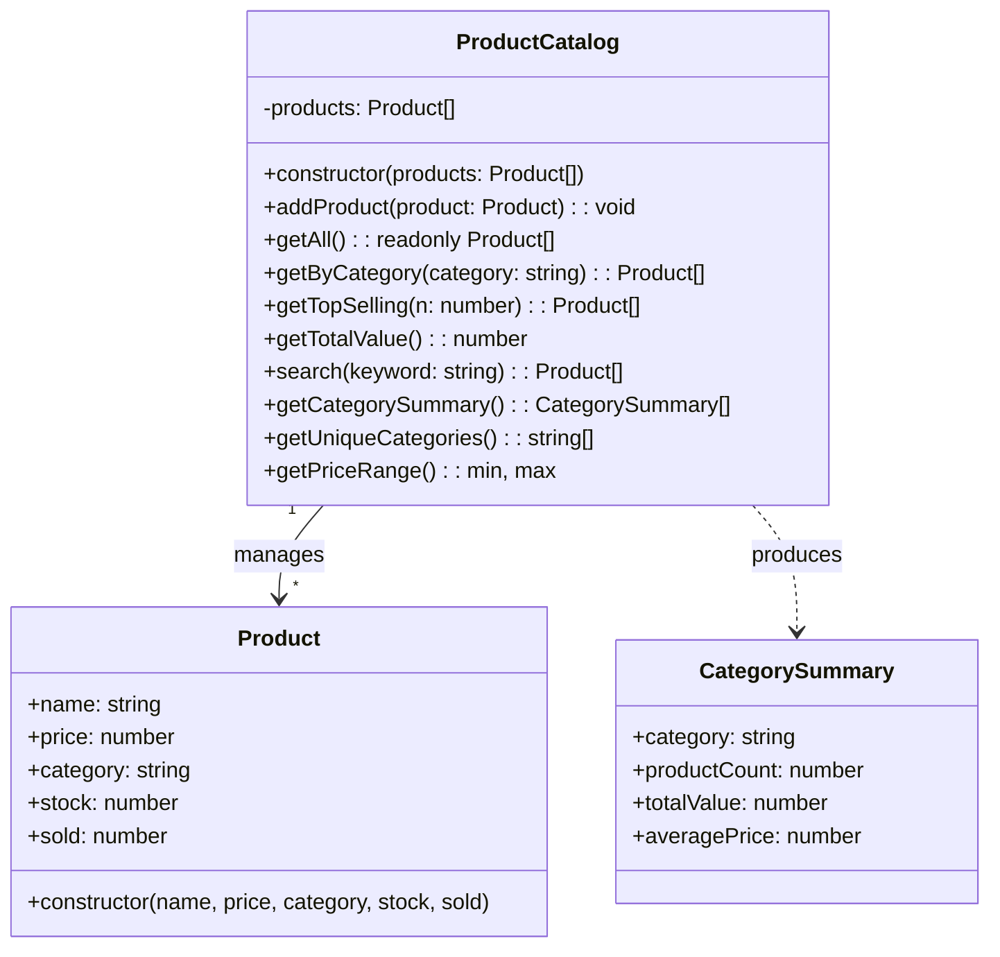

> **Mata Kuliah:** Pemrograman Berorientasi Objek
> **Minggu:** 6
> **Bagian:** Fundamentals
> **Bahasa:** TypeScript 5.x

---

## Capaian Pembelajaran Modul

Setelah mempelajari modul ini, mahasiswa mampu:
1. **Menjelaskan** karakteristik, kelebihan, dan kekurangan masing-masing generic collection (`Array<T>`, `Set<T>`, `Map<K, V>`) serta menentukan kapan menggunakan yang tepat
2. **Mengimplementasikan** higher-order functions (`map`, `filter`, `reduce`, `flatMap`, `sort`) untuk transformasi, filtering, dan agregasi data secara deklaratif
3. **Menganalisis** perbedaan antara operasi yang bersifat immutable (mengembalikan array baru) dan operasi yang bersifat mutable (mengubah array asli)
4. **Merancang** custom collection class yang membungkus `Array<T>` dengan domain-specific methods untuk studi kasus nyata
5. **Membandingkan** pendekatan collections dan functional operations di TypeScript, Java, dan Dart

---

## Prasyarat

- **Modul 01:** Paradigma OOP & Setup Environment TypeScript
- **Modul 02:** Class, Object & Encapsulation
- **Modul 03:** Inheritance & Method Overriding
- **Modul 04:** Abstraction --- Abstract Class & Interface
- **Modul 05:** Polymorphism & Generics --- terutama pemahaman tentang generic class, generic function, dan generic constraints (`<T>`, `<T extends X>`)

---

## Daftar Isi

- [1. Pendahuluan](#1-pendahuluan)
- [2. Landasan Konsep](#2-landasan-konsep)
- [3. Implementasi dalam TypeScript](#3-implementasi-dalam-typescript)
- [4. Perbandingan Lintas Bahasa](#4-perbandingan-lintas-bahasa)
- [5. Studi Kasus: ProductCatalog](#5-studi-kasus-productcatalog)
- [6. Kesalahan Umum & Best Practices](#6-kesalahan-umum--best-practices)
- [7. Ringkasan](#7-ringkasan)
- [8. Latihan Mandiri](#8-latihan-mandiri)

---

## 1. Pendahuluan

Di modul sebelumnya, kalian telah menguasai **Generics** --- kemampuan menulis class dan function yang bekerja dengan tipe sebagai parameter. Kalian juga sudah familiar dengan `Array<T>`, `Set<T>`, dan `Map<K, V>` sebagai contoh penerapan generics. Namun, menguasai *struktur data* saja tidak cukup. Dalam pengembangan perangkat lunak nyata, sebagian besar waktu kita dihabiskan untuk **memanipulasi data** --- memfilter, mentransformasi, mengelompokkan, dan merangkum koleksi data.

Bayangkan kalian sedang membangun sistem e-commerce. Kalian memiliki ribuan produk, ratusan transaksi per hari, dan berbagai laporan yang harus dihasilkan. Bagaimana cara menemukan produk terlaris? Bagaimana menghitung total pendapatan per metode pembayaran? Bagaimana mencari produk berdasarkan keyword?

Jawaban dari semua pertanyaan tersebut terletak pada penguasaan **collections** dan **functional operations** --- dua konsep yang akan kita dalami di modul ini.

> 💡 **Insight:** Pemrograman fungsional dan OOP bukan dua paradigma yang saling bertentangan. TypeScript memungkinkan kita menggabungkan keduanya --- menggunakan class dan object untuk *memodelkan domain*, lalu higher-order functions untuk *memanipulasi data* di dalam model tersebut.

---

## 2. Landasan Konsep

### 2.1 Generic Collections: Array, Set, dan Map

TypeScript menyediakan tiga jenis collection utama yang masing-masing memiliki karakteristik berbeda:

**`Array<T>` (atau `T[]`)**
- **Ordered** --- elemen memiliki urutan (index) yang tetap
- **Indexed** --- bisa diakses langsung via index: `arr[0]`, `arr[1]`
- **Duplicates allowed** --- bisa menyimpan elemen yang sama berkali-kali
- Paling serbaguna dan paling sering digunakan

**`Set<T>`**
- **Unique values** --- setiap elemen hanya bisa muncul sekali
- **No index access** --- tidak bisa akses via index, harus iterasi
- **Insertion order preserved** --- urutan penyisipan tetap terjaga
- Ideal untuk memastikan keunikan data

**`Map<K, V>`**
- **Key-value pairs** --- setiap entri terdiri dari key dan value
- **Unique keys** --- setiap key hanya bisa muncul sekali
- **Any type as key** --- tidak terbatas pada string seperti plain object
- Ideal untuk lookup cepat dan pengelompokan data

> 🔑 **Konsep Kunci:** Pemilihan collection yang tepat bukan hanya soal preferensi --- ia berdampak pada **kebenaran logika** dan **performa** program. Menggunakan `Set` saat butuh keunikan jauh lebih elegan daripada memfilter duplikat dari `Array` secara manual.

### 2.2 Kapan Pakai Array vs Set vs Map

Berikut panduan pemilihan collection:

| Kebutuhan | Collection | Alasan |
|-----------|-----------|--------|
| Daftar item berurutan, boleh duplikat | `Array<T>` | Mendukung index, sort, dan semua higher-order functions |
| Kumpulan item unik, cek keanggotaan cepat | `Set<T>` | `.has()` O(1), otomatis menolak duplikat |
| Pasangan key-value, lookup by key | `Map<K, V>` | `.get(key)` O(1), key bisa tipe apapun |
| Menghitung frekuensi kemunculan | `Map<string, number>` | Key = item, value = jumlah kemunculan |
| Mengelompokkan data berdasarkan kategori | `Map<string, T[]>` | Key = kategori, value = array item |
| Daftar berurutan + operasi transformasi berantai | `Array<T>` | `.map().filter().reduce()` chaining |

### 2.3 Higher-Order Functions: Konsep

**Higher-order function** adalah function yang menerima function lain sebagai parameter, atau mengembalikan function sebagai hasilnya. Di konteks collections, higher-order functions memungkinkan kita mendeskripsikan *apa* yang ingin kita lakukan terhadap data, tanpa harus menulis *bagaimana* melakukannya secara detail (imperatif).

Pendekatan ini disebut **deklaratif** --- kita mendeklarasikan niat, bukan langkah-langkah.

```
Imperatif: "Buat array kosong. Loop dari i=0 sampai n. Jika elemen[i] memenuhi syarat, push ke array baru."
Deklaratif: "Filter array ini dengan syarat berikut."
```

Kategori higher-order functions pada Array:

1. **Transformasi** --- mengubah bentuk data: `.map()`, `.flatMap()`
2. **Filtering** --- menyaring data: `.filter()`, `.find()`, `.findIndex()`
3. **Agregasi** --- merangkum data menjadi satu nilai: `.reduce()`, `.some()`, `.every()`
4. **Sorting** --- mengurutkan data: `.sort()` dengan custom comparator
5. **Iterasi** --- menjalankan efek samping: `.forEach()`

### 2.4 Immutability vs Mutability

Tidak semua method pada Array berperilaku sama terhadap data asli:

**Immutable (mengembalikan array/value baru, TIDAK mengubah asli):**
- `.map()`, `.filter()`, `.flatMap()`, `.concat()`, `.slice()`
- `.reduce()`, `.find()`, `.findIndex()`, `.some()`, `.every()`

**Mutable (MENGUBAH array asli secara langsung):**
- `.sort()`, `.reverse()`, `.splice()`, `.push()`, `.pop()`, `.shift()`, `.unshift()`

> ⚠️ **Perhatian:** `.sort()` mengubah array asli! Ini adalah salah satu sumber bug paling umum. Jika ingin sorting tanpa mengubah data asli, gunakan spread operator: `[...arr].sort()`. Mulai ES2023, TypeScript juga mendukung `.toSorted()` yang immutable.

### 2.5 Chaining: Menggabungkan Multiple Operations

Salah satu kekuatan terbesar higher-order functions adalah kemampuan **chaining** --- merangkai beberapa operasi menjadi satu pipeline yang mengalir dari kiri ke kanan (atas ke bawah).

```
data
  .filter(...)   // saring
  .map(...)      // transformasi
  .sort(...)     // urutkan
  .slice(0, 5)   // ambil 5 pertama
```

Setiap method mengembalikan array baru, yang kemudian menjadi input untuk method berikutnya. Ini menghasilkan kode yang **mudah dibaca** dan **mudah di-maintain** karena setiap langkah memiliki tanggung jawab yang jelas.

---

## 3. Implementasi dalam TypeScript

### 3.1 Array&lt;T&gt;: Pembuatan dan Operasi Dasar

```typescript
// Deklarasi array --- dua syntax yang setara
const numbers: Array<number> = [10, 20, 30, 40, 50];
const names: string[] = ["Alice", "Bob", "Charlie"]; // shorthand syntax

// Akses elemen via index
console.log(numbers[0]); // Output: 10
console.log(numbers[numbers.length - 1]); // Output: 50

// Menambah elemen
numbers.push(60); // menambah di akhir (mutable)
numbers.unshift(0); // menambah di awal (mutable)

// Menghapus elemen
const last = numbers.pop(); // menghapus dan return elemen terakhir
const first = numbers.shift(); // menghapus dan return elemen pertama

// Spread operator --- membuat salinan dangkal (shallow copy)
const copy = [...numbers];

// Destructuring --- mengambil elemen secara langsung
const [a, b, ...rest] = numbers;
console.log(a); // Output: 10
console.log(b); // Output: 20
console.log(rest); // Output: [30, 40, 50]
```

### 3.2 Set&lt;T&gt;: Koleksi Unik

```typescript
// Membuat Set dari array --- duplikat otomatis dihilangkan
const tags = new Set<string>(["typescript", "oop", "typescript", "generics"]);
console.log(tags.size); // Output: 3 (bukan 4 --- "typescript" hanya muncul sekali)

// Operasi dasar pada Set
tags.add("collections"); // menambah elemen
tags.delete("generics"); // menghapus elemen, return boolean
console.log(tags.has("oop")); // Output: true --- cek keanggotaan O(1)

// Konversi Set ke Array
const uniqueTags: string[] = [...tags]; // menggunakan spread operator
console.log(uniqueTags); // Output: ["typescript", "oop", "collections"]

// Use case: menghilangkan duplikat dari array
const rawIds = [1, 2, 3, 2, 4, 1, 5];
const uniqueIds = [...new Set(rawIds)];
console.log(uniqueIds); // Output: [1, 2, 3, 4, 5]

// Iterasi Set dengan for...of
for (const tag of tags) {
    console.log(tag);
}
```

> 📝 **Catatan Dosen:** Set menggunakan algoritma SameValueZero untuk perbandingan, mirip `===` tapi menganggap `NaN === NaN`. Untuk objek, Set membandingkan **referensi**, bukan isi. Dua objek dengan properti identik tetap dianggap berbeda jika referensinya berbeda.

### 3.3 Map&lt;K, V&gt;: Pasangan Key-Value

```typescript
// Membuat Map dengan initial values
const studentScores = new Map<string, number>([
    ["Alice", 95],
    ["Bob", 87],
    ["Charlie", 92],
]);

// Operasi dasar
studentScores.set("Diana", 88); // menambah/update entry
const aliceScore = studentScores.get("Alice"); // type: number | undefined
console.log(aliceScore); // Output: 95

// Cek keberadaan key
if (studentScores.has("Bob")) {
    console.log("Bob ditemukan dengan nilai:", studentScores.get("Bob"));
}
// Output: Bob ditemukan dengan nilai: 87

// Menghapus entry
studentScores.delete("Charlie"); // return boolean

// Ukuran Map
console.log(studentScores.size); // Output: 3

// Iterasi Map
for (const [name, score] of studentScores) {
    console.log(`${name}: ${score}`);
}
// Output:
// Alice: 95
// Bob: 87
// Diana: 88

// Mendapatkan keys dan values secara terpisah
const allNames = [...studentScores.keys()];   // ["Alice", "Bob", "Diana"]
const allScores = [...studentScores.values()]; // [95, 87, 88]
```

> 💡 **Insight:** Berbeda dengan plain object (`{}`), `Map` bisa menggunakan **tipe apapun** sebagai key --- termasuk objek, function, bahkan Map lain. Plain object hanya bisa menggunakan `string`, `number`, atau `symbol` sebagai key.

### 3.4 Higher-Order Functions: Transformasi

#### `.map()` --- Mengubah setiap elemen

`.map()` membuat array baru dengan menerapkan function pada setiap elemen. Jumlah elemen input = jumlah elemen output.

```typescript
interface Product {
    name: string;
    price: number;
    category: string;
}

const products: Product[] = [
    { name: "Laptop", price: 15_000_000, category: "Elektronik" },
    { name: "Mouse", price: 250_000, category: "Elektronik" },
    { name: "Buku TypeScript", price: 150_000, category: "Buku" },
    { name: "Meja Kerja", price: 2_000_000, category: "Furniture" },
];

// Mengambil hanya nama produk
const productNames: string[] = products.map((p) => p.name);
console.log(productNames);
// Output: ["Laptop", "Mouse", "Buku TypeScript", "Meja Kerja"]

// Menambahkan pajak 11% pada setiap produk
const withTax: Product[] = products.map((p) => ({
    ...p, // spread semua property asli
    price: Math.round(p.price * 1.11), // hitung harga + pajak
}));
console.log(withTax[0].price); // Output: 16650000
```

#### `.flatMap()` --- Map lalu Flatten satu level

`.flatMap()` menerapkan function yang mengembalikan array, lalu menggabungkan semua array hasil menjadi satu array datar.

```typescript
interface Order {
    orderId: string;
    items: string[];
}

const orders: Order[] = [
    { orderId: "ORD-001", items: ["Laptop", "Mouse"] },
    { orderId: "ORD-002", items: ["Buku TypeScript"] },
    { orderId: "ORD-003", items: ["Meja Kerja", "Kursi", "Lampu"] },
];

// Mengumpulkan semua item dari semua order ke satu array
const allItems: string[] = orders.flatMap((order) => order.items);
console.log(allItems);
// Output: ["Laptop", "Mouse", "Buku TypeScript", "Meja Kerja", "Kursi", "Lampu"]

// Perbandingan: .map() menghasilkan array bersarang, .flatMap() menghasilkan array datar
const nested: string[][] = orders.map((order) => order.items);
console.log(nested);
// Output: [["Laptop", "Mouse"], ["Buku TypeScript"], ["Meja Kerja", "Kursi", "Lampu"]]
```

### 3.5 Higher-Order Functions: Filtering

#### `.filter()` --- Menyaring elemen berdasarkan kondisi

```typescript
// Filter produk dengan harga di atas 500.000
const expensive: Product[] = products.filter((p) => p.price > 500_000);
console.log(expensive.map((p) => p.name));
// Output: ["Laptop", "Meja Kerja"]

// Filter produk kategori "Elektronik"
const electronics: Product[] = products.filter(
    (p) => p.category === "Elektronik"
);
console.log(electronics.map((p) => p.name));
// Output: ["Laptop", "Mouse"]
```

#### `.find()` dan `.findIndex()` --- Mencari satu elemen

```typescript
// Mencari produk pertama dengan harga di bawah 200.000
const cheap: Product | undefined = products.find((p) => p.price < 200_000);
console.log(cheap?.name); // Output: "Buku TypeScript"

// Mencari index produk "Mouse"
const mouseIndex: number = products.findIndex((p) => p.name === "Mouse");
console.log(mouseIndex); // Output: 1

// Jika tidak ditemukan, find() return undefined, findIndex() return -1
const notFound = products.find((p) => p.name === "Tablet");
console.log(notFound); // Output: undefined
```

> 🔑 **Konsep Kunci:** `.filter()` mengembalikan **semua** elemen yang cocok (array). `.find()` mengembalikan **elemen pertama** yang cocok (satu objek atau `undefined`). Gunakan `.find()` jika hanya butuh satu hasil --- lebih efisien karena berhenti begitu menemukan.

### 3.6 Higher-Order Functions: Agregasi

#### `.reduce()` --- Merangkum seluruh array menjadi satu nilai

`.reduce()` adalah higher-order function paling serbaguna. Ia "melipat" seluruh array menjadi satu nilai akumulator.

```typescript
// Menghitung total harga semua produk
const totalPrice: number = products.reduce(
    (sum, product) => sum + product.price, // accumulator function
    0 // nilai awal accumulator
);
console.log(totalPrice); // Output: 17400000

// Mengelompokkan produk berdasarkan kategori menggunakan reduce
const byCategory: Map<string, Product[]> = products.reduce(
    (groups, product) => {
        const existing = groups.get(product.category) ?? [];
        groups.set(product.category, [...existing, product]);
        return groups;
    },
    new Map<string, Product[]>() // nilai awal: Map kosong
);

for (const [category, items] of byCategory) {
    console.log(`${category}: ${items.map((p) => p.name).join(", ")}`);
}
// Output:
// Elektronik: Laptop, Mouse
// Buku: Buku TypeScript
// Furniture: Meja Kerja
```

#### `.some()` dan `.every()` --- Pengecekan kondisi

```typescript
// Apakah ADA produk dengan harga di atas 10 juta?
const hasExpensive: boolean = products.some((p) => p.price > 10_000_000);
console.log(hasExpensive); // Output: true

// Apakah SEMUA produk harganya di bawah 20 juta?
const allAffordable: boolean = products.every((p) => p.price < 20_000_000);
console.log(allAffordable); // Output: true

// Apakah SEMUA produk kategori "Elektronik"?
const allElectronic: boolean = products.every(
    (p) => p.category === "Elektronik"
);
console.log(allElectronic); // Output: false
```

### 3.7 Higher-Order Functions: Sorting

#### `.sort()` --- Mengurutkan dengan custom comparator

```typescript
// ⚠️ sort() MENGUBAH array asli! Gunakan spread untuk menghindari mutasi.
// Urutkan produk berdasarkan harga (ascending)
const sortedByPrice: Product[] = [...products].sort(
    (a, b) => a.price - b.price
);
console.log(sortedByPrice.map((p) => `${p.name}: ${p.price}`));
// Output: [
//   "Buku TypeScript: 150000",
//   "Mouse: 250000",
//   "Meja Kerja: 2000000",
//   "Laptop: 15000000"
// ]

// Urutkan berdasarkan harga (descending)
const sortedDesc: Product[] = [...products].sort(
    (a, b) => b.price - a.price
);

// Urutkan berdasarkan nama (alphabetical)
const sortedByName: Product[] = [...products].sort(
    (a, b) => a.name.localeCompare(b.name)
);
console.log(sortedByName.map((p) => p.name));
// Output: ["Buku TypeScript", "Laptop", "Meja Kerja", "Mouse"]
```

> 📝 **Catatan Dosen:** Comparator function harus mengembalikan: **negatif** jika `a < b`, **nol** jika `a === b`, **positif** jika `a > b`. Untuk number, shortcut `a - b` sangat umum. Untuk string, gunakan `.localeCompare()` agar urutan sesuai locale.

### 3.8 Chaining: Pipeline Operasi

```typescript
// Soal: Dari daftar produk, ambil nama 2 produk termahal kategori "Elektronik"
const topElectronics: string[] = products
    .filter((p) => p.category === "Elektronik")    // saring kategori
    .sort((a, b) => b.price - a.price)              // urutkan harga desc
    .slice(0, 2)                                     // ambil 2 pertama
    .map((p) => p.name);                             // ambil nama saja

console.log(topElectronics);
// Output: ["Laptop", "Mouse"]
```

> 💡 **Insight:** Chaining membuat kode membaca seperti *kalimat*: "Dari produk, filter yang elektronik, urutkan berdasarkan harga turun, ambil 2 pertama, ambil namanya." Ini jauh lebih mudah dipahami daripada loop bersarang.

### 3.9 Iterasi: for...of, forEach, Spread, dan Destructuring

```typescript
// for...of --- cara paling idiomatis untuk iterasi
for (const product of products) {
    console.log(product.name);
}

// forEach --- mirip for...of tapi sebagai method
products.forEach((product, index) => {
    console.log(`${index + 1}. ${product.name}`);
});
// Output:
// 1. Laptop
// 2. Mouse
// 3. Buku TypeScript
// 4. Meja Kerja

// Spread operator --- menggabungkan array
const moreProducts: Product[] = [
    { name: "Headphone", price: 500_000, category: "Elektronik" },
];
const allProducts: Product[] = [...products, ...moreProducts];

// Destructuring pada iterasi Map
const priceMap = new Map<string, number>([
    ["Laptop", 15_000_000],
    ["Mouse", 250_000],
]);

for (const [name, price] of priceMap) {
    console.log(`${name}: Rp ${price.toLocaleString("id-ID")}`);
}
// Output:
// Laptop: Rp 15.000.000
// Mouse: Rp 250.000
```

> 🔄 **Perbandingan:** Gunakan `for...of` jika butuh `break`/`continue`. Gunakan `.forEach()` untuk operasi sederhana tanpa kontrol flow. Untuk transformasi data, selalu gunakan `.map()`, `.filter()`, atau `.reduce()` --- **bukan** `forEach` dengan push ke array baru.

---

## 4. Perbandingan Lintas Bahasa

### Tabel Pemetaan Collection & Operations

| Konsep | TypeScript | Java | Dart |
|--------|-----------|------|------|
| Ordered list | `Array<T>` / `T[]` | `ArrayList<T>` | `List<T>` |
| Unique set | `Set<T>` | `HashSet<T>` | `Set<T>` |
| Key-value map | `Map<K, V>` | `HashMap<K, V>` | `Map<K, V>` |
| Filter | `.filter()` | `.stream().filter()` | `.where()` |
| Transform | `.map()` | `.stream().map()` | `.map()` |
| Reduce/Fold | `.reduce()` | `.stream().reduce()` | `.fold()` |
| Sort | `.sort()` | `.stream().sorted()` | `.sort()` / `..sort()` |
| Collect/Finalize | (langsung return array) | `.stream().collect()` | `.toList()` |
| Find first | `.find()` | `.stream().findFirst()` | `.firstWhere()` |
| Any match | `.some()` | `.stream().anyMatch()` | `.any()` |
| All match | `.every()` | `.stream().allMatch()` | `.every()` |
| Flat map | `.flatMap()` | `.stream().flatMap()` | `.expand()` |

### Contoh: Mendapatkan nama 3 produk termahal

**TypeScript:**
```typescript
const top3: string[] = products
    .sort((a, b) => b.price - a.price)
    .slice(0, 3)
    .map((p) => p.name);
```

**Java:**
```java
List<String> top3 = products.stream()
    .sorted(Comparator.comparingInt(Product::getPrice).reversed())
    .limit(3)
    .map(Product::getName)
    .collect(Collectors.toList());
```

**Dart:**
```dart
final top3 = (List<Product>.from(products)
    ..sort((a, b) => b.price.compareTo(a.price)))
    .take(3)
    .map((p) => p.name)
    .toList();
```

> 🔄 **Perbandingan:** Di Java, kita **harus** membuka stream (`.stream()`) sebelum bisa menggunakan functional operations, dan **harus** menutupnya dengan `.collect()`. Di TypeScript, higher-order functions langsung tersedia pada Array tanpa perlu konversi. Di Dart, `.where()` dan `.map()` mengembalikan `Iterable`, sehingga perlu `.toList()` di akhir.

### Perbedaan Perilaku .sort()

| Aspek | TypeScript | Java | Dart |
|-------|-----------|------|------|
| Mutasi | **Mutable** --- mengubah array asli | **Immutable** --- `.sorted()` pada stream mengembalikan stream baru | **Mutable** --- `.sort()` mengubah list asli |
| Default comparator | Lexicographic (string) | Natural order (Comparable) | Natural order (Comparable) |
| Versi immutable | `[...arr].sort()` atau `.toSorted()` | `.stream().sorted()` | `List.from(list)..sort()` |

---

## 5. Studi Kasus: ProductCatalog

### 5.1 Deskripsi Masalah

Sebuah toko online membutuhkan sistem katalog produk yang mendukung berbagai operasi pencarian dan analisis data. Sistem harus mampu:

- Menyimpan daftar produk dengan informasi nama, harga, kategori, stok, dan jumlah terjual
- Mencari produk berdasarkan keyword pada nama
- Memfilter produk berdasarkan kategori
- Menampilkan produk terlaris (top selling)
- Menghitung total nilai inventori (harga x stok)
- Memberikan ringkasan per kategori

Semua operasi harus menggunakan **higher-order functions** dan pendekatan **deklaratif**, bukan loop imperatif.

### 5.2 Desain Solusi



### 5.3 Implementasi

```typescript
// ======= product.ts =======

/** Representasi satu produk dalam katalog */
class Product {
    constructor(
        public readonly name: string,
        public readonly price: number,
        public readonly category: string,
        public readonly stock: number,
        public readonly sold: number
    ) {}

    /** Menghitung revenue yang dihasilkan produk ini */
    get revenue(): number {
        return this.price * this.sold;
    }

    /** Menghitung nilai inventori (harga x stok tersisa) */
    get inventoryValue(): number {
        return this.price * this.stock;
    }

    toString(): string {
        return `${this.name} (${this.category}) - Rp ${this.price.toLocaleString("id-ID")}`;
    }
}
```

```typescript
// ======= category-summary.ts =======

/** Ringkasan statistik per kategori */
interface CategorySummary {
    category: string;
    productCount: number;
    totalValue: number;
    averagePrice: number;
}
```

```typescript
// ======= product-catalog.ts =======

/** Custom collection class yang membungkus Array<Product> */
class ProductCatalog {
    private products: Product[];

    constructor(initialProducts: Product[] = []) {
        // Simpan salinan agar array eksternal tidak bisa mengubah internal state
        this.products = [...initialProducts];
    }

    /** Menambahkan produk baru ke katalog */
    addProduct(product: Product): void {
        this.products.push(product);
    }

    /** Mengembalikan semua produk (readonly agar tidak bisa diubah dari luar) */
    getAll(): readonly Product[] {
        return this.products;
    }

    /** Filter produk berdasarkan kategori */
    getByCategory(category: string): Product[] {
        return this.products.filter(
            (p) => p.category.toLowerCase() === category.toLowerCase()
        );
    }

    /** Mendapatkan n produk dengan penjualan tertinggi */
    getTopSelling(n: number): Product[] {
        return [...this.products]       // spread agar tidak mutasi data asli
            .sort((a, b) => b.sold - a.sold) // urutkan sold descending
            .slice(0, n);                     // ambil n pertama
    }

    /** Menghitung total nilai seluruh inventori */
    getTotalValue(): number {
        return this.products.reduce(
            (total, p) => total + p.inventoryValue,
            0
        );
    }

    /** Mencari produk berdasarkan keyword pada nama (case-insensitive) */
    search(keyword: string): Product[] {
        const lowerKeyword = keyword.toLowerCase();
        return this.products.filter(
            (p) => p.name.toLowerCase().includes(lowerKeyword)
        );
    }

    /** Mendapatkan daftar kategori unik menggunakan Set */
    getUniqueCategories(): string[] {
        const categories = new Set(this.products.map((p) => p.category));
        return [...categories]; // konversi Set ke Array
    }

    /** Mendapatkan harga terendah dan tertinggi */
    getPriceRange(): { min: number; max: number } {
        if (this.products.length === 0) {
            return { min: 0, max: 0 };
        }
        return {
            min: Math.min(...this.products.map((p) => p.price)),
            max: Math.max(...this.products.map((p) => p.price)),
        };
    }

    /** Menghitung ringkasan per kategori menggunakan Map + reduce */
    getCategorySummary(): CategorySummary[] {
        // Langkah 1: Kelompokkan produk berdasarkan kategori menggunakan Map
        const grouped = this.products.reduce((map, product) => {
            const existing = map.get(product.category) ?? [];
            map.set(product.category, [...existing, product]);
            return map;
        }, new Map<string, Product[]>());

        // Langkah 2: Transformasi setiap grup menjadi CategorySummary
        const summaries: CategorySummary[] = [...grouped.entries()].map(
            ([category, items]) => ({
                category,
                productCount: items.length,
                totalValue: items.reduce((sum, p) => sum + p.inventoryValue, 0),
                averagePrice:
                    items.reduce((sum, p) => sum + p.price, 0) / items.length,
            })
        );

        return summaries;
    }
}
```

```typescript
// ======= main.ts (penggunaan) =======

// Inisialisasi data produk
const catalog = new ProductCatalog([
    new Product("Laptop ASUS ROG", 25_000_000, "Elektronik", 10, 45),
    new Product("Mouse Logitech", 350_000, "Elektronik", 100, 230),
    new Product("Keyboard Mechanical", 1_200_000, "Elektronik", 50, 120),
    new Product("Buku Clean Code", 180_000, "Buku", 30, 95),
    new Product("Buku Design Patterns", 220_000, "Buku", 25, 78),
    new Product("Meja Standing Desk", 3_500_000, "Furniture", 15, 32),
    new Product("Kursi Ergonomis", 4_200_000, "Furniture", 20, 55),
    new Product("Monitor 27 inch", 5_500_000, "Elektronik", 25, 67),
]);

// 1. Cari produk berdasarkan keyword
console.log("=== Pencarian: 'keyboard' ===");
const searchResult = catalog.search("keyboard");
searchResult.forEach((p) => console.log(p.toString()));
// Output:
// Keyboard Mechanical (Elektronik) - Rp 1.200.000

// 2. Produk kategori Elektronik
console.log("\n=== Kategori: Elektronik ===");
const electronics = catalog.getByCategory("Elektronik");
electronics.forEach((p) => console.log(`  ${p.name}: stok ${p.stock}`));
// Output:
//   Laptop ASUS ROG: stok 10
//   Mouse Logitech: stok 100
//   Keyboard Mechanical: stok 50
//   Monitor 27 inch: stok 25

// 3. Top 3 produk terlaris
console.log("\n=== Top 3 Terlaris ===");
const topSelling = catalog.getTopSelling(3);
topSelling.forEach((p, i) =>
    console.log(`  ${i + 1}. ${p.name} (${p.sold} terjual)`)
);
// Output:
//   1. Mouse Logitech (230 terjual)
//   2. Keyboard Mechanical (120 terjual)
//   3. Buku Clean Code (95 terjual)

// 4. Total nilai inventori
console.log("\n=== Total Nilai Inventori ===");
const total = catalog.getTotalValue();
console.log(`  Rp ${total.toLocaleString("id-ID")}`);
// Output:
//   Rp 667.850.000

// 5. Kategori unik
console.log("\n=== Kategori Unik ===");
console.log(catalog.getUniqueCategories());
// Output: ["Elektronik", "Buku", "Furniture"]

// 6. Range harga
console.log("\n=== Range Harga ===");
const range = catalog.getPriceRange();
console.log(`  Min: Rp ${range.min.toLocaleString("id-ID")}`);
console.log(`  Max: Rp ${range.max.toLocaleString("id-ID")}`);
// Output:
//   Min: Rp 180.000
//   Max: Rp 25.000.000

// 7. Ringkasan per kategori
console.log("\n=== Ringkasan Per Kategori ===");
const summaries = catalog.getCategorySummary();
summaries.forEach((s) => {
    console.log(`  ${s.category}:`);
    console.log(`    Jumlah produk: ${s.productCount}`);
    console.log(`    Total inventori: Rp ${s.totalValue.toLocaleString("id-ID")}`);
    console.log(`    Rata-rata harga: Rp ${s.averagePrice.toLocaleString("id-ID")}`);
});
// Output:
//   Elektronik:
//     Jumlah produk: 4
//     Total inventori: Rp 483.500.000
//     Rata-rata harga: Rp 8.012.500
//   Buku:
//     Jumlah produk: 2
//     Total inventori: Rp 10.900.000
//     Rata-rata harga: Rp 200.000
//   Furniture:
//     Jumlah produk: 2
//     Total inventori: Rp 136.500.000
//     Rata-rata harga: Rp 3.850.000
```

### 5.4 Analisis

**Pola-pola yang digunakan:**

1. **Encapsulation melalui custom collection** --- `ProductCatalog` membungkus `Product[]` internal dan mengekspos domain-specific methods. Pengguna tidak perlu tahu bahwa di dalamnya menggunakan array biasa.

2. **Immutability** --- `getTopSelling()` menggunakan `[...this.products]` sebelum `.sort()` agar data asli tidak terubah. Property `Product` menggunakan `readonly` untuk mencegah mutasi dari luar.

3. **Deklaratif > Imperatif** --- Setiap method menggunakan higher-order functions alih-alih loop manual. Bandingkan `getTopSelling()` yang ringkas dengan versi imperatifnya:

```typescript
// Pendekatan deklaratif (3 baris logika)
getTopSelling(n: number): Product[] {
    return [...this.products]
        .sort((a, b) => b.sold - a.sold)
        .slice(0, n);
}

// Pendekatan imperatif (butuh 10+ baris logika)
getTopSellingImperative(n: number): Product[] {
    const copy = [];
    for (let i = 0; i < this.products.length; i++) {
        copy.push(this.products[i]);
    }
    // Manual bubble sort atau selection sort...
    for (let i = 0; i < copy.length; i++) {
        for (let j = i + 1; j < copy.length; j++) {
            if (copy[j].sold > copy[i].sold) {
                const temp = copy[i];
                copy[i] = copy[j];
                copy[j] = temp;
            }
        }
    }
    const result = [];
    for (let i = 0; i < Math.min(n, copy.length); i++) {
        result.push(copy[i]);
    }
    return result;
}
```

4. **Kombinasi Array + Set + Map** --- `getUniqueCategories()` memanfaatkan `Set` untuk deduplikasi otomatis, `getCategorySummary()` memanfaatkan `Map` untuk pengelompokan, dan semua method menggunakan `Array` higher-order functions.

5. **Readonly return type** --- `getAll()` mengembalikan `readonly Product[]` agar pemanggil tidak bisa memodifikasi koleksi internal secara tidak sengaja.

---

## 6. Kesalahan Umum & Best Practices

### ❌ Anti-Pattern / Kesalahan Umum

#### ❌ Menggunakan forEach + push alih-alih .map()

```typescript
// ❌ Imperatif --- verbose dan rawan error
const names: string[] = [];
products.forEach((p) => {
    names.push(p.name);
});
```

```typescript
// ✅ Deklaratif --- ringkas dan jelas niatnya
const names: string[] = products.map((p) => p.name);
```

#### ❌ Lupa bahwa .sort() mengubah array asli

```typescript
// ❌ Bug: array asli ikut terubah!
function getTop3(products: Product[]): Product[] {
    return products.sort((a, b) => b.sold - a.sold).slice(0, 3);
    // Setelah pemanggilan ini, array "products" di pemanggil sudah berubah urutannya!
}
```

```typescript
// ✅ Aman: buat salinan dulu dengan spread operator
function getTop3(products: Product[]): Product[] {
    return [...products].sort((a, b) => b.sold - a.sold).slice(0, 3);
}
```

#### ❌ Menggunakan .sort() tanpa comparator untuk number

```typescript
// ❌ Bug: sort() default menggunakan string comparison!
const prices = [100, 25, 300, 50, 1000];
prices.sort();
console.log(prices);
// Output: [100, 1000, 25, 300, 50] --- SALAH! Urutan lexicographic bukan numerik
```

```typescript
// ✅ Selalu berikan comparator untuk number
const prices = [100, 25, 300, 50, 1000];
const sorted = [...prices].sort((a, b) => a - b);
console.log(sorted);
// Output: [25, 50, 100, 300, 1000] --- Benar!
```

#### ❌ Tidak menangani .find() yang mengembalikan undefined

```typescript
// ❌ Runtime error jika produk tidak ditemukan
const product = products.find((p) => p.name === "Tablet");
console.log(product.price); // TypeError: Cannot read property 'price' of undefined
```

```typescript
// ✅ Gunakan optional chaining atau null check
const product = products.find((p) => p.name === "Tablet");
console.log(product?.price ?? "Produk tidak ditemukan");
// Output: "Produk tidak ditemukan"
```

#### ❌ Membandingkan objek di Set berdasarkan isi (bukan referensi)

```typescript
// ❌ Set membandingkan referensi objek, bukan isi!
const set = new Set<Product>();
set.add(new Product("Laptop", 15_000_000, "Elektronik", 10, 45));
set.add(new Product("Laptop", 15_000_000, "Elektronik", 10, 45));
console.log(set.size); // Output: 2 --- bukan 1! Dua objek berbeda referensi
```

```typescript
// ✅ Untuk deduplikasi berdasarkan isi, gunakan Map dengan key unik
const uniqueByName = new Map<string, Product>();
products.forEach((p) => uniqueByName.set(p.name, p));
const deduplicated = [...uniqueByName.values()];
```

#### ❌ Menggunakan reduce untuk hal yang bisa dilakukan .map() atau .filter()

```typescript
// ❌ Over-engineering: reduce dipakai padahal filter + map lebih jelas
const expensiveNames: string[] = products.reduce((acc: string[], p) => {
    if (p.price > 1_000_000) {
        acc.push(p.name);
    }
    return acc;
}, []);
```

```typescript
// ✅ Gunakan chaining filter + map --- lebih ekspresif
const expensiveNames: string[] = products
    .filter((p) => p.price > 1_000_000)
    .map((p) => p.name);
```

### ✅ Best Practices

1. **Pilih method yang tepat untuk niat yang jelas:**
   - Transformasi elemen? Gunakan `.map()`
   - Menyaring elemen? Gunakan `.filter()`
   - Merangkum ke satu nilai? Gunakan `.reduce()`
   - Cari satu elemen? Gunakan `.find()`
   - Cek kondisi? Gunakan `.some()` atau `.every()`

2. **Selalu buat salinan sebelum `.sort()`:**
   ```typescript
   const sorted = [...array].sort(comparator);
   ```

3. **Gunakan `readonly` untuk melindungi data internal collection class:**
   ```typescript
   getAll(): readonly Product[] {
       return this.products;
   }
   ```

4. **Gunakan `Set` saat butuh keunikan, `Map` saat butuh lookup by key:**
   - Jangan filter duplikat manual dari Array jika bisa pakai Set
   - Jangan loop Array untuk mencari by key jika bisa pakai Map

5. **Chain operations dari yang paling mempersempit data terlebih dahulu:**
   ```typescript
   // ✅ Filter dulu (kurangi jumlah elemen), baru sort (operasi mahal)
   products.filter(...).sort(...).slice(0, n);

   // ❌ Sort dulu semua elemen, baru filter --- membuang pekerjaan
   products.sort(...).filter(...).slice(0, n);
   ```

6. **Bungkus collection dalam class dengan domain-specific methods** agar logika bisnis tidak tersebar di mana-mana:
   ```typescript
   // ❌ Logika tersebar di berbagai tempat
   const topSelling = products.sort((a, b) => b.sold - a.sold).slice(0, 3);

   // ✅ Logika terpusat di satu class
   const topSelling = catalog.getTopSelling(3);
   ```

> ⚠️ **Perhatian:** Chaining yang terlalu panjang bisa menurunkan keterbacaan. Jika pipeline melebihi 4-5 operasi, pertimbangkan memecahnya menjadi langkah-langkah bernama (intermediate variables) atau membungkusnya dalam method terpisah.

---

## 7. Ringkasan

- **Generic collections** di TypeScript meliputi `Array<T>` (ordered, indexed, duplicates allowed), `Set<T>` (unique values), dan `Map<K, V>` (key-value pairs). Pemilihan yang tepat bergantung pada kebutuhan: urutan, keunikan, atau lookup by key.
- **Higher-order functions** memungkinkan pendekatan **deklaratif** dalam memanipulasi data: `.map()` untuk transformasi, `.filter()` untuk penyaringan, `.reduce()` untuk agregasi, `.sort()` untuk pengurutan, `.find()` untuk pencarian.
- **Immutability** adalah prinsip penting: `.map()`, `.filter()`, `.reduce()` mengembalikan nilai baru tanpa mengubah data asli, sedangkan `.sort()` dan `.reverse()` **mengubah array asli**. Selalu gunakan spread operator (`[...arr]`) sebelum `.sort()` untuk menghindari mutasi yang tidak diinginkan.
- **Chaining** memungkinkan penggabungan multiple operations menjadi pipeline yang mengalir dan mudah dibaca: `filter → sort → slice → map`.
- **Custom collection class** (seperti `ProductCatalog`) membungkus `Array<T>` internal dan mengekspos domain-specific methods, menerapkan prinsip encapsulation dari OOP pada manipulasi data.
- Di **Java**, functional operations memerlukan `.stream()` dan `.collect()`. Di **Dart**, method seperti `.where()` dan `.map()` mengembalikan `Iterable` yang perlu dikonversi dengan `.toList()`. TypeScript menawarkan pengalaman paling langsung --- higher-order functions tersedia langsung pada Array.
- **Best practice**: pilih higher-order function yang tepat, lindungi data internal dengan `readonly`, filter sebelum sort, dan bungkus logika collection dalam class untuk menghindari duplikasi.

---

## 8. Latihan Mandiri

### Latihan 1: Analisis Data Mahasiswa

Diberikan data mahasiswa berikut:

```typescript
interface Student {
    name: string;
    nim: string;
    gpa: number;          // IPK (0.0 - 4.0)
    semester: number;
    department: string;    // "Informatika" | "Sistem Informasi" | "Teknik Komputer"
}
```

Buat class `StudentAnalytics` yang menerima `Student[]` di constructor dan menyediakan method berikut:

1. `getHonorStudents(): Student[]` --- mahasiswa dengan IPK &gt;= 3.5, diurutkan dari IPK tertinggi
2. `getByDepartment(dept: string): Student[]` --- filter berdasarkan jurusan
3. `getAverageGpa(): number` --- rata-rata IPK seluruh mahasiswa
4. `getGpaDistribution(): Map<string, number>` --- jumlah mahasiswa per kategori IPK: "Cum Laude" (&gt;= 3.5), "Sangat Memuaskan" (&gt;= 3.0), "Memuaskan" (&gt;= 2.5), "Cukup" (< 2.5)
5. `search(keyword: string): Student[]` --- cari berdasarkan nama atau NIM

Gunakan **hanya higher-order functions** (tanpa loop `for`/`while`).

### Latihan 2: Keranjang Belanja (ShoppingCart)

Implementasikan class `ShoppingCart` dengan fitur:

```typescript
interface CartItem {
    product: Product;
    quantity: number;
}

class ShoppingCart {
    private items: CartItem[] = [];

    addItem(product: Product, quantity: number): void { /* ... */ }
    removeItem(productName: string): void { /* ... */ }
    getTotal(): number { /* ... */ }
    getItemCount(): number { /* ... */ }
    getUniqueCategories(): string[] { /* ... */ }
    getMostExpensiveItem(): CartItem | undefined { /* ... */ }
    getSummaryByCategory(): Map<string, number> { /* ... */ }
    applyDiscount(percentage: number): CartItem[] { /* ... */ }
}
```

Pastikan:
- `addItem()` menambah quantity jika produk sudah ada di keranjang (jangan duplikat)
- `getTotal()` menghitung total (harga x quantity) menggunakan `.reduce()`
- `getSummaryByCategory()` mengembalikan total harga per kategori
- `applyDiscount()` mengembalikan array baru dengan harga terdiskon (immutable)

### Latihan 3: TransactionReport (Tugas Utama)

Buat class `TransactionReport` yang menerima array `Transaction[]` dan menyediakan method analisis data penjualan.

```typescript
type PaymentMethod = "cash" | "credit_card" | "debit" | "e_wallet";

interface Transaction {
    id: string;
    date: string;              // format "YYYY-MM-DD"
    productName: string;
    quantity: number;
    pricePerUnit: number;
    paymentMethod: PaymentMethod;
}

class TransactionReport {
    constructor(private transactions: Transaction[]) {}

    /** Menghitung total pendapatan dari semua transaksi */
    totalRevenue(): number { /* gunakan .reduce() */ }

    /** Mengelompokkan total pendapatan berdasarkan metode pembayaran */
    revenueByPaymentMethod(): Map<PaymentMethod, number> { /* gunakan .reduce() dengan Map */ }

    /** Mendapatkan n produk terlaris berdasarkan jumlah terjual */
    topSellingProducts(n: number): { productName: string; totalSold: number }[] {
        /*
         * Langkah:
         * 1. Kelompokkan transaksi berdasarkan productName (Map)
         * 2. Hitung total quantity per produk (.reduce())
         * 3. Urutkan descending (.sort())
         * 4. Ambil n pertama (.slice())
         */
    }

    /** Menghasilkan ringkasan transaksi untuk tanggal tertentu */
    dailySummary(date: string): {
        date: string;
        transactionCount: number;
        totalRevenue: number;
        paymentMethods: string[];
    } {
        /* Filter transaksi by date, lalu hitung summary */
    }
}
```

**Contoh data untuk pengujian:**

```typescript
const transactions: Transaction[] = [
    { id: "TRX-001", date: "2025-01-15", productName: "Laptop", quantity: 1, pricePerUnit: 15_000_000, paymentMethod: "credit_card" },
    { id: "TRX-002", date: "2025-01-15", productName: "Mouse", quantity: 3, pricePerUnit: 250_000, paymentMethod: "cash" },
    { id: "TRX-003", date: "2025-01-15", productName: "Keyboard", quantity: 2, pricePerUnit: 800_000, paymentMethod: "e_wallet" },
    { id: "TRX-004", date: "2025-01-16", productName: "Mouse", quantity: 5, pricePerUnit: 250_000, paymentMethod: "debit" },
    { id: "TRX-005", date: "2025-01-16", productName: "Laptop", quantity: 2, pricePerUnit: 15_000_000, paymentMethod: "credit_card" },
    { id: "TRX-006", date: "2025-01-16", productName: "Monitor", quantity: 1, pricePerUnit: 5_000_000, paymentMethod: "cash" },
];
```

**Expected output:**
```
totalRevenue(): 52_600_000
revenueByPaymentMethod():
  credit_card => 45_000_000
  cash => 5_750_000
  e_wallet => 1_600_000
  debit => 1_250_000
topSellingProducts(2):
  1. Mouse (8 terjual)
  2. Laptop (3 terjual)
dailySummary("2025-01-15"):
  { date: "2025-01-15", transactionCount: 3, totalRevenue: 16_350_000, paymentMethods: ["credit_card", "cash", "e_wallet"] }
```

Implementasikan **seluruh method** dengan menggunakan higher-order functions. Pastikan kode bisa dikompilasi dengan `strict: true`.

### Latihan 4: Tantangan Tambahan --- Immutable Pipeline

Refactor class `ProductCatalog` dari studi kasus agar **semua method** yang mengembalikan data menggunakan `readonly` return type. Tambahkan method baru:

- `sortBy(key: keyof Product, order: "asc" | "desc"): readonly Product[]` --- generic sorting berdasarkan key apapun
- `paginate(page: number, pageSize: number): readonly Product[]` --- mengembalikan "halaman" tertentu dari daftar produk
- `aggregate(): { totalProducts: number; totalStock: number; totalRevenue: number; averagePrice: number }` --- menghitung berbagai statistik dalam satu kali pemanggilan

---

## Referensi & Bacaan Lanjutan

- TypeScript Handbook --- Everyday Types: https://www.typescriptlang.org/docs/handbook/2/everyday-types.html
- MDN --- Array: https://developer.mozilla.org/en-US/docs/Web/JavaScript/Reference/Global_Objects/Array
- MDN --- Set: https://developer.mozilla.org/en-US/docs/Web/JavaScript/Reference/Global_Objects/Set
- MDN --- Map: https://developer.mozilla.org/en-US/docs/Web/JavaScript/Reference/Global_Objects/Map
- MDN --- Array.prototype.reduce(): https://developer.mozilla.org/en-US/docs/Web/JavaScript/Reference/Global_Objects/Array/reduce
- TypeScript Handbook --- Generics: https://www.typescriptlang.org/docs/handbook/2/generics.html
- "Effective TypeScript" --- Dan Vanderkam (Item 27: Use Functional Constructs and Libraries to Help Types Flow)
- "Clean Code" --- Robert C. Martin (Chapter 14: Successive Refinement)
- Java Stream API: https://docs.oracle.com/en/java/javase/17/docs/api/java.base/java/util/stream/Stream.html
- Dart Collections: https://dart.dev/guides/libraries/library-tour#collections
