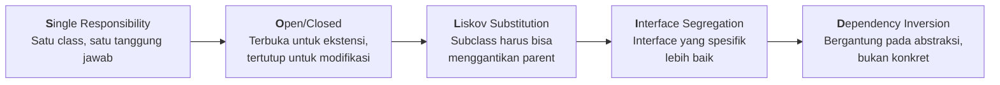
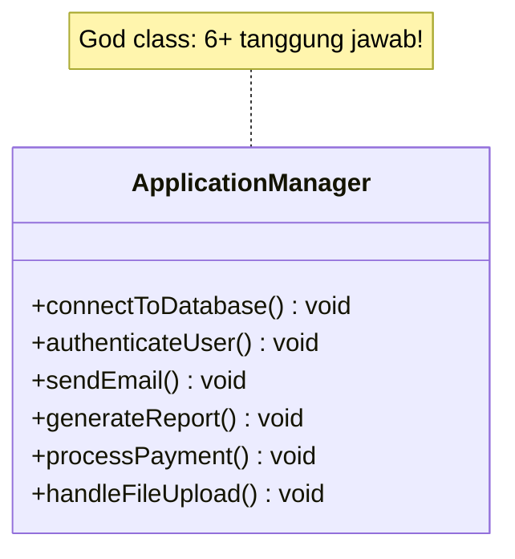
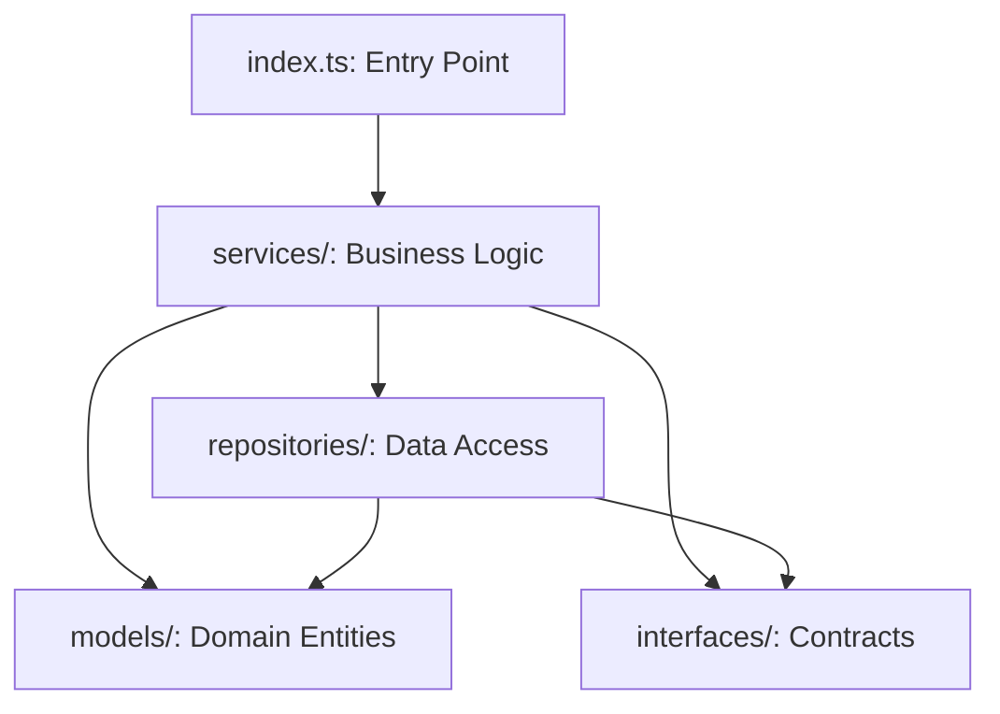
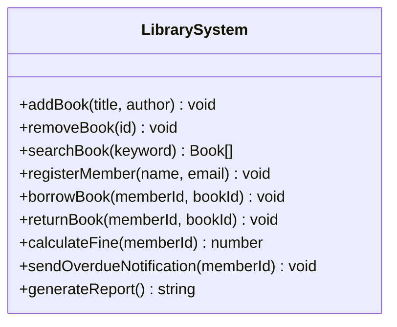

> **Mata Kuliah:** Pemrograman Berorientasi Objek
> **Minggu:** 7
> **Bagian:** Fundamentals
> **Bahasa:** TypeScript 5.x

---

## Capaian Pembelajaran Modul

Setelah mempelajari modul ini, mahasiswa mampu:
1. Menjelaskan kelima prinsip SOLID dan mengidentifikasi pelanggaran dalam kode
2. Mengenal lima design pattern umum (Singleton, Factory, Strategy, Observer, Repository/DAO) dan memahami motivasi masing-masing
3. Mengidentifikasi anti-pattern: God class, tight coupling
4. Mengorganisir project menggunakan ES Modules dan folder layout yang terstruktur

---

## Prasyarat

- **Modul 01:** Setup Environment TypeScript
- **Modul 02:** Class, Object & Encapsulation
- **Modul 03:** Inheritance & Composition
- **Modul 04:** Abstraction (Abstract Class & Interface)
- **Modul 05:** Polymorphism & Generics

---

## Daftar Isi

- [1. Pendahuluan](#1-pendahuluan)
- [2. Landasan Konsep](#2-landasan-konsep)
  - [2.1 SOLID Principles Overview](#21-solid-principles-overview)
  - [2.2 Apa Itu Design Pattern?](#22-apa-itu-design-pattern)
  - [2.3 Anti-Patterns: God Class & Tight Coupling](#23-anti-patterns-god-class--tight-coupling)
  - [2.4 ES Modules & Project Structure](#24-es-modules--project-structure)
- [3. Implementasi dalam TypeScript](#3-implementasi-dalam-typescript)
  - [3.1 SOLID dalam Contoh Singkat](#31-solid-dalam-contoh-singkat)
  - [3.2 Singleton Pattern](#32-singleton-pattern)
  - [3.3 Factory Pattern](#33-factory-pattern)
  - [3.4 Strategy Pattern](#34-strategy-pattern)
  - [3.5 Observer Pattern](#35-observer-pattern)
  - [3.6 Repository/DAO Pattern](#36-repositorydao-pattern)
  - [3.7 ES Modules: import/export](#37-es-modules-importexport)
  - [3.8 Folder Structure Convention](#38-folder-structure-convention)
- [4. Perbandingan Lintas Bahasa](#4-perbandingan-lintas-bahasa)
- [5. Studi Kasus: Code Review Exercise](#5-studi-kasus-code-review-exercise)
- [6. Kesalahan Umum & Best Practices](#6-kesalahan-umum--best-practices)
- [7. Ringkasan](#7-ringkasan)
- [8. Latihan Mandiri](#8-latihan-mandiri)

---

## 1. Pendahuluan

Di modul-modul sebelumnya, kalian telah mempelajari pilar-pilar OOP: encapsulation, inheritance, polymorphism, abstraction, interface, dan generics. Namun, kemampuan menggunakan fitur OOP saja **belum cukup** untuk menghasilkan kode yang baik.

Prinsip **SOLID** adalah lima panduan desain yang dirumuskan oleh Robert C. Martin ("Uncle Bob") untuk menulis kode yang **mudah dipelihara**, **mudah diperluas**, dan **tahan terhadap perubahan**. Selain SOLID, dunia software engineering juga mengenal **Design Patterns**, solusi teruji untuk masalah desain yang sering muncul.

Modul ini adalah **perkenalan**. Tujuannya bukan agar kalian menghafal semua pattern, melainkan agar kalian memahami *mengapa* prinsip dan pattern tersebut ada. Implementasi mendalam akan terjadi secara natural di minggu 9-14.

> 🔑 **Konsep Kunci:** Menguasai syntax OOP tanpa memahami prinsip desain seperti menghapal kosakata tanpa memahami tata bahasa, kode mungkin berjalan, tetapi arsitekturnya rapuh dan sulit dikembangkan.

---

## 2. Landasan Konsep

### 2.1 SOLID Principles Overview

SOLID adalah akronim dari lima prinsip desain berorientasi objek yang saling melengkapi.



**S, Single Responsibility Principle (SRP)**
> *"A class should have one, and only one, reason to change."*

Setiap class hanya memiliki **satu tanggung jawab**. Jika `UserService` menangani registrasi sekaligus mengirim email, perubahan pada logika email memaksa kita mengubah class yang seharusnya hanya mengelola user. Solusi: pisahkan menjadi `UserService` dan `EmailService`.

**O, Open/Closed Principle (OCP)**
> *"Software entities should be open for extension, but closed for modification."*

Saat ada kebutuhan baru, tambahkan kode baru **tanpa mengubah** kode yang sudah teruji. Gunakan abstraksi dan polymorphism: definisikan interface `DiscountStrategy`, lalu tambahkan implementasi baru alih-alih menambah `if-else`.

**L, Liskov Substitution Principle (LSP)**
> *"Subclass should be replaceable with their parent without breaking the application."*

Subclass harus bisa **menggantikan** parent-nya tanpa mengubah kebenaran program. `Penguin extends Bird` yang melempar error pada `fly()` melanggar LSP. Solusi: restrukturisasi agar `Bird` hanya menjanjikan kemampuan yang dimiliki semua turunannya.

**I, Interface Segregation Principle (ISP)**
> *"No client should be forced to depend on methods it does not use."*

Interface **spesifik dan kecil** lebih baik daripada yang besar dan serba bisa. Jangan paksa `RobotWorker` mengimplementasikan `eat()` dan `sleep()`. Pecah menjadi `Workable`, `Eatable`, `Sleepable`.

**D, Dependency Inversion Principle (DIP)**
> *"High-level modules should not depend on low-level modules. Both should depend on abstractions."*

Modul high-level (logika bisnis) tidak boleh bergantung langsung pada implementasi konkret. Alih-alih `new MySQLDatabase()` di dalam `OrderService`, inject interface `Database` melalui constructor. Teknik ini disebut **Dependency Injection**, akan dipelajari mendalam di minggu 10.

> 💡 **Insight:** "Tanggung jawab" di SRP bukan berarti satu method. Artinya, semua method dalam class melayani **satu kepentingan/domain yang sama**. `UserService` boleh punya banyak method selama semuanya terkait pengelolaan data user.

### 2.2 Apa Itu Design Pattern?

Design patterns adalah **template konseptual** untuk menyelesaikan masalah desain yang berulang. Pertama kali dipopulerkan oleh **Gang of Four (GoF)** dalam buku *"Design Patterns"* (1994), GoF mendokumentasikan **23 patterns** dalam tiga kategori:

| Kategori | Fokus | Contoh |
|----------|-------|--------|
| **Creational** | Bagaimana objek **dibuat** | Singleton, Factory, Builder |
| **Structural** | Bagaimana objek **disusun** | Adapter, Decorator, Facade |
| **Behavioral** | Bagaimana objek **berkomunikasi** | Strategy, Observer, Command |

**Mengapa penting?**
1. **Bahasa komunikasi bersama**: "Gunakan Strategy di sini" langsung dipahami semua developer
2. **Solusi teruji**: Kelebihan dan kekurangan sudah diketahui
3. **Menerapkan SOLID secara natural**: Kebanyakan pattern mengikuti prinsip SOLID
4. **Menghindari reinventing the wheel**

Di modul ini kita berkenalan dengan lima pattern: **Singleton**, **Factory**, **Strategy**, **Observer**, dan **Repository/DAO**.

> ⚠️ **Perhatian:** Jangan terburu-buru menerapkan pattern di mana-mana. Pattern yang salah tempat justru menambah kompleksitas. Ingat: *"Don't use a pattern just because you know it."*

### 2.3 Anti-Patterns: God Class & Tight Coupling

Sebelum mempelajari solusi, penting untuk mengenali **masalah** yang sering muncul.

**God Class**: class yang terlalu banyak mengetahui dan melakukan. Tanda-tandanya: ratusan baris, puluhan method, nama terlalu generik (`Manager`, `Helper`), sulit di-test. Solusi: pecah berdasarkan domain.



**Tight Coupling**: class bergantung langsung pada implementasi konkret class lain. Tanda-tandanya: banyak `new ConcreteClass()` di dalam class lain, mengubah satu class memaksa perubahan di banyak tempat. Solusi: gunakan interface dan dependency injection.

> 🔑 **Konsep Kunci:** God class dan tight coupling adalah dua anti-pattern paling umum di kode OOP pemula. Mengenali keduanya adalah langkah pertama menuju arsitektur yang lebih baik.

### 2.4 ES Modules & Project Structure

Untuk project nyata, kode perlu dipecah ke dalam file-file terpisah menggunakan **ES Modules**, standar resmi JavaScript/TypeScript untuk modularisasi.

**Dua jenis export:**
- **Named export** (direkomendasikan), mengekspor item dengan nama eksplisit
- **Default export**: mengekspor satu item utama per file

**Barrel exports**: file `index.ts` di setiap folder yang me-*re-export* semua item, menyederhanakan import path.

**Layered architecture**: konvensi umum di industri:

```
src/
├── models/         # Entity / domain classes
├── interfaces/     # Type definitions & contracts
├── services/       # Business logic
├── repositories/   # Data access layer
├── utils/          # Helper functions
└── index.ts        # Entry point
```

Setiap layer hanya boleh bergantung pada layer di bawahnya, ini disebut **Dependency Rule**.



> 🔑 **Konsep Kunci:** Pemisahan layer mengikuti prinsip **Separation of Concerns**, model tidak tahu tentang database, service tidak tahu bagaimana data disimpan.

---

## 3. Implementasi dalam TypeScript

### 3.1 SOLID dalam Contoh Singkat

Satu contoh singkat per prinsip. Fokus: mengenali **pola** yang benar.

**SRP, Pisahkan Tanggung Jawab:**

```typescript
class UserRepository {
    save(name: string, email: string): void {
        console.log(`[DB] Menyimpan user: ${name}, ${email}`);
    }
}

class WelcomeMailer {
    send(email: string, name: string): void {
        console.log(`[EMAIL] Selamat datang, ${name}!`);
    }
}

class UserRegistration {
    constructor(private repo: UserRepository, private mailer: WelcomeMailer) {}
    register(name: string, email: string): void {
        this.repo.save(name, email);
        this.mailer.send(email, name);
    }
}
```

**OCP, Extend Tanpa Modifikasi:**

```typescript
interface Shape { area(): number; }

class Circle implements Shape {
    constructor(private radius: number) {}
    area(): number { return Math.PI * this.radius ** 2; }
}

class Rectangle implements Shape {
    constructor(private w: number, private h: number) {}
    area(): number { return this.w * this.h; }
}

// Tidak perlu diubah saat ada Shape baru
function printArea(shape: Shape): void {
    console.log(`Luas: ${shape.area().toFixed(2)}`);
}
```

**LSP, Substitusi yang Aman:**

```typescript
abstract class Vehicle {
    abstract startEngine(): string;
}
class Car extends Vehicle {
    startEngine(): string { return "Mobil: mesin menyala!"; }
}
class Motorcycle extends Vehicle {
    startEngine(): string { return "Motor: mesin menyala!"; }
}

// Aman: semua Vehicle bisa startEngine tanpa error
function testDrive(v: Vehicle): void { console.log(v.startEngine()); }
```

**ISP, Interface yang Spesifik:**

```typescript
interface Printable { print(): void; }
interface Scannable { scan(): void; }

class AllInOnePrinter implements Printable, Scannable {
    print(): void { console.log("Mencetak..."); }
    scan(): void  { console.log("Memindai..."); }
}
class SimplePrinter implements Printable {
    print(): void { console.log("Mencetak..."); }
    // Tidak dipaksa implement scan()
}
```

**DIP, Bergantung pada Abstraksi:**

```typescript
interface Logger { log(message: string): void; }

class ConsoleLogger implements Logger {
    log(message: string): void { console.log(`[LOG] ${message}`); }
}

class AppService {
    constructor(private logger: Logger) {}
    doWork(): void { this.logger.log("Pekerjaan selesai"); }
}

const app = new AppService(new ConsoleLogger());
app.doWork();
```

### 3.2 Singleton Pattern

**Mengapa pattern ini ada?** Terkadang kita butuh tepat **satu instance** di seluruh aplikasi, konfigurasi global, koneksi database pool, atau logger terpusat.

```typescript
class ConfigManager {
    private static instance: ConfigManager;
    private debug = false;

    private constructor() {} // private - tidak bisa di-new dari luar

    static getInstance(): ConfigManager {
        if (!ConfigManager.instance) {
            ConfigManager.instance = new ConfigManager();
        }
        return ConfigManager.instance;
    }

    isDebug(): boolean { return this.debug; }
    setDebug(value: boolean): void { this.debug = value; }
}

const c1 = ConfigManager.getInstance();
const c2 = ConfigManager.getInstance();
console.log(c1 === c2);  // true - objek yang sama!
c1.setDebug(true);
console.log(c2.isDebug()); // true
```

> 💡 **Insight:** Di TypeScript, ada cara idiomatik: setiap ES Module hanya di-evaluate sekali, jadi objek yang di-export otomatis menjadi singleton.

> ⚠️ **Perhatian:** Singleton menciptakan **global state** yang menyulitkan testing. Gunakan hanya ketika benar-benar diperlukan.

*Pattern ini akan dipraktikkan lebih mendalam di minggu 11.*

### 3.3 Factory Pattern

**Mengapa pattern ini ada?** Ketika pembuatan objek melibatkan logika pemilihan, kita tidak ingin client code mengetahui class konkret mana yang dibuat. Factory menyembunyikan logika pembuatan di satu tempat.

```typescript
interface Shape {
    area(): number;
    describe(): string;
}

class Circle implements Shape {
    constructor(private radius: number) {}
    area(): number { return Math.PI * this.radius ** 2; }
    describe(): string { return `Lingkaran (r=${this.radius})`; }
}

class Rectangle implements Shape {
    constructor(private width: number, private height: number) {}
    area(): number { return this.width * this.height; }
    describe(): string { return `Persegi panjang (${this.width}x${this.height})`; }
}

type ShapeType = "circle" | "rectangle";

class ShapeFactory {
    static create(type: ShapeType, ...params: number[]): Shape {
        switch (type) {
            case "circle":    return new Circle(params[0]);
            case "rectangle": return new Rectangle(params[0], params[1]);
        }
    }
}

// Client code hanya tahu interface Shape
const s1 = ShapeFactory.create("circle", 5);
const s2 = ShapeFactory.create("rectangle", 4, 6);
console.log(s1.describe(), "Luas:", s1.area().toFixed(2));
```

> 🔑 **Konsep Kunci:** Factory menerapkan **OCP** dan **DIP**, client bergantung pada interface, bukan class konkret.

*Pattern ini akan dipraktikkan lebih mendalam di minggu 11.*

### 3.4 Strategy Pattern

**Mengapa pattern ini ada?** Ketika perilaku bisa bervariasi (algoritma sorting, metode pembayaran, strategi validasi), Strategy mengenkapsulasi setiap variasi dalam class terpisah yang bisa ditukar saat runtime, tanpa `if-else` yang panjang.

```typescript
interface PaymentStrategy {
    pay(amount: number): string;
}

class CreditCardPayment implements PaymentStrategy {
    pay(amount: number): string {
        return `Kartu kredit: Rp${amount.toLocaleString("id-ID")} berhasil`;
    }
}

class EWalletPayment implements PaymentStrategy {
    pay(amount: number): string {
        return `E-Wallet: Rp${amount.toLocaleString("id-ID")} berhasil`;
    }
}

class Checkout {
    constructor(private strategy: PaymentStrategy) {}

    setStrategy(strategy: PaymentStrategy): void {
        this.strategy = strategy;
    }

    processPayment(amount: number): string {
        return this.strategy.pay(amount);
    }
}

// Tukar algoritma saat runtime
const checkout = new Checkout(new CreditCardPayment());
console.log(checkout.processPayment(500_000));

checkout.setStrategy(new EWalletPayment());
console.log(checkout.processPayment(500_000));
```

> 💡 **Insight:** Strategy menerapkan prinsip *"favor composition over inheritance"*, perilaku disusun melalui komposisi objek.

*Pattern ini akan dipraktikkan lebih mendalam di minggu 12.*

### 3.5 Observer Pattern

**Mengapa pattern ini ada?** Ketika satu objek berubah state dan beberapa objek lain perlu bereaksi, Observer mendefinisikan mekanisme **subscribe/notify** sehingga observer bisa ditambah atau dihapus tanpa mengubah subject.

```typescript
interface Observer<T> {
    update(data: T): void;
}

class EventEmitter<T> {
    private observers: Set<Observer<T>> = new Set();

    subscribe(observer: Observer<T>): void {
        this.observers.add(observer);
    }

    unsubscribe(observer: Observer<T>): void {
        this.observers.delete(observer);
    }

    protected notify(data: T): void {
        for (const obs of this.observers) { obs.update(data); }
    }
}

interface StockEvent { product: string; remaining: number; }

class StockManager extends EventEmitter<StockEvent> {
    private stock = new Map<string, number>();

    addProduct(name: string, qty: number): void {
        this.stock.set(name, qty);
    }

    sell(name: string, qty: number): void {
        const current = this.stock.get(name) ?? 0;
        const newQty = current - qty;
        this.stock.set(name, newQty);
        if (newQty <= 5) {
            this.notify({ product: name, remaining: newQty });
        }
    }
}

class DashboardDisplay implements Observer<StockEvent> {
    update(data: StockEvent): void {
        console.log(`[DASHBOARD] Stok rendah: ${data.product} = ${data.remaining}`);
    }
}

const manager = new StockManager();
manager.addProduct("Laptop", 10);
manager.subscribe(new DashboardDisplay());
manager.sell("Laptop", 6); // stok = 4 -> notify
```

> 🔄 **Perbandingan:** Observer Pattern mirip dengan `addEventListener` di DOM atau `EventEmitter` di Node.js.

*Pattern ini akan dipraktikkan lebih mendalam di minggu 12.*

### 3.6 Repository/DAO Pattern

**Mengapa pattern ini ada?** Logika bisnis tidak seharusnya peduli **di mana** data disimpan. Repository mengabstraksi operasi CRUD di balik interface, sehingga storage bisa diganti tanpa mengubah logika bisnis.

```typescript
interface Product {
    readonly id: string;
    readonly name: string;
    readonly price: number;
}

interface ProductRepository {
    findAll(): Product[];
    findById(id: string): Product | undefined;
    save(product: Product): void;
    delete(id: string): boolean;
}

class InMemoryProductRepository implements ProductRepository {
    private products = new Map<string, Product>();

    findAll(): Product[] { return Array.from(this.products.values()); }
    findById(id: string): Product | undefined { return this.products.get(id); }
    save(product: Product): void { this.products.set(product.id, product); }
    delete(id: string): boolean { return this.products.delete(id); }
}

// Service bergantung pada interface, bukan implementasi
class ProductService {
    constructor(private repo: ProductRepository) {}

    addProduct(product: Product): void {
        if (this.repo.findById(product.id)) {
            throw new Error(`Produk "${product.id}" sudah ada`);
        }
        this.repo.save(product);
    }
}
```

> 🔑 **Konsep Kunci:** Repository + Dependency Injection, untuk production inject implementasi database; untuk testing inject implementasi in-memory.

*Pattern ini akan dipraktikkan lebih mendalam di minggu 9-11.*

### 3.7 ES Modules: import/export

Contoh praktis memecah kode menggunakan ES Modules.

```typescript
// src/models/Product.ts: named export (direkomendasikan)
export class Product {
    constructor(
        public readonly id: string,
        public readonly name: string,
        public readonly price: number
    ) {}
}

// src/services/ProductService.ts: import dari file lain
import { Product } from '../models/Product.js';

export class ProductService {
    private products: Product[] = [];
    add(product: Product): void { this.products.push(product); }
    getAll(): Product[] { return [...this.products]; }
}

// src/models/index.ts: barrel export
export { Product } from './Product.js';
export { Order } from './Order.js';
// Consumer cukup: import { Product, Order } from './models/index.js';
```

> ⚠️ **Perhatian:** Dengan `"module": "NodeNext"` di `tsconfig.json`, path import **harus menyertakan `.js`** meskipun file sumbernya `.ts`.

### 3.8 Folder Structure Convention

```
my-project/
├── src/
│   ├── models/          # Entity / domain classes
│   │   ├── Product.ts
│   │   └── index.ts     # Barrel export
│   ├── interfaces/      # Contracts & types
│   │   └── IRepository.ts
│   ├── services/        # Business logic
│   │   └── OrderService.ts
│   ├── repositories/    # Data access
│   │   └── ProductRepository.ts
│   ├── utils/           # Helper functions
│   └── index.ts         # Entry point
├── package.json
└── tsconfig.json
```

> 💡 **Insight:** Barrel export (`index.ts`) menjadi "gerbang resmi" folder. Consumer mengimpor dari barrel, bukan file internal, menyembunyikan struktur dan mempermudah refactoring.

---

## 4. Perbandingan Lintas Bahasa

### Design Patterns

| Aspek | TypeScript | Java | Dart |
|-------|-----------|------|------|
| **Singleton** | `private constructor()` + `static getInstance()` | `private` constructor + `synchronized getInstance()` | `factory Singleton()` + `_internal()` |
| **Factory type safety** | Union literal `"circle" \| "rect"` | `String` (runtime check) | `String` (runtime check) |
| **Strategy interface** | `interface` | `interface` | `abstract class` |
| **Observer built-in** | `EventEmitter` (Node.js) | `PropertyChangeListener` | `Stream` / `StreamController` |

### Module Systems

| Aspek | TypeScript | Java | Dart |
|-------|-----------|------|------|
| **Unit modul** | File `.ts` (ES Module) | Package & class file | Library & file `.dart` |
| **Import** | `import { X } from './X.js'` | `import com.app.X;` | `import 'package:app/X.dart';` |
| **Package manager** | npm / yarn / pnpm | Maven / Gradle | pub |
| **Config file** | `package.json` | `pom.xml` / `build.gradle` | `pubspec.yaml` |

> 🔄 **Perbandingan:** Polanya identik di semua bahasa: definisikan abstraksi, buat implementasi konkret, inject melalui constructor. Jika sudah paham di TypeScript, transisi ke Java atau Dart jauh lebih mudah.

---

## 5. Studi Kasus: Code Review Exercise

Berikut kode yang "bekerja" tetapi memiliki masalah desain. Tugas: **identifikasi** pelanggaran SOLID dan **sarankan** perbaikan, bukan implementasi penuh.

### Kode yang Bermasalah

```typescript
class OrderProcessor {
    private orders: Array<{ item: string; qty: number; total: number }> = [];

    processOrder(
        item: string, qty: number, paymentType: string, customerEmail: string
    ): void {
        // Kalkulasi harga: hardcoded
        let price = 0;
        if (item === "laptop") price = 15_000_000;
        else if (item === "mouse") price = 200_000;
        else price = 100_000;

        let total = price * qty;

        // Diskon berdasarkan payment
        if (paymentType === "credit_card") total *= 0.98;
        else if (paymentType === "ewallet") total *= 0.95;

        // Proses payment
        console.log(`[${paymentType}] Memproses: Rp${total}`);

        // Simpan, kirim notifikasi, generate invoice
        this.orders.push({ item, qty, total });
        console.log(`[EMAIL] Mengirim ke ${customerEmail}`);
        console.log(`[INVOICE] ${item} x${qty} = Rp${total}`);
    }
}
```

### Analisis

| Masalah | Prinsip Dilanggar | Penjelasan |
|---------|------------------|------------|
| Satu class menangani pricing, payment, DB, email, invoice | **SRP** | God class, 5+ tanggung jawab |
| `if-else` panjang untuk payment type | **OCP** | Tambah metode bayar = modifikasi kode lama |
| Semua implementasi di-hardcode | **DIP** | Tidak ada abstraksi, tightly coupled |
| `paymentType` sebagai `string` | Type safety | Typo tidak terdeteksi saat compile |

### Saran Perbaikan

1. **SRP**: Pecah menjadi `PricingService`, `PaymentProcessor` (interface), `OrderRepository` (interface), `EmailService`
2. **OCP**: Interface `PaymentProcessor` dengan implementasi per metode, tambah metode = tambah class
3. **DIP**: `OrderService` menerima semua dependency via constructor
4. **Type safety**: `type PaymentType = "credit_card" | "ewallet" | "bank_transfer"`

> 🔑 **Konsep Kunci:** Kemampuan **mengenali** masalah desain sama pentingnya dengan menulis solusi. Code review adalah aktivitas harian di industri, pemahaman SOLID adalah fondasinya.

---

## 6. Kesalahan Umum & Best Practices

### 1. Over-Engineering

```typescript
// Abstraksi untuk hal sederhana: berlebihan!
interface StringFormatter { format(value: string): string; }
class UpperCaseFormatter implements StringFormatter {
    format(value: string): string { return value.toUpperCase(); }
}
// Padahal cukup: value.toUpperCase()
```

> ⚠️ **Perhatian:** SOLID adalah **pedoman**, bukan dogma. Terapkan saat ada alasan jelas, kode akan di-extend, perlu di-test terpisah, atau requirement sering berubah.

### 2. Tidak Semua if-else Perlu Pattern

```typescript
// Cukup simple: tidak perlu Strategy Pattern
function getGreeting(hour: number): string {
    if (hour < 12) return "Selamat pagi";
    if (hour < 17) return "Selamat siang";
    return "Selamat malam";
}
// Gunakan Strategy saat ada 4+ variasi dengan logika bisnis kompleks
```

### 3. Lupa Ekstensi .js di Import Path

```typescript
// Salah: import { Product } from './models/Product';
// Benar: import { Product } from './models/Product.js';
```

### Best Practices Ringkas

| Prinsip | Tanda Pelanggaran | Best Practice |
|---------|-------------------|---------------|
| **SRP** | Banyak method tak berhubungan | "Siapa yang meminta perubahan pada class ini?" |
| **OCP** | `if-else` makin panjang tiap fitur baru | Polymorphism: interface + implementasi baru |
| **LSP** | Subclass throw error di method parent | Restrukturisasi hierarki |
| **ISP** | Dipaksa implement method tak relevan | Pecah interface besar menjadi kecil |
| **DIP** | `new Concrete()` di dalam class lain | Inject via constructor, depend on interface |
| **Modules** | Import path panjang dan repetitif | Barrel export (`index.ts`) |

---

## 7. Ringkasan

- **SOLID**: lima prinsip desain OOP yang saling melengkapi:
  - **S**: satu class, satu tanggung jawab
  - **O**: terbuka untuk ekstensi, tertutup untuk modifikasi
  - **L**: subclass harus bisa menggantikan parent
  - **I**: interface kecil dan spesifik lebih baik
  - **D**: bergantung pada abstraksi, bukan implementasi konkret
- **Design Patterns**: solusi teruji dari GoF dalam tiga kategori: Creational, Structural, Behavioral
- Lima pattern yang diperkenalkan:
  - **Singleton**: satu instance global (konfigurasi, logger)
  - **Factory**: delegasi pembuatan objek ke class terpisah
  - **Strategy**: enkapsulasi algoritma yang bisa ditukar saat runtime
  - **Observer**: komunikasi event-driven satu-ke-banyak
  - **Repository/DAO**: abstraksi akses data di balik interface
- **Anti-patterns**: **God class** (terlalu banyak tanggung jawab) dan **tight coupling** (bergantung pada implementasi konkret)
- **ES Modules** (`import`/`export`) untuk memecah kode; gunakan **barrel exports** dan **layered architecture**
- SOLID dan patterns adalah pedoman, terapkan proporsional sesuai kompleksitas

> 🔑 **Konsep Kunci:** Kalian tidak perlu menghafal semua pattern sekarang. Yang penting: memahami *mengapa* setiap prinsip dan pattern ada. Di minggu 9-14, semuanya akan dipraktikkan dalam konteks project nyata.

---

## 8. Latihan Mandiri

### Latihan 1: Identifikasi Pelanggaran SOLID

Perhatikan diagram class berikut:



**Tugas:**
1. Identifikasi prinsip SOLID mana yang dilanggar dan mengapa
2. Sarankan pemecahan class yang sesuai SOLID (deskripsi teks atau diagram)
3. Jelaskan tanggung jawab tunggal setiap class baru
4. Sebutkan interface yang diperlukan dan alasannya

### Latihan 2: Kenali Pattern yang Tepat

Tentukan pattern mana yang paling cocok (Singleton, Factory, Strategy, Observer, Repository). Jelaskan alasannya 1-2 kalimat.

1. Sistem konfigurasi aplikasi yang harus konsisten di seluruh modul
2. Sistem notifikasi via email/SMS/push tergantung preferensi user
3. Objek `Cart` berubah, dan `CartSummary`, `ShippingCalculator`, `TaxCalculator` perlu bereaksi
4. Fungsi yang membuat `Document` (PDF, Word, Spreadsheet) berdasarkan parameter
5. `OrderService` perlu menyimpan/mengambil data tanpa terikat database tertentu

### Latihan 3: Organisasi Project

Kode berikut ditulis dalam satu file. **Tanpa implementasi ulang**, gambarkan struktur folder layered architecture, tentukan file mana masuk folder mana, tulis barrel export untuk setiap folder, dan identifikasi interface yang perlu ditambahkan untuk DIP.

```typescript
class Mahasiswa {
    constructor(public nim: string, public nama: string, private ipk: number) {}
    getIpk(): number { return this.ipk; }
    isCumLaude(): boolean { return this.ipk >= 3.5; }
}

class MahasiswaRepository {
    private data: Mahasiswa[] = [];
    add(mhs: Mahasiswa): void { this.data.push(mhs); }
    findByNim(nim: string): Mahasiswa | undefined {
        return this.data.find(m => m.nim === nim);
    }
    findAll(): Mahasiswa[] { return [...this.data]; }
}

class AkademikService {
    constructor(private repo: MahasiswaRepository) {}
    daftarMahasiswa(nim: string, nama: string, ipk: number): void {
        this.repo.add(new Mahasiswa(nim, nama, ipk));
    }
    getDaftarCumLaude(): Mahasiswa[] {
        return this.repo.findAll().filter(m => m.isCumLaude());
    }
}
```

### Latihan 4: Code Review Singkat

Identifikasi **minimal 3 masalah** SOLID/anti-pattern. Jelaskan prinsip yang dilanggar dan sarankan perbaikan.

```typescript
class NotificationManager {
    sendNotification(type: string, recipient: string, message: string): void {
        if (type === "email") {
            console.log(`Mengirim email ke ${recipient}: ${message}`);
            console.log(`[DB] Log: email sent to ${recipient}`);
        } else if (type === "sms") {
            console.log(`Mengirim SMS ke ${recipient}: ${message}`);
            console.log(`[DB] Log: sms sent to ${recipient}`);
        } else if (type === "push") {
            console.log(`Mengirim push ke ${recipient}: ${message}`);
            console.log(`[DB] Log: push sent to ${recipient}`);
        }
    }
}
```

---

## Referensi & Bacaan Lanjutan

- Martin, Robert C. *"Clean Architecture."* Prentice Hall, 2017.
- Gamma, Erich, et al. *"Design Patterns: Elements of Reusable Object-Oriented Software."* Addison-Wesley, 1994.
- Freeman, Eric & Robson, Elisabeth. *"Head First Design Patterns."* O'Reilly, 2020.
- TypeScript Handbook, Modules: https://www.typescriptlang.org/docs/handbook/2/modules.html
- Refactoring Guru, SOLID: https://refactoring.guru/solid
- Refactoring Guru, Design Patterns: https://refactoring.guru/design-patterns
