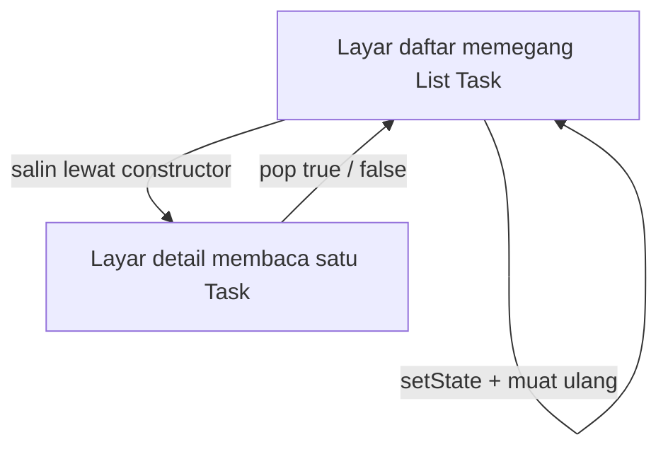
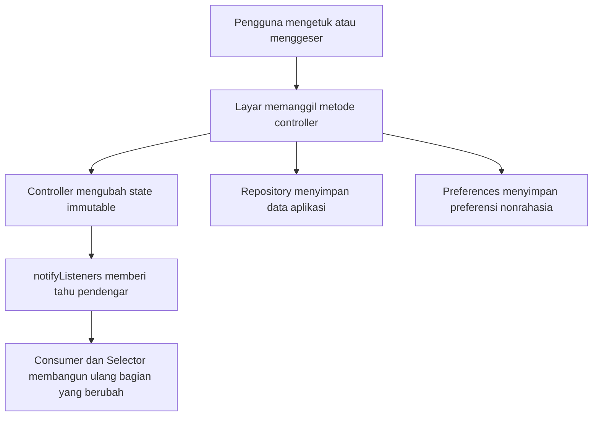

## Tujuan Pembelajaran

Bab 6 menutup dengan dua masalah yang selama ini disembunyikan kesederhanaan `setState`: state yang sama dipakai banyak layar, dan data yang hilang setiap aplikasi dimatikan. Bab ini mengurus keduanya, tetapi sebagai dua pekerjaan berbeda yang sering keliru dicampur jadi satu.

Pekerjaan pertama soal **siapa memegang state**. Selama ini setiap layar memiliki salinan datanya sendiri dan menyinkronkannya lewat `setState` plus parameter hasil navigasi. Solusinya: angkat state keluar widget tree ke class `ChangeNotifier`, lalu hubungkan ke UI dengan paket `provider`. Pekerjaan kedua soal **bagaimana preferensi bertahan** antar-restart. Solusinya: tulis preferensi tampilan sebagai pasangan kunci-nilai kecil lewat `SharedPreferencesAsync`. Dua solusi ini sering disatukan dalam satu tutorial, provider menyimpan, preferences menyimpan, selesai, padahal keduanya menjawab pertanyaan yang berbeda dan punya batas yang berbeda.

Setelah menyelesaikan bab ini, Anda bisa:

1. Membedakan state lokal dan app state, beserta kapan `setState` memang sudah cukup.
2. Membangun `ChangeNotifier` sebagai satu sumber kebenaran dengan update immutable dan repository yang disuntikkan lewat constructor.
3. Menghubungkan state ke widget tree dengan `ChangeNotifierProvider`, dan memilih antara `Consumer`, `context.watch`, dan `context.read` sesuai kebutuhan.
4. Mempersempit wilayah rebuild dengan `Selector`.
5. Menyimpan preferensi nonrahasia dengan `SharedPreferencesAsync`, bukan API lawas `SharedPreferences.getInstance()`, dan mengujinya tanpa perangkat.
6. Menjaga batas penyimpanan: preferences bukan database, dan bukan tempat token maupun password.

Ini juga bab pertama di mana Tracker memakai paket pihak ketiga, janji bab 4 ditepati: paket ditambahkan tepat pada bab yang mengimplementasikan fiturnya.

## State Lokal atau App State

Sebelum menambah alat, pastikan masalahnya memang ada. `setState` bukan teknologi yang harus dihindari; ia adalah alat yang tepat untuk pekerjaan tertentu.

**State lokal** hidup di dalam satu widget dan tidak dibaca siapa pun di luarnya: nilai field form, indeks tab yang aktif, teks yang sedang diketik, status animasi. Pemiliknya jelas (State widget itu), umurnya jelas (seumur widget), dan tidak ada pihak lain yang perlu diberi tahu saat nilainya berubah. Seluruh bab 6 bekerja dengan state lokal, controller dan focus node milik form adalah urusan dalam negeri layar itu.

**App state** dipakai bersama oleh bagian-bagian aplikasi yang tidak saling mengenal: daftar tugas yang dibaca layar daftar, penghitung di bilah bawah, dan potongan layar detail. Di sinilah `setState` mulai menimbulkan masalah nyata, dan masalahnya bukan sintaks melainkan kepemilikan data.

Perhatikan apa yang sebenarnya terjadi di Tracker sampai bab 6:



Layar daftar memegang daftar, menyalin satu tugas ke layar detail lewat constructor, lalu detail melaporkan kembali hasil interaksinya lewat nilai balik `Navigator.pop`, kontrak pop-bool yang dibangun di bab 3. Pola ini jujur dan bekerja, tetapi perhatikan harga yang dibayarnya: setiap layar baru yang butuh data yang sama butuh salinan dan protokol pelaporannya sendiri. Dua salinan data berarti dua tempat yang bisa tidak sinkron; setiap protokol pelaporan adalah satu kontrak yang harus dijaga. Aplikasi tiga layar masih tertangani. Sepuluh layar, dengan lima jenis perubahan data, tidak lagi.

Solusinya strukturnya sederhana diucapkan: pindahkan kepemilikan data ke satu tempat di luar semua layar, beri tahu siapa pun yang peduli saat data berubah, dan biarkan layar menjadi pembaca murni. Flutter menyediakan mekanisme penyebaran data ke bawah widget tree sejak lama: `InheritedWidget`, widget yang bisa ditemukan lewat `context` oleh semua keturunannya, dan itulah fondasi yang dipakai `Theme.of(context)` sejak bab 5. Yang tidak disediakan adalah mekanisme pemberitahuan yang nyaman: `InheritedWidget` menyebarkan data, tetapi mendeteksi perubahan dan membangun ulang pendengar tetap pekerjaan manual. Paket `provider` mengisi kekosongan itu dengan menggabungkan `InheritedWidget` (penyebaran) dan `ChangeNotifier` (pemberitahuan) menjadi satu pola yang bisa ditulis dalam hitungan baris.

Buku ini memakai `provider` sebagai satu-satunya pustaka state management inti. Riverpod dan BLoC adalah arah pengembangan yang sah setelahnya, keduanya menyelesaikan masalah yang lebih besar (dependency graph, event streaming), tetapi keduanya dibangun di atas keputusan yang sama: state terpusat, perubahan diberitahukan, UI bereaksi. Kuasai polanya di sini; bagian "Arah Setelah Provider" di akhir bab ini menunjukkan controller yang sama ditulis ulang dalam keduanya, supaya Anda bisa menilai sendiri apa yang Anda dapat dan apa yang Anda bayar.

## Checkpoint 1: ChangeNotifier dan Provider

**Target:** state daftar tugas pindah dari `_TaskListScreenState` ke `TaskListController`; layar menjadi stateless; data tetap sama.
**Waktu:** sekitar 60 menit.

### Paket pertama

```yaml
dependencies:
  flutter:
    sdk: flutter
  provider: ^6.1.2
```

Jalankan `flutter pub get`. Sampai titik ini Tracker membuktikan bahwa aplikasi utuh bisa hidup tanpa satu pun paket pihak ketiga; mulai sekarang tiap paket harus membayar "biaya sewa"-nya, alasan keberadaan yang bisa dipertanggungjawabkan di `pubspec.yaml`.

### State layar sebagai sealed class

State daftar tugas selalu berada di salah satu dari tiga kondisi: sedang dimuat, siap menampilkan data, atau gagal dimuat. Bab 2 sudah menutup kemungkinan kombinasi flag yang kacau dengan sealed class, sekarang strukturnya dipakai sungguhan. Simpan sebagai `lib/state/task_list_state.dart`:

```dart
import '../models/task.dart';

/// State layar daftar tugas (kanonik bab 2): sealed class menutup
/// kemungkinan kombinasi flag boolean yang tidak masuk akal
/// (misalnya loading == true sekaligus error != null).
sealed class TaskListState {}

final class TaskListLoading extends TaskListState {}

final class TaskListReady extends TaskListState {
  TaskListReady(this.tasks);

  final List<Task> tasks;
}

final class TaskListError extends TaskListState {
  TaskListError(this.message);

  final String message;
}
```

### Pemilik state: TaskListController

Class pemilik state, sebut saja controller, adalah `ChangeNotifier` biasa dari `flutter/foundation.dart`; ia tidak mengenal widget sama sekali, dan justru itu intinya. Simpan sebagai `lib/state/task_list_controller.dart`:

```dart
import 'package:flutter/foundation.dart';

import '../models/task.dart';
import '../models/task_repository.dart';
import 'task_list_state.dart';

/// Pemilik state daftar tugas (bab 7): satu sumber kebenaran di luar
/// widget tree. Repository disuntikkan lewat constructor sehingga
/// implementasinya bisa ditukar (memori, SQLite bab 8, API bab 9)
/// tanpa menyentuh class ini: dan pengujian memakai repository palsu.
class TaskListController extends ChangeNotifier {
  TaskListController({required this.repository});

  final TaskRepository repository;

  TaskListState _state = TaskListLoading();

  TaskListState get state => _state;

  /// Tugas terkini; list kosong selama belum siap.
  List<Task> get tasks => switch (_state) {
    TaskListReady(:final tasks) => tasks,
    _ => const [],
  };

  int get pendingCount => splitPending(tasks).length;

  /// Memuat ulang dari repository. State awal sudah TaskListLoading,
  /// sehingga pemuatan ulang berikutnya tidak mengedipkan spinner.
  Future<void> load() async {
    try {
      final tasks = await repository.all();
      _state = TaskListReady(tasks);
    } catch (e) {
      _state = TaskListError('Gagal memuat tugas: $e');
    }
    notifyListeners();
  }

  /// Update immutable: salinan baru lewat copyWith (sentinel bab 2),
  /// bukan mengubah field objek lama yang mungkin masih dipakai UI.
  Future<void> toggle(Task task) => save(task.copyWith(done: !task.done));

  Future<void> save(Task task) async {
    await repository.save(task);
    await load();
  }

  Future<void> delete(String id) async {
    await repository.delete(id);
    await load();
  }
}
```

Empat keputusan membentuk class ini:

**Repository masuk lewat constructor.** Ini dependency injection versi paling sederhana, tanpa framework, tanpa container: konstruksi di atas, konsumsi di bawah. Konsekuensinya besar persis seperti dijanjikan bab 2: implementasi bisa ditukar tanpa menyentuh controller, dan pengujian menyuntikkan repository palsu. Nanti di bab 8, `MemoryTaskRepository` diganti `SqliteTaskRepository`; baris controller ini tidak berubah.

**State privat, dibaca lewat getter.** `_state` tidak bisa diubah dari luar; satu-satunya jalan mengubahnya adalah memanggil metode `load`, `save`, `toggle`, `delete`, yang berarti setiap perubahan lewat pintu yang sama dan berakhir di `notifyListeners()`.

**Update immutable.** `toggle` tidak menulis `task.done = true`; ia memanggil `copyWith(done: !task.done)` yang mengembalikan objek baru, meninggalkan objek lama utuh. Objek lama mungkin sedang dipakai frame animasi atau dibandingkan oleh widget lain; mutasi diam-diam adalah sumber bug yang paling sulit dilacak.

**Sealed state, bukan flag.** `load()` menangani keberhasilan dan kegagalan di satu tempat; tidak ada kemungkinan state `loading == true` sekaligus `error != null`.

### Menyambungkan ke widget tree

Controller hanyalah class biasa, ia tidak otomatis bisa dijangkau widget. Provider menyambungkannya. Di `main.dart`, bungkus aplikasi:

```dart
ChangeNotifierProvider(
  create: (_) {
    final repo = MemoryTaskRepository();
    final controller = TaskListController(repository: repo);
    _bootstrap(controller, seed: repository == null);
    return controller;
  },
),
```

`ChangeNotifierProvider` membuat satu instance controller saat pertama dibutuhkan, menyimpannya sebagai `InheritedWidget` di puncak tree, dan, penting, memanggil `controller.dispose()` saat aplikasi ditutup. Callback `create` dijalankan sekali dan malas: instance baru dibuat hanya saat ada widget yang pertama kali membaca provider. Pemuatan awal data dimulai di sini sebagai fire-and-forget; sementara itu UI menampilkan `TaskListLoading`.

Versi penuh `main.dart` (dengan settings yang datang di Checkpoint 2) memakai `MultiProvider` untuk dua controller sekaligus, lihat kode di bagian tersebut.

### Layar menjadi pembaca

Layar daftar kehilangan seluruh state lokalnya: tidak ada `initState`, tidak ada `_tasks`, tidak ada `_load`. Ia menjadi `StatelessWidget` yang menerjemahkan state menjadi tampilan dan event menjadi panggilan controller:

```dart
body: FadeIn(
  child: Consumer<TaskListController>(
    builder: (context, controller, _) {
      return switch (controller.state) {
        TaskListLoading() => const Center(
          child: CircularProgressIndicator(),
        ),
        TaskListError(:final message) => _ErrorPane(
          message: message,
          onRetry: controller.load,
        ),
        TaskListReady(:final tasks) =>
          tasks.isEmpty
              ? const _EmptyPane()
              : LayoutBuilder(
                  builder: (context, constraints) {
                    final horizontal = constraints.maxWidth < 600
                        ? 12.0
                        : 48.0;
                    return ListView.builder(
                      padding: EdgeInsets.symmetric(
                        horizontal: horizontal,
                        vertical: 12,
                      ),
                      itemCount: tasks.length,
                      itemBuilder: (context, index) =>
                          _DismissibleCard(task: tasks[index]),
                    );
                  },
                ),
      };
    },
  ),
),
```

`switch` atas sealed class memaksa setiap kondisi ditangani: memuat, gagal, siap. Compiler yang menjaga kelengkapan; menambah kondisi `TaskListEmpty` kelak berarti menambah satu subclass dan memperbaiki semua `switch` yang belum siap, bukan menunggu bug muncul di depan pengguna. Layout adaptif, `FadeIn`, dan `Dismissible` dari bab-bab lama tetap bekerja tanpa perubahan: mereka tidak peduli dari mana data datang.

Aksi di layar yang sama kini satu kalimat:

```dart
child: TaskCard(
  task: task,
  onToggle: (_) => context.read<TaskListController>().toggle(task),
  onTap: () => _openDetail(context),
),
```

`context.read<T>()` mengambil controller tanpa mendengarkan, tepat untuk aksi, karena menekan tombol tidak butuh rebuild. Layar detail tetap mempertahankan kontrak pop-bool dari bab 3 (detail adalah presentasi murni); hasilnya diterjemahkan layar daftar menjadi `toggle`. Layar form tambah tugas juga tidak lagi menerima repository lewat constructor: ia memanggil `context.read<TaskListController>().save(task)` lalu `pop`, dan daftar ikut ter-update tanpa protokol apa pun, karena keduanya mendengar sumber yang sama.

**Validasi checkpoint:**

- `flutter analyze` bersih.
- Semua perilaku bab 6 tetap: centang mengubah penghitung, geser menghapus dengan konfirmasi, form memvalidasi, detail menampilkan tenggat.
- Sambungkan breakpoint di `TaskListController.toggle`, perhatikan tumpukan pemanggilnya kini layar, bukan State.
- Ganti `MemoryTaskRepository` dengan implementasi yang selalu gagal (di proyek gate: `_FailingRepository`): layar menampilkan panel error dengan tombol coba lagi, bukan layar kosong atau crash.

## Mendengar Secara Granular

Setiap `notifyListeners()` membangun ulang semua pendengar. Pendengar yang bodoh adalah widget yang membaca lebih dari yang dibutuhkan. Empat mode akses menentukan seberapa sempit wilayah rebuild:

| Mode Akses                           | Kapan dipakai                                      | Efek rebuild                          |
| ------------------------------------ | -------------------------------------------------- | ------------------------------------- |
| `Consumer<T>` / `context.watch<T>()` | Membangun subtree dari data provider               | Subtree di bawahnya setiap notifikasi |
| `context.read<T>()`                  | Aksi: memanggil metode, tidak butuh nilai terbaru  | Tidak ada                             |
| `Selector<T, R>`                     | Hanya butuh sebagian data (`R`) dari provider      | Hanya saat nilai `R` berubah          |
| `context.select<T, R>`               | Sama seperti Selector, dalam satu baris di `build` | Hanya saat nilai `R` berubah          |

Penghitung tugas di bilah bawah adalah contoh pas untuk `Selector`: ia hanya peduli jumlah tugas yang belum selesai, bukan seluruh daftar:

```dart
child: Selector<TaskListController, int>(
  selector: (_, controller) => controller.pendingCount,
  builder: (context, pending, _) {
    return AnimatedSwitcher(
      duration: const Duration(milliseconds: 250),
      child: Text(
        '$pending tugas belum selesai',
        key: ValueKey(pending),
      ),
    );
  },
),
```

Saat pengguna mengubah judul satu tugas, `pendingCount` tidak berubah, penghitung tidak dibangun ulang, animasi tidak menyala. Saat satu tugas dituntaskan, hanya bilah bawah yang rebuild. Prinsipnya sama dengan memilih parameter widget secermat di bab 6: granularitas pendengaran adalah API performance Anda.

Dua aturan praktis penutup:

**`read` hanya untuk aksi; `watch` hanya di `build`.** `context.read` di dalam callback `onPressed` benar; `context.watch` di dalam callback itu salah, callback tidak punya siklus hidup build. Sebaliknya `context.read` di `build` untuk menampilkan nilai hampir selalu salah: nilai itu tidak akan pernah diperbarui.

**Gunakan context yang tepat.** Dialog dan route baru punya context sendiri; provider dicari ke atas dari context itu. Bila `ProviderNotFoundException` muncul, penyebabnya hampir selalu satu dari dua: provider dipasang terlalu rendah di tree (di bawah layar yang membacanya), atau pembacaan memakai context dialog padahal provider berada di atas layar pemanggil. Aturannya: untuk aksi dari dalam dialog, simpan referensi controller dari context layar sebelum membuka dialog.

## Checkpoint 2: Preferensi Tersimpan dengan SharedPreferencesAsync

**Target:** pilihan tema pengguna bertahan setelah aplikasi dimatikan.
**Waktu:** sekitar 40 menit.

### Apa yang disimpan, apa yang tidak

Preferences adalah penyimpanan pasangan kunci-nilai kecil yang dikelola sistem operasi: XML di Android, plist di iOS. Karakteristiknya menentukan segalanya, kecil, datar, tanpa query, tanpa relasi, dan dapat dibaca siapa pun yang bisa membaca file aplikasi. Maka hukumnya:

**Boleh:** mode tema, bahasa, urutan sortir default, flag "sudah lihat pengantar", preferensi tampilan. Kuncinya: nilai kecil, bentuk sederhana, tidak berbentuk rahasia, dan aplikasi tetap wajar saat nilainya hilang.

**Tidak boleh:** daftar tugas (itu data aplikasi, pekerjaan SQLite di bab 8 dan 10), apa pun yang berbentuk token, password, atau kunci (itu pekerjaan penyimpanan aman seperti `flutter_secure_storage`, disinggung di bab 9), dan data yang butuh query atau bertambah terus. Satu varian khusus yang perlu disebut tegas: boolean `isLogin` di preferences bukan autentikasi. Menyimpan status "sudah login" sebagai boolean hanya berarti menyimpan jawaban yang diinginkan, bukan membuktikan apa pun, siapa pun yang bisa mengedit file preferences bisa mengedit boolean itu. Autentikasi menyimpan token di tempat aman dan memvalidasi ulang ke server; itu bab 9.

### API modern

Tutorial lama hampir semuanya memulai dengan `SharedPreferences.getInstance()`, API yang memuat seluruh preferences ke satu singleton ter-cache di memori, lalu membacanya secara sinkron. API itu masih ada demi kode lawas, tetapi untuk kode baru rekomendasinya `SharedPreferencesAsync`: setiap operasi `async`, tanpa cache global, tanpa inisialisasi yang harus ditunggu sebelum `runApp`. Perbedaannya terasa justru di luar kode, `getInstance` menyulitkan pengujian (singleton harus di-reset) dan memaksa pilihan "muat semua sekarang"; `SharedPreferencesAsync` menyuntikkan bersih lewat constructor dan bisa diganti store dalam memori saat pengujian.

Tambahkan dependensinya:

```yaml
dependencies:
  shared_preferences: ^2.5.0
```

### SettingsController

Pemilik preferensi adalah controller kedua, pola yang sama seperti `TaskListController`, karena masalahnya memang sejenis: satu sumber kebenaran yang memberi tahu pendengarnya. Simpan sebagai `lib/state/settings_controller.dart`:

```dart
import 'package:flutter/material.dart';
import 'package:shared_preferences/shared_preferences.dart';

/// Pemilik preferensi tampilan (bab 7): mode tema disimpan sebagai
/// string kecil lewat SharedPreferencesAsync. Preferences hanya untuk
/// preferensi nonrahasia: bukan data aplikasi, bukan kredensial.
class SettingsController extends ChangeNotifier {
  SettingsController({SharedPreferencesAsync? preferences})
    : _preferences = preferences ?? SharedPreferencesAsync();

  static const _themeModeKey = 'themeMode';

  final SharedPreferencesAsync _preferences;

  ThemeMode _themeMode = ThemeMode.system;

  ThemeMode get themeMode => _themeMode;

  Future<void> load() async {
    final stored = await _preferences.getString(_themeModeKey);
    if (stored == null) return;
    final mode = ThemeMode.values.asNameMap()[stored];
    if (mode != null && mode != _themeMode) {
      _themeMode = mode;
      notifyListeners();
    }
  }

  Future<void> setThemeMode(ThemeMode mode) async {
    if (mode == _themeMode) return;
    _themeMode = mode;
    notifyListeners();
    await _preferences.setString(_themeModeKey, mode.name);
  }
}
```

Detail-detail kecilnya sengaja dipilih dan masing-masing berdiri atas alasan:

**`SharedPreferencesAsync` disuntikkan sebagai parameter opsional.** Produksi memakai default; pengujian menyuntikkan instance dengan store dalam memori. Sama seperti repository di Checkpoint 1, satu pola dependency injection untuk semuanya.

**Nilai disimpan sebagai nama enum.** `mode.name` menghasilkan `'system'`, `'light'`, atau `'dark'`, string pendek yang stabil dan terbaca manusia. Nomor indeks (`mode.index`) juga bisa, tetapi menyusun ulang enum diam-diam mengubah makna data tersimpan; nama tidak.

**Pembacaan balik bersifat defensif.** `ThemeMode.values.asNameMap()[stored]` mengembalikan `null` untuk nilai tak dikenal, misalnya file preferences dari versi aplikasi yang lebih lama. Controller diam-diam kembali ke `system`. Data kecil yang rusak seharusnya dilupakan, bukan meruntuhkan aplikasi.

**UI diberi tahu sebelum disk.** `setThemeMode` memanggil `notifyListeners()` lebih dulu, `setString` belakangan: tema berganti seketika, penulisan ke disk menyusul. Urutan ini mengutamakan responsivitas; penulisan preferences yang gagal hanya berarti preferensi tidak tersimpan, bukan aplikasi macet.

### Merangkai ke MaterialApp

`main.dart` final memasang kedua controller sekaligus:

```dart
class TrackerApp extends StatelessWidget {
  const TrackerApp({super.key, this.repository, this.preferences});

  /// Suntikan implementasi lain untuk pengujian; produksi memakai
  /// default di bawah (dependency injection sederhana: konstruksi di
  /// atas, konsumsi di bawah, kontrak tidak berubah).
  final TaskRepository? repository;
  final SharedPreferencesAsync? preferences;

  @override
  Widget build(BuildContext context) {
    return MultiProvider(
      providers: [
        ChangeNotifierProvider(
          create: (_) {
            final repo = repository ?? MemoryTaskRepository();
            final controller = TaskListController(repository: repo);
            // Fire-and-forget: UI menangani TaskListLoading sambil
            // data dimuat.
            _bootstrap(controller, seed: repository == null);
            return controller;
          },
        ),
        ChangeNotifierProvider(
          create: (_) => SettingsController(preferences: preferences)..load(),
        ),
      ],
      child: Consumer<SettingsController>(
        builder: (context, settings, _) {
          return MaterialApp(
            title: 'Task Tracker Gate',
            theme: TrackerTheme.light(),
            darkTheme: TrackerTheme.dark(),
            themeMode: settings.themeMode,
            home: const TaskListScreen(),
          );
        },
      ),
    );
  }
```

Tiga hal bekerja bersama: `darkTheme` versi gelap dari tema bab 5 (benih warna yang sama, `brightness` ditukar), `themeMode` dari controller sebagai pemilih tiga kondisi, dan `Consumer` yang membangun ulang `MaterialApp` hanya saat tema berubah. Tombol pemilihnya di AppBar layar daftar, `PopupMenuButton` dengan tiga pilihan:

```dart
return PopupMenuButton<ThemeMode>(
  tooltip: 'Pilih tema',
  initialValue: context.watch<SettingsController>().themeMode,
  onSelected: (mode) =>
      context.read<SettingsController>().setThemeMode(mode),
  icon: const Icon(Icons.brightness_6_outlined),
  itemBuilder: (context) => [
    for (final mode in ThemeMode.values)
      PopupMenuItem(
        value: mode,
        child: Row(
          children: [
            Icon(_icons[mode]),
            const SizedBox(width: 8),
            Text(_labels[mode]!),
          ],
        ),
      ),
  ],
);
```

Perhatikan pembagian tugas `watch` dan `read` di satu widget yang sama: `watch` untuk `initialValue` (nilai yang ditandai saat menu dibuka, tampilan), `read` di `onSelected` (aksi). Satu baris pemisahan yang menjadi refleks akan menghindarkan banyak rebuild sia-sia.

**Validasi checkpoint:**

- Pilih "Gelap", matikan aplikasi sepenuhnya, jalankan lagi: tema tetap gelap.
- Hapus aplikasi (bukan sekadar menutup): kembali ke "Sistem", file preferences ikut terhapus bersama aplikasi.
- Di pengujian (proyek gate): `SharedPreferencesAsyncPlatform.instance = InMemorySharedPreferencesAsync.empty()` sebelum membangun aplikasi; pilih tema; `getString('themeMode')` pada store menunjukkan `'dark'`. Store dalam memori ini pula yang dipakai unit test `SettingsController` tanpa perangkat sama sekali.

## Arah Setelah Provider

Provider bukan akhir, dan bukan pula batu loncatan yang harus ditinggalkan. Ia adalah pilihan yang tepat untuk aplikasi seukuran Tracker, dan tetap tepat untuk banyak aplikasi yang jauh lebih besar. Tetapi Anda akan bertemu Riverpod dan BLoC di lowongan kerja, di kode warisan, dan di perdebatan yang tidak pernah selesai di internet. Bagian ini menulis ulang `TaskListController` yang sama dalam keduanya, supaya perbandingannya dilakukan atas dasar kode, bukan atas dasar selera.

Aturan mainnya: fitur yang dibandingkan identik, jadi yang tersisa untuk dilihat hanyalah bentuknya.

### Riverpod: provider sebagai grafik, bukan sebagai widget

Keluhan paling sah terhadap `provider` adalah ketergantungannya pada `BuildContext`. Controller hanya bisa dijangkau dari tempat yang punya `context`, dan salah menaruh `Provider.of` di atas widget penyedianya menghasilkan error yang baru ketahuan saat dijalankan. Riverpod memindahkan penyediaan keluar dari widget tree: provider menjadi variabel global, dan siapa yang butuh tinggal membacanya.

```dart
// lib/state/task_list_provider.dart
import 'package:flutter_riverpod/flutter_riverpod.dart';

import '../models/task.dart';
import '../models/task_repository.dart';

/// Repository diisi saat aplikasi dirakit (override di ProviderScope),
/// atau ditukar repository palsu di pengujian.
final taskRepositoryProvider = Provider<TaskRepository>(
  (ref) => throw UnimplementedError('override di ProviderScope'),
);

final taskListProvider =
    AsyncNotifierProvider<TaskListNotifier, List<Task>>(TaskListNotifier.new);

class TaskListNotifier extends AsyncNotifier<List<Task>> {
  @override
  Future<List<Task>> build() => ref.watch(taskRepositoryProvider).all();

  Future<void> toggle(Task task) => save(task.copyWith(done: !task.done));

  Future<void> save(Task task) async {
    final repository = ref.read(taskRepositoryProvider);
    state = const AsyncLoading();
    state = await AsyncValue.guard(() async {
      await repository.save(task);
      return repository.all();
    });
  }
}
```

Di layar:

```dart
ref.watch(taskListProvider).when(
  loading: () => const Center(child: CircularProgressIndicator()),
  error: (e, _) => Center(child: Text('Gagal memuat tugas: $e')),
  data: (tasks) => TaskListView(tasks: tasks),
);
```

Perhatikan apa yang **hilang** dari versi ini: `TaskListState`, `TaskListLoading`, `TaskListReady`, `TaskListError`, seluruh berkas `task_list_state.dart`, dan `notifyListeners()`. `AsyncValue` bawaan Riverpod sudah merupakan sealed class dengan tiga kemungkinan yang persis sama, dan `AsyncValue.guard` sudah membungkus try-catch yang kita tulis manual. Sealed class yang kita bangun sendiri di Checkpoint 1 bukan pekerjaan sia-sia, justru sebaliknya: karena Anda pernah menulisnya, Anda tahu apa yang sebenarnya diberikan `AsyncValue`, alih-alih menerimanya sebagai sihir.

Yang Anda bayar: satu paket besar dengan kosakata sendiri (`ref`, `watch`, `read`, `ProviderScope`, `AsyncValue`, keluarga `Notifier`), dan provider global yang membuat "siapa memiliki apa" menjadi kurang kasatmata dibanding `MultiProvider` yang berdiri terang-terangan di `main.dart`.

### BLoC: perubahan sebagai peristiwa yang bisa dicatat

BLoC menolak gagasan bahwa UI memanggil metode. UI mengirim **peristiwa**, BLoC memancarkan **state**, dan tidak ada jalan lain di antara keduanya.

```dart
// lib/state/task_list_bloc.dart
import 'package:flutter_bloc/flutter_bloc.dart';

import '../models/task.dart';
import '../models/task_repository.dart';
import 'task_list_state.dart';

sealed class TaskListEvent {}

final class LoadRequested extends TaskListEvent {}

final class TaskToggled extends TaskListEvent {
  TaskToggled(this.task);

  final Task task;
}

class TaskListBloc extends Bloc<TaskListEvent, TaskListState> {
  TaskListBloc(this.repository) : super(TaskListLoading()) {
    on<LoadRequested>(_onLoadRequested);
    on<TaskToggled>(_onTaskToggled);
  }

  final TaskRepository repository;

  Future<void> _onLoadRequested(
    LoadRequested event,
    Emitter<TaskListState> emit,
  ) async {
    try {
      emit(TaskListReady(await repository.all()));
    } catch (e) {
      emit(TaskListError('Gagal memuat tugas: $e'));
    }
  }

  Future<void> _onTaskToggled(
    TaskToggled event,
    Emitter<TaskListState> emit,
  ) async {
    await repository.save(event.task.copyWith(done: !event.task.done));
    emit(TaskListReady(await repository.all()));
  }
}
```

Di layar, `context.read<TaskListBloc>().add(TaskToggled(task))` menggantikan pemanggilan metode, dan `BlocBuilder<TaskListBloc, TaskListState>` menggantikan `Consumer`.

`TaskListState` bab ini dipakai apa adanya, tanpa satu baris pun berubah. Itu bukan kebetulan: sealed class state memang bentuk yang dituju BLoC, dan inilah bukti paling jelas bahwa keputusan di Checkpoint 1 sudah benar sejak awal.

Yang Anda dapat: setiap perubahan state punya nama dan sebab yang terekam. Ketika ada laporan bug "datanya tiba-tiba kosong", Anda bisa mencatat urutan peristiwa dan memutarnya ulang. Provider tidak bisa melakukan itu, karena pada Provider penyebab perubahan adalah pemanggilan metode yang tidak meninggalkan jejak.

Yang Anda bayar: satu class event untuk setiap hal yang bisa dilakukan pengguna. Tracker punya empat aksi, maka empat class. Aplikasi dengan tiga puluh aksi punya tiga puluh class, dan sebagian besar hanya membungkus satu argumen.

### Perbandingan

| | Provider | Riverpod | BLoC |
|---|---|---|---|
| Baris untuk fitur yang sama | paling sedikit | sedikit, sebagian digantikan bawaan | paling banyak |
| Ketergantungan `BuildContext` | ya | tidak | ya, untuk mengirim peristiwa |
| Salah pakai ketahuan saat | dijalankan | dikompilasi | dikompilasi |
| Riwayat perubahan | tidak ada | tidak ada | ada, itu intinya |
| Pengujian | suntik lewat constructor | override provider | kirim event, periksa urutan state |
| Kosakata baru yang harus dipelajari | sedikit | banyak | sedang |
| Cocok saat | state sedikit, kepemilikan jelas | banyak state saling bergantung | perubahan perlu dilacak atau dibatalkan |

### Kapan Berpindah

Jangan berpindah karena sebuah pustaka sedang populer. Berpindahlah ketika Anda menemui salah satu dari tiga tanda ini, dan tuliskan tandanya di catatan keputusan arsitektur Anda:

1. **Beberapa bagian state saling bergantung**, dan Anda mulai memanggil `notifyListeners()` dari satu controller agar controller lain ikut menyesuaikan. Riverpod memang dibangun untuk ketergantungan semacam ini; `ProxyProvider` bisa, tetapi terasa seperti memaksa.
2. **Anda perlu tahu kenapa state berubah**, bukan sekadar bahwa ia berubah: fitur batal-ulangi, jejak audit, atau bug yang hanya muncul pada urutan tindakan tertentu. Ini wilayah BLoC.
3. **Tim Anda membesar** dan setiap orang meletakkan state di tempat yang berbeda. Kerangka yang lebih kaku membeli keseragaman dengan harga sedikit boilerplate, dan pada tim besar itu pertukaran yang menguntungkan.

Kalau tidak satu pun dari ketiganya berlaku, Provider yang Anda tulis di bab ini sudah merupakan jawaban yang benar. Berpindah tanpa alasan hanya memindahkan kerumitan dari kepala Anda ke dalam `pubspec.yaml`.

### Satu Hal yang Tidak Diselesaikan Ketiganya

Tidak ada satu pun dari ketiga pustaka ini yang menyelamatkan state Anda ketika sistem operasi mematikan proses aplikasi di latar belakang, lalu pengguna kembali dan mengira aplikasinya masih terbuka. State di memori lenyap bersama proses, apa pun pustakanya.

Yang menyelamatkannya adalah penyimpanan, dan itu topik Checkpoint 2 bab ini serta bab 8: apa pun yang tidak boleh hilang harus ditulis ke suatu tempat sebelum aplikasi kehilangan kesempatan. Pertanyaan yang benar bukan "pustaka mana yang menjaga state saya", melainkan "bagian mana dari state saya yang tidak boleh hilang".

## Batas Penyimpanan: Tiga Tempat yang Berbeda

Satu kesalahan paling umum seputar penyimpanan lokal adalah memakai satu alat untuk semua pekerjaan. Tiga alat dalam buku ini punya wilayah masing-masing:

| Alat                     | Bentuk data                     | Contoh sah                                | Bukan untuk                          |
| ------------------------ | ------------------------------- | ----------------------------------------- | ------------------------------------ |
| `SharedPreferencesAsync` | Kunci-nilai kecil, nonrahasia   | Mode tema, urutan sortir, flag onboarding | Daftar tugas, token, data relasional |
| SQLite (bab 8 dan 10)    | Data terstruktur, bisa di-query | Daftar tugas, jadwal, relasi antar-tabel  | Preferensi satu nilai, kredensial    |
| Penyimpanan aman (bab 9) | Rahasia kecil                   | Token akses, refresh token                | Data yang butuh dibaca kode biasa    |

Uji cepatnya dua pertanyaan: **apakah ini rahasia?**, kalau ya, bukan preferences dan bukan SQLite polos. **Apakah ini koleksi yang tumbuh?**, kalau ya, bukan preferences. Daftar tugas yang "cuma lima item" hari ini adalah lima ratus item semester depan; memindahkannya dari preferences ke database di kemudian hari jauh lebih mahal daripada menaruhnya di tempat yang benar sejak awal. Bab 8 memulai pekerjaan itu.

## Alur Data Lengkap

Dengan kedua controller terpasang, alur lengkap Tracker kini begini:



Dua jalur keluar dari controller: pemberitahuan ke UI (kanan atas) dan penulisan ke penyimpanan (bawah). Keduanya terpisah dan tetap terpisah, mengganti repository dari memori ke SQLite di bab 8 tidak menyentuh satu baris UI; mengganti tema tidak menyentuh daftar tugas. Struktur berlapis yang dijanjikan sejak bab 2 kini terlihat utuh: model domain di dasar, repository dan controller sebagai lapisan tengah, widget sebagai pembaca tipis di puncak.

## Ringkasan

- `setState` tepat untuk state lokal satu widget; app state yang dipakai banyak layar butuh satu pemilik di luar widget tree.
- `ChangeNotifier` adalah pemilik state: field privat, getter publik, perubahan lewat metode yang berakhir di `notifyListeners()`, update immutable lewat `copyWith`.
- Repository dan preferences disuntikkan lewat constructor, dependency injection paling sederhana yang membuat controller bisa diuji dan implementasinya bisa ditukar.
- Riverpod dan BLoC menyelesaikan masalah yang sama dengan bentuk berbeda: Riverpod melepas ketergantungan pada `BuildContext` dan menyediakan `AsyncValue` sebagai pengganti sealed state buatan sendiri; BLoC menukar boilerplate event dengan riwayat perubahan yang bisa dilacak. Berpindah hanya bila salah satu dari tiga tandanya muncul, bukan karena populer.
- `ChangeNotifierProvider` menyambungkan controller ke widget tree lewat `InheritedWidget`; `MultiProvider` untuk lebih dari satu.
- `Consumer`/`context.watch` untuk data, `context.read` untuk aksi, `Selector`/`context.select` untuk mempersempit rebuild; `watch` hanya di `build`, `read` hanya di aksi.
- `SharedPreferencesAsync` untuk preferensi nonrahasia: nilai kecil, string nama enum, pembacaan balik defensif, UI diberi tahu sebelum disk. `SharedPreferences.getInstance()` adalah API lawas, bukan rekomendasi kode baru.
- Preferences bukan database (koleksi yang tumbuh → SQLite, bab 8) dan bukan brankas (rahasia → penyimpanan aman, bab 9). Boolean `isLogin` di preferences bukan autentikasi.
- Pengujian tanpa perangkat: store dalam memori (`InMemorySharedPreferencesAsync`) disuntikkan sebagai platform, repository palsu untuk kegagalan.

Tracker menutup bab ini dengan dua pemisahan yang sehat: state dari UI, dan persistence dari state. Yang masih mengganjal satu hal, setiap kali aplikasi dimulai ulang, daftar tugas kembali ke data contoh. Bab 8 mengurusnya: penyimpanan lokal sungguhan, mulai dari file sampai SQLite.

## Referensi Cepat

Mode akses Provider dan efek rebuild-nya dirangkum pada tabel di bagian "Mendengar Secara Granular". Operasi preferences yang dipakai bab ini:

```dart
final prefs = SharedPreferencesAsync();

// Tulis
await prefs.setString('themeMode', 'dark');
await prefs.setBool('showIntro', false);

// Baca (null bila belum ada: sediakan jalur defensif)
final mode = await prefs.getString('themeMode');

// Hapus
await prefs.remove('themeMode');
```

Tipe yang didukung: `bool`, `int`, `double`, `String`, `List<String>`. Tipe lain (termasuk `DateTime` dan objek apa pun) harus diserialisasi dulu, dan bau serialisasi berulang adalah sinyal data itu seharusnya di database, bukan di preferences.

## Bekerja dengan AI di Bab Ini

**Pantas didelegasikan:** menanyakan perbedaan `Consumer`, `Selector`, dan `context.select`, dan meminta pembanding pustaka pengelolaan state untuk kasus Anda.

**Tulis sendiri:** memutuskan di mana state Anda tinggal. Keputusan "state ini milik siapa" adalah inti bab ini dan inti arsitektur aplikasi Anda; AI tidak tahu bagian mana dari aplikasi Anda yang akan tumbuh. Bagian ini yang menentukan apakah bab ini benar-benar Anda kuasai.

**Latihan:** Minta AI memindahkan satu layar Anda dari `setState` ke Provider. Lalu periksa satu hal: apakah ada widget yang membangun ulang padahal datanya tidak berubah. Perbaiki cakupan pendengarnya sendiri. Pemindahan yang benar secara sintaks sering kali salah secara cakupan, dan hanya terlihat kalau Anda memeriksanya.

## Referensi Lanjutan

- Panduan resmi Flutter soal state management, termasuk kapan beralih dari `setState`: https://docs.flutter.dev/data-and-backend/state-mgmt/intro
- Dokumentasi paket `provider`, termasuk daftar lengkap varian provider: https://pub.dev/packages/provider
- `ChangeNotifier` dan `InheritedWidget` di API reference: https://api.flutter.dev/flutter/foundation/ChangeNotifier-class.html serta https://api.flutter.dev/flutter/widgets/InheritedWidget-class.html
- Dokumentasi `shared_preferences`, termasuk `SharedPreferencesAsync` dan `SharedPreferencesWithCache`: https://pub.dev/packages/shared_preferences
- `flutter_secure_storage` untuk rahasia kecil (dibaca saat dibutuhkan di bab 9): https://pub.dev/packages/flutter_secure_storage
- Aplikasi contoh resmi provider + settings: https://docs.flutter.dev/data-and-backend/state-mgmt/simple
