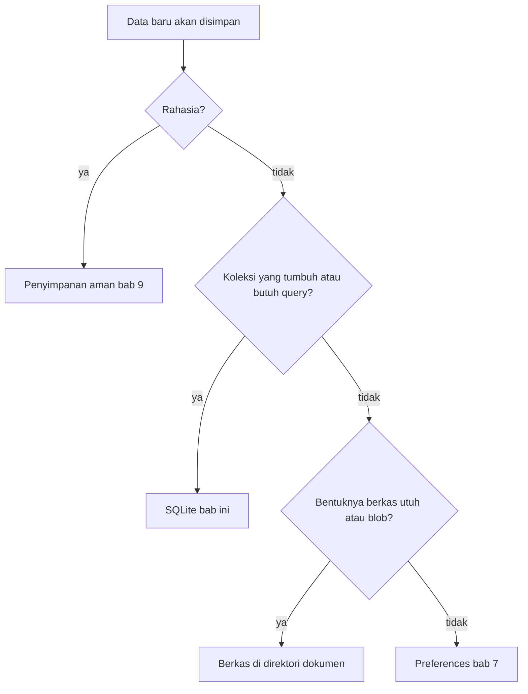
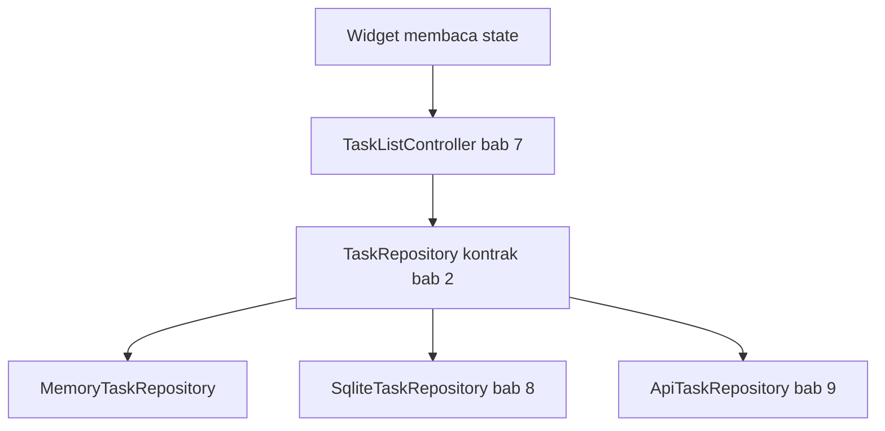

## Tujuan Pembelajaran

Bab 7 ditutup dengan satu kejanggalan yang sengaja dibiarkan: controller sudah rapi, preferensi tema sudah bertahan antar-restart, tetapi daftar tugas masih hidup di `MemoryTaskRepository`, setiap aplikasi dimatikan, semuanya kembali ke data contoh. Bab ini mengurusi pekerjaan yang tersisa, dan pekerjaannya ternyata lebih besar dari sekadar "ganti memori dengan database".

Ada dua keputusan yang harus diambil sebelum menulis satu baris SQL. Pertama: **jenis data menentukan tempat penyimpanannya**. Preferensi, berkas, penyimpanan aman, dan basis data relasional menyelesaikan masalah yang berbeda; memilih salah satunya untuk semua pekerjaan adalah cara paling pasti mendapat masalah. Kedua: **kode SQL tidak boleh merembes ke UI**. Kontrak `TaskRepository` dari bab 2 dan controller dari bab 7 sengaja dibangun supaya implementasi bisa ditukar; bab ini menepati janji itu dengan memenuhi kontrak lewat `SqliteTaskRepository`.

Setelah menyelesaikan bab ini, Anda bisa:

1. Menempatkan data baru di tempat yang benar lewat tiga pertanyaan sederhana: rahasia atau bukan, koleksi yang tumbuh atau nilai tunggal, blob atau data terstruktur.
2. Membangun service database SQLite dengan `sqflite`: satu koneksi, versi skema eksplisit, dan jalur migrasi dari versi lama.
3. Menulis query berparameter dengan `whereArgs` sehingga nilai data tidak pernah disisipkan langsung ke string SQL.
4. Memenuhi kontrak `TaskRepository` dengan `SqliteTaskRepository`, dan menukar implementasi di `main.dart` tanpa menyentuh satu baris controller.
5. Menjaga operasi multi-langkah dengan transaksi: seluruh baris masuk, atau tidak ada sama sekali.
6. Menguji pembuatan skema, migrasi versi, dan rollback transaksi tanpa perangkat, lewat `sqflite_common_ffi`.

Hasil akhirnya bukan hanya "tugas tersimpan". Hasil akhirnya adalah **data layer**: lapisan penyimpanan yang bisa dipakai ulang bab 10 untuk sinkronisasi offline-first dan bab 12 untuk fitur perangkat, tanpa mengubah kode di atasnya.

## Memilih Tempat Penyimpanan

Aplikasi mobile berjalan di dalam sandbox: setiap aplikasi punya direktori miliknya sendiri yang tidak terlihat aplikasi lain, dan di Android isi ikut terhapus bersama aplikasi. Semua alat di bab ini bekerja di dalam sandbox itu, yang membedakan adalah bentuk data yang mereka kelola dengan baik.

| Alat                        | Bentuk data                         | Contoh sah                                | Bukan untuk                                   |
| --------------------------- | ----------------------------------- | ----------------------------------------- | --------------------------------------------- |
| Preferences (bab 7)         | Kunci-nilai kecil, nonrahasia       | Mode tema, urutan sortir, flag onboarding | Daftar tugas, rahasia, data relasional        |
| Berkas di direktori dokumen | Byte utuh: teks, gambar, cadangan   | Ekspor JSON, foto profil, lampiran        | Data yang butuh query per field               |
| Penyimpanan aman (bab 9)    | Rahasia kecil                       | Token akses, refresh token                | Data yang harus dibaca kode biasa             |
| SQLite (bab ini dan 10)     | Baris-kolom terstruktur, relasional | Daftar tugas, jadwal, relasi antar-tabel  | Preferensi satu nilai, blob besar, kredensial |

Tabel di atas bisa dipadatkan menjadi tiga pertanyaan berurutan:



Pertanyaan pertama soal keamanan, bukan ukuran: token akses yang "cuma seratus byte" tetap milik penyimpanan aman, bukan preferences. Pertanyaan kedua soal arah pertumbuhan: koleksi yang bertambah dan perlu difilter, daftar tugas, riwayat, relasi, adalah wilayah basis data. Pertanyaan ketiga soal granularity: kalau kode tidak pernah membaca sebagian isi, dan data memang utuh sebagai satu berkas, maka berkas adalah representasi yang jujur.

Bab 7 sudah menutup jalur preferences. Bab ini membangun dua sisanya yang berpijak pada `dart:io` dan `sqflite`; penyimpanan aman menyusul di bab 9 bersama autentikasi, karena rahasia tanpa mekanisme memperolehnya hanya setengah cerita.

## Berkas: Kapan Cukup

Akses berkas di Flutter memakai `dart:io` seperti aplikasi Dart biasa, dengan satu pengecualian penting: jalur direktori dokumen tiap platform berbeda, dan menebaknya sendiri adalah sumber bug klasik. Paket `path_provider` menyediakan jawaban resminya:

```yaml
dependencies:
  path_provider: ^2.1.5
```

```dart
import 'dart:convert';
import 'dart:io';

import 'package:path/path.dart' as p;
import 'package:path_provider/path_provider.dart';

/// Ekspor seluruh daftar tugas ke satu berkas JSON di direktori
/// dokumen: bentuk paling sederhana dari cadangan manual.
Future<File> exportTasks(List<Map<String, dynamic>> rows) async {
  final dir = await getApplicationDocumentsDirectory();
  final file = File(p.join(dir.path, 'tracker-export.json'));
  return file.writeAsString(jsonEncode(rows));
}
```

Untuk Tracker, berkas menempati ceruk yang jujur: cadangan dan ekspor. Menyimpan daftar tugas sebagai satu berkas JSON berarti setiap perubahan menulis ulang seluruh isi, setiap pembacaan memuat semuanya, dan "tampilkan yang belum selesai saja" menjadi kerja manual memfilter di Dart. Selama datanya kecil dan hanya bergerak sebagai satu kesatuan, itu wajar. Begitu mulai ada filter, urutan, atau hubungan antar-entity, pekerjaan itu milik basis data, dan itulah alasan sisa bab ini pindah ke SQLite.

Satu catatan batas: `dart:io` tidak ada di web. Kode berkas di atas hanya untuk Android, iOS, macOS, Windows, dan Linux; aplikasi web menyimpan berkas lewat mekanisme unduhan browser. Batas platform yang sama berlaku pada `sqflite`, dibahas di bagian batas platform.

## Checkpoint 1: TaskDatabase: Membuka dan Memigrasi Skema

**Target:** database `tracker.db` terbuka dengan skema versi 2; instalasi baru dibuat lengkap, instalasi lama dimigrasi tanpa kehilangan data.
**Waktu:** sekitar 45 menit.

### Paket kedua dan ketiga

```yaml
dependencies:
  sqflite: ^2.4.1
  path: ^1.9.0
```

`sqflite` adalah plugin SQLite untuk Android, iOS, dan macOS; `path` dipakai untuk merangkai jalur berkas lintas sistem operasi. Seperti janji bab 4: keduanya masuk tepat pada bab yang mengimplementasikan fiturnya.

### Anatominya dulu, kodenya belakangan

SQLite menyimpan seluruh database dalam satu berkas. `sqflite` membungkusnya dengan tiga parameter yang menentukan hidup-mati data Anda:

- **`path`**: lokasi berkas database. `getDatabasesPath()` mengembalikan direktori bawaan platform untuk data aplikasi.
- **`version`**: nomor versi skema, disimpan di dalam berkas SQLite sendiri. Angka ini adalah kontrak antara kode dan data.
- **`onCreate` / `onUpgrade`**: callback yang dijalankan `sqflite` berdasarkan perbandingan versi. `onCreate` berjalan saat berkas belum ada; `onUpgrade` saat berkas ada tapi versinya lebih tua dari `version`.

Cara kerjanya sederhana dan penting dipahami persis: saat `openDatabase` dipanggil, `sqflite` membandingkan versi di berkas dengan versi di kode. Berkas baru → `onCreate` dengan skema terakhir. Berkas lama → `onUpgrade` dengan `oldVersion` dan `newVersion` sebagai penunjuk jalan. Karena itu ada satu aturan besi: **migrasi yang sudah dirilis tidak pernah ditulis ulang**. Pengguna aplikasi Anda versi 1 dan versi 3 sama-sama akan melewati `onUpgrade`; mengubah isi langkah 1→2 berarti menulis ulang sejarah yang sudah terlanjur terjadi di berkas mereka.

Simpan sebagai `lib/data/task_database.dart`:

```dart
import 'package:path/path.dart' as p;
import 'package:sqflite/sqflite.dart';

/// Pemilik koneksi dan skema database (bab 8): membuka satu berkas
/// SQLite, membuat skema terbaru untuk instalasi baru, dan memigrasi
/// berkas versi lama. Bekerja di bawah kontrak TaskRepository (bab 2)
/// sebagai service: UI dan controller tidak mengenal class ini
/// secara langsung.
class TaskDatabase {
  TaskDatabase({String? path}) : _customPath = path;

  /// Versi skema terbaru. Naikkan saat skema berubah: angka lama
  /// yang tertinggal berarti onUpgrade tidak pernah berjalan.
  static const schemaVersion = 2;

  final String? _customPath;
  Database? _database;

  /// Koneksi tunggal, dibuka malas dan dipakai ulang. SQLite aman
  /// diakses lewat satu koneksi per proses untuk skala aplikasi ini.
  Future<Database> get database async {
    if (_database != null) return _database!;
    final path =
        _customPath ?? p.join(await getDatabasesPath(), 'tracker.db');
    _database = await openDatabase(
      path,
      version: schemaVersion,
      onCreate: _onCreate,
      onUpgrade: _onUpgrade,
    );
    return _database!;
  }

  Future<void> close() async {
    await _database?.close();
    _database = null;
  }

  /// Instalasi baru: buat skema versi terakhir secara langsung.
  /// onCreate tidak perlu "melewati" versi 1: pengguna baru tidak
  /// membawa sejarah apa pun.
  Future<void> _onCreate(Database db, int version) async {
    await db.execute('''
      CREATE TABLE tasks (
        id TEXT PRIMARY KEY,
        title TEXT NOT NULL,
        note TEXT,
        priority INTEGER NOT NULL DEFAULT 2,
        done INTEGER NOT NULL DEFAULT 0,
        due_date INTEGER,
        created_at INTEGER NOT NULL
      )
    ''');
  }

  /// Peningkatan dari versi lama. Hanya menambah, tidak menulis ulang
  /// migrasi yang sudah dirilis.
  Future<void> _onUpgrade(Database db, int oldVersion, int newVersion) async {
    if (oldVersion < 2) {
      // v1 lahir sebelum fitur catatan (bab 6); v2 menambah kolomnya.
      // ALTER TABLE ... ADD COLUMN mempertahankan baris yang ada.
      await db.execute('ALTER TABLE tasks ADD COLUMN note TEXT');
    }
  }

  /// Ganti seluruh isi tabel dalam satu transaksi: dipakai impor
  /// cadangan: semua baris masuk atau tidak ada sama sekali.
  Future<void> replaceAll(Iterable<Map<String, Object?>> rows) async {
    final db = await database;
    await db.transaction((txn) async {
      await txn.delete('tasks');
      for (final row in rows) {
        await txn.insert('tasks', row);
      }
    });
  }
}
```

Empat keputusan membentuk class ini:

**Parameter `path` opsional untuk pengujian.** Produksi memakai lokasi bawaan `getDatabasesPath()`; pengujian menyuntikkan berkas di direktori sementara sehingga tiap test mulai dari keadaan bersih dan tidak pernah menyentuh data sungguhan. Pola yang sama dengan `SharedPreferencesAsync` di bab 7: dependency nyata di produksi, dependency palsu di pengujian.

**`schemaVersion` adalah konstanta publik.** Test memakainya untuk memverifikasi `getVersion()` berkas; bab 10 menaikkannya saat skema bertambah kolom sinkronisasi. Versi yang tertanam di angka-angka liar tersebar di banyak file adalah versi yang lupa dinaikkan.

**Boolean dan tanggal disimpan sebagai `INTEGER`.** SQLite tidak punya tipe boolean maupun tanggal; konvensi Flutter memakai `0`/`1` untuk boolean dan milidetik sejak epoch untuk `DateTime`. Pemetaan itu terjadi di satu tempat (repository, Checkpoint 2), bukan tersebar di seluruh kode.

**Kolom baru nullable.** `ADD COLUMN` dengan `NOT NULL` tanpa nilai bawaan akan ditolak SQLite untuk tabel yang sudah berisi baris, tidak ada nilai yang bisa diisikan ke baris lama. `note TEXT` yang nullable aman: baris lama bernilai `null`, dan `Task.note` memang nullable sejak awal.

**Validasi checkpoint:**

- Jalankan aplikasi sekali, matikan, jalankan lagi: perhatikan berkas `tracker.db` hanya dibuat satu kali (log `openDatabase` tidak menulis ulang skema).
- Turunkan `schemaVersion` menjadi 1 sementara di berkas lama dan buka kembali: data tetap ada, `sqflite` tidak menurunkan skema otomatis, dan justru itu alasan migrasi hanya bergerak maju.

## Checkpoint 2: SqliteTaskRepository: Kontrak yang Ditepati

**Target:** `SqliteTaskRepository` memenuhi `TaskRepository`; `main.dart` berganti implementasi dalam beberapa baris; tidak ada baris controller yang berubah.
**Waktu:** sekitar 50 menit.

### Pemetaan baris dan objek

Kontrak dari bab 2 hanya mengenal `Task`:

```dart
abstract interface class TaskRepository {
  Future<List<Task>> all();
  Future<void> save(Task task);
  Future<void> delete(String id);
}
```

Database hanya mengenal baris dan kolom. Jembatan keduanya adalah tugas repository, dan hanya repository. Simpan sebagai `lib/data/sqlite_task_repository.dart`:

```dart
import 'package:sqflite/sqflite.dart';

import '../models/task.dart';
import '../models/task_repository.dart';
import 'task_database.dart';

/// Implementasi kontrak TaskRepository (bab 2) di atas SQLite (bab 8).
/// Pemetaan baris dan Task hanya hidup di file ini: controller bab 7
/// tidak tahu SQLite ada, dan bab 10-12 memakai ulang class ini
/// tanpa membongkar lapisan di atasnya.
class SqliteTaskRepository implements TaskRepository {
  SqliteTaskRepository(this._database);

  final TaskDatabase _database;

  @override
  Future<List<Task>> all() async {
    final db = await _database.database;
    final rows = await db.query('tasks', orderBy: 'created_at');
    return [for (final row in rows) _taskFromRow(row)];
  }

  @override
  Future<void> save(Task task) async {
    final db = await _database.database;
    await db.insert(
      'tasks',
      _taskToRow(task),
      conflictAlgorithm: ConflictAlgorithm.replace,
    );
  }

  @override
  Future<void> delete(String id) async {
    final db = await _database.database;
    await db.delete('tasks', where: 'id = ?', whereArgs: [id]);
  }

  /// Kueri berparameter: tugas belum selesai yang tenggatnya lewat.
  /// Nilai selalu lewat whereArgs: tidak pernah disisipkan ke string.
  Future<List<Task>> pendingOverdue(DateTime now) async {
    final db = await _database.database;
    final rows = await db.query(
      'tasks',
      where: 'done = ? AND due_date IS NOT NULL AND due_date < ?',
      whereArgs: [0, now.millisecondsSinceEpoch],
      orderBy: 'due_date',
    );
    return [for (final row in rows) _taskFromRow(row)];
  }

  // Map final, bukan const: for-element tidak bisa jadi konstanta
  // evaluasi saat kompilasi: dibangun sekali saat kelas dimuat.
  static final _priorityByWeight = {
    for (final priority in Priority.values) priority.weight: priority,
  };

  Map<String, Object?> _taskToRow(Task task) => {
    'id': task.id,
    'title': task.title,
    'note': task.note,
    'priority': task.priority.weight,
    'done': task.done ? 1 : 0,
    'due_date': task.dueDate?.millisecondsSinceEpoch,
    'created_at': task.createdAt.millisecondsSinceEpoch,
  };

  Task _taskFromRow(Map<String, Object?> row) => Task(
    id: row['id']! as String,
    title: row['title']! as String,
    note: row['note'] as String?,
    priority:
        _priorityByWeight[row['priority']! as int] ?? Priority.medium,
    done: (row['done']! as int) == 1,
    dueDate:
        row['due_date'] == null
            ? null
            : DateTime.fromMillisecondsSinceEpoch(row['due_date']! as int),
    createdAt: DateTime.fromMillisecondsSinceEpoch(
      row['created_at']! as int,
    ),
  );
}
```

Detail-detailnya sengaja dipilih:

**`save` memakai `ConflictAlgorithm.replace`.** Insert dengan `id` yang sudah ada menggantikan baris lama, persis semantik "simpan tugas" tanpa membedakan create dan update. Satu metode kontrak, satu operasi SQL.

**`delete` memakai `whereArgs`.** String `where` berisi struktur query dengan tanda tanya sebagai tempat nilai; `whereArgs` membawa nilainya terpisah. Driver yang mengikat parameter memastikan nilai, apa pun isinya, termasuk tanda kutip atau titik koma, diperlakukan sebagai data, bukan bagian dari SQL. Menyusun `where` dengan interpolasi string (`"id = '$id'"`) bekerja sampai suatu hari nilainya membawa karakter yang mengubah makna query; kerentanan ini dikenal sebagai SQL injection dan tidak punya alasan untuk hadir di kode baru.

**Prioritas disimpan sebagai bobot angka.** `Priority` dari bab 2 sudah membawa `weight`, angka stabil yang maknanya dijaga enum. Pembacaan balik lewat `_priorityByWeight` bersifat defensif: angka tak dikenal jatuh ke `Priority.medium`, bukan melempar exception di wajah pengguna karena data tua.

**`pendingOverdue` adalah query, bukan filter di Dart.** Pekerjaan "yang belum selesai dan terlambat" dikerjakan indeks dan mesin query di tempat data tinggal. Bandingkan dengan `splitPending` bab 7 yang memfilter list yang sudah berada di memori, keduanya sah, pembedanya adalah apakah data harus dipanggil lebih dulu.

### Menukar implementasi

Seluruh perubahan wiring di `main.dart` selesai dalam beberapa baris:

```dart
final database = TaskDatabase();
final repo = SqliteTaskRepository(database);
final controller = TaskListController(repository: repo);
```

`TaskListController` dari bab 7 tidak berubah satu baris, repository masuk lewat constructor, dan kontrak `all`/`save`/`delete` tetap sama. Beginilah rupa lapisan yang dijanjikan bab 2:



Kontrak tetap, implementasi bertambah. Bab 9 menambah `ApiTaskRepository` untuk sumber data server; bab 10 menggabungkan keduanya untuk offline-first; bab 12 memakai `SqliteTaskRepository` ini lagi saat fitur perangkat mulai menghasilkan data yang perlu bertahan. Tidak ada satu pun dari langkah itu yang menuntut controller ditulis ulang.

**Validasi checkpoint:**

- Tambah beberapa tugas, matikan aplikasi sepenuhnya, jalankan lagi: daftar tetap ada.
- Tempel breakpoint di `TaskListController.load`: pemanggilan tetap sama seperti bab 7, controller tidak tahu SQLite ada.
- Ganti `done` satu baris langsung lewat alat inspeksi SQLite (mis. `sqlite3` CLI): saat aplikasi dimuat ulang, tampilan mengikuti isi berkas.

## Transaksi: Semua atau Tidak Sama Sekali

`replaceAll` di `TaskDatabase` menyembunyikan satu kata kunci yang layak dibuka: `transaction`. Badannya pendek:

```dart
await db.transaction((txn) async {
  await txn.delete('tasks');
  for (final row in rows) {
    await txn.insert('tasks', row);
  }
});
```

Tanpa transaksi, urutan itu adalah dua kelompok operasi terpisah: `delete` lalu sederetan `insert`. Kalau aplikasi mati, atau satu `insert` gagal karena melanggar `NOT NULL`, di tengah jalan, berkas berhenti di keadaan setengah: tabel terhapus tapi belum terisi. Cadangan yang diimpor separuh lebih buruk daripada cadangan lama yang utuh, karena pengguna tidak tahu mana yang benar.

Transaksi mengubah semantiknya: seluruh isi callback menjadi satu kesatuan atomik. Semua langkah berhasil → perubahan diperikakukan ke berkas. Satu saja gagal → seluruh perubahan dibatalkan dan berkas kembali ke keadaan semula, seolah callback tidak pernah berjalan. Aturan praktisnya satu kalimat: **setiap kali satu operasi logis tersusun dari beberapa tulisan, bungkus dengan transaksi**. Menghapus lalu menambah baris detail, memindahkan tugas antar-kategori, mengimpor cadangan, semuanya calon korban keadaan setengah-jadi.

Transaksi bukan alat kecepatan, pada beban kecil bedanya nyaris tak terasa. Ia alat kebenaran: menjaga bahwa data yang bisa diamati orang lain hanya berupa keadaan sebelum atau sesudah operasi utuh, tidak pernah di antaranya. Verifikasinya tidak ditebak: bagian pengujian berikut membuat `insert` kedua gagal dengan sengaja dan membuktikan baris pertama tidak ikut masuk.

## Menguji Tanpa Perangkat

`sqflite` berbicara ke SQLite lewat platform masing-masing, di emulator berjalan mulus, di `flutter test` tidak ada platform sama sekali. Paket `sqflite_common_ffi` menutup celah itu: implementasi database yang berjalan di proses Dart sendiri lewat FFI, cukup untuk menguji skema dan logika query tanpa perangkat.

```yaml
dev_dependencies:
  sqflite_common_ffi: ^2.3.3
```

Dua baris di `setUpAll` mengalihkan pabrik database seluruh test:

```dart
import 'dart:io';

import 'package:path/path.dart' as p;
import 'package:sqflite_common_ffi/sqflite_ffi.dart';

void main() {
  setUpAll(() {
    sqfliteFfiInit();
    databaseFactory = databaseFactoryFfi;
  });

  late Directory tempDir;

  setUp(() async {
    tempDir = await Directory.systemTemp.createTemp('tracker_db_test');
  });

  tearDown(() async {
    await tempDir.delete(recursive: true);
  });

  String dbPath() => p.join(tempDir.path, 'tracker.db');

  test('instalasi baru membuat skema versi terakhir', () async {
    final db = TaskDatabase(path: dbPath());
    final database = await db.database;

    expect(await database.getVersion(), TaskDatabase.schemaVersion);

    final columns = await database.rawQuery('PRAGMA table_info(tasks)');
    final names = columns.map((column) => column['name']);
    expect(names, containsAll(['id', 'title', 'note', 'due_date']));

    await db.close();
  });
```

Test migrasi membangun berkas versi 1 secara manual, persis seperti yang dimiliki pengguna aplikasi lama, lalu membukanya lagi lewat `TaskDatabase`:

```dart
  test('migrasi v1 ke v2 menambah kolom note tanpa kehilangan data', () async {
    // Berkas versi 1 seperti aplikasi lama: tanpa kolom note.
    final legacy = await openDatabase(
      dbPath(),
      version: 1,
      onCreate: (db, version) => db.execute('''
        CREATE TABLE tasks (
          id TEXT PRIMARY KEY,
          title TEXT NOT NULL,
          priority INTEGER NOT NULL DEFAULT 2,
          done INTEGER NOT NULL DEFAULT 0,
          due_date INTEGER,
          created_at INTEGER NOT NULL
        )
      '''),
    );
    await legacy.insert('tasks', {
      'id': 't-1',
      'title': 'Tugas dari versi lama',
      'priority': 3,
      'done': 0,
      'created_at': DateTime.now().millisecondsSinceEpoch,
    });
    await legacy.close();

    // Dibuka lagi dengan versi 2: onUpgrade berjalan.
    final db = TaskDatabase(path: dbPath());
    final database = await db.database;
    expect(await database.getVersion(), 2);

    final columns = await database.rawQuery('PRAGMA table_info(tasks)');
    expect(columns.map((column) => column['name']), contains('note'));

    final rows = await database.query('tasks');
    expect(rows, hasLength(1)); // baris lama selamat.
    expect(rows.single['title'], 'Tugas dari versi lama');
    expect(rows.single['note'], isNull); // kolom baru kosong.

    await db.close();
  });
```

Dan test transaksi membuktikan rollback yang dijanjikan tadi, bukan hanya mempercayainya:

```dart
  test('replaceAll: kegagalan di tengah mengembalikan isi lama', () async {
    final db = TaskDatabase(path: dbPath());
    final database = await db.database;

    await db.replaceAll([
      {'id': 'a', 'title': 'Tugas A', 'created_at': 1,
       'priority': 2, 'done': 0},
    ]);
    expect(await database.query('tasks'), hasLength(1));

    // Baris kedua melanggar NOT NULL title.
    await expectLater(
      db.replaceAll([
        {'id': 'b', 'title': 'Tugas B', 'created_at': 2,
         'priority': 2, 'done': 0},
        {'id': 'c', 'created_at': 3, 'priority': 2, 'done': 0},
      ]),
      throwsA(isA<DatabaseException>()),
    );

    // Rollback: isi lama utuh, bukan setengah terganti.
    final rows = await database.query('tasks');
    expect(rows, hasLength(1));
    expect(rows.single['id'], 'a');

    await db.close();
  });
}
```

Test repository memakai jalur yang sama dan tinggal memverifikasi dua arah pemetaan: `save` lalu `all` mengembalikan `Task` yang setara, prioritas kembali jadi enum, `done` kembali jadi boolean, `dueDate` yang `null` tetap `null`. Tiga kelompok test inilah yang menjaga data layer tetap benar saat bab 10 menambah kolom sinkronisasi: kegagalan migrasi tertangkap sebagai test merah, bukan sebagai berkas rusak di tangan pengguna.

## Batas Platform dan Penempatan Data

SQLite di Flutter punya peta dukungan yang perlu dibaca sebelum menjanjikan apa pun ke pengguna:

| Platform | Jalur                                                                  |
| -------- | ---------------------------------------------------------------------- |
| Android  | `sqflite` bawaan, plugin platform                                      |
| iOS      | `sqflite` bawaan, plugin platform                                      |
| macOS    | `sqflite` bawaan                                                       |
| Windows  | `sqflite_common_ffi`, inisialisasi FFI seperti di pengujian            |
| Linux    | `sqflite_common_ffi`                                                   |
| Web      | `sqflite_common_ffi_web`, berjalan di atas IndexedDB, untuk data kecil |

Tracker di buku ini menarget Android dan iOS, jadi `sqflite` polos cukup. Aplikasi desktop menambahkan beberapa baris inisialisasi FFI; web adalah cerita lain, persistence di browser punya kuota dan bisa dihapus pengguna kapan saja, sehingga perancangan offline-first untuk web membutuhkan keputusan tersendiri di luar cakupan buku ini.

Dua penempatan data yang sering keliru ditutup di sini. Pertama, **blob besar tidak masuk database**. Foto, berkas audio, PDF: simpan sebagai berkas di direktori aplikasi dan letakkan jalurnya di kolom database bila perlu. Menjejalkan byte besar ke baris SQLite membengkakan berkas database, memperlambat setiap query yang menyentuh tabelnya, dan tidak memberi keuntungan apa pun karena query tidak pernah memfilter isi blob. Kedua, **rahasia tidak masuk SQLite polos**. Berkas database ikut sandbox aplikasi, tetapi sandbox bukan enkripsi: backup, perangkat rooted, dan tooling pengembangan bisa membacanya. Token dan kredensial milik penyimpanan aman (Keychain di iOS, Keystore di Android) lewat paket seperti `flutter_secure_storage`, cukup diketahui posisinya sekarang; implementasinya menyusul di bab 9 bersama autentikasi, karena rahasia yang tersimpan tanpa mekanisme memperbarui dan mencabutnya belum menyelesaikan masalah.

## Ringkasan

- Jenis data menentukan alatnya: nilai kecil nonrahasia ke preferences, berkas utuh dan blob ke berkas, rahasia ke penyimpanan aman, data terstruktur yang tumbuh dan butuh query ke SQLite.
- `TaskDatabase` memegang koneksi dan skema: versi eksplisit, `onCreate` untuk skema terakhir, `onUpgrade` yang hanya menambah dan tidak pernah menulis ulang migrasi yang sudah dirilis.
- SQLite tidak punya boolean dan tanggal: `0`/`1` dan milidetik epoch, dipetakan di satu tempat, repository.
- Nilai data selalu lewat `whereArgs`, tidak pernah diinterpolasi ke string SQL; `ConflictAlgorithm.replace` menyatukan create dan update.
- `SqliteTaskRepository` memenuhi kontrak bab 2; `main.dart` berganti implementasi dan `TaskListController` tidak berubah satu baris. Repository ini dipakai ulang bab 10 dan 12.
- Operasi multi-langkah dibungkus `transaction`: semua baris masuk atau tidak ada sama sekali, diuji dengan kegagalan yang disengaja, bukan dipercaya begitu.
- `sqflite_common_ffi` membuat skema, migrasi, dan query bisa diuji tanpa perangkat; berkas sementara menjaga test mandiri.
- Blob besar jadi berkas plus jalur di database; rahasia jadi penyimpanan aman, bukan SQLite polos, bukan preferences.

Tracker kini menyimpan tugas sungguhan yang bertahan antar-restart, dengan data layer yang bisa diuji. Bab 9 menghadapkan Tracker ke dunia luar: REST API, JSON, dan autentikasi, tempat repository yang sama berbicara dengan server, dan rahasia akhirnya mendapat rumahnya.

## Referensi Cepat

Operasi `sqflite` yang dipakai bab ini:

```dart
// Buka dengan versi skema dan callback migrasi
final db = await openDatabase(
  path,
  version: 2,
  onCreate: (db, version) => db.execute('CREATE TABLE ...'),
  onUpgrade: (db, oldVersion, newVersion) async {
    if (oldVersion < 2) {
      await db.execute('ALTER TABLE tasks ADD COLUMN note TEXT');
    }
  },
);

// Query berparameter
final rows = await db.query(
  'tasks',
  where: 'done = ? AND due_date < ?',
  whereArgs: [0, now.millisecondsSinceEpoch],
  orderBy: 'created_at',
);

// Insert dengan semantik simpan
await db.insert(
  'tasks',
  row,
  conflictAlgorithm: ConflictAlgorithm.replace,
);

// Hapus terarah
await db.delete('tasks', where: 'id = ?', whereArgs: [id]);

// Transaksi atomik
await db.transaction((txn) async {
  await txn.delete('tasks');
  for (final row in rows) {
    await txn.insert('tasks', row);
  }
});
```

Versi skema berkas bisa dicek kapan saja: `await db.getVersion()`.

## Referensi Lanjutan

- Dokumentasi paket `sqflite`, termasuk dukungan platform dan opsi `openDatabase`: https://pub.dev/packages/sqflite
- `sqflite_common_ffi` untuk desktop dan pengujian: https://pub.dev/packages/sqflite_common_ffi
- Cookbook resmi Flutter soal persistence, termasuk membaca dan menulis berkas: https://docs.flutter.dev/data-and-backend/persistence
- `path_provider` untuk direktori dokumen dan cache tiap platform: https://pub.dev/packages/path_provider
- `flutter_secure_storage` untuk rahasia kecil, dipakai di bab 9: https://pub.dev/packages/flutter_secure_storage
- Bahasa SQL yang dipakai SQLite beserta pernyataan `ALTER TABLE` dan batasannya: https://www.sqlite.org/lang.html
