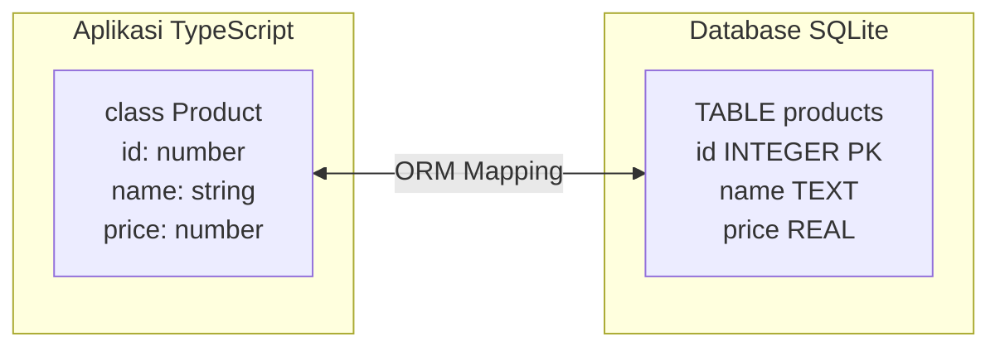
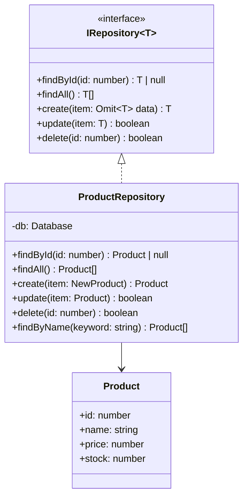
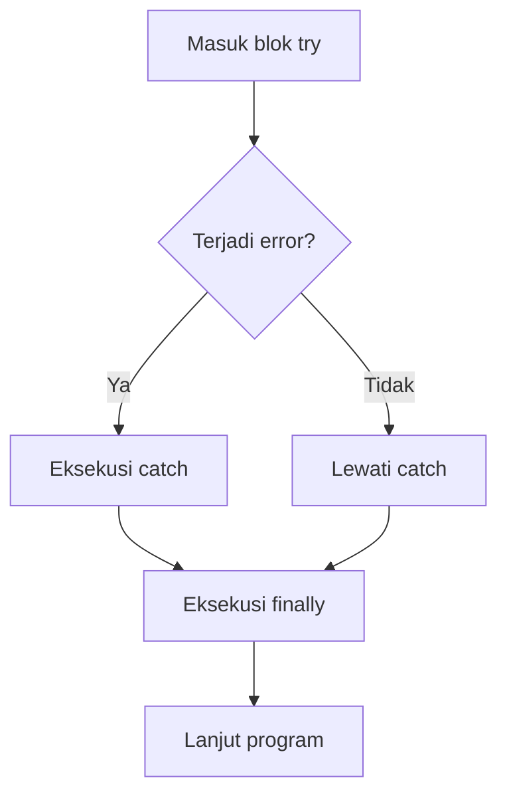
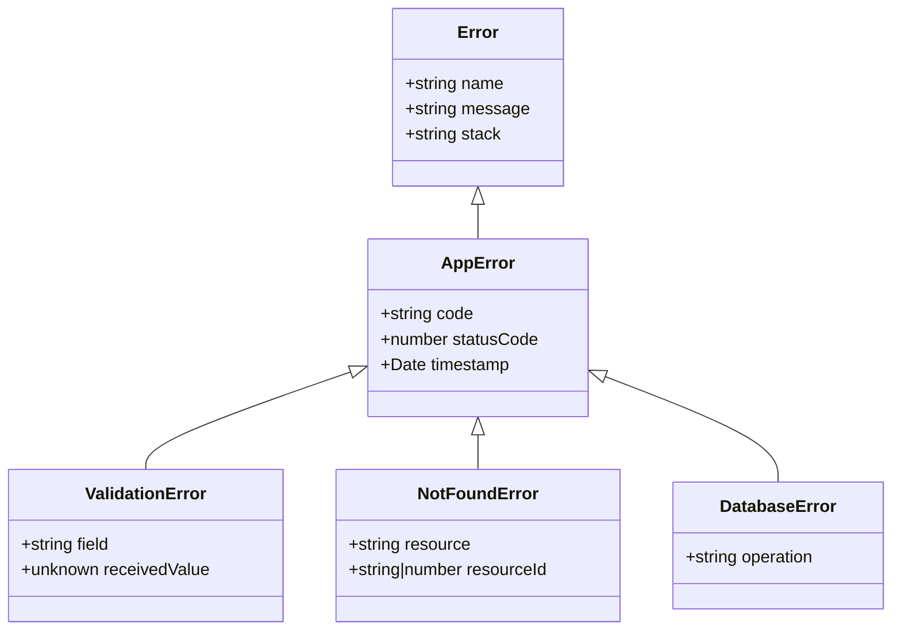
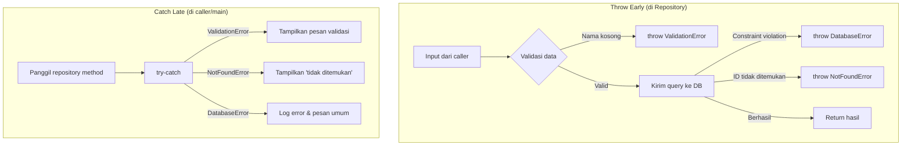
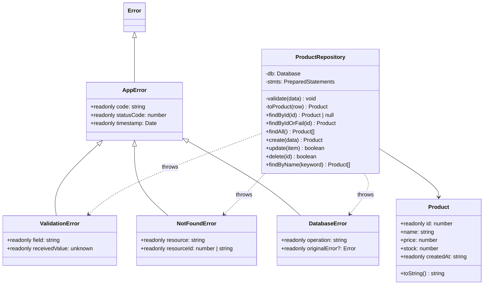

> **Mata Kuliah:** Pemrograman Berorientasi Objek
> **Minggu:** 9
> **Bagian:** Applied OOP
> **Bahasa:** TypeScript 5.x (strict mode)

---

## Capaian Pembelajaran Modul

Setelah mempelajari modul ini, mahasiswa mampu:

1. Mengintegrasikan TypeScript dengan SQLite menggunakan `better-sqlite3`
2. Menerapkan Repository Pattern untuk class-based data access
3. Menggunakan parameterized queries untuk mencegah SQL injection
4. Membuat custom Error class hierarchy (`ValidationError`, `NotFoundError`, `DatabaseError`)
5. Menerapkan `try-catch-finally` dan strategi "throw early, catch late"
6. Menangani error dalam konteks operasi database

---

## Prasyarat

- **Modul 01-07** (Fundamentals): class, constructor, access modifiers, encapsulation, inheritance, polymorphism, abstract class, interface, generics, composition, SOLID principles
- **SQL dasar:** `SELECT`, `INSERT`, `UPDATE`, `DELETE`, pemahaman tentang tabel, kolom, primary key

---

## Daftar Isi

- [1. Pendahuluan](#1-pendahuluan)
- [2. Landasan Konsep](#2-landasan-konsep)
- [3. Implementasi dalam TypeScript](#3-implementasi-dalam-typescript)
- [4. Perbandingan Lintas Bahasa](#4-perbandingan-lintas-bahasa)
- [5. Studi Kasus: ProductRepository dengan Full CRUD & Error Handling](#5-studi-kasus-productrepository-dengan-full-crud--error-handling)
- [6. Kesalahan Umum & Best Practices](#6-kesalahan-umum--best-practices)
- [7. Ringkasan](#7-ringkasan)
- [8. Latihan Mandiri](#8-latihan-mandiri)

---

## 1. Pendahuluan

Selama tujuh modul sebelumnya, semua data yang kita kelola hanya tersimpan di **memori (RAM)** -- begitu program dimatikan, data hilang. Dalam aplikasi nyata, data harus bertahan melampaui siklus hidup program. Di sinilah **database** berperan.

Namun, operasi database menghadirkan tantangan baru: koneksi bisa gagal, data bisa tidak ditemukan, constraint bisa dilanggar. Bagaimana program merespons kondisi-kondisi ini -- itulah **error handling**.

Modul ini menggabungkan kedua topik karena satu alasan fundamental: **error handling paling bermakna saat ada konteks nyata.** Database bisa gagal, data bisa tidak ditemukan, constraint bisa dilanggar -- situasi-situasi ini memberikan konteks yang jauh lebih kaya dibandingkan contoh abstrak.

> 💡 **Insight:** Error handling yang buruk adalah sumber utama bug tersembunyi. Program yang "tidak pernah crash" belum tentu benar -- bisa jadi dia diam-diam mengabaikan error dan menghasilkan data yang corrupt tanpa ada yang menyadari.

---

## 2. Landasan Konsep

### 2.1 Review SQL & Database Relasional

Database relasional menyimpan data dalam **tabel** yang terdiri dari baris (record) dan kolom (field). Setiap tabel memiliki **primary key** sebagai identitas unik setiap baris, dan bisa berelasi dengan tabel lain melalui **foreign key**.

Empat operasi dasar yang diperlukan untuk mengelola data disebut **CRUD**:

| Operasi    | SQL Statement | Deskripsi                    |
| ---------- | ------------- | ---------------------------- |
| **C**reate | `INSERT INTO` | Menambah data baru           |
| **R**ead   | `SELECT`      | Membaca/mengambil data       |
| **U**pdate | `UPDATE`      | Mengubah data yang sudah ada |
| **D**elete | `DELETE`      | Menghapus data               |

```sql
CREATE TABLE products (
    id INTEGER PRIMARY KEY AUTOINCREMENT,
    name TEXT NOT NULL,
    price REAL NOT NULL CHECK(price >= 0),
    stock INTEGER NOT NULL DEFAULT 0,
    created_at TEXT DEFAULT (datetime('now'))
);

INSERT INTO products (name, price, stock) VALUES ('Laptop', 15000000, 10);
SELECT * FROM products WHERE price > 1000000;
UPDATE products SET stock = stock - 1 WHERE id = 1;
DELETE FROM products WHERE id = 1;
```

### 2.2 SQLite & better-sqlite3

**SQLite** adalah database relasional yang menyimpan seluruh database dalam **satu file**. Tidak memerlukan server terpisah -- sangat cocok untuk development, testing, dan aplikasi embedded.

Keunggulan SQLite untuk belajar:

- **Zero configuration** -- tidak perlu install server database
- **Portable** -- database berupa satu file `.db` yang bisa di-copy
- **Full SQL support** -- mendukung sebagian besar syntax SQL standar
- **Ringan** -- library berukuran kurang dari 1 MB

**`better-sqlite3`** adalah library SQLite untuk Node.js yang bersifat **synchronous** -- lebih mudah dipahami dan di-debug dibandingkan library async. Pendekatan synchronous ini mirip dengan JDBC di Java.

> 🔑 **Konsep Kunci:** SQLite bukan pengganti PostgreSQL atau MySQL di production. SQLite ideal untuk development, mobile apps, dan embedded systems. Untuk web server dengan banyak concurrent writes, gunakan PostgreSQL atau MySQL.

### 2.3 Object-Relational Mapping Concept

**Object-Relational Mapping (ORM)** adalah konsep yang menghubungkan objek dalam bahasa pemrograman dengan tabel di database relasional. Masalah ini dikenal sebagai **Object-Relational Impedance Mismatch** -- perbedaan antara representasi OOP (graf objek) dan database relasional (tabel dengan baris dan kolom).



Dalam modul ini, kita melakukan mapping secara **manual** -- menulis SQL sendiri dan mengkonversi hasil query ke objek TypeScript:

```typescript
const row = db.prepare('SELECT * FROM products WHERE id = ?').get(1);
const product = new Product(
  row.id,
  row.name,
  row.price,
  row.stock,
  row.created_at
);
```

> 💡 **Insight:** Memahami raw SQL dan mapping manual sangat penting. ORM menyembunyikan banyak detail -- tanpa pemahaman SQL, kalian akan kesulitan men-debug query yang lambat atau salah.

### 2.4 Repository/DAO Pattern

**Repository** (atau **DAO -- Data Access Object**) adalah design pattern yang memisahkan logika akses data dari logika bisnis. Setiap entitas memiliki repository class tersendiri yang menangani seluruh operasi CRUD.



Keuntungan Repository Pattern:

- **Separation of Concerns** -- logika SQL terisolasi dalam repository, tidak tersebar di seluruh aplikasi
- **Testability** -- repository bisa di-mock untuk unit testing
- **Substitutability** -- bisa mengganti implementasi database tanpa mengubah logika bisnis

> 🔑 **Konsep Kunci:** Repository Pattern adalah penerapan langsung dari **Single Responsibility Principle** (SOLID). Setiap repository class punya satu tanggung jawab: mengelola akses data untuk satu entitas.

### 2.5 Error Handling: try-catch-finally

Mekanisme dasar error handling di TypeScript adalah blok `try-catch-finally`:

- **`try`** -- blok kode yang mungkin menghasilkan error
- **`catch`** -- blok yang menangkap dan menangani error
- **`finally`** -- blok yang **selalu** dieksekusi (berguna untuk cleanup seperti menutup koneksi database)



> 🔑 **Konsep Kunci:** Berbeda dari Java, parameter `catch` di TypeScript selalu bertipe `unknown` (dalam `strict: true`). Kita harus melakukan type narrowing manual menggunakan `instanceof` sebelum mengakses property error.

### 2.6 Custom Error Classes

Built-in error types (`Error`, `TypeError`, `RangeError`) tidak cukup spesifik untuk aplikasi database. Kita membangun hierarki error class khusus:



Setiap **kategori kegagalan** memiliki error class tersendiri:

- **`ValidationError`** -- data tidak valid (harga negatif, nama kosong)
- **`NotFoundError`** -- data tidak ditemukan di database
- **`DatabaseError`** -- operasi database gagal (constraint violation, koneksi error)

### 2.7 Error Handling Strategies in DB Context

Dua prinsip utama:

**Throw Early (Fail Fast):** Validasi input **sebelum** mengirim query ke database. Jangan biarkan data tidak valid menembus ke layer database.

**Catch Late:** Tangkap error di level yang tahu cara menanganinya. Repository melempar error spesifik; caller (service/main) yang memutuskan respons.



---

## 3. Implementasi dalam TypeScript

### 3.1 Setup better-sqlite3 & Basic Operations

Setup project:

```bash
mkdir product-app && cd product-app
npm init -y
npm install better-sqlite3
npm install -D typescript @types/better-sqlite3 tsx
npx tsc --init  # lalu set strict: true
```

Koneksi dan operasi dasar:

```typescript
// src/database.ts
import Database from 'better-sqlite3';

const db = new Database('products.db'); // File dibuat otomatis jika belum ada
db.pragma('journal_mode = WAL'); // Aktifkan WAL mode

// Membuat tabel
db.exec(`
    CREATE TABLE IF NOT EXISTS products (
        id INTEGER PRIMARY KEY AUTOINCREMENT,
        name TEXT NOT NULL,
        price REAL NOT NULL CHECK(price >= 0),
        stock INTEGER NOT NULL DEFAULT 0,
        created_at TEXT DEFAULT (datetime('now'))
    )
`);

// Prepared statement -- dikompilasi sekali, dieksekusi berkali-kali
const insertStmt = db.prepare(
  'INSERT INTO products (name, price, stock) VALUES (?, ?, ?)'
);
insertStmt.run('Laptop', 15000000, 10);
insertStmt.run('Mouse', 150000, 50);

// .all() mengembalikan semua baris, .get() mengembalikan satu baris atau undefined
const products = db.prepare('SELECT * FROM products').all();
const laptop = db.prepare('SELECT * FROM products WHERE id = ?').get(1);

// Named parameters dengan @param
const selectByPrice = db.prepare(
  'SELECT * FROM products WHERE price >= @minPrice AND price <= @maxPrice'
);
const filtered = selectByPrice.all({ minPrice: 100000, maxPrice: 1000000 });

export default db;
```

> 💡 **Insight:** `better-sqlite3` bersifat synchronous -- lebih intuitif dan mirip JDBC di Java. Untuk production web server, pertimbangkan async library atau worker threads.

### 3.2 CRUD Operations with Parameterized Queries

**SQL injection** adalah serangan di mana penyerang menyisipkan kode SQL berbahaya melalui input pengguna. **Parameterized queries** mencegahnya:

```typescript
// ❌ BERBAHAYA -- SQL injection!
const name = "'; DROP TABLE products; --";
db.prepare(`SELECT * FROM products WHERE name = '${name}'`); // tabel TERHAPUS!

// ✅ AMAN -- parameter di-escape otomatis
db.prepare('SELECT * FROM products WHERE name = ?').all(name);
```

Semua operasi CRUD menggunakan parameterized queries:

```typescript
// CREATE -- named parameters (@param)
const insertStmt = db.prepare(
  'INSERT INTO products (name, price, stock) VALUES (@name, @price, @stock)'
);
const result = insertStmt.run({ name: 'Keyboard', price: 500000, stock: 30 });
console.log(`Inserted ID: ${result.lastInsertRowid}`); // 3

// READ -- positional parameter (?)
const product = db.prepare('SELECT * FROM products WHERE id = ?').get(3);

// UPDATE -- named parameters
const updateStmt = db.prepare(
  'UPDATE products SET name = @name, price = @price, stock = @stock WHERE id = @id'
);
updateStmt.run({
  id: 3,
  name: 'Keyboard Mechanical',
  price: 750000,
  stock: 25,
});

// DELETE -- positional parameter
db.prepare('DELETE FROM products WHERE id = ?').run(3);

// SEARCH -- parameterized LIKE (placeholder, BUKAN concatenation!)
const results = db
  .prepare('SELECT * FROM products WHERE name LIKE ?')
  .all('%Lap%');
```

> ⚠️ **Perhatian:** JANGAN PERNAH menyisipkan input pengguna langsung ke dalam string SQL menggunakan template literal atau string concatenation. Selalu gunakan **parameterized queries** dengan placeholder `?` atau named parameter `@name`. Ini adalah aturan keamanan yang tidak bisa ditawar.

### 3.3 Custom Error Classes: ValidationError, NotFoundError, DatabaseError

Sekarang kita membangun hierarki error class yang dirancang khusus untuk konteks operasi database:

```typescript
// src/errors.ts

// Base error class untuk seluruh aplikasi
class AppError extends Error {
  public readonly timestamp: Date;
  constructor(
    message: string,
    public readonly code: string,
    public readonly statusCode: number = 500
  ) {
    super(message);
    this.name = this.constructor.name;
    this.timestamp = new Date();
  }
}

// Data yang dikirim tidak valid (harga negatif, nama kosong)
class ValidationError extends AppError {
  constructor(
    message: string,
    public readonly field: string,
    public readonly receivedValue: unknown
  ) {
    super(message, 'VALIDATION_ERROR', 400);
  }
}

// Data tidak ditemukan di database
class NotFoundError extends AppError {
  constructor(
    public readonly resource: string,
    public readonly resourceId: number | string
  ) {
    super(
      `${resource} dengan ID '${resourceId}' tidak ditemukan.`,
      'NOT_FOUND',
      404
    );
  }
}

// Operasi database gagal (constraint violation, koneksi error)
class DatabaseError extends AppError {
  constructor(
    message: string,
    public readonly operation: string,
    public readonly originalError?: Error
  ) {
    super(message, 'DATABASE_ERROR', 500);
  }
}

export { AppError, ValidationError, NotFoundError, DatabaseError };
```

Menangani error dengan type narrowing menggunakan `instanceof`:

```typescript
try {
  repo.create({ name: '', price: -100, stock: 5 });
} catch (error: unknown) {
  // Urutan: paling spesifik → paling umum
  if (error instanceof ValidationError) {
    console.error(`[Validasi] Field '${error.field}': ${error.message}`);
  } else if (error instanceof NotFoundError) {
    console.error(`[404] ${error.resource} ID=${error.resourceId}`);
  } else if (error instanceof DatabaseError) {
    console.error(`[DB] Operasi '${error.operation}' gagal: ${error.message}`);
  } else if (error instanceof Error) {
    console.error(`[Unknown] ${error.message}`);
  }
}
```

> ⚠️ **Perhatian:** Urutan `instanceof` sangat penting! Mulai dari class paling spesifik (`ValidationError`) ke paling umum (`Error`). Jika dibalik, class parent menangkap semua error dan class child tidak pernah tercapai, karena `instanceof` memeriksa seluruh prototype chain.

### 3.4 ProductRepository with CRUD + Error Handling (Integrated)

Ini adalah inti dari modul ini: **repository yang mengintegrasikan operasi database dengan error handling yang komprehensif.** Setiap method CRUD memvalidasi input, menangani kegagalan database, dan melempar error yang informatif.

```typescript
// src/models/Product.ts
export class Product {
  constructor(
    public readonly id: number,
    public name: string,
    public price: number,
    public stock: number,
    public readonly createdAt: string
  ) {}

  toString(): string {
    return `[${this.id}] ${this.name} - Rp${this.price.toLocaleString('id-ID')} (stok: ${this.stock})`;
  }
}

// src/repositories/IRepository.ts
export interface IRepository<T> {
  findById(id: number): T | null;
  findAll(): T[];
  create(item: Omit<T, 'id' | 'createdAt'>): T;
  update(item: T): boolean;
  delete(id: number): boolean;
}
```

```typescript
// src/repositories/ProductRepository.ts
import Database from 'better-sqlite3';
import { Product } from '../models/Product.js';
import { IRepository } from './IRepository.js';
import { ValidationError, NotFoundError, DatabaseError } from '../errors.js';

interface ProductRow {
  id: number;
  name: string;
  price: number;
  stock: number;
  created_at: string;
}

export class ProductRepository implements IRepository<Product> {
  private stmts;

  constructor(private db: Database.Database) {
    // Prepared statements dikompilasi sekali saat constructor
    this.stmts = {
      findById: db.prepare('SELECT * FROM products WHERE id = ?'),
      findAll: db.prepare('SELECT * FROM products ORDER BY id'),
      insert: db.prepare(
        'INSERT INTO products (name, price, stock) VALUES (@name, @price, @stock)'
      ),
      update: db.prepare(
        'UPDATE products SET name = @name, price = @price, stock = @stock WHERE id = @id'
      ),
      delete: db.prepare('DELETE FROM products WHERE id = ?'),
      findByName: db.prepare('SELECT * FROM products WHERE name LIKE ?'),
    };
  }

  private toProduct(row: ProductRow): Product {
    return new Product(row.id, row.name, row.price, row.stock, row.created_at);
  }

  // Throw early -- validasi SEBELUM query ke database
  private validate(data: { name: string; price: number; stock: number }): void {
    if (!data.name || data.name.trim().length === 0) {
      throw new ValidationError(
        'Nama produk tidak boleh kosong',
        'name',
        data.name
      );
    }
    if (data.name.trim().length < 3) {
      throw new ValidationError(
        'Nama produk minimal 3 karakter',
        'name',
        data.name
      );
    }
    if (data.price < 0 || !Number.isFinite(data.price)) {
      throw new ValidationError(
        'Harga harus angka non-negatif',
        'price',
        data.price
      );
    }
    if (data.stock < 0 || !Number.isInteger(data.stock)) {
      throw new ValidationError(
        'Stok harus bilangan bulat non-negatif',
        'stock',
        data.stock
      );
    }
  }

  // READ: return null jika tidak ditemukan (bukan error)
  findById(id: number): Product | null {
    try {
      const row = this.stmts.findById.get(id) as ProductRow | undefined;
      return row ? this.toProduct(row) : null;
    } catch (error: unknown) {
      throw new DatabaseError(
        `Gagal mengambil product id=${id}: ${error instanceof Error ? error.message : String(error)}`,
        'SELECT',
        error instanceof Error ? error : undefined
      );
    }
  }

  // READ: throw NotFoundError jika tidak ditemukan
  findByIdOrFail(id: number): Product {
    const product = this.findById(id);
    if (product === null) {
      throw new NotFoundError('Product', id);
    }
    return product;
  }

  findAll(): Product[] {
    try {
      const rows = this.stmts.findAll.all() as ProductRow[];
      return rows.map((row) => this.toProduct(row));
    } catch (error: unknown) {
      throw new DatabaseError(
        `Gagal mengambil semua products: ${error instanceof Error ? error.message : String(error)}`,
        'SELECT',
        error instanceof Error ? error : undefined
      );
    }
  }

  // CREATE: validasi → INSERT → return product baru
  create(data: Omit<Product, 'id' | 'createdAt'>): Product {
    this.validate(data); // Throw early

    try {
      const result = this.stmts.insert.run({
        name: data.name.trim(),
        price: data.price,
        stock: data.stock,
      });
      return this.findByIdOrFail(Number(result.lastInsertRowid));
    } catch (error: unknown) {
      if (error instanceof ValidationError || error instanceof NotFoundError) {
        throw error; // Re-throw custom errors tanpa wrap ulang
      }
      throw new DatabaseError(
        `Gagal membuat product '${data.name}': ${error instanceof Error ? error.message : String(error)}`,
        'INSERT',
        error instanceof Error ? error : undefined
      );
    }
  }

  // UPDATE: validasi → cek keberadaan → UPDATE
  update(product: Product): boolean {
    this.validate(product);
    this.findByIdOrFail(product.id);

    try {
      const result = this.stmts.update.run({
        id: product.id,
        name: product.name.trim(),
        price: product.price,
        stock: product.stock,
      });
      return result.changes > 0;
    } catch (error: unknown) {
      if (error instanceof ValidationError || error instanceof NotFoundError)
        throw error;
      throw new DatabaseError(
        `Gagal update product id=${product.id}: ${error instanceof Error ? error.message : String(error)}`,
        'UPDATE',
        error instanceof Error ? error : undefined
      );
    }
  }

  // DELETE: cek keberadaan → DELETE
  delete(id: number): boolean {
    this.findByIdOrFail(id);
    try {
      const result = this.stmts.delete.run(id);
      return result.changes > 0;
    } catch (error: unknown) {
      if (error instanceof NotFoundError) throw error;
      throw new DatabaseError(
        `Gagal menghapus product id=${id}: ${error instanceof Error ? error.message : String(error)}`,
        'DELETE',
        error instanceof Error ? error : undefined
      );
    }
  }

  // SEARCH: parameterized LIKE query
  findByName(keyword: string): Product[] {
    try {
      const rows = this.stmts.findByName.all(`%${keyword}%`) as ProductRow[];
      return rows.map((row) => this.toProduct(row));
    } catch (error: unknown) {
      throw new DatabaseError(
        `Gagal mencari products: ${error instanceof Error ? error.message : String(error)}`,
        'SELECT',
        error instanceof Error ? error : undefined
      );
    }
  }
}
```

Perhatikan **pola konsisten** di setiap method:

1. **Validasi input** (throw early) -- sebelum menyentuh database
2. **Wrap operasi database dalam try-catch** -- menangkap error database
3. **Re-throw custom error** tanpa membungkusnya lagi
4. **Wrap error tak terduga** dalam `DatabaseError` dengan konteks informatif

> 🔑 **Konsep Kunci:** Perhatikan bahwa `findById()` mengembalikan `null` saat tidak ditemukan (bukan error -- "tidak ada" itu hasil yang valid), sementara `findByIdOrFail()` throw `NotFoundError`. Dua style ini saling melengkapi: gunakan `findById()` saat "tidak ada" itu normal, gunakan `findByIdOrFail()` saat "tidak ada" berarti ada yang salah.

### 3.5 Mapping Database Rows to Objects

Perhatikan pada `ProductRepository` di atas bahwa konversi antara format database dan format TypeScript dilakukan melalui method `toProduct()` dan interface `ProductRow`. Ada dua perbedaan konvensi yang perlu dijembatani:

```typescript
// Database row: snake_case (konvensi SQL)
interface ProductRow {
    id: number;
    name: string;
    price: number;
    stock: number;
    created_at: string;  // ← snake_case
}

// TypeScript class: camelCase (konvensi TypeScript)
class Product {
    constructor(
        public readonly id: number,
        public name: string,
        public price: number,
        public stock: number,
        public readonly createdAt: string  // ← camelCase
    ) {}
}

// Mapping terjadi di method toProduct() dalam repository
private toProduct(row: ProductRow): Product {
    return new Product(row.id, row.name, row.price, row.stock, row.created_at);
}
```

Hal penting: `better-sqlite3` mengembalikan **plain object**, bukan class instance. Tanpa mapping, kita tidak mendapatkan method seperti `toString()`. Setelah mapping melalui `toProduct()`, hasilnya adalah class instance yang lengkap.

> 🔄 **Perbandingan:** Di Java JDBC, mapping dilakukan melalui `ResultSet.getString("name")` dan `ResultSet.getDouble("price")` -- setiap kolom diakses secara eksplisit per tipe. Di TypeScript dengan `better-sqlite3`, seluruh row langsung menjadi plain object yang bisa di-cast ke interface. Lebih ringkas, tapi kita harus hati-hati dengan tipe data.

### 3.6 Defensive Programming in DB Context

Defensive programming dalam konteks database berarti tidak mempercayai data dari luar -- baik input user, hasil query, maupun parameter yang diterima method.

```typescript
// === Teknik 1: Guard Clauses sebelum operasi database ===
class ProductService {
  constructor(private repo: ProductRepository) {}

  decreaseStock(productId: number, quantity: number): Product {
    // Guard clause 1: validasi parameter
    if (quantity <= 0 || !Number.isInteger(quantity)) {
      throw new ValidationError(
        'Jumlah pengurangan harus bilangan bulat positif',
        'quantity',
        quantity
      );
    }
    // Guard clause 2: pastikan product ada
    const product = this.repo.findByIdOrFail(productId);
    // Guard clause 3: pastikan stok cukup
    if (product.stock < quantity) {
      throw new ValidationError(
        `Stok tidak mencukupi. Tersedia: ${product.stock}, diminta: ${quantity}`,
        'stock',
        quantity
      );
    }
    // Hanya kode "happy path" yang sampai sini
    product.stock -= quantity;
    this.repo.update(product);
    return product;
  }
}

// === Teknik 2: Transaction untuk atomicity ===
function transferStock(
  db: Database.Database,
  repo: ProductRepository,
  fromId: number,
  toId: number,
  quantity: number
): void {
  if (quantity <= 0) {
    throw new ValidationError(
      'Jumlah transfer harus positif',
      'quantity',
      quantity
    );
  }
  const transfer = db.transaction(() => {
    const from = repo.findByIdOrFail(fromId);
    const to = repo.findByIdOrFail(toId);
    if (from.stock < quantity) {
      throw new ValidationError(
        `Stok '${from.name}' tidak cukup: ${from.stock} < ${quantity}`,
        'stock',
        quantity
      );
    }
    from.stock -= quantity;
    to.stock += quantity;
    repo.update(from);
    repo.update(to);
  });
  transfer(); // Semua berhasil atau semua dibatalkan
}

// === Teknik 3: finally untuk cleanup resource ===
function generateReport(dbPath: string): string {
  const db = new Database(dbPath);
  try {
    const rows = db.prepare('SELECT * FROM products').all() as ProductRow[];
    return rows.map((r) => `${r.name}: stok ${r.stock}`).join('\n');
  } catch (error: unknown) {
    throw new DatabaseError(
      `Gagal generate report: ${error instanceof Error ? error.message : String(error)}`,
      'SELECT',
      error instanceof Error ? error : undefined
    );
  } finally {
    db.close(); // SELALU tutup koneksi, baik berhasil maupun gagal
  }
}
```

> 💡 **Insight:** Guard clauses membuat kode lebih readable dibandingkan nested if-else. Tiga `if (...) throw` di awal function (flat, mudah di-scan) jauh lebih jelas daripada tiga level nested `if (...) { if (...) { ... } }` (disebut "arrow anti-pattern").

---

## 4. Perbandingan Lintas Bahasa

### Java: JDBC & DAO Pattern

**Java JDBC** (Java Database Connectivity) adalah pendekatan raw SQL di Java -- konsepnya sangat mirip dengan `better-sqlite3` di TypeScript. Perbedaan utama: Java memiliki **checked exceptions** yang memaksa penanganan error secara eksplisit:

```java
// Java JDBC -- checked exception WAJIB ditangani oleh caller
public class ProductDAO {
    private Connection conn;

    public Product findById(int id) throws SQLException {  // <-- wajib deklarasi
        PreparedStatement stmt = conn.prepareStatement(
            "SELECT * FROM products WHERE id = ?"
        );
        stmt.setInt(1, id);   // mapping parameter per tipe
        ResultSet rs = stmt.executeQuery();
        if (rs.next()) {
            return new Product(
                rs.getInt("id"), rs.getString("name"),  // mapping per kolom
                rs.getDouble("price"), rs.getInt("stock")
            );
        }
        return null;
    }
}

// Caller -- Java compiler MEMAKSA try-catch
try {
    ProductDAO dao = new ProductDAO("products.db");
    Product p = dao.findById(1);
} catch (SQLException e) {  // compiler error jika tidak ada ini
    System.err.println("Database error: " + e.getMessage());
}
```

```typescript
// TypeScript -- TANPA checked exception
const repo = new ProductRepository(db);
const product = repo.findById(1); // Tidak ada warning dari compiler!
// Tanggung jawab penuh ada di programmer untuk menangani error
```

### Dart: sqflite & Error Handling

Di ekosistem Dart/Flutter, **sqflite** adalah library raw SQL untuk mobile:

```dart
// Dart sqflite -- async, dengan typed catch
class ProductRepository {
  final Database _db;
  ProductRepository(this._db);

  Future<Product?> findById(int id) async {
    try {
      final rows = await _db.query('products',
        where: 'id = ?', whereArgs: [id]);
      if (rows.isEmpty) return null;
      return Product.fromMap(rows.first);
    } on DatabaseException catch (e) {
      throw AppException('Database error: ${e.message}');
    }
  }
}
```

### Tabel Perbandingan

| Aspek               | Java                                     | TypeScript                               | Dart                                |
| ------------------- | ---------------------------------------- | ---------------------------------------- | ----------------------------------- |
| Raw SQL library     | JDBC (`Connection`, `PreparedStatement`) | `better-sqlite3` (`Database`, `prepare`) | `sqflite` (`openDatabase`, `query`) |
| Parameterized query | `stmt.setString(1, val)`                 | `stmt.run(val)` atau `@param`            | `whereArgs: [val]`                  |
| Transaction         | `conn.setAutoCommit(false)`              | `db.transaction(...)`                    | `db.transaction(...)`               |
| Checked exception   | Ya (`throws SQLException`)               | Tidak ada                                | Tidak ada                           |
| Custom error        | `extends Exception`                      | `extends Error`                          | `implements Exception`              |
| Catch by type       | `catch (SQLException e)`                 | `if (e instanceof SqlError)`             | `on DatabaseException catch (e)`    |
| Error type di catch | Tipe spesifik                            | `unknown` (strict mode)                  | Tipe spesifik                       |

> 🔄 **Perbandingan:** Repository/DAO Pattern diterapkan secara identik di semua bahasa. Pola `interface -> concrete class -> prepared statements` adalah fondasi universal. Perbedaan utamanya ada di mekanisme error handling: Java memaksa penanganan melalui checked exceptions, sementara TypeScript mengandalkan disiplin programmer. Inilah mengapa custom error class yang baik dan strategi "throw early, catch late" sangat penting di TypeScript.

---

## 5. Studi Kasus: ProductRepository dengan Full CRUD & Error Handling

### 5.1 Deskripsi

Studi kasus ini menyatukan seluruh komponen dari Section 3 (`Product`, error classes, `ProductRepository`) dalam satu program yang mendemonstrasikan penanganan setiap jenis error.

### 5.2 Arsitektur Sistem



### 5.3 Demo Penggunaan Lengkap

Menggunakan `Product`, error classes, dan `ProductRepository` dari Section 3, berikut program lengkap yang mendemonstrasikan setiap skenario:

```typescript
// === src/main.ts ===
// Menggunakan semua komponen dari Section 3.1 - 3.4
import Database from 'better-sqlite3';
import { Product } from './models/Product.js';
import { ProductRepository } from './repositories/ProductRepository.js';
import { ValidationError, NotFoundError, DatabaseError } from './errors.js';

// --- Inisialisasi database dan repository ---
const db = new Database(':memory:');
db.pragma('journal_mode = WAL');
db.exec(`
    CREATE TABLE IF NOT EXISTS products (
        id INTEGER PRIMARY KEY AUTOINCREMENT,
        name TEXT NOT NULL,
        price REAL NOT NULL CHECK(price >= 0),
        stock INTEGER NOT NULL DEFAULT 0 CHECK(stock >= 0),
        created_at TEXT DEFAULT (datetime('now'))
    )
`);
const repo = new ProductRepository(db);

// === Centralized error handler ===
function handleError(error: unknown): void {
  if (error instanceof ValidationError) {
    console.error(
      `  [VALIDASI] Field '${error.field}': ${error.message} ` +
        `(nilai: ${String(error.receivedValue)})`
    );
  } else if (error instanceof NotFoundError) {
    console.error(`  [NOT FOUND] ${error.resource} ID=${error.resourceId}`);
  } else if (error instanceof DatabaseError) {
    console.error(`  [DB ERROR] Operasi ${error.operation}: ${error.message}`);
  } else if (error instanceof Error) {
    console.error(`  [ERROR] ${error.message}`);
  }
}

// === Demo 1: CREATE -- berhasil ===
console.log('=== Demo 1: Create Products ===');
try {
  const laptop = repo.create({
    name: 'Laptop Gaming',
    price: 18_000_000,
    stock: 10,
  });
  console.log(`  Berhasil: ${laptop.toString()}`);
  const mouse = repo.create({
    name: 'Mouse Wireless',
    price: 150_000,
    stock: 50,
  });
  console.log(`  Berhasil: ${mouse.toString()}`);
} catch (error: unknown) {
  handleError(error);
}

// === Demo 2: CREATE -- validasi gagal ===
console.log('\n=== Demo 2: Validation Errors ===');
try {
  repo.create({ name: '', price: 100_000, stock: 5 });
} catch (error: unknown) {
  handleError(error);
}
// Output: [VALIDASI] Field 'name': Nama produk tidak boleh kosong (nilai: )

try {
  repo.create({ name: 'Laptop Murah', price: -50_000, stock: 5 });
} catch (error: unknown) {
  handleError(error);
}
// Output: [VALIDASI] Field 'price': Harga harus angka non-negatif (nilai: -50000)

// === Demo 3: READ -- berhasil dan tidak ditemukan ===
console.log('\n=== Demo 3: Read Operations ===');
const found = repo.findById(1);
console.log(`  findById(1): ${found?.toString() ?? 'null'}`);
// Output: [1] Laptop Gaming: Rp18.000.000 (stok: 10)

const notFound = repo.findById(999);
console.log(`  findById(999): ${notFound?.toString() ?? 'null'}`);
// Output: null

try {
  repo.findByIdOrFail(999);
} catch (error: unknown) {
  handleError(error);
}
// Output: [NOT FOUND] Product ID=999

// === Demo 4: UPDATE -- berhasil dan gagal ===
console.log('\n=== Demo 4: Update Operations ===');
try {
  const laptop = repo.findByIdOrFail(1);
  laptop.price = 17_500_000;
  laptop.stock = 8;
  repo.update(laptop);
  console.log(`  Data terbaru: ${repo.findByIdOrFail(1).toString()}`);
} catch (error: unknown) {
  handleError(error);
}

try {
  const fake = new Product(999, 'Ghost Product', 0, 0, '');
  repo.update(fake);
} catch (error: unknown) {
  handleError(error);
}
// Output: [NOT FOUND] Product ID=999

// === Demo 5: DELETE -- berhasil dan gagal ===
console.log('\n=== Demo 5: Delete Operations ===');
try {
  repo.delete(2);
  console.log('  Delete id=2 berhasil');
} catch (error: unknown) {
  handleError(error);
}

try {
  repo.delete(2);
} catch (error: unknown) {
  // sudah dihapus
  handleError(error);
}
// Output: [NOT FOUND] Product ID=2

// === Demo 6: Transaction untuk batch operations ===
console.log('\n=== Demo 6: Batch Create dengan Transaction ===');
const batchInsert = db.transaction(
  (items: { name: string; price: number; stock: number }[]) => {
    return items.map((item) => repo.create(item));
  }
);

try {
  const newProducts = batchInsert([
    { name: 'Monitor 4K', price: 5_000_000, stock: 15 },
    { name: 'Webcam HD', price: 500_000, stock: 40 },
  ]);
  console.log(
    `  Berhasil menambahkan ${newProducts.length} produk secara atomik`
  );
} catch (error: unknown) {
  handleError(error);
}

// Tampilkan semua produk
console.log('\n=== Semua Produk ===');
for (const p of repo.findAll()) {
  console.log(`  ${p.toString()}`);
}

db.close();
```

### 5.4 Analisis

Studi kasus ini mendemonstrasikan beberapa prinsip penting:

1. **Error handling terintegrasi dengan operasi database** -- setiap method CRUD memiliki validasi input (throw early), try-catch untuk error database, dan custom error class yang informatif. Error handling bukan modul terpisah; ia melekat pada setiap operasi.

2. **Tiga jenis error yang jelas terpisah:**
   - `ValidationError` -- data dari caller tidak valid (harga negatif, nama kosong)
   - `NotFoundError` -- data yang diminta tidak ada di database
   - `DatabaseError` -- operasi database itu sendiri gagal (constraint violation, koneksi error)

3. **Dua style lookup yang saling melengkapi:**
   - `findById()` return `null` -- untuk kasus "cari, mungkin tidak ada" (bukan error)
   - `findByIdOrFail()` throw `NotFoundError` -- untuk kasus "harus ada, kalau tidak ada berarti masalah"

4. **Repository mengisolasi SQL** -- kode di `main.ts` tidak menulis SQL sama sekali. Semua interaksi database melalui method repository yang sudah dilengkapi error handling.

5. **Centralized error handling** -- function `handleError()` menangani semua jenis error secara konsisten menggunakan `instanceof` checks yang diurutkan dari yang paling spesifik ke paling umum.

6. **Transaction untuk atomicity** -- batch insert menggunakan `db.transaction()` untuk menjamin bahwa semua insert berhasil atau semua dibatalkan, mencegah data setengah jadi.

---

## 6. Kesalahan Umum & Best Practices

### ❌ SQL injection melalui string concatenation

```typescript
// ❌ JANGAN PERNAH lakukan ini!
function searchProducts(keyword: string): ProductRow[] {
  return db
    .prepare(`SELECT * FROM products WHERE name LIKE '%${keyword}%'`)
    .all() as ProductRow[];
}
// Input: "'; DROP TABLE products; --" → database hancur!
```

### ✅ Selalu gunakan parameterized queries

```typescript
// ✅ Aman: parameter di-escape otomatis
function searchProducts(keyword: string): ProductRow[] {
  return db
    .prepare('SELECT * FROM products WHERE name LIKE ?')
    .all(`%${keyword}%`) as ProductRow[];
}
```

### ❌ Menelan error (catch-and-ignore) vs ✅ Tangani secara eksplisit

```typescript
// ❌ Error hilang tanpa jejak!
try {
  repo.create({ name: 'Test', price: -100, stock: 5 });
} catch (error) {
  /* kosong -- masalah tersembunyi */
}

// ✅ Tangani atau re-throw
try {
  repo.create({ name: 'Test', price: -100, stock: 5 });
} catch (error: unknown) {
  if (error instanceof ValidationError)
    console.error(`Validasi: ${error.message}`);
  else if (error instanceof DatabaseError)
    console.error(`DB: ${error.message}`);
  else throw error; // Re-throw error yang tidak dikenali
}
```

### ❌ Throw string vs ✅ Throw Error instance

```typescript
throw 'Produk tidak ditemukan'; // ❌ Kehilangan stack trace dan tipe
throw new NotFoundError('Product', 42); // ✅ name, message, stack, code, resource
```

### ❌ Tidak menutup koneksi vs ✅ Gunakan finally

```typescript
// ❌ Resource leak!
function getData(): ProductRow[] {
  const db = new Database('products.db');
  return db.prepare('SELECT * FROM products').all() as ProductRow[];
}

// ✅ Koneksi selalu ditutup
function getData(): ProductRow[] {
  const db = new Database('products.db');
  try {
    return db.prepare('SELECT * FROM products').all() as ProductRow[];
  } finally {
    db.close();
  }
}
```

### ❌ Tanpa transaction vs ✅ Atomik dengan transaction

```typescript
// ❌ Jika error di tengah, data inkonsisten
function transferStock(fromId: number, toId: number, qty: number): void {
  const from = repo.findByIdOrFail(fromId);
  from.stock -= qty;
  repo.update(from);
  // Error di sini = stok berkurang tapi belum bertambah di tujuan!
  const to = repo.findByIdOrFail(toId);
  to.stock += qty;
  repo.update(to);
}

// ✅ Semua berhasil atau semua dibatalkan
const transferStock = db.transaction(
  (fromId: number, toId: number, qty: number) => {
    const from = repo.findByIdOrFail(fromId);
    const to = repo.findByIdOrFail(toId);
    if (from.stock < qty) {
      throw new ValidationError(
        `Stok tidak cukup: ${from.stock} < ${qty}`,
        'stock',
        qty
      );
    }
    from.stock -= qty;
    to.stock += qty;
    repo.update(from);
    repo.update(to);
  }
);
```

### ❌ Exception untuk flow control vs ✅ Null check

```typescript
// ❌ Exception BUKAN pengganti if-else
function findProduct(id: number): Product {
  try {
    return repo.findByIdOrFail(id);
  } catch {
    return new Product(0, 'Default', 0, 0, '');
  } // flow normal!
}

// ✅ Gunakan findById yang return null
function findProduct(id: number): Product {
  return repo.findById(id) ?? new Product(0, 'Default', 0, 0, '');
}
```

> 🔑 **Konsep Kunci:** Exception untuk kondisi **exceptional** -- bukan flow normal. Jika "gagal" itu expected (pencarian tidak menemukan hasil), gunakan `null` -- bukan exception.

> ⚠️ **Perhatian:** Transaction juga meningkatkan **performa**. Tanpa transaction, setiap `INSERT` memicu fsync ke disk. Dengan transaction, ratusan INSERT di-batch dalam satu fsync -- bisa 10-100x lebih cepat.

---

## 7. Ringkasan

- **Database relasional** menyimpan data secara persisten; `better-sqlite3` menyediakan API synchronous yang intuitif untuk SQLite
- **Repository Pattern** memisahkan logika akses data dari logika bisnis -- setiap entitas memiliki repository class dengan method CRUD (Single Responsibility Principle)
- **Parameterized queries** adalah satu-satunya cara yang benar untuk menyisipkan input ke SQL -- **jangan pernah** gunakan string concatenation
- **Custom error classes** (`ValidationError`, `NotFoundError`, `DatabaseError`) memungkinkan penanganan yang granular menggunakan `instanceof`
- **`try-catch-finally`** adalah mekanisme dasar error handling; `finally` selalu dieksekusi untuk cleanup resource
- **Throw early, catch late** -- validasi input sebelum menyentuh database, tangkap error di level yang tahu cara menanganinya
- **Transaction** menjamin atomicity: operasi database berhasil seluruhnya atau gagal seluruhnya
- Error handling dan database operations **tidak terpisah** -- error handling paling bermakna dalam konteks nyata

---

## 8. Latihan Mandiri

### Latihan 1: UserRepository dengan Custom Errors

Buat class `User` (id, username, email, role: `"admin" | "user" | "guest"`, createdAt) dan custom errors: `DuplicateEmailError extends DatabaseError`, `InvalidRoleError extends ValidationError`.

Implementasikan `UserRepository` dengan method: `findById`, `findByEmail`, `create` (validasi email unik + role valid), `updateRole`, dan `delete`. Pastikan email `UNIQUE` di SQL, semua query menggunakan parameterized statements, dan setiap method menerapkan throw early dengan custom errors.

### Latihan 2: Order System dengan Transaction dan Error Handling

Buat sistem order sederhana dengan dua tabel: `products` dan `orders`. Implementasikan class `OrderService` dengan method `placeOrder(productId: number, quantity: number, customerName: string): Order` yang:

1. Memvalidasi input (throw `ValidationError` jika quantity &lt;= 0 atau customerName kosong)
2. Memeriksa keberadaan product (throw `NotFoundError` jika tidak ada)
3. Memeriksa kecukupan stok (throw `ValidationError` jika kurang)
4. Membuat record order dan mengurangi stok dalam **satu transaction**

Tulis demo yang menunjukkan: order berhasil, gagal karena stok tidak cukup (stok TIDAK berubah berkat transaction), gagal karena product tidak ditemukan, dan gagal karena validasi input.

### Latihan 3: ProductRepository dengan Audit Trail

Extend `ProductRepository` dari studi kasus dengan fitur **audit trail**: buat tabel `audit_logs` (kolom: `id`, `operation`, `entity_id`, `old_data` JSON, `new_data` JSON, `created_at`). Setiap `create`, `update`, dan `delete` harus mencatat log ke `audit_logs` **dalam transaction yang sama** dengan operasi utama. Tambahkan method `getAuditHistory(productId: number): AuditLog[]`.

Refleksikan: mengapa audit trail dan operasi utama HARUS dalam satu transaction?

---

## Referensi & Bacaan Lanjutan

- better-sqlite3 Documentation: https://github.com/WiseLibs/better-sqlite3/blob/master/docs/api.md
- SQLite Documentation: https://www.sqlite.org/docs.html
- MDN Web Docs -- Error: https://developer.mozilla.org/en-US/docs/Web/JavaScript/Reference/Global_Objects/Error
- MDN Web Docs -- try...catch: https://developer.mozilla.org/en-US/docs/Web/JavaScript/Reference/Statements/try...catch
- TypeScript Handbook -- Narrowing: https://www.typescriptlang.org/docs/handbook/2/narrowing.html
- OWASP SQL Injection Prevention Cheat Sheet: https://cheatsheetseries.owasp.org/cheatsheets/SQL_Injection_Prevention_Cheat_Sheet.html
- Martin Fowler -- "Patterns of Enterprise Application Architecture" (Bab 10: Data Source Architectural Patterns -- DAO, Repository)
- "Clean Code" -- Robert C. Martin (Bab 7: Error Handling)
