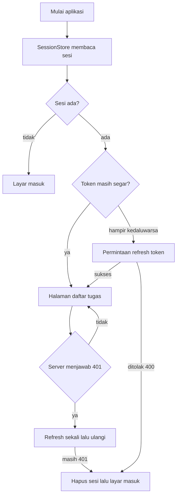

## Tujuan Pembelajaran

Bab 8 menutup dengan janji yang belum ditepati: `SqliteTaskRepository` menyimpan tugas sungguhan di perangkat, diagram lapisannya menyebut `ApiTaskRepository` bab 9, dan penyimpanan aman masih berupa kotak kosong di tabel pilihan penyimpanan. Bab ini menepati semuanya sekaligus, dan pekerjaannya lebih dari sekadar "ganti SQLite dengan HTTP".

Ada dua batas yang harus dijaga sepanjang bab. Pertama: **jaringan adalah dunia yang gagal dengan cara ribuan**. Kabel terputus, server diam, balasan datang rusak, token kedaluwarsa di tengah permintaan. Kode yang menulis `try-catch` generik lalu `print` error sedang menyerah sebelum mulai; bab ini memetakan setiap kegagalan ke jenis error yang punya arti bagi UI. Kedua: **token akses dan refresh token adalah rahasia**. Keduanya tidak pernah boleh mampir di preferences, di bab 7 terasa wajar karena isinya cuma mode tema, dan tidak juga di SQLite polos. Rumah mereka adalah Keychain dan Keystore lewat `flutter_secure_storage`, tepat seperti baris tabel bab 8 yang menunggu diisi.

Setelah menyelesaikan bab ini, Anda bisa:

1. Membangun klien API di atas `http.Client` yang disuntikkan, lengkap dengan batas waktu per permintaan, sehingga seluruh perilakunya bisa diuji dengan klien palsu.
2. Menyimpan sesi autentikasi sebagai satu blob JSON di penyimpanan aman, atomik, tanpa keadaan setengah-tertulis.
3. Menangani pendaftaran saat server menaktifkan konfirmasi email: balasan tanpa sesi adalah keadaan wajar, bukan kegagalan.
4. Menyegarkan akses token sebelum kedaluwarsa, mencoba ulang sekali setelah 401, dan mengakhiri sesi yang sudah ditolak server.
5. Memetakan kegagalan jaringan, batas waktu, balasan rusak, dan status 401/403/422/429/5xx ke jenis error tertutup (sealed) yang UI bisa tanggapi.
6. Mengaktifkan Row Level Security dengan kebijakan own-user dan membuktikannya lewat skrip SQL yang menyamar sebagai dua pengguna berbeda.

Hasil akhirnya: `ApiTaskRepository` memenuhi kontrak `TaskRepository` dari bab 2 lewat jaringan, controller bab 7 tetap tidak berubah satu baris, dan bab 10 tinggal menggabungkan repository ini dengan SQLite bab 8 untuk offline-first.

## Kontrak di Balik Jaringan

REST memakai HTTP sebagai bahasa pengangkut. Permintaan membawa method, path, header, dan kadang body; balasan membawa status dan body. Untuk Tracker, seluruh percakapan itu terjadi dengan Supabase: lapisan auth di `/auth/v1/*` dan lapisan data di `/rest/v1/*`, yang belakangan adalah PostgREST, mesin yang mengubah tabel PostgreSQL menjadi endpoint REST tanpa server aplikasi tambahan.

Method yang dipakai bab ini hanya empat, dan semuanya sudah dikenal:

| Method   | Dipakai untuk              | PostgREST di Tracker                            |
| -------- | -------------------------- | ----------------------------------------------- |
| `GET`    | Membaca koleksi            | `/rest/v1/tasks?select=*`                       |
| `POST`   | Menambah atau upsert baris | `/rest/v1/tasks?on_conflict=id`                 |
| `DELETE` | Menghapus baris            | `/rest/v1/tasks?id=eq.t-1`                      |
| `PATCH`  | Mengubah sebagian kolom    | dibahas sebagai variasi, Tracker memakai upsert |

Status balasan adalah cara server berbicara tanpa dibaca body-nya. Yang penting bukan menghafal daftarnya, tapi tahu aplikasi harus melakukan apa:

| Status          | Arti                                      | Tanggapan aplikasi                              |
| --------------- | ----------------------------------------- | ----------------------------------------------- |
| 200 / 201 / 204 | Sukses                                    | proses body bila ada                            |
| 400             | Permintaan ditolak (termasuk login salah) | tampilkan pesan dari server                     |
| 401             | Token tidak ada, salah, atau kedaluwarsa  | segarkan sekali, ulangi, lalu paksa masuk       |
| 403             | Terkena kebijakan RLS                     | data ini bukan milik pengguna, jangan coba lagi |
| 422             | Payload gagal validasi                    | perbaiki data, tampilkan detail                 |
| 429             | Terlalu banyak permintaan                 | tahan diri, tunggu sebelum mencoba lagi         |
| 5xx             | Server bermasalah                         | tampilkan pesan, tawarkan coba lagi             |

JSON menjadi format isi kedua arah. Bab 2 sudah membangun pemetaan `Task` dua arah untuk SQLite; bab ini cukup mengulang pola yang sama untuk kolom Postgres: `priority` tetap berupa angka bobot enum, `done` boolean asli (Postgres punya tipe boolean, berbeda dari SQLite bab 8), dan tanggal berupa string ISO 8601 yang diurai `DateTime.parse`.

Satu konsekuensi arsitektural penting sebelum menulis kode: seluruh tabel ini hidup di server, tetapi **ID tetap milik klien**. Tabel `tasks` memakai `id text primary key`, bukan `serial` yang dibangkitkan server, karena model `Task` bab 2 sudah membawa ID sejak awal dan bab 10 akan menciptakan tugas saat perangkat offline, penomoran dua sumber kebenaran adalah resep konflik sinkronisasi. Upsert PostgREST (`on_conflict=id`) membuat keputusan ini bekerja: kirim baris dengan ID apa adanya; bila sudah ada, gabungkan.

### Kenapa REST, padahal ada SDK

Supabase menyediakan paket Dart resmi yang membuat seluruh bab ini muat dalam beberapa baris. Buku ini tidak memakainya, dan itu keputusan yang disengaja.

Supabase di sini dipakai sebagai **server PostgREST yang kebetulan gratis dan cepat disiapkan**, bukan sebagai platform. Yang dilatih bab ini adalah keterampilan yang tersisa ketika Anda pindah: menyusun header, memilih metode, membaca status code dan membedakan artinya, menyegarkan token sebelum kedaluwarsa, dan membatalkan permintaan yang tidak lagi dibutuhkan. Backend perusahaan tempat Anda bekerja nanti hampir pasti berbicara REST, dan hampir pasti tidak menyediakan SDK semewah ini.

SDK-nya sendiri bukan musuh. Setelah bab ini Anda justru berada pada posisi yang tepat untuk memakainya, karena Anda tahu apa yang disembunyikannya.

### Periksa server sebelum menulis Dart

Sebelum baris Dart pertama, pastikan proyek Supabase Anda memang menjawab. Satu perintah sudah cukup:

```bash
curl -i "$SUPABASE_URL/rest/v1/tasks?select=*" \
  -H "apikey: $SUPABASE_ANON_KEY" \
  -H "Authorization: Bearer $SUPABASE_ANON_KEY"
```

Balasan `200` dengan array kosong berarti tabel ada dan kunci diterima. `401` berarti kunci salah. `404` berarti nama tabelnya salah. Melakukan ini lebih dulu memisahkan dua jenis kegagalan yang sangat berbeda tetapi terlihat sama dari dalam aplikasi: konfigurasi yang keliru, dan kode yang keliru. Postman bekerja sama baiknya bila Anda lebih suka antarmuka.

## Dua Kunci, Satu Rahasia

Supabase mengenal dua jenis kunci proyek, dan membedakannya adalah soal keamanan, bukan formalitas.

**Publishable key** (dulu disebut anon key) dirancang untuk dikirim dari aplikasi klien. Ia boleh ada di repo dan di binary; yang menjaganya bukan kerahasiaan, melainkan kebijakan RLS, permintaan dengan kunci ini berjalan sebagai peran `anon` atau `authenticated`, dan tanpa kebijakan yang tepat, datanya memang harus tertutup. **Service role key** menembus RLS sepenuhnya: dengannya, klien bisa membaca dan menulis tabel mana pun. Ia hanya untuk server dan proses tepercaya, dan tidak pernah, dalam keadaan apa pun, menyentuh aplikasi Flutter.

Karena itu konfigurasi Tracker memisahkan nilai dari kode. Buka dashboard Supabase, salin Project URL dan publishable key (bagian Project Settings → API), lalu jalankan aplikasi dengan `--dart-define`:

```bash
flutter run \
  --dart-define=SUPABASE_URL=https://xxxxxxxx.supabase.co \
  --dart-define=SUPABASE_ANON_KEY=eyJ...
```

Di Dart, keduanya dibaca sebagai konstanta kompilasi:

```dart
const supabaseUrl = String.fromEnvironment('SUPABASE_URL');
const supabaseAnonKey = String.fromEnvironment('SUPABASE_ANON_KEY');
```

Konstanta lingkungan tidak muncul di source control dan bisa berbeda antara build development dan produksi. Nilai yang di-`const` di dalam kode, seperti pada versi lama bab ini, terkunci selamanya di repo, dan begitu ada yang menyalin-repo, rotasi kunci jadi pekerjaan yang jauh lebih mahal daripada sekadar mengubah baris perintah.

Batasnya pun jujur dinyatakan: publishable key yang bocor tidak membocorkan data selama RLS aktif dan ketat, tetapi siapa pun yang memilikinya bisa menghabiskan kuota permintaan proyek Anda. Ganti key lewat dashboard bila dicurigai bocor; itu murah, justru karena ia bukan rahasia besar.

## Checkpoint 1: Sesi dan Penyimpanan Aman

**Target:** sesi autentikasi tersimpan utuh sebagai satu blob JSON di penyimpanan aman; tidak ada token di preferences maupun SQLite.
**Waktu:** sekitar 40 menit.

### Paket ketiga dan keempat

```yaml
dependencies:
  http: ^1.2.2
  flutter_secure_storage: ^9.2.2
```

`http` untuk permintaan, `flutter_secure_storage` untuk rahasia, keduanya masuk tepat pada bab yang memakainya. Tambahkan pula `flutter_secure_storage` ke plugin di platform target bila template Anda menanyakannya.

### AuthSession: satu objek, bukan potongan tersebar

Server mengembalikan sesi sebagai satu balasan JSON. Simpan representasinya sebagai satu class `AuthSession`, bukan empat string tersebar di empat kunci storage:

```dart
// lib/api/session.dart
import 'api_exception.dart';

/// Sesi autentikasi dari server: akses token hidup singkat dan dipakai
/// per permintaan; refresh token lebih panjang dan hanya untuk meminta
/// akses token baru.
class AuthSession {
  AuthSession({
    required this.accessToken,
    required this.refreshToken,
    required this.userId,
    required this.email,
    required this.expiresAt,
  });

  final String accessToken;
  final String refreshToken;
  final String userId;
  final String email;
  final DateTime expiresAt;

  /// Segarkan sedikit sebelum benar-benar lewat supaya permintaan tidak
  /// berangkat membawa token yang akan ditolak di tengah jalan.
  static const refreshWindow = Duration(seconds: 30);

  bool get needsRefresh =>
      DateTime.now().isAfter(expiresAt.subtract(refreshWindow));

  /// Balasan /auth/v1/token: access_token, refresh_token, expires_in,
  /// dan objek user. Field yang hilang berarti balasan rusak: bukan
  /// sesi kosong.
  factory AuthSession.fromTokenResponse(Map<String, dynamic> json) {
    final accessToken = json['access_token'];
    final refreshToken = json['refresh_token'];
    final expiresIn = json['expires_in'];
    final user = json['user'];
    if (accessToken is! String ||
        accessToken.isEmpty ||
        refreshToken is! String ||
        refreshToken.isEmpty ||
        expiresIn is! num ||
        user is! Map<String, dynamic> ||
        user['id'] is! String) {
      throw const MalformedResponse();
    }
    return AuthSession(
      accessToken: accessToken,
      refreshToken: refreshToken,
      userId: user['id'] as String,
      email: user['email'] is String ? user['email']! as String : '',
      expiresAt: DateTime.now().add(Duration(seconds: expiresIn.toInt())),
    );
  }

  factory AuthSession.fromStorage(Map<String, dynamic> json) {
    final expiresAt = json['expires_at'];
    if (expiresAt is! String) throw const MalformedResponse();
    return AuthSession(
      accessToken: json['access_token'] as String? ?? '',
      refreshToken: json['refresh_token'] as String? ?? '',
      userId: json['user_id'] as String? ?? '',
      email: json['email'] as String? ?? '',
      expiresAt: DateTime.parse(expiresAt),
    );
  }

  Map<String, dynamic> toJson() => {
    'access_token': accessToken,
    'refresh_token': refreshToken,
    'user_id': userId,
    'email': email,
    'expires_at': expiresAt.toIso8601String(),
  };
}
```

Dua keputusan membentuk class ini. `needsRefresh` memakai jendela waktu 30 detik sebelum kedaluwarsa sebenarnya, meminta token baru tepat setelah yang lama mati berarti sebagian permintaan pasti ditolak 401 dulu. Dan kedua factory membedakan dua sumber yang berbeda: balasan server (`fromTokenResponse`, dengan `expires_in` relatif) dan penyimpanan lokal (`fromStorage`, dengan stempel waktu absolut). Keduanya memvalidasi field wajib dan melempar `MalformedResponse` bila balasan tidak sesuai kontrak, sesi setengah ada lebih berbahaya daripada tidak ada.

### SecretVault: kontrak sebelum mekanisme

Penyimpanan aman diuji berbeda dari preferences: tidak ada `SharedPreferences.setMockInitialValues`. Solusinya pola yang sudah dipakai bab 7 dan 8, kontrak dulu, implementasi belakangan:

```dart
// lib/api/secret_vault.dart
abstract interface class SecretVault {
  Future<String?> read(String key);
  Future<void> write(String key, String value);
  Future<void> delete(String key);
}
```

Implementasi produksi tiga baris per method, membungkus `flutter_secure_storage`:

```dart
// lib/api/secure_vault.dart
import 'package:flutter_secure_storage/flutter_secure_storage.dart';

import 'secret_vault.dart';

/// Produksi: rahasia disimpan di Keychain iOS / Keystore Android,
/// sesuai tabel penempatan data bab 8.
class SecureVault implements SecretVault {
  SecureVault([FlutterSecureStorage? storage])
    : _storage = storage ?? const FlutterSecureStorage();

  final FlutterSecureStorage _storage;

  @override
  Future<String?> read(String key) => _storage.read(key: key);

  @override
  Future<void> write(String key, String value) =>
      _storage.write(key: key, value: value);

  @override
  Future<void> delete(String key) => _storage.delete(key: key);
}
```

Untuk pengujian nanti, versi memori cukup tiga method satu baris (lihat bagian pengujian). Yang diuji adalah logika di atas vault, bukan Keychain itu sendiri, itu urusan vendor sistem operasi.

### SessionStore: satu kunci, atomik

Dengan kedua bagian itu, `SessionStore` menyimpan seluruh sesi sebagai satu blob JSON di satu kunci:

```dart
// lib/api/session_store.dart
import 'dart:convert';

import 'api_exception.dart';
import 'secret_vault.dart';
import 'session.dart';

/// Pemilik sesi tersimpan: seluruh sesi menjadi satu blob JSON di satu
/// kunci sehingga tidak pernah ada keadaan setengah-tertulis (token
/// baru tapi user lama).
class SessionStore {
  SessionStore(this._vault);

  static const _key = 'tracker.session';

  final SecretVault _vault;

  Future<AuthSession?> read() async {
    final raw = await _vault.read(_key);
    if (raw == null) return null;
    try {
      final decoded = jsonDecode(raw);
      if (decoded is! Map<String, dynamic>) return await _discard();
      return AuthSession.fromStorage(decoded);
    } on FormatException {
      return await _discard();
    } on MalformedResponse {
      return await _discard();
    }
  }

  Future<void> save(AuthSession session) =>
      _vault.write(_key, jsonEncode(session.toJson()));

  Future<void> clear() => _vault.delete(_key);

  Future<AuthSession?> _discard() async {
    await clear();
    return null;
  }
}
```

Kenapa satu blob dan bukan lima kunci terpisah? Karena penulisan bertahap ke lima kunci bisa berhenti di tengah, listrik habis, proses dibunuh, dan meninggalkan akses token baru dipadu `user_id` lama. Satu `write` adalah satu operasi: isinya valid seluruhnya atau tidak sama sekali. Data yang terbaca rusak dibuang dan dilaporkan sebagai "belum masuk", bukan dipaksa hidup. Prinsipnya sama dengan transaksi bab 8: keadaan setengah-jadi tidak boleh teramati.

**Validasi checkpoint:**

- Masuk sekali, matikan aplikasi, nyalakan lagi: `SessionStore.read` mengembalikan sesi tanpa layar login.
- Ubah manual isi blob di vault (atau ganti implementasi memori di pengujian) menjadi teks sampah: `read` mengembalikan null dan kunci ikut terhapus.

## Checkpoint 2: AuthApi: Daftar, Masuk, Segarkan, Keluar

**Target:** pendaftaran dengan konfirmasi email aktif tidak dianggap masuk; token kedaluwarsa disegarkan otomatis; keluar mencabut token di server dan membersihkan perangkat.
**Waktu:** sekitar 50 menit.

Sebelum menulis permintaan pertama, tetapkan dua aturan yang memisah dua dunia kegagalan. **Hasil autentikasi wajar**, kredensial salah, email belum dikonfirmasi, email sudah terpakai, adalah jawaban server yang sah dan dikembalikan sebagai nilai, bukan exception. **Kegagalan infrastruktur**, jaringan putus, server diam, balasan rusak, 5xx, adalah exception karena bukan keputusan autentikasi. Aturan ini yang membuat UI tidak menampilkan "periksa koneksi Anda" kepada pengguna yang salah ketik sandi.

### Satu hierarki error tertutup

```dart
// lib/api/api_exception.dart
sealed class ApiException implements Exception {
  const ApiException(this.message);

  /// Pesan yang layak ditampilkan ke pengguna.
  final String message;

  @override
  String toString() => '$runtimeType: $message';
}

final class NetworkFailure extends ApiException {
  const NetworkFailure() : super('Tidak ada koneksi. Periksa jaringan Anda.');
}

final class RequestTimeout extends ApiException {
  const RequestTimeout() : super('Server tidak merespons. Coba lagi nanti.');
}

final class NotSignedIn extends ApiException {
  const NotSignedIn() : super('Anda belum masuk.');
}

final class SessionExpired extends ApiException {
  const SessionExpired() : super('Sesi berakhir. Silakan masuk kembali.');
}

final class AccessDenied extends ApiException {
  const AccessDenied([super.message = 'Permintaan ditolak.']);
}

final class InvalidPayload extends ApiException {
  const InvalidPayload([super.message = 'Data tidak lolos validasi.']);
}

final class TooManyRequests extends ApiException {
  const TooManyRequests()
    : super('Terlalu banyak permintaan. Tunggu sebentar.');
}

final class ServerError extends ApiException {
  const ServerError(this.statusCode)
    : super('Server sedang bermasalah (HTTP $statusCode).');

  final int statusCode;
}

final class MalformedResponse extends ApiException {
  const MalformedResponse() : super('Balasan server tidak bisa dibaca.');
}
```

Class tertutup (sealed) berarti `switch` di UI bisa memeriksa setiap kemungkinan dan compiler menolak bila ada yang terlewat saat hierarki bertambah. Tiga helper melengkapinya: `messageOf` mengutip pesan error dari balasan JSON server, `mapStatus` menerjemahkan status HTTP data endpoint ke jenis di atas, dan `guarded` membungkus setiap panggilan dengan batas waktu sembari menerjemahkan `SocketException` serta `TimeoutException` ke `NetworkFailure` dan `RequestTimeout`:

```dart
// lib/api/api_exception.dart: tiga helper
String messageOf(String body, String fallback) {
  try {
    final decoded = jsonDecode(body);
    if (decoded is Map<String, dynamic>) {
      final message = decoded['message'] ?? decoded['msg'];
      if (message is String && message.trim().isNotEmpty) return message;
    }
  } on FormatException {
    // Balasan tanpa JSON: jatuh ke teks cadangan.
  }
  return fallback;
}

ApiException mapStatus(int statusCode, String body) {
  switch (statusCode) {
    case 400:
      return AccessDenied(messageOf(body, 'Permintaan tidak valid.'));
    case 403:
      return const AccessDenied('Anda tidak berhak atas data ini.');
    case 422:
      return InvalidPayload(messageOf(body, 'Data tidak lolos validasi.'));
    case 429:
      return const TooManyRequests();
  }
  if (statusCode >= 500) return ServerError(statusCode);
  return AccessDenied('Permintaan gagal (HTTP $statusCode).');
}

Future<http.Response> guarded(
  Future<http.Response> Function() call, {
  Duration timeout = const Duration(seconds: 15),
}) async {
  try {
    return await call().timeout(timeout);
  } on SocketException {
    throw const NetworkFailure();
  } on TimeoutException {
    throw const RequestTimeout();
  }
}
```

Lima belas detik adalah keputusan, bukan kebetulan: cukup untuk koneksi seluler yang lambat, terlalu lama untuk membuat pengguna menatap spinner tanpa jalan keluar. Setiap permintaan di bab ini melewati `guarded`, tidak ada yang menunggu tanpa batas. Catatan platform: `SocketException` berasal dari `dart:io`, jadi helper ini untuk target mobile/desktop Tracker; kode web menangkap kegagalan transport lewat mekanisme browser yang berbeda.

### Tiga hasil pendaftaran dan masuk

```dart
// lib/api/auth_api.dart: hasil wajar autentikasi
sealed class AuthResult {
  const AuthResult();
}

final class Authenticated extends AuthResult {
  const Authenticated(this.session);

  final AuthSession session;
}

/// Pendaftaran saat server menuntut konfirmasi email: balasan tidak
/// membawa sesi, dan aplikasi tidak boleh menganggap pengguna masuk.
final class ConfirmationRequired extends AuthResult {
  const ConfirmationRequired(this.email);

  final String email;
}

final class AuthRejected extends AuthResult {
  const AuthRejected(this.reason);

  final String reason;
}
```

`ConfirmationRequired` ada karena perilaku server berubah menurut pengaturan proyek: saat konfirmasi email aktif di Authentication → Settings, `/auth/v1/signup` menjawab 200 dengan profil pengguna tetapi **tanpa** `access_token`. Versi lama bab ini membaca `data['access_token']` dan menyimpan null, pengguna resmi "masuk" dengan token kosong. Sekarang ketiga keadaan eksplisit:

```dart
// lib/api/auth_api.dart: inti AuthApi
class AuthApi {
  AuthApi({
    required http.Client client,
    required this.baseUrl,
    required this.apiKey,
    required SessionStore sessionStore,
    this.timeout = const Duration(seconds: 15),
  }) : _client = client,
       _sessions = sessionStore;

  final http.Client _client;
  final String baseUrl;

  /// Publishable key: memang boleh ada di klien. Service role key
  /// tidak pernah boleh menyentuh aplikasi.
  final String apiKey;
  final SessionStore _sessions;
  final Duration timeout;

  Future<AuthSession?>? _refreshing;

  Map<String, String> get _headers => {
    'apikey': apiKey,
    'content-type': 'application/json',
  };

  Future<AuthResult> signUp(String email, String password) async {
    final response = await _post(
      '/auth/v1/signup',
      body: {'email': email, 'password': password},
    );
    if (response.statusCode >= 500) throw ServerError(response.statusCode);
    if (response.statusCode == 200) {
      final data = _decodeObject(response.body);
      final user = data['user'];
      final hasSession =
          data['access_token'] is String &&
          (data['access_token']! as String).isNotEmpty;
      if (!hasSession) {
        final confirmedEmail =
            user is Map<String, dynamic> && user['email'] is String
                ? user['email']! as String
                : email;
        return ConfirmationRequired(confirmedEmail);
      }
      final session = AuthSession.fromTokenResponse(data);
      await _sessions.save(session);
      return Authenticated(session);
    }
    return AuthRejected(messageOf(response.body, 'Pendaftaran ditolak.'));
  }

  Future<AuthResult> signIn(String email, String password) async {
    final response = await _post(
      '/auth/v1/token?grant_type=password',
      body: {'email': email, 'password': password},
    );
    if (response.statusCode >= 500) throw ServerError(response.statusCode);
    if (response.statusCode == 200) {
      final session = AuthSession.fromTokenResponse(
        _decodeObject(response.body),
      );
      await _sessions.save(session);
      return Authenticated(session);
    }
    return AuthRejected(
      messageOf(response.body, 'Email atau kata sandi salah.'),
    );
  }

  Future<http.Response> _post(
    String path, {
    Map<String, dynamic>? body,
    String? token,
  }) {
    return guarded(
      () => _client.post(
        Uri.parse('$baseUrl$path'),
        headers: {
          ..._headers,
          if (token != null) 'authorization': 'Bearer $token',
        },
        body: jsonEncode(body ?? const {}),
      ),
      timeout: timeout,
    );
  }

  static Map<String, dynamic> _decodeObject(String body) {
    final Object decoded;
    try {
      decoded = jsonDecode(body);
    } on FormatException {
      throw const MalformedResponse();
    }
    if (decoded is Map<String, dynamic>) return decoded;
    throw const MalformedResponse();
  }
}
```

Perhatikan urutan pemeriksaan: 5xx dicek sebelum 200 karena kesalahan server bukan hasil autentikasi; balasan 200 lalu divalidasi bentuknya oleh `_decodeObject` dan `fromTokenResponse`, "status sukses" belum berarti "balasan sehat".

### Segarkan sebelum lewat, ulang sekali setelah 401

Dua method tersisa mengurus hidup-mati sesi:

```dart
// lib/api/auth_api.dart: kelanjutan AuthApi
  /// Sesi untuk dipakai sekarang: milik tersimpan bila masih segar,
  /// atau hasil refresh bila mendekati kedaluwarsa.
  Future<AuthSession?> currentSession() async {
    final saved = await _sessions.read();
    if (saved == null) return null;
    if (!saved.needsRefresh) return saved;
    return refreshSession();
  }

  /// Paksa refresh. Panggilan serentak berbagi satu permintaan supaya
  /// refresh token tidak dipakai dua kali sekaligus.
  Future<AuthSession?> refreshSession() {
    final running = _refreshing;
    if (running != null) return running;
    final pending = _doRefresh();
    _refreshing = pending;
    return pending.whenComplete(() => _refreshing = null);
  }

  Future<AuthSession?> _doRefresh() async {
    final saved = await _sessions.read();
    if (saved == null) return null;
    final response = await _post(
      '/auth/v1/token?grant_type=refresh_token',
      body: {'refresh_token': saved.refreshToken},
    );
    if (response.statusCode == 200) {
      final session = AuthSession.fromTokenResponse(
        _decodeObject(response.body),
      );
      await _sessions.save(session);
      return session;
    }
    if (response.statusCode == 400 || response.statusCode == 401) {
      // Refresh token ditolak: sesi benar-benar habis, bukan error
      // jaringan. Bersihkan dan laporkan sebagai "belum masuk".
      await _sessions.clear();
      return null;
    }
    if (response.statusCode >= 500) throw ServerError(response.statusCode);
    throw mapStatus(response.statusCode, response.body);
  }

  /// Keluar: cabut refresh token di server lalu hapus sesi lokal.
  /// Kegagalan pencabutan tidak boleh menghalangi pembersihan lokal
  /// token yang tersisa di server akan kedaluwarsa sendiri.
  Future<void> signOut() async {
    final saved = await _sessions.read();
    if (saved != null) {
      try {
        await _post(
          '/auth/v1/logout',
          body: {'refresh_token': saved.refreshToken},
          token: saved.accessToken,
        );
      } on ApiException {
        // Sudah tidak valid di server pun tidak masalah.
      }
    }
    await _sessions.clear();
  }
```

Ketiga keputusan di sini paling sering salah dipahami. Pertama, **refresh adalah permintaan tersendiri**, bukan sihir middleware: `currentSession` hanya mengecek umur token, dan tugas menyegarkan jatuh ke satu method yang sama dipanggil dari dua tempat. Kedua, **penolakan refresh dibedakan dari kegagalannya**: 400 berarti server menolak refresh token itu (sesi habis, bersihkan penyimpanan), sedangkan kegagalan jaringan tetap exception sehingga pengguna offline tidak tiba-tiba dilogout. Ketiga, `refreshSession` mendeduplikasi panggilan serentak, dua permintaan data yang sama-sama kena 401 di waktu hampir bersamaan hanya memicu satu permintaan refresh, karena refresh token yang dipakai berganda bisa dibatalkan server secara berantai.

Siklus hidupnya utuh kini bisa digambar:



**Validasi checkpoint:**

- Dengan konfirmasi email aktif: daftar akun baru, dan UI harus menampilkan pesan konfirmasi, bukan daftar tugas.
- Biarkan aplikasi terbuka sampai akses token mendekati kedaluwarsa (atau kecilkan `refreshWindow` saat menguji), lalu muat ulang daftar: permintaan tetap berhasil karena token disegarkan lebih dulu.
- Keluar, lalu coba refresh token lama dari alat seperti curl: server menolaknya, token sudah dicabut, bukan sekadar dilupakan aplikasi.

## Checkpoint 3: ApiTaskRepository: Kontrak Lintas Jaringan

**Target:** `ApiTaskRepository implements TaskRepository`; permintaan membawa token dan batas waktu; 401 disegarkan dan diulang sekali; seluruh kegagalan berwujud `ApiException`.
**Waktu:** sekitar 50 menit.

Kontrak bab 2 tidak mengenal HTTP, hanya `all`, `save`, `delete`. Menepatinya lewat jaringan berarti semua detail HTTP hidup di dalam repository ini:

```dart
// lib/api/api_task_repository.dart
class ApiTaskRepository implements TaskRepository {
  ApiTaskRepository({
    required http.Client client,
    required AuthApi auth,
    required this.baseUrl,
    required this.apiKey,
    this.timeout = const Duration(seconds: 15),
  }) : _client = client,
       _auth = auth;

  final http.Client _client;
  final AuthApi _auth;
  final String baseUrl;
  final String apiKey;
  final Duration timeout;

  static final _priorityByWeight = {
    for (final priority in Priority.values) priority.weight: priority,
  };

  @override
  Future<List<Task>> all() async {
    final response = await _send(
      (headers) => _client.get(
        _uri('/rest/v1/tasks?select=*&order=created_at.asc'),
        headers: headers,
      ),
    );
    final Object decoded;
    try {
      decoded = jsonDecode(response.body);
    } on FormatException {
      throw const MalformedResponse();
    }
    if (decoded is! List) throw const MalformedResponse();
    final tasks = <Task>[];
    for (final item in decoded) {
      if (item is! Map<String, dynamic>) throw const MalformedResponse();
      tasks.add(_taskFromJson(item));
    }
    return tasks;
  }

  @override
  Future<void> save(Task task) async {
    final session = await _auth.currentSession();
    if (session == null) throw const NotSignedIn();
    await _send(
      (headers) => _client.post(
        _uri('/rest/v1/tasks?on_conflict=id'),
        headers: {
          ...headers,
          'content-type': 'application/json',
          'prefer': 'resolution=merge-duplicates',
        },
        body: jsonEncode(_taskToJson(task, userId: session.userId)),
      ),
    );
  }

  @override
  Future<void> delete(String id) async {
    await _send(
      (headers) => _client.delete(
        _uri('/rest/v1/tasks?id=eq.${Uri.encodeQueryComponent(id)}'),
        headers: headers,
      ),
    );
  }
}
```

Perhatikan apa yang **tidak** dilakukan `all()`: tidak memfilter `user_id` di klien. Query hanya `select=*` dengan urutan; pembatasan per pengguna adalah pekerjaan kebijakan RLS di server. Memfilter di klien sekaligus mempercayai klien adalah cara klasik membocorkan data lintas akun, dibahas penuh di bagian RLS.

### Satu jalur pengiriman dengan segarkan-dan-ulang

Ketiga operasi melewati `_send` yang sama, di sinilah 401 ditangani:

```dart
// lib/api/api_task_repository.dart: kelanjutan
  /// Satu jalur untuk semua permintaan data: pasang token, kirim
  /// dengan batas waktu, dan bila server menjawab 401 segarkan sekali
  /// lalu ulangi sekali. Token masih ditolak setelah itu berarti sesi
  /// benar-benar habis.
  Future<http.Response> _send(
    Future<http.Response> Function(Map<String, String> headers) exchange,
  ) async {
    var session = await _auth.currentSession();
    if (session == null) throw const NotSignedIn();

    var response = await guarded(
      () => exchange(_headers(session!.accessToken)),
      timeout: timeout,
    );
    if (response.statusCode == 401) {
      final refreshed = await _auth.refreshSession();
      if (refreshed == null) throw const SessionExpired();
      session = refreshed;
      response = await guarded(
        () => exchange(_headers(session!.accessToken)),
        timeout: timeout,
      );
      if (response.statusCode == 401) throw const SessionExpired();
    }
    if (response.statusCode >= 300) {
      throw mapStatus(response.statusCode, response.body);
    }
    return response;
  }

  Map<String, String> _headers(String accessToken) => {
    'apikey': apiKey,
    'authorization': 'Bearer $accessToken',
  };

  Uri _uri(String pathAndQuery) => Uri.parse('$baseUrl$pathAndQuery');
}
```

Mengapa ulang hanya sekali? Karena 401 setelah refresh yang sukses bukan lagi soal umur token, sesi sudah tidak diterima server, dan mengulang tanpa batas hanya membuang baterai dan kuota. Percobaan ulang aman di sini juga karena operasinya idempaten: `all` membaca, `save` upsert dengan ID yang sama, `delete` menghapus filter yang sama, diulang berapa pun hasilnya tetap satu keadaan. Operasi non-idpoten tidak boleh diberi percobaan ulang buta; itu aluran pengerjaan lanjutan di luar cakupan bab ini.

### Pemetaan baris JSON dan Task

Dua method privat menutup class, mengulang pola pemetaan bab 8 dengan tipe Postgres:

```dart
// lib/api/api_task_repository.dart: pemetaan
  Task _taskFromJson(Map<String, dynamic> json) => Task(
    id: json['id']! as String,
    title: json['title']! as String,
    note: json['note'] as String?,
    priority: _priorityByWeight[json['priority']! as int] ?? Priority.medium,
    done: json['done'] == true,
    dueDate:
        json['due_date'] == null
            ? null
            : DateTime.parse(json['due_date']! as String),
    createdAt: DateTime.parse(json['created_at']! as String),
  );

  Map<String, dynamic> _taskToJson(Task task, {required String userId}) => {
    'id': task.id,
    'user_id': userId,
    'title': task.title,
    'note': task.note,
    'priority': task.priority.weight,
    'done': task.done,
    if (task.dueDate != null) 'due_date': task.dueDate!.toIso8601String(),
    'created_at': task.createdAt.toIso8601String(),
  };
```

`user_id` diisi dari sesi, bukan dari form, bukan dari tebakan, sehingga `WITH CHECK` kebijakan RLS di sisi server selalu menguji kecocokannya dengan pemilik token. Versi lama bab ini menyimpan `createdTask` dengan ID hasil `DateTime.now().millisecondsSinceEpoch` ketika balasan kosong; upsert dengan `return` minimal kini menghilangkan kebutuhan itu, ID klien memang sudah final sejak dikirim.

**Validasi checkpoint:**

- Masuk dengan akun A, tambah tugas, lalu masuk dengan akun B di perangkat yang sama (setelah keluar): B tidak melihat tugas A, itu kerja RLS, dan `all()` tidak perlu tahu.
- Matikan jaringan perangkat, muat ulang daftar: pesan yang muncul adalah "Tidak ada koneksi", bukan stack trace atau null crash.
- Perkecil `expiresIn` di mock server pengujian menjadi beberapa detik, lalu sunting tugas dua kali berjarak cukup lama: keduanya berhasil, refresh bekerja tanpa pengguna tahu.

## Merakit Ulang Tracker

Seluruh delta bab ini terhadap aplikasi acuan:

| Perubahan     | File                                                              | Isi                                                     |
| ------------- | ----------------------------------------------------------------- | ------------------------------------------------------- |
| Baru          | `lib/api/session.dart`                                            | model sesi + dua factory parsing                        |
| Baru          | `lib/api/secret_vault.dart`, `lib/api/secure_vault.dart`          | kontrak + implementasi penyimpanan aman                 |
| Baru          | `lib/api/session_store.dart`                                      | simpan/baca/hapus sesi sebagai satu blob                |
| Baru          | `lib/api/api_exception.dart`                                      | hierarki error tertutup + `mapStatus` + `guarded`       |
| Baru          | `lib/api/auth_api.dart`                                           | daftar/masuk/segarkan/keluar                            |
| Baru          | `lib/api/api_task_repository.dart`                                | kontrak `TaskRepository` di atas REST                   |
| Baru          | `lib/state/auth_controller.dart`, `lib/screens/login_screen.dart` | state autentikasi + layar masuk                         |
| Diubah        | `lib/main.dart`                                                   | wiring produksi: klien HTTP, vault, kedua API, AuthGate |
| Diubah kecil  | `lib/screens/task_list_screen.dart`                               | aksi "Keluar" di app bar                                |
| Tidak berubah | `lib/state/task_list_controller.dart`                             | controller bab 7 tetap utuh, kontrak tetap kontrak      |

Titik temu semuanya di `main.dart`:

```dart
// lib/main.dart: wiring produksi bab 9
void main() {
  const supabaseUrl = String.fromEnvironment('SUPABASE_URL');
  const supabaseAnonKey = String.fromEnvironment('SUPABASE_ANON_KEY');

  final client = http.Client();
  final sessions = SessionStore(SecureVault());
  final auth = AuthApi(
    client: client,
    baseUrl: supabaseUrl,
    apiKey: supabaseAnonKey,
    sessionStore: sessions,
  );
  final repository = ApiTaskRepository(
    client: client,
    auth: auth,
    baseUrl: supabaseUrl,
    apiKey: supabaseAnonKey,
  );

  runApp(
    MultiProvider(
      providers: [
        Provider<TaskRepository>.value(value: repository),
        ChangeNotifierProvider(create: (_) => AuthController(auth: auth)..restore()),
      ],
      child: const TrackerApp(),
    ),
  );
}
```

Satu `http.Client` dipakai bersama oleh `AuthApi` dan `ApiTaskRepository`, klien yang sama berarti koneksi yang bisa dipakai ulang, dan satu pemilik yang jelas saat ditutup. State autentikasi tinggal satu langkah dari sini:

```dart
// lib/state/auth_controller.dart
sealed class AuthState {}

final class AuthChecking extends AuthState {}

final class AuthSignedOut extends AuthState {}

final class AuthAwaitingConfirmation extends AuthState {
  AuthAwaitingConfirmation(this.email);

  final String email;
}

final class AuthSignedIn extends AuthState {
  AuthSignedIn(this.email);

  final String email;
}

class AuthController extends ChangeNotifier {
  AuthController({required this.auth});

  final AuthApi auth;

  AuthState _state = AuthChecking();
  String? pendingMessage;

  AuthState get state => _state;

  Future<void> restore() async {
    try {
      final session = await auth.currentSession();
      _state = session == null ? AuthSignedOut() : AuthSignedIn(session.email);
    } on ApiException catch (error) {
      pendingMessage = error.message;
      _state = AuthSignedOut();
    }
    notifyListeners();
  }

  Future<void> submit({
    required String email,
    required String password,
    required bool register,
  }) async {
    try {
      final result = register
          ? await auth.signUp(email, password)
          : await auth.signIn(email, password);
      switch (result) {
        case Authenticated(:final session):
          _state = AuthSignedIn(session.email);
        case ConfirmationRequired(:final email):
          _state = AuthAwaitingConfirmation(email);
        case AuthRejected(:final reason):
          pendingMessage = reason;
      }
    } on ApiException catch (error) {
      pendingMessage = error.message;
    }
    notifyListeners();
  }

  Future<void> signOut() async {
    await auth.signOut();
    _state = AuthSignedOut();
    notifyListeners();
  }
}
```

`AuthChecking` penting: pada mulai aplikasi jawabannya belum tahu, disk menunggu, jaringan mungkin perlu disegarkan, dan menampilkan layar masuk selama sepersekian detik lalu berkedip ke daftar tugas adalah bug yang selalu terlihat. Gerbang di bawah widget tree:

```dart
// lib/main.dart: gerbang autentikasi
class AuthGate extends StatelessWidget {
  const AuthGate({super.key});

  @override
  Widget build(BuildContext context) {
    final authState = context.watch<AuthController>().state;
    return switch (authState) {
      AuthChecking() => const Scaffold(
        body: Center(child: CircularProgressIndicator()),
      ),
      AuthSignedIn() => ChangeNotifierProvider(
        create: (_) =>
            TaskListController(repository: context.read<TaskRepository>())
              ..load(),
        child: const TaskListScreen(),
      ),
      AuthAwaitingConfirmation(:final email) => LoginScreen(
        info: 'Konfirmasi email $email sebelum masuk.',
      ),
      AuthSignedOut() => const LoginScreen(),
    };
  }
}
```

`TaskListController` baru dibuat saat pengguna masuk, bukan saat aplikasi menyala, sehingga tidak ada controller lama yang menyimpan data akun sebelumnya. Layar masuk sendiri satu form dengan dua mode (masuk/daftar), `obscureText` untuk sandi, validator sederhana, dan pesan dari `pendingMessage`; tidak ada yang baru secara konsep sejak bab 3–7, jadi tulis penuh di repositori contoh dan ringkas di sini. Satu-satunya tambahan di `TaskListScreen` adalah aksi keluar:

```dart
// lib/screens/task_list_screen.dart: delta app bar
PopupMenuButton<String>(
  onSelected: (value) {
    if (value == 'keluar') context.read<AuthController>().signOut();
  },
  itemBuilder: (context) => const [
    PopupMenuItem(value: 'keluar', child: Text('Keluar')),
  ],
),
```

Perhatikan lagi bahwa `TaskListController` bab 7 tidak berubah satu baris. `TaskListError` yang dulu menampung kegagalan SQLite kini menampilkan `NetworkFailure.message` dari repository API, UI yang sama, kegagalan baru, tanpa kode UI baru. Beginilah cara kontrak bab 2 membayar cicilan terbesarnya.

## Menguji Tanpa Server

Bab 8 menguji SQLite dengan `sqflite_common_ffi`; bab ini menguji HTTP dengan klien palsu. Paket `http` menyediakan `MockClient`, implementasi `http.Client` yang menjawab dari fungsi yang Anda tulis. Karena kedua class menerima klien lewat constructor, tidak ada satu baris kode produksi yang diubah untuk pengujian:

```dart
// test/api/auth_api_test.dart: contoh dua kasus
test('signIn sukses menyimpan sesi ke penyimpanan aman', () async {
  final requests = <http.Request>[];
  final store = SessionStore(InMemorySecretVault());
  final api = AuthApi(
    client: MockClient((request) async {
      requests.add(request);
      return jsonResponse(tokenBody());
    }),
    baseUrl: 'https://tracker.supabase.co',
    apiKey: 'anon-key',
    sessionStore: store,
  );

  final result = await api.signIn('budi@contoh.dev', 'rahasia');

  expect(result, isA<Authenticated>());
  expect(requests.single.url.path, '/auth/v1/token');
  expect(requests.single.headers['apikey'], 'anon-key');
  expect((await store.read())!.userId, 'u-1');
});

test('server tidak menjawab: RequestTimeout setelah batas waktu', () async {
  final never = Completer<http.Response>();
  final api = AuthApi(
    client: MockClient((request) async => await never.future),
    baseUrl: 'https://tracker.supabase.co',
    apiKey: 'anon-key',
    sessionStore: SessionStore(InMemorySecretVault()),
    timeout: const Duration(milliseconds: 60),
  );

  await expectLater(
    api.signIn('budi@contoh.dev', 'rahasia'),
    throwsA(isA<RequestTimeout>()),
  );
});
```

Test kedua memperlihatkan keuntungan batas waktu yang disuntikkan: 60 milidetik di pengujian, 15 detik di produksi, kode yang sama. `InMemorySecretVault` menggantikan Keychain sehingga `SessionStore` yang nyata tetap ikut diuji, alur refresh sungguhan menulis dan membacanya.

Kelompok test untuk repository menuntut kasus-kasus yang dijanjikan awal bab:

| Kasus               | Cara dipalsukan                                  | Diharapkan          |
| ------------------- | ------------------------------------------------ | ------------------- |
| Sukses              | 200 + array baris valid                          | `List<Task>` utuh   |
| JSON rusak          | 200 + teks bukan JSON                            | `MalformedResponse` |
| Balasan bukan array | 200 + objek                                      | `MalformedResponse` |
| Jaringan putus      | handler melempar `SocketException`               | `NetworkFailure`    |
| Server diam         | future yang tidak pernah selesai + timeout 60 ms | `RequestTimeout`    |
| 401 lalu sukses     | 401 → refresh 200 → ulang 200                    | data + sesi baru    |
| 401 dua kali        | 401 → refresh 200 → ulang 401                    | `SessionExpired`    |
| Server error        | 500                                              | `ServerError`       |
| 403 / 422 / 429     | status terkait                                   | jenis terpetakan    |
| Tanpa sesi          | vault kosong                                     | `NotSignedIn`       |

Contoh kasus 401-lalu-sukses, yang paling menjelaskan nilai seluruh rangkaian:

```dart
// test/api/api_task_repository_test.dart
test('all() 401: segarkan sekali, ulangi sekali, data kembali', () async {
  var dataCalls = 0;
  final store = await seededStore(); // sesi segar di vault memori
  final client = MockClient((request) async {
    if (request.url.path == '/auth/v1/token') {
      return jsonResponse(tokenBody()); // refresh berhasil
    }
    dataCalls++;
    if (dataCalls == 1) {
      return jsonResponse({'message': 'jwt expired'}, status: 401);
    }
    return jsonResponse(rows);
  });
  final repo = repositoryOver(client, store); // menyusun AuthApi +
  // ApiTaskRepository di atas klien dan store yang sama, persis
  // susunan fixture contoh.

  final tasks = await repo.all();

  expect(tasks, hasLength(2));
  expect(dataCalls, 2);
  expect((await store.read())!.accessToken, 'at-2'); // sesi baru tersimpan.
});
```

Dua puluh tujuh test seperti ini berjalan di fixture repositori contoh dalam hitungan detik, tanpa perangkat, tanpa akun sungguhan. Mereka juga menjaga satu asersi yang berbatasan dengan keamanan: permintaan `all()` **tidak** memfilter `user_id` di klien, bila suatu hari ada yang "memperbaiki" repository dengan menambah filter itu dan menghapus andalannya pada RLS, test menolaknya merah.

## RLS: Penjaga di Sisi Server

Semua kode klien di atas punya asumsi yang belum dibuktikan: server menolak permintaan yang menyentuh data orang lain. Asumsi itu bernama Row Level Security, dan ia harus eksplisit, tabel Supabase baru **tidak otomatis** terlindungi; ia terbuka sampai Anda mengaktifkannya.

Siapkan tabel dan kebijakannya di SQL Editor Supabase:

```sql
create table tasks (
  id text primary key,
  user_id uuid not null references auth.users (id) on delete cascade,
  title text not null,
  note text,
  priority int not null default 2 check (priority between 1 and 3),
  done boolean not null default false,
  due_date timestamptz,
  created_at timestamptz not null default now()
);

alter table tasks enable row level security;

create policy "own_rows" on tasks
  for all to authenticated
  using (auth.uid() = user_id)
  with check (auth.uid() = user_id);
```

Satu kebijakan `for all` memuat dua klausul yang berbeda peran. `using` dievaluasi untuk baris yang sudah ada: hanya baris yang `user_id`-nya sama dengan `auth.uid()`, pemegang token, yang terlihat, terbarui, atau terhapus. `with check` dievaluasi untuk baris baru: upsert dengan `user_id` orang lain ditolak sebelum menyentuh penyimpanan. Karena `ApiTaskRepository` selalu mengisi `user_id` dari sesi, baris yang sah lolos; baris yang dipalsukan tidak.

Membuktikannya tidak cukup dengan "aplikasinya benar", kebijakan diuji dengan menjadi dua orang berbeda. Skrip berikut menyamar sebagai pemilik lalu pendatang lewat `request.jwt.claims`, dan gagal keras bila salah satu asersi dilanggar:

```sql
do $$
declare
  pemilik uuid := '11111111-1111-1111-1111-111111111111';
  pendatang uuid := '22222222-2222-2222-2222-222222222222';
  jumlah int;
begin
  -- Dua pengguna uji; aman dijalankan berulang.
  insert into auth.users (id, email) values
    (pemilik, 'pemilik.uji@contoh.dev'),
    (pendatang, 'pendatang.uji@contoh.dev')
  on conflict (id) do nothing;

  insert into tasks (id, user_id, title, priority, done)
  values ('uji-1', pemilik, 'milik pemilik uji', 2, false);

  -- Menjadi pemilik: baris sendiri terlihat dan bisa ditulis.
  perform set_config('role', 'authenticated', true);
  perform set_config(
    'request.jwt.claims',
    jsonb_build_object('sub', pemilik, 'role', 'authenticated')::text,
    true
  );

  select count(*) into jumlah from tasks;
  if jumlah < 1 then
    raise exception 'RLS gagal: pemilik tidak bisa membaca barisnya sendiri';
  end if;

  insert into tasks (id, user_id, title, priority, done)
  values ('uji-2', pemilik, 'tulisan pemilik', 1, false);

  begin
    insert into tasks (id, user_id, title, priority, done)
    values ('uji-3', pendatang, 'menyamar sebagai orang lain', 1, false);
    raise exception 'RLS gagal: insert atas nama user_id lain diterima';
  exception
    when insufficient_privilege or check_violation then
      null; -- penolakan yang diharapkan dari WITH CHECK
  end;

  -- Menjadi pendatang: baris pemilik tak terlihat, tak tersentuh.
  perform set_config(
    'request.jwt.claims',
    jsonb_build_object('sub', pendatang, 'role', 'authenticated')::text,
    true
  );

  select count(*) into jumlah from tasks;
  if jumlah <> 0 then
    raise exception 'RLS gagal: pengguna lain bisa membaca baris bukan miliknya';
  end if;

  update tasks set done = true;
  if found then
    raise exception 'RLS gagal: update lintas pengguna mempengaruhi baris';
  end if;

  -- Bersihkan data uji sebagai service role (menembus RLS).
  perform set_config('role', 'service_role', true);
  delete from tasks where user_id in (pemilik, pendatang);
  delete from auth.users where id in (pemilik, pendatang);

  raise notice 'RLS own-user: semua asersi lulus';
end $$;
```

Jalankan di SQL Editor: pesan terakhir yang muncul harus `RLS own-user: semua asersi lulus`. Skrip ini juga contoh kecil pola bab 8, multi-langkah diberi asersi eksplisit, kegagalan dinyatakan keras, bukan dipercaya diam-diam. Blok `exception` menangkap kode penolakan RLS; menangkap `check_violation` menjaga kompatibilitas dengan versi PostgreSQL yang lebih lama.

Mengapa memfilter di server, bukan di klien? Karena filter klien adalah janji, bukan pagar. Balasan 200 dari `select=*` sudah berisi seluruh baris yang kebijakan izinkan; kalau kebijakan longgar, data yang tidak seharusnya sudah menyeberang jaringan sebelum kode Dart sempat memfilter apa pun. RLS mengevaluasi kebijakan di tempat data tinggal, dengan identitas yang diambil dari token yang ditandatangani server, klien tidak punya andil dalam keputusan itu, dan justru itu yang membuat publishable key aman dipasang di aplikasi.

## Pembatalan, Batas Waktu, dan Siklus Hidup

Paket `http` tidak punya pembatalan per permintaan; tiga mekanisme lain menutup kebutuhan yang sama di level berbeda. Pertama, **batas waktu** sudah memotong permintaan yang menggantung, `guarded` melakukannya untuk setiap panggilan. Kedua, `client.close()` memutus seluruh koneksi yang sedang terbang; berguna saat komponen besar dibongkar, meski untuk Tracker yang hidup sepanjang aplikasi, klien ditutup bersama proses. Ketiga, dan paling sering keliru: **kode UI yang menunggu hasil harus memeriksa `mounted` sebelum menyentuh `context`**, pola yang sudah dilakukan `AddTaskScreen` sejak bab 6 dan tetap berlaku setiap kali `await` berbatasan dengan navigasi.

Kegagalan berkategori berbeda juga butuh siklus hidup yang berbeda. `NetworkFailure` dan `RequestTimeout` layak dicoba ulang oleh pengguna lewat tombol pada `TaskListError`; `ServerError` juga, dengan jeda; `SessionExpired` tidak, jalan satu-satunya adalah masuk lagi, dan `AuthGate` otomatis membawa ke sana begitu `AuthController` mengosongkan sesi; `TooManyRequests` menahan percobaan berikutnya. Pemetaan jenis error ke tindakan UI inilah alasan hierarki tertutup bab ini dibangun, bukan sekadar string pesan.

## Ringkasan

- `ApiTaskRepository` menepati kontrak `TaskRepository` bab 2 di atas REST: `TaskListController` bab 7 tidak berubah satu baris, dan bab 10 tinggal menggabungkannya dengan `SqliteTaskRepository` bab 8.
- Klien `http.Client` disuntikkan lewat constructor sehingga seluruh perilaku, sukses, JSON rusak, jaringan putus, timeout, 401, 5xx, diuji dengan `MockClient` tanpa server dan tanpa perangkat.
- Sesi disimpan sebagai satu blob JSON di penyimpanan aman (Keychain/Keystore lewat `flutter_secure_storage`): atomik, tanpa keadaan setengah-tertulis, dan tidak pernah di preferences atau SQLite polos.
- Publishable key memang boleh di klien dan dibaca lewat `--dart-define`; service role key tidak pernah menyentuh aplikasi. Yang menjaga data bukan kerahasiaan kunci, melainkan RLS.
- Pendaftaran saat konfirmasi email aktif adalah hasil wajar (`ConfirmationRequired`), bukan sesi kosong yang dipaksakan hidup.
- Akses token disegarkan sebelum kedaluwarsa; setelah 401, segarkan sekali dan ulangi sekali; masih ditolak berarti `SessionExpired`. Refresh serentak berbagi satu permintaan.
- Kegagalan transport dan status HTTP dipetakan ke hierarki `ApiException` tertutup; hasil autentikasi wajar dikembalikan sebagai nilai, bukan exception.
- Kebijakan RLS own-user dibuktikan lewat skrip SQL yang menyamar sebagai dua pengguna; filter `user_id` tidak pernah dipercayakan ke klien.

Tracker kini bicara dengan dunia luar dengan aman. Bab 10 menghadapi masalah yang tinggal: jaringan yang datang-pergi, tugas tetap bisa dibaca dan ditulis saat offline, lalu disinkronkan dengan `ApiTaskRepository` ini begitu koneksi kembali.

## Referensi Cepat

Endpoint yang dipakai bab ini:

```text
POST /auth/v1/signup                     daftar akun
POST /auth/v1/token?grant_type=password  masuk
POST /auth/v1/token?grant_type=refresh_token  segarkan akses token
POST /auth/v1/logout                     cabut refresh token

GET    /rest/v1/tasks?select=*&order=created_at.asc   baca milik sendiri
POST   /rest/v1/tasks?on_conflict=id                  upsert (Prefer: resolution=merge-duplicates)
DELETE /rest/v1/tasks?id=eq.<id>                      hapus milik sendiri
```

Header yang menyertai permintaan data:

```dart
{
  'apikey': supabaseAnonKey, // publishable - boleh di klien
  'authorization': 'Bearer ${session.accessToken}',
  'content-type': 'application/json',
}
```

Pemetaan status ke tindakan:

```dart
try {
  final tasks = await repository.all();
} on NetworkFailure catch (e) {
  // tampilkan e.message + tombol coba lagi
} on RequestTimeout catch (e) {
  // sama: gangguan sementara
} on SessionExpired catch (e) {
  // arahkan masuk kembali (AuthGate mengurus)
} on InvalidPayload catch (e) {
  // perbaiki data: e.message membawa alasan server
} on ApiException catch (e) {
  // TooManyRequests, ServerError, dan lainnya: tampilkan e.message
}
```

## Bekerja dengan AI di Bab Ini

**Pantas didelegasikan:** meminta kerangka pemetaan JSON ke kelas Dart, dan menanyakan arti status code atau header yang belum Anda kenali.

**Tulis sendiri:** hierarki error dan keputusan menyegarkan-lalu-mengulang. Memetakan kegagalan ke tindakan adalah keputusan produk, bukan keputusan teknis: apa yang dilihat pengguna saat token habis di tengah pekerjaan hanya bisa Anda yang putuskan. Bagian ini yang menentukan apakah bab ini benar-benar Anda kuasai.

**Latihan:** Minta AI menulis fungsi yang memanggil endpoint Anda. Hampir pasti ia membungkus semuanya dalam satu `try-catch` dan mengembalikan pesan tunggal. Pisahkan sendiri menjadi tiga jalur: jaringan mati, sesi habis, dan data ditolak. Lalu tanyakan pada diri Anda kenapa AI cenderung menyatukan ketiganya, padahal pengguna mengalaminya sebagai tiga kejadian yang sangat berbeda.

## Referensi Lanjutan

- Dokumentasi paket `http`, termasuk `MockClient` di `http/testing.dart`: https://pub.dev/packages/http
- `flutter_secure_storage` dan perilaku Keychain/Keystore per platform: https://pub.dev/packages/flutter_secure_storage
- REST API PostgREST yang menjadi lapisan `/rest/v1` Supabase, termasuk upsert dan header `Prefer`: https://supabase.com/docs/guides/api
- Autentikasi Supabase: siklus token, konfirmasi email, dan pencabutan: https://supabase.com/docs/guides/auth
- Row Level Security PostgreSQL beserta klausul `using` dan `with check`: https://www.postgresql.org/docs/current/ddl-rowsecurity.html
- Cookbook Flutter untuk fetch data dari internet: https://docs.flutter.dev/data-and-backend/networking
