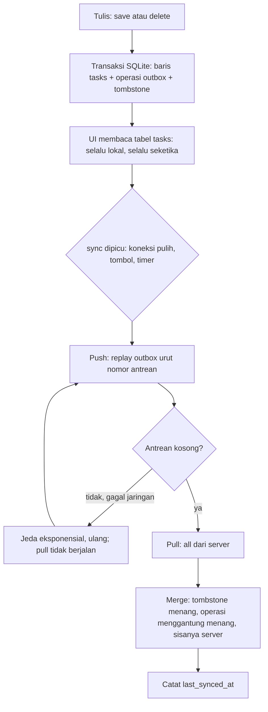

## Tujuan Pembelajaran

Bab 8 menutup dengan `SqliteTaskRepository`: tugas bertahan antar-restart, dan sebuah janji bahwa bab 10 akan memakai ulang lapisan itu untuk sinkronisasi. Bab 9 menutup dengan `ApiTaskRepository`: Tracker bisa bicara dengan Supabase, lengkap dengan sesi di penyimpanan aman dan hierarki error yang berarti. Bab ini menggabungkan keduanya, dan pekerjaannya bukan "panggil keduanya bergantian".

Penggabungan yang dilakukan dengan asal punya tiga penyakit klasik, dan ketiganya pernah hidup di versi lama bab ini. Penyakit pertama: **refresh yang menimpa**. Aplikasi menarik seluruh data server lalu mengosongkan tabel lokal dan mengisinya ulang, setiap tugas yang dibuat saat offline lenyap pada sinkronisasi pertama. Penyakit kedua: **hapus yang tidak berpesan**. Delete dijalankan di tabel lokal saja; server tidak pernah tahu; pull berikutnya memuat baris itu kembali, data yang dihapus pengguna hidup lagi. Penyakit ketiga: **semua kegagalan dianggap offline**. Token kedaluwarsa, payload ditolak, balasan rusak, dan jaringan putus masuk ke satu `catch` yang sama berlabel "mode offline", sementara fungsi `getUnsyncedTasks()` ada di codebase tapi tidak pernah dipanggil oleh siapa pun, replay tidak pernah terjadi.

Obat ketiganya bukan satu trik, tapi empat keputusan arsitektural yang saling menopang:

1. **Outbox transaksional**: setiap tulisan lokal menyimpan baris data dan operasi kirimnya dalam satu transaksi SQLite. Aplikasi mati sesaat setelahnya pun, operasinya tetap menggantung di antrean.
2. **Tombstone**: hapus lokal meninggalkan batu nisan, bukan kehampaan. Baris server untuk id yang bertombstone disaring saat merge dan tidak dibangkitkan hidup kembali.
3. **Push sebelum pull**: semua operasi menggantung dikirim lebih dulu; pull dan merge hanya berjalan setelah antrean kosong, sehingga tidak pernah ada data server yang menimpa tulisan lokal yang belum terkirim.
4. **Kebijakan konflik yang ditulis di muka**: siapa menang atas siapa ditetapkan sebelum kasusnya terjadi, lalu dibuktikan lewat pengujian.

Setelah menyelesaikan bab ini, Anda bisa:

1. Menggabungkan repository lokal dan remote menjadi satu sistem offline-first tanpa mengubah satu baris `TaskListController` bab 7.
2. Menaikkan skema SQLite ke versi 3 dengan tabel outbox, tombstones, dan sync_meta, tanpa menyentuh baris bab 8 yang sudah ada.
3. Menulis mesin sinkronisasi yang replay antrean secara berurutan, idempoten terhadap pengiriman ulang, dan mengulang kegagalan jaringan dengan jeda eksponensial.
4. Mendemonstrasikan minimal satu konflik nyata antar-perangkat dan menjelaskan siapa yang menang serta mengapa.
5. Memetakan tiap jenis kegagalan bab 9 ke tindakan sinkronisasi yang tepat: diulang, diberhentikan, atau diserahkan ke layar masuk.
6. Menguji semua janji di atas tanpa perangkat dan tanpa server sungguhan.

Sesi autentikasi tidak dibangun ulang: token tetap di penyimpanan aman dari bab 9, dan tidak ada satu byte pun yang pindah ke preferences di bab ini.

## Bentuk Akhir Sebelum Detail

Ada empat komponen baru dan semuanya punya tugas yang tidak saling direbutkan:

| Komponen                | Tugas tunggal                                                                 |
| ----------------------- | ----------------------------------------------------------------------------- |
| `OutboxStore`           | tulis transaksional (data + antrean + tombstone) dan merge hasil pull         |
| `SyncingTaskRepository` | menepati kontrak `TaskRepository` bab 2: baca lokal, tulis lokal-plus-antrean |
| `SyncEngine`            | protokol: push antrean, lalu pull dan merge, dengan ulang-jeda                |
| `ApiTaskRepository`     | transport ke server, tetap persis bab 9, tidak tahu outbox ada                |

Siklus penuhnya begini:



Satu konsekuensi arsitektural penting: **UI tidak pernah menunggu jaringan**. `all()` membaca SQLite dan selesai dalam hitungan milidetik; sinkronisasi berjalan di belakang dan hasilnya muncul sebagai pembaruan state berikutnya. Ini kebalikan dari aplikasi online-only bab 9, dan justru itulah arti offline-first: jaringan adalah penundaan yang diurus diam-diam, bukan gerbang di depan setiap layar.

## Checkpoint 1: Skema v3 dan OutboxStore

**Target:** skema SQLite naik ke versi 3 dengan tabel outbox, tombstones, dan sync_meta; setiap tulisan sync terjadi dalam transaksi; merge pull menerapkan kebijakan konflik.
**Waktu:** sekitar 50 menit.

### Tiga tabel baru, migrasi tambah-saja

`TaskDatabase` bab 8 sudah menyiapkan jalurnya: `onUpgrade` yang hanya menambah, `schemaVersion` sebagai konstanta publik. Versi 3 menambah tiga tabel tanpa menyentuh satu baris pun di tabel `tasks`:

```dart
// lib/data/task_database.dart: delta bab 10
class TaskDatabase {
  TaskDatabase({String? path}) : _customPath = path;

  /// v3 (bab 10): tabel outbox, tombstones, sync_meta.
  static const schemaVersion = 3;

  // ... koneksi tunggal dan close tetap bab 8 ...

  Future<void> _onCreate(Database db, int version) async {
    await db.execute('''
      CREATE TABLE tasks ( ... ) -- tetap persis bab 8
    ''');
    await _createSyncTables(db);
  }

  /// Tabel sinkronisasi bab 10: outbox (antrean operasi yang belum
  /// sampai ke server), tombstones (pengingat hapus supaya baris
  /// tidak hidup lagi dari pull), dan sync_meta (stempel sinkron
  /// terakhir). onCreate dan onUpgrade memakai jalur yang sama
  /// supaya skemanya tidak bisa berbeda.
  Future<void> _createSyncTables(Database db) async {
    await db.execute('''
      CREATE TABLE outbox (
        seq INTEGER PRIMARY KEY AUTOINCREMENT,
        op TEXT NOT NULL,
        task_id TEXT NOT NULL,
        payload TEXT,
        queued_at INTEGER NOT NULL
      )
    ''');
    await db.execute('''
      CREATE TABLE tombstones (
        task_id TEXT PRIMARY KEY,
        deleted_at INTEGER NOT NULL
      )
    ''');
    await db.execute('''
      CREATE TABLE sync_meta (
        key TEXT PRIMARY KEY,
        value TEXT NOT NULL
      )
    ''');
  }

  Future<void> _onUpgrade(Database db, int oldVersion, int newVersion) async {
    if (oldVersion < 2) {
      await db.execute('ALTER TABLE tasks ADD COLUMN note TEXT');
    }
    if (oldVersion < 3) {
      // Tabel baru tanpa menyentuh baris tasks yang sudah ada.
      await _createSyncTables(db);
    }
  }
}
```

Tiga keputusan di sini. `seq` adalah `AUTOINCREMENT` karena **urutan adalah bagian dari makna**: upsert lalu delete lalu upsert untuk id yang sama menghasilkan keadaan akhir yang berbeda bila diacak. `payload` menyimpan snapshot baris dalam JSON pada saat operasi diantrekan, bukan pada saat dikirim, sehingga edit berikutnya atas tugas yang sama mengantre sebagai operasi baru, bukan menimpa operasi lama yang mungkin sudah terkirim. Dan `tombstones` memakai `task_id` sebagai primary key: satu hapus yang belum dikonfirmasi cukup satu batu nisan.

### OutboxStore: tulis berpasangan atau tidak sama sekali

Class ini pemilik seluruh query ke tiga tabel baru. Prinsipnya satu kalimat: **perubahan data dan bukti niat mengirimnya tidak boleh terpisah**:

```dart
// lib/sync/outbox_store.dart
import 'dart:convert';

import 'package:sqflite/sqflite.dart';

import '../data/task_database.dart';

/// Jenis operasi yang menggantung di outbox (bab 10).
enum OutboxOp { upsert, delete }

/// Satu entri antrean outbox: operasi yang sudah diterapkan ke SQLite
/// lokal tetapi belum diterima server. `row` membawa snapshot baris
/// tugas saat operasi diantrekan (null untuk delete).
class OutboxEntry {
  const OutboxEntry({
    required this.seq,
    required this.op,
    required this.taskId,
    this.row,
  });

  final int seq;
  final OutboxOp op;
  final String taskId;
  final Map<String, Object?>? row;
}

/// Laporan hasil merge pull: berapa baris diterapkan dan berapa yang
/// disaring oleh kebijakan konflik.
class MergeReport {
  int applied = 0;
  int skippedPending = 0;
  int skippedTombstone = 0;
  int removedLocal = 0;
}

/// Pemilik tabel outbox, tombstones, dan sync_meta (bab 10). Semua
/// tulisan yang berpasangan: baris tugas + antrean operasi, hapus +
/// tombstone: berjalan dalam satu transaksi supaya aplikasi mati di
/// tengah jalan tidak pernah meninggalkan keadaan setengah.
class OutboxStore {
  OutboxStore(this._database);

  final TaskDatabase _database;

  /// Simpan baris tugas dan antrekan operasi upsert dalam SATU
  /// transaksi. Snapshot baris diambil saat antre: bukan saat kirim
  /// sehingga edit berikutnya mengantre sebagai operasi baru.
  Future<void> upsertWithOutbox(Map<String, Object?> row) async {
    final db = await _database.database;
    await db.transaction((txn) async {
      await txn.insert(
        'tasks',
        row,
        conflictAlgorithm: ConflictAlgorithm.replace,
      );
      await txn.insert('outbox', {
        'op': 'upsert',
        'task_id': row['id']! as String,
        'payload': jsonEncode(row),
        'queued_at': DateTime.now().millisecondsSinceEpoch,
      });
    });
  }

  /// Hapus baris tugas, tulis tombstone, dan antrekan operasi delete
  /// dalam SATU transaksi. Tombstone bertahan sampai server
  /// mengonfirmasi hapus: itulah yang mencegah pull membangkitkan
  /// baris yang sudah dihapus lokal.
  Future<void> deleteWithTombstone(String taskId) async {
    final db = await _database.database;
    await db.transaction((txn) async {
      await txn.delete('tasks', where: 'id = ?', whereArgs: [taskId]);
      await txn.insert(
        'tombstones',
        {
          'task_id': taskId,
          'deleted_at': DateTime.now().millisecondsSinceEpoch,
        },
        conflictAlgorithm: ConflictAlgorithm.replace,
      );
      await txn.insert('outbox', {
        'op': 'delete',
        'task_id': taskId,
        'payload': null,
        'queued_at': DateTime.now().millisecondsSinceEpoch,
      });
    });
  }

  /// Seluruh operasi yang belum sampai ke server, urut nomor antrean.
  Future<List<OutboxEntry>> pendingOps() async {
    final db = await _database.database;
    final rows = await db.query('outbox', orderBy: 'seq');
    return [
      for (final row in rows)
        OutboxEntry(
          seq: row['seq']! as int,
          op: row['op'] == 'delete' ? OutboxOp.delete : OutboxOp.upsert,
          taskId: row['task_id']! as String,
          row: row['payload'] == null
              ? null
              : _decodePayload(row['payload']! as String),
        ),
    ];
  }

  Map<String, Object?> _decodePayload(String raw) {
    final Object decoded;
    try {
      decoded = jsonDecode(raw);
    } on FormatException {
      // Payload antrean rusak: lebih baik gagal keras di sini daripada
      // mengirim baris setengah benar ke server.
      throw const FormatException('payload outbox bukan JSON');
    }
    if (decoded is Map<String, dynamic>) {
      return Map<String, Object?>.from(decoded);
    }
    throw const FormatException('payload outbox bukan objek');
  }

  /// Buang satu operasi yang sudah diterima server: per nomor antre,
  /// bukan per id: antrean boleh memuat beberapa operasi untuk id yang
  /// sama dan semuanya harus terkirim berurutan.
  Future<void> removeOp(int seq) async {
    final db = await _database.database;
    await db.delete('outbox', where: 'seq = ?', whereArgs: [seq]);
  }

  /// Id dengan operasi yang masih menggantung. Merge pull tidak boleh
  /// menimpa baris-baris ini (kebijakan konflik bab 10).
  Future<Set<String>> pendingTaskIds() async {
    final db = await _database.database;
    final rows = await db.query('outbox', columns: ['task_id']);
    return rows.map((row) => row['task_id']! as String).toSet();
  }

  /// Id yang dihapus lokal dan belum dikonfirmasi server.
  Future<Set<String>> tombstonedIds() async {
    final db = await _database.database;
    final rows = await db.query('tombstones', columns: ['task_id']);
    return rows.map((row) => row['task_id']! as String).toSet();
  }

  /// Hapus tombstone setelah server menerima operasi delete.
  Future<void> clearTombstone(String taskId) async {
    final db = await _database.database;
    await db.delete('tombstones', where: 'task_id = ?', whereArgs: [taskId]);
  }
```

Mengapa transaksi di sini bukan formalitas: tanpanya, `insert` baris lalu `insert` antrean adalah dua operasi terpisah. Aplikasi dibunuh sistem operasi di antara keduanya, kejadian sepele di mobile, meninggalkan baris tanpa operasi: data yang terlihat tersimpan tapi tidak akan pernah terkirim. Prinsip ini kebalikan dari `replaceAll` bab 8: di sana transaksi menjaga impor cadangan utuh; di sini transaksi menjaga niat tidak terpisah dari akibatnya.

### Merge: kebijakan konflik dalam bentuk kode

Method tersisa `OutboxStore` adalah tempat kebijakan konflik benar-benar hidup, bukan di dokumen desain:

```dart
// lib/sync/outbox_store.dart: kelanjutan
  /// Gabungkan baris hasil pull dengan tabel lokal sesuai kebijakan
  /// konflik bab 10, dalam satu transaksi:
  /// 1. tombstone mengalahkan baris server (delete menang);
  /// 2. operasi lokal yang menggantung mengalahkan baris server;
  /// 3. baris lokal tanpa operasi menggantung yang hilang dari server
  ///    berarti dihapus dari perangkat lain: ikut dihapus lokal.
  Future<MergeReport> mergeRemoteRows(
    List<Map<String, Object?>> remoteRows,
  ) async {
    final db = await _database.database;
    final report = MergeReport();
    await db.transaction((txn) async {
      final pending = await _pendingTaskIds(txn);
      final dead = await _tombstonedIds(txn);
      final remoteIds = <String>{};

      for (final row in remoteRows) {
        final id = row['id']! as String;
        remoteIds.add(id);
        if (dead.contains(id)) {
          report.skippedTombstone++;
          continue;
        }
        if (pending.contains(id)) {
          report.skippedPending++;
          continue;
        }
        await txn.insert(
          'tasks',
          row,
          conflictAlgorithm: ConflictAlgorithm.replace,
        );
        report.applied++;
      }

      final localRows = await txn.query('tasks', columns: ['id']);
      for (final local in localRows) {
        final id = local['id']! as String;
        final protected = pending.contains(id) || dead.contains(id);
        if (!remoteIds.contains(id) && !protected) {
          await txn.delete('tasks', where: 'id = ?', whereArgs: [id]);
          report.removedLocal++;
        }
      }
    });
    return report;
  }

  Future<Set<String>> _pendingTaskIds(DatabaseExecutor txn) async {
    final rows = await txn.query('outbox', columns: ['task_id']);
    return rows.map((row) => row['task_id']! as String).toSet();
  }

  Future<Set<String>> _tombstonedIds(DatabaseExecutor txn) async {
    final rows = await txn.query('tombstones', columns: ['task_id']);
    return rows.map((row) => row['task_id']! as String).toSet();
  }

  /// Stempel sinkron terakhir: informasi UI, bukan penentu benar-salah.
  Future<DateTime?> lastSyncedAt() async {
    final db = await _database.database;
    final rows = await db.query(
      'sync_meta',
      where: 'key = ?',
      whereArgs: ['last_synced_at'],
    );
    if (rows.isEmpty) return null;
    return DateTime.tryParse(rows.single['value']! as String);
  }

  Future<void> markSynced(DateTime at) async {
    final db = await _database.database;
    await db.insert(
      'sync_meta',
      {'key': 'last_synced_at', 'value': at.toIso8601String()},
      conflictAlgorithm: ConflictAlgorithm.replace,
    );
  }
}
```

Aturan ketiga sering dilupakan lalu mengejutkan: bila baris lokal **tanpa** operasi menggantung tidak muncul di hasil pull, satu-satunya penjelasan yang konsisten adalah baris itu dihapus dari perangkat lain, dan lokal harus mengikuti. Tanpa aturan ini, hapus tidak pernah menjalar antar-perangkat. Perhatikan siapa yang dilindungi: hanya baris dengan operasi menggantung atau tombstone. Baris yang "sekadar ada di lokal" tidak punya hak menang atas server.

**Validasi checkpoint:**

- Tambah tugas lalu periksa tabel `outbox` lewat `sqlite3` CLI: satu operasi `upsert` dengan payload JSON utuh. Hapus tugas lalu periksa `tombstones`: id-nya tercatat.
- Matikan-matikan aplikasi (kill dari recent apps) tepat setelah menekan simpan, lalu nyalakan lagi: antrean tetap memuat operasi itu, tidak ada tulisan yang hilang diam-diam.
- Instalasi lama versi 2 dari bab 8 dibuka dengan kode baru: `onUpgrade` menambah tiga tabel, seluruh baris `tasks` selamat.

## Checkpoint 2: SyncingTaskRepository: Kontrak yang Sama, Dunia yang Baru

**Target:** `SyncingTaskRepository implements TaskRepository`; `TaskListController` bab 7 tetap tidak berubah satu baris; seluruh tulisan lokal membawa operasi antrean.
**Waktu:** sekitar 25 menit.

Repository ini tipis dengan sengaja, seluruh pekerjaan berat sudah di `OutboxStore`:

```dart
// lib/sync/syncing_task_repository.dart
import '../data/sqlite_task_repository.dart';
import '../data/task_database.dart';
import '../models/task.dart';
import '../models/task_repository.dart';
import 'outbox_store.dart';

/// Repository offline-first (bab 10): SQLite adalah sumber kebenaran
/// yang dibaca UI, outbox menjamin setiap tulisan lokal punya
/// operasi terkirim ke server, dan remote hanya disentuh oleh
/// SyncEngine: bukan oleh operasi CRUD.
class SyncingTaskRepository implements TaskRepository {
  SyncingTaskRepository({
    required TaskDatabase database,
    required TaskRepository remote,
  }) : _local = SqliteTaskRepository(database),
       _store = OutboxStore(database),
       _remote = remote;

  final SqliteTaskRepository _local;
  final OutboxStore _store;
  final TaskRepository _remote;

  /// Antrean operasi yang belum sampai ke server: untuk SyncEngine
  /// dan indikator UI.
  OutboxStore get store => _store;

  /// Remote untuk SyncEngine; tidak dipakai operasi CRUD mana pun.
  TaskRepository get remote => _remote;

  /// Pemetaan baris-Task tetap satu tempat (bab 8); lapisan
  /// sinkronisasi meminjam lewat sini.
  Map<String, Object?> taskToRow(Task task) => _local.taskToRow(task);

  Task taskFromRow(Map<String, Object?> row) => _local.taskFromRow(row);

  @override
  Future<List<Task>> all() => _local.all();

  @override
  Future<void> save(Task task) =>
      _store.upsertWithOutbox(_local.taskToRow(task));

  @override
  Future<void> delete(String id) => _store.deleteWithTombstone(id);
}
```

Satu delta kecil terhadap bab 8: pemetaan baris di `SqliteTaskRepository` diangkat menjadi publik, `taskToRow` dan `taskFromRow`, karena lapisan sinkronisasi membutuhkannya untuk membuat snapshot antrean dan membaca antrean kembali. Pemetaannya tidak berpindah tempat dan tidak digandakan; ia sekadar buka untuk satu konsumen baru.

Pola yang perlu dicermati ada di `save` dan `delete`: **tidak ada satu pun baris di sini yang menyentuh jaringan**. Menyimpan tugas saat mode pesawat punya harga yang sama dengan menyimpannya saat Wi-Fi kencang: satu transaksi SQLite. Konsekuensinya, `TaskListController` bab 7, yang mengira setiap repository selesai `all`/`save`/`delete` dalam sekejap, tetap benar sepenuhnya. Perbedaan dunianya hanya satu: ada kelas lain yang bertanggung jawab menyampaikan tulisan itu ke server, dan kelas itu tidak dijalankan di jalur UI.

Batasnya juga jujur: karena antrean mengikuti urutan waktu, dua edit cepat atas tugas yang sama menghasilkan dua operasi, baris akhirnya benar, biayanya dua permintaan. Konsolidasi antrean (menggabungkan operasi berurutan untuk id sama saat antrean masih panjang) adalah optimasi yang sah; ia sengaja tidak ditulis di sini supaya kebenaran replay terlihat polos.

**Validasi checkpoint:**

- Ganti wiring `main.dart` dari `SqliteTaskRepository` ke `SyncingTaskRepository` (bagian perakitan di bawah): seluruh alur UI, tambah, centang, hapus, berjalan sama, offline sekalipun.
- Jalankan dengan mode pesawat sejak awal, tambah tiga tugas, restart aplikasi: ketiganya ada, dan antrean memuat tiga operasi menunggu.
- Ganti `all()` dengan versi yang memanggil API langsung lalu rasakan bedanya: layar menunggu spinner. Kembalikan, itulah inti bab ini dalam satu baris kode.

## Checkpoint 3: SyncEngine: Push Sebelum Pull

**Target:** satu putaran sinkronisasi mengirim seluruh antrean berurutan, idempoten terhadap replay, lalu pull dan merge; kegagalan dipetakan ke tindakan yang benar; ulang dengan jeda eksponensial.
**Waktu:** sekitar 50 menit.

```dart
// lib/sync/sync_engine.dart
import 'dart:math';

import '../api/api_exception.dart';
import '../models/task_repository.dart';
import 'outbox_store.dart';
import 'syncing_task_repository.dart';

/// Status sinkron yang layak ditampilkan UI.
enum SyncStatus { idle, syncing, offline, needsSignIn, failed }

/// Hasil satu putaran sinkronisasi: apa yang terkirim, apa yang
/// diterima, dan kegagalan bila ada.
class SyncReport {
  int pushedOps = 0;
  int appliedRows = 0;
  int skippedPending = 0;
  int skippedTombstone = 0;
  int removedLocal = 0;
  ApiException? error;
  SyncStatus status = SyncStatus.idle;
}

/// Mesin sinkronisasi bab 10: push semua operasi outbox lebih dulu,
/// baru pull dan merge. Ulang dengan jeda eksponensial untuk kegagalan
/// yang wajar dicoba lagi (jaringan, timeout, 5xx, 429); berhenti
/// untuk kegagalan yang menuntut tindakan lain (sesi habis, payload
/// ditolak server).
class SyncEngine {
  SyncEngine({
    required SyncingTaskRepository repository,
    this.maxAttempts = 4,
    this.initialDelay = const Duration(seconds: 1),
    this.maxDelay = const Duration(seconds: 30),
    Future<void> Function(Duration)? sleeper,
  }) : _repository = repository,
       _store = repository.store,
       _remote = repository.remote,
       _sleep = sleeper ?? Future.delayed;

  final SyncingTaskRepository _repository;
  final OutboxStore _store;
  final TaskRepository _remote;
  final int maxAttempts;
  final Duration initialDelay;
  final Duration maxDelay;
  final Future<void> Function(Duration) _sleep;

  /// Jeda percobaan ulang: eksponensial dari initialDelay, dipatok
  /// maxDelay. Produksi menambah jitter acak supaya ribuan klien
  /// yang gagal bersamaan tidak menyerang server pada detik yang
  /// sama (thundering herd).
  Duration nextDelay(int attempt) {
    final growth = pow(2, attempt - 1);
    final milliseconds = (initialDelay.inMilliseconds * growth).round();
    return Duration(milliseconds: min(milliseconds, maxDelay.inMilliseconds));
  }

  /// Satu putaran penuh: push lalu pull. Pull tidak pernah berjalan
  /// bila push belum tuntas: menarik data server sambil masih ada
  /// tulisan lokal yang belum terkirim adalah resep saling menimpa.
  Future<SyncReport> sync() async {
    final report = SyncReport()..status = SyncStatus.syncing;

    final pushed = await _push(report);
    if (!pushed) return report;

    try {
      final remoteTasks = await _remote.all();
      final merge = await _store.mergeRemoteRows([
        for (final task in remoteTasks) _repository.taskToRow(task),
      ]);
      report
        ..appliedRows = merge.applied
        ..skippedPending = merge.skippedPending
        ..skippedTombstone = merge.skippedTombstone
        ..removedLocal = merge.removedLocal;
      await _store.markSynced(DateTime.now());
      report.status = SyncStatus.idle;
    } on ApiException catch (error) {
      // Pull gagal: push sudah tuntas sehingga tidak ada tulisan
      // lokal yang berisiko hilang: cukup laporkan, pull berikutnya
      // menyusul.
      report
        ..error = error
        ..status = SyncStatus.offline;
    }
    return report;
  }
```

Baris `if (!pushed) return report;` adalah keputusan termahal di bab ini dalam lima kata. Versi lama menarik data server kapan pun koneksi kelihatan ada; hasilnya suntingan offline tertimpa baris server yang belum tahu suntingan itu. Dengan push-dulu, satu-satunya momen merge berjalan adalah saat antrean kosong, dan meski begitu, merge tetap memeriksa operasi menggantung (aturan kedua kebijakan konflik), karena antrean bisa saja mendapat entri baru dari ketukan pengguna di tengah putaran sinkronisasi yang sedang berjalan.

Replay-nya sendiri:

```dart
// lib/sync/sync_engine.dart: kelanjutan
  /// Replay outbox ke server. Operasi dihapus dari antrean satu per
  /// satu setelah diterima; aplikasi mati setelah kirim tapi sebelum
  /// penghapusan hanya menyebabkan pengiriman ulang operasi yang
  /// sama: aman karena upsert dan delete idempoten.
  Future<bool> _push(SyncReport report) async {
    for (var attempt = 1; attempt <= maxAttempts; attempt++) {
      if (attempt > 1) {
        await _sleep(nextDelay(attempt - 1));
      }
      try {
        while (true) {
          final ops = await _store.pendingOps();
          if (ops.isEmpty) break;
          for (final op in ops) {
            switch (op.op) {
              case OutboxOp.upsert:
                await _remote.save(_repository.taskFromRow(op.row!));
              case OutboxOp.delete:
                await _remote.delete(op.taskId);
            }
            await _store.removeOp(op.seq);
            report.pushedOps++;
            if (op.op == OutboxOp.delete) {
              await _store.clearTombstone(op.taskId);
            }
          }
        }
        return true;
      } on ApiException catch (error) {
        if (!_retryable(error)) {
          report
            ..error = error
            ..status = error is SessionExpired || error is NotSignedIn
                  ? SyncStatus.needsSignIn
                  : SyncStatus.failed;
          return false;
        }
        if (attempt == maxAttempts) {
          report
            ..error = error
            ..status = SyncStatus.offline;
          return false;
        }
      }
    }
    return false;
  }

  /// Kezaliman yang wajar dicoba ulang: kegagalan dunia fisik dan
  /// tekanan server. Kezaliman lain: sesi habis, payload ditolak,
  /// balasan rusak: tidak akan membaik dengan diulang.
  bool _retryable(ApiException error) =>
      error is NetworkFailure ||
      error is RequestTimeout ||
      error is TooManyRequests ||
      error is ServerError;
}
```

Tiga properti replay yang membuatnya bisa dipercaya. **Idempoten**: `ApiTaskRepository.save` bab 9 memakai upsert `on_conflict=id` dan `delete` memakai filter id, mengirim operasi yang sama dua kali berakhir di keadaan yang sama. Ini yang membuat "server sudah menerima tapi jawaban hilang di jaringan" menjadi kasus membosankan, bukan bencana. **Berurutan**: operasi diproses menaik `seq`, jadi delete yang diikuti upsert untuk id yang sama tiba di server dengan makna yang benar. **Berhenti yang tepat**: kegagalan non-retryable tidak dibantai dengan ulangan, antrean dibiarkan utuh dan statusnya jujur.

Pemetaan kegagalan bab 9 ke tindakan sinkronisasi, lengkap:

| Kegagalan                | Jenis (bab 9)     | Tindakan SyncEngine                                   | Status akhir  |
| ------------------------ | ----------------- | ----------------------------------------------------- | ------------- |
| Jaringan putus / timeout | transport         | ulang dengan jeda eksponensial sampai batas           | `offline`     |
| 429 / 5xx                | tekanan server    | ulang dengan jeda; produksi menghormati `Retry-After` | `offline`     |
| 401 tak kunjung sehat    | sesi              | berhenti; antrean aman menunggu masuk lagi            | `needsSignIn` |
| Payload ditolak (422)    | validasi          | berhenti; butuh perbaikan data, bukan pengulangan     | `failed`      |
| 403 / balasan rusak      | kebijakan/kontrak | berhenti; laporkan apa adanya                         | `failed`      |

Kolom terakhir bukan hiasan: `needsSignIn` yang bisa dipercaya berarti UI cukup beralih ke layar masuk, dan setelah pengguna masuk kembali, sinkronisasi berikutnya menemukan antrean yang masih utuh. Bandingkan dengan versi lama yang menganggap semua ini "offline", pengguna menatap indikator tersinkron yang bohong sementara tulisannya tidak ke mana-mana.

**Validasi checkpoint:**

- Saat online: tambah tugas, tunggu sinkronisasi, periksa `outbox` kosong dan `sync_meta` berisi stempel waktu baru.
- Putus jaringan, tambah dua tugas, tekan sinkron: status `offline`, antrean berisi dua operasi. Pulihkan jaringan, tekan sinkron: antrean kosong, tugas muncul di dashboard Supabase.
- Keluar lalu biarkan akses token kedaluwarsa (atau hapus sesi dari vault saat debugging), tekan sinkron: status `needsSignIn`, antrean tetap berisi operasi.

## Kebijakan Konflik yang Ditulis di Muka

Konflik sinkronisasi bukan pertanyaan apakah, tapi kapan. Kebijakan bab ini tiga kalimat, semuanya sudah hidup di `mergeRemoteRows`:

1. **Operasi lokal yang menggantung mengalahkan baris server.** Tulisan yang belum terkirim tidak boleh dikalahkan oleh data yang ditarik.
2. **Delete mengalahkan update.** Baris yang dihapus pengguna tidak dibangkitkan hidup kembali oleh pull; sebaliknya, push akan menghapusnya di server.
3. **Untuk sisanya, server menang.** Baris yang sudah tersinkron mengikuti keadaan global, termasuk hapus yang terjadi di perangkat lain.

Demonstrasi konflik yang pertama, jalannya begini. Ponsel dalam mode pesawat menyunting judul tugas "Kirim laporan" menjadi "Kirim laporan Q3", operasi upsert menggantung di antrean. Sementara itu, laptop menyunting tugas yang sama lewat aplikasi, dan server kini menyimpan versi laptop. Ponsel kembali online dan sinkronisasi berjalan:

- Push mengirim versi ponsel lebih dulu; upsert `on_conflict=id` menimpa versi laptop di server.
- Pull kemudian mengembalikan baris, yang kini versi ponsel sendiri; merge menerapkannya tanpa drama.
- Versi laptop kalah total. Bukan karena salah, tapi karena kebijakan memilih satu pemenang dan yang menyinkronkan terakhir adalah ponsel.

Demonstrasi kedua, yang paling sering dijual murah oleh tutorial: ponsel menghapus tugas saat offline. Pull mengembalikan baris itu dari server, server memang belum tahu. Aturan kedua menolaknya: tombstone menyaring baris dari merge, lalu push mengirim delete ke server. Baris tidak hidup lagi, di kedua sisi.

Kejujuran soal batas juga bagian dari kebijakan. Pemenang aturan pertama ditentukan oleh urutan antrean, bukan oleh perbandingan isi: dua edit pada field yang berbeda tetap saling menimpa utuh, dan edit yang kalah benar-benar hilang. Untuk aplikasi satu-pengguna-dengan-banyak-perangkat seperti Tracker, ini pertukaran yang masuk akal, resolusi per-field butuh `updated_at` per kolom, dan resolusi tanpa kekalahan (CRDT) butuh struktur data yang jauh lebih berat dari SQLite tabel. Kebijakan yang eksplisit dan sederhana mengalahkan kebijakan canggih yang tidak ditulis di mana-mana.

## Merakit Ulang Tracker

Seluruh delta bab ini terhadap aplikasi acuan:

| Perubahan     | File                                    | Isi                                                |
| ------------- | --------------------------------------- | -------------------------------------------------- |
| Diubah        | `lib/data/task_database.dart`           | skema v3: tabel outbox, tombstones, sync_meta      |
| Diubah kecil  | `lib/data/sqlite_task_repository.dart`  | `taskToRow`/`taskFromRow` dipublikasikan           |
| Baru          | `lib/sync/outbox_store.dart`            | tulis transaksional + merge + stempel sinkron      |
| Baru          | `lib/sync/syncing_task_repository.dart` | kontrak `TaskRepository` versi offline-first       |
| Baru          | `lib/sync/sync_engine.dart`             | push-sebelum-pull, ulang-jeda, pemetaan kegagalan  |
| Diubah        | `lib/main.dart`                         | wiring produksi: gabungkan bab 8 dan bab 9         |
| Tidak berubah | `lib/state/task_list_controller.dart`   | controller bab 7 tetap utuh, kontrak tetap kontrak |
| Tidak berubah | `lib/api/*`                             | seluruh lapisan bab 9 dipakai apa adanya           |

Titik temu di `main.dart`, perhatikan tidak ada satu baris pun yang menyentuh preferences untuk kebutuhan sinkronisasi; sesi tetap urusan vault bab 9:

```dart
// lib/main.dart: wiring produksi bab 10
final client = http.Client();
final sessions = SessionStore(SecureVault());
final auth = AuthApi(
  client: client,
  baseUrl: supabaseUrl,
  apiKey: supabaseAnonKey,
  sessionStore: sessions,
);
final database = TaskDatabase();
final repository = SyncingTaskRepository(
  database: database,
  remote: ApiTaskRepository(
    client: client,
    auth: auth,
    baseUrl: supabaseUrl,
    apiKey: supabaseAnonKey,
  ),
);
final syncEngine = SyncEngine(repository: repository);
```

`TaskListController` menerima `repository` lewat constructor seperti biasa, ia tidak tahu bahwa di balik kontrak yang sama kini ada SQLite, outbox, dan REST. Memicu sinkronisasi dari UI cukup satu pemanggilan:

```dart
// lib/state/sync_controller.dart: pembungkus tipis untuk UI
class SyncController extends ChangeNotifier {
  SyncController({required SyncEngine engine}) : _engine = engine;

  final SyncEngine _engine;

  SyncStatus _status = SyncStatus.idle;
  int _pending = 0;

  SyncStatus get status => _status;
  int get pending => _pending;

  Future<void> sync() async {
    final report = await _engine.sync();
    _status = report.status;
    _pending = 0; // dihitung ulang lewat store bila UI memerlukan.
    notifyListeners();
  }
}
```

Pemicu sinkronisasi di sisi ini, tombol manual, pemulihan koneksi, timer, dan langganan perubahan server, dibahas tersendiri di bagian "Pemicu Sinkronisasi" menjelang akhir bab.

## Menguji Tanpa Perangkat

Pola pengujian sama dengan bab 8 dan 9: `sqflite_common_ffi` menjalankan SQLite sungguhan di proses Dart, dan remote digantikan oleh `ScriptedRemote`, repository palsu yang jawabannya diprogram per panggilan. Properti yang dipegangnya: elemen skrip non-null berarti lemparan, dan `applyBeforeThrow` menyimulasikan server yang sudah menerapkan operasi lalu jawabannya hilang:

```dart
// test/sync/sync_engine_test.dart: remote palsu, intinya
class ScriptedRemote implements TaskRepository {
  ScriptedRemote({
    this.saveScript,
    this.deleteScript,
    this.allScript,
    this.applyBeforeThrow = false,
  });

  final List<Object?>? saveScript;
  final List<Object?>? deleteScript;
  final List<Object?>? allScript;
  final bool applyBeforeThrow;

  final Map<String, Task> tasksById = {};
  final List<String> log = [];
  int saveCalls = 0;
  int deleteCalls = 0;
  int allCalls = 0;

  @override
  Future<void> save(Task task) async {
    saveCalls++;
    log.add('save:${task.id}');
    final index = saveCalls - 1;
    if (saveScript != null && index < saveScript!.length) {
      final failure = saveScript![index];
      if (failure != null) {
        if (applyBeforeThrow) tasksById[task.id] = task;
        throw failure;
      }
    }
    tasksById[task.id] = task;
  }

  // all() dan delete() mengikuti pola yang sama.
}
```

Dengan remote begini, seluruh janji awal bab menjadi asersi yang bisa merah. Kasus replay setelah koneksi pulih, create, update, dan delete offline semuanya sampai, berurutan:

```dart
test('create/update/delete offline terkirim semua setelah online', () async {
  final remote = ScriptedRemote(
    allScript: [const NetworkFailure()], // pull pertama gagal
  );
  final (database, repository, _, engine) = await harness(remote);

  await repository.save(task('t-1', 'Belajar Flutter'));
  await repository.save(task('t-1', 'Belajar Flutter (edisi baru)'));
  await repository.save(task('t-2', 'Kirim laporan'));
  await repository.delete('t-2');

  final failed = await engine.sync();
  expect(failed.status, SyncStatus.offline);
  expect(failed.pushedOps, 4); // push tuntas; pull-lah yang gagal.

  remote.allScript!.clear(); // koneksi pulih
  final report = await engine.sync();

  expect(report.status, SyncStatus.idle);
  expect(remote.log, ['save:t-1', 'save:t-1', 'save:t-2', 'delete:t-2']);
  expect(remote.tasksById.keys, {'t-1'}); // t-2 benar-benar terhapus.
  expect(await repository.store.pendingOps(), isEmpty);
});
```

Dan kasus idempotensi, server menerapkan lalu jawabannya hilang, replay tidak menduplikasi:

```dart
test('server menerapkan lalu jawaban hilang: ulang tidak menduplikasi',
    () async {
  final remote = ScriptedRemote(
    saveScript: [const NetworkFailure()],
    applyBeforeThrow: true,
  );
  final (database, repository, _, engine) = await harness(remote);

  await repository.save(task('t-1', 'Terkirim tapi gagal tercatat'));
  final report = await engine.sync();

  expect(remote.saveCalls, 2); // kirim ulang sekali.
  expect(remote.tasksById, hasLength(1)); // tidak menduplikasi.
  expect(await repository.store.pendingOps(), isEmpty);
});
```

Kelompok lengkapnya di fixture repositori contoh:

| Kelompok         | Kasus                                                                                               |
| ---------------- | --------------------------------------------------------------------------------------------------- |
| Skema v3         | instalasi baru punya tiga tabel; migrasi v2→v3 tanpa kehilangan baris                               |
| Enqueue          | save menulis baris + operasi; delete menulis hapus + tombstone; urutan antrean dijaga               |
| Replay           | semua operasi offline terkirim setelah pulih; urutan `save/delete/save` benar; antrean kosong       |
| Idempotensi      | upsert terkirim dua kali = satu baris; delete dua kali = satu hasil                                 |
| Ulang-jeda       | dua gagal lalu sukses: jeda 1× dan 2× initialDelay, dipatok maxDelay; InvalidPayload tak diulang    |
| Tombstone        | delete offline tidak dibangkitkan pull; tombstone bertahan selama push gagal, bersih setelah sukses |
| Konflik          | operasi menggantung tidak tertimpa merge; push menimpa server; hapus dari perangkat lain menjalar   |
| Sesi kedaluwarsa | SessionExpired: antrean dipertahankan, pull tidak berjalan, status `needsSignIn`                    |

Tujuh belas test baru menjalani jalur yang sama dengan 67 test bab-bab sebelumnya, tanpa perangkat, tanpa akun sungguhan, dalam hitungan detik. Test tombstone layak dibaca ulang karena paling sering dijual murah: ia membuktikan dua fase (gagal lalu pulih) sekaligus, baris tetap mati di lokal ketika push belum sampai, dan tetap mati setelah server mengonfirmasi.

## Pemicu Sinkronisasi

`SyncEngine` tahu cara menyinkronkan, tetapi tidak tahu kapan. Sejauh ini `sync()` dipanggil dari pengujian dan dari tangan Anda sendiri. Produksi memakai tiga pemicu, dan ketiganya memanggil method yang sama; pemicu memang hanyalah selera, sedangkan protokolnya sudah selesai.

Tambahkan `connectivity_plus` ke `pubspec.yaml`, lalu:

```dart
// lib/sync/sync_triggers.dart
import 'dart:async';

import 'package:connectivity_plus/connectivity_plus.dart';

import 'sync_engine.dart';

/// Memutuskan kapan sync() dipanggil. Tidak tahu apa-apa soal outbox
/// maupun protokol; satu-satunya wewenangnya adalah menekan tombol.
class SyncTriggers {
  SyncTriggers(this._engine);

  final SyncEngine _engine;
  StreamSubscription<List<ConnectivityResult>>? _connectivity;
  Timer? _periodic;

  void start() {
    // 1. Koneksi pulih. Pemicu paling berguna: antrean biasanya
    //    menumpuk justru karena jaringan tadi mati.
    _connectivity = Connectivity().onConnectivityChanged.listen((results) {
      final online = results.any((r) => r != ConnectivityResult.none);
      if (online) unawaited(_engine.sync());
    });

    // 2. Jaring pengaman. Menangkap kasus jaringan tidak pernah benar
    //    -benar putus tetapi permintaan gagal, misalnya server sedang
    //    sibuk dan percobaan ulang sudah menyerah.
    _periodic = Timer.periodic(
      const Duration(minutes: 15),
      (_) => unawaited(_engine.sync()),
    );
  }

  // 3. Tombol di app bar memanggil _engine.sync() langsung.

  void dispose() {
    _connectivity?.cancel();
    _periodic?.cancel();
  }
}
```

`sync()` aman dipanggil berkali-kali: replay bersifat idempoten karena bergantung pada upsert `on_conflict=id`, dan `SyncEngine` menolak putaran kedua selama putaran pertama masih berjalan. Ketiga pemicu boleh menyala bersamaan tanpa saling merusak, dan sifat itu bukan kebetulan, melainkan hasil dari keputusan protokol di Checkpoint 3.

Satu keputusan wiring lain yang wajib: **keluar akun membersihkan database lokal**, `database` baru atau `DELETE FROM` atas keempat tabel. Baris milik akun lama tidak berhak terbaca oleh sesi akun berikutnya di perangkat yang sama.

## Dari Menarik Menjadi Didorong

Ketiga pemicu di atas punya satu sifat yang sama: aplikasi menebak kapan sebaiknya bertanya ke server. Pada aplikasi satu pengguna, tebakan itu memadai. Pada aplikasi yang datanya berubah dari tempat lain, misalnya tugas yang sama dibuka di ponsel dan di laptop, tebakan yang baik pun terasa lambat: perubahan di laptop baru muncul di ponsel pada putaran berikutnya.

Jawabannya adalah membalik arah. Alih-alih aplikasi menanyai server, server memberi tahu aplikasi. Supabase menyediakannya lewat langganan perubahan tabel; di baliknya ada WebSocket yang tetap terbuka.

```dart
// Pemicu keempat: server memberi tahu, aplikasi menyinkronkan.
final channel = supabase
    .channel('public:tasks')
    .onPostgresChanges(
      event: PostgresChangeEvent.all,
      schema: 'public',
      table: 'tasks',
      callback: (payload) => unawaited(_engine.sync()),
    )
    .subscribe();
```

Perhatikan apa yang **tidak** berubah. Callback tidak menyentuh SQLite, tidak menulis baris dari payload, tidak menyalip antrean. Ia memanggil `sync()`, persis seperti tombol di app bar. Seluruh arsitektur bab ini, outbox, tombstone, push sebelum pull, kebijakan konflik, tetap menjadi satu-satunya jalan data masuk.

Godaan untuk "menghemat satu putaran" dengan menulis payload langsung ke tabel lokal sangat kuat, dan hampir selalu keliru: payload itu tidak melewati kebijakan konflik Anda, sehingga ia bisa menimpa perubahan lokal yang masih mengantre, dan Anda memperoleh kembali penyakit pertama yang dibasmi bab ini, yaitu refresh yang menimpa. Realtime adalah **pemicu yang lebih baik**, bukan jalur data yang kedua.

## Batas Bab Ini

Dua hal sengaja tidak dibahas.

**Sinkronisasi di latar belakang saat aplikasi tertutup.** Menjalankan pekerjaan berkala saat aplikasi tidak dibuka menuntut penjadwal sistem, dan di Android modern ia berhadapan dengan Doze, pembatasan per pabrikan, dan aturan target API yang dianut bab 14. Biayanya besar, perilakunya berbeda-beda antarperangkat, dan nyaris tidak ada aplikasi produktivitas yang benar-benar membutuhkannya: sinkronisasi saat aplikasi dibuka sudah menyelesaikan masalah penggunanya. Bila Anda memang membutuhkannya, masuki lewat `workmanager` dan bacalah dokumentasi batasan platformnya lebih dulu, bukan contoh kodenya.

**Delta pull.** `sync()` menarik seluruh baris milik pengguna setiap putaran. Untuk ribuan baris ini boros. Perbaikannya lurus, yaitu menarik hanya yang `updated_at` melampaui `last_synced_at` yang sudah Anda simpan di `sync_meta`, tetapi menuntut jaminan jam server yang tidak ingin dicampurkan bab ini ke dalam penjelasan protokolnya.

## Ringkasan

- Offline-first bukan "simpan lokal plus coba kirim": empat penyakitnya, refresh menimpa, hapus tanpa kabar, semua error dianggap offline, replay yang tak pernah dipakai, disembuhkan oleh empat keputusan: outbox transaksional, tombstone, push sebelum pull, kebijakan konflik eksplisit.
- Skema naik ke v3 dengan tabel `outbox`, `tombstones`, `sync_meta`; migrasi hanya menambah, baris bab 8 selamat, dan `onCreate`/`onUpgrade` berbagi jalur yang sama.
- Data dan niat mengirimnya ditulis dalam satu transaksi; aplikasi yang mati di tengah hanya menyisakan antrean yang jujur, bukan tulisan yang hilang diam-diam.
- `SyncingTaskRepository` menepati kontrak bab 2 sehingga controller bab 7 tetap tidak berubah; UI tidak pernah menunggu jaringan.
- Replay idempoten karena bergantung pada upsert `on_conflict=id` dan delete filter id dari bab 9; pengiriman ulang adalah kejadian membosankan.
- Kegagalan dipetakan: jaringan dan tekanan server diulang dengan jeda eksponensial; sesi habis berhenti dengan antrean aman; payload ditolak berhenti tanpa pengulangan buta.
- Kebijakan konflik tiga kalimat, operasi menggantung menang, delete menang, sisanya server, hidup di kode merge dan dibuktikan oleh test, bukan oleh keberuntungan.
- Sesi dan token tetap persis bab 9: blob JSON di penyimpanan aman; tidak ada yang pindah ke preferences.
- Pemicu sinkronisasi, termasuk langganan perubahan server secara real-time, hanya menekan tombol `sync()` yang sama; menulis payload realtime langsung ke tabel lokal akan melewati kebijakan konflik dan memulangkan penyakit refresh-yang-menimpa.

Tracker kini utuh sebagai aplikasi: UI bab 3–7, penyimpanan bab 8, jaringan bab 9, dan sinkronisasi bab ini. Bab 11 beralih dari fitur ke ketahanan, menguji semua lapisan ini secara sistematis.

## Referensi Cepat

Satu putaran sinkronisasi dari sisi kontrak:

```text
save(task)      → transaksi: INSERT/REPLACE tasks + INSERT outbox (upsert)
delete(id)      → transaksi: DELETE tasks + INSERT tombstones + INSERT outbox (delete)
all()           → SELECT tasks (lokal, tanpa jaringan)
sync()          → push: replay outbox berurutan
                  pull: all() remote → mergeRemoteRows → markSynced
```

Pemetaan kegagalan ke tindakan:

```dart
switch (report.status) {
  case SyncStatus.idle:
    // antrean kosong, data menyatu; tampilkan "tersinkron"
  case SyncStatus.offline:
    // jaringan/tekanan server: ulang nanti; antrean aman
  case SyncStatus.needsSignIn:
    // sesi habis: arahkan masuk lagi; antrean menunggu
  case SyncStatus.failed:
    // payload/kebijakan: periksa report.error.message
  case SyncStatus.syncing:
    // sedang berjalan
}
```

Jeda percobaan ulang: `initialDelay * 2^(attempt-1)`, dipatok `maxDelay`, plus jitter di produksi.

## Bekerja dengan AI di Bab Ini

**Pantas didelegasikan:** menanyakan pola sinkronisasi yang umum dipakai, dan meminta pembanding strategi penyelesaian konflik.

**Tulis sendiri:** kebijakan konflik Anda. "Siapa yang menang saat dua perangkat mengubah baris yang sama" adalah keputusan produk yang berakibat pada data pengguna; jawaban umum yang sopan dari AI tidak menanggung akibat itu. Bagian ini yang menentukan apakah bab ini benar-benar Anda kuasai.

**Latihan:** Ceritakan arsitektur outbox bab ini kepada AI dan minta ia mengusulkan penyederhanaan. Kemungkinan besar ia menawarkan penulisan langsung ke server dengan cadangan lokal, yang lebih pendek dan lebih mudah dibaca. Telusuri usul itu terhadap tiga penyakit di awal bab dan tunjukkan penyakit mana yang kembali. Ini latihan menolak saran yang benar-benar lebih sederhana, tetapi salah.

## Referensi Lanjutan

- Pola transactional outbox beserta alasannya di sistem terdistribusi: https://microservices.io/patterns/data/transactional-outbox.html
- Sinkronisasi lanjutan di Supabase, termasuk delta pull dan replikasi real-time sebagai perkembangan dari arsitektur bab ini: https://supabase.com/docs/guides/realtime/postgres-changes
- `sqflite` untuk transaksi dan batch, dipakai outbox bab ini: https://pub.dev/packages/sqflite
- `connectivity_plus` untuk memicu sinkronisasi saat jaringan muncul kembali: https://pub.dev/packages/connectivity_plus
- Konflik sinkronisasi dan resolusinya (last-write-wins, CRDT), peta jalan kebijakan yang lebih kaya: https://martin.kleppmann.com/2015/05/11/please-stop-calling-databases-cp-or-ap.html
- SQLite UPSERT (`ON CONFLICT DO UPDATE`) yang menjadi dasar idempotensi replay: https://www.sqlite.org/lang_UPSERT.html
