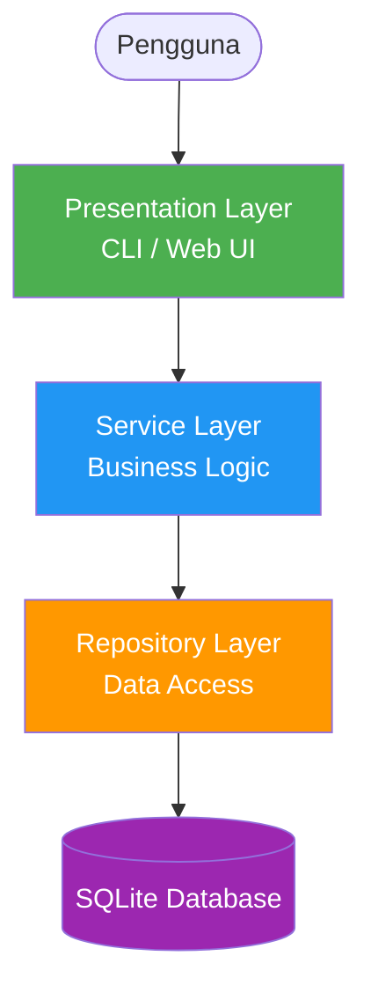
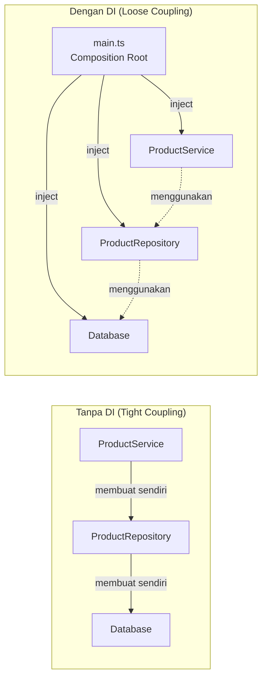
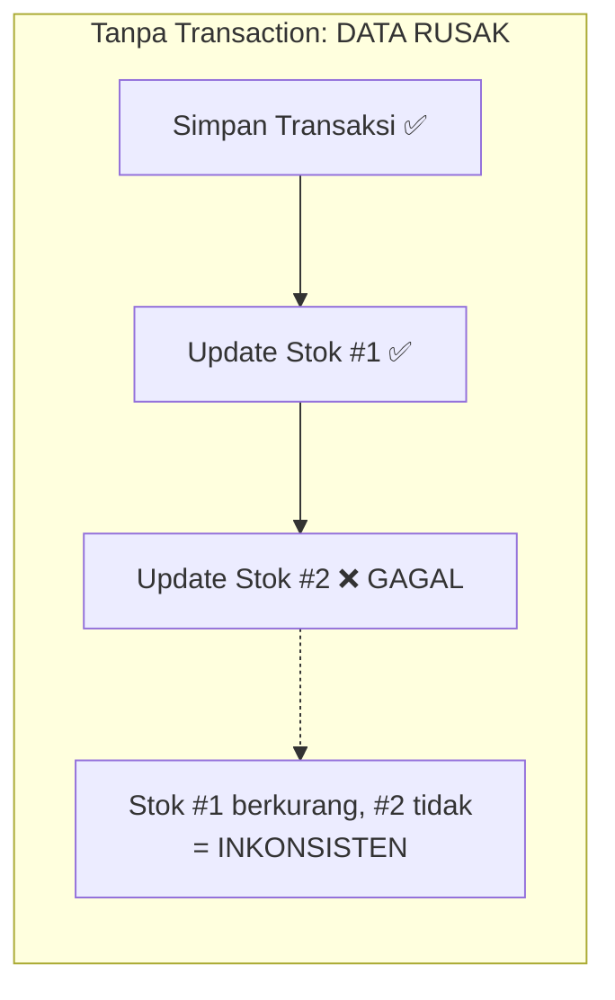
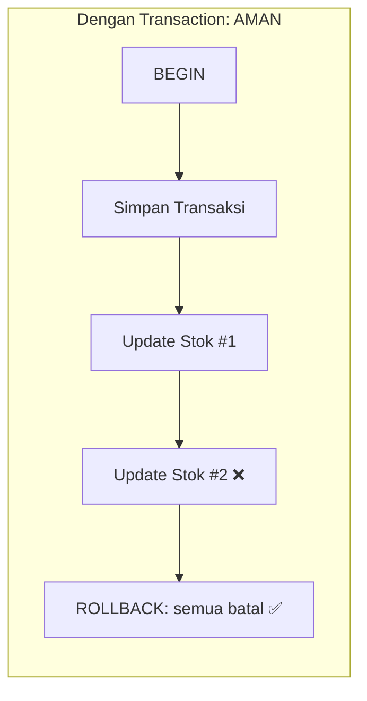
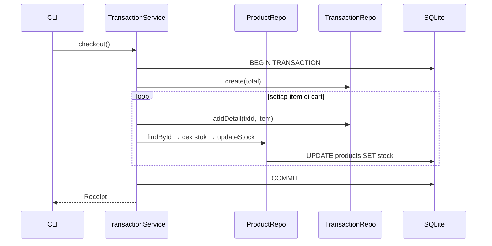
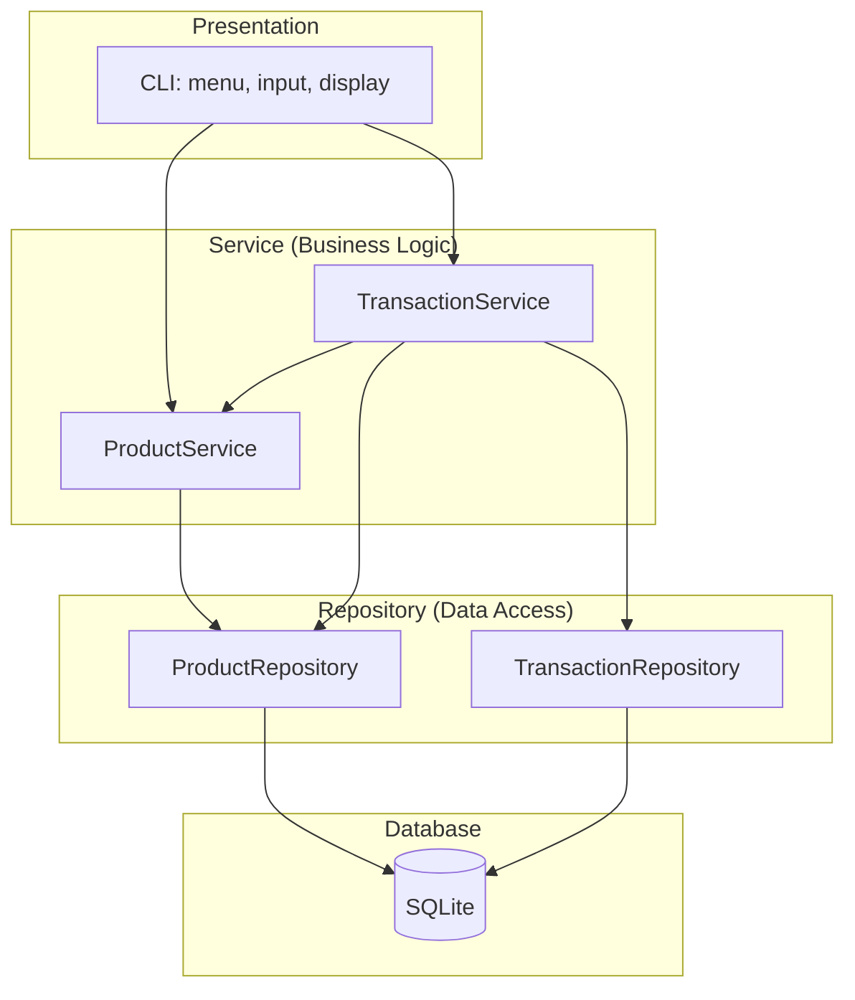
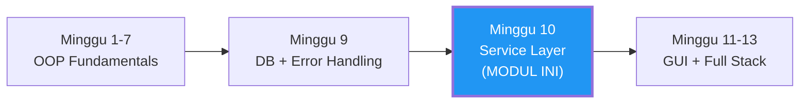

> **Mata Kuliah:** Pemrograman Berorientasi Objek
> **Minggu:** 10
> **Bagian:** Applied OOP
> **Bahasa:** TypeScript 5.x

---

## Capaian Pembelajaran Modul

Setelah mempelajari modul ini, mahasiswa mampu:
1. Memahami konsep Layered Architecture (Presentation → Service → Repository → Database)
2. Mengimplementasikan Service Layer sebagai tempat business logic
3. Menerapkan Dependency Injection sederhana (constructor injection)
4. Menjaga data integrity melalui transaction management
5. Menggabungkan patterns (Repository + Factory + Strategy) dalam satu sistem
6. Membangun console-based UI sebagai presentation layer sederhana

---

## Prasyarat

- **Modul 01-07**: Seluruh konsep OOP fundamental: class, encapsulation, inheritance, polymorphism, abstraction, generics, collections, design patterns dasar, dan SOLID principles
- **Modul 09**: Database Integration & Error Handling: Repository Pattern, custom error class, `better-sqlite3`, `try-catch-finally`
- Pemahaman dasar SQL (SELECT, INSERT, UPDATE, DELETE)
- Node.js terinstall dengan TypeScript 5.x dan `strict: true`

---

## Daftar Isi

- [1. Pendahuluan](#1-pendahuluan)
- [2. Landasan Konsep](#2-landasan-konsep)
- [3. Implementasi dalam TypeScript](#3-implementasi-dalam-typescript)
- [4. Perbandingan Lintas Bahasa](#4-perbandingan-lintas-bahasa)
- [5. Studi Kasus: Mini Inventory Application](#5-studi-kasus-mini-inventory-application)
- [6. Kesalahan Umum & Best Practices](#6-kesalahan-umum--best-practices)
- [7. Ringkasan](#7-ringkasan)
- [8. Latihan Mandiri](#8-latihan-mandiri)

---

## 1. Pendahuluan

Di Modul 09, kalian telah belajar mengintegrasikan TypeScript dengan database menggunakan Repository Pattern dan menerapkan error handling yang terstruktur. Kode yang dihasilkan sudah mampu menyimpan dan mengambil data dari SQLite, tetapi di mana **aturan bisnis** (business rules) seharusnya ditempatkan?

Bayangkan skenario berikut: sebuah toko online memiliki aturan bahwa stok produk tidak boleh negatif, harga harus lebih besar dari nol, dan SKU harus unik. Siapa yang bertanggung jawab memvalidasi aturan-aturan ini? Apakah repository? Apakah UI? Apakah database constraint saja sudah cukup?

Jawabannya: **Service Layer**, sebuah lapisan khusus yang menjadi "jantung" aplikasi, tempat semua business logic dieksekusi. Modul ini membahas bagaimana membangun service layer yang bersih, bagaimana menghubungkannya dengan repository melalui Dependency Injection, dan bagaimana menjaga konsistensi data melalui transaction management.

> 💡 **Insight:** Arsitektur yang kita pelajari di modul ini, layered architecture, adalah fondasi yang sama digunakan oleh framework industri seperti NestJS (TypeScript), Spring Boot (Java), dan ASP.NET Core (C#). Memahaminya di sini akan membuat transisi ke framework manapun jauh lebih mudah.

---

## 2. Landasan Konsep

### 2.1 Layered Architecture: Presentation → Service → Repository → Database

*Layered architecture* (arsitektur berlapis) adalah pola arsitektur yang memisahkan aplikasi ke dalam beberapa lapisan, di mana setiap lapisan memiliki tanggung jawab spesifik dan hanya berkomunikasi dengan lapisan yang bersebelahan.

```
Presentation Layer  →  Service Layer  →  Repository Layer  →  Database
    (CLI/UI)           (Business Logic)    (Data Access)       (SQLite)
```

Setiap layer memiliki peran yang jelas:

| Layer | Tanggung Jawab | Contoh |
|-------|---------------|--------|
| **Presentation** | Menangani input/output pengguna | CLI menu, prompt, tampilan tabel |
| **Service** | Mengeksekusi business logic | Validasi stok, kalkulasi harga, proses checkout |
| **Repository** | Mengakses dan memanipulasi data di database | Query SQL, CRUD operations |
| **Database** | Menyimpan data secara persisten | SQLite file |



Aturan utama layered architecture:
1. **Dependency mengalir satu arah**: dari atas ke bawah (Presentation → Service → Repository)
2. **Tidak boleh melompati layer**: Presentation tidak boleh langsung mengakses Repository
3. **Layer bawah tidak tahu tentang layer atas**: Repository tidak tahu siapa yang memanggilnya

> 🔑 **Konsep Kunci:** Prinsip utama layered architecture adalah **separation of concerns**, setiap layer hanya tahu tentang tanggung jawabnya sendiri. Presentation layer tidak tahu tentang SQL, Repository layer tidak tahu tentang business rules. Ini memungkinkan setiap layer di-develop, di-test, dan di-replace secara independen.

### 2.2 Service Layer: Tempat Business Logic

Service layer adalah jantung aplikasi, di sinilah **aturan bisnis** diimplementasikan. Semua logika yang bukan soal "bagaimana menyimpan data" (repository) dan bukan soal "bagaimana menampilkan data" (presentation) termasuk ke dalam service layer.

Contoh business logic yang termasuk di service layer:
- **Validasi domain**: harga harus > 0, stok &gt;= 0, SKU harus unik
- **Orkestrasi**: proses checkout yang melibatkan cek stok, simpan transaksi, dan update stok
- **Kalkulasi**: hitung total belanja, terapkan diskon, hitung pajak
- **Reporting**: aggregasi data penjualan menggunakan collection operations

Pemisahan service dari repository memberikan keuntungan:

1. **Testability**: business logic bisa diuji tanpa database nyata (mock repository)
2. **Reusability**: satu service bisa digunakan oleh CLI, web API, maupun mobile
3. **Maintainability**: perubahan business rules tidak mempengaruhi data access

```typescript
// Repository: HANYA data access: tidak tahu aturan bisnis
class ProductRepository {
    updateStock(id: number, newStock: number): void {
        this.db.prepare("UPDATE products SET stock = ? WHERE id = ?")
            .run(newStock, id);
    }
}

// Service: mengandung business logic
class ProductService {
    constructor(private readonly repo: ProductRepository) {}

    reduceStock(productId: number, quantity: number): void {
        const product = this.repo.findById(productId);
        if (!product) throw new NotFoundError("Product", productId);
        if (product.stock < quantity) {
            throw new InsufficientStockError(
                product.name, product.stock, quantity
            );
        }
        this.repo.updateStock(productId, product.stock - quantity);
    }
}
```

### 2.3 Dependency Injection Sederhana (Constructor Injection)

**Dependency Injection (DI)** adalah teknik di mana sebuah object menerima dependency-nya dari luar, bukan membuat sendiri. Bentuk paling sederhana dan paling umum adalah **constructor injection**.

```typescript
// ❌ TANPA DI: Service membuat sendiri repository-nya
class ProductService {
    private repo: ProductRepository;
    constructor() {
        const db = new Database("toko.db"); // Tahu detail database!
        this.repo = new ProductRepository(db); // Tight coupling!
    }
}

// ✅ DENGAN DI: Repository di-inject melalui constructor
class ProductService {
    constructor(private readonly repo: ProductRepository) {}
    // Service tidak tahu bagaimana repo dibuat
}
```

Mengapa constructor injection penting?

1. **Loose coupling**: Service tidak bergantung pada implementasi spesifik
2. **Testability**: Bisa inject mock repository saat testing
3. **Flexibility**: Mudah ganti implementasi (SQLite → PostgreSQL) tanpa ubah service
4. **Explicit dependencies**: Semua dependency terlihat jelas di constructor



Tempat di mana semua dependency di-wire bersama disebut **composition root**, biasanya di file `main.ts`:

```typescript
function main(): void {
    const db = AppDatabase.getInstance();                    // Layer 0
    const productRepo = new ProductRepository(db);           // Layer 1
    const productService = new ProductService(productRepo);  // Layer 2
    const cli = new CLI(productService);                     // Layer 3
    cli.start();
}
```

> 🔑 **Konsep Kunci:** Constructor injection adalah penerapan langsung dari **Dependency Inversion Principle** (huruf "D" di SOLID). High-level modules (Service) tidak bergantung pada low-level modules (Repository) secara langsung. `main.ts` sebagai composition root adalah satu-satunya tempat yang "tahu segalanya."

### 2.4 Transaction & Data Integrity

Dalam operasi database yang melibatkan beberapa langkah (misalnya checkout: update stok + simpan transaksi + simpan detail), kita memerlukan **transaction** untuk menjamin konsistensi data.

Transaction mengikuti prinsip **ACID**:
- **Atomicity**: semua operasi berhasil, atau tidak ada yang berhasil (all or nothing)
- **Consistency**: database selalu dalam keadaan valid setelah transaction
- **Isolation**: transaction yang bersamaan tidak saling mengganggu
- **Durability**: data yang sudah di-commit tidak hilang





Di `better-sqlite3`, transaction diimplementasikan dengan `db.transaction()`:

```typescript
const doCheckout = this.db.transaction(() => {
    const txId = this.txRepo.create(totalAmount);
    for (const item of this.cart) {
        this.txRepo.addDetail(txId, item);
        const product = this.productRepo.findById(item.productId)!;
        if (product.stock < item.quantity) {
            throw new InsufficientStockError(/*...*/);
            // Throw = otomatis ROLLBACK semua perubahan
        }
        this.productRepo.updateStock(item.productId, product.stock - item.quantity);
    }
    return txId;
});
const txId = doCheckout(); // Execute
```

> ⚠️ **Perhatian:** Tanpa transaction, jika checkout gagal di tengah jalan, data menjadi inkonsisten, sebagian stok berkurang, sebagian belum, namun transaksi tercatat. Bug semacam ini sangat sulit dideteksi.

### 2.5 Menggabungkan Patterns dalam Satu Sistem

Salah satu tanda kedewasaan dalam OOP adalah kemampuan menggabungkan beberapa design pattern secara natural. Berikut pattern-pattern yang bekerja bersama di modul ini:

| Pattern | Peran | Contoh |
|---------|-------|--------|
| **Repository** | Abstraksi data access | `ProductRepository`, `TransactionRepository` |
| **Singleton** | Satu instance DB connection | `AppDatabase.getInstance()` |
| **DI (Constructor)** | Loose coupling antar layer | Repository di-inject ke Service |
| **Factory** | Composition root membuat objects | `main.ts` wiring semua dependencies |
| **Strategy** | Algoritma yang bisa ditukar | Payment method, discount calculation |

Pattern-pattern ini tidak diterapkan karena "harus pakai pattern", melainkan karena masing-masing menyelesaikan masalah nyata:
- **Repository** memisahkan SQL dari business logic
- **Singleton** mencegah multiple DB connection yang bisa konflik
- **DI** membuat kode loosely coupled dan testable
- **Strategy** memungkinkan ekstensi tanpa modifikasi (Open/Closed Principle)

> 💡 **Insight:** Pattern-pattern ini bekerja seperti Lego, masing-masing kecil dan sederhana, tetapi kombinasinya menghasilkan arsitektur yang kuat. Terapkan satu per satu sesuai kebutuhan nyata, jangan dipaksakan.

---

## 3. Implementasi dalam TypeScript

### 3.1 Arsitektur Project

Berikut struktur proyek yang menunjukkan pemisahan layer secara fisik melalui folder:

```
inventory-app/
├── src/
│   ├── database/
│   │   └── Database.ts          # Singleton database connection
│   ├── errors/
│   │   └── AppError.ts          # Custom error hierarchy
│   ├── models/
│   │   ├── Product.ts           # Entity & DTO types
│   │   └── Transaction.ts       # Entity & DTO types
│   ├── repositories/
│   │   ├── ProductRepository.ts
│   │   └── TransactionRepository.ts
│   ├── services/
│   │   ├── ProductService.ts    # Business logic: produk
│   │   └── TransactionService.ts # Business logic: transaksi
│   ├── presentation/
│   │   └── CLI.ts               # Console interface (thin layer)
│   └── main.ts                  # Composition root
├── tsconfig.json
└── package.json
```

> 🔑 **Konsep Kunci:** Folder structure mencerminkan arsitektur. Setiap folder adalah satu layer. Dependency mengalir satu arah: `main.ts → CLI → Services → Repositories → Database`.

### 3.2 Repository Layer (Recap dari Modul 09)

Repository layer sudah dibahas mendalam di **Modul 09 (Database Integration)**. Di sini kita recap kontrak yang akan digunakan oleh service layer:

```typescript
// === Models ===
interface Product {
    id: number;
    sku: string;
    name: string;
    price: number;
    stock: number;
    created_at: string;
}

interface CartItem {
    productId: number;
    productName: string;
    quantity: number;
    unitPrice: number;
}

// === Repository Contract ===
// Repository HANYA menangani data access: tidak ada business rules
class ProductRepository {
    constructor(private readonly db: Database) {}

    findAll(): Product[]                          { /* SELECT * FROM products */ }
    findById(id: number): Product | null          { /* WHERE id = ? */ }
    findBySku(sku: string): Product | null        { /* WHERE sku = ? */ }
    insert(sku: string, name: string,
           price: number, stock: number): Product { /* INSERT INTO ... */ }
    delete(id: number): boolean                   { /* DELETE WHERE id = ? */ }
    updateStock(id: number, newStock: number): void { /* UPDATE SET stock = ? */ }
}
```

Untuk implementasi lengkap (SQL queries, prepared statements, error handling), lihat **Modul 09**.

### 3.3 ProductService: Business Logic Examples

`ProductService` menunjukkan pola utama service layer: **validasi → delegasi → return**.

Custom error hierarchy (recap dari Modul 09, diperluas):

```typescript
class AppError extends Error {
    constructor(message: string, public readonly code: string) {
        super(message);
        this.name = this.constructor.name;
    }
}
class NotFoundError extends AppError { /* ... */ }
class ValidationError extends AppError { /* ... */ }
class DuplicateError extends AppError { /* ... */ }
class InsufficientStockError extends AppError { /* ... */ }
```

Contoh method service dengan validasi business rules:

```typescript
class ProductService {
    constructor(private readonly repo: ProductRepository) {} // DI

    createProduct(sku: string, name: string, price: number, stock: number): Product {
        // Business Rule 1: SKU harus unik
        if (this.repo.findBySku(sku.trim().toUpperCase())) {
            throw new DuplicateError("SKU", sku);
        }
        // Business Rule 2: Nama minimal 3 karakter
        if (name.trim().length < 3) throw new ValidationError("Nama minimal 3 karakter");
        // Business Rule 3: Harga > 0
        if (price <= 0) throw new ValidationError("Harga harus > 0");
        // Business Rule 4: Stok >= 0, bilangan bulat
        if (stock < 0 || !Number.isInteger(stock))
            throw new ValidationError("Stok harus bilangan bulat >= 0");

        return this.repo.insert(sku.trim().toUpperCase(), name.trim(), price, stock);
    }

    // Reporting: Collection Operations dari Minggu 6
    getLowStockProducts(threshold: number = 5): Product[] {
        return this.repo.findAll()
            .filter(p => p.stock <= threshold)
            .sort((a, b) => a.stock - b.stock);
    }

    getTotalInventoryValue(): number {
        return this.repo.findAll()
            .reduce((total, p) => total + (p.price * p.stock), 0);
    }
}
```

Pola setiap service method: (1) **validasi** business rules, (2) **throw** custom error jika invalid, (3) **delegasi** ke repository, (4) **return** hasil. Implementasi lengkap semua method ada di Section 5.

> 💡 **Insight:** Method `getLowStockProducts()` dan `getTotalInventoryValue()` menerapkan collection operations (`.filter()`, `.sort()`, `.reduce()`) dari Minggu 6. Service layer adalah tempat natural untuk reporting logic.

### 3.4 TransactionService: Shopping Cart & Checkout Flow

`TransactionService` mengorkestrasi beberapa repository dalam satu database transaction:

```typescript
class TransactionService {
    private cart: CartItem[] = [];

    constructor(
        private readonly db: Database,            // Untuk transaction
        private readonly productService: ProductService,
        private readonly productRepo: ProductRepository,
        private readonly txRepo: TransactionRepository
    ) {}

    addToCart(productId: number, qty: number): void {
        if (qty <= 0) throw new ValidationError("Jumlah harus > 0");
        const product = this.productService.getProductById(productId);
        // Cek stok termasuk yang sudah di cart
        const inCart = this.cart.find(c => c.productId === productId)?.quantity ?? 0;
        if (product.stock < inCart + qty)
            throw new InsufficientStockError(product.name, product.stock, inCart + qty);
        // Update atau push ke cart...
    }

    checkout(): { transaction: TransactionRecord; details: TransactionDetail[] } {
        if (!this.cart.length) throw new ValidationError("Keranjang kosong");
        const snapshot = [...this.cart]; // Snapshot sebelum transaction

        const txId = this.db.transaction(() => {
            const id = this.txRepo.create(this.getCartTotal());
            for (const item of snapshot) {
                this.txRepo.addDetail(id, item);
                const p = this.productRepo.findById(item.productId)!;
                if (p.stock < item.quantity)
                    throw new InsufficientStockError(/*...*/); // → ROLLBACK
                this.productRepo.updateStock(item.productId, p.stock - item.quantity);
            }
            return id;
        })();

        this.cart = [];
        return { transaction: {/*...*/}, details: this.txRepo.findDetails(txId) };
    }
}
```

Alur checkout menunjukkan interaksi antar-layer:



### 3.5 Dependency Injection in Practice

Composition root (`main.ts`) melakukan wiring semua dependency, satu-satunya tempat yang "tahu segalanya":

```typescript
function main(): void {
    const db = AppDatabase.getInstance();                        // Layer 0
    const productRepo = new ProductRepository(db);               // Layer 1
    const transactionRepo = new TransactionRepository(db);
    const productService = new ProductService(productRepo);      // Layer 2
    const transactionService = new TransactionService(
        db, productService, productRepo, transactionRepo
    );
    const cli = new CLI(productService, transactionService);     // Layer 3
    cli.start();
    AppDatabase.close();
}
```

> 🔑 **Konsep Kunci:** `main.ts` adalah satu-satunya tempat yang tahu implementasi konkrit setiap class. Semua class lain hanya tahu tentang dependency yang diterima via constructor.

### 3.6 Console-Based Presentation Layer

Presentation layer harus **tipis** (thin), hanya: (1) tampilkan menu, (2) terima input, (3) panggil service, (4) tampilkan hasil/error. **Tidak boleh ada business logic.**

```typescript
class CLI {
    constructor(private readonly productSvc: ProductService,
                private readonly txSvc: TransactionService) {}

    // Contoh handler yang THIN: tidak ada logic:
    private addProduct(): void {
        const sku = readlineSync.question("SKU: ");
        const name = readlineSync.question("Nama: ");
        const price = readlineSync.questionFloat("Harga: ");
        const stock = readlineSync.questionInt("Stok: ");
        // Validasi terjadi di service, bukan di sini
        const p = this.productSvc.createProduct(sku, name, price, stock);
        console.log(`Produk "${p.name}" ditambahkan (ID ${p.id}).`);
    }
}
```

Implementasi lengkap CLI ada di Section 5 (Studi Kasus).

---

## 4. Perbandingan Lintas Bahasa

Layered architecture dan service layer diterapkan di hampir semua bahasa dan framework modern. Sintaksnya berbeda, tetapi strukturnya sangat mirip.

### Java Spring Boot

```java
@Service
public class ProductService {
    private final ProductRepository productRepo;

    public ProductService(ProductRepository productRepo) { // Constructor injection
        this.productRepo = productRepo;
    }

    @Transactional  // Deklaratif - Spring handle BEGIN/COMMIT/ROLLBACK
    public Product createProduct(CreateProductDTO dto) {
        if (dto.getPrice() <= 0) throw new ValidationException("Harga harus positif");
        productRepo.findBySku(dto.getSku()).ifPresent(p -> {
            throw new DuplicateException("SKU sudah ada");
        });
        return productRepo.save(new Product(dto));
    }
}
```

### Dart/Flutter

```dart
class ProductService {
    final ProductRepository _repo;
    ProductService(this._repo);  // Constructor injection - sama seperti TS

    Future<Product> createProduct(String name, double price, int stock) async {
        if (price <= 0) throw ValidationException('Harga harus positif');
        return _repo.insert(CreateProductDTO(name: name, price: price, stock: stock));
    }
}
```

> 🔄 **Perbandingan:** Pola yang konsisten di semua bahasa: Repository = data access, Service = business logic, Presentation = I/O:

| Aspek | TypeScript (Manual) | Java (Spring) | Dart/Flutter |
|-------|-------------------|---------------|--------------|
| DI Mechanism | Constructor injection manual | Auto-detect / `@Autowired` | Constructor injection manual |
| Transaction | `db.transaction(() => ...)` | `@Transactional` annotation | `db.transaction((txn) => ...)` |
| ORM/Query | Raw SQL / better-sqlite3 | JPA / Hibernate | sqflite / drift |
| Async | Sync (better-sqlite3) | Sync (thread-based) | `async/await` (Future) |

> 💡 **Insight:** TypeScript dan Dart menggunakan DI manual, kamu menulis wiring sendiri. Spring menyediakan DI container otomatis. Memahami DI manual memberi fondasi lebih kuat untuk memahami apa yang terjadi di balik layar framework manapun.

---

## 5. Studi Kasus: Mini Inventory Application

### 5.1 Deskripsi & Arsitektur

Berikut implementasi lengkap **Mini Inventory Application** yang mendemonstrasikan semua layer bekerja bersama: CRUD produk (validasi SKU unik, harga > 0, stok &gt;= 0), shopping cart & checkout (transaction management), dan inventory report (collection operations).



### 5.2 Implementasi Lengkap

Kode berikut adalah single-file version yang dapat langsung dijalankan. Di production, setiap class akan berada di file terpisah sesuai folder structure di Section 3.1.

```typescript
// inventory-app.ts: jalankan: npx tsx inventory-app.ts
// npm install better-sqlite3 readline-sync
// npm install -D @types/better-sqlite3 @types/readline-sync
import Database from "better-sqlite3";
import readlineSync from "readline-sync";

// ─── ERRORS ─────────────────────────────────────────────────
class AppError extends Error {
    constructor(message: string, public readonly code: string) {
        super(message); this.name = this.constructor.name;
    }
}
class NotFoundError extends AppError {
    constructor(entity: string, id: number | string) {
        super(`${entity} '${id}' tidak ditemukan`, "NOT_FOUND");
    }
}
class ValidationError extends AppError {
    constructor(msg: string) { super(msg, "VALIDATION"); }
}
class DuplicateError extends AppError {
    constructor(field: string, val: string) {
        super(`${field} '${val}' sudah digunakan`, "DUPLICATE");
    }
}
class InsufficientStockError extends AppError {
    constructor(name: string, avail: number, req: number) {
        super(`Stok "${name}" tidak cukup (tersedia: ${avail}, diminta: ${req})`,
              "INSUFFICIENT_STOCK");
    }
}

// ─── MODELS ─────────────────────────────────────────────────
interface Product { id: number; sku: string; name: string; price: number; stock: number; created_at: string; }
interface TransactionRecord { id: number; total_amount: number; created_at: string; }
interface TransactionDetail {
    id: number; transaction_id: number; product_id: number; product_name: string;
    quantity: number; unit_price: number; subtotal: number;
}
interface CartItem { productId: number; productName: string; quantity: number; unitPrice: number; }

// ─── DATABASE (Singleton) ───────────────────────────────────
class AppDatabase {
    private static inst: Database.Database | null = null;
    static getInstance(path = "inventory.db"): Database.Database {
        if (!AppDatabase.inst) {
            AppDatabase.inst = new Database(path);
            AppDatabase.inst.pragma("journal_mode = WAL");
            AppDatabase.inst.pragma("foreign_keys = ON");
            AppDatabase.inst.exec(`
                CREATE TABLE IF NOT EXISTS products (
                    id INTEGER PRIMARY KEY AUTOINCREMENT, sku TEXT NOT NULL UNIQUE,
                    name TEXT NOT NULL, price REAL NOT NULL CHECK(price > 0),
                    stock INTEGER NOT NULL DEFAULT 0 CHECK(stock >= 0),
                    created_at TEXT DEFAULT (datetime('now','localtime')));
                CREATE TABLE IF NOT EXISTS transactions (
                    id INTEGER PRIMARY KEY AUTOINCREMENT, total_amount REAL NOT NULL,
                    created_at TEXT DEFAULT (datetime('now','localtime')));
                CREATE TABLE IF NOT EXISTS transaction_details (
                    id INTEGER PRIMARY KEY AUTOINCREMENT,
                    transaction_id INTEGER NOT NULL, product_id INTEGER NOT NULL,
                    product_name TEXT NOT NULL, quantity INTEGER NOT NULL CHECK(quantity > 0),
                    unit_price REAL NOT NULL, subtotal REAL NOT NULL,
                    FOREIGN KEY(transaction_id) REFERENCES transactions(id),
                    FOREIGN KEY(product_id) REFERENCES products(id));`);
        }
        return AppDatabase.inst;
    }
    static close(): void { AppDatabase.inst?.close(); AppDatabase.inst = null; }
}

// ─── REPOSITORIES (lihat Modul 09 untuk penjelasan detail) ──
class ProductRepository {
    constructor(private readonly db: Database.Database) {}
    findAll(): Product[] {
        return this.db.prepare("SELECT * FROM products ORDER BY id").all() as Product[];
    }
    findById(id: number): Product | null {
        return (this.db.prepare("SELECT * FROM products WHERE id = ?").get(id) as Product) ?? null;
    }
    findBySku(sku: string): Product | null {
        return (this.db.prepare("SELECT * FROM products WHERE sku = ?").get(sku) as Product) ?? null;
    }
    insert(sku: string, name: string, price: number, stock: number): Product {
        const r = this.db.prepare("INSERT INTO products(sku,name,price,stock) VALUES(?,?,?,?)").run(sku,name,price,stock);
        return this.findById(r.lastInsertRowid as number)!;
    }
    delete(id: number): boolean { return this.db.prepare("DELETE FROM products WHERE id=?").run(id).changes > 0; }
    updateStock(id: number, s: number): void { this.db.prepare("UPDATE products SET stock=? WHERE id=?").run(s,id); }
}

class TransactionRepository {
    constructor(private readonly db: Database.Database) {}
    create(total: number): number {
        return this.db.prepare("INSERT INTO transactions(total_amount) VALUES(?)").run(total).lastInsertRowid as number;
    }
    addDetail(txId: number, i: CartItem): void {
        this.db.prepare(
            "INSERT INTO transaction_details(transaction_id,product_id,product_name,quantity,unit_price,subtotal) VALUES(?,?,?,?,?,?)"
        ).run(txId, i.productId, i.productName, i.quantity, i.unitPrice, i.quantity * i.unitPrice);
    }
    findAll(): TransactionRecord[] {
        return this.db.prepare("SELECT * FROM transactions ORDER BY created_at DESC").all() as TransactionRecord[];
    }
    findDetails(txId: number): TransactionDetail[] {
        return this.db.prepare("SELECT * FROM transaction_details WHERE transaction_id=?").all(txId) as TransactionDetail[];
    }
}

// ─── SERVICES (Business Logic) ──────────────────────────────
class ProductService {
    constructor(private readonly repo: ProductRepository) {}
    getAll(): Product[] { return this.repo.findAll(); }
    getById(id: number): Product {
        const p = this.repo.findById(id);
        if (!p) throw new NotFoundError("Product", id);
        return p;
    }
    create(sku: string, name: string, price: number, stock: number): Product {
        if (this.repo.findBySku(sku.trim().toUpperCase())) throw new DuplicateError("SKU", sku);
        if (name.trim().length < 3) throw new ValidationError("Nama produk minimal 3 karakter");
        if (price <= 0) throw new ValidationError("Harga harus > 0");
        if (stock < 0 || !Number.isInteger(stock)) throw new ValidationError("Stok harus bilangan bulat >= 0");
        return this.repo.insert(sku.trim().toUpperCase(), name.trim(), price, stock);
    }
    remove(id: number): void { this.getById(id); this.repo.delete(id); }
    addStock(id: number, qty: number): Product {
        if (qty <= 0) throw new ValidationError("Jumlah harus positif");
        const p = this.getById(id);
        this.repo.updateStock(id, p.stock + qty);
        return this.getById(id);
    }
    getLowStock(threshold = 5): Product[] {
        return this.repo.findAll().filter(p => p.stock <= threshold).sort((a,b) => a.stock - b.stock);
    }
    getTotalValue(): number {
        return this.repo.findAll().reduce((s, p) => s + p.price * p.stock, 0);
    }
}

class TransactionService {
    private cart: CartItem[] = [];
    constructor(private readonly db: Database.Database, private readonly pSvc: ProductService,
                private readonly pRepo: ProductRepository, private readonly tRepo: TransactionRepository) {}

    addToCart(productId: number, qty: number): void {
        if (qty <= 0) throw new ValidationError("Jumlah harus > 0");
        const product = this.pSvc.getById(productId);
        const inCart = this.cart.find(c => c.productId === productId)?.quantity ?? 0;
        if (product.stock < inCart + qty) throw new InsufficientStockError(product.name, product.stock, inCart + qty);
        const existing = this.cart.find(c => c.productId === productId);
        if (existing) existing.quantity += qty;
        else this.cart.push({ productId: product.id, productName: product.name, quantity: qty, unitPrice: product.price });
    }
    getCart(): readonly CartItem[] { return this.cart; }
    getCartTotal(): number { return this.cart.reduce((s, i) => s + i.unitPrice * i.quantity, 0); }

    checkout(): { transaction: TransactionRecord; details: TransactionDetail[] } {
        if (!this.cart.length) throw new ValidationError("Keranjang kosong");
        const total = this.getCartTotal();
        const snap = [...this.cart];
        const txId = this.db.transaction(() => {
            const id = this.tRepo.create(total);
            for (const item of snap) {
                this.tRepo.addDetail(id, item);
                const p = this.pRepo.findById(item.productId)!;
                if (p.stock < item.quantity) throw new InsufficientStockError(item.productName, p.stock, item.quantity);
                this.pRepo.updateStock(item.productId, p.stock - item.quantity);
            }
            return id;
        })();
        this.cart = [];
        return {
            transaction: { id: txId, total_amount: total, created_at: new Date().toISOString() },
            details: this.tRepo.findDetails(txId),
        };
    }
    getHistory(): TransactionRecord[] { return this.tRepo.findAll(); }
}

// ─── PRESENTATION (Thin CLI) ────────────────────────────────
function fmt(n: number): string { return "Rp" + n.toLocaleString("id-ID"); }

class CLI {
    constructor(private readonly p: ProductService, private readonly t: TransactionService) {}
    start(): void {
        console.log("\n=== MINI INVENTORY APP ===\n");
        let on = true;
        while (on) {
            console.log("1.Produk 2.Tambah 3.Hapus 4.+Stok 5.+Cart 6.Cart 7.Checkout 8.History 9.Report 0.Exit");
            try {
                switch (readlineSync.questionInt("> ")) {
                    case 1: this.list(); break;  case 2: this.add(); break;  case 3: this.del(); break;
                    case 4: this.stock(); break; case 5: this.toCart(); break; case 6: this.showCart(); break;
                    case 7: this.pay(); break;   case 8: this.hist(); break; case 9: this.report(); break;
                    case 0: on = false; break;   default: console.log("?");
                }
            } catch (e) {
                console.log(e instanceof AppError ? `[${e.code}] ${e.message}` : `[ERROR] ${e}`);
            }
        }
    }
    private list(): void {
        const ps = this.p.getAll();
        if (!ps.length) { console.log("Kosong."); return; }
        console.log("ID".padEnd(4)+"SKU".padEnd(10)+"Nama".padEnd(18)+"Harga".padStart(11)+"Stok".padStart(6));
        for (const p of ps) console.log(
            `${p.id}`.padEnd(4)+p.sku.padEnd(10)+p.name.padEnd(18)+fmt(p.price).padStart(11)+`${p.stock}`.padStart(6));
    }
    private add(): void {
        const r = this.p.create(readlineSync.question("SKU: "), readlineSync.question("Nama: "),
            readlineSync.questionFloat("Harga: "), readlineSync.questionInt("Stok: "));
        console.log(`+ ${r.name} (ID ${r.id})`);
    }
    private del(): void { this.p.remove(readlineSync.questionInt("ID: ")); console.log("Dihapus."); }
    private stock(): void {
        const r = this.p.addStock(readlineSync.questionInt("ID: "), readlineSync.questionInt("Qty: "));
        console.log(`Stok ${r.name}: ${r.stock}`);
    }
    private toCart(): void {
        this.list();
        this.t.addToCart(readlineSync.questionInt("ID: "), readlineSync.questionInt("Qty: "));
        console.log("Ditambahkan.");
    }
    private showCart(): void {
        const c = this.t.getCart();
        if (!c.length) { console.log("Cart kosong."); return; }
        for (const i of c) console.log(`  ${i.productName} x${i.quantity} ${fmt(i.unitPrice*i.quantity)}`);
        console.log(`  TOTAL: ${fmt(this.t.getCartTotal())}`);
    }
    private pay(): void {
        if (!this.t.getCart().length) { console.log("Cart kosong."); return; }
        this.showCart();
        if (!readlineSync.keyInYNStrict("Checkout?")) return;
        const r = this.t.checkout();
        console.log(`\n=== RECEIPT #${r.transaction.id} ===`);
        for (const d of r.details) console.log(`  ${d.product_name} x${d.quantity} = ${fmt(d.subtotal)}`);
        console.log(`  TOTAL: ${fmt(r.transaction.total_amount)}`);
    }
    private hist(): void {
        const txs = this.t.getHistory();
        if (!txs.length) { console.log("Belum ada."); return; }
        for (const t of txs) console.log(`  #${t.id}  ${t.created_at}  ${fmt(t.total_amount)}`);
    }
    private report(): void {
        console.log(`\nInventori: ${fmt(this.p.getTotalValue())}`);
        const low = this.p.getLowStock();
        if (low.length) { console.log("Stok rendah:"); for (const p of low) console.log(`  [!] ${p.name}: ${p.stock}`); }
    }
}

// ─── COMPOSITION ROOT ───────────────────────────────────────
function main(): void {
    const db = AppDatabase.getInstance();
    const pRepo = new ProductRepository(db), tRepo = new TransactionRepository(db);
    const pSvc = new ProductService(pRepo);
    const tSvc = new TransactionService(db, pSvc, pRepo, tRepo);
    new CLI(pSvc, tSvc).start();
    AppDatabase.close();
}
main();
```

### 5.3 Analisis Keputusan Desain

| Keputusan | Alasan |
|-----------|--------|
| **Singleton database** | Satu koneksi SQLite; mencegah konflik file access |
| **Repository per entity** | Separation of concerns; setiap repo = satu tabel |
| **Constructor injection** | Loose coupling; mudah test dan replace |
| **SKU unik di service** | Business rule, bukan hanya database constraint |
| **Transaction pada checkout** | Atomicity: stok + transaksi konsisten |
| **Cart di memory** | Cukup untuk single-user console; di web pakai session/DB |
| **Thin CLI** | Tidak ada logic di presentation; mudah ganti ke REST API |

> 💡 **Insight:** Arsitektur ini identik dengan aplikasi enterprise. Mengganti CLI ke REST API hanya perlu membuat controller baru, service dan repository tidak berubah. Itulah kekuatan separation of concerns.

---

## 6. Kesalahan Umum & Best Practices

### Kesalahan 1: Business logic di repository

```typescript
// ❌ Repository mengandung business rule
class ProductRepository {
    reduceStock(id: number, qty: number): void {
        const product = this.findById(id);
        if (product.stock < qty) throw new Error("Stok kurang"); // Business rule!
        this.db.prepare("UPDATE ...").run(product.stock - qty, id);
    }
}

// ✅ Repository = data access saja, Service = business logic
class ProductRepository {
    updateStock(id: number, newStock: number): void { /* UPDATE ... */ }
}
class ProductService {
    reduceStock(id: number, qty: number): void {
        const product = this.getById(id);
        if (product.stock < qty) throw new InsufficientStockError(/*...*/);
        this.repo.updateStock(id, product.stock - qty);
    }
}
```

### Kesalahan 2: Tanpa transaction untuk operasi multi-step

```typescript
// ❌ Tanpa transaction: gagal di item ke-3 = data inkonsisten
checkout(): void {
    const txId = this.txRepo.create(total);
    for (const item of this.cart) {
        this.txRepo.addDetail(txId, item);
        this.productRepo.updateStock(id, newStock); // Bisa gagal!
    }
}

// ✅ Transaction = all or nothing
checkout(): void {
    this.db.transaction(() => {
        const txId = this.txRepo.create(total);
        for (const item of this.cart) {
            this.txRepo.addDetail(txId, item);
            this.productRepo.updateStock(id, newStock); // Gagal → ROLLBACK semua
        }
    })();
}
```

### Kesalahan 3: Service membuat dependency sendiri (no DI)

```typescript
// ❌ Tight coupling
class ProductService {
    constructor() {
        this.repo = new ProductRepository(new Database("toko.db")); // Buat sendiri!
    }
}
// ✅ Constructor injection
class ProductService {
    constructor(private readonly repo: ProductRepository) {} // Di-inject dari luar
}
```

### Kesalahan 4: Presentation layer akses database langsung

```typescript
// ❌ CLI tahu tentang SQL: melanggar layer
class CLI {
    listProducts(): void {
        const rows = this.db.prepare("SELECT * FROM products").all();
    }
}
// ✅ CLI hanya bicara ke service
class CLI {
    listProducts(): void {
        const products = this.productService.getAll(); // Tahu Product[], bukan SQL
    }
}
```

### Kesalahan 5: Menelan error tanpa rethrow

```typescript
// ❌ Error ditelan: caller tidak tahu ada masalah
create(name: string, price: number): Product | null {
    try { return this.repo.insert(name, price); }
    catch { console.log("Gagal"); return null; } // Error hilang!
}
// ✅ Transform ke error bermakna, lalu rethrow
create(name: string, price: number): Product {
    if (price <= 0) throw new ValidationError("Harga harus > 0");
    try { return this.repo.insert(name, price); }
    catch (e) { throw new AppError(`Gagal: ${(e as Error).message}`, "DB_ERROR"); }
}
```

> ⚠️ **Perhatian:** Aturan emas: setiap layer hanya memanggil layer **tepat di bawahnya**. CLI tidak akses Repository. Service tidak render output. Repository tidak validasi business rules.

---

## 7. Ringkasan

- **Layered Architecture** memisahkan aplikasi menjadi Presentation → Service → Repository → Database. Setiap layer punya tanggung jawab spesifik dan hanya berkomunikasi dengan layer bersebelahan

- **Service Layer** adalah tempat business logic, validasi domain, orkestrasi operasi, reporting. Service memungkinkan presentation dan data access berubah secara independen

- **Dependency Injection (constructor injection)** membuat kode loosely coupled dan testable. `main.ts` sebagai composition root melakukan wiring semua dependency di satu tempat

- **Transaction Management** menjamin data integrity saat operasi multi-step, semua berhasil atau semua batal (ACID). Menggunakan `db.transaction()` di `better-sqlite3`

- **Pattern Combination**: Singleton (database), Repository (data access), DI (loose coupling), Factory (composition root), Strategy (extensibility), masing-masing menyelesaikan masalah nyata

- **Collection Operations** (Minggu 6) diterapkan di service layer untuk reporting: `.filter()`, `.sort()`, `.reduce()` pada data dari repository

- **Presentation layer harus tipis**: hanya I/O dan memanggil service. Mengganti CLI ke REST API hanya perlu mengganti satu layer



---

## 8. Latihan Mandiri

### Latihan 1: Fitur Update Produk (Easy)

Tambahkan fitur update produk: method `updateProduct(id, name, price)` di `ProductService` dengan validasi (produk ada, nama &gt;= 3 char, harga > 0) + menu "Edit Produk" di CLI. Gunakan nilai saat ini sebagai default jika user tidak mengisi input.

### Latihan 2: Kelola Keranjang (Medium)

Implementasikan `removeFromCart(productId)` dan `updateCartQuantity(productId, newQty)` di `TransactionService`. Jika `newQty === 0`, hapus item. Validasi stok tetap berlaku. Tambahkan menu di CLI untuk menghapus/mengubah jumlah item keranjang.

### Latihan 3: Laporan Penjualan dengan Collection Operations (Hard)

Buat reporting di `TransactionService` menggunakan **collection operations** (bukan SQL):
- `getTopSellingProducts(limit)`: grouping `TransactionDetail[]` dengan `Map`, sort by totalQty, slice
- `getRevenueByDate(): Map<string, number>`: grouping revenue per tanggal via `.reduce()`
- `getAverageTransactionValue()`: rata-rata total_amount dari semua transaksi

Tampilkan di CLI dalam format tabel rapi. Semua aggregasi harus menggunakan `.map()`, `.filter()`, `.reduce()`, dan `Map`.

### Latihan 4: Strategy Pattern untuk Diskon (Hard)

Buat interface `DiscountStrategy` dengan method `calculate(subtotal: number): number` (return jumlah diskon). Implementasikan `NoDiscount`, `PercentageDiscount`, dan `BuyNGetFreeDiscount`. Modifikasi `TransactionService` agar menerima strategy (settable sebelum checkout). CLI menampilkan pilihan diskon.

---

## Referensi & Bacaan Lanjutan

- Martin Fowler, *Patterns of Enterprise Application Architecture* (Service Layer, Repository): https://martinfowler.com/eaaCatalog/
- Robert C. Martin, *Clean Architecture* (Bab 22: The Clean Architecture)
- TypeScript Handbook, Classes: https://www.typescriptlang.org/docs/handbook/2/classes.html
- better-sqlite3 Documentation: https://github.com/WiseLibs/better-sqlite3/blob/master/docs/api.md
- SQLite, Transactions: https://www.sqlite.org/lang_transaction.html
- Mark Seemann, *Dependency Injection: Principles, Practices, and Patterns*
