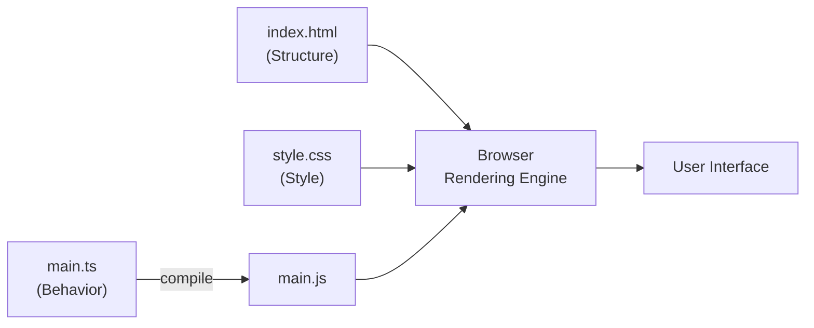
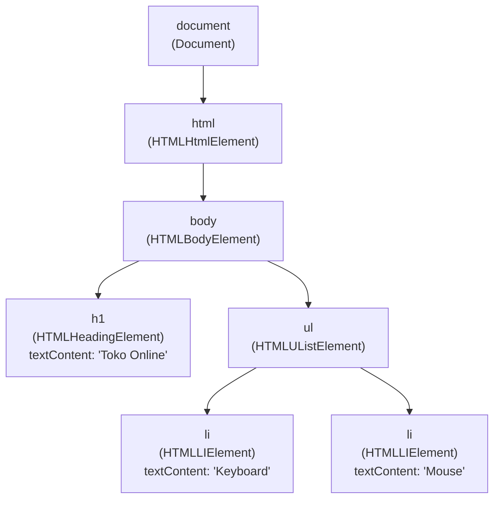
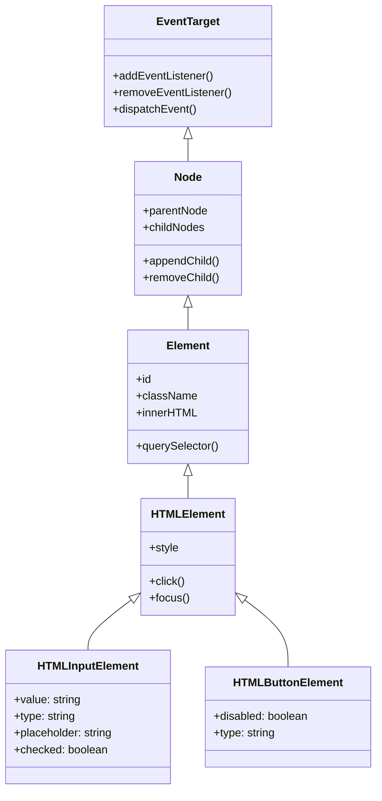
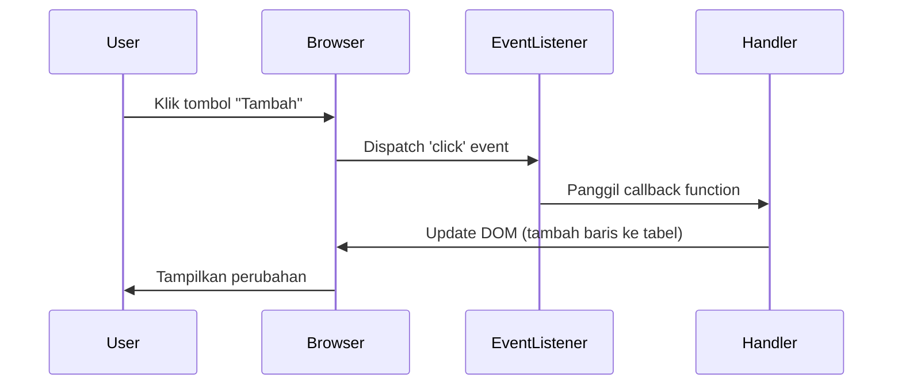
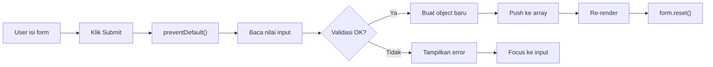
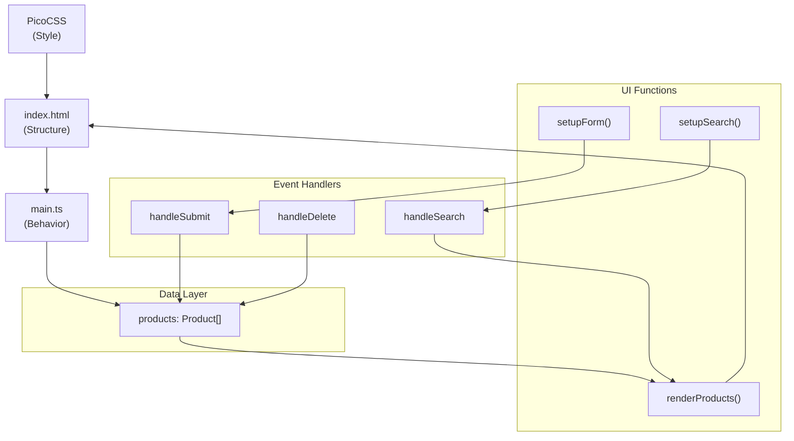
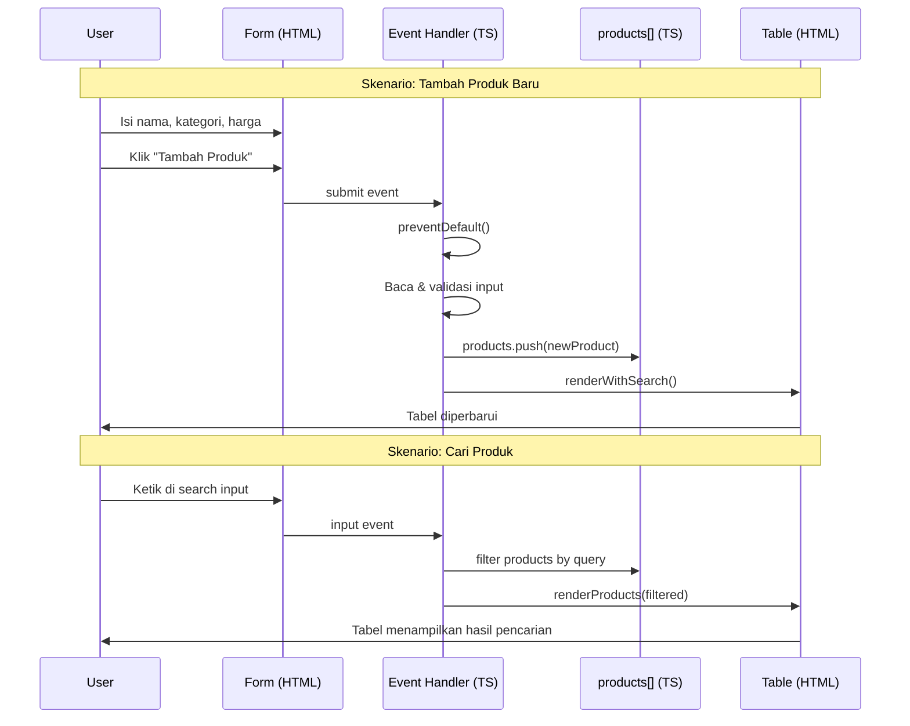

> **Mata Kuliah:** Pemrograman Berorientasi Objek
> **Minggu:** 11
> **Bagian:** Applied OOP
> **Bahasa:** TypeScript 5.x

---

## Capaian Pembelajaran Modul

Setelah mempelajari modul ini, mahasiswa mampu:
1. Memahami arsitektur HTML (structure) + CSS (style) + TypeScript (behavior) dalam membangun GUI
2. Melakukan setup project dengan Vite + vanilla TypeScript template
3. Memanipulasi DOM dari TypeScript: `querySelector`, `addEventListener`, `createElement`
4. Menggunakan type-safe DOM typing: `HTMLInputElement`, `HTMLButtonElement`, dan casting
5. Menerapkan event handling: click, submit, input
6. Merender data ke DOM menggunakan template literals dan `createElement`

---

## Prasyarat

- **Modul 01-07:** Konsep OOP Fundamentals (class, encapsulation, inheritance, polymorphism, interface, generics, SOLID)
- **Modul 09-10:** Modules & Project Structure, Error Handling
- Pemahaman dasar HTML (tag, atribut, struktur dokumen)
- Pemahaman dasar CSS (selector, property, box model)

---

## Daftar Isi

- [1. Pendahuluan](#1-pendahuluan)
- [2. Landasan Konsep](#2-landasan-konsep)
- [3. Implementasi dalam TypeScript](#3-implementasi-dalam-typescript)
- [4. Perbandingan Lintas Bahasa](#4-perbandingan-lintas-bahasa)
- [5. Studi Kasus: Product List Page](#5-studi-kasus-product-list-page)
- [6. Kesalahan Umum & Best Practices](#6-kesalahan-umum--best-practices)
- [7. Ringkasan](#7-ringkasan)
- [8. Latihan Mandiri](#8-latihan-mandiri)

---

## 1. Pendahuluan

Selama sepuluh minggu terakhir, semua program yang kalian bangun berjalan di **console**, input dari `readline`, output ke `console.log`. Di dunia nyata, hampir semua aplikasi modern memiliki **Graphical User Interface (GUI)**. GUI adalah lapisan interaksi antara pengguna dan logika bisnis, dan di sinilah prinsip OOP menjadi sangat terasa relevansinya.

Mengapa GUI relevan untuk mata kuliah OOP?

- **DOM nodes adalah objek**: setiap elemen HTML (`<div>`, `<button>`, `<input>`) direpresentasikan sebagai objek di memori dengan properties dan methods
- **Event handling = Observer pattern**: ketika user mengklik tombol, browser mengirim *event* ke *listener* yang sudah didaftarkan, persis seperti Observer pattern yang kalian pelajari di design patterns
- **Encapsulation**: logika UI dibungkus dalam fungsi atau class terpisah dari data layer
- **Type safety**: TypeScript memberikan tipe eksplisit untuk setiap elemen DOM, sehingga kesalahan terdeteksi saat compile, bukan saat runtime

Modul ini menggunakan **vanilla TypeScript**, tanpa framework seperti React, Angular, atau Vue. Mengapa?

> 💡 **Insight:** Fokus mata kuliah ini adalah OOP, bukan frontend development. Vanilla TS + DOM manipulation sudah cukup untuk mendemonstrasikan bagaimana class dan object berinteraksi dengan UI. Client-side framework akan dipelajari di mata kuliah tersendiri. Dengan memahami DOM manipulation secara langsung, kalian akan lebih mudah memahami *apa yang sebenarnya dilakukan* oleh framework-framework tersebut di balik layar.

Kita akan membangun GUI menggunakan tiga pilar web:

```
┌─────────────────────────────────────────────────┐
│                   BROWSER                        │
│                                                  │
│   HTML ──── Structure (apa yang ditampilkan)     │
│   CSS  ──── Style (bagaimana tampilannya)        │
│   TS   ──── Behavior (bagaimana ia berperilaku)  │
│                                                  │
└─────────────────────────────────────────────────┘
```

---

## 2. Landasan Konsep

### 2.1 Arsitektur: HTML + CSS + TypeScript (Structure + Style + Behavior)

Membangun GUI web melibatkan tiga teknologi yang masing-masing memiliki tanggung jawab tunggal (*Single Responsibility*):

| Layer | Teknologi | Tanggung Jawab | Analogi OOP |
|-------|-----------|----------------|-------------|
| **Structure** | HTML | Mendefinisikan *apa* yang ada di halaman (heading, paragraf, tabel, form, tombol) | Class definition, mendefinisikan struktur |
| **Style** | CSS | Mendefinisikan *bagaimana tampilan* elemen (warna, ukuran, layout, spacing) | Properties / state visual |
| **Behavior** | TypeScript | Mendefinisikan *bagaimana elemen berperilaku* saat diinteraksi (klik, submit, input) | Methods / behavior |

Pemisahan ini mengikuti prinsip **Separation of Concerns**, setiap layer bisa diubah secara independen tanpa memengaruhi layer lain. Mengubah warna tombol (CSS) tidak perlu mengubah logika klik (TypeScript). Menambah field form (HTML) tidak perlu mengubah styling keseluruhan (CSS).



> 🔑 **Konsep Kunci:** Arsitektur HTML + CSS + JS/TS adalah implementasi nyata dari Separation of Concerns. Setiap file punya satu alasan untuk berubah, persis seperti Single Responsibility Principle di SOLID.

### 2.2 DOM (Document Object Model) sebagai Object Graph

Ketika browser membaca file HTML, ia membangun **DOM (Document Object Model)**, sebuah representasi HTML sebagai **tree of objects** di memori. Setiap tag HTML menjadi sebuah **node object** dengan properties dan methods.

```html
<html>
  <body>
    <h1>Toko Online</h1>
    <ul>
      <li>Keyboard</li>
      <li>Mouse</li>
    </ul>
  </body>
</html>
```

Representasi DOM di memori:



Perhatikan bahwa setiap node memiliki:
- **Tipe class** yang spesifik (`HTMLHeadingElement`, `HTMLUListElement`, dll.), ini adalah *inheritance hierarchy* nyata!
- **Properties** (`textContent`, `className`, `id`, `style`, dll.)
- **Methods** (`appendChild()`, `remove()`, `addEventListener()`, dll.)



> 🔑 **Konsep Kunci:** DOM adalah contoh nyata OOP di dunia web. Setiap elemen HTML adalah **object** dengan class hierarchy, inheritance, polymorphism, dan encapsulation. Ketika kalian menulis `document.querySelector('button')`, yang dikembalikan adalah sebuah **instance** dari class `HTMLButtonElement`.

### 2.3 Type-Safe DOM Manipulation di TypeScript

JavaScript biasa tidak memberikan informasi tipe saat mengakses elemen DOM, semua `querySelector` mengembalikan `Element | null`. TypeScript mengubah ini secara drastis:

```typescript
// JavaScript: tidak ada informasi tipe, rawan error
const input = document.querySelector('#name'); // tipe: Element | null
console.log(input.value); // ❌ Error runtime: property 'value' tidak ada di Element

// TypeScript: tipe eksplisit, error terdeteksi saat compile
const input = document.querySelector('#name') as HTMLInputElement;
console.log(input.value); // ✅ TypeScript tahu 'value' ada di HTMLInputElement
```

TypeScript menyediakan type definitions untuk **semua** elemen DOM di library `lib.dom.d.ts`. Beberapa tipe yang paling sering digunakan:

| Tipe TypeScript | Elemen HTML | Properties Khas |
|----------------|-------------|-----------------|
| `HTMLInputElement` | `<input>` | `value`, `type`, `checked`, `placeholder` |
| `HTMLButtonElement` | `<button>` | `disabled`, `type` |
| `HTMLFormElement` | `<form>` | `elements`, `reset()`, `submit()` |
| `HTMLTableElement` | `<table>` | `rows`, `insertRow()`, `deleteRow()` |
| `HTMLSelectElement` | `<select>` | `value`, `selectedIndex`, `options` |
| `HTMLDivElement` | `<div>` |, (mewarisi dari `HTMLElement`) |
| `HTMLAnchorElement` | `<a>` | `href`, `target` |

> 💡 **Insight:** Alasan utama kita menggunakan TypeScript (bukan JavaScript) untuk DOM manipulation di mata kuliah ini: TypeScript memaksa kalian berpikir tentang **tipe objek** yang sedang dimanipulasi. Ini selaras dengan mindset OOP, selalu sadar akan tipe/class dari object yang kalian gunakan.

### 2.4 Event-Driven Programming (Events sebagai Observer Pattern)

Dalam GUI, program tidak berjalan secara linear dari atas ke bawah. Sebaliknya, program **menunggu** event dari pengguna dan **merespons** ketika event terjadi. Paradigma ini disebut **event-driven programming**.



Pola ini persis seperti **Observer pattern**:
- **Subject** = elemen DOM (tombol, form, input)
- **Observer** = event listener (callback function)
- **Event** = notifikasi bahwa sesuatu terjadi (click, submit, input)

```typescript
// Subject (tombol) mendaftarkan Observer (callback)
button.addEventListener('click', () => {
    // Observer merespons event
    console.log('Tombol diklik!');
});
```

Event yang paling sering digunakan:

| Event | Dipicu Saat | Elemen Umum |
|-------|------------|-------------|
| `click` | Elemen diklik | Button, link, div |
| `submit` | Form di-submit | Form |
| `input` | Nilai input berubah (real-time) | Input, textarea |
| `change` | Nilai berubah dan focus pindah | Select, checkbox, radio |
| `keydown` | Tombol keyboard ditekan | Input, document |

> 🔄 **Perbandingan:** Di Java, event handling menggunakan `ActionListener` interface, `button.addActionListener(e -> {...})`. Di TypeScript, kita menggunakan `addEventListener` dengan callback. Konsepnya identik: mendaftarkan observer ke subject.

### 2.5 PicoCSS: Classless CSS Framework

Dalam mata kuliah ini, kita tidak ingin menghabiskan waktu menulis CSS yang rumit. **PicoCSS** adalah *classless CSS framework*, cukup tulis HTML semantik yang benar, dan PicoCSS otomatis memberi styling yang bersih dan modern.

```html
<!-- Tanpa PicoCSS: tampilan default browser yang jelek -->
<!-- Dengan PicoCSS: tampilan clean dan modern, TANPA menambahkan class apapun -->

<form>
    <label for="name">Nama Produk</label>
    <input type="text" id="name" placeholder="Masukkan nama...">
    <button type="submit">Tambah</button>
</form>
```

Keuntungan PicoCSS untuk kuliah OOP:
- **Zero configuration**: cukup import, langsung bekerja
- **Semantic HTML**: memaksa kalian menulis HTML yang benar secara struktur
- **Minimal effort, clean look**: tidak perlu class utility seperti Tailwind atau Bootstrap
- **Fokus tetap di TypeScript**: waktu tidak habis untuk styling

> 💡 **Insight:** PicoCSS menerapkan prinsip *Convention over Configuration*. Selama kalian menulis HTML semantik yang benar (`<table>`, `<form>`, `<nav>`, `<article>`), styling sudah ditangani secara otomatis.

---

## 3. Implementasi dalam TypeScript

### 3.1 Setup: Vite + vanilla-ts Template

**Vite** adalah build tool modern yang menyediakan dev server cepat dengan Hot Module Replacement (HMR). Template `vanilla-ts` memberi kita proyek TypeScript murni tanpa framework apapun.

```bash
# Buat proyek baru
npm create vite@latest my-app -- --template vanilla-ts

# Masuk ke direktori proyek dan install dependencies
cd my-app && npm install

# Install PicoCSS untuk styling otomatis
npm install @picocss/pico
```

Struktur proyek yang dihasilkan Vite:

```
my-app/
├── public/
│   └── vite.svg           # Asset statis
├── src/
│   ├── counter.ts          # Contoh module (bisa dihapus)
│   ├── main.ts             # Entry point TypeScript
│   ├── style.css           # CSS kustom (opsional)
│   ├── typescript.svg      # Asset (bisa dihapus)
│   └── vite-env.d.ts       # Type declarations untuk Vite
├── index.html              # File HTML utama
├── package.json            # Dependencies & scripts
└── tsconfig.json           # Konfigurasi TypeScript (strict: true)
```

File `index.html` adalah entry point, Vite membaca file ini dan otomatis me-load `src/main.ts`:

```html
<!-- index.html -->
<!DOCTYPE html>
<html lang="id">
  <head>
    <meta charset="UTF-8" />
    <meta name="viewport" content="width=device-width, initial-scale=1.0" />
    <title>My App</title>
  </head>
  <body>
    <main class="container">
      <h1>Toko Online</h1>
      <div id="app"></div>
    </main>
    <script type="module" src="/src/main.ts"></script>
  </body>
</html>
```

Import PicoCSS di `src/main.ts`:

```typescript
// src/main.ts
import '@picocss/pico';  // Import PicoCSS - styling otomatis untuk semua elemen HTML

const app = document.querySelector<HTMLDivElement>('#app');
if (app) {
    app.innerHTML = '<p>Hello, TypeScript!</p>';
}
```

Jalankan dev server:

```bash
npm run dev    # Buka http://localhost:5173
```

> ⚠️ **Perhatian:** Template `vanilla-ts` sudah mengaktifkan `strict: true` di `tsconfig.json`. Jangan ubah pengaturan ini, strict mode memaksa penulisan kode yang type-safe, sejalan dengan prinsip OOP yang kita pelajari.

### 3.2 querySelector dan Type Casting

`querySelector` adalah method untuk mencari elemen DOM berdasarkan CSS selector. Di TypeScript, ia mengembalikan `Element | null`, kita perlu **type casting** untuk mendapatkan tipe yang spesifik.

**Cara 1: Type assertion dengan `as`**: ringkas, tapi tidak cek null

```typescript
const input = document.querySelector('#name-input') as HTMLInputElement;
const btn = document.querySelector('#submit-btn') as HTMLButtonElement;
console.log(input.value);  // ✅ TypeScript tahu tipenya, tapi ❌ crash jika null
```

**Cara 2: Generic parameter + null check** (recommended)

```typescript
const input = document.querySelector<HTMLInputElement>('#name-input');

if (!input) {
    throw new Error('Element #name-input tidak ditemukan di DOM!');
}
// Setelah null check, TypeScript tahu input pasti HTMLInputElement
console.log(input.value); // ✅ Aman - tipe benar DAN null sudah ditangani
```

**Cara 3: Conditional check**: cocok untuk optional elements

```typescript
const input = document.querySelector<HTMLInputElement>('#name-input');
if (input) {
    console.log(input.value); // ✅ Hanya dijalankan jika elemen ada
}
```

> 🔑 **Konsep Kunci:** `querySelector` mengembalikan `null` jika elemen tidak ditemukan. Selalu handle kasus null, entah dengan null check, assertion, atau throw error. Mengabaikan null adalah sumber bug tersembunyi nomor satu dalam DOM manipulation.

### 3.3 createElement dan innerHTML

Ada dua pendekatan utama untuk menambahkan elemen ke DOM:

**Pendekatan 1: innerHTML dengan template literal**

```typescript
interface Product {
    id: number;
    name: string;
    price: number;
    category: string;
}

function renderProductCard(product: Product): string {
    return `
        <article>
            <header>${product.name}</header>
            <p>Kategori: ${product.category}</p>
            <p><strong>Rp ${product.price.toLocaleString('id-ID')}</strong></p>
        </article>
    `;
}

// Render ke DOM
const container = document.querySelector<HTMLDivElement>('#product-list');
if (container) {
    const products: Product[] = [
        { id: 1, name: 'Keyboard', price: 850000, category: 'Elektronik' },
        { id: 2, name: 'Mouse', price: 250000, category: 'Elektronik' },
    ];
    container.innerHTML = products.map(renderProductCard).join('');
}
```

**Pendekatan 2: createElement (lebih aman, lebih OOP)**

```typescript
function createProductRow(product: Product): HTMLTableRowElement {
    const row = document.createElement('tr');

    const nameCell = document.createElement('td');
    nameCell.textContent = product.name;  // textContent otomatis escape HTML (aman dari XSS)

    const priceCell = document.createElement('td');
    priceCell.textContent = `Rp ${product.price.toLocaleString('id-ID')}`;

    row.appendChild(nameCell);
    row.appendChild(priceCell);
    return row;
}
```

Perbandingan kedua pendekatan:

| Aspek | `innerHTML` + Template Literal | `createElement` |
|-------|-------------------------------|-----------------|
| Readability | Lebih mudah dibaca untuk HTML kompleks | Verbose, banyak baris kode |
| Performance | Re-render seluruh konten | Hanya menambah elemen baru |
| Keamanan | **Rentan XSS** jika data berasal dari user | Aman, `textContent` otomatis di-escape |
| Type safety | Minimal, string biasa | Penuh, setiap elemen punya tipe |
| Penggunaan ideal | Render statis, data terpercaya | Render dinamis, data dari user |

> ⚠️ **Perhatian:** `innerHTML` rentan terhadap **XSS (Cross-Site Scripting)** jika data berasal dari input pengguna. Gunakan `textContent` atau `createElement` untuk data yang tidak terpercaya. Dalam studi kasus di modul ini kita menggunakan data hardcoded sehingga `innerHTML` masih aman, namun selalu waspada di production.

### 3.4 Event Handling (click, submit, input)

Event handling adalah jantung dari GUI, tanpa event handling, tampilan hanyalah halaman statis.

**Click event:**

```typescript
const btn = document.querySelector<HTMLButtonElement>('#delete-btn');
if (btn) {
    btn.addEventListener('click', () => {
        console.log('Tombol diklik!');
    });
}
```

**Submit event (form):**

```typescript
const form = document.querySelector<HTMLFormElement>('#product-form');
if (form) {
    form.addEventListener('submit', (event: Event) => {
        event.preventDefault(); // ← WAJIB! Mencegah browser reload halaman

        const nameInput = document.querySelector<HTMLInputElement>('#name');
        if (nameInput) {
            console.log(`Produk: ${nameInput.value.trim()}`);
        }
        form.reset(); // Kosongkan form setelah submit
    });
}
```

**Input event (real-time, cocok untuk search):**

```typescript
const searchInput = document.querySelector<HTMLInputElement>('#search');
if (searchInput) {
    searchInput.addEventListener('input', () => {
        const query = searchInput.value.toLowerCase();
        console.log(`Searching: ${query}`);
        // Filter dan re-render data berdasarkan query
    });
}
```

> 🔑 **Konsep Kunci:** `event.preventDefault()` pada form submit **wajib** dipanggil. Tanpa ini, browser akan melakukan reload halaman (behavior default form HTML), dan semua state di memori akan hilang.

### 3.5 Rendering Data ke Table/List

Salah satu tugas paling umum dalam GUI: merender array of objects ke elemen HTML. Pola dasarnya:

1. Siapkan `<tbody>` kosong di HTML
2. Buat fungsi yang mengubah satu object menjadi satu `<tr>` (menggunakan `createElement`)
3. Loop seluruh array, panggil fungsi tersebut, dan `appendChild` ke `<tbody>`
4. Setiap perubahan data, kosongkan `<tbody>` dan render ulang

```typescript
function renderProducts(productList: Product[]): void {
    const tbody = document.querySelector<HTMLTableSectionElement>('#product-tbody');
    if (!tbody) return;

    tbody.innerHTML = ''; // Kosongkan tabel lama

    productList.forEach(product => {
        tbody.appendChild(createProductRow(product)); // Render setiap produk
    });
}
```

> 💡 **Insight:** Perhatikan polanya: data disimpan di array, lalu di-*render* ke DOM. Setiap perubahan data, kita memanggil render ulang. Pola ini disebut **data-driven rendering**, UI adalah *fungsi dari data*. Framework seperti React mengotomatisasi pola ini, tapi di sini kita melakukannya secara manual agar memahami mekanisme dasarnya.

Implementasi lengkap (termasuk tombol hapus per baris) akan dibahas di [Section 5: Studi Kasus](#5-studi-kasus-product-list-page).

### 3.6 Form Input dan Validasi

Pola umum form handling di vanilla TypeScript:



Langkah-langkah kunci:
1. **`event.preventDefault()`**: mencegah browser reload halaman
2. **Baca nilai input**: gunakan `.value` dan `.trim()` untuk membersihkan whitespace
3. **Validasi**: cek kosong, format angka, range, keunikan
4. **Buat object baru**: sesuai interface yang didefinisikan
5. **Update data & re-render**: push ke array, panggil render function
6. **`form.reset()`**: kosongkan semua input setelah submit berhasil
7. **`input.focus()`**: kembalikan fokus ke input pertama untuk UX yang lebih baik

> ⚠️ **Perhatian:** Selalu panggil `form.reset()` setelah submit berhasil. Tanpa ini, form tetap berisi data lama dan user bisa tidak sengaja submit duplikat.

Implementasi lengkap form handling tersedia di [Section 5: Studi Kasus](#5-studi-kasus-product-list-page).

---

## 4. Perbandingan Lintas Bahasa

GUI development ada di semua bahasa pemrograman. Meskipun teknologinya berbeda, **pola dasar**-nya sama: mendefinisikan tampilan, merespons event, dan mengupdate state.

| Aspek | TypeScript + DOM | Java (JavaFX) | Dart (Flutter) |
|-------|-----------------|---------------|----------------|
| Definisi UI | HTML (deklaratif, file terpisah) | FXML (deklaratif, XML) atau Java code | Widget tree (Dart code) |
| Styling | CSS (file terpisah) | CSS file atau inline style | `ThemeData`, `BoxDecoration` |
| Akses elemen | `querySelector`, `getElementById` | `@FXML` annotation + `lookup()` | Tidak ada, widget immutable |
| Event handler | `addEventListener('click', ...)` | `setOnAction(e -> {...})` | `onPressed: () => {...}` |
| Update UI | Manipulasi DOM langsung | Ubah property node langsung | `setState(() => {...})` |
| Type safety | Type casting (`as HTMLInputElement`) | Otomatis (strongly typed) | Otomatis (strongly typed) |

**Contoh Counter, tiga bahasa, pola identik:**

```typescript
// TypeScript + DOM: manipulasi langsung
const countLabel = document.querySelector<HTMLParagraphElement>('#count');
const incrementBtn = document.querySelector<HTMLButtonElement>('#increment');
let count = 0;

if (countLabel && incrementBtn) {
    incrementBtn.addEventListener('click', () => {
        count++;
        countLabel.textContent = `Count: ${count}`;
    });
}
```

```java
// JavaFX: event handler mengubah label secara imperatif
// FXML: <Label fx:id="countLabel"/> <Button fx:id="incrementBtn"/>
@FXML private Label countLabel;
@FXML private Button incrementBtn;
private int count = 0;

@FXML
void initialize() {
    incrementBtn.setOnAction(e -> {
        count++;
        countLabel.setText("Count: " + count);
    });
}
```

```dart
// Flutter: setState memicu rebuild seluruh widget
class CounterWidget extends StatefulWidget {
  @override
  _CounterWidgetState createState() => _CounterWidgetState();
}

class _CounterWidgetState extends State<CounterWidget> {
  int count = 0;

  @override
  Widget build(BuildContext context) {
    return Column(children: [
      Text('Count: $count'),
      ElevatedButton(
        onPressed: () => setState(() => count++),
        child: Text('Tambah'),
      ),
    ]);
  }
}
```

Perbandingan pendekatan UI:

| Pendekatan | Contoh | Karakteristik |
|-----------|--------|---------------|
| **DOM Manipulation** | Vanilla TS, jQuery | Manipulasi langsung node di tree; fleksibel tapi verbose |
| **Widget Tree** | Flutter, SwiftUI | UI = tree of widget objects; rebuild saat state berubah |
| **Component System** | React, Vue, Angular | Komponen = unit reusable dengan state, props, lifecycle |
| **Declarative XML** | JavaFX FXML, Android XML | UI didefinisikan di file terpisah, di-bind ke code |

> 🔄 **Perbandingan:** Di DOM manipulation, kita **mengubah** UI secara imperatif (`element.textContent = ...`). Di Flutter/React, kita **mendeklarasikan** UI sebagai fungsi dari state, dan framework yang mengupdate DOM. Vanilla TS + DOM memberikan pemahaman fundamental tentang apa yang framework lakukan di balik layar.

---

## 5. Studi Kasus: Product List Page

### 5.1 Deskripsi Masalah

Kita akan membangun halaman **Product List** lengkap dengan fitur:
1. Menampilkan daftar produk dalam `<table>`
2. Form input untuk menambah produk baru
3. Tombol hapus untuk setiap produk
4. Pencarian produk berdasarkan nama (real-time)

Semua data disimpan di memori (array), belum ada database.

### 5.2 Desain Solusi



Arsitektur data flow:

```
Data (Product[]) → Render ke DOM → User berinteraksi → Event handler → Update data → Re-render
```

### 5.3 Implementasi

**File 1: `index.html`**

```html
<!DOCTYPE html>
<html lang="id">
<head>
    <meta charset="UTF-8" />
    <meta name="viewport" content="width=device-width, initial-scale=1.0" />
    <title>Product List - Toko OOP</title>
</head>
<body>
    <main class="container">
        <h1>Toko OOP - Product List</h1>

        <!-- Form Tambah Produk -->
        <article>
            <header><strong>Tambah Produk Baru</strong></header>
            <form id="product-form">
                <div class="grid">
                    <label>
                        Nama Produk
                        <input type="text" id="product-name"
                               placeholder="Contoh: Mechanical Keyboard" required>
                    </label>
                    <label>
                        Kategori
                        <input type="text" id="product-category"
                               placeholder="Contoh: Elektronik" required>
                    </label>
                    <label>
                        Harga (Rp)
                        <input type="number" id="product-price"
                               placeholder="0" min="1" required>
                    </label>
                </div>
                <button type="submit">Tambah Produk</button>
            </form>
        </article>

        <!-- Search -->
        <label>
            Cari Produk
            <input type="search" id="search-input"
                   placeholder="Ketik nama produk untuk mencari...">
        </label>

        <!-- Tabel Produk -->
        <figure>
            <table>
                <thead>
                    <tr>
                        <th>Nama</th>
                        <th>Kategori</th>
                        <th>Harga</th>
                        <th>Aksi</th>
                    </tr>
                </thead>
                <tbody id="product-tbody">
                    <!-- Diisi oleh TypeScript -->
                </tbody>
            </table>
        </figure>

        <!-- Summary -->
        <p id="product-count"></p>
    </main>

    <script type="module" src="/src/main.ts"></script>
</body>
</html>
```

**File 2: `src/main.ts`**

```typescript
import '@picocss/pico';

// ============================================================
// 1. Interface & Data
// ============================================================

interface Product {
    id: number;
    name: string;
    price: number;
    category: string;
}

// Data awal (hardcoded)
let products: Product[] = [
    { id: 1, name: 'Mechanical Keyboard', price: 850000, category: 'Elektronik' },
    { id: 2, name: 'Wireless Mouse', price: 250000, category: 'Elektronik' },
    { id: 3, name: 'TypeScript Handbook', price: 175000, category: 'Buku' },
    { id: 4, name: 'Clean Code', price: 220000, category: 'Buku' },
    { id: 5, name: 'USB-C Hub', price: 320000, category: 'Elektronik' },
    { id: 6, name: 'Laptop Stand', price: 450000, category: 'Aksesoris' },
];

let nextId: number = 7; // ID berikutnya untuk produk baru

// ============================================================
// 2. DOM References
// ============================================================

const productTbody = document.querySelector<HTMLTableSectionElement>('#product-tbody');
const productForm = document.querySelector<HTMLFormElement>('#product-form');
const searchInput = document.querySelector<HTMLInputElement>('#search-input');
const productCount = document.querySelector<HTMLParagraphElement>('#product-count');
const nameInput = document.querySelector<HTMLInputElement>('#product-name');
const categoryInput = document.querySelector<HTMLInputElement>('#product-category');
const priceInput = document.querySelector<HTMLInputElement>('#product-price');

// ============================================================
// 3. Render Functions
// ============================================================

/**
 * Membuat satu baris tabel untuk satu produk.
 * Setiap baris memiliki tombol "Hapus" dengan event listener.
 */
function createProductRow(product: Product): HTMLTableRowElement {
    const row = document.createElement('tr');

    const nameCell = document.createElement('td');
    nameCell.textContent = product.name;

    const categoryCell = document.createElement('td');
    categoryCell.textContent = product.category;

    const priceCell = document.createElement('td');
    priceCell.textContent = `Rp ${product.price.toLocaleString('id-ID')}`;

    const actionCell = document.createElement('td');
    const deleteBtn = document.createElement('button');
    deleteBtn.textContent = 'Hapus';
    deleteBtn.className = 'secondary outline';
    deleteBtn.addEventListener('click', () => handleDelete(product.id));
    actionCell.appendChild(deleteBtn);

    row.appendChild(nameCell);
    row.appendChild(categoryCell);
    row.appendChild(priceCell);
    row.appendChild(actionCell);

    return row;
}

/**
 * Merender seluruh daftar produk ke tabel.
 * Menerima array produk (bisa berupa hasil filter).
 */
function renderProducts(productList: Product[]): void {
    if (!productTbody || !productCount) return;

    // Kosongkan tabel
    productTbody.innerHTML = '';

    if (productList.length === 0) {
        const row = document.createElement('tr');
        const cell = document.createElement('td');
        cell.colSpan = 4;
        cell.textContent = 'Tidak ada produk ditemukan.';
        cell.style.textAlign = 'center';
        row.appendChild(cell);
        productTbody.appendChild(row);
    } else {
        productList.forEach(product => {
            productTbody.appendChild(createProductRow(product));
        });
    }

    // Update summary
    const total = productList.reduce((sum, p) => sum + p.price, 0);
    productCount.textContent =
        `Menampilkan ${productList.length} produk - ` +
        `Total nilai: Rp ${total.toLocaleString('id-ID')}`;
}

// ============================================================
// 4. Event Handlers
// ============================================================

/**
 * Menghapus produk berdasarkan ID, lalu re-render.
 */
function handleDelete(id: number): void {
    products = products.filter(p => p.id !== id);
    renderWithSearch();
}

/**
 * Mendapatkan query pencarian saat ini dan merender produk yang cocok.
 */
function renderWithSearch(): void {
    const query = searchInput?.value.toLowerCase() ?? '';
    const filtered = products.filter(p =>
        p.name.toLowerCase().includes(query)
    );
    renderProducts(filtered);
}

// ============================================================
// 5. Form Setup
// ============================================================

if (productForm && nameInput && categoryInput && priceInput) {
    productForm.addEventListener('submit', (event: Event) => {
        event.preventDefault();

        // Baca dan validasi
        const name = nameInput.value.trim();
        const category = categoryInput.value.trim();
        const price = parseFloat(priceInput.value);

        if (name === '') {
            alert('Nama produk tidak boleh kosong!');
            nameInput.focus();
            return;
        }

        if (category === '') {
            alert('Kategori tidak boleh kosong!');
            categoryInput.focus();
            return;
        }

        if (isNaN(price) || price <= 0) {
            alert('Harga harus berupa angka positif!');
            priceInput.focus();
            return;
        }

        // Buat produk baru dan tambahkan ke array
        const newProduct: Product = {
            id: nextId++,
            name,
            category,
            price,
        };

        products.push(newProduct);
        renderWithSearch(); // Re-render (respecting current search filter)

        // Reset form dan fokus ke input pertama
        productForm.reset();
        nameInput.focus();
    });
}

// ============================================================
// 6. Search Setup
// ============================================================

if (searchInput) {
    searchInput.addEventListener('input', () => {
        renderWithSearch();
    });
}

// ============================================================
// 7. Initial Render
// ============================================================

renderProducts(products);
```

### 5.4 Analisis

**Koneksi dengan konsep OOP:**

| Konsep OOP | Implementasi di Studi Kasus |
|------------|---------------------------|
| **Interface** | `Product` interface mendefinisikan kontrak data, semua fungsi harus mematuhi shape ini |
| **Encapsulation** | Data (`products` array) dikelola secara terpusat; UI hanya bisa mengubahnya melalui handler functions |
| **Separation of Concerns** | HTML (structure), PicoCSS (style), dan TypeScript (behavior) terpisah |
| **Observer Pattern** | `addEventListener` mendaftarkan callback (observer) ke elemen DOM (subject) |
| **Data-Driven Rendering** | UI dibangun dari data, fungsi `renderProducts` mengambil data dan menghasilkan DOM |
| **Type Safety** | Semua elemen DOM di-cast ke tipe spesifik; `Product` interface memastikan data konsisten |

**Alur interaksi:**



> 💡 **Insight:** Perhatikan bahwa studi kasus ini mengikuti pola **unidirectional data flow**: Data berubah → Re-render UI → User berinteraksi → Event handler → Data berubah lagi. Ini adalah pola fundamental yang juga diadopsi oleh React, Vue, dan framework modern lainnya.

---

## 6. Kesalahan Umum & Best Practices

### ❌ Kesalahan 1: querySelector returning null: tidak di-handle

```typescript
// ❌ SALAH: jika elemen tidak ditemukan, akan error saat runtime
const input = document.querySelector('#name') as HTMLInputElement;
console.log(input.value); // ❌ TypeError: Cannot read property 'value' of null
```

```typescript
// ✅ BENAR: cek null sebelum menggunakan
const input = document.querySelector<HTMLInputElement>('#name');
if (input) {
    console.log(input.value); // ✅ Aman - hanya dijalankan jika input ada
}

// ✅ ALTERNATIF: throw error eksplisit untuk debugging
const input = document.querySelector<HTMLInputElement>('#name');
if (!input) {
    throw new Error('Element #name tidak ditemukan! Periksa id di HTML.');
}
console.log(input.value); // ✅ Aman - TypeScript tahu input bukan null
```

> ⚠️ **Perhatian:** Type assertion `as HTMLInputElement` **tidak** melakukan pengecekan runtime. Jika elemen tidak ditemukan, `querySelector` tetap mengembalikan `null`, dan assertion hanya "membohongi" TypeScript. Selalu lakukan null check secara eksplisit.

### ❌ Kesalahan 2: innerHTML XSS vulnerability

```typescript
// ❌ RENTAN XSS: data dari user langsung masuk innerHTML
const userInput = '';
container.innerHTML = `<p>${userInput}</p>`; // ❌ Script akan dieksekusi!
```

```typescript
// ✅ AMAN: gunakan textContent untuk data dari user
const p = document.createElement('p');
p.textContent = userInput; // ✅ Ditampilkan sebagai teks biasa, bukan HTML
container.appendChild(p);
```

### ❌ Kesalahan 4: Lupa event.preventDefault() pada form submit

```typescript
// ❌ SALAH: tanpa preventDefault, halaman akan reload dan data di memori HILANG
form.addEventListener('submit', (e: Event) => {
    products.push(newProduct);
    renderProducts(products); // Kode berjalan, tapi halaman langsung RELOAD
});

// ✅ BENAR: preventDefault di baris pertama
form.addEventListener('submit', (e: Event) => {
    e.preventDefault(); // ← Selalu di baris pertama!
    products.push(newProduct);
    renderProducts(products); // Data tetap ada
});
```

### ❌ Kesalahan 5: Tidak mereset form & re-render seluruh DOM

Dua kesalahan umum yang sering bersamaan:

```typescript
// ❌ Form tidak di-reset: user bisa submit duplikat
form.addEventListener('submit', (e: Event) => {
    e.preventDefault();
    products.push(newProduct);
    renderProducts(products);
    // ← Form masih berisi data lama!
});

// ❌ Re-render seluruh body: semua event listener HILANG
document.body.innerHTML = buildEntirePage(products);
```

```typescript
// ✅ BEST PRACTICE: reset form, render hanya bagian yang berubah
form.addEventListener('submit', (e: Event) => {
    e.preventDefault();
    products.push(newProduct);
    renderProducts(products); // Hanya kosongkan & isi ulang tbody
    form.reset();              // Kosongkan semua input
    nameInput.focus();         // Fokus kembali ke input pertama
});
```

> 🔑 **Konsep Kunci:** Ketika menggunakan `innerHTML` untuk mengganti konten, semua event listener yang terdaftar pada elemen di dalamnya **akan hilang**. Gunakan `createElement` + `appendChild` untuk elemen yang membutuhkan event listener, atau re-attach listener setelah re-render.

---

## 7. Ringkasan

- **HTML + CSS + TypeScript** membentuk arsitektur tiga layer: Structure + Style + Behavior, implementasi nyata dari Separation of Concerns
- **DOM (Document Object Model)** adalah object graph di memori, setiap elemen HTML adalah instance dari class spesifik dengan inheritance hierarchy (`EventTarget → Node → Element → HTMLElement → HTMLInputElement`)
- **querySelector** mengembalikan `Element | null`, selalu lakukan null check atau type assertion yang aman
- **Type-safe DOM** di TypeScript memaksa kita berpikir tentang tipe objek yang dimanipulasi, sejalan dengan mindset OOP
- **Event handling** menggunakan `addEventListener`, implementasi nyata dari Observer pattern (subject mendaftarkan observer)
- **event.preventDefault()** wajib dipanggil pada form submit agar halaman tidak reload
- **createElement** lebih aman dari XSS dibanding `innerHTML` karena `textContent` otomatis di-escape
- **Data-driven rendering**: UI adalah fungsi dari data: data berubah → re-render → user berinteraksi → event → data berubah lagi
- **PicoCSS** memberikan styling bersih tanpa menulis class CSS, cukup tulis HTML semantik yang benar
- **Vite + vanilla-ts** adalah setup minimal untuk TypeScript di browser, tanpa framework, fokus pada OOP + DOM

---

## 8. Latihan Mandiri

### Latihan 1: Pertanyaan Konseptual

1. Jelaskan mengapa DOM disebut sebagai "contoh nyata OOP di web." Identifikasi minimal tiga konsep OOP yang ada dalam DOM API (berikan contoh spesifik untuk setiap konsep).

2. Bandingkan pendekatan **DOM manipulation** (vanilla TS) dengan **widget tree** (Flutter). Apa keuntungan dan kelemahan masing-masing? Pendekatan mana yang lebih dekat dengan paradigma imperatif, dan mana yang lebih deklaratif?

3. Mengapa `querySelector` mengembalikan `Element | null` dan bukan langsung `HTMLInputElement`? Kaitkan jawaban kalian dengan konsep **polymorphism** dan **type safety**.

### Latihan 2: Student List Page

Bangun halaman **Student List** dengan fitur:

- Interface `Student` dengan properties: `id`, `name`, `nim` (string), `major` (string), `gpa` (number)
- Data awal minimal 6 mahasiswa (hardcoded)
- Tabel yang menampilkan semua mahasiswa
- Form untuk menambah mahasiswa baru (dengan validasi: NIM harus unik, GPA antara 0-4)
- Tombol hapus di setiap baris
- Search by nama atau NIM (real-time)
- Gunakan PicoCSS untuk styling

Petunjuk: Ikuti pola dari studi kasus Product List. Fokus pada:
- Null check untuk semua `querySelector`
- `preventDefault()` pada form submit
- `form.reset()` setelah submit berhasil
- Validasi input sebelum menambahkan data

### Latihan 3: Analisis Kode

Perhatikan kode berikut. Identifikasi **semua** masalah yang ada dan jelaskan bagaimana memperbaikinya:

```typescript
const form = document.querySelector('#student-form') as HTMLFormElement;
const tbody = document.querySelector('#student-tbody');
const students: any[] = [];

form.addEventListener('submit', (e) => {
    const name = (document.querySelector('#name') as HTMLInputElement).value;
    const gpa = (document.querySelector('#gpa') as HTMLInputElement).value;

    students.push({ name: name, gpa: gpa });

    tbody.innerHTML = '';
    students.forEach((s) => {
        tbody.innerHTML += `<tr><td>${s.name}</td><td>${s.gpa}</td>
                            <td><button onclick="deleteStudent('${s.name}')">Hapus</button></td></tr>`;
    });
});
```

Petunjuk: Ada minimal 7 masalah dalam kode di atas. Pertimbangkan aspek type safety, null handling, keamanan (XSS), event handling, validasi, tipe data, dan UX.

### Latihan 4: Fitur Sorting

Tambahkan fitur **sorting** ke studi kasus Product List:
- Klik header kolom "Nama" untuk sort A-Z / Z-A (toggle)
- Klik header kolom "Harga" untuk sort termurah / termahal (toggle)
- Saat sorting aktif, tampilkan indikator arah sort (misal: "Nama ▲" atau "Harga ▼")
- Sorting harus bekerja bersamaan dengan search (filter dulu, baru sort)

Petunjuk: Gunakan `Array.prototype.sort()` dengan comparator function. Simpan state sorting (kolom mana, arah mana) di variabel.

---

## Referensi & Bacaan Lanjutan

- MDN Web Docs, DOM Introduction: https://developer.mozilla.org/en-US/docs/Web/API/Document_Object_Model/Introduction
- MDN Web Docs, querySelector: https://developer.mozilla.org/en-US/docs/Web/API/Document/querySelector
- MDN Web Docs, addEventListener: https://developer.mozilla.org/en-US/docs/Web/API/EventTarget/addEventListener
- MDN Web Docs, createElement: https://developer.mozilla.org/en-US/docs/Web/API/Document/createElement
- TypeScript Handbook, DOM Manipulation: https://www.typescriptlang.org/docs/handbook/dom-manipulation.html
- Vite Getting Started: https://vite.dev/guide/
- PicoCSS Documentation: https://picocss.com/docs
- "Design Patterns: Elements of Reusable Object-Oriented Software", Gamma et al. (GoF), Observer Pattern
