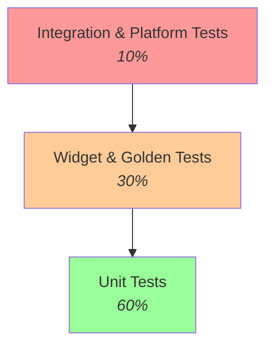

# Pertemuan 11: Testing & Quality Assurance

## Tujuan Pembelajaran

Bab-bab sebelumnya menutup dengan janji yang sama: "semua lapisan ini diuji tanpa perangkat dan tanpa server sungguhan." Bab ini adalah tempat janji itu dibayar. Tracker dari bab 3–10 kini punya model, controller, repository SQLite, klien API, dan mesin sinkronisasi, dan aplikasi studi kasus baru, **Kalkulator BMI**, akan dibangun dengan kesadaran testing sejak baris pertama, bukan diuji setelah selesai.

Testing yang buruk punya dua penyakit yang berkebalikan. Penyakit pertama: **semua diuji dengan semuanya**. Setiap test menyalakan emulator, memakai preferences sungguhan, memanggil server betulan, suite jujur tapi lambat, rapuh, dan lama-lama dihentikan orang. Penyakit kedua: **semua dimock**. Setiap test mengganti dependensi dengan tiruan yang menjawab apa saja, suite cepat tapi berhenti menguji hal yang penting, sampai-sampai test "persistence" berjalan di atas data yang tidak pernah menyinggah disk.

Obatnya bukan alat baru, tapi disiplin klasifikasi: kenali jenis test dari **tujuan dan biayanya**, lalu bayar biaya itu hanya ketika ada yang dibelinya. Setelah menyelesaikan bab ini, Anda bisa:

1. Memilih antara unit, widget, golden, integration, dan platform test dengan alasan yang bisa dipertahankan, bukan karena nama kedengarannya serius.
2. Membuat logika murni yang bisa diuji tanpa Flutter, dan mengujinya dalam hitungan detik.
3. Menjadikan fake repository sebagai default pengujian, dan menaruh mock hanya di tempat interaksi yang diverifikasi.
4. Menyuntikkan dependensi ke widget supaya widget test tidak bergantung pada plugin.
5. Membuktikan persistence sungguhan lewat integration test di perangkat, dan berhenti mengklaim durability dari test yang memakai store dalam memori.
6. Menguji jalur kegagalan bab 9 dan 10 tanpa menyalin seluruh suite mereka.

## Peta Jenis Test: Tujuan dan Biaya

Lima jenis test, lima tujuan yang tidak saling direbutkan. Proporsinya mengikuti piramida yang sudah klasik:



Tapi proporsi adalah akibat, bukan sebab. Sebabnya ada di tabel ini, terutama kolom biaya, karena di situlah keputusan diambil:

| Jenis           | Tujuan tunggal                                                | Lingkungan                            | Estimasi runtime (kasar)               | Jangan dipakai untuk                                  |
| --------------- | ------------------------------------------------------------- | ------------------------------------- | -------------------------------------- | ----------------------------------------------------- |
| **Unit**        | logika murni: hitungan, parser, state machine, aturan domain  | Dart VM, tanpa rendering              | milidetik per test; grup selesai detik | hal yang butuh plugin, jaringan, atau piksel          |
| **Widget**      | satu widget: render, interaksi, state lokal                   | Flutter test env, rendering software  | 1–2 detik per test                     | alur lintas layar; kecepatan animasi sungguhan        |
| **Golden**      | regresi visual: bentuk, warna, ukuran, piksel sebagai kontrak | Flutter test env, font terkunci       | ±1 detik per file + biaya review diff  | perilaku; golden tidak tahu widget "benar" atau tidak |
| **Integration** | alur aplikasi utuh di emulator/perangkat, plugin sungguhan    | emulator atau perangkat betulan       | puluhan detik per skenario             | detail logika, terlalu mahal untuk per if-else        |
| **Platform**    | fitur perangkat: kamera, GPS, notifikasi, channel             | perangkat sungguhan (simulator tipis) | menit, bergantung perangkat            | logika yang bisa dilepas dari channel-nya             |

Dua baris terakhir sering ditukar-tukar tempatnya. Integration test menjalankan aplikasi Anda di dunia yang mendekati nyata; platform test menjalankan **perangkatnya**, kamera sungguhan butuh kamera sungguhan, dan tidak ada mock yang bisa membuktikan izin kamera ditolak pengguna lalu aplikasi Anda tetap santai. Aturan praktisnya: jika klaim yang diuji mengandung kata "perangkat", itu platform test; jika mengandung kata "alur", itu integration test.

Satu angka nyata sebagai patokan: fixture repositori contoh buku ini menjalankan **103 test** (unit + widget + golden) di toolchain terkunci dalam **sekitar 3 detik**. Seluruh bab ini dibangun agar sebagian besar pengujian hidup di zona murah itu, dan zona mahal hanya membayar untuk klaim yang tidak bisa dibeli di tempat lain.

## Checkpoint 1: Unit Test: Logika Murni, Biaya Nyaris Nol

**Target:** logika BMI hidup di class tanpa import Flutter; semua aturannya merah-hijau dalam hitungan detik.
**Waktu:** sekitar 30 menit.

Buat proyek baru agar bersih dari dependensi materi sebelumnya:

```bash
flutter create bmi_testing
cd bmi_testing
```

### Logika dulu, UI belakangan

Buat `lib/services/bmi_service.dart`. Perhatikan satu-satunya keputusan yang membuat class ini layak diuji: ia tidak tahu Flutter ada.

```dart
class BmiService {
  /// Menghitung BMI dari berat (kg) dan tinggi (cm).
  ///
  /// Lempar [ArgumentError] untuk input tidak positif: membiarkan
  /// pembagian dengan nol menghasilkan NaN yang lebih sulit dilacak.
  double calculateBmi(double weightKg, double heightCm) {
    if (heightCm <= 0 || weightKg <= 0) {
      throw ArgumentError('Berat dan tinggi harus bernilai positif.');
    }
    final heightM = heightCm / 100;
    return weightKg / (heightM * heightM);
  }

  /// Kategori BMI menurut ambang WHO untuk dewasa:
  /// < 18,5 kurus; 18,5–24,9 normal; 25–29,9 gemuk; >= 30 obesitas.
  String determineCategory(double bmi) {
    if (bmi < 18.5) return 'Kurus';
    if (bmi < 25) return 'Normal';
    if (bmi < 30) return 'Gemuk';
    return 'Obesitas';
  }
}
```

Kegagalan yang dilaporkan dengan eksplisit (`ArgumentError`) adalah bagian dari kontrak, bukan efek samping. Test akan mengunci kedua sisi kontrak itu: hasil benar dan kegagalan jujur.

### Test yang mengunci batas

Buat `test/unit/bmi_service_test.dart`:

```dart
import 'package:flutter_test/flutter_test.dart';
import 'package:bmi_testing/services/bmi_service.dart';

void main() {
  group('BmiService', () {
    late BmiService service;

    setUp(() => service = BmiService());

    test('hitung BMI benar untuk input valid', () {
      // 70 / (1,75 × 1,75) = 22,86 (dibulatkan dua desimal).
      final result = service.calculateBmi(70, 175);
      expect(result, closeTo(22.86, 0.01));
    });

    test('tinggi nol melempar ArgumentError, bukan NaN diam-diam', () {
      expect(() => service.calculateBmi(70, 0), throwsArgumentError);
    });

    test('berat negatif ditolak sejak awal', () {
      expect(() => service.calculateBmi(-70, 175), throwsArgumentError);
    });

    test('ambang kategori tepat: 18,5 mulai Normal, 25 mulai Gemuk', () {
      expect(service.determineCategory(18.4), 'Kurus');
      expect(service.determineCategory(18.5), 'Normal');
      expect(service.determineCategory(24.9), 'Normal');
      expect(service.determineCategory(25), 'Gemuk');
      expect(service.determineCategory(29.9), 'Gemuk');
      expect(service.determineCategory(30), 'Obesitas');
    });
  });
}
```

Jalankan:

```bash
flutter test test/unit/bmi_service_test.dart
```

Perhatikan test terakhir. Ambang adalah tempat bug paling sering sembunyi, `18.4` vs `18.5`, `24.9` vs `25`, karena satu baris kode mengurus dua kategori. Menguji nilai tengah rentang itu menghibur; menguji tepi rentang itu menangkap bug. Dan biayanya nyaris nol: keempat test ini selesai dalam milidetik, jadi tidak ada alasan memilih kenyamanan daripada ketelitian.

## Checkpoint 2: Store Disuntikkan: Fake sebagai Default, Mock sebagai Pengecualian

**Target:** riwayat pengukuran tersimpan di preferences, tapi semua aturan domain diuji tanpa plugin; ke mana mock dan fake masing-masing dijalankan tidak lagi ditebak-tebak.
**Waktu:** sekitar 50 menit.

Aplikasi BMI yang berguna menyimpan riwayat pengukuran. Tempat alaminya di Flutter kecil adalah preferences, bab 7 memakainya untuk preferensi tema lewat `SharedPreferencesAsync`. Tapi begitu kata "preferences" masuk kode test, dua hal yang berbeda sering dicampur jadi satu:

- **Test semantik**: apakah riwayat diurutkan terbaru dulu? apakah dibatasi 10 catatan? apakah baris rusak dilewati? Ini pertanyaan tentang logika Anda.
- **Test persistence**: apakah data benar-benar bertahan setelah proses aplikasi mati? Ini pertanyaan tentang plugin dan disk perangkat.

Mock preferences menjawab pertanyaan pertama dengan murah dan pertanyaan kedua dengan bohong. Maka bab ini memisahkan keduanya secara arsitektural, dengan pola yang sama seperti `TaskRepository` bab 2: satu kontrak, dua implementasi.

### Kontrak store, dua implementasi

Tambahkan dependensi, lalu buat `lib/models/bmi_record.dart` dan `lib/services/bmi_history_store.dart`:

```yaml
dependencies:
  flutter:
    sdk: flutter
  shared_preferences: ^2.2.3
```

```dart
// lib/models/bmi_record.dart
class BmiRecord {
  const BmiRecord({
    required this.timestamp,
    required this.weightKg,
    required this.heightCm,
    required this.bmi,
    required this.category,
  });

  final DateTime timestamp;
  final double weightKg;
  final double heightCm;
  final double bmi;
  final String category;

  factory BmiRecord.fromJson(Map<String, dynamic> json) {
    return BmiRecord(
      timestamp: DateTime.parse(json['timestamp'] as String),
      weightKg: (json['weightKg'] as num).toDouble(),
      heightCm: (json['heightCm'] as num).toDouble(),
      bmi: (json['bmi'] as num).toDouble(),
      category: json['category'] as String,
    );
  }

  Map<String, dynamic> toJson() => {
    'timestamp': timestamp.toIso8601String(),
    'weightKg': weightKg,
    'heightCm': heightCm,
    'bmi': bmi,
    'category': category,
  };

  /// Tanggal singkat untuk daftar riwayat, format tetap (bukan sesuai
  /// locale) supaya test tidak berubah antar-mesin.
  String get displayDate {
    final hh = timestamp.hour.toString().padLeft(2, '0');
    final mm = timestamp.minute.toString().padLeft(2, '0');
    return '${timestamp.day}/${timestamp.month}/${timestamp.year} $hh:$mm';
  }
}
```

```dart
// lib/services/bmi_history_store.dart
import 'dart:convert';

import 'package:shared_preferences/shared_preferences.dart';

import '../models/bmi_record.dart';

/// Kontrak penyimpanan riwayat BMI: layar dan service tidak tahu
/// dan tidak perlu tahu: apakah datanya hidup di memori atau di
/// preferences. Di pengujian, kontrak ini dipenuhi store palsu
/// dalam memori; di produksi, oleh preferences.
abstract interface class BmiHistoryStore {
  Future<List<BmiRecord>> load();
  Future<void> saveAll(List<BmiRecord> history);
  Future<void> clear();
}

/// Store palsu untuk pengembangan dan pengujian: meniru semantik
/// load/saveAll/clear tanpa menyentuh plugin apa pun.
class MemoryBmiHistoryStore implements BmiHistoryStore {
  final List<BmiRecord> _records = [];

  @override
  Future<List<BmiRecord>> load() async => List.unmodifiable(_records);

  @override
  Future<void> saveAll(List<BmiRecord> history) async {
    _records
      ..clear()
      ..addAll(history);
  }

  @override
  Future<void> clear() async => _records.clear();
}

/// Implementasi preferences (produksi): satu kunci berisi daftar
/// JSON. Baris yang rusak dilewati, bukan menghapus seluruh riwayat.
///
/// Perhatikan batasnya: class ini hanya menjajakan pembacaan dan
/// penulisan plugin. Apakah data benar-benar bertahan setelah proses
/// aplikasi mati tidak bisa dibuktikan di sini: itu pekerjaan
/// integration test di perangkat sungguhan (Checkpoint 5).
class PreferencesBmiHistoryStore implements BmiHistoryStore {
  PreferencesBmiHistoryStore({
    SharedPreferencesAsync? preferences,
    this.maxSize = 10,
  }) : _preferences = preferences ?? SharedPreferencesAsync();

  static const _historyKey = 'bmi_history';

  final SharedPreferencesAsync _preferences;
  final int maxSize;

  @override
  Future<List<BmiRecord>> load() async {
    final lines = await _preferences.getStringList(_historyKey) ?? const [];
    final records = <BmiRecord>[];
    for (final line in lines) {
      try {
        records.add(
          BmiRecord.fromJson(jsonDecode(line) as Map<String, dynamic>),
        );
      } on FormatException {
        // Baris rusak dilewati; riwayat valid tetap terbaca.
      } on TypeError {
        // Struktur JSON tidak sesuai (mis. field hilang): lewati.
      }
    }
    return records;
  }

  @override
  Future<void> saveAll(List<BmiRecord> history) async {
    final capped = history.take(maxSize).toList(growable: false);
    final lines = capped.map((r) => jsonEncode(r.toJson())).toList();
    await _preferences.setStringList(_historyKey, lines);
  }

  @override
  Future<void> clear() => _preferences.remove(_historyKey);
}
```

Aturan domain, terbaru di depan, maksimal sepuluh, tidak boleh tercecer di layar. Ia punya rumah sendiri, `lib/services/bmi_history_service.dart`:

```dart
import 'bmi_history_store.dart';
import '../models/bmi_record.dart';

/// Pemilik aturan domain riwayat BMI: terbaru di depan dan jumlahnya
/// dibatasi. Logika ini bebas plugin karena penyimpanan diserahkan
/// ke [BmiHistoryStore] yang disuntikkan: store palsu membuat
/// seluruh aturan bisa diuji tanpa preferences sungguhan.
class BmiHistoryService {
  BmiHistoryService({required this.store, this.maxSize = 10});

  final BmiHistoryStore store;
  final int maxSize;

  /// Membaca riwayat dari store, diurutkan terbaru di depan. Urutan
  /// dan batas jumlah adalah aturan domain: di sini, bukan di
  /// implementasi store.
  Future<List<BmiRecord>> load() async {
    final records = [...await store.load()];
    records.sort((a, b) => b.timestamp.compareTo(a.timestamp));
    return records;
  }

  /// Menambah catatan di depan, memangkas yang paling lama, lalu
  /// mengembalikan daftar terbaru: pemanggil bisa memakainya
  /// langsung sebagai state UI.
  Future<List<BmiRecord>> add(BmiRecord record) async {
    final history = await load();
    final capped = [record, ...history].take(maxSize).toList(growable: false);
    await store.saveAll(capped);
    return capped;
  }

  /// Menghapus seluruh riwayat.
  Future<void> clear() => store.clear();
}
```

### Semua aturan domain, diuji tanpa plugin

Buat `test/unit/bmi_history_service_test.dart`. Satu-satunya "perkakas" yang dibutuhkan: `MemoryBmiHistoryStore`.

```dart
import 'package:flutter_test/flutter_test.dart';
import 'package:bmi_testing/services/bmi_history_service.dart';
import 'package:bmi_testing/services/bmi_history_store.dart';
import 'package:bmi_testing/models/bmi_record.dart';

void main() {
  BmiRecord record(int hoursAgo, {double weight = 70}) => BmiRecord(
    timestamp: DateTime(2026, 1, 1, 12).subtract(Duration(hours: hoursAgo)),
    weightKg: weight,
    heightCm: 175,
    bmi: weight / 3.0625,
    category: 'Normal',
  );

  group('BmiHistoryService dengan store memori', () {
    late MemoryBmiHistoryStore store;
    late BmiHistoryService service;

    setUp(() {
      store = MemoryBmiHistoryStore();
      service = BmiHistoryService(store: store);
    });

    test('riwayat baru dimulai kosong', () async {
      expect(await service.load(), isEmpty);
    });

    test('add mengembalikan daftar terbaru di depan', () async {
      await service.add(record(2));
      await service.add(record(1));

      final records = await service.load();
      expect(records, hasLength(2));
      expect(
        records.first.timestamp.isAfter(records.last.timestamp),
        isTrue,
      );
    });

    test('batas 10 record: yang paling lama terpangkas', () async {
      final base = DateTime(2026, 1, 1, 12);
      // 11 catatan dari yang paling lama ke yang paling baru.
      for (var i = 11; i >= 1; i--) {
        await service.add(record(i));
      }

      final records = await service.load();
      expect(records, hasLength(10));
      // Catatan terlama yang tersisa adalah 10 jam sebelum basis
      // catatan 11 jam sebelum basis sudah terpangkas.
      final oldest = records
          .map((r) => r.timestamp)
          .reduce((a, b) => a.isBefore(b) ? a : b);
      expect(oldest, base.subtract(const Duration(hours: 10)));
    });

    test('clear mengosongkan riwayat di store', () async {
      await service.add(record(1));
      await service.clear();

      expect(await service.load(), isEmpty);
      expect(await store.load(), isEmpty);
    });
  });
}
```

### Test preferences dalam memori: dan klaim yang tidak boleh diucapkannya

`PreferencesBmiHistoryStore` tetap perlu diuji: round-trip JSON-nya, pemangkasan `maxSize`, dan ketahanannya terhadap baris rusak. Untuk itu, ganti platform store preferences dengan store dalam memori, persis pola `SettingsController` bab 7, lewat `InMemorySharedPreferencesAsync` dari `shared_preferences_platform_interface` (tambahkan sebagai dev dependency):

```yaml
dev_dependencies:
  flutter_test:
    sdk: flutter
  integration_test:
    sdk: flutter
  shared_preferences_platform_interface: ^2.4.0
```

```dart
// test/unit/preferences_bmi_history_store_test.dart: intinya
import 'dart:convert';

import 'package:flutter_test/flutter_test.dart';
import 'package:shared_preferences/shared_preferences.dart';
import 'package:shared_preferences_platform_interface/in_memory_shared_preferences_async.dart';
import 'package:shared_preferences_platform_interface/shared_preferences_async_platform_interface.dart';
import 'package:bmi_testing/services/bmi_history_store.dart';
import 'package:bmi_testing/models/bmi_record.dart';

void main() {
  // Store dalam memori menggantikan plugin preferences: test ini
  // memverifikasi serialisasi dan ketahanan terhadap data rusak
  // BUKAN ketahanan data di disk antar-restart perangkat. Yang
  // terakhir itu pekerjaan integration test di perangkat sungguhan.
  setUp(() {
    SharedPreferencesAsyncPlatform.instance =
        InMemorySharedPreferencesAsync.empty();
  });

  test('saveAll lalu load: isi pulih sama, terbaru tetap di depan', () async {
    final store = PreferencesBmiHistoryStore();
    final newest = BmiRecord(
      timestamp: DateTime(2026, 1, 2),
      weightKg: 80,
      heightCm: 175,
      bmi: 26.1,
      category: 'Gemuk',
    );
    final oldest = BmiRecord(
      timestamp: DateTime(2026, 1, 1),
      weightKg: 70,
      heightCm: 175,
      bmi: 22.9,
      category: 'Normal',
    );

    await store.saveAll([newest, oldest]);
    final loaded = await store.load();

    expect(loaded, hasLength(2));
    expect(loaded.first.timestamp, DateTime(2026, 1, 2));
    expect(loaded.last.weightKg, 70); // round-trip JSON tidak mengubah nilai
    expect(loaded.last.category, 'Normal');
  });

  test('baris rusak dilewati, baris valid tetap terbaca', () async {
    final valid = BmiRecord(
      timestamp: DateTime(2026, 1, 1),
      weightKg: 70,
      heightCm: 175,
      bmi: 22.9,
      category: 'Normal',
    );
    // Tulis langsung ke store dalam memori: satu baris bukan JSON,
    // satu JSON tanpa field wajib, satu valid.
    SharedPreferencesAsyncPlatform.instance =
        InMemorySharedPreferencesAsync.withData({
      'bmi_history': [
        'bukan json',
        jsonEncode({'weightKg': 70}),
        jsonEncode(valid.toJson()),
      ],
    });

    final store = PreferencesBmiHistoryStore();
    final loaded = await store.load();

    expect(loaded, hasLength(1));
    expect(loaded.single.category, 'Normal');
  });
}
```

Baca ulang komentar di `setUp`, itu bukan hiasan. Test ini menulis dan membaca preferences, dan datanya memang hilang begitu test selesai. Ia membuktikan bahwa serialisasi Anda jujur, dan **tidak lebih dari itu**. Klaim "riwayat bertahan setelah aplikasi mati" hanya sah dari integration test di Checkpoint 5, yang memakai plugin asli di perangkat asli. Membiarkan test dalam memori berpose sebagai bukti durability adalah bug dokumentasi, jenis bug yang paling sering lolos review karena hijau di CI.

### Fake untuk keadaan, mock untuk interaksi

Kapan tetap memakai mock sungguhan (`mocktail`, `mockito`)? Satu jawaban: ketika yang diverifikasi adalah **interaksi**, bukan keadaan. Fake menjawab "apa yang terjadi pada data?"; mock menjawab "siapa memanggil siapa, berapa kali, dengan argumen apa?".

Contoh keputusan nyata dari bab 10: `SyncEngine` harus **berhenti** memanggil `save` setelah server menjawab `InvalidPayload`, memanggil ulang payload yang ditolak hanya membakar baterai. Itu pertanyaan interaksi, dan di fixture ia diuji dengan script lemparan di remote palsu. Sebaliknya, "riwayat terbatas sepuluh catatan" adalah keadaan, fake memenuhinya tanpa perlu tahu berapa kali `saveAll` dipanggil.

Aturan praktis untuk dibawa pulang:

- Default: fake yang memenuhi kontrak (`MemoryBmiHistoryStore`, `MemoryTaskRepository`, `ScriptedRemote` bab 10). Test jadi membaca seperti skenario, bukan daftar panggilan.
- Mock (`mocktail`/`mockito`) hanya ketika hitungan dan urutan panggilan adalah bagian dari perilaku yang dijanjikan, dan `verify` Anda sebaiknya sesedikit asersi keadaan lainnya.
- Jangan pernah keduanya sekaligus untuk satu dependensi dalam satu test; test yang setengah memverifikasi keadaan setengah interaksi biasanya sedang menguji dua hal dan menjelaskan nol.

## Checkpoint 3: Widget Test: Layar dengan Dependensi Disuntikkan

**Target:** layar BMI lengkap (input, hasil, riwayat) diuji tanpa plugin; kegagalan penyimpanan tidak menelan aplikasi.
**Waktu:** sekitar 40 menit.

### Layar yang menerima torenya

Ganti `lib/main.dart` dengan layar yang menyuntikkan store lewat constructor. Produksi memakai preferences; test memakai memori, layarnya tidak berubah satu baris pun di antara keduanya.

```dart
// lib/main.dart: intinya; kode lengkap ada di fixture repositori contoh
import 'package:flutter/material.dart';

import 'services/bmi_service.dart';
import 'services/bmi_history_service.dart';
import 'services/bmi_history_store.dart';

void main() {
  runApp(
    MaterialApp(
      home: BmiScreen(store: PreferencesBmiHistoryStore()),
    ),
  );
}

class BmiScreen extends StatefulWidget {
  BmiScreen({super.key, BmiHistoryStore? store, BmiService? service})
    : _service = service ?? BmiService(),
      _history = BmiHistoryService(
        store: store ?? PreferencesBmiHistoryStore(),
      );

  final BmiService _service;
  final BmiHistoryService _history;

  // ... state di bawah
}
```

Bagian state yang menentukan perilakunya, dua keputusan yang widget test akan kunci:

```dart
// ... lanjutan _BmiScreenState
Future<void> _calculate() async {
  final weight = double.tryParse(_weightController.text);
  final height = double.tryParse(_heightController.text);
  if (weight == null || height == null) {
    setState(() => _error = 'Masukkan angka yang valid.');
    return;
  }

  try {
    final bmi = widget._service.calculateBmi(weight, height);
    final category = widget._service.determineCategory(bmi);
    final record = BmiRecord(
      timestamp: DateTime.now(),
      weightKg: weight,
      heightCm: height,
      bmi: bmi,
      category: category,
    );

    // Kegagalan menyimpan riwayat tidak boleh menelan hasil
    // perhitungan: hasil tetap tampil, kegagalan dilaporkan.
    List<BmiRecord> updated;
    try {
      updated = await widget._history.add(record);
    } catch (_) {
      if (!mounted) return;
      setState(() {
        _result = 'BMI: ${bmi.toStringAsFixed(1)} - $category';
        _error = 'Riwayat gagal disimpan.';
      });
      return;
    }

    if (!mounted) return;
    setState(() {
      _result = 'BMI: ${bmi.toStringAsFixed(1)} - $category';
      _records = updated;
      _error = '';
    });
  } on ArgumentError {
    setState(() => _error = 'Masukkan angka yang valid.');
  }
}
```

Struktur build-nya sederhana: dua `TextField` bertombol `Key('weight_field')` dan `Key('height_field')`, tombol `Key('calculate_button')`, teks hasil `Key('result_text')`, pesan error `Key('error_text')`, header `Key('history_header')`, item riwayat `Key('history_item_$i')`, dan tombol hapus `Key('clear_history_button')`. Key bukan dekorasi, ia adalah alamat widget di test; `find.byKey` lebih tahan refactor daripada `find.text` yang ikut berubah setiap kali copywriting disentuh.

### Widget test, termasuk jalur kegagalannya

Buat `test/widget/bmi_screen_test.dart`:

```dart
import 'package:flutter/material.dart';
import 'package:flutter_test/flutter_test.dart';
import 'package:bmi_testing/main.dart';
import 'package:bmi_testing/services/bmi_history_store.dart';
import 'package:bmi_testing/models/bmi_record.dart';

/// Store yang selalu melempar: mensimulasikan kegagalan penyimpanan
/// seperti yang dialami repository sungguhan (disk penuh, plugin
/// error) tanpa harus membuat kegagalannya sungguhan.
class FailingBmiHistoryStore implements BmiHistoryStore {
  FailingBmiHistoryStore(this.error);

  final Object error;

  @override
  Future<List<BmiRecord>> load() async => const [];

  @override
  Future<void> saveAll(List<BmiRecord> history) async => throw error;

  @override
  Future<void> clear() async {}
}

void main() {
  Future<void> pumpScreen(WidgetTester tester, {BmiHistoryStore? store}) async {
    await tester.pumpWidget(
      MaterialApp(home: BmiScreen(store: store ?? MemoryBmiHistoryStore())),
    );
    await tester.pumpAndSettle(); // pemuatan riwayat async
  }

  Future<void> enterMeasurement(
    WidgetTester tester, {
    String weight = '70',
    String height = '175',
  }) async {
    await tester.enterText(find.byKey(const Key('weight_field')), weight);
    await tester.enterText(find.byKey(const Key('height_field')), height);
    FocusManager.instance.primaryFocus?.unfocus();
    await tester.pump();
    await tester.tap(find.byKey(const Key('calculate_button')));
    await tester.pumpAndSettle();
  }

  testWidgets('kondisi awal: riwayat kosong, hasil kosong', (tester) async {
    await pumpScreen(tester);

    expect(find.text('Kalkulator BMI'), findsOneWidget);
    expect(find.text('Riwayat (0/10)'), findsOneWidget);
    expect(find.text('Belum ada riwayat.'), findsOneWidget);
    expect(find.byKey(const Key('result_text')), findsNothing);
  });

  testWidgets('hitung menampilkan hasil dan menambah riwayat', (tester) async {
    await pumpScreen(tester);

    await enterMeasurement(tester);

    expect(find.text('BMI: 22.9 - Normal'), findsOneWidget);
    expect(find.text('Riwayat (1/10)'), findsOneWidget);
    expect(find.byKey(const Key('history_item_0')), findsOneWidget);
  });

  testWidgets('input tidak valid ditolak dengan pesan', (tester) async {
    await pumpScreen(tester);

    // Tap tanpa mengisi apa pun.
    await tester.tap(find.byKey(const Key('calculate_button')));
    await tester.pumpAndSettle();

    expect(find.text('Masukkan angka yang valid.'), findsOneWidget);
    expect(find.text('Riwayat (0/10)'), findsOneWidget); // riwayat tak tersentuh
  });

  testWidgets(
    'jalur kegagalan: riwayat gagal disimpan, hasil tetap tampil',
    (tester) async {
      await pumpScreen(
        tester,
        store: FailingBmiHistoryStore(Exception('disk penuh')),
      );

      await enterMeasurement(tester);

      // Perhitungan lokal berhasil: hasil tetap layak dilihat.
      expect(find.text('BMI: 22.9 - Normal'), findsOneWidget);
      // Kegagalan penyimpanan dilaporkan, bukan menelan aplikasi.
      expect(find.text('Riwayat gagal disimpan.'), findsOneWidget);
      expect(find.text('Riwayat (0/10)'), findsOneWidget);
      expect(tester.takeException(), isNull);
    },
  );

  testWidgets(
    'hapus riwayat mengosongkan daftar dan tombolnya hilang',
    (tester) async {
      await pumpScreen(tester);

      await enterMeasurement(tester);
      expect(find.byKey(const Key('clear_history_button')), findsOneWidget);

      await tester.tap(find.byKey(const Key('clear_history_button')));
      await tester.pumpAndSettle();

      expect(find.text('Riwayat (0/10)'), findsOneWidget);
      expect(find.byKey(const Key('clear_history_button')), findsNothing);
    },
  );
}
```

Empat hal yang membuat kelompok ini sehat:

1. **Satu helper untuk setup berulang** (`pumpScreen`, `enterMeasurement`). Test yang menyalin sepuluh baris setup di setiap kasus akan berhenti diperbarui begitu setup itu berubah.
2. **Cari lewat `Key`, asersi lewat teks.** Pencarian tahan refactor; asersi teks memang sengaja rapuh, jika copywriter mengubah "Riwayat gagal disimpan.", Anda ingin tahu.
3. **`pumpAndSettle` untuk alur async**, `pump` untuk satu frame. Aturan ini dari dokumentasi `flutter_test`, dan mengabaikannya adalah sumber utama test widget yang berosilasi merah-hijau.
4. **Jalur kegagalan punya test sendiri**: lihat bagian berikutnya.

Jalankan dan perhatikan waktunya:

```bash
flutter test test/widget/bmi_screen_test.dart
```

Lima test ini selesai dalam hitungan detik. Itu bukan pujian kosong: artinya Anda bisa menjalankannya setiap kali menyimpan file, dan umpan baliknya datang sebelum konteks di kepala Anda menguap.

### Jalur kegagalan dari bab 9 dan 10, tanpa menggandakan suite

Bab 9 dan 10 sudah menetapkan pemetaan kegagalan: jaringan putus berarti coba lagi nanti (`NetworkFailure`), sesi habis berarti arahkan masuk lagi (`SessionExpired`), payload ditolak berarti berhenti tanpa mengulang (`InvalidPayload`), dan antrean outbox tidak boleh dibuang oleh kegagalan apa pun. Test-test untuk semua itu **sudah ada** di fixture, mengutip ulang seluruh grupnya di bab ini hanya menggandakan biaya pemeliharaan tanpa menambah satu pun perlindungan.

Yang bab ini tambahkan adalah pola kegagalan yang belum diwakili: **kegagalan penyimpanan di level layar**. `FailingBmiHistoryStore` di atas membuktikan bahwa BMI tetap dihitung, pesan tetap tampil, dan aplikasi tetap hidup, pola yang sama yang membuat `TaskListController` bab 7 memetik `TaskListError` alih-alih crash ketika repository-nya melempar. Bila suatu hari layar BMI Anda bicara dengan API (bab 9), pola yang dipertahankan sama: kegagalan jaringan tidak menghapus hasil lokal; kegagalan sesi mengarahkan ke layar masuk; keduanya punya test masing-masing di grup yang sudah ada.

Pemetaan lengkapnya, dan di mana buktinya hidup:

| Kegagalan                          | Perilaku yang dijanjikan                   | Dibuktikan di fixture oleh               |
| ---------------------------------- | ------------------------------------------ | ---------------------------------------- |
| Jaringan putus (bab 9)             | `NetworkFailure`, pesan "periksa jaringan" | `test/api/api_task_repository_test.dart` |
| Sesi habis (bab 9)                 | refresh gagal dobel → `SessionExpired`     | `test/api/auth_api_test.dart`            |
| Sinkronisasi gagal (bab 10)        | outbox dipertahankan, pull batal           | `test/sync/sync_engine_test.dart`        |
| Payload ditolak (bab 10)           | tidak diulang buta                         | `test/sync/sync_engine_test.dart`        |
| Penyimpanan riwayat gagal (bab 11) | hasil tetap tampil, aplikasi hidup         | `test/widget/bmi_screen_test.dart`       |

## Checkpoint 4: Golden Test: Piksel sebagai Kontrak

**Target:** perubahan visual yang tidak disengaja tertangkap sebelum sampai mata pembaca; golden dipakai secukupnya di tempat yang tepat.
**Waktu:** sekitar 25 menit.

Widget test tahu `CategoryChip` berisi teks "Gemuk", tapi tidak tahu chip itu berwarna apa, seberapa besar, atau apakah membesar saat teks discale. Golden menangkap wilayah itu: ia merender widget ke gambar dan membandingkan piksel demi piksel dengan berkas acuan yang Anda kunci di repositori.

Buat `lib/widgets/category_chip.dart`:

```dart
import 'package:flutter/material.dart';

/// Chip kategori BMI: memetakan kategori ke pasangan warna
/// container/onContainer dari color scheme: kontrasnya dijamin
/// sistem tema, bukan warna hardcode. Widget kecil dan bebas state
/// seperti ini kandidat alami untuk golden test.
class CategoryChip extends StatelessWidget {
  const CategoryChip({super.key, required this.category});

  final String category;

  @override
  Widget build(BuildContext context) {
    final scheme = Theme.of(context).colorScheme;
    final (background, foreground) = switch (category) {
      'Kurus' => (scheme.secondaryContainer, scheme.onSecondaryContainer),
      'Normal' => (scheme.primaryContainer, scheme.onPrimaryContainer),
      'Gemuk' => (scheme.tertiaryContainer, scheme.onTertiaryContainer),
      _ => (scheme.errorContainer, scheme.onErrorContainer),
    };

    return Container(
      padding: const EdgeInsets.symmetric(horizontal: 12, vertical: 4),
      decoration: BoxDecoration(
        color: background,
        borderRadius: BorderRadius.circular(12),
      ),
      child: Text(
        category,
        style: Theme.of(
          context,
        ).textTheme.labelMedium?.copyWith(color: foreground),
      ),
    );
  }
}
```

Dan test-nya, `test/widget/category_chip_golden_test.dart`:

```dart
import 'package:flutter/material.dart';
import 'package:flutter_test/flutter_test.dart';
import 'package:bmi_testing/widgets/category_chip.dart';

void main() {
  testWidgets('golden: empat chip pada ukuran tetap', (tester) async {
    // Golden membandingkan piksel, bukan logika: pakainya untuk
    // regresi visual widget kecil yang bentuknya adalah kontraknya.
    // Ukuran layar dipatok supaya perubahan layout terlihat sebagai
    // perbedaan piksel yang jujur, bukan reflow.
    tester.view.physicalSize = const Size(400, 120);
    tester.view.devicePixelRatio = 1.0;
    addTearDown(tester.view.reset);

    await tester.pumpWidget(
      const MaterialApp(
        home: Scaffold(
          body: Center(
            child: Row(
              key: Key('category_row'),
              mainAxisSize: MainAxisSize.min,
              children: [
                CategoryChip(category: 'Kurus'),
                CategoryChip(category: 'Normal'),
                CategoryChip(category: 'Gemuk'),
                CategoryChip(category: 'Obesitas'),
              ],
            ),
          ),
        ),
      ),
    );

    await expectLater(
      find.byKey(const Key('category_row')),
      matchesGoldenFile('goldens/category_chips.png'),
    );
  });
}
```

Saat pertama kali membuat golden, jalankan dengan `--update-goldens` untuk menghasilkan berkas acuan, periksa gambarnya dengan mata Anda, commit bersama test-nya, lalu jalankan normal setelahnya:

```bash
flutter test --update-goldens test/widget/category_chip_golden_test.dart
flutter test test/widget/category_chip_golden_test.dart
```

Biaya golden yang jujur, supaya tidak terkejut:

- **Ia rapuh terhadap hal yang bukan bug Anda.** Font sistem, versi Flutter, dan anti-aliasing lintas platform bisa membuat golden gagal tanpa satu pun piksel "salah". Karena itu test di atas memakai lingkungan test dengan font bawaan yang terkunci, deterministik antar-mesin, dan golden di repositori ini dijalankan di toolchain yang versinya dikunci.
- **Diff-nya harus direview seperti kode.** Golden yang di-regenerate buta terhadap "lebih baik atau lebih buruk", ia hanya tahu "berubah". Biasakan melihat PNG diff sebelum menerima.
- **Jarak tempuhnya pendek.** Golden cocok untuk widget kecil yang bentuk adalah kontraknya (chip, badge, sel daftar khusus). Golden untuk seluruh layar berumur pendek: setiap perubahan copywriting membatalkannya.

## Checkpoint 5: Integration Test di Perangkat: Persistence yang Sebenarnya

**Target:** klaim "riwayat bertahan setelah aplikasi mati" dibuktikan dengan plugin asli di emulator/perangkat, tanpa satu baris mock.
**Waktu:** sekitar 40 menit, plus waktu menyalakan emulator.

Semua checkpoint sebelumnya sengaja hidup di zona murah. Sekarang satu-satunya klaim yang tidak bisa dibeli di sana: **durability**. Tidak ada store dalam memori yang bisa membuktikannya, hanya plugin asli yang benar-benar menulis ke disk perangkat.

Buat `integration_test/app_test.dart` (folder ini sejajar `lib` dan `test`; `integration_test` sudah ada di dev dependencies sejak Checkpoint 2):

```dart
import 'package:flutter/material.dart';
import 'package:flutter_test/flutter_test.dart';
import 'package:integration_test/integration_test.dart';
import 'package:shared_preferences/shared_preferences.dart';
import 'package:bmi_testing/main.dart';
import 'package:bmi_testing/services/bmi_history_store.dart';

/// Integration test persistence nyata: berjalan di emulator atau
/// perangkat sungguhan dengan plugin preferences asli: tanpa mock,
/// tanpa store dalam memori. Hanya di sinilah klaim "riwayat
/// bertahan" berarti.
void main() {
  IntegrationTestWidgetsFlutterBinding.ensureInitialized();

  setUp(() async {
    // Bersihkan preferences sungguhan antar-test. Plugin asli tetap
    // dipakai: yang dibersihkan isinya, bukan diganti tiruannya.
    await SharedPreferencesAsync().clear();
  });

  testWidgets('alur penuh: hitung lalu riwayat tampil', (tester) async {
    await tester.pumpWidget(
      MaterialApp(home: BmiScreen(store: PreferencesBmiHistoryStore())),
    );
    await tester.pumpAndSettle();

    expect(find.text('Riwayat (0/10)'), findsOneWidget);

    await tester.enterText(find.byKey(const Key('weight_field')), '85');
    await tester.enterText(find.byKey(const Key('height_field')), '180');
    FocusManager.instance.primaryFocus?.unfocus();
    await tester.pumpAndSettle();

    await tester.tap(find.byKey(const Key('calculate_button')));
    await tester.pumpAndSettle();

    // 85 / (1,8 × 1,8) = 26,2 → Gemuk.
    expect(find.text('BMI: 26.2 - Gemuk'), findsOneWidget);
    expect(find.text('Riwayat (1/10)'), findsOneWidget);
    expect(find.byKey(const Key('history_item_0')), findsOneWidget);
  });

  testWidgets('riwayat bertahan setelah aplikasi dijalankan ulang',
      (tester) async {
    // Sesi pertama: simpan satu pengukuran ke preferences asli.
    await tester.pumpWidget(
      MaterialApp(home: BmiScreen(store: PreferencesBmiHistoryStore())),
    );
    await tester.pumpAndSettle();

    await tester.enterText(find.byKey(const Key('weight_field')), '75');
    await tester.enterText(find.byKey(const Key('height_field')), '180');
    FocusManager.instance.primaryFocus?.unfocus();
    await tester.pumpAndSettle();
    await tester.tap(find.byKey(const Key('calculate_button')));
    await tester.pumpAndSettle();

    expect(find.text('Riwayat (1/10)'), findsOneWidget);

    // "Restart": widget baru dipompa di atas binding yang sama
    // state lama benar-benar dibuang, satu-satunya jalan balik data
    // adalah preferences yang benar-benar ditulis ke disk.
    await tester.pumpWidget(
      MaterialApp(home: BmiScreen(store: PreferencesBmiHistoryStore())),
    );
    await tester.pumpAndSettle();

    expect(find.text('Riwayat (1/10)'), findsOneWidget);
    expect(find.text('75.0 kg, 180.0 cm'), findsOneWidget);
  });
}
```

Perbedaannya dengan semua test sebelumnya bukan sintaks, mirip sekali, melainkan **apa yang berdiri di belakangnya**. `SharedPreferencesAsync()` di sini bukan store dalam memori; ia plugin yang menulis ke penyimpanan platform. `FocusManager.instance.primaryFocus?.unfocus()` bukan formalitas; keyboard sungguhan menutupi tombol di layar sungguhan. Karena itu pula `pumpAndSettle` dipakai lebih sering: animasi, transisi, dan balasan plugin asli membutuhkan waktu sungguhan.

Jalankan dengan emulator atau perangkat tersambung:

```bash
flutter test integration_test/app_test.dart
```

Harganya puluhan detik per skenario, mahal, dan itulah sebabnya grup ini hanya berisi skenario yang tidak bisa dibeli lebih murah: alur penuh dan durability antar-restart. Logika pengurutan riwayat tidak diuji ulang di sini; ia sudah dikunci oleh unit test yang selesai dalam milidetik. Setiap test integration yang menduplikasi unit test adalah pembayaran kedua untuk barang yang sama.

### Platform test: ketika perangkatnya sendiri yang diuji

Di luar BMI, ada jenis terakhir yang perlu dikenali sebelum bab 12 membahasnya: platform test untuk fitur perangkat, kamera, GPS, notifikasi. Dua lapis pengujiannya:

1. **Logika channel di test biasa.** Handler Anda bisa diuji dengan memalsukan balasan channel lewat `TestDefaultBinaryMessengerBinding`, bab 12 menunjukkan polanya untuk channel baterai.
2. **Perilaku di perangkat sungguhan.** "Izin kamera ditolak lalu aplikasi tidak crash" hanya bisa dibuktikan dengan kamera sungguhan yang izinnya sungguhan ditolak, di perangkat, bukan di mock. Simulator sering berbohong di sini (selalu mengabulkan izin), jadi hitunglah grup ini sebagai grup termahal dan isi seperlunya.

## Menguji di Toolchain yang Dikunci

Seluruh kelompok test bab ini hidup sebagai proyek utuh di fixture repositori contoh (`flutter-gate/example_app`), dijalankan toolchain terkunci dengan satu command. Sembilan belas test baru membuktikan pola-pola bab ini:

| Kelompok                | Kasus yang dikunci                                                                                                  |
| ----------------------- | ------------------------------------------------------------------------------------------------------------------- |
| `BmiService`            | hitungan benar; nol/negatif melempar; ambang kategori tepat                                                         |
| `BmiHistoryService`     | kosong di awal; terbaru di depan; batas 10 memangkas terlama; clear mengosongkan                                    |
| Preferences store       | round-trip JSON; pemangkasan maxSize; baris rusak dilewati; clear menghapus kunci                                   |
| `BmiScreen` (widget)    | kondisi awal; hitung + riwayat; input tidak valid; **riwayat gagal disimpan, hasil tetap tampil**; hapus riwayat    |
| Golden                  | empat `CategoryChip` pada ukuran tetap, acuan terkunci di repositori                                                |
| Integration (perangkat) | alur penuh 26,2 → Gemuk; **riwayat bertahan setelah widget dijalankan ulang** (dianalisis, dijalankan di perangkat) |

```bash
npm run flutter:gate:test    # 103 test - seluruh suite dalam sekitar 3 detik
```

Golden di fixture dihasilkan sekali dengan `flutter test --update-goldens` di container yang sama, lalu berkas acuannya di-commit, golden yang dihasilkan mesin berbeda dengan font berbeda akan berbohong sejak hari pertama.

## Tips Debugging Test

- `debugDumpApp()` mencetak struktur widget tree ke console saat `find` gagal, sering lebih cepat daripada menebak.
- `pumpAndSettle()` untuk animasi dan alur async; `pump()` untuk memajukan satu frame. Widget test yang berosilasi biasanya salah pilih di antara keduanya.
- Interaktif (TextField, tombol) wajib `Key` unik; cari lewat `find.byKey`, asersi teks hanya untuk klaim yang memang tentang teks.
- Test gagal setelah refactor nama? Biarkan. Itu bukan test yang lemah; itu test yang memberi tahu kontraknya berubah.

## Ringkasan

- Lima jenis test dibedakan oleh tujuan dan biayanya: unit (logika murni, milidetik), widget (satu widget, detik), golden (piksel sebagai kontrak, rapuh dan secukupnya), integration (alur utuh di perangkat, puluhan detik), platform (fitur perangkat, termahal). Piramida adalah akibat dari tabel itu, bukan dogma.
- Fake repository/store adalah default pengujian: `MemoryBmiHistoryStore` memenuhi kontrak sehingga aturan domain diuji tanpa plugin. Mock (`mocktail`/`mockito`) hanya ketika interaksi yang diverifikasi, siapa memanggil siapa, berapa kali.
- Store dalam memori (termasuk `InMemorySharedPreferencesAsync`) membuktikan logika dan serialisasi, bukan durability. Persistence nyata hanya dibuktikan integration test dengan plugin asli di perangkat; berkas bab ini menulis batas itu di `setUp` agar tidak ada yang lupa.
- Layar menyuntikkan torenya lewat constructor: produksi preferences, test memori; `Key` adalah alamat widget di test.
- Jalur kegagalan diuji eksplisit: kegagalan menyimpan riwayat tidak menelan hasil perhitungan, dan grup kegagalan bab 9/10 tidak dikutip ulang, tabel pemetaan menunjukkan di mana buktinya hidup.
- Fixture menjalankan 103 test dalam sekitar 3 detik di toolchain terkunci; integration test dianalisis oleh gate dan dijalankan di perangkat.

Tracker dan BMI kini keduanya berdiri di atas suite yang bisa dieksekusi siapa pun dengan satu command. Bab 12 beralih ke perangkat itu sendiri, kamera, sensor, channel, dan membawa disiplin yang sama: lepas logika dari channel, uji logikanya murah, uji channel-nya di tempat channel hidup.

## Referensi Cepat

Pilih test berdasarkan klaim yang mau Anda beli:

```text
klaim                          jenis test          tempat
-----------------------------------------------------------------
"hasil hitungan/aturan benar"  unit                test/unit/
"widget ini merender/merespon" widget              test/widget/
"bentuk visual tidak berubah"  golden              test/widget/goldens/
"alur utuh bekerja di device"  integration         integration_test/
"fitur perangkat bekerja"      platform            perangkat sungguhan
```

Perintah harian:

```bash
flutter test                          # seluruh grup murah
flutter test test/unit/               # grup tertentu saat mengubah logika
flutter test --update-goldens <file>  # regenerasi acuan golden (review diff!)
flutter test integration_test/        # butuh emulator/perangkat aktif
```

## Bekerja dengan AI di Bab Ini

**Pantas didelegasikan:** meminta daftar kasus batas yang mungkin terlewat, dan menanyakan cara menguji satu perilaku yang membingungkan Anda.

**Tulis sendiri:** memutuskan apa yang pantas diuji. AI sangat produktif menghasilkan test, dan sebagian besar di antaranya menguji hal yang tidak akan pernah rusak. Test yang tidak pernah bisa gagal hanya memperlambat build. Bagian ini yang menentukan apakah bab ini benar-benar Anda kuasai.

**Latihan:** Minta AI membuat test untuk satu kelas Anda. Lalu untuk setiap test, rusak satu baris kode yang seharusnya membuatnya gagal. Test yang tetap hijau saat kodenya rusak tidak menguji apa pun, dan sebaiknya dihapus. Hitung berapa banyak yang lolos saringan ini; angkanya biasanya mengejutkan.

## Referensi Lanjutan

- Dokumentasi resmi testing Flutter, tempat piramida dan batas tiap jenis dijelaskan oleh pembuatnya: https://docs.flutter.dev/testing/overview
- Widget test dan `WidgetTester`, termasuk `pump` vs `pumpAndSettle`: https://docs.flutter.dev/testing/overview#widget-tests
- Golden test dan cara menguncinya: https://api.flutter.dev/flutter/flutter_test/matchesGoldenFile.html
- `integration_test` package untuk pengujian di perangkat: https://pub.dev/packages/integration_test
- Mocktail dan kapan verifikasi interaksi lebih tepat daripada fake: https://pub.dev/packages/mocktail
- Test doubles (fake, stub, mock, spy) dengan nama yang konsisten, Martin Fowler: https://martinfowler.com/articles/mocksArentStubs.html
