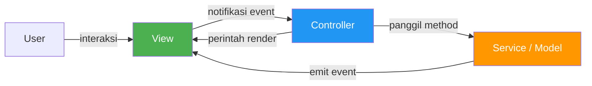
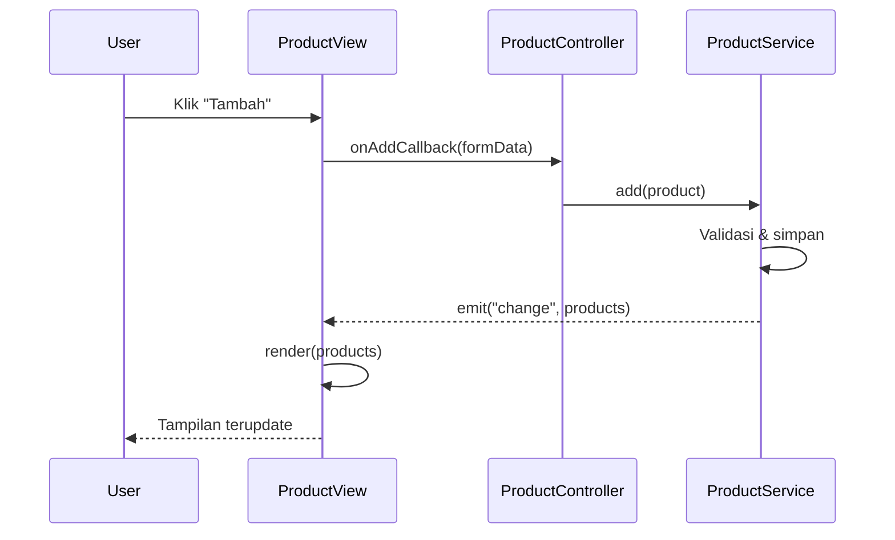
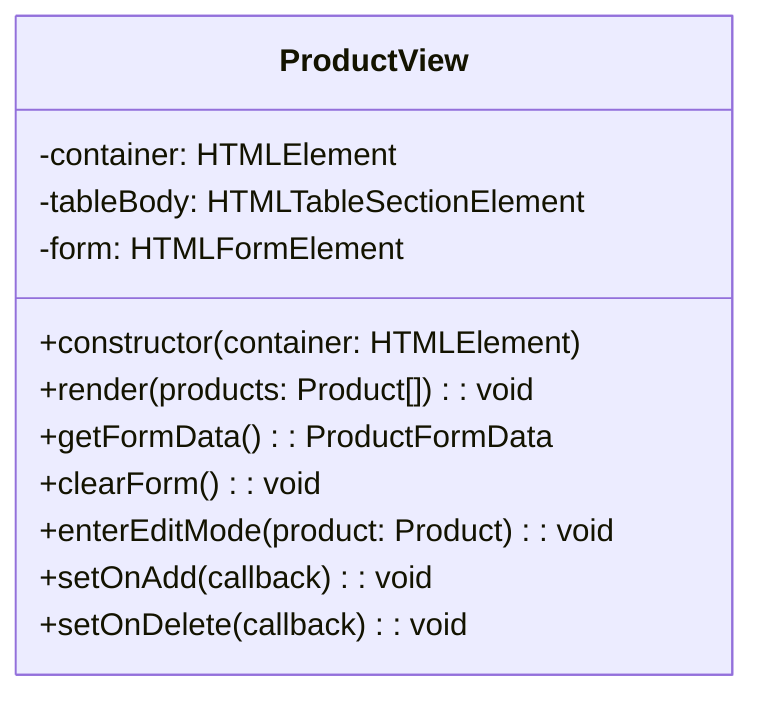
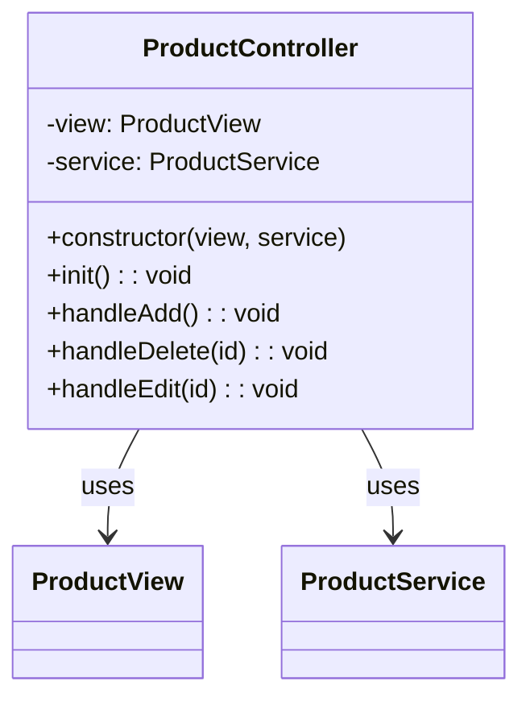
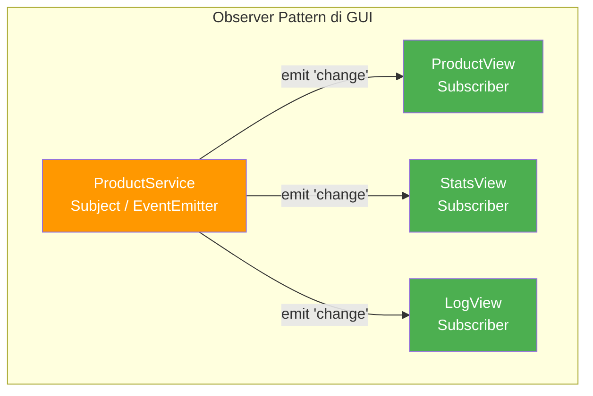
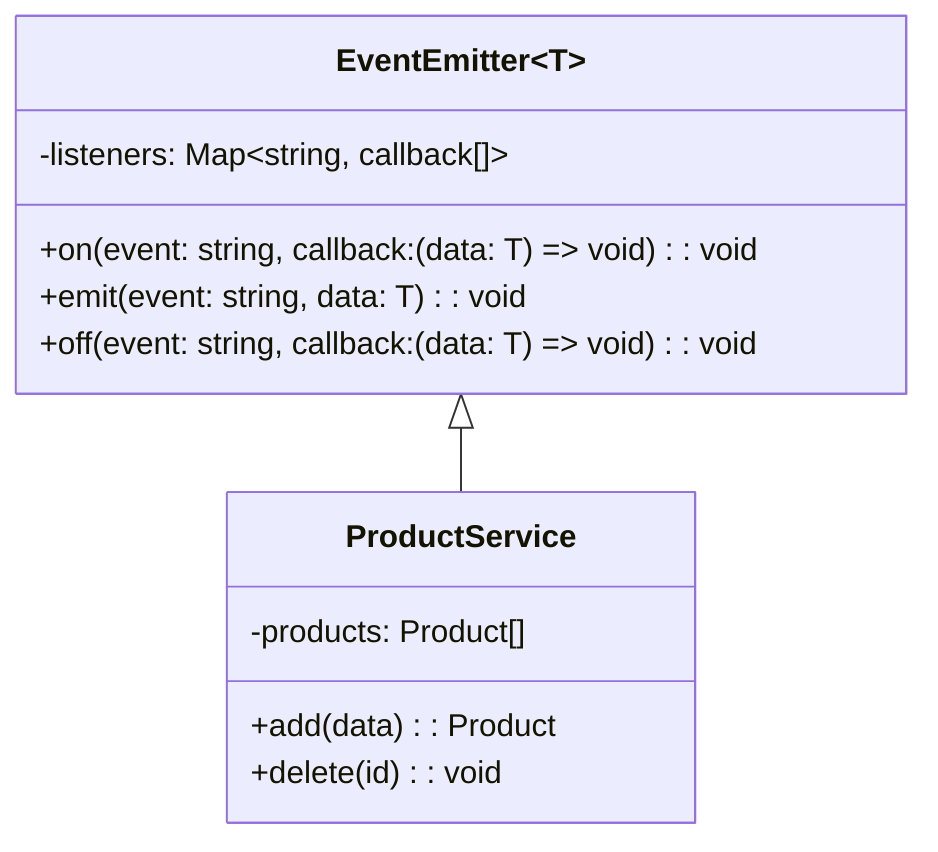
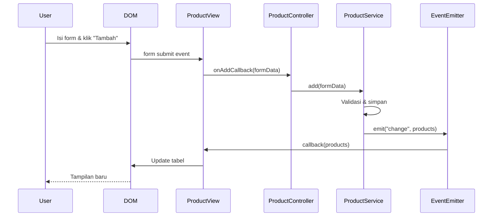
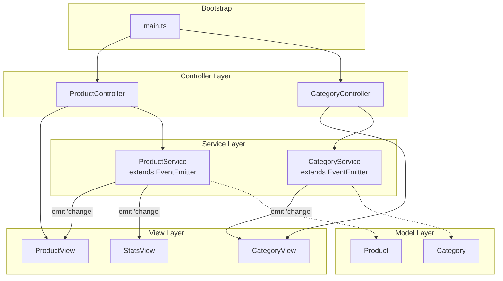

> **Mata Kuliah:** Pemrograman Berorientasi Objek
> **Minggu:** 12
> **Bagian:** Applied OOP
> **Bahasa:** TypeScript 5.x

---

## Capaian Pembelajaran Modul

Setelah mempelajari modul ini, mahasiswa mampu:
1. Memisahkan concern di GUI: Model, View, Controller/Service
2. Membangun class-based View (`ProductView`) yang meng-encapsulate DOM logic
3. Membangun class-based Controller (`ProductController`) yang menangani event dan orchestrate
4. Mengimplementasikan Observer pattern: model berubah → view update otomatis
5. Membuat custom `EventEmitter<T>` class untuk komunikasi antar komponen

---

## Prasyarat

- **Modul 01–07:** Class, interface, inheritance, polymorphism, abstraction, generics, SOLID Principles
- **Modul 09–10:** Modules & project structure, error handling
- **Modul 11:** Pengantar GUI, HTML/CSS/TS, Vite setup, DOM manipulation, event handling

---

## Daftar Isi

- [1. Pendahuluan](#1-pendahuluan)
- [2. Landasan Konsep](#2-landasan-konsep)
- [3. Implementasi dalam TypeScript](#3-implementasi-dalam-typescript)
- [4. Perbandingan Lintas Bahasa](#4-perbandingan-lintas-bahasa)
- [5. Studi Kasus: Product CRUD dengan Arsitektur MVC](#5-studi-kasus-product-crud-dengan-arsitektur-mvc)
- [6. Kesalahan Umum & Best Practices](#6-kesalahan-umum--best-practices)
- [7. Ringkasan](#7-ringkasan)
- [8. Latihan Mandiri](#8-latihan-mandiri)

---

## 1. Pendahuluan

Di Modul 11, kalian telah membangun halaman GUI pertama menggunakan vanilla TypeScript + DOM API, merender data ke tabel, menangani event form, dan melakukan operasi CRUD. Hasilnya berfungsi, tetapi pernahkah kalian memperhatikan bahwa semua kode tersebut tinggal di satu file? Logika DOM bercampur dengan logika bisnis. Event handler langsung memanipulasi data. Setiap penambahan fitur membuat file semakin panjang dan semakin sulit dipahami.

Masalah ini bukan masalah baru, ini adalah masalah klasik yang sudah dipecahkan sejak era Smalltalk di tahun 1970-an. Solusinya: **memisahkan tanggung jawab** ke dalam layer-layer yang jelas. Modul ini mengajarkan bagaimana menerapkan prinsip OOP, encapsulation, Observer pattern, dan dependency injection, untuk membangun GUI yang terstruktur dan maintainable.

> 💡 **Insight:** Kalian tidak perlu framework seperti React atau Vue untuk menulis kode GUI yang rapi. Yang dibutuhkan adalah **pemahaman arsitektur** dan **disiplin memisahkan tanggung jawab**. Framework hanyalah tool yang mengotomatisasi pola-pola yang akan kita pelajari secara manual di modul ini.

---

## 2. Landasan Konsep

### 2.1 Separation of Concerns di GUI: Why Split Code into Layers?

**Separation of Concerns** (SoC) menyatakan bahwa setiap bagian program harus bertanggung jawab atas satu aspek fungsionalitas saja. Dalam konteks GUI:

| Concern | Pertanyaan yang Dijawab | Contoh |
|---------|------------------------|--------|
| **Data & Logika Bisnis** | Apa data yang dikelola? Aturan bisnisnya? | Daftar produk, validasi harga > 0 |
| **Tampilan (UI)** | Bagaimana data ditampilkan? | Render tabel HTML, tampilkan form |
| **Koordinasi & Event** | Apa yang terjadi saat user berinteraksi? | Klik "Tambah" → simpan → refresh |

Tanpa pemisahan, kita mendapat **kode monolitik**:

```typescript
// ❌ Semua concern tercampur dalam satu fungsi
document.querySelector("#btn-add")!.addEventListener("click", () => {
  const name = (document.querySelector("#name") as HTMLInputElement).value;
  const price = Number((document.querySelector("#price") as HTMLInputElement).value);

  if (price <= 0) { alert("Harga harus positif!"); return; }    // bisnis
  products.push({ id: nextId++, name, price, category: "Umum" }); // data

  const tbody = document.querySelector("tbody")!;                 // DOM
  tbody.innerHTML = "";
  for (const p of products) {
    const tr = document.createElement("tr");
    tr.innerHTML = `<td>${p.name}</td><td>Rp${p.price}</td>`;
    tbody.appendChild(tr);
  }
});
```

Masalahnya: sulit di-test (butuh DOM), sulit di-reuse, sulit diperluas, dan rawan bug.

> 🔑 **Konsep Kunci:** SoC bukan tentang membuat lebih banyak file. Ini tentang memastikan setiap class punya **satu alasan untuk berubah**. View berubah saat tampilan berubah. Service berubah saat aturan bisnis berubah. Controller berubah saat alur interaksi berubah.

### 2.2 MVC Pattern (Model-View-Controller)

**MVC** membagi aplikasi menjadi tiga komponen utama:



| Komponen | Tanggung Jawab | Dalam Konteks Kita |
|----------|---------------|-------------------|
| **Model / Service** | Data, logika bisnis, emit event saat data berubah | `ProductService`, CRUD, validasi |
| **View** | Render tampilan, baca input, encapsulate DOM | `ProductView`, tabel, form, tombol |
| **Controller** | Terima aksi dari View, panggil Service, koordinasi | `ProductController`, wiring event |

**Alur interaksi:**



> 💡 **Insight:** Dalam arsitektur kita, Service (bukan Model murni) menyimpan logika bisnis. Model hanya berupa interface/type, sedangkan Service mengelola state dan operasi. Beberapa literatur menyebut ini **MVC + Service Layer**.

### 2.3 Class-Based View: Encapsulate DOM Logic

Sebuah **View class** "memiliki" sebagian DOM dan bertanggung jawab penuh atas rendering dan pembacaan input di area tersebut.

Prinsip View class:
1. **Menerima container element** via constructor, tidak mencari elemen global
2. **Meng-encapsulate semua DOM manipulation**: tidak ada kode luar yang memanipulasi DOM milik View
3. **Menyediakan method publik** untuk render data dan baca input
4. **Tidak mengandung logika bisnis**: View tidak tahu aturan validasi



> 🔑 **Konsep Kunci:** View class menerapkan **encapsulation**, salah satu pilar OOP. Detail implementasi DOM (`querySelector`, `createElement`) tersembunyi di balik method publik bermakna seperti `render()` dan `getFormData()`.

### 2.4 Class-Based Controller: Event Handling & Orchestration

**Controller** adalah perekat antara View dan Service, menerapkan **Dependency Injection**:

1. Menerima View dan Service via constructor, bukan membuat sendiri
2. **Tidak memanipulasi DOM**: tanggung jawab View
3. **Tidak mengandung logika bisnis**: tanggung jawab Service
4. **Thin controller**: hanya mengoordinasi



> 🔄 **Perbandingan:** Controller mirip dengan **Presenter** di MVP atau **ViewModel** di MVVM. Perbedaan utamanya adalah cara binding antara View dan data, di MVC klasik, Controller secara eksplisit memanggil method View.

### 2.5 Observer Pattern in GUI Context

Observer pattern menjawab: **"Bagaimana View otomatis terupdate saat data berubah?"**

Tanpa Observer, Controller harus manual memanggil `view.render()` setelah setiap operasi:

```typescript
// ❌ Manual render setelah setiap operasi
handleAdd(): void {
    this.service.addProduct(data);
    this.view.render(this.service.getAll());  // manual!
}
handleDelete(id: string): void {
    this.service.deleteProduct(id);
    this.view.render(this.service.getAll());  // manual lagi!
}
```

Dengan Observer, cukup subscribe sekali:

```typescript
// ✅ Subscribe sekali, auto re-render setiap kali data berubah
this.service.on("change", (products) => this.view.render(products));

handleAdd(): void {
    this.service.addProduct(data);
    // Service otomatis emit "change" → View otomatis re-render
}
```



Keuntungan: satu titik subscription, multiple views otomatis sinkron, loose coupling.

> ⚠️ **Perhatian:** Observer menambah indirection, alur data kurang eksplisit. Untuk aplikasi kecil, pemanggilan manual `view.render()` sudah cukup. Gunakan Observer saat ada **multiple views** atau ingin **decouple** Service dari View sepenuhnya.

### 2.6 Custom EventEmitter&lt;T&gt;: Generic Event System

`EventEmitter<T>` menyediakan mekanisme publish-subscribe. Generic type `T` menentukan tipe data yang di-emit:



Mengapa generic? `EventEmitter<Product[]>` memastikan bahwa callback menerima `Product[]`, bukan `any`. TypeScript akan menolak emit data bertipe salah, mencegah bug runtime.

> 🔑 **Konsep Kunci:** `EventEmitter<T>` menggabungkan **Observer pattern** dengan **generics**, dua konsep OOP dari modul sebelumnya, digabungkan menjadi abstraksi yang powerful untuk komunikasi antar komponen.

---

## 3. Implementasi dalam TypeScript

### 3.1 Custom EventEmitter&lt;T&gt; Implementation

```typescript
// === lib/EventEmitter.ts ===

class EventEmitter<T> {
  private listeners: Map<string, ((data: T) => void)[]> = new Map();

  /** Subscribe ke sebuah event. */
  on(event: string, callback: (data: T) => void): void {
    const existing = this.listeners.get(event) ?? [];
    existing.push(callback);
    this.listeners.set(event, existing);
  }

  /** Emit event: panggil semua listener yang terdaftar. */
  emit(event: string, data: T): void {
    const callbacks = this.listeners.get(event) ?? [];
    for (const callback of callbacks) {
      callback(data);
    }
  }

  /** Unsubscribe dari event. Memerlukan referensi fungsi yang sama. */
  off(event: string, callback: (data: T) => void): void {
    const callbacks = this.listeners.get(event) ?? [];
    const filtered = callbacks.filter((cb) => cb !== callback);
    this.listeners.set(event, filtered);
  }

  /** Hapus semua listener. */
  removeAllListeners(event?: string): void {
    if (event) {
      this.listeners.delete(event);
    } else {
      this.listeners.clear();
    }
  }
}
```

**Penggunaan dasar:**

```typescript
const emitter = new EventEmitter<Product[]>();

const handleChange = (products: Product[]): void => {
  console.log(`Data berubah! Jumlah: ${products.length}`);
};

emitter.on("change", handleChange);
emitter.emit("change", [{ id: "1", name: "Laptop", price: 15000000, category: "Elektronik" }]);
// Output: Data berubah! Jumlah: 1

emitter.off("change", handleChange);
emitter.emit("change", []); // Tidak ada output - listener sudah dihapus
```

> 💡 **Insight:** `off()` memerlukan **referensi fungsi yang sama** dengan yang di-subscribe. Jika menggunakan arrow function inline di `on()`, simpan referensinya dalam variabel agar bisa `off()` nanti.

### 3.2 Model dan Service Layer

```typescript
// === models/Product.ts ===

interface Product {
  id: string;
  name: string;
  price: number;
  category: string;
}

interface ProductFormData {
  name: string;
  price: number;
  category: string;
}
```

```typescript
// === services/ProductService.ts ===

class ProductService extends EventEmitter<Product[]> {
  private products: Product[] = [];
  private nextId: number = 1;

  getAll(): Product[] {
    return [...this.products]; // salinan - cegah mutasi eksternal
  }

  getById(id: string): Product | undefined {
    return this.products.find((p) => p.id === id);
  }

  add(data: ProductFormData): Product {
    if (data.name.trim() === "") {
      throw new Error("Nama produk tidak boleh kosong");
    }
    if (data.price <= 0) {
      throw new Error("Harga harus lebih besar dari 0");
    }

    const product: Product = {
      id: String(this.nextId++),
      name: data.name.trim(),
      price: data.price,
      category: data.category.trim() || "Umum",
    };

    this.products.push(product);
    this.emit("change", this.getAll()); // Observer: notifikasi perubahan
    return product;
  }

  delete(id: string): void {
    const index = this.products.findIndex((p) => p.id === id);
    if (index === -1) {
      throw new Error(`Produk dengan ID "${id}" tidak ditemukan`);
    }
    this.products.splice(index, 1);
    this.emit("change", this.getAll());
  }

  update(id: string, data: ProductFormData): Product {
    const product = this.products.find((p) => p.id === id);
    if (!product) {
      throw new Error(`Produk dengan ID "${id}" tidak ditemukan`);
    }
    if (data.name.trim() === "") {
      throw new Error("Nama produk tidak boleh kosong");
    }
    if (data.price <= 0) {
      throw new Error("Harga harus lebih besar dari 0");
    }

    product.name = data.name.trim();
    product.price = data.price;
    product.category = data.category.trim() || "Umum";

    this.emit("change", this.getAll());
    return { ...product };
  }
}
```

> 🔑 **Konsep Kunci:** `ProductService extends EventEmitter<Product[]>`, setiap operasi yang mengubah data (`add`, `delete`, `update`) memanggil `this.emit("change", ...)`. Ini memastikan **setiap perubahan data selalu dikomunikasikan** tanpa caller perlu mengingat untuk trigger update.

### 3.3 ProductView Class

`ProductView` meng-encapsulate semua DOM manipulation. Class ini tidak tahu tentang Service atau logika bisnis.

```typescript
// === views/ProductView.ts ===

class ProductView {
  private container: HTMLElement;
  private tableBody: HTMLTableSectionElement;
  private form: HTMLFormElement;

  private onAddCallback: ((data: ProductFormData) => void) | null = null;
  private onDeleteCallback: ((id: string) => void) | null = null;
  private onEditCallback: ((id: string, data: ProductFormData) => void) | null = null;
  private onEditRequestCallback: ((id: string) => void) | null = null;
  private editingId: string | null = null;

  constructor(container: HTMLElement) {
    this.container = container;
    this.container.innerHTML = this.buildTemplate();

    this.tableBody = this.container.querySelector("tbody") as HTMLTableSectionElement;
    this.form = this.container.querySelector("#product-form") as HTMLFormElement;
    this.setupFormHandler();
    this.setupTableDelegation();
  }

  private buildTemplate(): string {
    return `
      <h2>Daftar Produk</h2>
      <form id="product-form">
        <div class="grid">
          <label>Nama <input type="text" name="name" required /></label>
          <label>Harga <input type="number" name="price" min="1" required /></label>
          <label>Kategori <input type="text" name="category" /></label>
        </div>
        <button type="submit" id="btn-submit">Tambah Produk</button>
        <button type="button" id="btn-cancel" style="display:none;">Batal</button>
      </form>
      <table>
        <thead>
          <tr><th>ID</th><th>Nama</th><th>Harga</th><th>Kategori</th><th>Aksi</th></tr>
        </thead>
        <tbody></tbody>
      </table>
      <p id="empty-msg" style="display:none;">Belum ada produk.</p>`;
  }

  private setupFormHandler(): void {
    this.form.addEventListener("submit", (e: Event) => {
      e.preventDefault();
      const data = this.getFormData();
      if (this.editingId !== null && this.onEditCallback) {
        this.onEditCallback(this.editingId, data);
        this.exitEditMode();
      } else if (this.onAddCallback) {
        this.onAddCallback(data);
      }
      this.clearForm();
    });

    this.container.querySelector("#btn-cancel")!.addEventListener("click", () => {
      this.exitEditMode();
      this.clearForm();
    });
  }

  /** Event delegation: satu listener di tbody untuk semua tombol baris. */
  private setupTableDelegation(): void {
    this.tableBody.addEventListener("click", (e: Event) => {
      const target = e.target as HTMLElement;
      const id = target.dataset.id;
      if (!id) return;

      if (target.classList.contains("btn-delete") && this.onDeleteCallback) {
        this.onDeleteCallback(id);
      }
      if (target.classList.contains("btn-edit") && this.onEditRequestCallback) {
        this.onEditRequestCallback(id);
      }
    });
  }

  render(products: Product[]): void {
    const emptyMsg = this.container.querySelector("#empty-msg") as HTMLElement;
    if (products.length === 0) {
      this.tableBody.innerHTML = "";
      emptyMsg.style.display = "block";
      return;
    }
    emptyMsg.style.display = "none";
    this.tableBody.innerHTML = products
      .map((p) => `
        <tr>
          <td>${p.id}</td>
          <td>${this.escapeHtml(p.name)}</td>
          <td>Rp${p.price.toLocaleString("id-ID")}</td>
          <td>${this.escapeHtml(p.category)}</td>
          <td>
            <button class="btn-edit outline" data-id="${p.id}">Edit</button>
            <button class="btn-delete outline secondary" data-id="${p.id}">Hapus</button>
          </td>
        </tr>`)
      .join("");
  }

  getFormData(): ProductFormData {
    const fd = new FormData(this.form);
    return {
      name: (fd.get("name") as string) ?? "",
      price: Number(fd.get("price")) || 0,
      category: (fd.get("category") as string) ?? "",
    };
  }

  clearForm(): void { this.form.reset(); }

  enterEditMode(product: Product): void {
    this.editingId = product.id;
    (this.form.querySelector('[name="name"]') as HTMLInputElement).value = product.name;
    (this.form.querySelector('[name="price"]') as HTMLInputElement).value = String(product.price);
    (this.form.querySelector('[name="category"]') as HTMLInputElement).value = product.category;

    (this.container.querySelector("#btn-submit") as HTMLButtonElement).textContent = "Simpan";
    (this.container.querySelector("#btn-cancel") as HTMLElement).style.display = "inline-block";
  }

  private exitEditMode(): void {
    this.editingId = null;
    (this.container.querySelector("#btn-submit") as HTMLButtonElement).textContent = "Tambah Produk";
    (this.container.querySelector("#btn-cancel") as HTMLElement).style.display = "none";
  }

  showError(message: string): void { alert(message); }

  // Callback setters: dipanggil oleh Controller
  setOnAdd(cb: (data: ProductFormData) => void): void { this.onAddCallback = cb; }
  setOnDelete(cb: (id: string) => void): void { this.onDeleteCallback = cb; }
  setOnEdit(cb: (id: string, data: ProductFormData) => void): void { this.onEditCallback = cb; }
  setOnEditRequest(cb: (id: string) => void): void { this.onEditRequestCallback = cb; }

  private escapeHtml(text: string): string {
    const div = document.createElement("div");
    div.textContent = text;
    return div.innerHTML;
  }
}
```

> ⚠️ **Perhatian:** View **tidak langsung memanggil** Service. Semua aksi pengguna diteruskan melalui **callback** yang diset oleh Controller. View hanya tahu "ada seseorang yang ingin diberi tahu saat tombol ditekan", ia tidak tahu siapa.

### 3.4 ProductController Class

Controller menghubungkan View dengan Service, tipis, hanya koordinasi:

```typescript
// === controllers/ProductController.ts ===

class ProductController {
  constructor(
    private view: ProductView,
    private service: ProductService
  ) {}

  /** Inisialisasi: wiring semua event handler dan Observer subscription. */
  init(): void {
    // Observer: View auto re-render saat data berubah
    this.service.on("change", (products) => this.view.render(products));

    // Wiring aksi View → handler Controller
    this.view.setOnAdd((data) => this.handleAdd(data));
    this.view.setOnDelete((id) => this.handleDelete(id));
    this.view.setOnEdit((id, data) => this.handleEdit(id, data));
    this.view.setOnEditRequest((id) => this.handleEditRequest(id));

    // Render state awal
    this.view.render(this.service.getAll());
  }

  private handleAdd(data: ProductFormData): void {
    try {
      this.service.add(data);
      // Tidak perlu view.render(): Observer handles it
    } catch (error) {
      if (error instanceof Error) this.view.showError(error.message);
    }
  }

  private handleDelete(id: string): void {
    if (!confirm("Yakin ingin menghapus produk ini?")) return;
    try {
      this.service.delete(id);
    } catch (error) {
      if (error instanceof Error) this.view.showError(error.message);
    }
  }

  private handleEditRequest(id: string): void {
    const product = this.service.getById(id);
    if (product) this.view.enterEditMode(product);
  }

  private handleEdit(id: string, data: ProductFormData): void {
    try {
      this.service.update(id, data);
    } catch (error) {
      if (error instanceof Error) this.view.showError(error.message);
    }
  }
}
```

> 💡 **Insight:** Controller ini sangat tipis, tidak ada logika bisnis (itu di Service), tidak ada DOM manipulation (itu di View). Ia hanya mengoordinasi alur. Ini disebut **Thin Controller**, sebuah best practice dalam MVC.

### 3.5 Refactoring Minggu 11 Code ke MVC Architecture

Berikut struktur folder hasil refactoring:

```
src/
├── lib/
│   └── EventEmitter.ts       # Generic event system
├── models/
│   └── Product.ts             # Interface Product, ProductFormData
├── services/
│   └── ProductService.ts      # Business logic + event emitting
├── views/
│   └── ProductView.ts         # DOM manipulation
├── controllers/
│   └── ProductController.ts   # Event coordination
└── main.ts                    # Bootstrap & wiring
```

**Bootstrap file (`main.ts`):**

```typescript
// === main.ts: Composition Root ===

import { ProductView } from "./views/ProductView";
import { ProductController } from "./controllers/ProductController";
import { ProductService } from "./services/ProductService";

function main(): void {
  const container = document.querySelector("#app") as HTMLElement;
  if (!container) throw new Error("Element #app tidak ditemukan");

  // Buat instance
  const service = new ProductService();
  const view = new ProductView(container);
  const controller = new ProductController(view, service);

  // Inisialisasi: wiring semua event
  controller.init();

  // Data sample
  service.add({ name: "Laptop Asus", price: 12500000, category: "Elektronik" });
  service.add({ name: "Mouse Logitech", price: 350000, category: "Aksesoris" });
  service.add({ name: "Keyboard Mechanical", price: 750000, category: "Aksesoris" });
}

document.addEventListener("DOMContentLoaded", main);
```

> 🔑 **Konsep Kunci:** `main.ts` adalah **composition root**, satu-satunya tempat yang tahu tentang semua class. View tidak tahu tentang Service. Service tidak tahu tentang View. Controller hanya tahu interface keduanya. Hanya `main.ts` yang meng-compose semuanya.

### 3.6 Auto Re-render on Data Change (Observer in Action)

Alur lengkap saat pengguna menambah produk:



**Multiple views dari satu Service:**

```typescript
// StatsView: View kedua yang subscribe ke service yang sama
class StatsView {
  private container: HTMLElement;
  constructor(container: HTMLElement) { this.container = container; }

  render(products: Product[]): void {
    const total = products.length;
    const value = products.reduce((sum, p) => sum + p.price, 0);
    this.container.innerHTML = `
      <div class="grid">
        <article><header>Total Produk</header><strong>${total}</strong></article>
        <article><header>Total Nilai</header>
          <strong>Rp${value.toLocaleString("id-ID")}</strong></article>
      </div>`;
  }
}

// Di main.ts: subscribe StatsView ke service yang sama:
const statsView = new StatsView(document.querySelector("#stats") as HTMLElement);
service.on("change", (products) => statsView.render(products));
// Sekarang KEDUA view otomatis terupdate saat data berubah!
```

> 💡 **Insight:** Inilah kekuatan Observer di GUI. Jika ada 5 View berbeda yang menampilkan data yang sama, tanpa Observer Controller harus memanggil `render()` di kelima View setiap kali data berubah. Dengan Observer, setiap View subscribe sekali dan semuanya otomatis sinkron.

---

## 4. Perbandingan Lintas Bahasa

### Java: MVC in Swing/JavaFX

Di Java, MVC sudah menjadi standar sejak era Swing. Controller sering diimplementasikan sebagai `ActionListener`:

```java
// View: extends JPanel
public class ProductView extends JPanel {
    private JTable table;
    private JButton addButton;

    public void render(List<Product> products) {
        DefaultTableModel model = (DefaultTableModel) table.getModel();
        model.setRowCount(0);
        for (Product p : products) {
            model.addRow(new Object[]{ p.getId(), p.getName(), p.getPrice() });
        }
    }

    // Controller sebagai ActionListener: pola khas Java Swing
    public void setAddListener(ActionListener listener) {
        addButton.addActionListener(listener);
    }
}

// Controller implements ActionListener
public class ProductController implements ActionListener {
    private ProductView view;
    private ProductService service;

    public ProductController(ProductView view, ProductService service) {
        this.view = view;
        this.service = service;
        this.view.setAddListener(this);
    }

    @Override
    public void actionPerformed(ActionEvent e) {
        String name = view.getNameInput();
        service.add(name);
        view.render(service.getAll());
    }
}
```

### Dart: Flutter Widget Tree + State Management

Flutter menggunakan widget tree (declarative UI) dengan `ChangeNotifier` sebagai built-in Observer:

```dart
// Service dengan ChangeNotifier: built-in Observer pattern Flutter
class ProductService extends ChangeNotifier {
  final List<Product> _products = [];
  List<Product> get products => List.unmodifiable(_products);

  void add(String name, double price, String category) {
    _products.add(Product(
      id: DateTime.now().millisecondsSinceEpoch.toString(),
      name: name, price: price, category: category,
    ));
    notifyListeners(); // Mirip emit("change") di EventEmitter kita
  }
}

// View: Flutter Widget (declarative)
class ProductListPage extends StatelessWidget {
  @override
  Widget build(BuildContext context) {
    return Consumer<ProductService>(
      builder: (context, service, child) {
        return ListView.builder(
          itemCount: service.products.length,
          itemBuilder: (context, index) {
            final p = service.products[index];
            return ListTile(title: Text(p.name), subtitle: Text('Rp${p.price}'));
          },
        );
      },
    );
  }
}
```

### Tabel Perbandingan

| Aspek | TypeScript + DOM | Java Swing | Dart/Flutter |
|-------|-----------------|------------|--------------|
| **View** | Class + DOM manipulation | Class extends `JPanel` | Widget (declarative) |
| **Controller** | Class terpisah, DI | `ActionListener` | Tidak eksplisit (BLoC/Provider) |
| **Observer** | Custom `EventEmitter<T>` | `PropertyChangeListener` | `ChangeNotifier` |
| **Rendering** | Imperative: `innerHTML` | Imperative: `setModel()` | Declarative: `build()` |
| **Event** | `addEventListener` + callback | `addActionListener` | `onPressed` di widget |

> 🔄 **Perbandingan:** Meskipun implementasi berbeda, pola dasar MVC tetap sama. Yang berubah adalah mekanisme rendering (imperative vs declarative) dan cara binding event. Konsep Separation of Concerns, Observer, dan DI berlaku universal.

---

## 5. Studi Kasus: Product CRUD dengan Arsitektur MVC

### 5.1 Before vs After

**BEFORE, Kode All-in-One (Minggu 11 style):**

```typescript
// ❌ Semua concern tercampur
const products: Product[] = [];
let nextId = 1;

function renderProducts(): void {
  const tbody = document.querySelector("tbody")!;
  tbody.innerHTML = "";
  for (const p of products) {
    const tr = document.createElement("tr");
    tr.innerHTML = `
      <td>${p.name}</td><td>Rp${p.price.toLocaleString("id-ID")}</td>
      <td><button onclick="deleteProduct('${p.id}')">Hapus</button></td>`;
    tbody.appendChild(tr);
  }
}

function addProduct(): void {
  const name = (document.querySelector("#name") as HTMLInputElement).value;
  const price = Number((document.querySelector("#price") as HTMLInputElement).value);
  if (!name || price <= 0) { alert("Data tidak valid!"); return; }
  products.push({ id: String(nextId++), name, price, category: "Umum" });
  renderProducts();
}

function deleteProduct(id: string): void {
  const idx = products.findIndex((p) => p.id === id);
  if (idx !== -1) { products.splice(idx, 1); renderProducts(); }
}

document.querySelector("#form")!.addEventListener("submit", (e) => {
  e.preventDefault(); addProduct();
});
```

**AFTER, Arsitektur MVC** (file-file dari Section 3):

| Aspek | Before | After |
|-------|--------|-------|
| **File** | 1 file | 6 file terstruktur |
| **Global state** | `products`, `nextId` global | Encapsulated di `ProductService` |
| **DOM access** | Tersebar di banyak fungsi | Terisolasi di `ProductView` |
| **Validasi** | Di dalam fungsi UI | Di `ProductService.add()` |
| **Event handling** | Inline `onclick` string | Type-safe callback |
| **Testability** | Tidak bisa tanpa DOM | Service testable independen |
| **Extensibility** | Sulit | Tambah View baru, subscribe ke service |

### 5.2 Menambahkan Category CRUD dengan Pola yang Sama

Untuk membuktikan arsitektur mudah diperluas, kita tambahkan Category CRUD:

```typescript
// === models/Category.ts ===
interface Category {
  id: string;
  name: string;
  description: string;
}
interface CategoryFormData {
  name: string;
  description: string;
}
```

```typescript
// === services/CategoryService.ts ===
class CategoryService extends EventEmitter<Category[]> {
  private categories: Category[] = [];
  private nextId: number = 1;

  getAll(): Category[] { return [...this.categories]; }

  add(data: CategoryFormData): Category {
    if (data.name.trim() === "") throw new Error("Nama kategori tidak boleh kosong");
    const dup = this.categories.find(
      (c) => c.name.toLowerCase() === data.name.trim().toLowerCase()
    );
    if (dup) throw new Error(`Kategori "${data.name}" sudah ada`);

    const category: Category = {
      id: String(this.nextId++),
      name: data.name.trim(),
      description: data.description.trim(),
    };
    this.categories.push(category);
    this.emit("change", this.getAll());
    return category;
  }

  delete(id: string): void {
    const idx = this.categories.findIndex((c) => c.id === id);
    if (idx === -1) throw new Error(`Kategori ID "${id}" tidak ditemukan`);
    this.categories.splice(idx, 1);
    this.emit("change", this.getAll());
  }
}
```

```typescript
// === views/CategoryView.ts (ringkas) ===
class CategoryView {
  private container: HTMLElement;
  private tableBody: HTMLTableSectionElement;
  private form: HTMLFormElement;
  private onAddCallback: ((data: CategoryFormData) => void) | null = null;
  private onDeleteCallback: ((id: string) => void) | null = null;

  constructor(container: HTMLElement) {
    this.container = container;
    this.container.innerHTML = `
      <h2>Daftar Kategori</h2>
      <form id="cat-form">
        <div class="grid">
          <label>Nama <input type="text" name="name" required /></label>
          <label>Deskripsi <input type="text" name="description" /></label>
        </div>
        <button type="submit">Tambah Kategori</button>
      </form>
      <table>
        <thead><tr><th>ID</th><th>Nama</th><th>Deskripsi</th><th>Aksi</th></tr></thead>
        <tbody></tbody>
      </table>`;

    this.tableBody = this.container.querySelector("tbody") as HTMLTableSectionElement;
    this.form = this.container.querySelector("#cat-form") as HTMLFormElement;

    this.form.addEventListener("submit", (e) => {
      e.preventDefault();
      const fd = new FormData(this.form);
      const data: CategoryFormData = {
        name: (fd.get("name") as string) ?? "",
        description: (fd.get("description") as string) ?? "",
      };
      if (this.onAddCallback) this.onAddCallback(data);
      this.form.reset();
    });

    this.tableBody.addEventListener("click", (e) => {
      const target = e.target as HTMLElement;
      if (target.classList.contains("btn-delete") && this.onDeleteCallback) {
        this.onDeleteCallback(target.dataset.id!);
      }
    });
  }

  render(categories: Category[]): void {
    this.tableBody.innerHTML = categories.map((c) => `
      <tr><td>${c.id}</td><td>${c.name}</td><td>${c.description}</td>
      <td><button class="btn-delete outline secondary" data-id="${c.id}">Hapus</button></td></tr>
    `).join("");
  }

  setOnAdd(cb: (data: CategoryFormData) => void): void { this.onAddCallback = cb; }
  setOnDelete(cb: (id: string) => void): void { this.onDeleteCallback = cb; }
  showError(msg: string): void { alert(msg); }
}
```

```typescript
// === controllers/CategoryController.ts ===
class CategoryController {
  constructor(private view: CategoryView, private service: CategoryService) {}

  init(): void {
    this.service.on("change", (cats) => this.view.render(cats));
    this.view.setOnAdd((data) => {
      try { this.service.add(data); }
      catch (e) { if (e instanceof Error) this.view.showError(e.message); }
    });
    this.view.setOnDelete((id) => {
      if (confirm("Yakin hapus kategori ini?")) {
        try { this.service.delete(id); }
        catch (e) { if (e instanceof Error) this.view.showError(e.message); }
      }
    });
    this.view.render(this.service.getAll());
  }
}
```

**Updated `main.ts`:**

```typescript
function main(): void {
  // Product MVC
  const productService = new ProductService();
  const productView = new ProductView(document.querySelector("#product-section") as HTMLElement);
  const productCtrl = new ProductController(productView, productService);
  productCtrl.init();

  // Category MVC: pola yang sama!
  const categoryService = new CategoryService();
  const categoryView = new CategoryView(document.querySelector("#category-section") as HTMLElement);
  const categoryCtrl = new CategoryController(categoryView, categoryService);
  categoryCtrl.init();

  // Seed data
  categoryService.add({ name: "Elektronik", description: "Perangkat elektronik" });
  categoryService.add({ name: "Aksesoris", description: "Aksesoris komputer" });
  productService.add({ name: "Laptop Asus", price: 12500000, category: "Elektronik" });
  productService.add({ name: "Mouse Logitech", price: 350000, category: "Aksesoris" });
}

document.addEventListener("DOMContentLoaded", main);
```

> 💡 **Insight:** Perhatikan betapa **konsisten** pola pembuatan fitur baru. Model → Service (extends `EventEmitter`) → View → Controller → wire di `main.ts`. Arsitektur yang baik membuat penambahan fitur menjadi **prediktabel dan repeatable**.

### 5.3 Diagram Arsitektur Lengkap



---

## 6. Kesalahan Umum & Best Practices

### Kesalahan 1: View Langsung Memodifikasi Data (Bypassing Controller)

```typescript
// ❌ View menyimpan data dan mengelola state sendiri
class BadProductView {
  private products: Product[] = [];
  handleAdd(name: string, price: number): void {
    this.products.push({ id: String(Date.now()), name, price, category: "Umum" });
    this.render();
  }
}
```

```typescript
// ✅ View hanya meneruskan event ke callback: tidak mengelola data
class GoodProductView {
  private onAddCallback: ((data: ProductFormData) => void) | null = null;
  setOnAdd(cb: (data: ProductFormData) => void): void { this.onAddCallback = cb; }
  private handleFormSubmit(data: ProductFormData): void {
    if (this.onAddCallback) this.onAddCallback(data);
  }
}
```

### Kesalahan 2: Controller Mengandung DOM Manipulation

```typescript
// ❌ Controller langsung manipulasi DOM
class BadController {
  handleAdd(data: ProductFormData): void {
    const product = this.service.add(data);
    const tbody = document.querySelector("tbody")!; // Controller tahu tentang DOM!
    const tr = document.createElement("tr");
    tr.innerHTML = `<td>${product.name}</td>`;
    tbody.appendChild(tr);
  }
}
```

```typescript
// ✅ Controller hanya panggil Service: View di-update via Observer
class GoodController {
  handleAdd(data: ProductFormData): void {
    try {
      this.service.add(data); // Service emit → View auto render
    } catch (error) {
      if (error instanceof Error) this.view.showError(error.message);
    }
  }
}
```

### Kesalahan 3: Memory Leak dari Event Listener

```typescript
// ❌ Setiap render() menambah listener baru tanpa hapus yang lama
class LeakyView {
  render(products: Product[]): void {
    this.tableBody.innerHTML = products.map((p) => `<tr>...</tr>`).join("");
    // Listener baru ditambah SETIAP render: menumpuk!
    document.querySelectorAll(".btn-delete").forEach((btn) => {
      btn.addEventListener("click", () => console.log("Delete!"));
    });
  }
}
```

```typescript
// ✅ Event delegation: satu listener di parent, dipasang sekali
class SafeView {
  constructor(container: HTMLElement) {
    // Satu listener, dipasang sekali di constructor
    this.tableBody.addEventListener("click", (e: Event) => {
      const target = e.target as HTMLElement;
      if (target.classList.contains("btn-delete")) {
        this.onDeleteCallback?.(target.dataset.id!);
      }
    });
  }
  render(products: Product[]): void {
    this.tableBody.innerHTML = products.map((p) => `<tr>...</tr>`).join("");
    // Tidak perlu pasang listener lagi!
  }
}
```

### Kesalahan 4: Circular Dependency

```typescript
// ❌ Service tahu tentang View: circular!
class BadService {
  constructor(private view: ProductView) {}
  add(data: ProductFormData): void {
    // ... simpan ...
    this.view.render(this.getAll()); // Service → View langsung
  }
}
```

```typescript
// ✅ Service hanya emit event: tidak tahu siapa yang mendengarkan
class GoodService extends EventEmitter<Product[]> {
  add(data: ProductFormData): void {
    // ... simpan ...
    this.emit("change", this.getAll()); // Loosely coupled
  }
}
```

### Best Practices Rangkuman

| Prinsip | Penjelasan |
|---------|-----------|
| **View hanya render** | Tidak menyimpan state bisnis, tidak memanggil Service |
| **Controller tipis** | Hanya koordinasi, tanpa logika bisnis atau DOM |
| **Service emit event** | Setiap perubahan data di-emit agar subscriber terupdate |
| **DI via constructor** | Dependency Injection membuat komponen loosely coupled |
| **Event delegation** | Satu listener di parent, bukan banyak di child elements |
| **Cleanup listeners** | Sediakan `dispose()` untuk unsubscribe saat komponen dihancurkan |
| **Dependency satu arah** | View ← Controller → Service → EventEmitter → View |

> ⚠️ **Perhatian:** Jangan over-engineer. Untuk halaman sederhana, MVC penuh mungkin berlebihan. Gunakan MVC saat: (1) ada multiple views bergantung pada data yang sama, (2) logika bisnis cukup kompleks untuk di-test independen, atau (3) tim lebih dari satu orang.

---

## 7. Ringkasan

- **Separation of Concerns** membagi kode GUI ke dalam layer: Model (data), View (tampilan), Controller (koordinasi), Service (logika bisnis), membuat kode lebih mudah dipahami, di-test, dan diperluas.

- **MVC Pattern** menempatkan Model/Service untuk data dan logika bisnis, View untuk DOM manipulation, dan Controller untuk koordinasi alur.

- **Class-based View** menerapkan **encapsulation**: detail DOM tersembunyi di balik method publik bermakna (`render()`, `getFormData()`).

- **Class-based Controller** menerapkan **Dependency Injection**: menerima View dan Service via constructor, sehingga mudah di-test.

- **Observer pattern** via `EventEmitter<T>` memungkinkan **auto re-render**: Service emit event saat data berubah, View subscribe, tampilan otomatis terupdate.

- **`EventEmitter<T>`** menggabungkan Observer pattern dengan generics, method `on()`, `emit()`, `off()` untuk komunikasi loosely coupled.

- Arsitektur MVC bersifat **repeatable**: menambah fitur baru mengikuti pola yang sama, Model → Service → View → Controller → wire di `main.ts`.

- Konsep ini **berlaku universal**: Java Swing (ActionListener), Flutter (ChangeNotifier + Provider), dan framework modern lainnya.

---

## 8. Latihan Mandiri

### Latihan 1: TransactionView & TransactionController

Tambahkan fitur **Transaksi** ke dalam aplikasi. Ikuti arsitektur MVC.

**Spesifikasi:**
- Interface `Transaction` dengan field: `id`, `productId`, `quantity`, `totalPrice`, `date`
- `TransactionService extends EventEmitter<Transaction[]>` dengan method `add()`, `getAll()`, `getByDateRange(from, to)`
- `TransactionView`: tabel transaksi + form input (pilih produk, masukkan quantity)
- `TransactionController`: hubungkan View dan Service
- `totalPrice` dihitung otomatis dari harga produk di `ProductService`

**Kriteria:** View tidak akses Service langsung. Controller tipis. Observer untuk auto re-render.

### Latihan 2: Multi-View Observer

Implementasikan **multiple views** yang subscribe ke satu service.

**Spesifikasi:**
- `ProductTableView`: format tabel
- `ProductCardView`: format card/grid
- `ProductStatsView`: statistik: total produk, harga rata-rata, produk termahal
- Ketiga View subscribe ke `ProductService` via `on("change", ...)`
- Saat data berubah, **semua View otomatis terupdate**
- Tambahkan tombol toggle antara tabel dan card view

### Latihan 3: Enhanced EventEmitter

Perluas `EventEmitter<T>` dengan fitur tambahan.

**Spesifikasi:**
- `once(event, callback)`: listener yang hanya dipanggil sekali lalu auto-remove
- `listenerCount(event)`: jumlah listener untuk event tertentu
- `eventNames()`: semua nama event yang memiliki listener
- Buat type-safe version `TypedEventEmitter<EventMap>`:

```typescript
interface ProductEvents {
  change: Product[];
  error: Error;
  loading: boolean;
}

const emitter = new TypedEventEmitter<ProductEvents>();
emitter.on("change", (products) => { /* products: Product[] */ });
emitter.on("error", (err) => { /* err: Error */ });
// emitter.on("typo", ...);  // Compile error!
```

### Latihan 4: Refactoring Challenge

Refactor kode monolitik berikut ke arsitektur MVC lengkap:

```typescript
// ❌ Kode monolitik: refactor ke MVC!
const students: { id: number; name: string; grade: number }[] = [];
let sid = 1;

document.querySelector("#form")!.addEventListener("submit", (e) => {
  e.preventDefault();
  const name = (document.querySelector("#name") as HTMLInputElement).value;
  const grade = Number((document.querySelector("#grade") as HTMLInputElement).value);
  if (!name || grade < 0 || grade > 100) { alert("Data tidak valid!"); return; }

  students.push({ id: sid++, name, grade });
  const tbody = document.querySelector("tbody")!;
  tbody.innerHTML = "";
  let totalGrade = 0;
  for (const s of students) {
    totalGrade += s.grade;
    const tr = document.createElement("tr");
    tr.innerHTML = `<td>${s.id}</td><td>${s.name}</td><td>${s.grade}</td>
      <td><button onclick="hapus(${s.id})">Hapus</button></td>`;
    tbody.appendChild(tr);
  }
  document.querySelector("#average")!.textContent =
    `Rata-rata: ${(totalGrade / students.length).toFixed(1)}`;
});

function hapus(id: number): void {
  const idx = students.findIndex((s) => s.id === id);
  if (idx !== -1) students.splice(idx, 1);
  // Copy-paste render logic...
}
```

**Tugas:**
1. Buat `Student` interface dan `StudentFormData`
2. Buat `StudentService extends EventEmitter<Student[]>` dengan validasi
3. Buat `StudentView`, encapsulate DOM + tampilkan rata-rata nilai
4. Buat `StudentController` dengan dependency injection
5. Buat `main.ts` sebagai composition root
6. **Bonus:** tambahkan `StudentStatsView` terpisah (rata-rata & distribusi nilai)

---

## Referensi & Bacaan Lanjutan

- Gamma, E., Helm, R., Johnson, R., & Vlissides, J. (1994). *Design Patterns: Elements of Reusable Object-Oriented Software*. Addison-Wesley.
- Martin, R. C. (2017). *Clean Architecture*. Prentice Hall., Chapter 22: The Clean Architecture
- Osmani, A. (2023). *Learning JavaScript Design Patterns* (2nd ed.). O'Reilly Media.
- TypeScript Handbook, Generics: https://www.typescriptlang.org/docs/handbook/2/generics.html
- MDN Web Docs, EventTarget: https://developer.mozilla.org/en-US/docs/Web/API/EventTarget
- MDN Web Docs, Event Delegation: https://developer.mozilla.org/en-US/docs/Learn/JavaScript/Building_blocks/Events#event_delegation
- Refactoring Guru, Observer Pattern: https://refactoring.guru/design-patterns/observer
