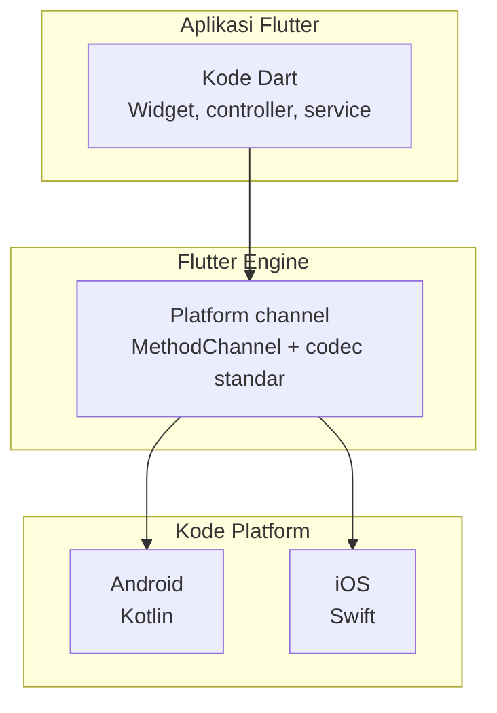
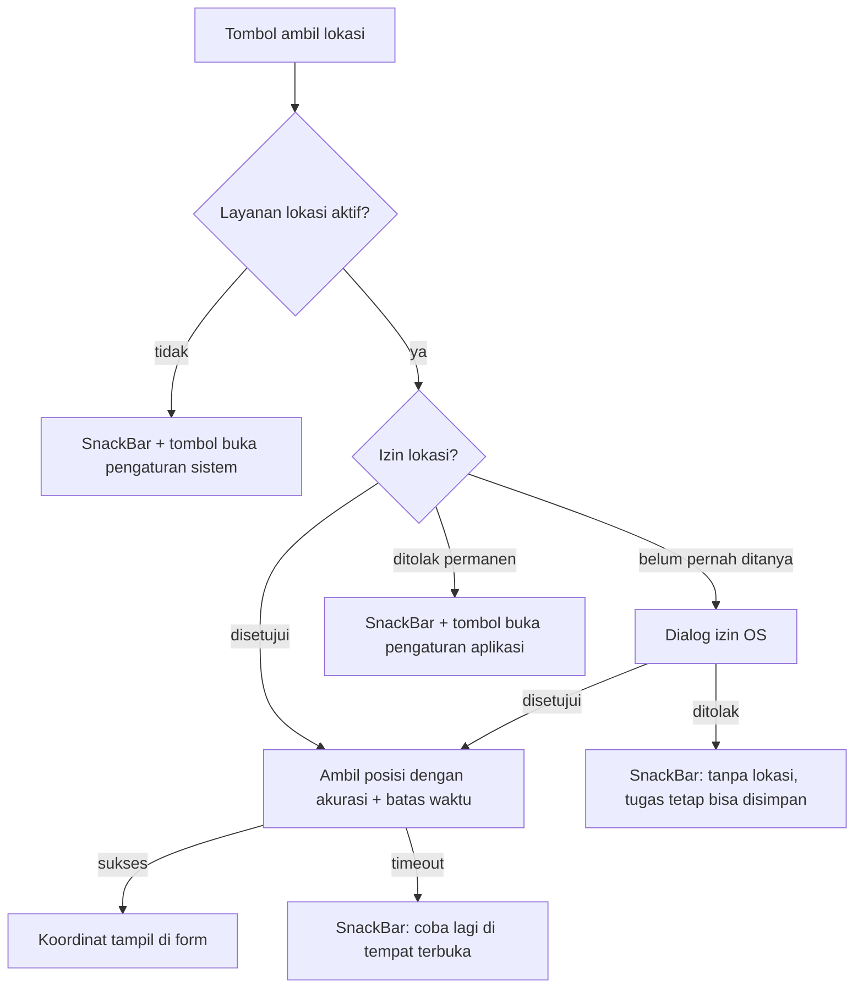

# Pertemuan 12: Platform Features & Device Integration

## Tujuan Pembelajaran

Dua janji dari bab-bab sebelumnya jatuh tempo di sini. Bab 8 menutup dengan janji bahwa data layer-nya akan dipakai ulang "bab 12 untuk fitur perangkat", dan bab 11 menutup dengan janji bahwa pola platform test-nya akan dibuktikan di bab ini untuk channel baterai. Bab ini membayar keduanya sekaligus lewat satu fitur: **bukti pengerjaan tugas**.

Tracker sampai bab 11 mencatat apa yang harus dikerjakan. Mulai bab ini, sebuah tugas bisa membawa bukti bahwa ia benar-benar dikerjakan: foto dari kamera atau galeri, plus koordinat tempat pengerjaannya. Fitur ini menyentuh semua lapisan yang sudah dibangun, dan justru itu intinya. Anda tidak akan menulis aplikasi baru; Anda akan menambahkan fitur native ke arsitektur lama tanpa membongkarnya.

Setelah menyelesaikan bab ini, Anda bisa:

1. Menulis platform channel sendiri dengan `MethodChannel`, handler Kotlin dan Swift, pembungkus Dart, dan pola error yang eksplisit.
2. Mengambil foto lewat `image_picker` dengan benar: photo picker Android yang tidak butuh permission storage, kunci `Info.plist` iOS, dan salinan permanen dari berkas cache ke direktori dokumen.
3. Menangani empat keadaan lokasi dunia nyata, layanan mati, ditolak, ditolak permanen, disetujui, dan memberi tiap keadaan aksi UI yang sesuai, bukan satu SnackBar untuk semuanya.
4. Membaca posisi GPS dengan akurasi dan batas waktu eksplisit.
5. Menyimpan metadata bukti di SQLite lewat migrasi `schemaVersion` 4 yang hanya menambah tabel, tanpa menyentuh baris `tasks` maupun kontrak `TaskRepository`.
6. Menulis layar yang menoleransi kenyataan: controller harus dibuang, `setState` hanya boleh jalan saat widget masih hidup, dan proses Android bisa mati di tengah pengambilan foto.

## Batas Bab Ini: Apa yang Dibahas dan Apa yang Tidak

Bab-bab "device" di banyak tutorial sukses menjadi katalog plugin: kamera, sensor, notifikasi, bluetooth, masing-masing dengan snippet delapan baris. Bab ini menolak format itu. Empat topik dibahas utuh sampai ke keputusan datanya; sisanya dinyatakan di luar jangkauan dengan alasan, bukan disembunyikan.

**Dibahas:**

- **Foto** lewat `image_picker`, kamera dan galeri, termasuk photo picker modern Android dan pemulihan data saat proses mati.
- **Lokasi** lewat `geolocator`, empat keadaan izin dan layanan, akurasi, batas waktu.
- **Satu platform channel tulis-tangan** (level baterai), karena plugin bagus tetap hasil seseorang yang menulis channel, dan suatu hari plugin yang Anda butuhkan belum ada.
- **Permission dan lifecycle sebagai warga kelas satu**: bukan catatan kaki setelah kode selesai.

**Tidak dibahas, dengan alasan:**

- **Sensor stream** (accelerometer, gyroscope, kompas lewat `sensors_plus`). Polanya berbeda dari semua bab ini: data mengalir terus-menerus, bukan sekali ambil. Ia butuh pembahasan `Stream` + throttle + kalibrasi sendiri, digabung di sini hanya akan menjadi snippet dangkal.
- **Push notification** (`flutter_local_notifications`, FCM/APNs). Notifikasi bukan sekadar plugin: ia menuntut backend pengirim, konfigurasi Firebase atau APNs, dan kebijakan saat aplikasi mati. Layak dibahas sebagai unit terpisah.
- **Preview kamera penuh** (package `camera`). `image_picker` menyerahkan pekerjaan ke aplikasi kamera sistem, cukup untuk bukti foto. Membangun antarmuka kamera sendiri adalah proyek berbeda dengan kelas masalahnya sendiri (lifecycle preview, rotasi, mode).

Menyempitkan cakupan bukan kemunduran. Setiap topik yang dibahas mendapat data layer, jalur kegagalan, dan strategi pengujian, hal yang mustahil diberikan kepada sepuluh plugin sekaligus.

## Platform Channels: Menulis Jembatan Sendiri

Flutter menggambar sendiri seluruh antarmukanya lewat engine, dan karenanya tidak mewarisi apa pun dari komponen UI native. Konsekuensinya: untuk hal yang dikontrol sistem operasi (kamera, GPS, baterai, sensor), kode Dart harus bicara dengan kode platform. Mekanismenya bernama **platform channel**.



Tiga jenis channel, dibedakan oleh arah datanya:

| Channel               | Bentuk komunikasi             | Contoh sah                           |
| --------------------- | ----------------------------- | ------------------------------------ |
| `MethodChannel`       | Request-response sekali jalan | Ambil level baterai, ambil satu foto |
| `EventChannel`        | Stream berkelanjutan          | Update lokasi, sensor accelerometer  |
| `BasicMessageChannel` | Pesan bebas dua arah          | Protokol custom lintas layer         |

Semua plugin yang dipakai buku ini, `sqflite`, `shared_preferences`, `image_picker`, `geolocator`, adalah platform channel yang dikemas rapi. Anda menulis channel sendiri bukan karena ingin menggantikan mereka, tetapi karena dua alasan lain: plugin yang Anda butuhkan kadang belum ada, dan memahami channel membuat perilaku plugin berhenti terasa seperti sihir.

### Studi kasus: level baterai

Skenario: di layar detail tugas, Tracker menampilkan sisa baterai perangkat saat tugas diselesaikan, konteks yang berguna untuk tugas lapangan yang mencatat GPS. Tidak ada plugin yang perlu dipasang; ini pekerjaan beberapa puluh baris.

Deklarasi sisi Dart, simpan sebagai `lib/platform/battery_service.dart`:

```dart
import 'package:flutter/services.dart';

/// Contoh platform channel tulis-tangan (bab 12): membaca level
/// baterai lewat MethodChannel. Channel disuntikkan lewat
/// constructor supaya test bisa memalsukan balasan native tanpa
/// perangkat: pola yang sama dengan repository bab 8.
class BatteryService {
  BatteryService({MethodChannel? channel})
    : _channel = channel ?? const MethodChannel('app.tracker/battery');

  final MethodChannel _channel;

  /// Level baterai dalam persen (0-100). Melempar [PlatformException]
  /// berkode `unavailable` saat native tidak bisa membaca nilai
  /// angka di luar jangkauan diperlakukan sama seperti tidak ada.
  Future<int> level() async {
    final raw = await _channel.invokeMethod<int>('getLevel');
    if (raw == null || raw < 0 || raw > 100) {
      throw PlatformException(
        code: 'unavailable',
        message: 'level baterai tidak terbaca',
      );
    }
    return raw;
  }
}
```

Dua keputusan di pembungkus ini penting. Pertama, **channel disuntikkan**, produksi memakai channel bawaan, test menyuntikkan channel yang sama namanya lalu memalsukan balasannya (dibuktikan di bagian akhir bab). Kedua, **nilai aneh dinormalisasi menjadi error eksplisit**: beberapa perangkat Android melaporkan angka di luar 0-100 saat baterai sedang tidak terbaca; kode `unavailable` memberi caller satu bentuk kegagalan untuk ditangani, bukan tiga.

Handler Android, di `MainActivity.kt`, method `configureFlutterEngine` menempelkan handler ke channel yang sama:

```kotlin
// android/app/src/main/kotlin/.../MainActivity.kt
import android.os.BatteryManager
import io.flutter.embedding.android.FlutterActivity
import io.flutter.embedding.engine.FlutterEngine
import io.flutter.plugin.common.MethodChannel

class MainActivity : FlutterActivity() {
    override fun configureFlutterEngine(engine: FlutterEngine) {
        super.configureFlutterEngine(engine)
        MethodChannel(
            engine.dartExecutor.binaryMessenger,
            "app.tracker/battery"
        ).setMethodCallHandler { call, result ->
            if (call.method == "getLevel") {
                val manager = getSystemService(BATTERY_SERVICE) as BatteryManager
                val level = manager.getIntProperty(
                    BatteryManager.BATTERY_PROPERTY_CAPACITY
                )
                if (level in 0..100) {
                    result.success(level)
                } else {
                    result.error("unavailable", "level baterai tidak terbaca", null)
                }
            } else {
                result.notImplemented()
            }
        }
    }
}
```

Handler iOS, di `AppDelegate.swift`, ditempel saat engine dibuat:

```swift
// ios/Runner/AppDelegate.swift
import UIKit
import Flutter

@UIApplicationMain
@objc class AppDelegate: FlutterAppDelegate {
  override func application(
    _ application: UIApplication,
    didFinishLaunchingWithOptions launchOptions: [UIApplication.LaunchOptionsKey: Any]?
  ) -> Bool {
    if let controller = window?.rootViewController as? FlutterViewController {
      let channel = FlutterMethodChannel(
        name: "app.tracker/battery",
        binaryMessenger: controller.binaryMessenger
      )
      channel.setMethodCallHandler { call, result in
        if call.method == "getLevel" {
          UIDevice.current.isBatteryMonitoringEnabled = true
          if UIDevice.current.batteryState == .unknown {
            result(FlutterError(
              code: "unavailable",
              message: "level baterai tidak terbaca",
              details: nil
            ))
          } else {
            result(Int(UIDevice.current.batteryLevel * 100))
          }
        } else {
          result(FlutterMethodNotImplemented)
        }
      }
    }
    return super.application(application, didFinishLaunchingWithOptions: launchOptions)
  }
}
```

Empat aturan yang dipegang kedua handler di atas, dan berlaku untuk semua channel yang akan Anda tulis:

1. **Nama channel adalah kontrak.** Dart dan native harus menulis string yang persis sama; typo di sini tidak terdeteksi kompilator mana pun, hanya `MissingPluginException` saat runtime. Karena itu nama diberi prefix terbalik ala domain (`app.tracker/...`) dan dideklarasikan sekali.
2. **`result` dipanggil tepat sekali.** Lupa memanggil `result` membuat sisi Dart menggantung selamanya; memanggil dua kali melempar error ke native. Setiap cabang `if` di atas berakhir di satu panggilan `result`.
3. **Method tak dikenal mengembalikan `notImplemented`.** Bukan diam, bukan crash, `MissingPluginException` di Dart, yang bisa ditangani.
4. **Handler berjalan di UI thread platform.** Kerja berat (baca berkas besar, kalkulasi) harus dilempar ke thread lain di sisi native; channel hanya untuk menitipkan pesan, bukan untuk bekerja.

### Menguji channel tanpa perangkat

Bab 11 menjanjikan pola ini; berikut pembayarannya. `TestDefaultBinaryMessengerBinding` memungkinkan test mencegat pesan channel dan menjawabnya seolah-olah native, logika validasi di `BatteryService` diuji tanpa emulator:

```dart
// test/platform/battery_service_test.dart
import 'package:flutter/services.dart';
import 'package:flutter_test/flutter_test.dart';
import 'package:tracker/platform/battery_service.dart';

void main() {
  TestWidgetsFlutterBinding.ensureInitialized();
  const channel = MethodChannel('app.tracker/battery');

  tearDown(() {
    TestDefaultBinaryMessengerBinding.instance.defaultBinaryMessenger
        .setMockMethodCallHandler(channel, null);
  });

  void fakeNative(Object? Function(MethodCall) answer) {
    TestDefaultBinaryMessengerBinding.instance.defaultBinaryMessenger
        .setMockMethodCallHandler(channel, (call) async => answer(call));
  }

  test('membaca level dari balasan native', () async {
    fakeNative((_) => 42);
    expect(await BatteryService(channel: channel).level(), 42);
  });

  test('balasan null berarti tidak terbaca', () async {
    fakeNative((_) => null);
    expect(
      BatteryService(channel: channel).level(),
      throwsA(
        isA<PlatformException>().having(
          (error) => error.code,
          'code',
          'unavailable',
        ),
      ),
    );
  });

  test('angka di luar 0-100 ditolak', () async {
    fakeNative((_) => -1);
    expect(
      BatteryService(channel: channel).level(),
      throwsA(isA<PlatformException>()),
    );
  });

  test('error dari native diteruskan apa adanya', () async {
    fakeNative(
      (_) => throw PlatformException(code: 'unavailable', message: 'mati'),
    );
    expect(
      BatteryService(channel: channel).level(),
      throwsA(
        isA<PlatformException>().having(
          (error) => error.message,
          'message',
          'mati',
        ),
      ),
    );
  });
}
```

Perhatikan yang diuji dan yang tidak. Yang diuji: normalisasi nilai aneh, error eksplisit, penerusan error. Yang tidak: apakah Kotlin benar-benar membaca `BatteryManager`, itu wilayah platform test di perangkat sungguhan, karena hanya di sana handler-nya hidup. Batas ini persis piramida bab 11: logika diuji murah, channel diuji di tempat channel hidup.

## Checkpoint 1: Foto Bukti: image_picker dan Photo Picker Modern

**Target:** pengguna bisa memilih foto dari kamera atau galeri; berkas tersalin permanen ke direktori dokumen; proses yang mati di tengah jalan dipulihkan.
**Waktu:** sekitar 50 menit.

### Paket dan dua platform yang berbeda pendapat

```yaml
dependencies:
  image_picker: ^1.1.2
```

`image_picker` tidak membuka kamera sendiri; ia meminta sistem melakukannya. Di Android, memilih dari galeri kini lewat **photo picker** milik sistem, UI bawaan yang menjalankan prosesnya di luar aplikasi Anda dan hanya menyerahkan berkas yang memang dipilih pengguna. Konsekuensinya menyenangkan: **tidak ada permission storage yang perlu diminta**. Menuliskan `READ_EXTERNAL_STORAGE` atau `READ_MEDIA_IMAGES` untuk kebutuhan ini sudah usang; bab 4 sudah menandainya, bab ini menepatinya. Kamera juga tidak butuh deklarasi `CAMERA`, intent membuka aplikasi kamera sistem, dan aplikasi kamera itulah yang berurusan dengan izinnya sendiri.

Android, dengan kata lain, tidak menuntut satu baris konfigurasi. iOS pendapatnya berbeda: aplikasi yang menyentuh kamera atau galeri wajib menuliskan **alasan yang dibaca pengguna** di `Info.plist`. Tanpa kunci ini, aplikasi crash saat fitur pertama kali dipakai, bukan saat build, bukan saat review, tetapi di depan pengguna.

```xml
<!-- ios/Runner/Info.plist -->
<dict>
    <!-- ... -->
    <key>NSCameraUsageDescription</key>
    <string>Tracker memakai kamera untuk mengambil foto bukti pengerjaan tugas.</string>
    <key>NSPhotoLibraryUsageDescription</key>
    <string>Tracker memakai galeri untuk memilih foto bukti pengerjaan tugas.</string>
</dict>
```

Teks deskripsi bukan formalitas. iOS menampilkannya persis apa adanya di dialog izin; kalimat generik seperti "needed to access camera" menurunkan kepercayaan dan berpotensi ditolak saat review App Store. Tulis kalimat yang menjawab: fitur apa, untuk apa, kenapa perlu.

### Ambil, kecilkan, lalu simpan salinannya

Tiga langkah yang sering dilebur tutorial menjadi satu, dan masing-masing punya alasan berdiri sendiri. Langkah penyimpanannya dibungkus kelas sendiri supaya bisa diuji tanpa plugin: direktori disuntikkan sebagai fungsi, produksi memakai `path_provider`, test memakai direktori sementara. Simpan sebagai `lib/platform/attachment_store.dart` (versi gate memakai kode yang persis ini):

```dart
// lib/platform/attachment_store.dart
import 'dart:io';

import 'package:path/path.dart' as p;

/// Menyimpan berkas pilihan pengguna (foto bukti bab 12) ke
/// direktori dokumen aplikasi agar tidak ikut terhapus saat OS
/// membersihkan cache. Direktori disuntikkan sebagai fungsi:
/// produksi memakai path_provider, test memakai direktori
/// sementara: pola yang sama dengan repository bab 8.
class AttachmentStore {
  AttachmentStore(this._documentsDirectory);

  final Future<Directory> Function() _documentsDirectory;

  /// Menyalin [source] dengan nama unik berbasis waktu, lalu
  /// mengembalikan jalur hasil salinan. [source] tidak diubah
  /// salinan yang dikelola aplikasi, bukan berkas milik galeri.
  Future<String> persist(File source) async {
    final directory = await _documentsDirectory();
    final fileName =
        'evidence-${DateTime.now().microsecondsSinceEpoch}'
        '${p.extension(source.path)}';
    final target = File(p.join(directory.path, fileName));
    await source.copy(target.path);
    return target.path;
  }
}
```

Sisanya, memanggil picker dan menyerahkan hasilnya ke store, tipis:

```dart
import 'dart:io';

import 'package:image_picker/image_picker.dart';
import 'package:path_provider/path_provider.dart';

import 'attachment_store.dart';

class EvidencePhotoPicker {
  EvidencePhotoPicker({ImagePicker? picker})
    : _picker = picker ?? ImagePicker();

  final ImagePicker _picker;

  /// Mengembalikan jalur berkas yang kini dikelola aplikasi, atau
  /// null bila pengguna membatalkan: pembatalan bukan error.
  Future<String?> pick(ImageSource source) async {
    final picked = await _picker.pickImage(
      source: source,
      maxWidth: 1200,
      imageQuality: 85,
    );
    if (picked == null) return null;

    final store = AttachmentStore(getApplicationDocumentsDirectory);
    return store.persist(File(picked.path));
  }
}
```

**`maxWidth: 1200` bekerja saat decode, bukan sesudahnya.** Kamera ponsel menghasilkan berkas belasan megabyte, memuatnya utuh ke memori untuk lalu ditampilkan dalam thumbnail adalah pemborosan yang bisa membuat aplikasi dihilangkan OS. `image_picker` men-decode dan menskalakan gambar sebelum menyerahkannya, sehingga yang berjalan di aplikasi Anda sudah kecil sejak awal. `imageQuality: 85` kemudian mengompresi ulang hasilnya; untuk bukti lapangan, penurunan kualitasnya nyaris tak terlihat.

**Menyalin dari cache ke direktori dokumen bukan opsional.** Picker mengembalikan jalur di cache milik sistem; sistem berhak membersihkannya kapan pun. Foto bukti yang hilang diam-diam dua hari kemudian lebih buruk daripada foto bukti yang gagal disimpan dengan pesan error. Direktori dokumen milik aplikasi, isinya bertahan sampai aplikasi dihapus, dan itu alasan tabel bukti di Checkpoint 3 menyimpan jalur di sana.

### Saat Android membunuh aplikasi Anda

Pengguna menekan tombol kamera, sistem membuka aplikasi kamera, pengguna memotret, dan Android, kehabisan memori, mematikan proses Flutter Anda di latar belakang. Foto tersimpan di aplikasi kamera, tetapi proses aplikasi Anda sudah tiada: sistem melahirkan ulang activity dengan state yang disimpan, tanpa ingatan proses lama. Di Android, jalan pulangnya bernama `retrieveLostData`:

```dart
import 'dart:io';

import 'package:flutter/foundation.dart';
import 'package:image_picker/image_picker.dart';
import 'package:path_provider/path_provider.dart';

import 'attachment_store.dart';

Future<void> _recoverLostPhoto() async {
  // Pemulihan hanya relevan di Android; iOS menyerahkan hasil lewat
  // delegate sehingga tidak ada data yang menggantung.
  if (defaultTargetPlatform != TargetPlatform.android) return;

  final response = await _picker.retrieveLostData();
  if (response.isEmpty) return;
  if (response.file != null) {
    // Jalur yang sama seperti pick() normal: salin ke dokumen.
    final store = AttachmentStore(getApplicationDocumentsDirectory);
    await store.persist(File(response.file!.path));
  }
}
```

Panggilan ini dilakukan saat layar dibangun kembali setelah process death, biasanya di `initState` layar bukti. Polanya satu arah: tanya sekali, salurkan hasilnya lewat jalur penyimpanan yang sama dengan pengambilan normal. `response.isEmpty` memberi tahu tidak ada yang hilang; `response.exception` memberi tahu sesuatu gagal di tengah pemulihan. Kedua cabang itu layak ditangani, yang pertama diam saja, yang kedua dilaporkan ke pengguna.

## Checkpoint 2: Lokasi: Empat Keadaan Dunia Nyata

**Target:** satu tombol yang mengembalikan koordinat, dan empat jalur keluar yang berbeda untuk empat keadaan dunia nyata, semuanya diuji logikanya tanpa perangkat.
**Waktu:** sekitar 45 menit.

```yaml
dependencies:
  geolocator: ^13.0.2
```

Mengambil koordinat dengan `geolocator` memang hanya beberapa baris. Masalahnya tidak pernah di baris itu, melainkan di segala sesuatu yang bisa salah di sekitarnya. Ada empat keadaan yang masing-masing menuntut respons berbeda:

| Keadaan                   | Gejala                                    | Aksi yang benar                                       |
| ------------------------- | ----------------------------------------- | ----------------------------------------------------- |
| Layanan lokasi mati       | GPS dimatikan dari quick settings         | Arahkan ke pengaturan sistem (`openLocationSettings`) |
| Izin belum pernah ditanya | `denied` pertama kali                     | Dialog izin OS (`requestPermission`)                  |
| Izin ditolak permanen     | `deniedForever`, dialog tidak tampil lagi | Arahkan ke pengaturan aplikasi (`openAppSettings`)    |
| Semua beres               | `whileInUse` atau `always`                | Ambil posisi                                          |

Membedakan keempatnya adalah bedanya aplikasi yang terasa dirawat dan aplikasi yang menampilkan `Exception: Permissions denied` mentah ke pengguna. Dialog izin yang ditolak dua kali di Android berubah menjadi `deniedForever`: OS tidak akan menampilkan dialog lagi, dan satu-satunya jalan pulang adalah layar pengaturan aplikasi. Aplikasi yang tetap memanggil `requestPermission` di keadaan ini hanya akan mendapat keheningan, pengguna menekan tombol, tidak terjadi apa-apa, dan kepercayaan turun satu tingkat.

Keadaan pertama bahkan lebih awal dari izin: bila **layanan lokasi** dimatikan, pertanyaan izin tidak relevan, izin "ya" tetap tidak menghasilkan koordinat. Urutan pemeriksaan: layanan dulu, baru izin.

### Keputusan sebagai logika murni

`geolocator` menyediakan fakta (`LocationPermission`, `isLocationServiceEnabled`); keputusan apa yang dilakukan UI adalah logika kita, dan logika, sebagaimana bab 11 mengajarkan, ditaruh di fungsi murni supaya bisa diuji tanpa plugin. Simpan sebagai `lib/platform/location_flow.dart`:

```dart
/// Keputusan aliran lokasi (bab 12) sebagai logika murni: geolocator
/// menyediakan fakta, file ini memutuskan langkah berikutnya dan
/// pesan untuk pengguna: sehingga empat keadaan dunia nyata
/// diuji tanpa perangkat.
enum PermissionFact { granted, denied, deniedForever, restricted }

enum LocationGate {
  /// Layanan lokasi mati: dialog izin tidak menolong: pengguna
  /// harus mengaktifkannya di pengaturan sistem.
  openLocationSettings,

  /// Belum pernah ditanya (atau ditolak sementara): dialog izin
  /// bawaan OS masih berarti.
  requestPermission,

  /// Ditolak permanen: dialog izin tidak akan tampil lagi; satu-
  /// satunya jalan adalah pengaturan aplikasi.
  openAppSettings,

  /// Semua prasyarat terpenuhi: ambil posisi.
  ready,
}

LocationGate resolveLocationGate({
  required bool serviceEnabled,
  required PermissionFact permission,
}) {
  // Layanan diperiksa sebelum izin: izin "ya" tanpa layanan
  // tetap tidak menghasilkan koordinat.
  if (!serviceEnabled) return LocationGate.openLocationSettings;
  switch (permission) {
    case PermissionFact.granted:
      return LocationGate.ready;
    case PermissionFact.denied:
      return LocationGate.requestPermission;
    case PermissionFact.deniedForever:
    case PermissionFact.restricted:
      return LocationGate.openAppSettings;
  }
}

/// Pesan untuk pengguna per keadaan: bukan error mentah. Setiap
/// pesan menyebut apa yang terjadi dan apa yang bisa dilakukan.
String locationGateMessage(LocationGate gate) {
  switch (gate) {
    case LocationGate.openLocationSettings:
      return 'Layanan lokasi perangkat sedang mati. '
          'Aktifkan di pengaturan, lalu coba lagi.';
    case LocationGate.requestPermission:
      return 'Tracker memakai lokasi untuk mencatat tempat '
          'pengerjaan tugas.';
    case LocationGate.openAppSettings:
      return 'Izin lokasi ditolak permanen. '
          'Aktifkan manual di pengaturan aplikasi.';
    case LocationGate.ready:
      return 'Prasyarat lokasi terpenuhi.';
  }
}
```

Aliran lengkapnya dari sisi pengguna:



Satu keputusan desain pada diagram itu perlu ditegaskan: **penolakan izin bukan error yang memblokir penyimpanan**. Tugas dengan foto tapi tanpa koordinat adalah tugas yang sah, GPS gagal di dalam gedung, di bawah tanah, di luar jangkauan. Bukti bersifat berlapis: foto saja boleh, koordinat saja boleh, keduanya lebih baik.

### Mengambil posisi dengan batas waktu

Sisa wiring-nya tipis, memetakan API `geolocator` ke `PermissionFact` lalu menyerahkan keputusan pada resolver di atas:

```dart
import 'package:geolocator/geolocator.dart';
import 'location_flow.dart';

class LocationGrabber {
  /// Fakta geolocator → fakta logika murni. `unableToCheck`
  /// (mis. pembatasan parental) diperlakukan seperti restricted:
  /// dialog izin tidak akan membantu.
  PermissionFact _fact(LocationPermission permission) {
    switch (permission) {
      case LocationPermission.whileInUse:
      case LocationPermission.always:
        return PermissionFact.granted;
      case LocationPermission.denied:
        return PermissionFact.denied;
      case LocationPermission.deniedForever:
        return PermissionFact.deniedForever;
      case LocationPermission.unableToCheck:
      case LocationPermission.restricted:
        return PermissionFact.restricted;
    }
  }

  Future<Position?> getPosition() async {
    final gate = resolveLocationGate(
      serviceEnabled: await Geolocator.isLocationServiceEnabled(),
      permission: _fact(await Geolocator.checkPermission()),
    );
    switch (gate) {
      case LocationGate.ready:
        break; // lanjut ambil posisi.
      case LocationGate.requestPermission:
        final after = await Geolocator.requestPermission();
        if (_fact(after) != PermissionFact.granted) return null;
      case LocationGate.openLocationSettings:
        await Geolocator.openLocationSettings();
        return null;
      case LocationGate.openAppSettings:
        await Geolocator.openAppSettings();
        return null;
    }

    return Geolocator.getCurrentPosition(
      locationSettings: const LocationSettings(
        accuracy: LocationAccuracy.medium,
        timeLimit: Duration(seconds: 15),
      ),
    );
  }
}
```

Dua parameter yang selalu ditulis eksplisit:

- **`accuracy: LocationAccuracy.medium`.** Untuk bukti tempat pengerjaan, akurasi tingkat kota cukup; `best` menghidupkan GPS hardware penuh dan menghabiskan baterai demi presisi meter yang tidak dibutuhkan kolom `latitude`/`longitude`. Pilih akurasi dari kebutuhan data, bukan dari keinginan merasa presisi.
- **`timeLimit: 15 detik.** Tanpa batas, `getCurrentPosition` bisa menggantung lama di perangkat yang GPS-nya lambat mengunci. Timeout mengubah keheningan menjadi kegagalan yang bisa ditangani, dan pesan ke penggunanya jujur: "coba lagi di tempat terbuka".

Izin Android-nya sendiri tinggal dua baris di manifest, dan hanya itu; bab 4 sudah menjelaskan mengapa permission ditempatkan di bab yang mengimplementasikan fiturnya:

```xml
<!-- android/app/src/main/AndroidManifest.xml -->
<uses-permission android:name="android.permission.ACCESS_FINE_LOCATION"/>
<uses-permission android:name="android.permission.ACCESS_COARSE_LOCATION"/>
```

iOS menambah satu kunci lagi ke `Info.plist`, dengan kalimat alasan yang sama disiplinnya dengan kunci kamera:

```xml
<key>NSLocationWhenInUseUsageDescription</key>
<string>Tracker mencatat lokasi pengerjaan tugas sebagai bukti pengerjaan.</string>
```

`whenInUse`: bukan `always`, adalah pilihan yang benar untuk kasus ini: aplikasi membaca posisi saat pengguna menekan tombol, bukan di latar belakang. Izin `always` di iOS menampilkan indikator biru yang mengikuti pengguna; memintanya tanpa fitur latar belakang adalah cara paling cepat kehilangan kepercayaan.

## Checkpoint 3: Metadata Bukti Milik SQLite

**Target:** skema naik ke versi 4 dengan tabel `task_evidence`; bukti bertahan antar-restart; menghapus tugas membersihkan buktinya; tidak satu baris pun dari kontrak `TaskRepository` berubah.
**Waktu:** sekitar 40 menit.

### Mengapa bukan SharedPreferences

Versi awal bab ini menyimpan daftar tugas beserta buktinya sebagai satu list JSON di `SharedPreferences`. Itu kesalahan yang sudah dibongkar bab 7 dan 8, dan pantas disebut ulang karena bentuknya selalu godaan: prefs terasa "lebih simpel" sampai daftar pertama tumbuh. Setiap tambah tugas berarti decode seluruh list, sisipkan satu item, encode ulang seluruh list, tulis ulang seluruh string. Filter dan pengurutan menjadi kerja manual di Dart. Dan satu string JSON yang korup membawa seluruh riwayat, bukti termasuk.

Bab 8 sudah memberi aturan pemilihan rumah data, dan bukti jatuh jelas ke SQLite: koleksi yang tumbuh, per-baris, kadang difilter. Berkas gambarnya tetap bukan urusan database, database menyimpan **jalur**, piksel tinggal di direktori dokumen. Membagi sama seperti itu bukan kemalasan: metadata di-query ("tugas mana yang punya foto?"), piksel tidak.

### Migrasi v4: tabel baru, kontrak lama utuh

Satu keputusan desain menentukan bentuk migrasi: **bukti tidak menempel sebagai kolom di tabel `tasks`**. Menambah kolom `image_path`/`latitude`/`longitude` ke `tasks` terasa mudah, tetapi menyentuh pemetaan `SqliteTaskRepository` yang sudah diuji 17 test sinkronisasi bab 10 dan mengubah makna baris yang selama ini sinkron ke server. Bukti adalah data yang menyertai tugas, bukan bagian dari definisinya, ia dapat tabel sendiri, terhubung lewat `task_id`, dan seluruh mesin sinkronisasi tidak perlu tahu tabel itu ada:

```dart
// lib/data/task_database.dart: delta bab 12
class TaskDatabase {
  /// v4 (bab 12): tabel task_evidence untuk metadata bukti
  /// (jalur foto, koordinat). tasks dan tabel sinkronisasi tidak
  /// tersentuh.
  static const schemaVersion = 4;

  // ... koneksi tunggal dan close tetap bab 8 ...

  Future<void> _onCreate(Database db, int version) async {
    // ... CREATE TABLE tasks bab 8, _createSyncTables bab 10 ...
    await _createEvidenceTable(db);
  }

  /// Tabel bukti bab 12: satu baris per tugas, opsional. REAL untuk
  /// koordinat (SQLite tidak punya tipe koordinat), INTEGER untuk
  /// waktu: konvensi yang sama dengan tabel tasks.
  Future<void> _createEvidenceTable(Database db) async {
    await db.execute('''
      CREATE TABLE task_evidence (
        task_id TEXT PRIMARY KEY,
        image_path TEXT,
        latitude REAL,
        longitude REAL,
        captured_at INTEGER NOT NULL
      )
    ''');
  }

  Future<void> _onUpgrade(Database db, int oldVersion, int newVersion) async {
    // ... langkah 1→2 dan 2→3 tetap persis bab 8/10 ...
    if (oldVersion < 4) {
      // Tabel baru tanpa menyentuh baris yang sudah ada.
      await _createEvidenceTable(db);
    }
  }
}
```

Semua disiplin migrasi bab 8 dan 10 berlaku tanpa pengecualian: langkah lama tidak ditulis ulang, langkah baru hanya menambah, dan `onCreate`/`onUpgrade` berbagi fungsi yang sama supaya skemanya tidak bisa berbeda. Modelnya tipis:

```dart
/// Bukti pengerjaan tugas (bab 12): foto dan/atau koordinat tempat.
/// Menempel pada tugas lewat id: model Task tetap tidak berubah.
class TaskEvidence {
  const TaskEvidence({
    required this.taskId,
    required this.capturedAt,
    this.imagePath,
    this.latitude,
    this.longitude,
  });

  final String taskId;
  final String? imagePath;
  final double? latitude;
  final double? longitude;
  final DateTime capturedAt;

  bool get hasPhoto => imagePath != null;
  bool get hasLocation => latitude != null && longitude != null;
}
```

Aksesnya di kelas sendiri, pola service dari bab 8: UI dan controller tidak menulis SQL, `EvidenceStore` yang memilikinya:

```dart
// lib/data/evidence_store.dart
import 'package:sqflite/sqflite.dart';

import '../models/task_evidence.dart';
import 'task_database.dart';

/// Pemilik tabel task_evidence (bab 12). Metadata bukti (jalur foto,
/// koordinat) hidup di SQLite mengikuti data layer bab 8; berkas
/// gambarnya tetap di direktori dokumen: database menyimpan jalur,
/// bukan piksel.
class EvidenceStore {
  EvidenceStore(this._database);

  final TaskDatabase _database;

  /// Upsert: conflictAlgorithm.replace membuat simpan ulang bukti
  /// untuk tugas yang sama menimpa baris lama: semantik yang sama
  /// dengan save() pada SqliteTaskRepository bab 8.
  Future<void> save(TaskEvidence evidence) async {
    final db = await _database.database;
    await db.insert(
      'task_evidence',
      _toRow(evidence),
      conflictAlgorithm: ConflictAlgorithm.replace,
    );
  }

  Future<TaskEvidence?> forTask(String taskId) async {
    final db = await _database.database;
    final rows = await db.query(
      'task_evidence',
      where: 'task_id = ?',
      whereArgs: [taskId],
      limit: 1,
    );
    if (rows.isEmpty) return null;
    return _fromRow(rows.single);
  }

  Future<void> delete(String taskId) async {
    final db = await _database.database;
    await db.delete(
      'task_evidence',
      where: 'task_id = ?',
      whereArgs: [taskId],
    );
  }

  Map<String, Object?> _toRow(TaskEvidence evidence) => {
    'task_id': evidence.taskId,
    'image_path': evidence.imagePath,
    'latitude': evidence.latitude,
    'longitude': evidence.longitude,
    'captured_at': evidence.capturedAt.millisecondsSinceEpoch,
  };

  TaskEvidence _fromRow(Map<String, Object?> row) => TaskEvidence(
    taskId: row['task_id']! as String,
    imagePath: row['image_path'] as String?,
    latitude: row['latitude'] as double?,
    longitude: row['longitude'] as double?,
    capturedAt: DateTime.fromMillisecondsSinceEpoch(
      row['captured_at']! as int,
    ),
  );
}
```

`forTask` mengembalikan `TaskEvidence?`, null berarti tugas dikerjakan tanpa bukti, yang sah. Nullable di sini adalah kejujuran domain, bukan kelalaian null safety.

### Menghapus: urutan yang disengaja

Menghapus tugas kini menyentuh dua rumah: baris database dan berkas foto. Keduanya tidak bisa dibungkus satu transaksi, `File.delete` bukan SQL. Maka urutannya ditentukan oleh pertanyaan: sisa mana yang lebih murah? **Baris database adalah sumber kebenaran; berkas yang yatim hanya memakan ruang.** Hapus barisnya dulu (transaksi biasa), berkasnya belakangan dengan upaya terbaik:

```dart
Future<void> deleteTask(Task task) async {
  await _repository.delete(task.id);
  final evidence = await _evidenceStore.forTask(task.id);
  await _evidenceStore.delete(task.id);
  final path = evidence?.imagePath;
  if (path != null) {
    try {
      final file = File(path);
      if (await file.exists()) await file.delete();
    } on IOException {
      // Berkas yatim lebih murah daripada baris hantu: biarkan.
    }
  }
}
```

Kebalikannya, hapus berkas dulu, lalu gagal menghapus baris, meninggalkan baris yang menunjuk berkas yang tidak ada: thumbnail rusak di daftar tugas, jauh lebih terlihat daripada beberapa kilobyte file orphan.

### Batas yang diakui: bukti belum ikut sinkronisasi

Outbox bab 10 menyinkronkan tabel `tasks`; tabel `task_evidence` masih lokal. Ini pilihan yang disengaja dan harus dibaca jujur: menyinkronkan bukti berarti menyinkronkan **berkas**, dan itu menuntut storage server, kebijakan kompresi, dan penanganan konflik berkas, pekerjaan yang tidak dikerjakan di bab ini. Selama batas itu berlaku, menghapus aplikasi berarti kehilangan bukti; itu harga yang dinyatakan, bukan kejutan.

## Checkpoint 4: Layar Utuh: Controller yang Dibuang, State yang Dijaga

**Target:** satu layar menambah tugas beserta buktinya; tidak ada leak; tidak ada `setState` setelah dispose; semua kegagalan punya pesan.
**Waktu:** sekitar 40 menit.

Semua bagian sebelumnya kini dirakit menjadi satu layar. Kode lengkapnya panjang, tetapi justru bagian-bagian yang sering dipotong dari tutorial, `dispose`, `mounted`, status loading, adalah inti bab ini.

```dart
// lib/screens/add_task_screen.dart: versi bab 12
import 'package:flutter/material.dart';
import 'package:provider/provider.dart';

import '../data/evidence_store.dart';
import '../models/task.dart';
import '../models/task_evidence.dart';
import '../platform/evidence_photo_picker.dart';
import '../platform/location_grabber.dart';
import '../state/task_list_controller.dart';

class AddTaskScreen extends StatefulWidget {
  const AddTaskScreen({super.key});

  @override
  State<AddTaskScreen> createState() => _AddTaskScreenState();
}

class _AddTaskScreenState extends State<AddTaskScreen> {
  final _titleController = TextEditingController();
  final _photoPicker = EvidencePhotoPicker();
  final _locationGrabber = LocationGrabber();

  String? _photoPath;
  double? _latitude;
  double? _longitude;
  bool _locating = false;
  bool _saving = false;

  @override
  void initState() {
    super.initState();
    _recoverLostPhoto(); // Android: hasil kamera dari proses yang mati.
  }

  @override
  void dispose() {
    // Controller memegang listener keyboard; tanpa ini, memory leak
    // kecil yang berulang setiap kali layar dibuka.
    _titleController.dispose();
    super.dispose();
  }

  Future<void> _recoverLostPhoto() async {
    final recovered = await _photoPicker.recoverIfPossible();
    if (recovered == null || !mounted) return;
    setState(() => _photoPath = recovered);
  }

  Future<void> _pickPhoto(ImageSource source) async {
    final path = await _photoPicker.pick(source);
    // await di atas menyerahkan kontrol ke event loop; widget bisa
    // sudah tidak ada saat baris ini berjalan. Cek dulu, selalu.
    if (path == null || !mounted) return;
    setState(() => _photoPath = path);
  }

  Future<void> _grabLocation() async {
    setState(() => _locating = true);
    final position = await _locationGrabber.getPosition();
    if (!mounted) return;
    setState(() => _locating = false);
    if (position == null) return; // UX-nya sudah ditangani grabber.
    setState(() {
      _latitude = position.latitude;
      _longitude = position.longitude;
    });
  }

  Future<void> _save(EvidenceStore evidenceStore) async {
    if (_titleController.text.trim().isEmpty) {
      ScaffoldMessenger.of(context).showSnackBar(
        const SnackBar(content: Text('Judul tugas belum diisi.')),
      );
      return;
    }

    setState(() => _saving = true);
    final controller = context.read<TaskListController>();
    final task = Task(id: 't-${DateTime.now().microsecondsSinceEpoch}', title: _titleController.text.trim());
    await controller.save(task);

    final hasEvidence = _photoPath != null || _latitude != null;
    if (hasEvidence) {
      await evidenceStore.save(
        TaskEvidence(
          taskId: task.id,
          capturedAt: DateTime.now(),
          imagePath: _photoPath,
          latitude: _latitude,
          longitude: _longitude,
        ),
      );
    }

    if (!mounted) return; // layar bisa ditutup saat penyimpanan berjalan.
    Navigator.pop(context);
  }

  @override
  Widget build(BuildContext context) {
    // ... TextField dengan controller, preview foto, tombol kamera/
    // galeri, baris lokasi dengan indikator _locating, tombol simpan
    // yang memakai _saving supaya tidak diketuk dua kali ...
  }
}
```

Satu catatan penyambungan: `_photoPicker.recoverIfPossible()` di atas adalah pembungkus tipis dari pola `retrieveLostData` Checkpoint 1, termasuk penjagaan agar hanya berjalan di Android, dengan hasilnya diserahkan ke `AttachmentStore` lewat jalur penyimpanan yang sama dengan pengambilan normal. Kode `build`-nya memang tidak ditulis ulang di sini: setelah empat kaidah di bawah dipahami, sisa layout adalah materi bab 3 dan 6.

Empat kaidah lifecycle yang kode ini pegang, satu per satu:

**`dispose` untuk semua yang bisa dibuang.** `TextEditingController` adalah yang paling sering lupa karena aplikasi tetap berjalan tanpa error apa pun, hanya `FlutterError` kecil di log dan listener yang menumpuk. Aturannya mekanis: setiap field yang kelasnya punya `dispose`/`close` (controller, `FocusNode`, `AnimationController`, subscription stream) dibuang di `dispose`, tanpa pengecualian.

**`mounted` dicek setelah setiap `await` yang menyentuh `setState` atau `context`.** Antara memulai operasi asinkron dan menyelesaikannya, pengguna boleh menekan tombol back. Memanggil `setState` pada state yang sudah dibuang melempar error; memakai `context` yang sudah tidak lagi ada di tree lebih buruk lagi. Bukan berarti setiap `await` butuh cek, hanya yang **setelahnya** masih memakai widget ini. `save` di atas tetap menyelesaikan penyimpanan database meski layar sudah hilang; yang diperiksa hanya `Navigator.pop` di akhir.

**Status loading satu arah dan eksplisit.** `_locating` dan `_saving` masing-masing mengunci tombolnya sendiri; `_saving` mengunci tombol simpan supaya dua ketukan cepat tidak menghasilkan dua tugas. Penguncian tombol saat menyimpan bukan kemewahan, pada perangkat lambat, interval antara ketukan pengguna dan umpan balik UI bisa cukup panjang untuk ketukan kedua.

**Pesan untuk pengguna, bukan untuk programmer.** `locationGateMessage` dari Checkpoint 2 dipakai di SnackBar; pengecualian mentah (`e.toString()`) tidak pernah sampai ke layar. Setiap kegagalan diterjemahkan menjadi satu kalimat tentang apa yang terjadi dan satu aksi yang bisa diambil.

## Menguji Tanpa Perangkat, dan Daftar Periksa Perangkat

Disiplin bab 11 diterapkan penuh ke materi bab ini. Logika murni dan data layer masuk gate fixture; yang menuntut perangkat sungguhan dinyatakan sebagai daftar periksa manual, bukan dibiarkan tidak teruji.

Yang dieksekusi toolchain gate tanpa perangkat (20 test baru di fixture):

| Kelompok          | Kasus yang dikunci                                                                                                                           |
| ----------------- | -------------------------------------------------------------------------------------------------------------------------------------------- |
| `BatteryService`  | balasan valid; null → `unavailable`; di luar 0-100 ditolak; error native diteruskan                                                          |
| `location_flow`   | layanan mati menang atas izin; denied → dialog; deniedForever/restricted → settings; granted → ready; pesan tiap gate unik dan bisa ditindak |
| `AttachmentStore` | salinan hidup di direktori dokumen dengan nama unik; isi byte sama dengan sumber; sumber tidak berubah                                       |
| `EvidenceStore`   | roundtrip semua field; null untuk tugas tanpa bukti; upsert menimpa; delete menghapus baris                                                  |
| `TaskDatabase` v4 | instalasi baru punya `task_evidence`; migrasi v3→v4 menambah tabel tanpa menyentuh baris lama                                                |

Yang hanya bisa dibuktikan di perangkat sungguhan, dan memang harus dijalankan di sana, karena simulator sering berbohong (selalu mengabulkan izin, selalu melaporkan layanan aktif):

| Skenario                     | Cara memicu                                            | Hasil yang benar                                                     |
| ---------------------------- | ------------------------------------------------------ | -------------------------------------------------------------------- |
| Izin kamera ditolak          | tolak dialog saat pertama memakai kamera               | tidak crash; foto opsional; tugas tetap bisa disimpan                |
| Izin lokasi ditolak sekali   | tolak dialog izin lokasi pertama                       | SnackBar penjelasan; tombol tetap bisa dicoba lagi                   |
| Izin lokasi ditolak permanen | tolak dua kali (Android), lalu tekan ambil lokasi      | tidak ada dialog diam-diam; SnackBar + tombol ke pengaturan aplikasi |
| Layanan lokasi mati          | matikan lokasi dari quick settings, tekan ambil lokasi | SnackBar + tombol ke pengaturan sistem                               |
| Process death di tengah foto | ambil foto, lalu matikan aplikasi dari recent          | hasil foto dipulihkan lewat `retrieveLostData`                       |
| Foto besar dari kamera       | motret langsung                                        | aplikasi tidak tersendat; berkas hasil jauh lebih kecil dari asli    |

Daftar periksa ini bagian dari definisi selesai, bukan langkah opsional setelahnya. Enam barisnya dieksekusi dengan tangan di perangkat fisik sebelum fitur bukti dinyatakan tuntas, dan setiap kegagalan yang ditemukan kembali menjadi test logika baru di gate bila mungkin.

## Ringkasan

- Empat keadaan lokasi menuntut empat respons berbeda: layanan mati → pengaturan sistem, ditolak → dialog izin, ditolak permanen → pengaturan aplikasi, beres → ambil posisi. Keputusannya hidup di fungsi murni `resolveLocationGate`, diuji tanpa perangkat; `geolocator` hanya pemasok fakta.
- Posisi dibaca dengan akurasi dan `timeLimit` eksplisit; keheningan yang berubah menjadi timeout adalah kegagalan yang bisa ditangani.
- Photo picker Android tidak butuh permission storage; iOS menuntut kunci `Info.plist` dengan kalimat alasan yang dibaca pengguna. Foto disalin dari cache ke direktori dokumen karena OS berhak membersihkan cache kapan saja.
- Process death Android di tengah pengambilan foto dipulihkan lewat `retrieveLostData`, hanya relevan di Android, dijalankan saat layar dibangun kembali.
- Metadata bukti masuk SQLite lewat migrasi v4 yang hanya menambah tabel `task_evidence`; kontrak `TaskRepository`, model `Task`, dan seluruh mesin sinkronisasi bab 10 tidak tersentuh. Berkas gambar tetap di direktori dokumen, database menyimpan jalur, bukan piksel.
- Menghapus tugas menghapus baris dulu, berkas belakangan dengan upaya terbaik: berkas yatim lebih murah daripada baris hantu.
- Setiap controller dibuang di `dispose`; `mounted` dicek setelah setiap `await` yang masih menyentuh widget; pengecualian mentah tidak pernah sampai ke layar.
- Batas bab dinyatakan terbuka: sensor stream dan push notification tidak dibahas karena masing-masing menuntut pembahasan sendiri, dan bukti belum ikut sinkronisasi bab 10 karena penyinkronan berkas adalah proyek tersendiri.

## Referensi Cepat

Aliran lokasi dari fakta ke aksi:

```text
isLocationServiceEnabled?  -- tidak --> openLocationSettings + SnackBar
  |
  ya
  v
checkPermission()          -- denied -----> requestPermission() (sekali)
                           -- deniedForever -> openAppSettings + SnackBar
                           -- granted -----> getCurrentPosition(
                                                  accuracy: medium,
                                                  timeLimit: 15s)
```

Foto dari ambil sampai tersimpan:

```text
pickImage(maxWidth: 1200, imageQuality: 85)
  → null? batal, bukan error
  → salin dari cache ke dokumen (evidence-<micros>.jpg)
  → simpan jalur ke task_evidence, bukan piksel

Android process death:
  initState → retrieveLostData() → file? → jalur penyimpanan yang sama
```

Konfigurasi native bab ini, selengkapnya:

```text
AndroidManifest.xml : ACCESS_FINE_LOCATION, ACCESS_COARSE_LOCATION
                     (kamera & galeri: tidak ada - photo picker)
Info.plist          : NSCameraUsageDescription
                     NSPhotoLibraryUsageDescription
                     NSLocationWhenInUseUsageDescription
MethodChannel       : 'app.tracker/battery' - nama sama di 3 sisi
```

## Bekerja dengan AI di Bab Ini

**Pantas didelegasikan:** membaca dokumentasi izin per platform yang berubah-ubah antarversi, dan menanyakan paket mana yang masih terawat untuk kebutuhan Anda.

**Tulis sendiri:** jalur kegagalan. Kamera tidak tersedia, izin ditolak permanen, lokasi dimatikan seluruh sistem: apa yang dilihat pengguna pada setiap keadaan itu adalah rancangan Anda, dan bagian inilah yang paling sering dilewatkan kode contoh. Bagian ini yang menentukan apakah bab ini benar-benar Anda kuasai.

**Latihan:** Minta AI menulis pengambilan foto lengkap. Lalu hitung berapa keadaan dunia nyata yang ia tangani. Biasanya satu: jalan lancar. Tambahkan sendiri izin ditolak, izin ditolak permanen, dan perangkat tanpa kamera. Perbandingan jumlahnya adalah pelajaran bab ini.

## Referensi Lanjutan

- Dokumentasi `image_picker`, termasuk bagian Android photo picker dan lost data: https://pub.dev/packages/image_picker
- Dokumen `retrieveLostData` dan process death Android yang melatarinya: https://developer.android.com/guide/components/activities/activity-lifecycle#save-simple-lightweight-ui-state-using-onSaveInstanceState
- `geolocator`: keadaan permission, pengaturan akurasi, dan batas waktu: https://pub.dev/packages/geolocator
- Platform channels di dokumentasi Flutter: jenis, codec, dan threading: https://docs.flutter.dev/platform-integration/platform-channels
- Kebijakan izin lokasi Android 12+ (approximate vs precise): https://developer.android.com/develop/sensors-and-location/location/permissions
- `sensors_plus` sebagai langkah lanjut yang jujur ditunda: stream sensor dengan throttle, https://pub.dev/packages/sensors_plus
