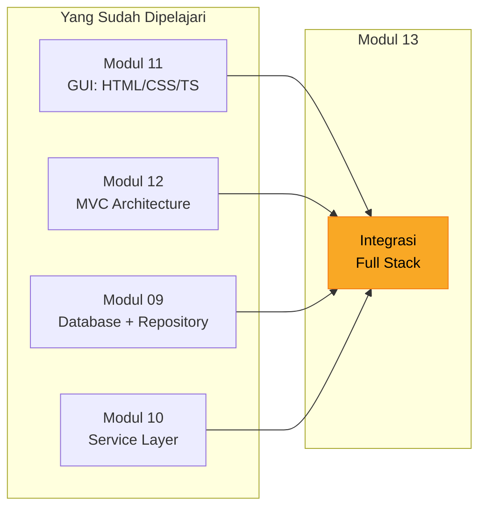
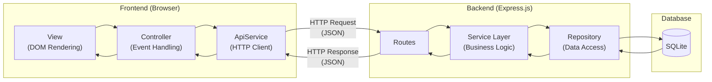
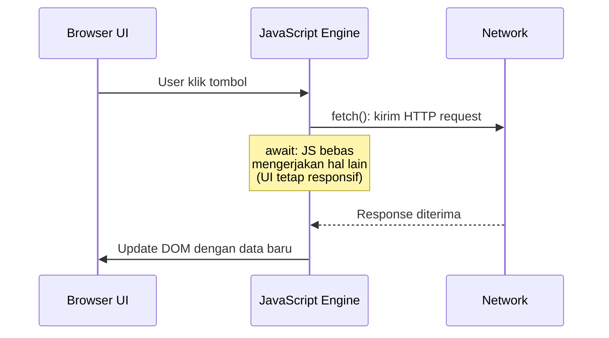
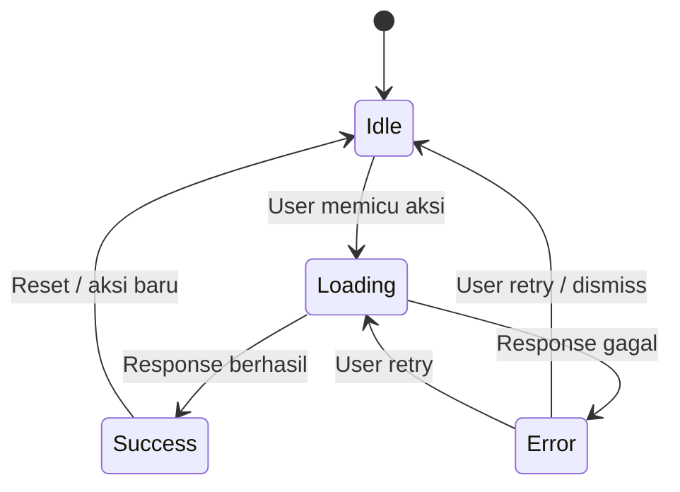
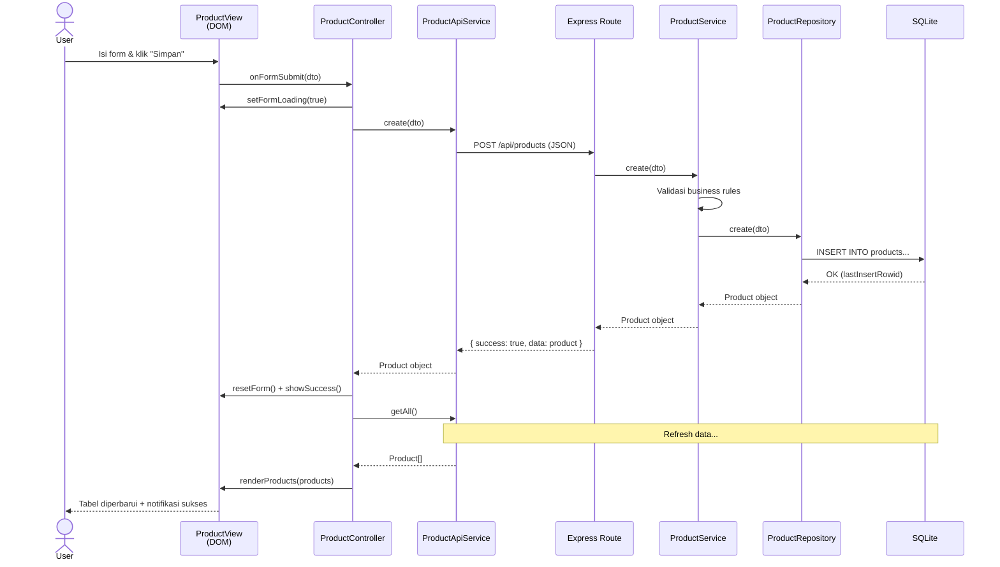
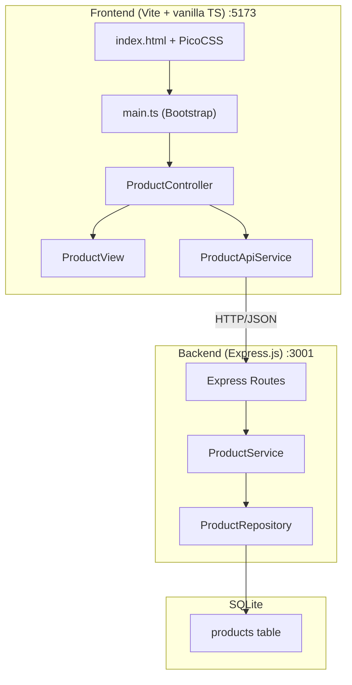
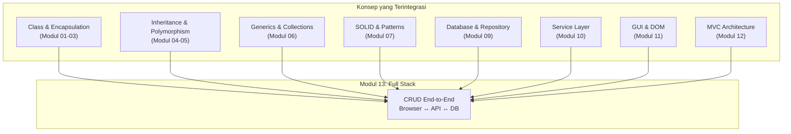

> **Mata Kuliah:** Pemrograman Berorientasi Objek
> **Minggu:** 13
> **Bagian:** Applied OOP
> **Bahasa:** TypeScript 5.x

---

## Capaian Pembelajaran Modul

Setelah mempelajari modul ini, mahasiswa mampu:
1. Memahami arsitektur full-stack: Browser ↔ API ↔ Database
2. Membangun REST API sederhana menggunakan Express.js
3. Menggunakan `fetch` API dari frontend TypeScript untuk komunikasi dengan backend
4. Menerapkan `async/await` dan `Promise` di TypeScript
5. Mengelola loading state dan error handling di UI
6. Mengimplementasikan CRUD flow end-to-end: Form → Controller → API → Service → Repository → DB → Response → View

---

## Prasyarat

- **Modul 01-07:** Fundamental OOP, class, encapsulation, inheritance, polymorphism, abstraction, generics, collections, SOLID principles
- **Modul 09:** Database Integration, SQLite, Repository Pattern, error handling
- **Modul 10:** Service Layer, layered architecture, business logic, dependency injection
- **Modul 11:** Pengantar GUI, HTML/CSS/TypeScript, DOM manipulation, event handling, PicoCSS
- **Modul 12:** GUI + OOP Architecture, MVC pattern, class-based View & Controller, Observer/EventEmitter
- Pemahaman dasar HTTP (GET, POST, PUT, DELETE)

---

## Daftar Isi

- [1. Pendahuluan](#1-pendahuluan)
- [2. Landasan Konsep](#2-landasan-konsep)
- [3. Implementasi dalam TypeScript](#3-implementasi-dalam-typescript)
- [4. Perbandingan Lintas Bahasa](#4-perbandingan-lintas-bahasa)
- [5. Studi Kasus: Product Management Full Stack](#5-studi-kasus-product-management-full-stack)
- [6. Kesalahan Umum & Best Practices](#6-kesalahan-umum--best-practices)
- [7. Ringkasan](#7-ringkasan)
- [8. Latihan Mandiri](#8-latihan-mandiri)

---

## 1. Pendahuluan

Selama 12 modul sebelumnya, kalian telah membangun fondasi OOP yang kuat, mulai dari class dasar hingga design patterns, dari pengelolaan data di database hingga pembuatan antarmuka grafis dengan HTML/CSS/TypeScript dan arsitektur MVC. Kini saatnya **menyatukan semuanya** menjadi satu aplikasi utuh yang fungsional.

Di dunia nyata, hampir setiap aplikasi modern terdiri dari minimal dua bagian besar: **frontend** (antarmuka pengguna di browser) dan **backend** (logika bisnis + penyimpanan data di server). Keduanya harus berkomunikasi secara efisien dan andal. Modul ini membahas bagaimana menghubungkan komponen-komponen tersebut menggunakan arsitektur berlapis yang menerapkan prinsip-prinsip OOP.

> 💡 **Insight:** Integrasi GUI + Database bukan hanya soal teknis "menyambungkan kabel." Ini adalah ujian apakah arsitektur OOP yang kita rancang benar-benar modular, testable, dan maintainable, karena setiap lapisan harus bisa berubah secara independen.

Perhatikan bahwa **Express.js bukan materi utama modul ini**. Express hanya berperan sebagai "jembatan" agar frontend di browser bisa berkomunikasi dengan database di server. Template endpoint akan disediakan, mahasiswa fokus pada layer **Service** dan **Repository** (inti OOP-nya) serta bagaimana **Controller** dan **View** di frontend mengorkestrasi alur data.



---

## 2. Landasan Konsep

### 2.1 Arsitektur Full-Stack: Browser ↔ API ↔ DB

Aplikasi full-stack modern mengikuti arsitektur berlapis (*layered architecture*). Setiap lapisan memiliki tanggung jawab spesifik dan berkomunikasi hanya dengan lapisan di sebelahnya.



| Lapisan | Lokasi | Tanggung Jawab |
|---------|--------|----------------|
| **View** | Browser | Merender data ke DOM, menangkap input pengguna |
| **Controller** | Browser | Mengorkestrasi: terima event → panggil API → update View |
| **ApiService** | Browser | Membungkus `fetch` calls, serialisasi/deserialisasi JSON |
| **Routes** | Server | Menerima HTTP request, memanggil Service, mengirim response |
| **Service** | Server | Business logic, validasi, aturan bisnis |
| **Repository** | Server | Akses database, query SQL, mapping row → object |

> 🔑 **Konsep Kunci:** Prinsip *Separation of Concerns*, setiap lapisan hanya tahu tentang lapisan tepat di sebelahnya. View tidak tahu tentang database, dan Repository tidak tahu tentang tombol di layar. Ini memungkinkan perubahan di satu lapisan tanpa merusak lapisan lain.

### 2.2 REST API Sederhana (GET, POST, PUT, DELETE)

REST (*Representational State Transfer*) adalah konvensi arsitektur untuk komunikasi antara frontend dan backend melalui HTTP:

| Operasi | HTTP Method | Endpoint | Deskripsi |
|---------|-------------|----------|-----------|
| Create | `POST` | `/api/products` | Membuat produk baru |
| Read All | `GET` | `/api/products` | Mengambil semua produk |
| Read One | `GET` | `/api/products/:id` | Mengambil satu produk berdasarkan ID |
| Update | `PUT` | `/api/products/:id` | Memperbarui produk |
| Delete | `DELETE` | `/api/products/:id` | Menghapus produk |

> 🔑 **Konsep Kunci:** RESTful API menggunakan HTTP methods sebagai "kata kerja" dan URL sebagai "kata benda." Kombinasi keduanya membentuk instruksi yang jelas, misalnya `DELETE /api/products/5` berarti "hapus produk dengan ID 5."

Setiap response menggunakan format generik yang konsisten. Generik `<T>` memungkinkan satu interface dipakai untuk semua jenis response:

```typescript
interface ApiResponse<T> {
  success: boolean;
  data?: T;
  error?: string;
}
```

### 2.3 Async/Await dan Promise di TypeScript

Komunikasi antara frontend dan backend bersifat **asynchronous**, frontend mengirim request, lalu menunggu response tanpa memblokir seluruh antarmuka:

```typescript
// Tanpa async/await: callback chain (sulit dibaca)
fetch("/api/products")
  .then((response) => response.json())
  .then((data) => { console.log(data); })
  .catch((error) => { console.error(error); });

// Dengan async/await: lebih terbaca
async function fetchProducts(): Promise<Product[]> {
  const response = await fetch("/api/products");
  if (!response.ok) throw new Error(`HTTP Error: ${response.status}`);
  const result: ApiResponse<Product[]> = await response.json();
  if (!result.success) throw new Error(result.error || "Gagal mengambil data");
  return result.data!;
}
```

| Konsep | Penjelasan |
|--------|-----------|
| `Promise<T>` | Objek yang merepresentasikan nilai yang *belum tersedia* tetapi *akan tersedia* di masa depan |
| `async` | Menandai fungsi yang mengembalikan `Promise` dan memungkinkan penggunaan `await` |
| `await` | Menunggu `Promise` selesai sebelum melanjutkan, tanpa memblokir UI |
| `try/catch` | Menangkap error dari `await` yang gagal (network error, server error, dll.) |



> 💡 **Insight:** `await` tidak membuat program "berhenti." JavaScript tetap bisa merespons klik, scroll, dan event lain saat menunggu response dari server. UI tidak pernah "freeze."

### 2.4 Loading State dan Error Handling di UI

Setiap operasi asynchronous memiliki tiga kemungkinan state yang harus ditangani di UI:



- **Loading:** Spinner (atribut `aria-busy="true"` di PicoCSS), teks "Memuat data...", atau tombol yang disabled
- **Error:** Pesan error yang informatif dengan opsi retry
- **Success:** Notifikasi singkat (toast), data baru tampil di tabel

Dalam vanilla TypeScript, state dikelola melalui **DOM manipulation langsung**, show/hide elemen, mengubah `textContent`, dan menambah/menghapus atribut. Implementasi lengkapnya terlihat di Studi Kasus (Section 5).

> ⚠️ **Perhatian:** Mengabaikan loading dan error state adalah kesalahan fatal di aplikasi produksi. Pengguna yang tidak mendapat feedback akan mengklik tombol berulang kali, menyebabkan duplikasi data atau frustrasi.

### 2.5 CORS dan Configuration

Saat frontend (port 5173, Vite) dan backend (port 3001, Express) berjalan di port berbeda, browser memblokir request karena kebijakan **CORS** (*Cross-Origin Resource Sharing*). Solusinya: aktifkan CORS di Express:

```typescript
import cors from "cors";
const app = express();
app.use(cors({ origin: "http://localhost:5173" }));
```

> 💡 **Insight:** CORS adalah mekanisme keamanan browser. Tanpa konfigurasi ini, browser akan memblokir response meskipun server sudah memprosesnya.

---

## 3. Implementasi dalam TypeScript

### 3.1 Express.js Minimal API Setup

Definisikan tipe data bersama (shared types) yang dipakai frontend dan backend:

```typescript
// shared/types.ts
export interface Product {
  id: number;
  name: string;
  category: string;
  price: number;
  stock: number;
  createdAt: string;
}

export type CreateProductDTO = Omit<Product, "id" | "createdAt">;
export type UpdateProductDTO = Partial<CreateProductDTO>;

export interface ApiResponse<T> {
  success: boolean;
  data?: T;
  error?: string;
}
```

Setup Express.js minimal dengan 5 endpoint CRUD. Route handler dibuat **sangat tipis**, hanya meneruskan request ke Service Layer:

```typescript
// backend/server.ts
import express, { Request, Response } from "express";
import cors from "cors";
import { ProductService } from "./services/ProductService";
import { ProductRepository } from "./repositories/ProductRepository";

const app = express();
app.use(cors({ origin: "http://localhost:5173" }));
app.use(express.json());

const productRepo = new ProductRepository("./data/products.db");
const productService = new ProductService(productRepo);

app.get("/api/products", (req: Request, res: Response): void => {
  try {
    const products = productService.findAll(req.query.q as string | undefined);
    res.json({ success: true, data: products });
  } catch (err) {
    res.status(500).json({ success: false, error: (err as Error).message });
  }
});

app.get("/api/products/:id", (req: Request, res: Response): void => {
  try {
    const product = productService.findById(Number(req.params.id));
    if (!product) { res.status(404).json({ success: false, error: "Produk tidak ditemukan" }); return; }
    res.json({ success: true, data: product });
  } catch (err) {
    res.status(500).json({ success: false, error: (err as Error).message });
  }
});

app.post("/api/products", (req: Request, res: Response): void => {
  try {
    const product = productService.create(req.body);
    res.status(201).json({ success: true, data: product });
  } catch (err) {
    const status = (err as Error).message.includes("wajib") ? 400 : 500;
    res.status(status).json({ success: false, error: (err as Error).message });
  }
});

app.put("/api/products/:id", (req: Request, res: Response): void => {
  try {
    const product = productService.update(Number(req.params.id), req.body);
    if (!product) { res.status(404).json({ success: false, error: "Produk tidak ditemukan" }); return; }
    res.json({ success: true, data: product });
  } catch (err) {
    res.status(500).json({ success: false, error: (err as Error).message });
  }
});

app.delete("/api/products/:id", (req: Request, res: Response): void => {
  try {
    const deleted = productService.delete(Number(req.params.id));
    if (!deleted) { res.status(404).json({ success: false, error: "Produk tidak ditemukan" }); return; }
    res.json({ success: true, data: null });
  } catch (err) {
    res.status(500).json({ success: false, error: (err as Error).message });
  }
});

app.listen(3001, () => console.log("API server berjalan di http://localhost:3001"));
```

> ⚠️ **Perhatian:** Template endpoint di atas bisa langsung dipakai. Mahasiswa tidak perlu menulis ulang Express dari nol, fokus pada `ProductService` dan `ProductRepository` (Modul 09-10) dan bagaimana frontend berkomunikasi dengannya.

### 3.2 Connecting Service Layer to API Routes

Service dan Repository di backend **sama persis** dengan Modul 09 dan 10:

```typescript
// backend/repositories/ProductRepository.ts
import Database from "better-sqlite3";
import { Product, CreateProductDTO, UpdateProductDTO } from "../../shared/types";

export class ProductRepository {
  private db: Database.Database;

  constructor(dbPath: string) {
    this.db = new Database(dbPath);
    this.db.exec(`
      CREATE TABLE IF NOT EXISTS products (
        id INTEGER PRIMARY KEY AUTOINCREMENT,
        name TEXT NOT NULL,
        category TEXT NOT NULL DEFAULT 'Umum',
        price REAL NOT NULL,
        stock INTEGER NOT NULL DEFAULT 0,
        created_at TEXT NOT NULL DEFAULT (datetime('now'))
      )
    `);
  }

  findAll(query?: string): Product[] {
    if (query) {
      return this.db.prepare("SELECT * FROM products WHERE name LIKE ? ORDER BY id DESC")
        .all(`%${query}%`) as Product[];
    }
    return this.db.prepare("SELECT * FROM products ORDER BY id DESC").all() as Product[];
  }

  findById(id: number): Product | undefined {
    return this.db.prepare("SELECT * FROM products WHERE id = ?").get(id) as Product | undefined;
  }

  create(dto: CreateProductDTO): Product {
    const result = this.db.prepare(
      "INSERT INTO products (name, category, price, stock) VALUES (?, ?, ?, ?)"
    ).run(dto.name, dto.category, dto.price, dto.stock);
    return this.findById(Number(result.lastInsertRowid))!;
  }

  update(id: number, dto: UpdateProductDTO): Product | undefined {
    const existing = this.findById(id);
    if (!existing) return undefined;
    const merged = { ...existing, ...dto };
    this.db.prepare("UPDATE products SET name=?, category=?, price=?, stock=? WHERE id=?")
      .run(merged.name, merged.category, merged.price, merged.stock, id);
    return this.findById(id);
  }

  delete(id: number): boolean {
    return this.db.prepare("DELETE FROM products WHERE id = ?").run(id).changes > 0;
  }
}
```

```typescript
// backend/services/ProductService.ts
import { Product, CreateProductDTO, UpdateProductDTO } from "../../shared/types";
import { ProductRepository } from "../repositories/ProductRepository";

export class ProductService {
  constructor(private repo: ProductRepository) {}

  findAll(query?: string): Product[] { return this.repo.findAll(query); }
  findById(id: number): Product | undefined { return this.repo.findById(id); }

  create(dto: CreateProductDTO): Product {
    if (!dto.name?.trim()) throw new Error("Nama produk wajib diisi");
    if (dto.price == null || dto.price <= 0) throw new Error("Harga harus lebih dari 0");
    if (dto.stock == null || dto.stock < 0) throw new Error("Stok tidak boleh negatif");
    return this.repo.create({
      name: dto.name.trim(), category: dto.category || "Umum",
      price: dto.price, stock: dto.stock,
    });
  }

  update(id: number, dto: UpdateProductDTO): Product | undefined {
    if (dto.price !== undefined && dto.price <= 0) throw new Error("Harga harus > 0");
    if (dto.stock !== undefined && dto.stock < 0) throw new Error("Stok tidak boleh negatif");
    return this.repo.update(id, dto);
  }

  delete(id: number): boolean { return this.repo.delete(id); }
}
```

> 🔑 **Konsep Kunci:** Alur dependency: `Route → Service → Repository → Database`. Setiap layer hanya bergantung pada layer di bawahnya. Ini adalah penerapan *Dependency Inversion Principle*.

### 3.3 Frontend: fetch API dari Controller Class

Di sisi frontend, kita bangun di atas arsitektur MVC dari Modul 12. Kunci integrasi full-stack adalah `ProductApiService` yang membungkus semua komunikasi HTTP:

```typescript
// frontend/src/services/ProductApiService.ts
import { Product, CreateProductDTO, UpdateProductDTO, ApiResponse } from "../../../shared/types";

export class ProductApiService {
  constructor(private readonly baseUrl: string = "http://localhost:3001/api") {}

  async getAll(query?: string): Promise<Product[]> {
    const params = new URLSearchParams();
    if (query) params.set("q", query);
    const res = await fetch(`${this.baseUrl}/products?${params.toString()}`);
    return this.handle<Product[]>(res);
  }

  async getById(id: number): Promise<Product> {
    return this.handle<Product>(await fetch(`${this.baseUrl}/products/${id}`));
  }

  async create(dto: CreateProductDTO): Promise<Product> {
    const res = await fetch(`${this.baseUrl}/products`, {
      method: "POST",
      headers: { "Content-Type": "application/json" },
      body: JSON.stringify(dto),
    });
    return this.handle<Product>(res);
  }

  async update(id: number, dto: UpdateProductDTO): Promise<Product> {
    const res = await fetch(`${this.baseUrl}/products/${id}`, {
      method: "PUT",
      headers: { "Content-Type": "application/json" },
      body: JSON.stringify(dto),
    });
    return this.handle<Product>(res);
  }

  async delete(id: number): Promise<void> {
    const res = await fetch(`${this.baseUrl}/products/${id}`, { method: "DELETE" });
    const result: ApiResponse<null> = await res.json();
    if (!result.success) throw new Error(result.error || "Gagal menghapus");
  }

  private async handle<T>(res: Response): Promise<T> {
    const result: ApiResponse<T> = await res.json();
    if (!result.success) throw new Error(result.error || "Terjadi kesalahan");
    return result.data!;
  }
}
```

> 🔑 **Konsep Kunci:** `ProductApiService` menerapkan **Encapsulation**, detail HTTP tersembunyi di dalam class. Bandingkan dengan `ProductRepository` yang menyembunyikan detail SQL, polanya identik, medium-nya berbeda.

### 3.4 CRUD Flow End-to-End

Berikut alur lengkap saat user menambahkan produk baru, dari klik tombol hingga data tersimpan dan tampil di layar:



Setiap layer hanya berkomunikasi dengan layer tetangganya. Data mengalir ke bawah (request) dan kembali ke atas (response) melalui rantai yang jelas.

### 3.5 Loading State dan Error Handling di View

Pola konsisten di setiap method Controller: (1) tampilkan loading, (2) `await` API call, (3) update view jika berhasil, (4) tampilkan error jika gagal, (5) reset loading di `finally`. Berikut Controller dan cuplikan View yang mendemonstrasikannya:

```typescript
// Pola di ProductController: sama untuk semua operasi CRUD
private async handleCreate(dto: CreateProductDTO): Promise<void> {
  this.view.setFormLoading(true);               // (1) Loading
  try {
    await this.apiService.create(dto);           // (2) API call
    this.view.resetForm();                       // (3) Success: reset
    this.view.showSuccess("Berhasil!");          //     feedback
    await this.loadProducts();                   //     refresh
  } catch (error) {
    this.view.showFormError(                     // (4) Error: pesan
      error instanceof Error ? error.message : "Gagal menyimpan"
    );
  } finally {
    this.view.setFormLoading(false);             // (5) Reset loading
  }
}
```

```typescript
// Cuplikan dari ProductView: loading & error via DOM manipulation

showLoading(): void {
  this.productList.innerHTML = "";
  const p = document.createElement("p");
  p.setAttribute("aria-busy", "true");       // PicoCSS spinner
  p.textContent = "Memuat data produk...";
  this.productList.appendChild(p);
}

setFormLoading(isLoading: boolean): void {
  this.btnSubmit.disabled = isLoading;
  this.btnSubmit.setAttribute("aria-busy", String(isLoading));
  this.form.querySelectorAll<HTMLInputElement | HTMLSelectElement>("input, select")
    .forEach((el) => { el.disabled = isLoading; });
}

showError(message: string, onRetry?: () => void): void {
  this.productList.innerHTML = "";
  const p = document.createElement("p");
  p.textContent = message;
  p.style.color = "var(--del-color)";
  this.productList.appendChild(p);
  if (onRetry) {
    const btn = document.createElement("button");
    btn.textContent = "Coba Lagi";
    btn.addEventListener("click", onRetry);
    this.productList.appendChild(btn);
  }
}

showSuccess(message: string): void {
  document.querySelector(".success-toast")?.remove();
  const toast = document.createElement("div");
  toast.className = "success-toast";
  toast.textContent = message;
  document.body.appendChild(toast);
  setTimeout(() => toast.remove(), 3000);
}
```

> 🔄 **Perbandingan:** Di framework seperti React, loading state dikelola melalui `useState` dan re-render otomatis. Di vanilla TypeScript, kita melakukannya secara eksplisit melalui DOM manipulation. Konsepnya sama, hanya mekanismenya berbeda.

---

## 4. Perbandingan Lintas Bahasa

Arsitektur integrasi GUI + Database adalah pola universal di setiap ekosistem bahasa pemrograman.

### Java: Spring Boot + JSP/Thymeleaf

```java
// Java: Spring Boot REST Controller
@RestController
@RequestMapping("/api/products")
public class ProductController {
    private final ProductService productService;

    public ProductController(ProductService productService) {
        this.productService = productService;
    }

    @GetMapping
    public ResponseEntity<ApiResponse<List<Product>>> getAll(
            @RequestParam(required = false) String q) {
        return ResponseEntity.ok(
            new ApiResponse<>(true, productService.findAll(q), null));
    }

    @PostMapping
    public ResponseEntity<ApiResponse<Product>> create(
            @Valid @RequestBody CreateProductDTO dto) {
        return ResponseEntity.status(HttpStatus.CREATED)
            .body(new ApiResponse<>(true, productService.create(dto), null));
    }

    @DeleteMapping("/{id}")
    public ResponseEntity<ApiResponse<Void>> delete(@PathVariable Long id) {
        productService.delete(id);
        return ResponseEntity.ok(new ApiResponse<>(true, null, null));
    }
}
```

### Dart: Flutter + HTTP Package

```dart
// Dart/Flutter: ApiService class
class ProductApiService {
  final String baseUrl;
  ProductApiService({this.baseUrl = 'http://localhost:3001/api'});

  Future<List<Product>> getAll({String? query}) async {
    final uri = Uri.parse('$baseUrl/products').replace(
      queryParameters: query != null ? {'q': query} : null,
    );
    final response = await http.get(uri);
    if (response.statusCode != 200) throw Exception('Gagal mengambil data');
    final body = jsonDecode(response.body);
    return (body['data'] as List).map((j) => Product.fromJson(j)).toList();
  }

  Future<Product> create(CreateProductDTO dto) async {
    final response = await http.post(
      Uri.parse('$baseUrl/products'),
      headers: {'Content-Type': 'application/json'},
      body: jsonEncode(dto.toJson()),
    );
    if (response.statusCode != 201) {
      throw Exception(jsonDecode(response.body)['error'] ?? 'Gagal');
    }
    return Product.fromJson(jsonDecode(response.body)['data']);
  }
}
```

> 🔄 **Perbandingan:** Perhatikan kemiripan pola di ketiga bahasa, Service class yang membungkus HTTP calls, async/await, dan layered architecture. Perbedaannya hanya syntax dan framework.

| Aspek | TypeScript + Express | Java + Spring Boot | Dart + Flutter |
|-------|---------------------|-------------------|----------------|
| Backend framework | Express.js | Spring Boot | shelf / dart_frog |
| Frontend | Vanilla HTML/CSS/TS | Thymeleaf / JSP | Flutter Widget |
| HTTP Client | `fetch` API | `RestTemplate` / `WebClient` | `http` package |
| State di frontend | Class properties + DOM | Server-rendered | `setState()` / Provider |
| Dependency Injection | Constructor injection | `@Autowired` / constructor | Manual / `get_it` |
| Async pattern | `async/await` + `Promise` | `CompletableFuture` | `async/await` + `Future` |

---

## 5. Studi Kasus: Product Management Full Stack

### 5.1 Deskripsi dan Arsitektur

Sebuah toko retail membutuhkan aplikasi **Product Management** berbasis web: CRUD produk, pencarian, validasi, dan feedback (loading/error/success). Arsitektur menggunakan MVC di frontend yang terhubung ke Express API dan SQLite.



```
project/
├── shared/types.ts                  # Tipe data bersama
├── backend/
│   ├── server.ts                    # Express routes (Section 3.1)
│   ├── services/ProductService.ts   # Business logic (Section 3.2)
│   └── repositories/ProductRepository.ts  # Data access (Section 3.2)
├── frontend/
│   ├── index.html                   # HTML + PicoCSS
│   └── src/
│       ├── main.ts                  # Bootstrap
│       ├── services/ProductApiService.ts  # HTTP client (Section 3.3)
│       ├── controllers/ProductController.ts
│       └── views/ProductView.ts     # DOM rendering
└── data/products.db
```

### 5.2 Frontend: HTML (index.html)

```html
<!DOCTYPE html>
<html lang="id">
<head>
  <meta charset="UTF-8" />
  <meta name="viewport" content="width=device-width, initial-scale=1.0" />
  <title>Product Management</title>
  <link rel="stylesheet" href="https://cdn.jsdelivr.net/npm/@picocss/pico@2/css/pico.min.css" />
  <style>
    .form-error { color: var(--del-color); margin-bottom: 1rem; }
    .success-toast {
      position: fixed; top: 1rem; right: 1rem; z-index: 1000;
      padding: 1rem 1.5rem; border-radius: 0.5rem;
      background-color: var(--ins-color); color: white;
    }
    .actions { display: flex; gap: 0.5rem; }
  </style>
</head>
<body>
  <main class="container">
    <h1>Product Management</h1>

    <div role="search">
      <input type="search" id="search-input" placeholder="Cari produk..." />
    </div>

    <article>
      <header><h2 id="form-title">Tambah Produk</h2></header>
      <form id="product-form">
        <div class="grid">
          <label>Nama Produk
            <input type="text" id="input-name" name="name" required />
          </label>
          <label>Kategori
            <select id="input-category" name="category" required>
              <option value="">-- Pilih --</option>
              <option value="Elektronik">Elektronik</option>
              <option value="Pakaian">Pakaian</option>
              <option value="Makanan">Makanan</option>
              <option value="Peralatan">Peralatan</option>
            </select>
          </label>
        </div>
        <div class="grid">
          <label>Harga (Rp)
            <input type="number" id="input-price" name="price" min="1" required />
          </label>
          <label>Stok
            <input type="number" id="input-stock" name="stock" min="0" required />
          </label>
        </div>
        <div class="grid">
          <button type="submit" id="btn-submit">Simpan</button>
          <button type="button" id="btn-cancel" class="secondary"
                  style="display:none;">Batal</button>
        </div>
      </form>
    </article>

    <article>
      <header><h2>Daftar Produk (<span id="product-count">0</span>)</h2></header>
      <div id="product-list"></div>
    </article>
  </main>
  <script type="module" src="/src/main.ts"></script>
</body>
</html>
```

### 5.3 Frontend: ProductView (Lengkap)

Class View meng-enkapsulasi semua interaksi DOM. View **tidak tahu tentang API**, ia hanya menerima data dan meng-ekspos event handler yang dipanggil oleh Controller:

```typescript
// frontend/src/views/ProductView.ts
import { Product, CreateProductDTO } from "../../../shared/types";

type FormSubmitHandler = (dto: CreateProductDTO) => Promise<void>;
type AsyncIdHandler = (id: number) => Promise<void>;
type IdHandler = (id: number) => void;
type SearchHandler = (query: string) => Promise<void>;

export class ProductView {
  private form = document.querySelector<HTMLFormElement>("#product-form")!;
  private formTitle = document.querySelector<HTMLElement>("#form-title")!;
  private inputName = document.querySelector<HTMLInputElement>("#input-name")!;
  private inputCategory = document.querySelector<HTMLSelectElement>("#input-category")!;
  private inputPrice = document.querySelector<HTMLInputElement>("#input-price")!;
  private inputStock = document.querySelector<HTMLInputElement>("#input-stock")!;
  private btnSubmit = document.querySelector<HTMLButtonElement>("#btn-submit")!;
  private btnCancel = document.querySelector<HTMLButtonElement>("#btn-cancel")!;
  private searchInput = document.querySelector<HTMLInputElement>("#search-input")!;
  private productList = document.querySelector<HTMLElement>("#product-list")!;
  private productCount = document.querySelector<HTMLElement>("#product-count")!;

  private formSubmitHandler: FormSubmitHandler | null = null;
  private deleteHandler: AsyncIdHandler | null = null;
  private editHandler: IdHandler | null = null;
  private searchHandler: SearchHandler | null = null;
  private searchTimer: ReturnType<typeof setTimeout> | null = null;

  constructor() { this.setupInternalEvents(); }

  private setupInternalEvents(): void {
    this.form.addEventListener("submit", async (e: Event) => {
      e.preventDefault();
      this.clearFormError();
      const name = this.inputName.value.trim();
      const category = this.inputCategory.value;
      const price = parseFloat(this.inputPrice.value);
      const stock = parseInt(this.inputStock.value, 10);

      if (!name) { this.showFormError("Nama produk wajib diisi"); return; }
      if (!category) { this.showFormError("Kategori wajib dipilih"); return; }
      if (isNaN(price) || price <= 0) { this.showFormError("Harga harus > 0"); return; }
      if (isNaN(stock) || stock < 0) { this.showFormError("Stok tidak boleh negatif"); return; }

      if (this.formSubmitHandler) await this.formSubmitHandler({ name, category, price, stock });
    });

    this.btnCancel.addEventListener("click", () => this.resetForm());

    this.searchInput.addEventListener("input", () => {
      if (this.searchTimer) clearTimeout(this.searchTimer);
      this.searchTimer = setTimeout(async () => {
        if (this.searchHandler) await this.searchHandler(this.searchInput.value.trim());
      }, 300);
    });
  }

  // Event binding: dipanggil Controller
  onFormSubmit(h: FormSubmitHandler): void { this.formSubmitHandler = h; }
  onDeleteClick(h: AsyncIdHandler): void { this.deleteHandler = h; }
  onEditClick(h: IdHandler): void { this.editHandler = h; }
  onSearchInput(h: SearchHandler): void { this.searchHandler = h; }

  // Render tabel produk
  renderProducts(products: Product[]): void {
    this.productCount.textContent = String(products.length);
    if (products.length === 0) {
      this.productList.innerHTML = "<p>Belum ada produk.</p>";
      return;
    }
    const table = document.createElement("table");
    table.setAttribute("role", "grid");
    table.innerHTML = `<thead><tr>
      <th>Nama</th><th>Kategori</th><th>Harga</th><th>Stok</th><th>Aksi</th>
    </tr></thead>`;

    const tbody = document.createElement("tbody");
    for (const p of products) {
      const tr = document.createElement("tr");
      tr.innerHTML = `
        <td>${this.esc(p.name)}</td><td>${this.esc(p.category)}</td>
        <td>Rp${p.price.toLocaleString("id-ID")}</td><td>${p.stock}</td>
        <td class="actions"></td>`;

      const editBtn = document.createElement("button");
      editBtn.className = "outline secondary"; editBtn.textContent = "Edit";
      editBtn.addEventListener("click", () => this.editHandler?.(p.id));

      const delBtn = document.createElement("button");
      delBtn.className = "outline contrast"; delBtn.textContent = "Hapus";
      delBtn.addEventListener("click", async () => this.deleteHandler?.(p.id));

      const td = tr.querySelector(".actions")!;
      td.appendChild(editBtn); td.appendChild(delBtn);
      tbody.appendChild(tr);
    }
    table.appendChild(tbody);
    this.productList.innerHTML = "";
    this.productList.appendChild(table);
  }

  // Loading & Error
  showLoading(): void {
    this.productList.innerHTML = "";
    const p = document.createElement("p");
    p.setAttribute("aria-busy", "true");
    p.textContent = "Memuat data produk...";
    this.productList.appendChild(p);
  }

  setFormLoading(isLoading: boolean): void {
    this.btnSubmit.disabled = isLoading;
    this.btnSubmit.setAttribute("aria-busy", String(isLoading));
    this.form.querySelectorAll<HTMLInputElement | HTMLSelectElement>("input, select")
      .forEach((el) => { el.disabled = isLoading; });
  }

  showError(message: string, onRetry?: () => void): void {
    this.productList.innerHTML = "";
    const p = document.createElement("p");
    p.textContent = message; p.style.color = "var(--del-color)";
    this.productList.appendChild(p);
    if (onRetry) {
      const btn = document.createElement("button");
      btn.textContent = "Coba Lagi"; btn.addEventListener("click", onRetry);
      this.productList.appendChild(btn);
    }
  }

  showFormError(message: string): void {
    this.clearFormError();
    const div = document.createElement("div");
    div.className = "form-error"; div.setAttribute("role", "alert");
    div.textContent = message;
    this.form.insertBefore(div, this.form.firstChild);
  }

  showSuccess(message: string): void {
    document.querySelector(".success-toast")?.remove();
    const toast = document.createElement("div");
    toast.className = "success-toast"; toast.setAttribute("role", "status");
    toast.textContent = message;
    document.body.appendChild(toast);
    setTimeout(() => toast.remove(), 3000);
  }

  // Form management
  populateForm(product: Product): void {
    this.formTitle.textContent = "Edit Produk";
    this.inputName.value = product.name;
    this.inputCategory.value = product.category;
    this.inputPrice.value = String(product.price);
    this.inputStock.value = String(product.stock);
    this.btnSubmit.textContent = "Perbarui";
    this.btnCancel.style.display = "inline-block";
  }

  resetForm(): void {
    this.form.reset();
    this.formTitle.textContent = "Tambah Produk";
    this.btnSubmit.textContent = "Simpan";
    this.btnCancel.style.display = "none";
    this.clearFormError();
  }

  private clearFormError(): void { this.form.querySelector(".form-error")?.remove(); }

  private esc(text: string): string {
    const d = document.createElement("div"); d.textContent = text; return d.innerHTML;
  }
}
```

### 5.4 Frontend: ProductController (Lengkap)

```typescript
// frontend/src/controllers/ProductController.ts
import { Product, CreateProductDTO, UpdateProductDTO } from "../../../shared/types";
import { ProductApiService } from "../services/ProductApiService";
import { ProductView } from "../views/ProductView";

export class ProductController {
  private products: Product[] = [];
  private editingId: number | null = null;

  constructor(private apiService: ProductApiService, private view: ProductView) {
    this.view.onFormSubmit(async (dto) => {
      if (this.editingId !== null) await this.handleUpdate(this.editingId, dto);
      else await this.handleCreate(dto);
    });
    this.view.onDeleteClick(async (id) => await this.handleDelete(id));
    this.view.onEditClick((id) => {
      const p = this.products.find((x) => x.id === id);
      if (p) { this.editingId = p.id; this.view.populateForm(p); }
    });
    this.view.onSearchInput(async (q) => await this.loadProducts(q));
  }

  async initialize(): Promise<void> { await this.loadProducts(); }

  private async loadProducts(query?: string): Promise<void> {
    this.view.showLoading();
    try {
      this.products = await this.apiService.getAll(query);
      this.view.renderProducts(this.products);
    } catch (e) {
      this.view.showError(e instanceof Error ? e.message : "Error", () => this.loadProducts(query));
    }
  }

  private async handleCreate(dto: CreateProductDTO): Promise<void> {
    this.view.setFormLoading(true);
    try {
      await this.apiService.create(dto);
      this.view.resetForm();
      this.view.showSuccess("Produk berhasil ditambahkan!");
      await this.loadProducts();
    } catch (e) {
      this.view.showFormError(e instanceof Error ? e.message : "Gagal menyimpan");
    } finally { this.view.setFormLoading(false); }
  }

  private async handleUpdate(id: number, dto: UpdateProductDTO): Promise<void> {
    this.view.setFormLoading(true);
    try {
      await this.apiService.update(id, dto);
      this.editingId = null;
      this.view.resetForm();
      this.view.showSuccess("Produk berhasil diperbarui!");
      await this.loadProducts();
    } catch (e) {
      this.view.showFormError(e instanceof Error ? e.message : "Gagal memperbarui");
    } finally { this.view.setFormLoading(false); }
  }

  private async handleDelete(id: number): Promise<void> {
    if (!confirm("Yakin ingin menghapus produk ini?")) return;
    this.view.showLoading();
    try {
      await this.apiService.delete(id);
      this.view.showSuccess("Produk berhasil dihapus!");
      await this.loadProducts();
    } catch (e) {
      this.view.showError(e instanceof Error ? e.message : "Gagal menghapus");
    }
  }
}
```

### 5.5 Frontend: Bootstrap (main.ts)

```typescript
// frontend/src/main.ts
import { ProductApiService } from "./services/ProductApiService";
import { ProductView } from "./views/ProductView";
import { ProductController } from "./controllers/ProductController";

function main(): void {
  const apiService = new ProductApiService("http://localhost:3001/api");
  const view = new ProductView();
  const controller = new ProductController(apiService, view);
  controller.initialize().catch(console.error);
}

document.addEventListener("DOMContentLoaded", main);
```

> 🔑 **Konsep Kunci:** `main.ts` adalah *composition root*, tempat semua dependency di-wiring. `ProductController` menerima `apiService` dan `view` melalui constructor (**Dependency Injection**). Ini memungkinkan penggantian `ProductApiService` dengan mock saat testing.

### 5.6 Analisis OOP

| Aspek OOP | Penerapan dalam Studi Kasus |
|-----------|----------------------------|
| **Encapsulation** | `Repository` menyembunyikan SQL; `ApiService` menyembunyikan HTTP; `View` menyembunyikan DOM |
| **Abstraction** | Controller hanya tahu method signatures, tidak tahu implementasi di baliknya |
| **Single Responsibility** | Setiap class satu tugas: View=rendering, Controller=orchestration, ApiService=HTTP |
| **Separation of Concerns** | Frontend tidak tahu SQL; backend tidak tahu DOM; komunikasi via JSON |
| **Dependency Inversion** | Controller bergantung pada interface, bukan implementasi spesifik |
| **Generics** | `ApiResponse<T>` satu interface untuk semua response |
| **Type Safety** | `shared/types.ts` menjaga konsistensi tipe antara frontend dan backend |

---

## 6. Kesalahan Umum & Best Practices

### Kesalahan 1: Memanggil fetch Tanpa await

```typescript
// ❌ SALAH: products bertipe Promise<Product[]>, bukan Product[]!
loadProducts(): void {
  const products = this.apiService.getAll();
  this.view.renderProducts(products);  // Type error
}

// ✅ BENAR
async loadProducts(): Promise<void> {
  const products = await this.apiService.getAll();
  this.view.renderProducts(products);
}
```

### Kesalahan 2: Tidak Menangani Error dari API

```typescript
// ❌ SALAH: jika server mati, UI kosong tanpa penjelasan
async loadProducts(): Promise<void> {
  const products = await this.apiService.getAll();
  this.view.renderProducts(products);
}

// ✅ BENAR
async loadProducts(): Promise<void> {
  this.view.showLoading();
  try {
    const products = await this.apiService.getAll();
    this.view.renderProducts(products);
  } catch (error) {
    this.view.showError(
      error instanceof TypeError ? "Server tidak dapat dijangkau." : (error as Error).message,
      () => this.loadProducts()
    );
  }
}
```

### Kesalahan 3: Validasi Hanya di Satu Sisi

```typescript
// ❌ SALAH: backend tanpa validasi
app.post("/api/products", (req, res) => {
  repo.create(req.body);  // Data apapun masuk ke DB!
  res.json({ success: true });
});

// ✅ BENAR: validasi di KEDUA sisi
// Frontend: UX (instant feedback)
if (!name.trim()) { this.view.showFormError("Nama wajib diisi"); return; }
// Backend: keamanan (tidak bisa di-bypass)
if (!dto.name?.trim()) throw new Error("Nama produk wajib diisi");
```

> ⚠️ **Perhatian:** Validasi frontend bersifat **UX enhancement**. User bisa bypass via Postman atau DevTools, backend wajib validasi.

### Kesalahan 4: Controller Memanipulasi DOM Langsung

```typescript
// ❌ SALAH: melanggar SRP, Controller tahu detail DOM
document.querySelector("#product-table tbody")!.innerHTML += `<tr>...</tr>`;

// ✅ BENAR: delegasi ke View
this.view.resetForm();
this.view.showSuccess("Produk berhasil ditambahkan!");
await this.loadProducts();
```

### Best Practices

| Praktik | Penjelasan |
|---------|-----------|
| **Shared types** | Tipe data di satu tempat, dipakai frontend dan backend |
| **Validasi berlapis** | Frontend (UX) **dan** backend (keamanan) |
| **Tangani semua state** | Loading, error, empty, dan success |
| **Service layer** | Bungkus `fetch` dalam class, jangan panggil langsung |
| **Konsisten response** | Format `ApiResponse<T>` di semua endpoint |
| **Pisahkan concern** | View=DOM, Controller=orchestration, ApiService=HTTP |
| **Escape user input** | `escapeHtml()` sebelum `innerHTML` (cegah XSS) |
| **Debounce search** | Tunggu user berhenti mengetik sebelum kirim request |

---

## 7. Ringkasan



Poin-poin utama:

- **Arsitektur berlapis** (Browser ↔ API ↔ Database) adalah standar industri. Setiap lapisan berkomunikasi melalui kontrak yang jelas (HTTP + JSON)
- **RESTful API** menyediakan konvensi standar menggunakan HTTP methods pada URL yang merepresentasikan resource
- **Express.js** berfungsi sebagai "jembatan", route handler tipis yang meneruskan request ke Service Layer
- **`fetch` API + `async/await`** memungkinkan komunikasi asynchronous tanpa memblokir UI
- **Class-based architecture** di frontend (View, Controller, ApiService) menerapkan MVC dari Modul 12 yang diperluas dengan komunikasi backend
- **Loading state, error handling, dan success feedback** diimplementasikan melalui DOM manipulation langsung
- **Validasi berlapis** (frontend + backend) menjamin keamanan dan UX yang responsif
- **Shared types** menjaga konsistensi tipe data antara frontend dan backend
- Seluruh prinsip OOP, encapsulation, SRP, DI, generics, terintegrasi secara alami

---

## 8. Latihan Mandiri

### Latihan 1: Tambahkan Fitur Sorting

Tambahkan kemampuan sorting pada daftar produk:

- Tambahkan dropdown di UI untuk sorting: **nama** (A-Z / Z-A), **harga** (rendah/tinggi), **stok** (rendah/tinggi)
- Implementasikan di **backend**: query parameter `sortBy` dan `order` pada `GET /api/products`
- Update `ProductApiService` untuk mengirim parameter sorting
- Pastikan sorting bisa dikombinasikan dengan search

**Kriteria keberhasilan:**
- `GET /api/products?sortBy=price&order=asc` mengembalikan produk terurut
- Dropdown sorting memicu refresh data via API
- Kompil tanpa error dengan `strict: true`

**Hint alur:**
```
User pilih sort → View event → Controller → ApiService
  → GET /api/products?sortBy=price&order=asc
  → Repository: SELECT * FROM products ORDER BY price ASC
  → Response → View re-render
```

### Latihan 2: Panel Detail Produk

Buat tampilan detail produk interaktif:

- Klik nama produk di tabel → tampilkan panel detail di bawah tabel (via DOM manipulation)
- Panel menampilkan semua info produk termasuk `createdAt`
- Tombol "Edit" → isi form, tombol "Hapus" → konfirmasi lalu hapus
- Handle error 404 dan loading state

**Kriteria keberhasilan:**
- Detail diambil via `ProductApiService.getById()`
- Error dan loading state ditangani di UI
- Tombol "Edit" dan "Hapus" berfungsi dari panel detail

### Latihan 3: CRUD Kategori (End-to-End)

Tambahkan entitas **Category** sebagai fitur terpisah:

- Tipe: `Category { id, name, description }`
- Backend: `CategoryRepository`, `CategoryService`, 4 endpoint REST
- Frontend: `CategoryApiService`, `CategoryView`, `CategoryController`
- Dropdown kategori di form produk diisi dari API (bukan hardcoded)

**Kriteria keberhasilan:**
- CRUD kategori berfungsi end-to-end (browser → API → DB → response → UI)
- Dropdown kategori produk diisi dinamis dari API
- Arsitektur konsisten (MVC frontend, Service → Repository backend)
- Error handling dan loading state di semua operasi

**Struktur file:**
```
backend/repositories/CategoryRepository.ts
backend/services/CategoryService.ts
frontend/src/services/CategoryApiService.ts
frontend/src/views/CategoryView.ts
frontend/src/controllers/CategoryController.ts
shared/types.ts  (tambah Category, CreateCategoryDTO)
```

---

## Referensi & Bacaan Lanjutan

- Express.js Official Documentation: https://expressjs.com/
- MDN Web Docs, Fetch API: https://developer.mozilla.org/en-US/docs/Web/API/Fetch_API
- MDN Web Docs, Using Fetch: https://developer.mozilla.org/en-US/docs/Web/API/Fetch_API/Using_Fetch
- MDN Web Docs, HTTP Methods: https://developer.mozilla.org/en-US/docs/Web/HTTP/Methods
- TypeScript Handbook, Generics: https://www.typescriptlang.org/docs/handbook/2/generics.html
- PicoCSS Documentation: https://picocss.com/docs
- REST API Design Best Practices: https://restfulapi.net/
- "Clean Architecture", Robert C. Martin (Bab 22: The Clean Architecture)
