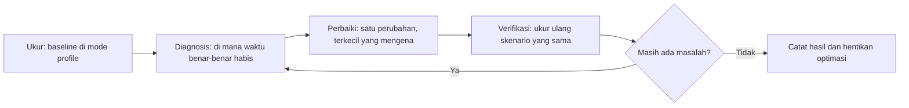
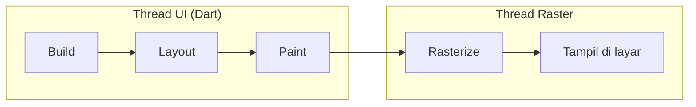

# Pertemuan 13: Performance Optimization

## Tujuan Pembelajaran

Banyak bab "performa" di tutorial berbentuk daftar dogma: pakai `const`, hindari `Consumer`, batasi `setState`, sisipkan `RepaintBoundary`, masing-masing dengan snippet delapan baris dan klaim "lebih cepat" tanpa angka. Bab ini menolak format itu. Dogma punya masalah struktural: setiap aturan itu benar di satu konteks dan salah di konteks lain, dan tanpa pengukuran Anda tidak akan tahu di konteks mana Anda berada.

Gantinya, bab ini mengajarkan satu siklus kerja yang dipakai berulang pada Tracker, aplikasi yang di bab 12 sudah lengkap dengan bukti foto, lokasi, dan SQLite v4:



Setelah menyelesaikan bab ini, Anda bisa:

1. Merekam baseline performa dengan Flutter DevTools di **mode profile** pada **perangkat representatif**, dan mencatatnya dalam bentuk yang bisa dibandingkan sebelum-sesudah.
2. Membaca frame timeline dan membedakan jank dari thread UI versus thread raster.
3. Mempersempit wilayah rebuild secara kontekstual, memahami kapan `const` dan ekstraksi widget benar-benar berdampak, dan kapan `Consumer` justru pilihan yang tepat.
4. Membangun pagination infinite scroll yang aman dari dua balapan klasik: permintaan duplikat karena scroll listener licin, dan hasil halaman basi yang tiba setelah refresh.
5. Mengatur ukuran decode gambar dan cache-nya, serta menutup kebocoran memori lewat dispose yang disiplin.
6. Menyadari bahwa cache data Tracker **sudah dibangun** di bab 10, SQLite sebagai sumber kebenaran lokal plus sync engine, sehingga bab ini tidak menulis lapisan cache baru, apalagi di atas SharedPreferences.

## Batas Bab Ini: Apa yang Dibahas dan Apa yang Tidak

**Dibahas:**

- Disiplin profiling: mode profile, perangkat representatif, skenario terulang, baseline tertulis.
- Frame budget sebagai fungsi refresh rate perangkat.
- Optimasi rebuild: `const`, ekstraksi widget, parameter `child`, dan pemilihan Consumer/Selector/`context.select` berdasarkan cakupan data.
- Pagination dengan pelindung balapan (single-flight + penanda generasi), diuji di runtime gate.
- Ukuran decode gambar, cache disk, dan manajemen memori/dispose.
- Pemetaan strategi cache ke lapisan yang sudah ada dari bab 8-10.

**Tidak dibahas, dengan alasan:**

- **Isolate untuk komputasi berat**: Tracker tidak punya beban hitung yang membutuhkannya; polanya (compute/Isolate.run) layak dapat bab sendiri bila aplikasi Anda punya kasus nyata.
- **Shader compilation jank dan warming**: spesifik animasi kompleks rilis pertama; disinggung sebagai arah lanjut saja.
- **Ukur ukuran APK dan tree-shake icon**: milik bab 14 tentang deployment.
- **Latihan bernilai dan tugas terstruktur**: ranah LMS, bukan buku.

## Frame Budget: 16 ms Bukan Angka Suci

Angka yang paling sering dikutip: layar 60 Hz menyegarkan gambar tiap 1/60 detik, jadi semua pekerjaan untuk satu frame harus selesai dalam **sekitar 16,67 ms**, umum dibulatkan jadi "16 ms". Benar untuk 60 Hz. Tapi angka itu bukan konstanta universal: layar 90 Hz memberi 11,1 ms, layar 120 Hz memberi 8,3 ms. Ponsel menengah ke atas yang beredar sekarang banyak yang berjalan di 90-120 Hz, jadi aplikasi yang "mulus di emulator 60 Hz" bisa jank di perangkat target sesungguhnya.

| Refresh rate | Anggaran per frame | Catatan                            |
| ------------ | ------------------ | ---------------------------------- |
| 60 Hz        | ± 16,67 ms         | Acuan paling umum, paling longgar  |
| 90 Hz        | ± 11,1 ms          | Umum di ponsel menengah            |
| 120 Hz       | ± 8,3 ms           | Panel flagship; margin makin tipis |

Dua implikasi praktis:

1. **Anggaran mengikuti perangkat target Anda**, bukan tabel di buku mana pun. Ukur di perangkat yang benar-benar dipakai pengguna Anda.
2. Anggaran itu dibagi dua thread. Thread UI menjalankan kode Dart Anda (build, layout, paint), thread raster menerjemahkan hasilnya untuk GPU. Frame timeline DevTools menampilkan keduanya, jank bisa berasal dari salah satunya, dan obatnya berbeda: thread UI lambat biasanya soal rebuild atau komputasi di Dart; thread raster lambat biasanya soal gambar terlalu besar, opacity mahal, atau efek yang memaksa repaint luas.



## Alat dan Disiplin Pengukuran

### Mode profile, bukan debug

```bash
# Profiling akurat: build nyaris secepat release, tracing tetap aktif
flutter run --profile -d <id-perangkat>
```

Debug build tidak bisa dipakai untuk menilai performa: assertion aktif, mode "slow mode" sengaja memperlambat operasi tertentu, dan overlay debug menambah pekerjaan render. Release build cepat tapi tidak menyediakan service protocol yang dipakai DevTools untuk tracing. Mode profile adalah titik tengah yang tepat: representatif untuk mengukur, tetap bisa diinspeksi.

### Perangkat representatif

Emulator menyimpan GPU di host dan CPU-nya bukan CPU ponsel, hasilnya sistematis terlalu optimis untuk jank, atau aneh untuk memori. Profil di **perangkat fisik kelas yang dipakai pengguna target** Anda. Untuk kelas kuliah ini, cukup satu ponsel Android menengah (misalnya RAM 4 GB, chip kelas menengah beberapa tahun terakhir) sebagai perangkat pengukuran tetap, yang penting sama dan konsisten sepanjang proyek, bukan mahal.

### Skenario terulang dan baseline tertulis

Angka hanya bermakna jika dibandingkan dengan angka dari kondisi yang sama. Sebelum merekam, tetapkan **skenario tertulis**, misalnya: buka daftar, tunggu selesai, gulir sampai akhir tanpa jeda, kembali ke atas, centang satu tugas. Jalankan sekali sebagai pemanasan (pemuatan awal, JIT, cache disk), baru rekam. Catat hasil di tabel dengan kolom yang sama sehingga setiap perbaikan bisa diisi kolom "sesudah":

| Metrik                        | Cara baca di DevTools                       |
| ----------------------------- | ------------------------------------------- |
| Frame janky / total frame     | Performance view: frame merah dan oranye    |
| Durasi frame terburuk         | Frame chart: puncak tertinggi pada skenario |
| Rerata durasi build thread UI | Frame analysis: rincian build/layout/paint  |
| Puncak memori                 | Memory view: grafik setelah paksa GC        |
| Permintaan jaringan           | Network view: jumlah dan durasi permintaan  |

> Angka contoh di bab ini selalu berasal dari **satu sesi pengukuran pada satu perangkat** dan diberi label demikian. Angka Anda akan berbeda, dan itu normal; yang Anda bandingkan adalah kolom "sebelum" dan "sesudah" milik Anda sendiri, bukan angka dari buku ini.

## Checkpoint 1: Baseline: Ukur Sebelum Menyentuh Kode

Target: Tracker dari bab 12, dijalankan di perangkat representatif dalam mode profile.

1. `flutter run --profile`, buka URL DevTools yang tercetak, masuk ke **Performance** view.
2. Jalankan skenario terulang Anda sekali tanpa merekam (pemanasan).
3. Klik rekam, jalankan skenario yang sama, hentikan.
4. Baca frame chart: hitung frame janky, catat frame terburuk dan apakah ia di thread UI atau raster.
5. Buka **Memory** view: paksa GC, catat puncak memori.
6. Tulis semuanya di tabel baseline. Kolom "sesudah" masih kosong, akan diisi satu per satu.

Contoh hasil satu sesi (perangkat Android menengah, daftar 200 tugas berisi gambar bukti dari bab 12):

| Metrik                      | Baseline       |
| --------------------------- | -------------- |
| Frame janky saat gulir      | 41 dari 480    |
| Frame terburuk              | 58 ms (UI)     |
| Puncak memori               | 96 MB          |
| Permintaan saat buka daftar | 1 (semua data) |

Empat angka itu menjadi diagnosis arah: jank di thread UI dan satu permintaan besar menunjuk ke dua kandidat, wilayah rebuild terlalu luas, dan memuat seluruh daftar sekaligus. Checkpoint berikutnya mengurus keduanya satu per satu, dan setiap checkpoint ditutup dengan mengukur ulang skenario yang sama.

## Checkpoint 2: Wilayah Rebuild: `const` dan Ekstraksi Widget

### Diagnosis dulu

Di Performance view, aktifkan **Widget rebuild tracking** (atau sementara tambahkan `debugPrint` di build widget yang dicurigai, lepas lagi setelah ukur). Gulir daftar. Jika `TaskCard` yang tidak terlihat pun ikut dibangun ulang, atau header statis dibangun ulang tiap kali daftar berubah, wilayah rebuild Anda terlalu luas.

### Perbaikan: `const` pada yang memang konstan

`const` membuat satu instance kanonik yang dipakai ulang. Ketika parent rebuild dan child-nya adalah instance `const` yang identik, Flutter bisa melewati rebuild subtree itu. Dampaknya nyata pada widget statis yang hidup di dalam subtree yang sering rebuild:

```dart
// Sebelum: tiga objek baru setiap build layar, tiap kali notifikasi tiba
AppBar(title: Text('Daftar Tugas'))
FloatingActionButton(child: Icon(Icons.add))
SizedBox(height: 16)

// Sesudah: dibuat sekali, dipakai ulang lintas rebuild
AppBar(title: const Text('Daftar Tugas'))
FloatingActionButton(child: const Icon(Icons.add))
const SizedBox(height: 16)
```

Dua hal yang `const` **tidak** lakukan: ia tidak menghentikan rebuild parent (parent tetap membangun; hanya subtree konstannya yang dilewati), dan ia tidak menolong widget yang datanya memang berubah, `Text(task.title)` tidak mungkin `const`. Jangan memburu `const` di widget yang berubah; itu dogma tanpa efek.

### Perbaikan: ekstrak widget dan pakai parameter `child`

Bagian subtree yang tidak bergantung pada data yang berubah sebaiknya tidak ikut dibangun ulang. Dua cara: ekstrak ke class sendiri (sehingga hanya dia yang rebuild saat datanya berubah), atau serahkan lewat parameter `child` milik `Consumer`/`Selector`, dibangun sekali di luar, diterima utuh saat rebuild:

```dart
Consumer<TaskListController>(
  builder: (context, controller, child) {
    return Column(
      children: [
        TaskCountLabel(count: controller.tasks.length),
        child!, // subtree besar, tidak bergantung controller - tidak rebuild
      ],
    );
  },
  child: const TaskListFooter(), // dibangun sekali, dipakai ulang
)
```

### Verifikasi ulang

Jalankan skenario yang sama. Yang Anda harapkan: jumlah rebuild per interaksi turun (terlihat di rebuild tracking), frame janky saat gulir turun. Contoh satu sesi: 41 menjadi 27 frame janky; frame terburuk 58 ms menjadi 44 ms. Jika angka tidak bergerak, pemborosan Anda bukan di rebuild, kembali ke Diagnosis, jangan menambah dogma.

## Checkpoint 3: Consumer, Selector, dan context.select: Pilih Sesuai Cakupan

Bab ini secara sengaja **tidak** mengajarkan "`Consumer` itu buruk". Pernyataan itu salah secara kontekstual. Tiga alat ini membeli hal yang berbeda:

| Alat                                    | Kapan tepat                                                          | Harganya                                               |
| --------------------------------------- | -------------------------------------------------------------------- | ------------------------------------------------------ |
| `Consumer<T>`/`context.watch<T>()`      | Subtree memang butuh sebagian besar state provider (mis. isi daftar) | Seluruh subtree rebuild pada setiap notifikasi         |
| `Selector<T, R>`/`context.select<T, R>` | Subtree hanya butuh irisan sempit (`R`) dari state                   | Fungsi selector + cek kesetaraan jalan tiap notifikasi |

Aturan praktisnya satu kalimat: **samakan cakupan rebuild dengan cakupan data yang benar-benar dipakai.** Jika sebuah widget membaca hampir semua yang provider milik, `Consumer` adalah pilihan yang jujur dan paling sederhana; menyulapnya jadi lima `Selector` hanya menambah kode dan fungsi selector yang jalan tiap notifikasi. Sebaliknya, jika widget hanya butuh satu angka, `Consumer` membangun ulang semuanya demi angka itu.

Widget penghitung di bawah daftar adalah contoh pas untuk `Selector`, ia hanya peduli agregat, bukan isi daftar:

```dart
class TaskCountBar extends StatelessWidget {
  const TaskCountBar({super.key});

  @override
  Widget build(BuildContext context) {
    // context.select: Selector dalam satu baris, untuk irisan tunggal
    final pending = context.select<TaskListController, int>(
      (controller) => controller.pendingCount,
    );
    return Text('Belum selesai: $pending');
  }
}
```

Untuk irisan majemuk (total, selesai, tertunda), jangan tiga `Selector` terpisah, kembalikan satu nilai agregat dari satu `Selector`. Syaratnya nilai itu mengimplementasikan `==` dan `hashCode`, kalau tidak setiap notifikasi menghasilkan "nilai baru" dan `Selector` tidak pernah bisa melewatkan rebuild:

```dart
class TaskStatsData {
  final int total;
  final int done;

  const TaskStatsData({required this.total, required this.done});

  @override
  bool operator ==(Object other) =>
      other is TaskStatsData && total == other.total && done == other.done;

  @override
  int get hashCode => Object.hash(total, done);
}

Selector<TaskListController, TaskStatsData>(
  selector: (context, controller) => TaskStatsData(
    total: controller.tasks.length,
    done: controller.tasks.length - controller.pendingCount,
  ),
  builder: (context, stats, child) => TaskCountLabel(stats: stats),
)
```

Dua jebakan yang membuat `Selector` sia-sia: selector yang mengembalikan objek baru tanpa `==` (selalu "berubah"), dan selector yang mengembalikan seluruh list lalu menyaringnya lagi di builder (menyerahkan seluruh data, lalu membayar rebuild). Verifikasi ulang tetap dengan rebuild tracking: setelah centang satu tugas, hanya baris penghitung yang boleh rebuild, bukan seluruh layar.

## Checkpoint 4: Pagination yang Aman dari Balapan

### Diagnosis

Baseline Checkpoint 1 mencatat satu permintaan besar yang mengambil seluruh 200 baris sekaligus. Itu pemborosan tiga kali: byte yang diunduh, JSON yang diparse, dan widget yang dibangun padahal hanya belasan yang terlihat. Solusinya pagination: ambil per halaman (misalnya 20 baris), muat halaman berikutnya saat pengguna mendekati dasar daftar.

### Dua balapan klasik yang harus dijawab sebelum menulis UI

1. **Permintaan duplikat.** Listener scroll bisa menyala berkali-kali dalam satu gestur, di ambang batas, tiga kejadian scroll dalam 100 ms bisa melahirkan tiga permintaan halaman 2 yang identik. Jawabannya _single-flight_: selama satu permintaan berjalan, panggilan `loadMore` berikutnya mengembalikan `Future` yang sama, bukan memulai permintaan baru.
2. **Hasil basi setelah refresh.** Pengguna menarik refresh saat permintaan halaman 3 masih di udara. Tanpa perlindungan, jawaban halaman 3 yang lama tiba setelah daftar direset dan menempel di posisi yang salah. Pembatalan di level soket itu mahal dan jarang perlu; pola yang lebih sederhana sudah cukup: _penanda generasi_ (epoch) yang dinaikkan setiap refresh, dan hasil permintaan yang generasinya sudah lewat dibuang saat tiba.

Satu keputusan lagi yang menentukan kebenaran pagination: **urutan pengambilan harus stabil**. `order=created_at.desc` saja tidak cukup, dua baris dengan `created_at` sama bisa bertukar posisi antar halaman, dan baris yang sama muncul dua kali. Tambahkan pemecah seri `id`.

### Controller pagination

Kelas inti bab ini, dijalankan di runtime gate sebagai bagian fixture, termasuk test balapannya:

```dart
// lib/state/paged_task_controller.dart
import 'package:flutter/foundation.dart';

import '../models/task.dart';

/// Sumber halaman: offset baris yang sudah dimiliki, dan ukuran halaman.
/// Disuntikkan agar controller bisa diuji dengan fetcher palsu.
typedef TaskPageFetcher = Future<List<Task>> Function(int offset, int limit);

/// Pemilik state daftar bertahap (bab 13): satu permintaan per halaman
/// (single-flight), hasil halaman basi dibuang lewat penanda generasi,
/// dan `hasMore` berhenti jujur pada halaman pendek.
class PagedTaskController extends ChangeNotifier {
  PagedTaskController({
    required TaskPageFetcher fetchPage,
    this.pageSize = 20,
  }) : _fetchPage = fetchPage;

  final TaskPageFetcher _fetchPage;
  final int pageSize;

  final List<Task> _items = [];
  var _isLoading = false;
  var _hasMore = true;
  String? _error;
  var _epoch = 0;
  Future<void>? _inFlight;

  List<Task> get items => List.unmodifiable(_items);
  bool get isLoading => _isLoading;
  bool get hasMore => _hasMore;
  String? get error => _error;

  /// Muat ulang dari awal. Permintaan lama yang masih berjalan tidak
  /// dibatalkan di soketnya: hasilnya dibuang: generasi dinaikkan
  /// sebelum reset, dan jawaban generasi lama diabaikan saat tiba.
  Future<void> refresh() {
    _epoch++;
    _items.clear();
    _hasMore = true;
    _error = null;
    _inFlight = null;
    notifyListeners();
    return loadMore();
  }

  /// Halaman berikutnya. Panggilan beruntun selama satu permintaan
  /// berjalan mengembalikan Future yang sama: scroll listener yang
  /// licin tidak boleh melahirkan permintaan duplikat.
  Future<void> loadMore() {
    if (!_hasMore) return Future.value();
    return _inFlight ??= _loadMore();
  }

  Future<void> _loadMore() async {
    final epoch = _epoch;
    _isLoading = true;
    _error = null;
    notifyListeners();
    try {
      final page = await _fetchPage(_items.length, pageSize);
      if (epoch != _epoch) return; // basi: refresh terjadi di tengah jalan
      _items.addAll(page);
      if (page.length < pageSize) _hasMore = false;
    } catch (e) {
      if (epoch != _epoch) return;
      _error = 'Gagal memuat halaman: $e';
    } finally {
      // Generasi lama tidak boleh menimpa state generasi baru:
      // finally hanya menutup permintaan yang masih berlaku.
      if (epoch == _epoch) {
        _inFlight = null;
        _isLoading = false;
        notifyListeners();
      }
    }
  }
}
```

Perhatikan urutan kerja `finally`: ia hanya membersihkan `_inFlight` dan `_isLoading` bila generasinya masih berlaku. Tanpa pengecekan itu, jawaban basi yang tiba terlambat akan menutup permintaan generasi baru dan UI macet di "selesai memuat" padahal halaman pertama belum tiba.

### Menghubungkan ke Supabase

Fetcher diimplementasikan dengan parameter `offset`/`limit` PostgREST, urutan stabil dengan pemecah seri `id`:

```dart
Future<List<Task>> fetchTaskPage(int offset, int limit) async {
  final uri = Uri.parse(
    '$baseUrl/rest/v1/tasks'
    '?select=*&order=created_at.desc,id.desc'
    '&offset=$offset&limit=$limit',
  );
  // ...kirim dengan header sesi bab 9, parse seperti ApiTaskRepository
}
```

Sisanya tinggal menyambungkan ke UI: `ScrollController` dengan ambang 200 px sebelum dasar memanggil `loadMore`, `itemCount` ditambah satu slot indikator memuat saat `hasMore`, dan pull-to-refresh memanggil `refresh`. Pola scroll listener-nya sama dengan yang dipakai di bab 7, bedanya sekarang aman dipanggil beruntun.

### Verifikasi ulang

Network view kini menunjukkan permintaan kecil bertambah saat menggulir, bukan satu permintaan besar di awal. Contoh satu sesi: pembukaan daftar mengunduh 20 baris pertama (bukan 200), waktu ke daftar pertama tampil turun terasa, dan puncak memori turun karena lebih sedikit baris, sekaligus lebih sedikit gambar bukti bab 12, yang hidup di memori pada satu waktu. Di sisi kebenaran: test gate membuktikan tiga `loadMore` beruntun hanya melahirkan satu permintaan, dan hasil halaman basi setelah refresh benar-benar dibuang.

## Checkpoint 5: Gambar dan Memori

### Ukuran decode, bukan hanya ukuran unduhan

Gambar bukti bab 12 diambil dengan `imageQuality` dan `maxWidth` saat disimpan, tapi yang tampil di daftar sering jauh lebih kecil lagi. Memori gambar dihitung dari piksel, bukan byte berkas: `lebar x tinggi x 4 byte`, thumbnail 100 px yang didecode dari berkas 3000 px memakai memori seolah-olah ditampilkan 3000 px. Gambar jaringan didekode dengan batas ukuran memori:

```dart
// Disk cache sekali unduh; decode dibatasi ke ukuran tampilan riil
CachedNetworkImage(
  imageUrl: evidence.url,
  memCacheWidth: 200, // disesuaikan ukuran thumbnail di daftar
  placeholder: (_, __) => const SkeletonTile(),
  errorWidget: (_, __, ___) => const BrokenImageTile(),
);
```

Untuk gambar lokal (`Image.file`), padanannya `cacheWidth`/`cacheHeight`. Nilai idealnya mengikuti ukuran tampil dikali `MediaQuery.devicePixelRatio`, ukuran logis 100 px pada layar 3x membutuhkan 300 px fisik agar tetap tajam.

### Kebocoran memori dan dispose

Memory view DevTools adalah alat diagnosisnya: paksa GC, catat titiknya, jalankan skenario berulang (buka-tutup layar detail 10 kali), paksa GC lagi, bandingkan. Memori yang naik terus setelah GC pada skenario berulang menunjukkan kebocoran. Penyebab paling umum di Tracker: controller dan langganan yang tidak ditutup.

| Sumber daya             | Ditutup dengan | Milik siapa di Tracker               |
| ----------------------- | -------------- | ------------------------------------ |
| `TextEditingController` | `.dispose()`   | Layar tambah/sunting tugas           |
| `ScrollController`      | `.dispose()`   | Layar daftar bertahap (Checkpoint 4) |
| `AnimationController`   | `.dispose()`   | Transisi kustom bab 6                |
| `StreamSubscription`    | `.cancel()`    | Langganan perubahan sesi/lokal       |
| `Timer`                 | `.cancel()`    | Penghitung, debounce                 |
| `FocusNode`             | `.dispose()`   | Kolom input kustom                   |

Aturan menuliskannya mekanis: setiap `addListener`/controller yang dibuat di `initState` atau sebagai field `State` ditutup di `dispose`, kebalikan urutan pembuatannya. Ini juga alasan `ChangeNotifier` controller layar dibangun lewat constructor dan dibuang pemiliknya, pola yang dipakai sejak bab 7 dan bab 11, bukan pengecualian baru.

## Checkpoint 6: Cache Data: Uang Pitu Sudah Ada dari Bab 10

Versi lama bab ini berisi subbab "network caching dengan SharedPreferences": seluruh daftar tugas diserialisasi jadi JSON, disimpan sebagai string list, dibaca lagi saat startup. Pola itu ditolak di sini, dengan alasan yang bisa diperiksa:

1. **SharedPreferences dimuat ke memori seutuhnya saat pertama kali dibaca**: menyimpan daftar beratus item berarti membayar parse penuh di isolate UI tepat saat startup, momen paling sensitif. Formatnya memang untuk preferensi kecil (tema, flag, seperti `SettingsController` bab 7), bukan data aplikasi.
2. **Tidak ada kontrol ukuran dan umur**: satu string besar yang terus menumpuk, tanpa indeks, tanpa query, tanpa migrasi.
3. **Tracker sudah punya lapisan cache yang lebih baik**: dibangun tiga bab terakhir.

Peta strategi cache di Tracker, semuanya di lapisan yang benar:

| Strategi               | Di Tracker diwujudkan oleh                                               | Cocok untuk                     |
| ---------------------- | ------------------------------------------------------------------------ | ------------------------------- |
| Stale-while-revalidate | `SyncingTaskRepository` bab 10: baca SQLite instan, sync di belakang     | Daftar tugas (default aplikasi) |
| Cache-first            | `AttachmentStore` bab 12: berkas bukti lokal, jaringan hanya bila hilang | Foto bukti                      |
| Network-first          | `AuthApi` bab 9: coba refresh, jatuh ke sesi tersimpan saat offline      | Sesi dan token                  |

Perubahan yang dibutuhkan bab ini di lapisan itu: **tidak ada**. `TaskListController` tetap membaca `repository.all()`, cepat karena SQLite lokal; `SyncEngine` tetap push-sebelum-pull di belakang. Optimasi bab ini selesai di lapisan UI dan ukuran muatannya (pagination, decode, rebuild); lapisan data sudah benar sejak bab 10 dan menulis lapisan paralel di atas SharedPreferences justru menciptakan dua sumber kebenaran.

## Ringkasan

- Optimasi yang bisa dipercaya hanya lahir dari siklus ukur-diagnosis-perbaiki-verifikasi; setiap perubahan diisolasi dan diakhiri pengukuran ulang skenario yang sama.
- Profil di mode profile pada perangkat representatif; debug build dan emulator menghasilkan angka yang menyesatkan.
- Frame budget mengikuti refresh rate perangkat: sekitar 16,67 ms pada 60 Hz, 11,1 ms pada 90 Hz, 8,3 ms pada 120 Hz, tentukan target dari perangkat pengguna Anda.
- Tidak ada alat rebuild yang selalu benar: `Consumer` untuk subtree yang memang hidup dari sebagian besar state, `Selector`/`context.select` untuk irisan sempit dengan nilai yang mengimplementasikan `==` dengan benar.
- `const` berdampak pada subtree konstan di dalam subtree yang sering rebuild, bukan mantra yang ditempel ke semua widget.
- Pagination harus menjawab dua balapan: single-flight menahan permintaan duplikat, penanda generasi membuang hasil basi setelah refresh, dan urutan pengambilan butuh pemecah seri agar stabil.
- Gambar diatur dari ukuran decode-nya (`memCacheWidth`, `cacheWidth` dikali device pixel ratio) dan cache disk; kebocoran memori ditutup lewat dispose yang mekanis, dibuktikan lewat Memory view.
- Cache data sudah dimiliki Tracker sejak bab 10 (SQLite + sync engine); SharedPreferences tetap untuk preferensi kecil, bukan wadah JSON daftar tugas.

## Referensi Cepat

Siklus satu putaran optimasi:

```text
1. flutter run --profile -d <perangkat>     # bukan debug, bukan emulator
2. warm-up satu skenario, lalu rekam di Performance view
3. catat: frame janky, frame terburuk (thread mana?), puncak memori
4. satu perubahan terkecil yang mengena diagnosis
5. ukur ulang skenario yang sama, isi kolom "sesudah"
6. angka tidak bergerak? salah diagnosis - kembali ke langkah 3
```

Tiga alat akses state by cakupan:

```dart
context.watch<TaskListController>()   // subtree butuh sebagian besar state
context.select<TaskListController, int>((c) => c.pendingCount) // irisan sempit
context.read<TaskListController>()    // aksi/sekali baca, tanpa rebuild
```

Pelindung pagination:

```dart
loadMore() => _inFlight ??= _loadMore(); // single-flight
if (epoch != _epoch) return;             // buang hasil basi
order=created_at.desc,id.desc            // urutan stabil + pemecah seri
```

## Referensi Lanjutan

- Kerangka ukur-diagnosis-perbaiki dan daftar praktik resmi: https://docs.flutter.dev/perf
- Performance view, frame timeline, dan cara membaca jank UI vs raster: https://docs.flutter.dev/tools/devtools/performance
- Rendering pipeline dan performa raster (opacity, saveLayer, clip): https://docs.flutter.dev/perf/rendering-performance
- Best practices kontrol rebuild (`const`, `child`, selector): https://docs.flutter.dev/perf/best-practices
- Memory view dan mendiagnosis kebocoran: https://docs.flutter.dev/tools/devtools/memory
- `cached_network_image`: cache disk dan batas decode: https://pub.dev/packages/cached_network_image
- Mengapa urutan stabil penting dalam pagination relasional (keyset vs offset): https://use-the-index-luke.com/sql/partial-results/fetch-next-page

Tracker kini cepat karena diukur, bukan karena diberkati daftar tips. Bab 14 menutup buku: membawa aplikasi yang sudah teruji (bab 11), bertahan offline (bab 10), dan terukur performanya (bab ini) ke Google Play Store.
