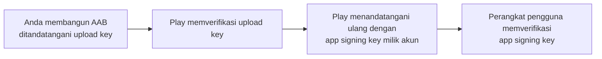
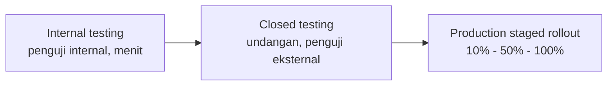

# Pertemuan 14: Deployment & Distribution

## Tujuan Pembelajaran

Bab-bab sebelumnya membangun Tracker sampai utuh: arsitektur dan build system (bab 4), antarmuka (bab 5-6), state dan storage (bab 7-8), REST dan sesi (bab 9), offline-first (bab 10), pengujian (bab 11), fitur perangkat (bab 12), dan performa yang terukur (bab 13). Semua itu berjalan di atas `flutter run` dan `flutter test`. Bab ini memindahkan aplikasi itu ke tempat pengguna menemukannya: Google Play Store.

Deployment sering diajarkan sebagai resep langkah, salin blok Gradle, jalankan tiga perintah, unggah. Resep jenis itu cepat basi karena dua hal yang terus bergerak: kebijakan store dan versi toolchain. Karena itu bab ini disusun di sekitar keputusan yang harus Anda pahami, bukan sekadar perintah yang harus Anda hafal:

1. **Kebijakan store bergerak per tanggal.** Google Play menetapkan target API minimum yang naik rutin. Konfigurasi yang menulis angka secara manual akan ditolak berbulan-bulan kemudian tanpa ada yang menyentuhnya.
2. **Kunci tanda tangan adalah identitas, bukan sekadar berkas.** Salah paham tentang siapa memegang kunci mana adalah penyebab paling umum aplikasi "terkunci" dan tidak bisa diperbarui.
3. **Klaim di toko adalah pernyataan yang bisa diverifikasi.** Formulir Data Safety dan kebijakan privasi yang diisi asal jalan adalah sumber penolakan dan penghapusan aplikasi.

Bab ini fokus ke Android dan Google Play, jalur yang bisa dikerjakan lintas sistem operasi. iOS disebut seperlunya sebagai peta konsep (perlu Xcode dan akun berbayar tahunan), tanpa langkah rinci.

## Batas Bab Ini: Apa yang Dibahas dan Apa yang Tidak

Dibahas: build rilis Android, signing di bawah Play App Signing, flavor dev/prod, versi dan changelog, aset toko dan verifikasi Data Safety, jalur rilis bertahap, serta build otomatis di GitHub Actions.

Tidak dibahas: deployment iOS (perangkat macOS dan proses review Apple), distribusi ke store alternatif, monitoring produksi seperti Crashlytics atau Sentry, dan notifikasi push. Semua itu layak menjadi bab lanjutan masing-masing.

---

## Kebijakan Target API: Konfigurasi yang Mengikuti Tanggal

Sebelum menulis satu baris konfigurasi rilis, pahami aturan yang menggerakkannya. Google Play mewajibkan aplikasi menargetkan API level Android tertentu untuk bisa diunggah dan diperbarui. Ketentuan yang berlaku saat buku ini ditulis:

| Tanggal                             | Ketentuan pada aplikasi baru dan update aplikasi yang sudah ada |
| ----------------------------------- | --------------------------------------------------------------- |
| **31 Agustus 2026**                 | Wajib target API 36 (Android 16)                                |
| **1 November 2026** (jika ekstensi) | Batas akhir bagi aplikasi yang diberi perpanjangan waktu        |

Sumber resminya selalu berupa halaman kebijakan Google Play: https://support.google.com/googleplay/android-developer/answer/11926878, cek halaman itu setiap kali merilis, karena tabel di atas adalah potret saat buku ini ditulis, bukan janji bahwa angkanya berhenti di situ.

Konsekuensinya sudah diantisipasi bab 4: konfigurasi Android Tracker tidak menulis satu angka SDK pun secara manual. `build.gradle.kts` memakai variabel yang diinjeksi Flutter tooling:

```kotlin
android {
    compileSdk = flutter.compileSdkVersion
    // ...
    defaultConfig {
        minSdk = flutter.minSdkVersion
        targetSdk = flutter.targetSdkVersion
        versionCode = flutter.versionCode
        versionName = flutter.versionName
    }
}
```

Saat Anda memperbarui Flutter, nilai-nilai ini naik mengikuti toolchain; ketika Play menaikkan syaratnya, aplikasi Anda mengejar lewat `flutter upgrade` dan pembaruan dependensi, bukan lewat penyuntingan angka di file Gradle. Tutorial yang menulis `targetSdk = 34` lalu menyebutnya "terbaru" adalah tulisan dari masa lalu, angka itu sudah tidak cukup untuk update sejak 2025, dan klaim "terbaru" dalam dokumen cetak selalu salah lebih cepat dari yang diharapkan penulisnya.

Aturan praktis yang dibawa bab ini: **angka SDK hanya muncul di tabel kebijakan, tidak pernah di file build.**

---

## Build Modes: Satu Tabel, Tanpa Misteri

Tiga mode build Flutter sudah Anda pakai sepanjang buku. Ringkasannya sebagai dasar pembicaraan rilis:

| Aspek          | Debug               | Profile             | Release                          |
| -------------- | ------------------- | ------------------- | -------------------------------- |
| Hot reload     | Ada                 | Tidak               | Tidak                            |
| Assertions     | Aktif               | Aktif               | Nonaktif, kode `assert` terbuang |
| DevTools       | Penuh               | Performance view    | Tidak                            |
| Optimisasi AOT | Tidak               | Sebagian            | Penuh                            |
| Kegunaan       | Pengembangan harian | Pengukuran (bab 13) | Pengguna akhir                   |

Dua fakta yang sering mengejutkan saat pertama kali membangun rilis:

- Build release menjalankan kode yang berbeda dari yang Anda uji selama ini. `assert` nonaktif, tree shaking membuang kode yang tidak terjangkau, dan obfuscation (nanti di bab ini) mengubah nama simbol. Bug yang tak pernah muncul di debug bisa muncul di rilis, karena itu pengujian build rilis adalah tahap wajib, bukan formalitas.
- `print` dan `debugPrint` yang lolos dari `avoid_print` (bab 4) ikut terkirim ke pengguna kecuali log rilis dikonfigurasi. Periksa ulang sebelum membangun.

---

## Signing: Upload Key dan App Signing Key

App signing adalah tanda tangan digital yang membuktikan bahwa pembaruan aplikasi datang dari pihak yang sama dengan aplikasi yang sudah terpasang. Android menolak memasang pembaruan yang ditandatangani kunci berbeda. Sejak Agustus 2021, aplikasi baru di Google Play otomatis mengikuti **Play App Signing**, yang membagi satu tanggung jawab menjadi dua kunci:



|               | Upload key                          | App signing key                                |
| ------------- | ----------------------------------- | ---------------------------------------------- |
| Dipegang oleh | Anda                                | Google (di bawah Play App Signing)             |
| Dipakai untuk | Menandatangani AAB yang Anda unggah | Menandatangani APK yang dibagikan ke pengguna  |
| Kalau hilang  | Bisa **direset** lewat Play Console | Tidak bisa dibuat ulang tanpa Play App Signing |
| Rotasi        | Ajukan kunci baru dari Play Console | Fitur upgrade key di Play Console              |

Pembedaan ini mengubah semua nasihat lama "jangan pernah kehilangan keystore atau aplikasi Anda mati" menjadi dua kalimat yang lebih tepat:

- Kehilangan **upload key** itu buruk tapi pulih: ajukan permintaan reset upload key di Play Console, tunggu proses verifikasi, lalu lanjut memperbarui aplikasi. Jalur resminya: https://support.google.com/googleplay/android-developer/answer/9842756
- Kehilangan **app signing key** tanpa Play App Signing itu fatal: aplikasi tidak bisa diperbarui lagi dan harus diterbitkan ulang sebagai aplikasi baru dengan nama paket berbeda. Aplikasi baru di Play otomatis terdaftar Play App Signing, sehingga skenario ini nyaris tidak terjadi lagi, selama Anda tidak sengaja keluar dari program.

### Membuat upload keystore

Jalankan `keytool` (tersedia di JDK yang dipakai Android Studio):

```bash
# Simpan keystore di luar folder proyek, di mesin yang dibackup
mkdir -p ~/upload-keystores
keytool -genkey -v \
  -keystore ~/upload-keystores/tracker-upload.jks \
  -keyalg RSA \
  -keysize 2048 \
  -validity 10000 \
  -alias tracker-upload
```

`keytool` akan menanyakan password keystore, identitas (nama, organisasi, kota, kode negara `ID`), dan password kunci. Tidak ada jawatan yang divalidasi pihak ketiga, yang penting konsisten dan Anda menyimpannya. Opsi `-storetype JKS` yang sering muncul di tutorial lama tidak lagi diperlukan; format bawaan keytool kini PKCS12, dan itu didukung penuh oleh toolchain Android.

Untuk belajar, satu keystore percobaan yang dibuat dengan perintah yang sama sudah cukup, selama keystore itu jelas berbeda dari keystore produksi dan tidak pernah dipakai untuk rilis nyata.

### key.properties: memisahkan kredensial dari build

Buat `android/key.properties`:

```properties
storePassword=password-keystore-anda
keyPassword=password-kunci-anda
keyAlias=tracker-upload
storeFile=/home/nama-anda/upload-keystores/tracker-upload.jks
```

Berkas ini berisi rahasia, jadi ia tidak boleh masuk Git. Template Flutter menaruhnya di `android/.gitignore`; pastikan itu benar-benar ada:

```gitignore
key.properties
**/*.keystore
**/*.jks
```

Verifikasi dari dalam proyek: `git status` tidak boleh menunjukkan `key.properties` maupun berkas `.jks` sebagai berkas yang bisa ditambahkan. Password sebaiknya juga dicatat di pengelola password (Bitwarden, 1Password, atau yang dipakai tim Anda), karena satu-satunya salinan yang hidup di laptop Anda bukan backup.

### Konfigurasi signing di build.gradle.kts

Kerangka berikut melengkapi `build.gradle.kts` dari bab 4 dengan signing rilis. Perhatikan susunannya: `import` boleh mendahului blok `plugins` (itu deklarasi Kotlin), tetapi **pernyataan tidak boleh**, kode Groovy lama yang menulis `def keystoreProperties = ...` di atas `plugins {}` adalah kesalahan yang membuat build gagal, dan tutorial yang masih menampilkannya patut dicurigai usianya:

```kotlin
import java.io.FileInputStream
import java.util.Properties

plugins {
    id("com.android.application")
    id("kotlin-android")
    id("dev.flutter.flutter-gradle-plugin")
}

val keystoreProperties = Properties()
val keystorePropertiesFile = rootProject.file("key.properties")
if (keystorePropertiesFile.exists()) {
    keystoreProperties.load(FileInputStream(keystorePropertiesFile))
}

android {
    namespace = "id.ac.kaqfa.tracker"
    compileSdk = flutter.compileSdkVersion
    ndkVersion = flutter.ndkVersion

    compileOptions {
        sourceCompatibility = JavaVersion.VERSION_17
        targetCompatibility = JavaVersion.VERSION_17
    }

    defaultConfig {
        applicationId = "id.ac.kaqfa.tracker"
        minSdk = flutter.minSdkVersion
        targetSdk = flutter.targetSdkVersion
        versionCode = flutter.versionCode
        versionName = flutter.versionName
    }

    signingConfigs {
        create("release") {
            if (keystorePropertiesFile.exists()) {
                keyAlias = keystoreProperties["keyAlias"] as String
                keyPassword = keystoreProperties["keyPassword"] as String
                storeFile = keystoreProperties["storeFile"]?.let { file(it) }
                storePassword = keystoreProperties["storePassword"] as String
            }
        }
    }

    buildTypes {
        release {
            signingConfig = if (keystorePropertiesFile.exists())
                signingConfigs.getByName("release")
            else
                signingConfigs.getByName("debug")
        }
    }
}
```

Tiga hal yang perlu dibaca dari konfigurasi ini:

1. **Tidak ada satu angka SDK pun.** Semua datang dari variabel `flutter.*`, sesuai aturan bab ini.
2. **Kegagalan yang ramah.** Selama `key.properties` ada, walau isinya menunjuk keystore percobaan, `flutter build appbundle --release` menghasilkan AAB bertanda kunci itu, dan build lulus. Kalau berkasnya tidak ada, build jatuh ke kunci debug. Itu berguna untuk mencoba pipeline di mesin baru, tetapi ingat konsekuensinya: **Play menolak AAB bertanda debug** dengan pesan eksplisit, jadi fallback ini hanya untuk uji lokal, tidak pernah untuk unggah.
3. **Satu sumber kebenaran versi.** `versionCode` dan `versionName` tetap mengalir dari `pubspec.yaml` lewat `flutter.versionCode` dan `flutter.versionName`, tidak ada versi yang ditulis ganda di Gradle.

Bagian `minifyEnabled`/R8 dan ProGuard tidak ditambahkan di sini: Flutter sudah mengoptimalkan AOT build-nya sendiri, dan aturan shrink resource ditambahkan kalau ada bukti ukuran yang perlu dipangkas, bukan karena tutorial menyuruh.

---

## Versi dan Changelog: Satu Sumber Kebenaran

Semantik `version` di `pubspec.yaml` dijelaskan tuntas di dokumentasi Flutter; yang dibahas di sini adalah disiplinnya:

```yaml
name: tracker
description: Aplikasi pencatat tugas dengan sinkronisasi Supabase
version: 1.0.0+1
#       │ │ │ └── build number → versionCode di Android
#       │ │ └──── patch
#       │ └────── minor
#       └──────── major
```

Dua aturan yang dipegang Play:

- **`versionCode` (angka setelah `+`) harus naik monoton untuk setiap unggahan.** Play menolak unggahan dengan kode versi yang sudah terpakai. Setiap rilis, naikkan minimal angka ini.
- **`versionName` (format x.y.z) untuk mata manusia.** Naikkan major ketika ada perubahan besar yang mengubah cara pakai, minor untuk fitur baru, patch untuk perbaikan.

Changelog ditulis untuk pengguna dan untuk diri Anda tiga bulan ke depan. Format Keep a Changelog cukup:

```markdown
# Changelog

## [Unreleased]

### Ditambahkan

- Ekspor tugas ke berkas CSV

## [1.0.0]: <tanggal rilis Anda>

### Ditambahkan

- Daftar tugas dengan status selesai dan foto bukti (bab 3, 12)
- Sinkronisasi dua arah dengan Supabase (bab 9, 10)
- Mode offline: perubahan tersimpan lokal dan tersinkron saat koneksi kembali (bab 10)

### Perbaikan

- Perguliran daftar panjang stabil pada perangkat refresh rate tinggi (bab 13)
```

Isinya mengikuti apa yang benar-benar dikirim aplikasi, tiap poin di atas bisa dilacak ke bab yang membangunnya. Changelog yang menjanjikan fitur yang belum ada bukan dokumen, melainkan utang.

---

## Flavors: Dev dan Prod Berdampingan

Bab 4 menutup pembahasan environment dengan janji: `--dart-define` menutup seluruh kebutuhan development, dan kebutuhan **dua aplikasi terpasang berdampingan di satu ponsel** menanti bab ini. Waktunya menepati.

Kasusnya nyata untuk Tracker: versi `dev` menunjuk proyek Supabase percobaan, versi `prod` ke proyek sungguhan. QA dan Anda sendiri ingin keduanya ada di perangkat yang sama, dengan nama dan ikon berbeda, tanpa saling menimpa. Solusinya adalah flavor Android:

```kotlin
// di dalam android { } pada build.gradle.kts
flavorDimensions += "env"
productFlavors {
    create("dev") {
        dimension = "env"
        applicationIdSuffix = ".dev"
        versionNameSuffix = "-dev"
        resValue("string", "app_name", "Tracker Dev")
    }
    create("prod") {
        dimension = "env"
        resValue("string", "app_name", "Tracker")
    }
}
```

Efeknya:

- `applicationIdSuffix = ".dev"` membuat versi dev terpasang sebagai aplikasi berbeda (`id.ac.kaqfa.tracker.dev`) di samping produksi, dua ikon, dua data lokal, dua salinan aplikasi.
- `resValue` menghasilkan resource string `app_name` per flavor. Agar terpakai, manifest merujuknya: `android:label="@string/app_name"` di `<application>`.
- `versionNameSuffix` menandai versi dev agar tidak tertukar di layar "tentang aplikasi".

Pasangkan dengan `--dart-define` yang sudah dikenal bab 9, karena flavor dan define menyelesaikan masalah yang berbeda, flavor mengatur identitas paket di sisi platform, define mengatur nilai Dart:

```bash
# versi pengembangan ke proyek Supabase percobaan
flutter run --flavor dev \
  --dart-define=APP_ENV=dev \
  --dart-define=SUPABASE_URL=https://xxxx.supabase.co \
  --dart-define=SUPABASE_ANON_KEY=eyJ...

# build rilis produksi
flutter build appbundle --release --flavor prod \
  --dart-define=APP_ENV=prod \
  --dart-define=SUPABASE_URL=https://yyyy.supabase.co \
  --dart-define=SUPABASE_ANON_KEY=eyJ...
```

Setelah flavor didefinisikan, setiap perintah build **wajib** menyebut `--flavor`; build tanpa flavor gagal dengan pesan yang jelas. Itu pengaman, bukan gangguan: build yang gagal jelas lebih murah daripada AAB produksi yang tak sengaja menunjuk server percobaan.

Dua catatan penutup flavors:

- Ikon berbeda per flavor diatur dengan source set Android (`android/app/src/dev/res/` dan `src/prod/res/`) atau paket pembangkit ikon yang mendukung flavor, detailnya menyusul bersama aset ikon di bawah.
- iOS memakai mekanisme setara bernama scheme dan konfigurasi Xcode. Konsepnya sama; alat dan langkahnya beda, dan hanya bisa dikerjakan di macOS.

---

## Build Rilis: AAB, Obfuscation, dan Simbol

### AAB, bukan APK, untuk Google Play

Google Play mewajibkan format **Android App Bundle (AAB)** untuk aplikasi baru sejak Agustus 2021. Play kemudian yang menghasilkan APK yang dioptimalkan per perangkat dari AAB itu, pengguna ponsel layar kecil tidak mengunduh aset untuk tablet. APK masih sah untuk distribusi langsung (sideload) atau store alternatif, tetapi untuk Play, AAB satu-satunya:

```bash
flutter clean
flutter pub get
flutter build appbundle --release --flavor prod --dart-define=APP_ENV=prod
```

Hasilnya di `build/app/outputs/bundle/prodRelease/app-prod-release.aab`.

### Obfuscation dan simbol debug

Untuk rilis publik, tambahkan obfuscation Dart: nama kelas dan fungsi dihasilkan ulang menjadi pendek dan tak bermakna, memperkecil biner dan mempersulit rekayasa balik. Konsekuensinya: stack trace dari pengguna berisi nama samaran, dan **simbol pemetaan wajib Anda simpan** agar trace itu bisa dibaca kembali:

```bash
flutter build appbundle --release --flavor prod \
  --dart-define=APP_ENV=prod \
  --obfuscate --split-debug-info=build/symbols
```

Saat laporan error datang, trace dikembalikan ke bentuk aslinya dengan:

```bash
flutter symbolize --id=obfuscation-id-dari-trace \
  --input=stack-trace.txt -d build/symbols
```

Direktori `build/symbols` adalah bagian dari rilis: simpan bersama tag rilis di Git (atau artifak CI), karena simbol tiap build berbeda dan tidak bisa direkonstruksi setelahnya. Untuk crash di sisi native, `flutter symbols` menghasilkan berkas simbol (`app.android-symbols.zip`) yang dapat diunggah ke Play Console agar laporan crash native ikut terbaca.

### Ukuran: bandingkan, jangan tebak

```bash
flutter build appbundle --release --flavor prod --analyze-size
```

`--analyze-size` menampilkan rincian berapa byte dari Dart AOT, aset, dan native library. Angka yang berarti adalah **perbandingannya**: build ini melawan build sebelumnya, atau aplikasi Anda melawan aplikasi setara. Menembak angka absolut seperti "di bawah 20 MB" tanpa pembanding hanya menghasilkan keputusan yang tidak bisa dipertanggungjawabkan.

---

## Menguji Build Rilis Sebelum Unggah

Pasang build rilis ke perangkat sungguhan dan jalankan skenario inti. `flutter install --release --flavor dev` memasang versi dev ke perangkat terhubung.

Checklist pengujian untuk Tracker, setiap baris menelusuri fitur yang dibangun di bab tertentu, karena itu bagian dari aplikasi yang bisa rusak saat mode build berubah:

| Area         | Yang diuji                                               | Dibangun di |
| ------------ | -------------------------------------------------------- | ----------- |
| Startup      | Aplikasi terbuka tanpa crash, splash dan ikon benar      | bab 4       |
| Auth         | Login, registrasi, logout; token segar otomatis          | bab 9       |
| CRUD         | Buat, ubah, selesaikan, hapus tugas                      | bab 3, 7    |
| Offline      | Putus jaringan, tetap bekerja; tersinkron setelah online | bab 10      |
| Fitur device | Foto bukti dari kamera dan galeri; koordinat tercatat    | bab 12      |
| Performa     | Gulir daftar panjang (pagination) mulus di mode rilis    | bab 13      |
| Permission   | Permintaan kamera/lokasi muncul sekali dan beralasan     | bab 12      |
| Flavor       | Dev dan prod berdampingan, data tidak tertukar           | bab ini     |

Tutup dengan uji lintas perangkat: paling tidak satu perangkat lama yang mendekati `flutter.minSdkVersion` dan satu baru. Emulator boleh untuk sanity check, tetapi keputusan rilis diambil dari perangkat fisik.

---

## Play Console: Dari Akun sampai Jalur Rilis

### Akun dan pendaftaran

1. Buka https://play.google.com/console dan masuk dengan akun Google.
2. Bayar biaya pendaftaran sekali bayar (USD 25) dan lengkapi profil developer.
3. **Create app**: nama `Tracker`, bahasa default, kategori App, gratis/berbayar, pilihan gratis/berbayar ini permanen dan tidak bisa berubah setelah rilis pertama.

Akun personal yang dibuat setelah November 2023 menghadapi syarat tambahan sebelum boleh rilis produksi: menjalankan **closed testing dengan minimal 20 penguji yang aktif selama minimal 14 hari**. Rencanakan ini sebagai bagian dari jadwal rilis, bukan kejutan di minggu terakhir. Ketentuannya di https://support.google.com/googleplay/android-developer/answer/14151465.

### Dashboard dan listing

Play Console menampilkan daftar periksa yang harus hijau semua sebelum rilis bisa dikirim. Bagian teknisnya sudah dibahas; bagian yang menyita waktu justru aset dan deklarasi:

| Aset              | Spesifikasi                                  | Catatan                                        |
| ----------------- | -------------------------------------------- | ---------------------------------------------- |
| Ikon toko         | 512x512, PNG 32-bit                          | Beda dari ikon launcher; tanpa transparansi    |
| Ikon launcher     | Adaptif Android (foreground + background)    | `flutter_launcher_icons` bisa membangkitkannya |
| Feature graphic   | 1024x500, PNG/JPG                            | Wajib meski tanpa video                        |
| Screenshot        | Minimal 2 per jenis perangkat (ponsel, dst.) | Data tampilan realistis, bukan placeholder     |
| Deskripsi singkat | Maksimum 80 karakter                         | Satu kalimat nilai utama                       |
| Deskripsi lengkap | Hingga 4000 karakter                         | Fokus fitur nyata                              |

Untuk ikon launcher, `flutter_launcher_icons` tetap praktis, tambahkan di `dev_dependencies`, konfigurasikan `flutter_launcher_icons:` di `pubspec.yaml` dengan `image_path` 1024x1024 plus foreground/background adaptif, lalu `dart run flutter_launcher_icons`. Untuk flavor, pembangkit ikon membaca konfigurasi terpisah per flavor; konsultasikan README paketnya untuk pola terkini.

### Verifikasi Data Safety dan privasi: checklist, bukan klaim

Bagian ini paling sering disalahpahami. Formulir **Data Safety** dan kebijakan privasi bukan formalitas teks yang disalin dari contoh, keduanya adalah pernyataan resmi yang Google bandingkan dengan perilaku nyata aplikasi (termasuk lewat pemindaian otomatis), dan ketidakcocokan adalah alasan penolakan dan penghapusan. Bentuk yang benar: **daftar verifikasi yang tiap butirnya Anda cocokkan dengan bukti**, bukan paragraf keyakinan.

Checklist untuk Tracker:

- [ ] **Cakupan data di formulir Data Safety cocok dengan yang dikumpulkan aplikasi.** Tracker mengumpulkan: email (registrasi, bab 9), konten pengguna (judul tugas, status, foto, koordinat, bab 9 dan 12), dan ID pengguna. Setiap jenis data harus dinyatakan, dengan tujuan dan apakah dienkripsi saat transit.
- [ ] **Kebijakan privasi menjelaskan data di atas satu per satu**, termasuk di mana data disimpan (region proyek Supabase yang Anda pilih saat membuat proyek, bab 9), untuk apa, berapa lama, dan bagaimana dihapus. Dihosting di URL yang bisa diakses publik dan stabil.
- [ ] **Jalur penghapusan akun tersedia.** Aplikasi yang memungkinkan pembuatan akun wajib menyediakan penghapusan akun, di dalam aplikasi dan melalui tautan web. Ketentuan: https://support.google.com/googleplay/android-developer/answer/10787469. Untuk Tracker, berarti ada layar/aksi "hapus akun" yang memanggil endpoint hapus di Supabase, plus tautan web yang berfungsi.
- [ ] **Setiap permission yang diminta dipakai dan bisa dijelaskan.** Tracker seharusnya hanya meminta `INTERNET` (bab 9), `CAMERA` dan akses galeri lewat photo picker tanpa permission storage (bab 12), serta location di granularitas yang benar. Permission yang dideklarasikan tapi tak terpakai adalah temuan audit, bukan cadangan.
- [ ] **Tidak ada klaim keamanan yang tak terbukti.** "Terenkripsi end-to-end", "kami tidak pernah menjual data Anda", "aman karena keamanan standar industri", kalimat seperti ini hanya boleh ditulis kalau Anda punya dasarnya dan siap menjelaskannya. Yang bisa ditulis Tracker dengan jujur: data disimpan di Supabase dengan RLS aktif sehingga tiap pengguna hanya membaca barisnya sendiri (bab 9); itu spesifik dan bisa diverifikasi.
- [ ] **Deklarasi iklan dan rating konten diisi sesuai kondisi sebenarnya.** Tracker tanpa iklan menyatakan tanpa iklan; kuesioner rating konten dijawab apa adanya.

Perhatikan pergeserannya dibanding pendekatan lama: bagian privasi bab ini tidak memberi template kebijakan privasi untuk disalin, karena teks hukum yang benar bergantung pada data dan yurisdiksi Anda. Yang diberikan adalah daftar hal yang harus benar, menulis kebijakannya sendiri atau dengan bantuan pihak yang kompeten adalah bagian dari menerbitkan aplikasi sungguhan.

### Jalur rilis bertahap



- **Internal testing**: unggah pertama setiap rilis. Menyebar dalam hitungan menit ke daftar penguji internal; di sinilah AAB bertanda upload key diverifikasi dan pre-launch report otomatis berjalan.
- **Closed testing**: undangan via tautan. Jalur wajib akun personal baru (lihat syarat 20 penguji di atas) dan tempat paling murah menemukan masalah sebelum publik.
- **Production dengan staged rollout**: mulai dari 10% pengguna, pantau crash rate di Android vitals, naik bertahap. Rollout yang berhenti di 10% karena crash jauh lebih murah daripada 100% pengguna menemukannya bersamaan.

Tingkat ini bukan formalitas; masing-masing menjawab satu pertanyaan, apakah build ini benar di tangan orang yang paling memaafkan, lalu orang yang sedikit memaafkan, lalu semua orang.

---

## Build Rilis Otomatis di GitHub Actions

Semua langkah di atas bisa dijalankan manual, tetapi build rilis yang manual akan melupakan sesuatu: satu flag, satu define, satu versi. Otomatisasi memindahkan pengetahuan dari kepala ke berkas. Alurnya: unggah tag `v*`, CI menjalankan analyze dan test (gerbang dari bab 11), membangun AAB dengan signing, mengunggah hasilnya sebagai artifak untuk diambil dan diunggah ke Console.

Berkas `.github/workflows/release.yml`:

```yaml
name: Release Build

on:
  push:
    tags: ['v*']

# Least privilege: workflow ini hanya perlu membaca repo
permissions:
  contents: read

jobs:
  build:
    runs-on: ubuntu-latest
    steps:
      - name: Checkout kode
        uses: actions/checkout@v5

      - name: Siapkan Java 17
        uses: actions/setup-java@v4
        with:
          distribution: temurin
          java-version: '17'

      - name: Siapkan Flutter
        uses: subosito/flutter-action@v2
        with:
          channel: stable
          # Untuk build yang reprodusibel, pin versi eksplisit
          # dan naikkan bersama pembaruan toolchain tim:
          # flutter-version: '3.35.0'

      - name: Ambil dependensi
        run: flutter pub get

      - name: Analisis statis
        run: flutter analyze

      - name: Uji
        run: flutter test

      - name: Siapkan signing
        env:
          KEYSTORE_BASE64: ${{ secrets.KEYSTORE_BASE64 }}
          KEYSTORE_PASSWORD: ${{ secrets.KEYSTORE_PASSWORD }}
          KEY_PASSWORD: ${{ secrets.KEY_PASSWORD }}
          KEY_ALIAS: ${{ secrets.KEY_ALIAS }}
        run: |
          echo "$KEYSTORE_BASE64" | base64 --decode > android/app/upload-keystore.jks
          cat > android/key.properties <<EOF
          storePassword=$KEYSTORE_PASSWORD
          keyPassword=$KEY_PASSWORD
          keyAlias=$KEY_ALIAS
          storeFile=upload-keystore.jks
          EOF

      - name: Build AAB
        env:
          SUPABASE_URL: ${{ vars.SUPABASE_URL }}
          SUPABASE_ANON_KEY: ${{ vars.SUPABASE_ANON_KEY }}
        run: >
          flutter build appbundle --release --flavor prod
          --dart-define=APP_ENV=prod
          --dart-define=SUPABASE_URL=$SUPABASE_URL
          --dart-define=SUPABASE_ANON_KEY=$SUPABASE_ANON_KEY
          --obfuscate --split-debug-info=build/symbols

      - name: Unggah AAB sebagai artifak
        uses: actions/upload-artifact@v4
        with:
          name: app-prod-release
          path: build/app/outputs/bundle/prodRelease/app-prod-release.aab

      - name: Unggah simbol sebagai artifak
        uses: actions/upload-artifact@v4
        with:
          name: dart-symbols
          path: build/symbols
```

Empat keputusan desain di balik berkas ini:

1. **Permission minimal di deklarasi workflow.** Baris `permissions: contents: read` membatasi apa yang token workflow bisa lakukan sekalipun ada langkah yang disusupi. Workflow tanpa baris ini mewarisi bawaan yang lebih luas, tambahkan permission minimal adalah kebiasaan dasar keamanan CI, bukan pilihan gaya.
2. **Rahasia dibedakan menurut tingkat kerahasiaannya.** Keystore dan passwordnya adalah **secret** (`Settings → Secrets and variables → Actions → Secrets`). URL dan anon key Supabase sengaja ditaruh di **variables** (`vars.`): keduanya memang publishable dan melekat di aplikasi (bab 9), yang menjaga data adalah RLS, bukan kerahasiaan kunci itu. Membedakan keduanya menjaga daftar secret tetap mewakili hal yang benar-benar rahasia.
3. **Obfuscation dan simbol adalah bagian dari build, bukan tambahan.** Artifak kedua (`dart-symbols`) diunggah setiap kali, simbol yang hilang berarti laporan crash yang tak terbaca selamanya.
4. **Unggah ke Play tidak diotomatisasi di sini.** Langkah dari artifak ke Console masih manual, terkendali, dan melalui jalur rilis bertahap. Setelah beberapa rilis stabil, otomatisasi unggah lewat `r0adkll/upload-google-play` atau fastlane adalah langkah lanjutan yang layak.

Mengisi secret di GitHub: encode keystore sebagai base64, `base64 -w0 upload-keystore.jks` di Linux atau `base64 -i upload-keystore.jks` di macOS, lalu tempel hasilnya sebagai nilai `KEYSTORE_BASE64`.

---

## Kegagalan Umum dan Jawabannya

| Gejala                                        | Penyebab                                              | Penanganan                                                                |
| --------------------------------------------- | ----------------------------------------------------- | ------------------------------------------------------------------------- |
| "Version code X has already been used"        | Angka setelah `+` di pubspec tidak dinaikkan          | Naikkan build number, bangun ulang                                        |
| AAB ditolak: ditandatangani kunci debug       | Build jatuh ke fallback karena `key.properties` absen | Pastikan `key.properties` dan keystore tersedia di lingkungan build       |
| AAB ditolak: tanda tangan tidak cocok         | Upload key berbeda dari yang terdaftar di Play        | Ajukan reset upload key di Play Console, atau gunakan keystore yang benar |
| "Target API level tidak memenuhi persyaratan" | Toolchain Flutter lebih tua dari kebijakan Play       | `flutter upgrade`, perbarui dependensi, bangun ulang, jangan tulis angka  |
| Crash di rilis, trace tak terbaca             | Simbol `--split-debug-info` tidak disimpan            | `flutter symbolize` dengan direktori simbol build yang sama (artifak CI)  |
| Upload key hilang                             | Keystore terhapus, laptop hilang                      | Reset upload key lewat Play Console; app signing key aman di Google       |

Pola di kolom penanganan sengaja: hampir semua kegagalan rilis yang menakutkan sebenarnya punya jalur pemulihan, karena batas antara "fatal" dan "pulih" ditentukan oleh kunci mana yang terlibat, pembedaan dari awal bab ini terbayar di sini.

---

## Ringkasan

- Konfigurasi rilis tidak menulis angka SDK: `flutter.compileSdkVersion`, `flutter.minSdkVersion`, dan `flutter.targetSdkVersion` mengikuti toolchain, dan toolchain mengikuti kebijakan Play, target API 36 wajib untuk aplikasi dan update sejak 31 Agustus 2026, dengan sumber kebenarannya di halaman kebijakan Google Play.
- Di bawah Play App Signing, Anda memegang **upload key** dan Google memegang **app signing key**. Upload key hilang bisa direset; kehilangan app signing key tanpa program ini tidak bisa dipulihkan.
- Kredensial signing hidup di `key.properties` yang diabaikan Git dan dibaca `build.gradle.kts` Kotlin DSL, dengan `import` boleh sebelum `plugins {}` dan pernyataan sesudahnya, kebalikan dari pola Groovy lama yang beredar di tutorial usang.
- Versi punya satu sumber kebenaran: `version:` di pubspec mengalir ke `versionCode`/`versionName`; build number wajib naik monoton tiap unggahan; changelog berisi yang benar-benar dikirim.
- Flavor dev/prod menggenapi janji bab 4: dua aplikasi berdampingan dengan `applicationIdSuffix`, nama, dan `--dart-define` masing-masing; build tanpa `--flavor` gagal jelas, itu pengaman.
- Rilis untuk Play berformat AAB, dengan `--obfuscate --split-debug-info` dan simbol yang disimpan sebagai bagian dari rilis.
- Data Safety, kebijakan privasi, permission, dan penghapusan akun diisi sebagai checklist verifikasi yang cocok dengan perilaku nyata aplikasi; klaim keamanan hanya ditulis yang bisa dibuktikan, RLS Supabase Tracker adalah contoh klaim yang spesifik dan benar.
- Jalur rilis bertahap (internal → closed → staged rollout) menguji build pada penerima yang makin ketat memaafkan; akun personal baru wajib melewati closed testing 20 penguji selama 14 hari.
- GitHub Actions membangun rilis dengan permission minimal, secret hanya untuk yang rahasia (keystore), variables untuk nilai publishable, dan artifak simbol diunggah setiap build.

## Referensi Cepat

Siklus rilis satu putaran:

```text
1. naikkan version di pubspec.yaml (minimal build number)
2. perbarui CHANGELOG.md
3. git tag -a v1.0.0 -m "Rilis 1.0.0" && git push origin v1.0.0
4. CI: analyze + test + build AAB (obfuscate, simbol)
5. pasang build rilis di perangkat fisik, jalankan checklist
6. unggah AAB ke internal testing, baca pre-launch report
7. closed testing → staged rollout 10% → 50% → 100%
```

Kunci-kunci yang dipertaruhkan:

```text
upload key      → dibuat keytool, dipakai menandatangani AAB
                  hilang = reset via Play Console (pulih)
app signing key → dipegang Google di Play App Signing
                  identitas aplikasi di mata perangkat
debug key       → fallback lokal saja; Play menolaknya
```

Perintah yang dipakai berulang:

```bash
flutter build appbundle --release --flavor prod --dart-define=APP_ENV=prod
flutter build appbundle --release --flavor prod --analyze-size
flutter symbolize -d build/symbols   # membaca trace terobfuscate
flutter install --release --flavor dev
```

## Bekerja dengan AI di Bab Ini

**Pantas didelegasikan:** menyusun draf README, catatan rilis, dan deskripsi aplikasi, lalu Anda periksa dan betulkan sendiri.

**Tulis sendiri:** checklist keamanan rilis. Keputusan tentang apa yang boleh masuk ke berkas rilis, kunci apa yang tidak boleh ikut, dan data apa yang dikumpulkan aplikasi adalah tanggung jawab hukum Anda, bukan tanggung jawab alat. Bagian ini yang menentukan apakah bab ini benar-benar Anda kuasai.

**Latihan:** Minta AI meninjau `build.gradle.kts` dan konfigurasi rilis Anda, cari rahasia yang tertinggal. Perlakukan hasilnya sebagai daftar kecurigaan, bukan vonis: periksa sendiri setiap temuannya, dan periksa juga riwayat commit, karena kunci yang sudah dihapus dari berkas masih hidup di sana. AI membaca keadaan sekarang, bukan riwayatnya.

## Referensi Lanjutan

- Panduan deployment Android resmi Flutter (Kotlin DSL, signing, R8): https://docs.flutter.dev/deployment/android
- Play App Signing: model dua kunci, reset upload key, upgrade key: https://support.google.com/googleplay/android-developer/answer/9842756
- Kebijakan target API Google Play, selalu cek halaman ini saat rilis: https://support.google.com/googleplay/android-developer/answer/11926878
- Formulir Data Safety: cara mengisi dan kecocokan dengan perilaku aplikasi: https://support.google.com/googleplay/android-developer/answer/10787469
- Kewajiban penghapusan akun untuk aplikasi dengan pembuatan akun: https://support.google.com/googleplay/android-developer/answer/10787469
- Syarat pengujian akun developer personal baru: https://support.google.com/googleplay/android-developer/answer/14151465
- Obfuscation Dart dan symbolize: https://docs.flutter.dev/deployment/obfuscate
- GitHub Actions: sintaks workflow dan keamanan secret: https://docs.github.com/actions/security-guides/using-secrets-in-github-actions

---

Empat belas pertemuan, satu aplikasi. Tracker tiba di titik yang jarang dicapai tutorial: diuji (bab 11), bertahan offline (bab 10), terukur (bab 13), dan kini terdistribusi, dengan identitas yang dijaga kunci, kebijakan yang diikuti tanggalnya, dan klaim yang semuanya bisa dibuktikan. Buku ini selesai di sini; aplikasi Anda tidak. Rilis pertama adalah awal dari siklus yang sama yang telah Anda jalankan di bab-bab sebelumnya: pantau laporan crash dan Android vitals, dengarkan pengguna, ukur, perbaiki, naikkan build number, dan mulai lagi.
