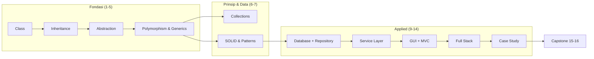
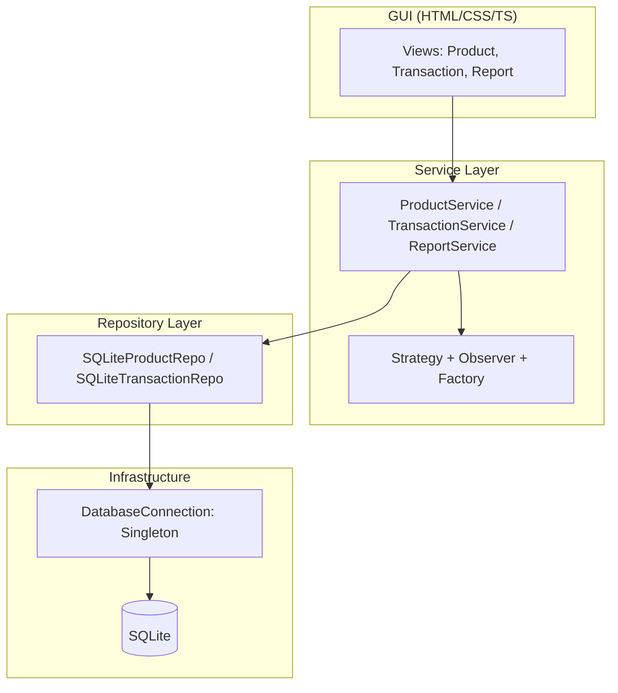
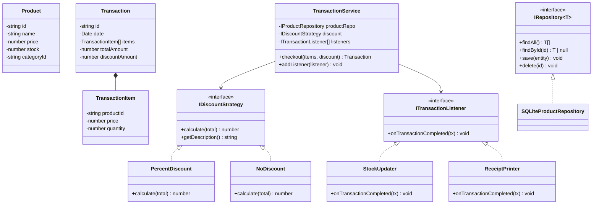

> **Mata Kuliah:** Pemrograman Berorientasi Objek
> **Minggu:** 15
> **Bagian:** Applied OOP
> **Bahasa:** TypeScript 5.x

---

## Capaian Pembelajaran Modul

Setelah mempelajari modul ini, mahasiswa mampu:
1. Mereview keseluruhan konsep mata kuliah dalam satu peta konsep terintegrasi
2. Memetakan konsep OOP TypeScript ke Java dan Dart
3. Memahami requirements dan deliverables capstone project
4. Merencanakan arsitektur capstone project (class diagram, ERD, pattern selection)

---

## Prasyarat

- **Modul 01–14**: Seluruh konsep OOP fundamental dan applied: class, encapsulation, inheritance, abstraction, polymorphism, generics, collections, SOLID principles, design patterns, database integration (SQLite), service layer, GUI (HTML/CSS/TS), full-stack architecture, dan studi kasus
- Pemahaman tentang layered architecture (Model -> Service -> Repository)
- Pengalaman menulis TypeScript dengan `strict: true`

---

## Daftar Isi

- [1. Pendahuluan](#1-pendahuluan)
- [2. Landasan Konsep](#2-landasan-konsep)
- [3. Implementasi dalam TypeScript](#3-implementasi-dalam-typescript)
- [4. Perbandingan Lintas Bahasa](#4-perbandingan-lintas-bahasa)
- [5. Studi Kasus: Capstone Architecture Design Session](#5-studi-kasus-capstone-architecture-design-session)
- [6. Kesalahan Umum & Best Practices](#6-kesalahan-umum--best-practices)
- [7. Ringkasan](#7-ringkasan)
- [8. Latihan Mandiri](#8-latihan-mandiri)

---

## 1. Pendahuluan

Selamat, kalian sudah menyelesaikan 14 minggu perjalanan mempelajari Pemrograman Berorientasi Objek! Dari paradigma dasar hingga full-stack architecture, dari `class` sederhana hingga design patterns yang kompleks. Sekarang saatnya **menyatukan semua potongan puzzle** tersebut menjadi gambaran utuh.

Modul ini bukan tentang konsep baru, melainkan **jembatan** antara pembelajaran dan penerapan nyata:

1. **Konsolidasi**: melihat seluruh materi dalam satu peta konsep terintegrasi
2. **Transfer**: memetakan konsep TypeScript ke Java dan Dart/Flutter
3. **Persiapan**: memahami requirements capstone dan merancang arsitekturnya

> 💡 **Insight:** Seorang developer yang baik tidak hanya bisa menulis kode, tetapi juga bisa **merancang** arsitektur sebelum menulis satu baris kode pun.

---

## 2. Landasan Konsep

### 2.1 Peta Konsep OOP: Seluruh Materi Minggu 1-14

Berikut adalah rangkuman seluruh topik yang telah dipelajari sepanjang semester:

| Minggu | Topik | Konsep Kunci |
|--------|-------|-------------|
| 1 | Setup & Paradigma | OOP vs Prosedural, 4 pilar OOP, TypeScript setup |
| 2 | Class, Object & Encapsulation | Class, constructor, access modifiers, getter/setter |
| 3 | Inheritance | `extends`, `super`, `override`, constructor chaining |
| 4 | Abstraction | Abstract class, interface, `implements` |
| 5 | Polymorphism & Generics | Type narrowing, generics, constraints |
| 6 | Collections | `Array<T>`, `Set<T>`, `Map<K,V>`, higher-order functions |
| 7 | Design Patterns & SOLID | 5 SOLID principles, 5 patterns overview |
| 9 | Database & Error Handling | SQLite, Repository pattern, custom errors |
| 10 | Service Layer | Layered architecture, DI, business logic |
| 11 | GUI Basics | HTML/CSS/TS, DOM manipulation, events |
| 12 | GUI Architecture | MVC, EventEmitter, Observer in GUI |
| 13 | Full Stack | Express API, fetch, `async`/`await` |
| 14 | Case Study | Strategy, Observer applied, collection reporting |

> 🔑 **Konsep Kunci:** Perhatikan bahwa setiap minggu tidak berdiri sendiri. Inheritance bergantung pada class, polymorphism bergantung pada inheritance dan interface, design patterns membutuhkan semua konsep sebelumnya, dan capstone project membutuhkan semuanya. OOP adalah bangunan yang dibangun **lapis demi lapis**.

### 2.2 Bagaimana Konsep Saling Terhubung

Semua konsep yang dipelajari membentuk satu ekosistem yang saling terkait. Berikut visualisasi koneksinya:



> 💡 **Insight:** Diagram di atas menunjukkan mengapa urutan pembelajaran penting. Setiap konsep membangun di atas konsep sebelumnya, tidak mungkin memahami design patterns tanpa polymorphism, tidak mungkin membangun full-stack tanpa service layer.

### 2.3 Mapping TypeScript -> Java -> Dart

OOP bersifat **language-agnostic**, konsepnya sama, hanya sintaksnya yang berbeda. Tabel berikut memetakan seluruh konsep yang telah dipelajari ke tiga bahasa:

| Konsep | Java | TypeScript | Dart (Flutter) |
|--------|------|------------|----------------|
| Class | `public class Foo {}` | `class Foo {}` | `class Foo {}` |
| Constructor | `public Foo(String n)` | `constructor(private n: string)` | `Foo(this.n)` |
| Private | `private int x;` | `private x: number;` | `int _x;` |
| Interface | `interface Foo {}` | `interface Foo {}` | `abstract class Foo {}` |
| Implements | `class A implements B` | `class A implements B` | `class A implements B` |
| Extends | `class A extends B` | `class A extends B` | `class A extends B` |
| Abstract | `abstract class Foo` | `abstract class Foo` | `abstract class Foo` |
| Override | `@Override` | `override` keyword | `@override` |
| Generics | `List<String>` | `Array<string>` | `List<String>` |
| Null safety | Optional | `strictNullChecks` | Sound null safety |
| Async | `CompletableFuture` | `async/await` | `async/await` |
| Module | `package` + `import` | `export` + `import` | `import 'package:...'` |
| Build tool | Maven/Gradle | npm | pub |
| DB Access | JDBC | better-sqlite3 | sqflite / drift |
| GUI | JavaFX | HTML/CSS/TS | Flutter widgets |
| List | `ArrayList<T>` | `Array<T>` / `T[]` | `List<T>` |
| Set | `HashSet<T>` | `Set<T>` | `Set<T>` |
| Map | `HashMap<K,V>` | `Map<K,V>` | `Map<K,V>` |
| Filter | `.stream().filter()` | `.filter()` | `.where()` |
| Transform | `.stream().map()` | `.map()` | `.map()` |
| Aggregate | `.stream().reduce()` | `.reduce()` | `.fold()` |
| Sort | `.stream().sorted()` | `.sort()` | `.sort()` |

> 🔄 **Perbandingan:** Perhatikan betapa miripnya ketiga bahasa tersebut. Perbedaan utama terletak pada: (1) Java memerlukan `public` eksplisit dan menggunakan Stream API untuk operasi koleksi, (2) Dart menggunakan underscore `_` untuk private dan `abstract class` sebagai pengganti `interface`, (3) TypeScript adalah satu-satunya yang memiliki structural typing.

### 2.4 Transisi ke Dart/Flutter

**Yang langsung transferable:** Class, inheritance, abstract class, polymorphism, design patterns, layered architecture, `async`/`await`, collection operations.

**Key differences:**

| Aspek | TypeScript | Dart |
|-------|-----------|------|
| Typing | Structural typing | Nominal typing (seperti Java) |
| Interface | `interface` keyword | Gunakan `abstract class` |
| Private | `private` keyword | Prefix underscore `_` |
| Null safety | Optional via `strictNullChecks` | Sound null safety bawaan |
| GUI | DOM / HTML / CSS | Flutter widget tree (deklaratif) |
| Package manager | npm | pub |

> 💡 **Insight:** Transisi terbesar bukan di sintaks OOP, melainkan di **paradigma GUI**. TypeScript menggunakan DOM manipulation, sedangkan Dart/Flutter menggunakan **widget tree** yang bersifat deklaratif. Namun, pattern seperti MVC dan Observer tetap berlaku.

### 2.5 Capstone Project: Requirements & Deliverables

Capstone project adalah puncak dari mata kuliah ini, membangun aplikasi utuh yang mendemonstrasikan penguasaan seluruh konsep OOP. Tema: Mini POS, Perpustakaan, Inventaris, atau Akademik.

#### Persyaratan Teknis

| No | Requirement | Detail |
|----|-------------|--------|
| 1 | TypeScript strict mode | `strict: true` di `tsconfig.json` |
| 2 | Minimal 5 class | Dengan proper encapsulation (private fields, getter/setter) |
| 3 | Minimal 1 abstract class | Dan minimal 2 interface |
| 4 | Minimal 3 design patterns | **Wajib:** Repository + 2 lainnya (Strategy, Observer, Factory, Singleton, dll.) |
| 5 | Collection operations | Untuk reporting dan/atau filtering data |
| 6 | Database integration | SQLite via better-sqlite3 |
| 7 | GUI | HTML/CSS/TS (browser-based) |
| 8 | Layered architecture | Model -> Service -> Repository |
| 9 | Error handling | Custom error classes, try/catch yang terstruktur |

#### Deliverables

| Deliverable | Keterangan |
|-------------|-----------|
| **Source code** | Git repository yang terorganisir |
| **Class diagram** | Mermaid atau draw.io, menunjukkan relasi antar class |
| **ERD** | Entity-Relationship Diagram untuk schema database |
| **README** | Setup instructions, deskripsi project, cara menjalankan |
| **Live demo** | Presentasi dan demo aplikasi berjalan di Minggu 16 |

#### Penilaian Capstone

| Komponen | Bobot |
|----------|-------|
| Fungsionalitas | 15% |
| Kualitas OOP & Patterns | 15% |
| Arsitektur | 10% |
| Live demo | 8% |
| Q&A teknis | 7% |

> ⚠️ **Perhatian:** Penilaian bukan hanya tentang "aplikasi berjalan". Dosen akan melihat **kualitas kode** dan kemampuan menjelaskan keputusan desain. Aplikasi sederhana dengan arsitektur rapi lebih baik daripada aplikasi kompleks dengan kode berantakan.

---

## 3. Implementasi dalam TypeScript

### 3.1 Capstone Architecture Planning Exercise

Langkah pertama dalam membangun capstone bukan menulis kode, melainkan **merencanakan arsitektur**. Berikut proses perencanaan yang terstruktur.

**Langkah 1: Identifikasi Entities** -- Apa saja "benda" dalam domain? (Product, Category, Transaction, TransactionItem, User)

**Langkah 2: Identifikasi Interfaces** -- Abstraksi apa yang dibutuhkan? (`IRepository<T>`, `IDiscountStrategy`, `ITransactionListener`)

**Langkah 3: Identifikasi Patterns** -- Untuk setiap fitur, tentukan pattern yang paling cocok:

| Fitur | Pattern | Alasan |
|-------|---------|--------|
| Akses data (CRUD) | **Repository** | Memisahkan logika data dari bisnis |
| Kalkulasi diskon | **Strategy** | Diskon bisa bermacam-macam dan bisa ditukar |
| Notifikasi (stok habis, transaksi selesai) | **Observer** | Multiple listener tanpa coupling |
| Pembuatan objek kompleks (Transaction) | **Factory** | Validasi dan setup saat pembuatan objek |
| Konfigurasi aplikasi | **Singleton** | Satu instance config untuk seluruh app |
| Alur proses checkout | **Template Method** | Langkah-langkah tetap, detail bisa bervariasi |

> 🔑 **Konsep Kunci:** Tidak perlu memaksakan semua pattern. Pilih pattern yang **menyelesaikan masalah nyata** dalam project kalian. Minimal 3 pattern (wajib Repository + 2 lainnya), tetapi jangan menambahkan pattern hanya demi memenuhi jumlah.

### 3.2 Class Diagram Design Exercise

Class diagram adalah blueprint dari arsitektur OOP. Langkah-langkah membuatnya:

1. **Identifikasi class**: setiap entity menjadi satu class
2. **Tambahkan atribut**: tandai private (`-`) dan public (`+`)
3. **Tambahkan method**: getter, setter, dan business method
4. **Gambar relasi**: gunakan simbol yang tepat

**Cara membaca relasi dalam class diagram:**

| Simbol | Arti | Contoh |
|--------|------|--------|
| `<\|..` | Implements (interface) | `ProductRepository` implements `IRepository` |
| `<\|--` | Extends (inheritance) | Subclass extends superclass |
| `-->` | Dependency / uses | `TransactionService` uses `ProductRepository` |
| `*--` | Composition (bagian yang tidak bisa berdiri sendiri) | `Transaction` memiliki `TransactionItem` |
| `o--` | Aggregation (bagian yang bisa berdiri sendiri) | `Product` terkait `Category` |

> 💡 **Insight:** Class diagram tidak perlu sempurna dari awal. Mulailah dengan entitas utama, tambahkan relasi, lalu refinasi seiring pengembangan. Diagram adalah **living document** yang berkembang bersama kode. Lihat contoh lengkap di [Bagian 5.4](#54-class-diagram).

### 3.3 ERD Design Exercise

Entity-Relationship Diagram menggambarkan struktur database. Setiap entity di class diagram biasanya memiliki tabel yang bersesuaian.

**Checklist ERD untuk capstone:**

- [ ] Setiap entity memiliki primary key (`PK`)
- [ ] Relasi antar tabel menggunakan foreign key (`FK`)
- [ ] Tipe data sudah sesuai (TEXT, INTEGER, REAL untuk SQLite)
- [ ] Normalisasi minimal: tidak ada data yang duplikat di banyak tabel
- [ ] Relasi one-to-many dan many-to-many sudah benar

Lihat contoh ERD lengkap di [Bagian 5.5](#55-erd).

> ⚠️ **Perhatian:** SQLite hanya mendukung tipe data sederhana: TEXT, INTEGER, REAL, BLOB, NULL. Gunakan TEXT untuk menyimpan ID (UUID) dan tanggal (ISO string). Jangan gunakan tipe yang tidak didukung SQLite seperti VARCHAR(255) atau DATETIME.

### 3.4 Pattern Selection untuk Capstone

Berikut decision matrix untuk membantu memilih pattern yang tepat berdasarkan fitur yang dibutuhkan:

| Kebutuhan Fitur | Pattern yang Cocok | Contoh Penerapan |
|-----------------|-------------------|-----------------|
| Simpan/ambil data dari database | **Repository** (wajib) | `ProductRepository`, `TransactionRepository` |
| Algoritma yang bisa bervariasi | **Strategy** | Diskon, sorting, filter, format laporan |
| Notifikasi saat event terjadi | **Observer** | Stok rendah, transaksi selesai, error logging |
| Pembuatan objek yang perlu validasi | **Factory** | Membuat `Transaction`, membuat `User` |
| Konfigurasi / koneksi global | **Singleton** | Database connection, app config |
| Alur proses dengan langkah tetap | **Template Method** | Checkout process, report generation |

**Rekomendasi kombinasi pattern:**

| Set | Patterns (Repository +) | Cocok Untuk |
|-----|------------------------|-------------|
| A | Strategy + Observer | POS, Library (variasi logika + event) |
| B | Factory + Singleton | Inventaris (CRUD + pembuatan objek) |
| C | Observer + Template Method | Akademik (event-driven + alur proses tetap) |

> 🔑 **Konsep Kunci:** Saat presentasi, dosen akan bertanya: "Mengapa kamu memilih Strategy?" Jawaban yang baik: "Karena ada 3 jenis diskon yang bisa dipilih kasir." Jawaban yang buruk: "Karena di silabus diminta minimal 3 pattern."

---

## 4. Perbandingan Lintas Bahasa

Mapping lengkap sudah dibahas di [Bagian 2.3](#23-mapping-typescript---java---dart). Di bagian ini, kita akan melihat contoh praktis **side-by-side** untuk membantu transisi.

### Transisi dari TypeScript ke Dart: Contoh Praktis

**Contoh 1: Class + Interface + Strategy Pattern**

```typescript
// === TypeScript ===
interface DiscountStrategy {
  calculate(total: number): number;
}

class PercentDiscount implements DiscountStrategy {
  constructor(private percent: number) {}

  calculate(total: number): number {
    return total * (1 - this.percent / 100);
  }
}
```

```dart
// === Dart ===
abstract class DiscountStrategy {          // interface → abstract class
  double calculate(double total);
}

class PercentDiscount implements DiscountStrategy {
  final double _percent;                   // private → underscore prefix
  PercentDiscount(this._percent);          // shorthand constructor

  @override                                // @override annotation
  double calculate(double total) {
    return total * (1 - _percent / 100);
  }
}
```

> 🔄 **Perbandingan:** Dart menggunakan `abstract class` sebagai pengganti `interface`, underscore `_` untuk private, dan `@override` annotation. Konsep pattern-nya identik.

**Contoh 2: Collection Operations**

```typescript
// === TypeScript ===
const products: Product[] = getProducts();
const expensive = products.filter((p) => p.getPrice() > 50000);
const total = products.reduce((sum, p) => sum + p.getPrice(), 0);
const sorted = [...products].sort((a, b) => a.getName().localeCompare(b.getName()));
const names = products.map((p) => p.getName());
```

```dart
// === Dart ===
List<Product> products = getProducts();
var expensive = products.where((p) => p.price > 50000).toList();   // filter → where
var total = products.fold<double>(0, (sum, p) => sum + p.price);   // reduce → fold
var sorted = [...products]..sort((a, b) => a.name.compareTo(b.name));
var names = products.map((p) => p.name).toList();                   // perlu .toList()
```

> 🔄 **Perbandingan:** Perbedaan utama: `.filter()` menjadi `.where()`, `.reduce()` menjadi `.fold()`, dan hasil `.map()` / `.where()` di Dart perlu `.toList()` karena mengembalikan `Iterable`.

---

## 5. Studi Kasus: Capstone Architecture Design Session

### 5.1 Skenario: Mini POS System

Kalian diminta membangun sebuah **Mini POS (Point of Sale) System** untuk toko kecil. Berikut requirements-nya:

**Fitur Utama:**
1. Manajemen Produk, CRUD produk, kategori, dan stok
2. Transaksi Penjualan, kasir memilih produk, tentukan quantity, apply diskon
3. Laporan, laporan penjualan harian, produk terlaris, stok rendah
4. Manajemen User, login kasir/admin

**Persyaratan Teknis:**
- TypeScript `strict: true`
- SQLite database
- HTML/CSS/TS GUI
- Layered architecture

### 5.2 Identifikasi Class dan Interface

Berdasarkan requirements di atas, identifikasi komponen per layer:

| Layer | Class / Interface | Keterangan |
|-------|-------------------|-----------|
| **Model** | `Product`, `Category`, `Transaction`, `TransactionItem`, `User` | 5 entity utama |
| **Interface** | `IRepository<T>`, `IProductRepository`, `IDiscountStrategy`, `ITransactionListener` | Abstraksi untuk pattern |
| **Service** | `ProductService`, `TransactionService`, `ReportService` | Business logic |
| **Repository** | `SQLiteProductRepository`, `SQLiteTransactionRepository`, `SQLiteUserRepository` | Data access |
| **Pattern** | Repository (data), Strategy (diskon), Observer (notifikasi), Singleton (DB connection) | 4 patterns |

### 5.3 Architecture Diagram



### 5.4 Class Diagram



### 5.5 ERD

| Tabel | Kolom Utama | Relasi |
|-------|-------------|--------|
| `categories` | id (PK), name | 1:N -> products |
| `products` | id (PK), name, price, stock, category_id (FK) | 1:N -> transaction_items |
| `transactions` | id (PK), date, total_amount, discount_amount, cashier_id (FK) | 1:N -> transaction_items |
| `transaction_items` | id (PK), transaction_id (FK), product_id (FK), price, quantity, subtotal | - |
| `users` | id (PK), username, password_hash, role | 1:N -> transactions |

### 5.6 Pattern Mapping

| Komponen | Pattern | Alasan |
|----------|---------|--------|
| `SQLiteProductRepo`, `SQLiteTransactionRepo` | **Repository** | Memisahkan akses data dari business logic |
| `PercentDiscount`, `NoDiscount` | **Strategy** | Jenis diskon bisa dipilih dan ditambah tanpa ubah service |
| `StockUpdater`, `ReceiptPrinter` | **Observer** | Aksi post-transaksi bisa ditambah tanpa ubah checkout |
| `DatabaseConnection` | **Singleton** | Koneksi database satu instance, konsisten |

> 💡 **Insight:** Seluruh design exercise ini tidak melibatkan satu baris kode implementasi pun. Kemampuan **merancang arsitektur** sebelum menulis kode adalah skill yang sangat dihargai di industri.

---

## 6. Kesalahan Umum & Best Practices

### Kesalahan dalam Perencanaan Capstone

| Kesalahan | Solusi |
|-----------|--------|
| Langsung coding tanpa planning | Buat class diagram dan ERD dulu |
| Terlalu banyak fitur (tidak selesai) | Fokus pada MVP (Minimum Viable Product) |
| Memaksakan pattern yang tidak perlu | Pilih pattern berdasarkan masalah nyata |
| Mengabaikan error handling (crash saat demo) | Tambahkan try/catch dari awal |
| Tidak menggunakan Git | `git init` di awal, commit berkala |
| Hardcode data | Gunakan database dari awal |

### Best Practices untuk Capstone

**1. Mulai dari Model, bukan GUI**

```
Urutan pengerjaan yang direkomendasikan:
1. Model classes (entity)          → "Apa datanya?"
2. Repository interfaces + impl   → "Bagaimana data disimpan?"
3. Service layer                   → "Apa business logic-nya?"
4. GUI / Presentation              → "Bagaimana user berinteraksi?"
```

**2. Gunakan Git dari Awal** -- `git init` di awal project, commit setiap fitur selesai (`feat: add product CRUD`), dan setiap milestone.

**3. Prioritaskan Requirements**

| Prioritas | Fitur | Alasan |
|-----------|-------|--------|
| **P0** (Wajib) | CRUD utama + database | Fungsionalitas dasar harus ada |
| **P0** (Wajib) | 3 design patterns | Requirement minimal capstone |
| **P0** (Wajib) | Layered architecture | Requirement arsitektur |
| **P1** (Penting) | Error handling | Mencegah crash saat demo |
| **P1** (Penting) | GUI yang fungsional | Dibutuhkan untuk live demo |
| **P2** (Nice to have) | Laporan / statistik | Menunjukkan collection operations |
| **P2** (Nice to have) | Fitur tambahan | Auth, search, dll. |

> ⚠️ **Perhatian:** Jangan terjebak dalam "perfeksionisme". Lebih baik memiliki aplikasi sederhana yang **berjalan sempurna** dengan arsitektur rapi, daripada aplikasi ambius yang **setengah jadi** dan kodenya berantakan.

---

## 7. Ringkasan

- **Peta Konsep OOP**: Seluruh materi Minggu 1-14 membentuk ekosistem yang saling terkait. Setiap konsep membangun di atas konsep sebelumnya.
- **Language-Agnostic**: Konsep OOP yang dipelajari di TypeScript langsung bisa diterapkan di Java dan Dart/Flutter. Perbedaan utama hanya sintaks.
- **Transisi ke Dart**: Semua konsep OOP transferable. Perbedaan terbesar: paradigma GUI (DOM vs widget tree) dan nama method collection (`.filter()` vs `.where()`, `.reduce()` vs `.fold()`).
- **Capstone Requirements**: Min 5 class, 1 abstract class, 2 interface, 3 design patterns (Repository + 2), SQLite, GUI, layered architecture, error handling.
- **Architecture First**: Rancang class diagram dan ERD sebelum menulis kode. Pilih pattern berdasarkan masalah nyata.
- **Deliverables**: Source code (Git), class diagram, ERD, README, live demo. Kualitas kode dan kemampuan menjelaskan keputusan desain sama pentingnya dengan fungsionalitas.

---

## 8. Latihan Mandiri

### Latihan 1: Peta Konsep Pribadi

Buatlah **peta konsep** (mind map atau diagram) yang menghubungkan seluruh konsep OOP yang telah dipelajari. Untuk setiap konsep, tuliskan:
- Definisi singkat (1 kalimat)
- Contoh kode minimal (1-3 baris)
- Hubungannya ke konsep lain

Format bebas: bisa di kertas, Mermaid, draw.io, atau tool mind map lainnya.

### Latihan 2: Pilih dan Rancang Capstone

Pilih salah satu tema capstone berikut (atau ajukan tema sendiri ke dosen):
- Mini POS System
- Sistem Manajemen Perpustakaan
- Aplikasi Inventaris Barang
- Sistem Informasi Akademik Sederhana

Untuk tema yang dipilih, buat:
1. **Daftar fitur**: minimal 4 fitur utama
2. **Daftar class**: minimal 5 class dengan atribut dan method
3. **Class diagram**: menggunakan Mermaid atau draw.io
4. **ERD**: struktur tabel database
5. **Pattern mapping**: tabel yang menjelaskan pattern apa untuk fitur apa, dan mengapa

### Latihan 3: TypeScript ke Dart

Terjemahkan kode TypeScript berikut ke Dart. Perhatikan perbedaan sintaks untuk interface, private, dan collection operations.

```typescript
interface ISearchStrategy {
  search(items: { name: string; price: number }[], query: string): { name: string; price: number }[];
}

class SearchByName implements ISearchStrategy {
  search(items: { name: string; price: number }[], query: string): { name: string; price: number }[] {
    return items.filter((item) => item.name.toLowerCase().includes(query.toLowerCase()));
  }
}

class ProductCatalog {
  private products: { name: string; price: number }[] = [];
  private strategy: ISearchStrategy;

  constructor(strategy: ISearchStrategy) {
    this.strategy = strategy;
  }

  addProduct(name: string, price: number): void {
    this.products.push({ name, price });
  }

  search(query: string): { name: string; price: number }[] {
    return this.strategy.search(this.products, query);
  }

  getExpensive(minPrice: number): { name: string; price: number }[] {
    return this.products.filter((p) => p.price >= minPrice).sort((a, b) => b.price - a.price);
  }

  getTotalValue(): number {
    return this.products.reduce((sum, p) => sum + p.price, 0);
  }
}
```

### Latihan 4: Persiapan Presentasi

Siapkan jawaban untuk pertanyaan berikut (tipe pertanyaan Q&A capstone):

1. **"Jelaskan arsitektur aplikasi kamu."**: Layer-layer dan tanggung jawab masing-masing.
2. **"Mengapa kamu memilih pattern X?"**: Masalah nyata yang diselesaikan.
3. **"Tunjukkan data flow dari UI ke database."**: Trace satu operasi end-to-end.
4. **"Apa trade-off dari keputusan desain kamu?"**: Pro dan kontra setiap pilihan.

---

## Referensi & Bacaan Lanjutan

- TypeScript Handbook, Classes: https://www.typescriptlang.org/docs/handbook/2/classes.html
- Refactoring Guru, Design Patterns: https://refactoring.guru/design-patterns
- Dart Language Tour: https://dart.dev/language
- Flutter Documentation: https://docs.flutter.dev/
- Martin, R. C. (2008). *Clean Architecture*. Prentice Hall.
- Freeman, E., & Robson, E. (2020). *Head First Design Patterns* (2nd ed.). O'Reilly Media.
