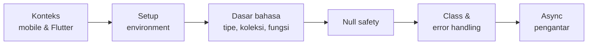

<!-- _class: title -->
<!-- _paginate: false -->

# Pertemuan 1
## Introduction to Mobile Development & Dart Fundamentals

Paradigma mobile · Ekosistem Flutter · Setup · Dasar bahasa Dart

**Sub-CPMK53.1** — menguasai fundamental Dart dan Flutter untuk aplikasi mobile dasar
Bacaan: modul-buku bab 1 · Praktikum: `starter-code/p01-hello-flutter`

<div class="pengajar">

**Fahri Firdausillah, S.Kom, M.CS**
Teknik Informatika — Universitas Dian Nuswantoro

</div>

---

## Setelah pertemuan ini, Anda bisa

1. **Menjelaskan apa yang membuat mobile berbeda dari web**, dan di mana posisi Flutter di antara pendekatan lain.
2. **Menyiapkan environment** dan menjalankan proyek Flutter pertama.
3. **Menulis program Dart** dengan tipe data, koleksi, dan fungsi.
4. **Menerapkan null safety**: tipe nullable, `?.`, `??`, dan `late`.
5. **Membuat class sederhana** untuk pemodelan data.
6. **Menangani error** dan mengenal `Future` serta `async`/`await`.

<div class="note">

Dua pertemuan pertama sengaja **belum menyentuh UI**. Kita membangun bahasanya dulu lewat contoh berbasis teks, supaya saat masuk widget di pertemuan 3 tidak ada dua hal baru sekaligus.

</div>

---

## Peta perjalanan hari ini



Semua contoh bisa dicoba **tanpa menginstal apa pun** lewat DartPad
(<https://dartpad.dev>), atau lewat Dart SDK di terminal.

---

<!-- _class: section-break -->

# 1 · Konteks

Kenapa mobile, kenapa Flutter

---

## Apa yang membuat mobile berbeda dari web

Perbedaannya bukan sekadar ukuran layar — ia mengubah cara kita menulis kode:

- **Sumber daya terbatas.** Aplikasi berjalan langsung di perangkat: baterai, memori, dan CPU yang bisa menurun performanya saat panas.
- **Interaksi berbasis sentuhan**, bukan mouse. Elemen UI harus lebih besar dan responsnya instan — tidak ada hover, tidak ada presisi kursor.
- **Jaringan tidak bisa diandalkan.** Aplikasi harus tetap berfungsi saat sinyal hilang. Ini alasan bab 8 dan 10 membahas penyimpanan lokal dan offline-first.
- **Distribusi lewat app store** dengan proses review — rilis tidak semudah `git push`.

<div class="note">

Keempat hal ini akan terus muncul sebagai alasan di balik keputusan teknis sepanjang semester. Saat nanti kita repot-repot menyimpan data lokal atau mengoptimalkan rebuild, sumbernya ada di daftar ini.

</div>

---

## Di mana posisi Flutter

| Pendekatan | Karakteristik utama |
|---|---|
| **Native** (Kotlin/Swift) | Performa dan akses platform terbaik, tetapi kode terpisah per platform |
| **React Native** | Satu basis kode JavaScript, UI dari komponen native, komunikasi lewat bridge |
| **Flutter** | Satu basis kode Dart, UI digambar sendiri oleh engine sehingga konsisten lintas platform |

Flutter dipakai secara publik pada Google Ads, BMW, dan Nubank.

<div class="ok">

Untuk mata kuliah ini yang terpenting tiga hal: **satu bahasa** (Dart), **satu basis kode** untuk Android dan iOS, dan **UI yang konsisten** di kedua platform.

</div>

---

## Dua mode kompilasi, satu alasan

Flutter mengompilasi Dart dengan dua cara berbeda, dan itu bukan detail sepele:

- **JIT** (*Just-In-Time*) saat pengembangan — memungkinkan **hot reload**: ubah kode, simpan, tampilan berubah dalam hitungan detik tanpa kehilangan state.
- **AOT** (*Ahead-Of-Time*) untuk aplikasi rilis — Dart dikompilasi langsung ke kode native, sehingga performanya setara aplikasi native.

<div class="ok">

Anda mendapat **kecepatan iterasi** saat menulis kode dan **kecepatan eksekusi** saat pengguna memakainya. Ini salah satu alasan utama memilih Flutter.

</div>

Sisanya tentang Flutter — instalasi, struktur proyek, hingga widget — dibahas di
pertemuan 3 dan 4. Hari ini dan pertemuan 2 fokus pada bahasanya.

---

## Praktikum: menyiapkan environment

Urutan yang akan kita kerjakan di lab:

```bash
# 1. Verifikasi instalasi — baca SEMUA baris outputnya
flutter doctor -v

# 2. Proyek pertama
flutter create study_tracker
cd study_tracker

# 3. Jalankan di emulator atau perangkat
flutter run
```

<div class="warn">

**`flutter doctor` adalah alat diagnosis, bukan formalitas.** Centang hijau yang
Anda lewati hari ini akan jadi error yang membingungkan di pertemuan 4. Baca tiap
baris; yang bertanda ✗ atau ! selesaikan sekarang, jangan ditunda.

</div>

---

<!-- _class: section-break -->

# 2 · Dasar Bahasa Dart

Tipe, koleksi, fungsi

---

## Program Dart pertama

```dart
void main() {
  print('Halo, Dart!');
}
```

```bash
dart run hello.dart
```

Setiap program Dart memulai eksekusi dari fungsi `main`. Fungsi `print` menulis ke
stdout. Itu sudah cukup untuk seluruh contoh hari ini — fokus kita **bahasa**,
bukan UI.

<div class="note">

Dart bertipe statis: setiap variabel punya tipe, dan kesalahan tipe tertangkap
**saat kompilasi**, bukan saat aplikasi sudah berjalan di tangan pengguna.

</div>

---

## `var`, `final`, `const`

```dart
var title = 'Belajar Dart';   // String  — tipe disimpulkan compiler
var count = 42;               // int
var price = 19.99;            // double
var isActive = false;         // bool

String name = 'Kaqfa';        // tipe eksplisit, berguna untuk API publik

final today = DateTime.now(); // tidak bisa di-reassign setelah diisi
const pi = 3.14159;           // konstanta yang sudah diketahui saat kompilasi
```

**Aturan praktisnya:**

| Pakai | Untuk |
|---|---|
| `var` | Variabel lokal biasa |
| `final` | Nilai yang dihitung saat runtime tetapi tidak berubah |
| `const` | Nilai yang sudah diketahui saat kompilasi |

---

## String dan konversi tipe

```dart
void main() {
  var item = 'kopi';
  var qty = 2;
  print('$qty porsi ${item.toUpperCase()}'); // 2 porsi KOPI
}
```

Interpolasi memakai `$nama` untuk variabel sederhana dan `${ekspresi}` untuk yang
lebih panjang. **Konversi antar tipe selalu eksplisit:**

```dart
var input = '25';
int age = int.parse(input);          // String -> int, error bila bukan angka
int? maybe = int.tryParse(input);    // null bila bukan angka
String s = age.toString();
```

<div class="warn">

Ini beda penting dari **PHP dan JavaScript** yang sering mengonversi secara
implisit. Di Dart, `'25' + 1` tidak berjalan — dan itu sengaja.

</div>

---

## Hindari `dynamic`

Tipe `dynamic` **menonaktifkan pemeriksaan tipe**. Error tipe yang seharusnya
tertangkap compiler baru muncul saat runtime — persis kerugian yang membuat kita
memilih bahasa bertipe statis.

```dart
dynamic x = 'teks';
print(x.length);        // lolos compiler
print(x.panjangnya);    // juga lolos compiler — crash saat dijalankan
```

**Kapan `dynamic` wajar?** Hanya saat berurusan dengan data yang bentuknya benar-benar
belum pasti, misalnya JSON yang baru diterima dari jaringan dan belum diurai.

<div class="ok">

Bahkan di kasus itu, langkah berikutnya tetap sama: **segera ubah ke class atau
tipe eksplisit**. Pola `fromJson` di pertemuan 2 melakukan tepat itu.

</div>

---

<!-- _class: code-dense -->

## Koleksi: List, Map, Set

```dart
void main() {
  // List — urutan, boleh duplikat
  var skills = <String>['Dart', 'Flutter'];
  skills.add('SQLite');
  print(skills[0]);       // Dart
  print(skills.length);   // 3

  // Map — pasangan kunci-nilai
  var scores = <String, int>{
    'Dart': 90,
    'Flutter': 85,
  };
  scores['SQLite'] = 88;
  print(scores['Dart']);  // 90

  // Set — nilai unik, duplikat otomatis hilang
  var tags = ['dart', 'flutter', 'dart'].toSet();
  print(tags);            // {dart, flutter}
}
```

Ketiganya **generik**: dengan menulis `<String>` atau `<String, int>`, compiler tahu
tipe isinya dan bisa menolak kesalahan sejak awal.

---

## Mengubah koleksi: `where`, `map`, `toList`

```dart
void main() {
  var tasks = ['belajar dart', 'beli kopi', 'kerjakan tugas'];

  var long = tasks.where((t) => t.length > 10).toList();
  var upper = tasks.map((t) => t.toUpperCase()).toList();

  print(long);   // [belajar dart, kerjakan tugas]
  print(upper);  // [BELAJAR DART, BELI KOPI, KERJAKAN TUGAS]

  for (final task in tasks) {
    print('- $task');
  }
}
```

<div class="ok">

**Hafalkan pola `where`/`map`/`toList` ini.** Ia muncul berulang kali sepanjang
semester — menyaring daftar tugas, mengubah baris database jadi objek, memetakan
data jadi widget. `toList()` diperlukan karena `where` dan `map` mengembalikan
`Iterable` yang malas, bukan `List` jadi.

</div>

---

## Fungsi: parameter posisi dan bernama

```dart
int add(int a, int b) => a + b;                    // parameter posisi

void greet({required String name, String greeting = 'Halo'}) {
  print('$greeting, $name!');                      // parameter bernama
}

double half(int n) => n / 2;                       // arrow syntax

void main() {
  print(add(20, 4));                    // 24
  greet(name: 'Kaqfa');                 // Halo, Kaqfa!
  greet(name: 'Budi', greeting: 'Selamat pagi');
}
```

**Parameter bernama adalah cara idiomatis Dart** untuk membuat panggilan fungsi
jelas. Bandingkan `Task('t-1', 'Belajar', true, null)` dengan
`Task(id: 't-1', title: 'Belajar', done: true)` — yang kedua terbaca tanpa perlu
membuka definisinya.

---

## Fungsi adalah nilai

Fungsi bisa disimpan di variabel, dikirim sebagai argumen, dan dikembalikan dari
fungsi lain:

```dart
bool isLong(String s) => s.length > 10;

void main() {
  var tasks = ['belajar dart', 'beli kopi', 'kerjakan tugas'];

  // isLong dipakai sebagai argumen, bukan dipanggil —
  // perhatikan: tidak ada tanda kurung di belakangnya
  var long = tasks.where(isLong).toList();
  print(long);   // [belajar dart, kerjakan tugas]
}
```

<div class="ok">

Pola ini disebut **higher-order function**, dan ia adalah dasar gaya pemrograman
yang dipakai Flutter. Saat nanti Anda menulis `onPressed: () => _simpan()` atau
`itemBuilder: (context, index) => ...`, Anda sedang memakai hal yang sama.

</div>

---

<!-- _class: section-break -->

# 3 · Null Safety

Menghapus satu kelas bug sepenuhnya

---

## Default: tidak boleh null

Di Dart, tipe secara default **tidak boleh `null`**. Variabel bertipe `String`
dijamin berisi string. Kalau bisa kosong, Anda harus menuliskannya eksplisit
sebagai `String?`, dan compiler memaksa Anda menanganinya sebelum mengakses nilainya.

```dart
void main() {
  String title = 'Bab 1';             // tidak mungkin null
  String? nickname = lookupName();    // bertipe String?, bisa null

  // print(nickname.length);          // ERROR: compiler menolak
  print(nickname?.length);            // null bila nickname null
  print(nickname?.length ?? 0);       // 0 sebagai nilai pengganti
  print(title.length);                // 5 — aman tanpa pemeriksaan
}
```

<div class="ok">

Ini **menghilangkan seluruh kelas error "null reference"** saat runtime — penyebab
crash aplikasi yang paling sering. Bukan mengurangi: menghilangkan, karena
compiler yang menjaganya.

</div>

---

## Empat alat null safety

| Alat | Arti |
|---|---|
| `Type?` | Menyatakan nilai boleh null |
| `?.` | Akses anggota hanya bila tidak null; hasilnya null bila nilainya null |
| `??` | Memberi nilai pengganti bila sisi kiri null |
| `!` | Asersi bahwa nilai tidak null |

<div class="warn">

**`!` bukan jalan pintas.** Memakainya pada nilai yang ternyata null tetap melempar
error saat runtime — persis bug yang ingin kita hindari. Pakai hanya saat Anda
benar-benar yakin, dan sependek mungkin.

</div>

---

## Dua pola yang dipakai sehari-hari

```dart
String? lookup(String key) => key.isEmpty ? null : key;

void main() {
  String? middleName = lookup('Aji');

  // Pola 1: cek dulu, lalu akses langsung
  if (middleName != null) {
    print(middleName.length);   // 3 — aman, tanpa perlu `!`
  }

  // Pola 2: beri nilai pengganti
  String? backup = lookup('');
  print(backup ?? '-');         // -
}
```

Setelah pengecekan `!= null`, **compiler otomatis mempersempit tipe** dari `String?`
menjadi `String` di dalam blok itu. Inilah sebabnya Anda jarang benar-benar
membutuhkan `!`.

---

## `late`: janji yang ditagih saat runtime

Untuk field yang baru diisi belakangan tetapi dijamin terisi sebelum dibaca:

```dart
class Profile {
  late final String token;   // diisi sekali saat login, bukan di konstruktor
}
```

`late` **menunda pemeriksaan ke runtime**: membaca field `late` yang belum pernah
diisi akan melempar error.

<div class="warn">

**Jangan gunakan `late` hanya untuk menghindari error compiler.** Kalau nilainya
memang bisa null sungguhan, `String?` adalah jawaban yang jujur — dan compiler
akan membantu Anda menanganinya. `late` yang dipakai asal-asalan hanya memindahkan
crash dari waktu kompilasi ke tangan pengguna.

</div>

---

<!-- _class: section-break -->

# 4 · Class & Error Handling

Pemodelan data dan kegagalan

---

<!-- _class: code-dense -->

## Class untuk pemodelan data

Ini versi sederhana dari model `Task` yang akan kita pakai sepanjang semester:

```dart
class Task {
  final String id;
  final String title;
  final bool done;
  final DateTime? dueDate;      // bisa null: tidak semua tugas punya tenggat

  const Task({
    required this.id,
    required this.title,
    this.done = false,
    this.dueDate,
  });

  bool get isOverdue {                          // getter: dihitung, tidak disimpan
    if (dueDate == null || done) return false;
    return DateTime.now().isAfter(dueDate!);
  }

  Task copyWith({String? title, bool? done}) {  // salinan dengan perubahan
    return Task(
      id: id,
      title: title ?? this.title,
      done: done ?? this.done,
      dueDate: dueDate,
    );
  }
}
```

---

## Lima hal dari class `Task`

- **Parameter bernama `required`** membuat konstruktor mudah dibaca **pada pemanggilan**, bukan cuma pada definisi.
- **Konstruktor `const`** bisa dipakai bila semua field-nya `final` dan nilainya konstanta kompilasi; Dart lalu berbagi satu instance untuk nilai yang sama.
- **Awalan underscore** (`_nama`) membuat anggota privat terhadap *file*, bukan terhadap class — ini berbeda dari Java dan C#.
- **Getter** (`isOverdue`) menghitung nilai tanpa menyimpannya, sehingga tidak mungkin basi.
- **Pola `copyWith`** membuat salinan dengan beberapa perubahan, karena field `final` tidak bisa diubah langsung.

<div class="ok">

`copyWith` akan terasa bertele-tele sekarang, dan terasa masuk akal di pertemuan 3.
Saat state berubah lewat `setState`, mengganti objek jauh lebih aman daripada
memutasinya — tidak ada kode lain yang bisa mengubah objek lama diam-diam.

</div>

---

## Abstraksi: kontrak tanpa implementasi

```dart
abstract class Storage {
  Future<void> save(String key, String value);
  Future<String?> read(String key);
}

class MemoryStorage implements Storage {
  final _data = <String, String>{};

  @override
  Future<void> save(String key, String value) async => _data[key] = value;

  @override
  Future<String?> read(String key) async => _data[key];
}
```

- `abstract class` mendefinisikan **kontrak** tanpa implementasi.
- `implements` mewajibkan class mengimplementasikan semua anggotanya; `extends` **mewarisi** implementasi yang sudah ada.
- `@override` menandai anggota yang ditimpa — compiler memverifikasinya.

Untuk nilai tetap yang terbatas, gunakan `enum`: `enum Priority { low, medium, high }`

---

## Error handling: `try` / `on` / `catch` / `finally`

```dart
void main() {
  try {
    print(int.parse('dua puluh'));       // melempar FormatException
  } on FormatException catch (e) {
    print('Input bukan angka: ${e.message}');
  } catch (e) {
    print('Error tak terduga: $e');
  } finally {
    print('Selesai.');                   // selalu berjalan
  }
}
```

- `on TipeTertentu` menangkap exception **tipe itu saja**; `catch (e)` menangkap sisanya.
- Blok `finally` **selalu** berjalan — cocok untuk pembersihan sumber daya.
- Bila handler setempat tidak sanggup menangani, `rethrow` melempar kembali ke handler di atasnya.

---

## Exception untuk error domain aplikasi

`throw` bisa melempar objek apa pun, tetapi kebiasaan yang baik adalah membuat
subclass `Exception` sendiri:

```dart
class ValidationError implements Exception {
  final String message;
  ValidationError(this.message);

  @override
  String toString() => 'ValidationError: $message';
}

void setAge(int age) {
  if (age < 0) throw ValidationError('Umur tidak boleh negatif');
}
```

<div class="note">

Untuk argumen fungsi yang salah, Dart sudah menyediakan `ArgumentError` dan
`ArgumentError.value` — pakai yang sudah ada sebelum membuat tipe baru. Buat tipe
sendiri saat errornya punya **makna domain**, seperti "tugas ini sudah selesai".

</div>

---

<!-- _class: section-break -->

# 5 · Asynchronous

Pengantar — diperdalam di pertemuan 2

---

## Satu event loop, satu thread

Operasi I/O — permintaan jaringan, baca-tulis file, query database — membutuhkan
waktu yang tidak bisa diprediksi. Dart menyelesaikannya dengan **satu event loop
per isolate**: kode Anda berjalan satu per satu, dan operasi I/O mengembalikan
`Future`, yaitu nilai yang baru tersedia nanti.

Selama menunggu, event loop bebas memproses hal lain. Di Flutter, artinya **UI
tetap responsif**.

<div class="warn">

Konsekuensi langsungnya: memanggil operasi berat **secara sinkron** di event loop
membuat UI macet. Tidak ada thread lain yang menyelamatkan Anda — inilah sebabnya
`async` bukan hiasan, melainkan syarat aplikasi yang terasa halus.

</div>

---

## `async` / `await`

Fungsi bertanda `async` bisa memakai `await` untuk menunggu `Future`, sehingga kode
asynchronous **terbaca seperti kode biasa**:

```dart
Future<void> main() async {
  try {
    final title = await fetchTitle(Uri.parse('https://dart.dev'));
    print('Panjang respons: ${title.length}');
  } on SocketException {
    print('Koneksi gagal.');
  } catch (e) {
    print('Error: $e');
  }
}
```

- `await` hanya sah di dalam fungsi `async`. Fungsi `main` boleh `async`.
- Error pada `Future` ditangkap dengan `try`/`catch` biasa di sekitar `await`.
- `Future<T>` adalah tipe return async; pakai `Future<void>` bila tidak mengembalikan nilai.

---

## `Future.wait`: yang tidak bergantung, jalankan bersamaan

```dart
Future<void> collectTwo() async {
  final results = await Future.wait([
    Future.delayed(Duration(milliseconds: 300), () => 'dart'),
    Future.delayed(Duration(milliseconds: 200), () => 'flutter'),
  ]);
  print(results);   // [dart, flutter]
}
```

Tanpa `Future.wait`, dua `await` berurutan memakan **300 + 200 ms**. Dengan
`Future.wait`, keduanya berjalan bersamaan dan totalnya **yang terlama saja: 300 ms**.

<div class="ok">

Pola yang sama berlaku untuk dua permintaan HTTP yang tidak saling bergantung.
Pertanyaan yang perlu Anda ajukan tiap kali menulis dua `await` berurutan:
*apakah yang kedua benar-benar butuh hasil yang pertama?*

</div>

---

## Catatan untuk yang datang dari JavaScript

```dart
Future.delayed(Duration(milliseconds: 300), () => 'selesai')
    .then((value) => print(value))
    .catchError((e) => print('Error: $e'));
```

`Future` dan `Promise` sama-sama **eager**: pekerjaan sudah dimulai begitu fungsi
dipanggil. Menunggu `.then` atau `await` hanya berarti menunggu hasil, bukan
menunda pekerjaan.

Perbedaan praktisnya: `Future<T>` **bertipe eksplisit**, sehingga hasil dan error
terlihat di tanda tangan fungsi, dan null safety berlaku juga di sini.

<div class="warn">

**Satu catatan kejujuran.** Karena hanya ada satu thread per isolate, data race
antar thread tidak terjadi. Tetapi **race condition logis tetap mungkin** bila Anda
membaca dan menulis state yang sama di antara beberapa `await` yang berpotongan.

</div>

---

## Ketika `await` tidak menolong: Isolate

Bila pekerjaannya sendiri **sinkron dan berat** — mem-parsing JSON besar,
kompresi gambar — `await` tidak membantu, karena yang memblokir bukan penantian,
melainkan komputasinya.

```dart
Future<int> countTopLevelFields(String jsonPath) {
  return Isolate.run(() {
    final content = File(jsonPath).readAsStringSync();
    final data = jsonDecode(content) as Map<String, dynamic>;
    return data.length;
  });
}
```

`Isolate` adalah unit eksekusi dengan **memori sendiri**, tidak berbagi state dengan
isolate lain. `Isolate.run` menjalankan fungsi di isolate baru dan mengembalikan
hasilnya sebagai `Future`.

**Dua aturan yang cukup untuk sekarang:** jangan blokir event loop utama, dan
pindahkan komputasi berat ke isolate.

---

## Praktikum hari ini

**Target:** environment siap, proyek `StudyTracker` berjalan, dasar sintaks Dart terpakai.

1. Instalasi Flutter SDK + Android Studio, konfigurasi emulator
2. `flutter doctor -v` sampai bersih — ini gerbang untuk seluruh pertemuan berikutnya
3. `flutter create study_tracker`, jalankan hello world pertama
4. Pengenalan struktur proyek dan isi `pubspec.yaml`
5. Latihan Dart: deklarasi variabel, fungsi, dan class sederhana

<div class="ok">

Class yang Anda tulis hari ini adalah **building block** untuk assignment tracker
yang dibangun sepanjang semester. Ini bukan latihan yang dibuang setelah selesai.

</div>

Starter: `starter-code/p01-hello-flutter` · Tugas: environment verification & first Dart program

---

## Bekerja dengan AI di materi ini

**Pantas didelegasikan**
Menanyakan padanan sintaks dari bahasa yang sudah Anda kuasai — *"bagaimana menulis
ini dalam Dart?"* — dan meminta penjelasan pesan error compiler yang belum Anda kenali.

**Tulis sendiri**
Setiap latihan di materi ini, sampai selesai, tanpa menyalin jawaban. Bagian ini
sengaja kecil: mengerjakannya sendiri butuh menit, sementara kerugian melewatkannya
terasa sepanjang tiga belas pertemuan berikutnya.

<div class="note">

**Latihan:** minta AI menulis fungsi yang mengembalikan daftar tugas yang tenggatnya
sudah lewat. **Sebelum menjalankannya**, tebak dulu dua hal: apa yang terjadi jika
daftarnya kosong, dan apakah tanggal hari ini termasuk "lewat". Baru jalankan, lalu
bandingkan tebakan Anda dengan hasilnya.

</div>

---

## Ringkasan

- **Mobile berbeda dari web** dalam hal yang mengubah keputusan teknis: sumber daya terbatas, sentuhan, jaringan tak stabil, distribusi lewat store.
- **Flutter**: satu bahasa, satu basis kode, UI digambar sendiri. JIT untuk hot reload, AOT untuk rilis.
- **Dart bertipe statis** dengan type inference: `var` untuk lokal, `final` untuk nilai tetap, `const` untuk konstanta kompilasi.
- **Koleksi**: `List`, `Map`, `Set`; pola `where`/`map`/`toList` dipakai sepanjang semester.
- **Null safety**: default tidak null; `Type?` untuk yang bisa null; tangani dengan `?.`, `??`, atau pengecekan `!= null`.
- **Pemodelan data**: parameter bernama `required`, konstruktor `const`, getter, dan pola `copyWith`.
- **Error**: `try`/`on`/`catch`/`finally`, exception kustom untuk error domain, `rethrow` bila tidak bisa ditangani setempat.
- **Async**: `Future` untuk hasil yang datang nanti, `async`/`await` untuk menunggunya, `Future.wait` untuk paralel, `Isolate.run` untuk komputasi berat.

---

<!-- _class: section-break -->

# Pertemuan berikutnya

**P02 — Dart Programming Deep Dive**
OOP penuh, generics, async lanjutan, dan pola transformasi koleksi untuk data aplikasi

Hari ini kita memakai class sebagai wadah data. Pertemuan depan kita membangun
model domain `Task` yang sesungguhnya — lengkap dengan serialisasi `toJson`/`fromJson`.

Baca sebelum kelas: modul-buku bab 2
