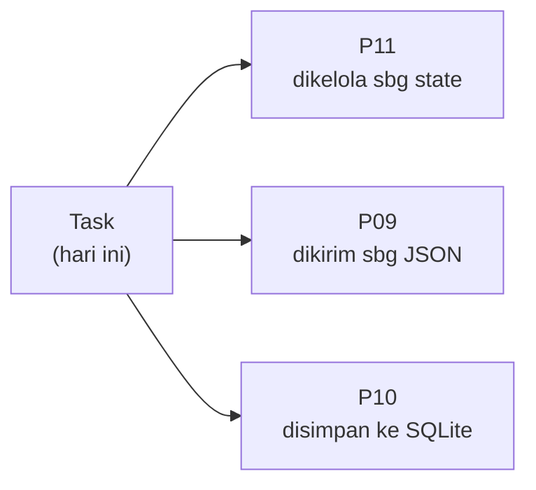
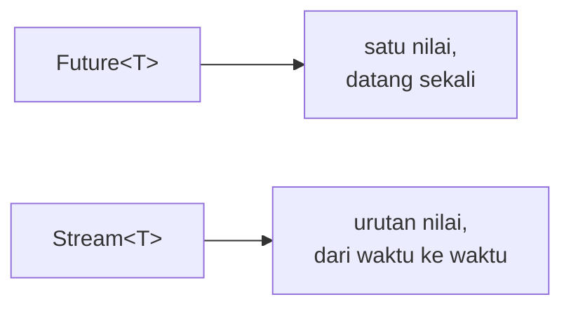

<!-- _class: title -->
<!-- _paginate: false -->

# Pertemuan 2
## Dart Programming Deep Dive

OOP · Pemodelan data · JSON · Async lanjutan · Error handling

**Sub-CPMK53.1** — menguasai fundamental Dart dan Flutter untuk aplikasi mobile dasar
Bacaan: modul-buku bab 2 · Praktikum: `starter-code/p02-dart-oop`

<div class="pengajar">

**Fahri Firdausillah, S.Kom, M.CS**
Teknik Informatika — Universitas Dian Nuswantoro

</div>

---

## Setelah pertemuan ini, Anda bisa

1. **Memodelkan data** dengan enum bertipe, konstruktor `factory`, dan `copyWith` yang aman terhadap null.
2. **Memetakan JSON** ke objek bertipe dan sebaliknya, dengan error yang jelas saat data tidak sesuai.
3. **Memilih pewarisan atau komposisi** saat merancang kontrak dan merangkai perilaku.
4. **Menangani perubahan data** dengan `Stream`.
5. **Menangani kegagalan operasi** dengan tipe error yang eksplisit.

<div class="warn">

**Yang dibangun hari ini bukan latihan yang dibuang.** Model `Task`, `TaskRepository`, `TaskListState`, dan `Result` dari pertemuan ini adalah basis kode yang dipegang sampai pertemuan terakhir. Kesalahan desain di sini akan terasa sampai P15.

</div>

---

## Satu model, tiga konteks

Sepanjang sisa semester, contoh implementasi memakai satu aplikasi acuan: pencatat
tugas dan jadwal belajar (**Tracker**). Hari ini kita membangun model domainnya.



Model `Task` di pertemuan 1 cukup untuk memperkenalkan class, tetapi **terlalu
miskin untuk aplikasi sungguhan**. Tugas nyata punya prioritas, catatan, label, dan
waktu dibuat. Datanya datang dari jaringan sebagai JSON yang harus diurai, dan
daftarnya berubah tiap kali pengguna menambah atau menandai selesai.

---

<!-- _class: section-break -->

# 1 · Enum & Konstruktor

Mempersempit nilai, menjaga invariant

---

## Enum bertipe: Dart 3

Prioritas tugas hanya punya tiga kemungkinan. Memodelkannya sebagai `String`
berarti menerima typo `'hight'` sebagai data sah — sampai aplikasi crash jauh di
tempat lain.

```dart
enum Priority {
  low('Rendah', 1),
  medium('Sedang', 2),
  high('Tinggi', 3);

  const Priority(this.label, this.weight);

  final String label;
  final int weight;
}

void main() {
  final p = Priority.high;
  print('${p.label} (bobot ${p.weight})');    // Tinggi (bobot 3)
  print(Priority.values.byName('medium'));    // Priority.medium
}
```

Dart 3 memperkaya enum dengan **field dan method**, jadi label tampilan dan bobot
urutan menyatu di satu tempat — tidak tersebar sebagai `switch` di banyak file.

---

## `byName` dan batas kewajaran enum

`Priority.values.byName('medium')` melempar `ArgumentError` bila teksnya tidak
cocok nilai mana pun.

<div class="ok">

Perilaku ini **kita andalkan** nanti saat mengurai JSON: data rusak gagal cepat di
satu titik yang jelas, bukan merembet diam-diam sampai muncul sebagai tampilan
kosong yang membingungkan tiga layar kemudian.

</div>

<div class="warn">

**Enum bukan jawaban untuk semua nilai tetap.** Untuk kumpulan yang bisa berubah
saat aplikasi berjalan — nama pengguna, judul tugas, kategori yang dibuat pengguna —
enum justru salah pilihan; `String` tetap tepat.

Enum hanya untuk **kumpulan tertutup yang sudah diketahui saat menulis kode.**

</div>

---

## Model `Task` — field dan konstruktor privat

```dart
class Task {
  final String id;
  final String title;
  final String? note;
  final Priority priority;
  final List<String> tags;
  final bool done;
  final DateTime? dueDate;
  final DateTime createdAt;

  const Task._({                    // generatif, privat — tidak dipanggil dari luar
    required this.id,
    required this.title,
    required this.createdAt,
    this.note,
    this.priority = Priority.medium,
    this.tags = const [],
    this.done = false,
    this.dueDate,
  });
```

Semua field `final`, jadi objek **tidak bisa diubah setelah dibuat**. Nilai bawaan
dipasang di konstruktor, bukan di deklarasi field.

---

## Model `Task` — pintu masuk publik

```dart
  factory Task({                    // publik; di sinilah validasi terjadi
    required String id,
    required String title,
    DateTime? dueDate,
    DateTime? createdAt,
    String? note,
    Priority priority = Priority.medium,
    List<String> tags = const [],
    bool done = false,
  }) {
    if (title.trim().isEmpty) {
      throw ArgumentError.value(title, 'title', 'judul tidak boleh kosong');
    }
    return Task._(
      id: id, title: title, note: note, priority: priority, tags: tags,
      done: done, dueDate: dueDate, createdAt: createdAt ?? DateTime.now(),
    );
  }

  bool get isOverdue =>
      !done && dueDate != null && DateTime.now().isAfter(dueDate!);
}
```

---

## Tiga keputusan desain di balik `Task`

**1. Konstruktor generatif dibuat privat, `factory` menggantikannya.**
Factory bisa menjalankan validasi **sebelum** objek dibuat: judul kosong ditolak saat
pembuatan, bukan saat ditampilkan. Konsekuensinya konstruktor tidak lagi bisa
`const` — itu harga yang layak untuk menjaga invariant. Bila class Anda murni nilai
tanpa aturan, pertahankan `const` seperti di pertemuan 1.

**2. `id` selalu diisi pemanggil secara eksplisit.**
Aplikasi sungguhan menghasilkan id dari UUID (P09) atau autoincrement SQLite (P10).

**3. `createdAt` diisi `DateTime.now()` sebagai bawaan.**
Waktu pembuatan memang waktu saat itu — ini bukan id.

<div class="warn">

**Kenapa id tidak boleh dari `DateTime.now()`?** Dua pembuatan dalam milidetik yang
sama menghasilkan id yang sama. Cukup untuk demo, fatal untuk data sungguhan.

</div>

---

## `copyWith` versi naif — dan jebakannya

```dart
Task copyWithNaive({String? title, bool? done, DateTime? dueDate}) {
  return Task._(
    id: id,
    title: title ?? this.title,
    done: done ?? this.done,
    dueDate: dueDate ?? this.dueDate,    // ← di sini masalahnya
    // ...
  );
}
```

Pola `dueDate ?? this.dueDate` **tidak bisa membedakan dua maksud yang berbeda**:

| Maksud pemanggil | Yang dikirim |
|---|---|
| "Saya tidak menyentuh tenggat" | `null` (parameter tidak diisi) |
| "Saya sengaja **menghapus** tenggat" | `null` (diisi eksplisit) |

Keduanya sampai sebagai `null`, dan hasilnya sama: tenggat lama dipertahankan.
**Menghapus tenggat menjadi mustahil.**

---

## Solusinya: nilai penanda (sentinel)

```dart
static const _unset = Object();

Task copyWith({
  String? title,
  Priority? priority,
  bool? done,
  Object? dueDate = _unset,              // bukan DateTime?, melainkan Object?
}) {
  return Task._(
    id: id,
    title: title ?? this.title,
    priority: priority ?? this.priority,
    done: done ?? this.done,
    dueDate: dueDate == _unset ? this.dueDate : dueDate as DateTime?,
    createdAt: createdAt,
  );
}
```

Parameter `dueDate` bertipe `Object?` dengan bawaan `_unset`: **`null` berarti
"hapus tenggat"**, **tidak mengisi berarti "biarkan seperti sebelumnya"**.

Kini `task.copyWith(done: true)` dan `task.copyWith(dueDate: null)` keduanya benar.
Pola ini dipakai lagi di P11 setiap kali state berubah.

---

<!-- _class: section-break -->

# 2 · Memetakan JSON

Batas antara dunia luar dan model bertipe

---

## `fromJson`: dari data mentah ke objek

```dart
factory Task.fromJson(Map<String, dynamic> json) {
  return Task._(
    id: json['id'] as String,
    title: json['title'] as String,
    note: json['note'] as String?,                       // nullable, eksplisit
    priority: Priority.values.byName(json['priority'] as String),
    tags: [for (final tag in json['tags'] as List) tag as String],
    done: json['done'] as bool? ?? false,
    dueDate: json['due_date'] == null
        ? null
        : DateTime.parse(json['due_date'] as String),
    createdAt: DateTime.parse(json['created_at'] as String),
  );
}
```

REST API dan penyimpanan lokal berbicara dalam **JSON**, sementara kode aplikasi
ingin bekerja dengan **`Task` bertipe**. `fromJson` adalah jembatannya — dan
satu-satunya tempat konversi itu boleh terjadi.

---

## `toJson`: arah sebaliknya

```dart
Map<String, dynamic> toJson() {
  return {
    'id': id,
    'title': title,
    'note': note,
    'priority': priority.name,                  // enum -> String
    'tags': tags,
    'done': done,
    'due_date': dueDate?.toIso8601String(),     // DateTime -> String ISO 8601
    'created_at': createdAt.toIso8601String(),
  };
}
```

<div class="ok">

Perhatikan simetrinya: apa pun yang `fromJson` urai, `toJson` harus bisa hasilkan
kembali. Ketidaksimetrian di sini adalah sumber bug yang sangat sulit dilacak —
data tersimpan, tetapi tidak pernah kembali utuh.

</div>

---

## Empat hal yang harus diperhatikan

- **`Map<String, dynamic>` hanya hidup di batas sistem** — masuk dari `jsonDecode`, keluar lewat `toJson`. Begitu berada di dalam `fromJson`, kode kembali bertipe penuh. Inilah satu-satunya tempat `dynamic` dari pertemuan 1 dibenarkan.

- **Field nullable diurai eksplisit**: `as String?`, atau cek `null` sebelum `DateTime.parse`. Asumsi "pasti ada" tanpa cek berarti crash saat server mengirim data yang sedikit berbeda.

- **`DateTime` tidak ada di JSON.** Ia dikirim sebagai string ISO 8601 lewat `toIso8601String()` dan diurai kembali dengan `DateTime.parse`.

- **Enum dikirim sebagai `name`** dan diurai kembali dengan `byName` — error nama tak dikenal muncul di satu titik ini saja.

<div class="note">

Konvensi `snake_case` (`due_date`) mengikuti format API. **Pemetaan nama field
adalah tugas `fromJson`/`toJson`**, bukan tugas seluruh aplikasi menyesuaikan diri.

</div>

---

## Uji putaran lengkapnya

```dart
import 'dart:convert';

void main() {
  final task = Task(
    id: 't-1',
    title: 'Kirim laporan mingguan',
    priority: Priority.high,
    dueDate: DateTime(2026, 9, 10),
  );

  final jsonText = jsonEncode(task.toJson());
  print(jsonText);

  final restored = Task.fromJson(jsonDecode(jsonText) as Map<String, dynamic>);
  print(restored.title);       // Kirim laporan mingguan
  print(restored.priority);    // Priority.high
}
```

<div class="note">

Menulis `fromJson`/`toJson` manual memang berulang, dan itu **disengaja sampai P09**
supaya Anda melihat persis apa yang terjadi. P09 memperkenalkan `json_serializable`
yang menghasilkan kode yang sama otomatis — alat itu baru masuk akal setelah pola
manualnya dipahami.

</div>

---

<!-- _class: section-break -->

# 3 · Kontrak, Pewarisan, Komposisi

Tiga cara merangkai class, bukan sinonim

---

## Kontrak: `abstract interface class`

Untuk memisahkan **"aplikasi butuh apa"** dari **"bagaimana disediakan"**:

```dart
abstract interface class TaskRepository {
  Future<List<Task>> all();
  Future<void> save(Task task);
  Future<void> delete(String id);
}
```

`TaskRepository` **tidak punya implementasi sama sekali** — ia hanya daftar operasi
yang dijanjikan.

<div class="ok">

P08 dan P10 menambah `SqliteTaskRepository`, P09 menambah `ApiTaskRepository`.
**Kode yang memakai kontrak tidak perlu berubah sama sekali.** Inilah hasil yang
kita beli dengan menulis abstraksi ini hari ini.

</div>

---

## Implementasi pertama: di memori

```dart
class MemoryTaskRepository implements TaskRepository {
  final _store = <String, Task>{};

  @override
  Future<List<Task>> all() async {
    final tasks = _store.values.toList();
    tasks.sort((a, b) => a.createdAt.compareTo(b.createdAt));
    return tasks;
  }

  @override
  Future<void> save(Task task) async => _store[task.id] = task;

  @override
  Future<void> delete(String id) async => _store.remove(id);
}
```

Cukup untuk pengujian dan pengembangan awal. Perhatikan: memakai **`implements`**,
bukan `extends` — tidak ada perilaku yang diwarisi, hanya kontrak yang dipenuhi.

---

## Komposisi: *memiliki*, bukan *adalah*

```dart
class TaskListViewModel {
  TaskListViewModel({required this.repository});

  final TaskRepository repository;          // punya satu, bukan mewarisi

  Future<List<Task>> pendingOnly() async {
    final tasks = await repository.all();
    return tasks.where((task) => !task.done).toList(growable: false);
  }
}
```

`TaskListViewModel` tidak mewarisi `TaskRepository` dan tidak mengimplementasikannya
— ia **memiliki** satu instance lewat field.

<div class="ok">

Konsekuensinya besar: ganti `MemoryTaskRepository` dengan implementasi SQLite
**tanpa menyentuh `TaskListViewModel`**, dan uji logikanya dengan repository palsu
yang cepat. Ini yang membuat pengujian di P12 mungkin dilakukan.

</div>

---

## Aturan memilih di antara ketiganya

| Pakai | Kapan |
|---|---|
| `implements` | Untuk **kontrak** yang dijanjikan ke konsumen |
| `extends` | Hanya untuk relasi **"adalah-a"** dengan implementasi yang benar-benar dibagikan |
| **Komposisi** | Untuk semua sisanya |

`extends` tepat, misalnya, pada widget Flutter yang menimpa sebagian method `build`
sambil mewarisi sisanya — dan itu memang yang kita lakukan mulai pertemuan 3.

<div class="ok">

**Kalau ragu, pilih komposisi.** Relasinya paling longgar dan paling mudah diubah.
Pewarisan mengikat dua class selamanya; komposisi cuma meminjam.

</div>

---

<!-- _class: section-break -->

# 4 · Sealed Class

Memodelkan kondisi yang saling eksklusif

---

## Masalahnya: kombinasi flag yang tidak pernah jelas

Layar daftar tugas selalu berada di salah satu dari tiga kondisi: **sedang memuat**,
**siap menampilkan data**, atau **gagal memuat**.

```dart
// Pendekatan flag boolean — sah secara sintaks, kacau secara makna
bool isLoading;
List<Task>? tasks;
String? errorMessage;
```

<div class="warn">

Apa artinya `isLoading == true` sekaligus `errorMessage != null`? Apa artinya
`tasks != null` sekaligus `isLoading == true`?

Kombinasi itu **tidak mustahil dibuat**, hanya tidak pernah dipikirkan. Dan kasus
yang terlupakan baru ketahuan saat runtime — di depan pengguna.

</div>

---

<!-- _class: code-dense -->

## Solusinya: `sealed class` + pattern matching

```dart
sealed class TaskListState {}

final class TaskListLoading extends TaskListState {}

final class TaskListReady extends TaskListState {
  TaskListReady(this.tasks);
  final List<Task> tasks;
}

final class TaskListError extends TaskListState {
  TaskListError(this.message);
  final String message;
}

String describe(TaskListState state) => switch (state) {
      TaskListLoading() => 'Memuat daftar tugas...',
      TaskListReady(:final tasks) =>
        'Siap: ${tasks.length} tugas, ${tasks.where((t) => t.done).length} selesai',
      TaskListError(:final message) => 'Terjadi error: $message',
    };
```

`sealed` berarti **semua subclass wajib dideklarasikan di file yang sama**, dan
compiler tahu daftarnya tertutup.

---

## Apa yang kita dapat dari `sealed`

<div class="ok">

**Compiler menjadi pengingat.** Bila kelak Anda menambah `TaskListEmpty`, compiler
**menolak semua `switch`** yang belum menanganinya — sebelum kode dijalankan.

Bandingkan dengan flag boolean, di mana kasus terlupakan baru muncul sebagai bug
di tangan pengguna.

</div>

Pola `TaskListReady(:final tasks)` **membongkar field objek langsung di kasus
`switch`** — ini fitur *pattern matching* Dart 3. Tidak perlu lagi:

```dart
// Cara lama, sebelum pattern matching
if (state is TaskListReady) {
  final tasks = (state as TaskListReady).tasks;   // cast manual
}
```

P11 memakai struktur persis ini untuk state layar, dan P09 untuk hasil permintaan API.

---

<!-- _class: section-break -->

# 5 · Generics & Koleksi

Pola pembentuk daftar tampilan

---

## Fungsi generik: `groupBy`

Pertemuan 1 memperkenalkan `where`/`map`/`toList`. Untuk tampilan nyata, dua hal
lagi dibutuhkan: **mengelompokkan** dan **mengurutkan**.

```dart
Map<K, List<V>> groupBy<K, V>(Iterable<V> items, K Function(V) keyOf) {
  final result = <K, List<V>>{};
  for (final item in items) {
    result.putIfAbsent(keyOf(item), () => []).add(item);
  }
  return result;
}
```

Tanda `<K, V>` di awal mendeklarasikan dua **tipe parameter**: `K` untuk kunci
pengelompokan, `V` untuk elemen.

<div class="ok">

Sekali ditulis, fungsi ini bekerja untuk tugas per prioritas, kontak per huruf awal,
transaksi per bulan — **apa saja**, dengan tipe yang tetap diperiksa compiler.
`List<Task>` yang kita pakai sepanjang semester adalah class generik dari pustaka Dart.

</div>

---

<!-- _class: code-dense -->

## Empat pola yang paling sering dipakai Flutter

```dart
void main() {
  final tasks = [
    Task(id: 't-1', title: 'Kirim laporan', priority: Priority.high),
    Task(id: 't-2', title: 'Baca bab 3', priority: Priority.low),
    Task(id: 't-3', title: 'Review PR', priority: Priority.high),
  ];

  // 1. Kelompokkan per prioritas untuk tampilan bertingkat
  final byPriority = groupBy(tasks, (Task t) => t.priority);

  // 2. Salin lalu urutkan: spread [...] mencegah mutasi list asli
  final sorted = [...tasks]
    ..sort((a, b) => b.priority.weight.compareTo(a.priority.weight));

  // 3. Rangkum koleksi jadi satu nilai
  final doneCount = tasks.fold<int>(0, (acc, t) => t.done ? acc + 1 : acc);

  // 4. Bangun baris tampilan: collection-for + collection-if
  final pendingLines = [
    for (final task in tasks)
      if (!task.done) '- ${task.title} (${task.priority.label})',
  ];
}
```

Bentuk nomor 4 adalah **persis bentuk daftar `children` widget** yang akan kita
tulis di pertemuan 3.

---

<!-- _class: section-break -->

# 6 · Stream

Data yang berubah berkali-kali

---

## `Future` satu nilai, `Stream` banyak nilai

`Future` dari pertemuan 1 mewakili **satu nilai yang datang sekali**. Daftar tugas
berbeda: ia berubah berkali-kali sepanjang umur aplikasi.



`Stream` adalah tipe untuk urutan nilai dari waktu ke waktu — pengguna menambah
tugas, menandai selesai, menghapus; tiap perubahan menghasilkan snapshot baru.

<div class="note">

P11 memakai `ChangeNotifier` dan `Provider` untuk kebutuhan yang sama. Keduanya
dibangun di atas mekanisme pendengar seperti ini — **memahami stream membuat alat
itu tidak terlihat seperti sihir.**

</div>

---

<!-- _class: code-dense -->

## `TaskStore`: menyiarkan perubahan

```dart
import 'dart:async';

class TaskStore {
  final _tasks = <Task>[];
  final _changes = StreamController<List<Task>>.broadcast();

  /// Aliran snapshot daftar tugas setiap kali berubah.
  Stream<List<Task>> get changes => _changes.stream;

  List<Task> get snapshot => List.unmodifiable(_tasks);

  void add(Task task) {
    _tasks.add(task);
    _changes.add(snapshot);              // siarkan snapshot baru
  }

  void toggleDone(String id) {
    final index = _tasks.indexWhere((task) => task.id == id);
    if (index == -1) return;
    _tasks[index] = _tasks[index].copyWith(done: !_tasks[index].done);
    _changes.add(snapshot);
  }

  void dispose() {
    _changes.close();                    // wajib, agar tidak bocor
  }
}
```

---

## Tiga hal penting tentang Stream

- **`StreamController.broadcast()`** mengirim setiap snapshot ke **semua** pendengar. Tanpa `.broadcast()`, hanya satu pendengar yang diizinkan.

- **`List.unmodifiable` menjaga batas.** Pendengar tidak pernah melihat list internal yang bisa berubah di belakangnya — mereka menerima snapshot yang tidak bisa dimutasi.

- **Event terkirim lewat event loop**, jadi bersifat asinkron. Inilah sebabnya contoh di modul menunggu satu putaran event loop sebelum membatalkan langganan.

<div class="warn">

**`listen` mengembalikan `StreamSubscription` yang harus dibatalkan, dan controller
harus ditutup lewat `close()`.** Melewatkan keduanya adalah kebocoran memori yang
menumpuk diam-diam.

Di Flutter, pembatalan ini dilakukan di `dispose()` widget — kita bahas di
pertemuan 3 dan P11.

</div>

---

<!-- _class: section-break -->

# 7 · Error Bertipe

Memaksa pemanggil menangani kegagalan

---

## Bukan semua kegagalan itu bug

Memuat daftar tugas dari sumber luar bisa gagal dengan beberapa cara: format JSON
salah, field hilang, nilai enum tak dikenal. Kegagalan semacam ini **diharapkan** —
berbeda dari bug pemrograman.

```dart
sealed class Result<T> {
  const Result();
}

final class Ok<T> extends Result<T> {
  const Ok(this.value);
  final T value;
}

final class Err<T> extends Result<T> {
  const Err(this.error);
  final Object error;
}
```

`Result<T>` menggabungkan dua teknik hari ini: **`sealed`** agar `switch` atas
hasilnya tuntas diperiksa compiler, dan **generics** agar bisa membungkus tipe apa pun.

---

<!-- _class: code-dense -->

## Memakai `Result` pada pemuatan JSON

```dart
Future<Result<List<Task>>> loadTasks(String source) async {
  try {
    final data = jsonDecode(source);
    if (data is! List) {
      return Err(FormatException('Akar dokumen harus berupa array'));
    }
    return Ok([
      for (final (i, row) in data.indexed)
        if (row is Map<String, dynamic>)
          Task.fromJson(row)
        else
          throw FormatException('Elemen #$i bukan objek JSON'),
    ]);
  } on FormatException catch (e) {
    return Err(e);                  // JSON rusak atau tanggal tidak sah
  } on TypeError catch (e) {
    return Err(FormatException('Struktur field tidak sesuai: $e'));
  } on ArgumentError catch (e) {
    return Err(e);                  // misalnya priority tidak dikenal
  }
}
```

Di dalam `loadTasks`, `try`/`catch` menangkap error dari `jsonDecode`,
`DateTime.parse`, cast `as`, dan `byName` — lalu **membungkusnya menjadi `Err`**.

---

## Di luar, kegagalan tidak bisa diabaikan

```dart
Future<void> main() async {
  final result = await loadTasks(sumberJson);

  switch (result) {
    case Ok(value: final tasks):
      print('Berhasil memuat ${tasks.length} tugas');
    case Err(:final error):
      print('Gagal memuat: $error');
  }
}
```

<div class="ok">

Pemanggil **tidak bisa mengabaikan kegagalan**, karena hasilnya harus dibongkar dulu
sebelum nilainya bisa dipakai. Bandingkan dengan fungsi yang mengembalikan
`List<Task>` dan diam-diam melempar exception — tidak ada di tanda tangannya yang
memberi tahu Anda bahwa itu bisa gagal.

</div>

---

## Kapan exception, kapan `Result`?

| | Exception | `Result` |
|---|---|---|
| **Untuk** | Kondisi yang menandakan **bug** | Kegagalan **operasional** |
| **Contoh** | `ArgumentError` dari konstruktor `Task` | JSON rusak, jaringan putus |
| **Yang harus dilakukan** | Diperbaiki oleh programmer | Diputuskan saat runtime |
| **Pilihan pemanggil** | — | Tampilkan pesan, coba lagi, pakai cadangan |

<div class="ok">

Judul kosong yang ditolak konstruktor `Task` adalah **kesalahan pemrograman** — kode
yang memanggilnya salah dan harus diperbaiki, bukan ditangani di runtime. Sedangkan
server yang mengirim `priority: "urgent"` adalah **kenyataan** yang aplikasi Anda
harus siap hadapi.

Materi ini memakai keduanya dengan pembagian itu.

</div>

---

## Praktikum hari ini

**Target:** model class `Task` lengkap dengan OOP concepts dan serialisasi.

1. Properti: `id`, `title`, `description`, `category`, `priority`, `dueDate`, `completed`
2. Constructors dan **named constructors**, implementasi method
3. Serialisasi: `toJson` / `fromJson`
4. Async programming lewat **simulasi API call**
5. Error handling dengan blok `try`/`catch`

<div class="warn">

**Metode Generate-Analyze-Improve.** AI boleh *generate* contoh struktur class.
Tugas Anda: **analyze** polanya, lalu **improve** dengan business logic Anda sendiri
untuk assignment management. Yang dinilai adalah langkah kedua dan ketiga.

</div>

Starter: `starter-code/p02-dart-oop` · Tugas: Weather API client dengan async programming

---

## Bekerja dengan AI di materi ini

**Pantas didelegasikan**
Meminta contoh **perbandingan** antara dua cara memodelkan hal yang sama — misalnya
pewarisan versus komposisi untuk kasus Anda sendiri.

**Tulis sendiri**
**Keputusan pemodelan**: class apa yang ada, apa yang boleh null, apa yang menjadi
enum. AI memberi model yang masuk akal secara umum; yang Anda butuhkan adalah model
yang cocok dengan **aturan domain Anda** — dan aturan itu hanya Anda yang tahu.

<div class="note">

**Latihan:** berikan tiga aturan domain Anda kepada AI dan minta ia membuat sealed
class untuk state layar. Lalu **cari keadaan mustahil yang masih bisa dibuat** dari
hasilnya — misalnya dua field yang seharusnya tidak pernah terisi bersamaan.
Perbaiki sendiri, dan catat apa yang terlewat.

</div>

---

## Ringkasan

- **Enum bertipe** (`Priority`) mempersempit nilai tetap; `byName` mengurai teks ke enum dan gagal cepat bila tidak dikenal.
- **Konstruktor `factory`** memvalidasi sebelum objek dibuat; **`copyWith` dengan sentinel** `Object()` menangani field nullable yang perlu dihapus nilainya.
- **`fromJson`/`toJson`** menjadi satu-satunya tempat `Map<String, dynamic>` berada; field nullable dan `DateTime` diurai eksplisit.
- **`abstract interface class`** mendefinisikan kontrak; **komposisi** merangkai perilaku dan lebih disukai daripada pewarisan.
- **`sealed class` + pattern matching** memodelkan kondisi eksklusif; compiler memaksa semua kasus ditangani.
- **`groupBy` generik, `..sort` pada salinan, `fold`,** dan collection-for/if adalah pola pembentuk daftar tampilan.
- **`StreamController`** menyiarkan perubahan koleksi; langganan dibatalkan dan controller ditutup saat selesai.
- **`Result<T>`** memaksa pemanggil menangani kegagalan operasional; exception tetap untuk bug pemrograman.

---

<!-- _class: section-break -->

# Pertemuan berikutnya

**P03 — Flutter Fundamentals & Widget System**
Widget architecture, basic layouts, navigation

Model `Task`, `TaskRepository`, `TaskListState`, dan `Result` sudah siap.
Semuanya masih berjalan di terminal — pertemuan depan semuanya **pindah ke layar**.

Baca sebelum kelas: modul-buku bab 3
