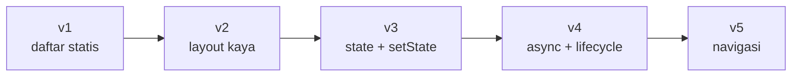
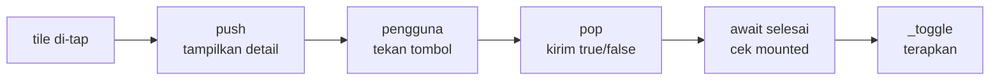

<!-- _class: title -->
<!-- _paginate: false -->

# Pertemuan 3
## Flutter Fundamentals & Widget System

Widget architecture · Layout · State lokal · Navigasi

**Sub-CPMK53.1** — menguasai fundamental Flutter untuk aplikasi mobile dasar
Bacaan: modul-buku bab 3 · Praktikum: `starter-code/p03-widget-navigation`

<div class="pengajar">

**Fahri Firdausillah, S.Kom, M.CS**
Teknik Informatika — Universitas Dian Nuswantoro

</div>

---

## Setelah pertemuan ini, Anda bisa

1. **Membaca kode Flutter sebagai widget tree** dan menjelaskan mengapa widget bersifat immutable.
2. **Menyusun layout** dengan `Column`, `Row`, `Expanded`, dan `ListView` berdasarkan model constraints.
3. **Memilih `StatelessWidget` atau `StatefulWidget`** dan mengubah tampilan lewat `setState`.
4. **Mengelola siklus hidup `State`**: `initState`, `dispose`, pemeriksaan `mounted` setelah async.
5. **Menavigasi antar layar** dengan `Navigator` dan mengoper data bolak-balik lewat hasil `push`/`pop`.

<div class="note">

Bab 1–2 membangun model domain Tracker dengan Dart murni — `Task`, `Priority`, `TaskRepository` — semuanya berjalan di terminal. **Hari ini model itu pindah ke layar.**

</div>

---

## Peta perjalanan hari ini

Satu aplikasi yang tumbuh lima kali, bukan lima contoh terpisah:



Setiap versi hanya menampilkan **kode yang berubah**; sisanya tetap.

Persiapan: `flutter create tracker`, lalu salin `Priority` dan `Task` dari bab 2 ke `lib/task.dart`.
Bab ini memakai field `id`, `title`, `note`, `priority`, `done`, `dueDate`.

---

<!-- _class: section-break -->

# 1 · Widget

Deskripsi immutable, bukan objek yang digambar

---

## Imperatif vs deklaratif

Android native bersifat **imperatif**: Anda menahan referensi ke `TextView`, lalu memanggil `textView.setText(...)` setiap kali data berubah. Kode UI dan kode pembaruan data tersebar di banyak tempat — satu kondisi terlewat, tampilan tidak sinkron dengan data.

Flutter membalik pendekatannya: Anda menulis fungsi yang **memetakan data menjadi deskripsi tampilan**, dan framework yang menghitung apa yang harus digambar ulang.

```dart
// Deklaratif: tampilan adalah fungsi dari data.
// Tidak ada "ubah teks judul": cukup kembalikan deskripsi baru.
Text(task.done ? 'Selesai' : task.title)
```

<div class="ok">

**Konsekuensinya terasa sepanjang bab:** satu fungsi `build` mengembalikan deskripsi, data berubah lewat `setState`, framework menyelaraskan keduanya. Tidak ada lagi sinkronisasi manual.

</div>

---

<!-- _class: split split-wide -->

## Widget = deskripsi, bukan objek layar

```dart
class PriorityChip extends StatelessWidget {
  const PriorityChip({
    super.key,
    required this.label,
  });

  final String label;

  @override
  Widget build(BuildContext context) {
    return Container(
      padding: const EdgeInsets.symmetric(
        horizontal: 8, vertical: 4),
      decoration: BoxDecoration(
        color: Theme.of(context)
            .colorScheme.primary
            .withValues(alpha: 0.12),
        borderRadius: BorderRadius.circular(12),
      ),
      child: Text(label,
        style: Theme.of(context)
            .textTheme.labelSmall),
    );
  }
}
```

<div>

Semua elemen visual adalah widget: `Text`, tombol, padding, bahkan aplikasi itu sendiri.

Widget **bukan** objek yang digambar ke layar — ia deskripsi konfigurasi: immutable, murah dibuat, dibuang begitu selesai dipakai.

Yang hidup lama di memori adalah **element** dan **render object** yang dikelola framework. Kode Anda hanya memproduksi deskripsi.

Karena tidak pernah diubah setelah dibuat, semua field-nya `final`.

</div>

---

## Membedah tiga detail penting

- **`withValues(alpha: 0.12)`** — pengganti `withOpacity` yang deprecated sejak Flutter 3.27. Menerima komponen warna secara eksplisit, konsisten dengan model warna baru Flutter. Buku ini memakainya di semua tempat yang butuh transparansi.

- **`const` pada konstruktor** — memungkinkan framework memakai ulang instance yang sama saat tree dibangun ulang. Efisiensi gratis tanpa mengubah perilaku.

- **`super.key`** — meneruskan identitas widget ke superclass. `key` dipakai framework saat membandingkan tree lama dengan tree baru. Untuk daftar yang bisa berubah urutan (misalnya setelah sortir), key berbasis id data seperti `ValueKey(task.id)` menjaga state dan posisi tetap menempel pada item yang benar.

<div class="note">

**Komposisi, bukan pewarisan.** Tidak ada hierarki `SuperListTile` → `TaskListTile`. Yang ada widget kecil yang saling membungkus: daripada memberi properti prioritas pada `Text`, kita menyusun `Container` + `Text` jadi satu widget baru yang punya nama dan tanggung jawab jelas.

</div>

---

<!-- _class: code-dense -->

## Versi 1 — widget tree yang terbaca dari indentasi

```dart
void main() => runApp(const TrackerApp());

class TrackerApp extends StatelessWidget {
  const TrackerApp({super.key});

  @override
  Widget build(BuildContext context) {
    return MaterialApp(
      title: 'Task Tracker',
      theme: ThemeData(colorSchemeSeed: const Color(0xFF1E88E5)),
      home: const TaskListScreen(),   // layar terpisah — penting, lihat slide navigasi
    );
  }
}
```

Menjalankan aplikasi berarti **menanam satu widget akar** yang membentangkan seluruh layar. Dari akar itu tumbuh widget tree: setiap widget punya nol atau lebih child, dan setiap `build` mengembalikan potongan tree baru.

---

<!-- _class: code-dense -->

## Versi 1 — isi layarnya

```dart
class TaskListScreen extends StatelessWidget {
  const TaskListScreen({super.key});

  static final _tasks = [
    Task(id: 't-1', title: 'Baca bab 3', priority: Priority.high),
    Task(id: 't-2', title: 'Coba contoh layout'),
    Task(id: 't-3', title: 'Kirim laporan mingguan', priority: Priority.low),
  ];

  @override
  Widget build(BuildContext context) {
    return Scaffold(                                  // kerangka layar Material
      appBar: AppBar(title: const Text('Task Tracker')),
      body: ListView(
        padding: const EdgeInsets.all(12),
        children: [
          for (final task in _tasks)                  // collection-for dari bab 2
            ListTile(
              leading: Icon(task.done ? Icons.check_circle : Icons.circle_outlined,
                            color: task.done ? Colors.green : Colors.grey),
              title: Text(task.title),
              subtitle: Text(task.priority.label),
            ),
        ],
      ),
    );
  }
}
```

---

## Dua aturan yang membuat pola ini awet

### 1. `build` harus murni

Data sama menghasilkan tree yang sama. Jangan memicu efek samping di dalam `build`: menulis file, memanggil `setState`, mengubah variabel global.

**Alasannya:** framework memanggil `build` kapan saja dan sebanyak yang diperlukan. Anda tidak mengontrol frekuensinya.

### 2. Widget yang tidak berubah sebaiknya `const`

`const Text('Task Tracker')` di-build sekali dan dipakai ulang di setiap rebuild berikutnya.

<div class="note">

Pohonnya terbaca langsung dari indentasi: `MaterialApp` → `TaskListScreen` → `Scaffold` (app bar di atas, body di tengah) → `ListView` → banyak `ListTile`.

</div>

---

<!-- _class: section-break -->

# 2 · Layout

Constraints turun, ukuran naik, parent memposisikan

---

## Tiga aturan yang menjelaskan semua kejanggalan layout

Flutter **tidak punya sistem layout terpisah** seperti CSS. Layout adalah negosiasi antar widget dalam tree:

1. **Parent memberikan constraints kepada child** — nilai minimum dan maksimum lebar serta tinggi.
2. **Child menentukan ukurannya sendiri** di dalam constraints itu, lalu melapor ke parent.
3. **Parent menentukan posisi child** — child tidak punya kata putus soal posisi.

<div class="warn">

**Studi kasus:** mengapa `Column` error saat berisi `ListView`?

`Column` memberikan constraints tinggi **tak terbatas** (semua child boleh sebesar apa pun) → `ListView` menuntut tinggi **terbatas** untuk tahu area scrollnya → negosiasi gagal.

**Solusinya selalu berupa mengubah constraints:** bungkus dengan `Expanded` agar child dipaksa mengisi ruang yang tersedia.

</div>

---

## Widget layout yang dipakai sepanjang buku — hanya segelintir

| Widget | Perannya |
|---|---|
| `Column` / `Row` | Menyusun child vertikal & horizontal. Sumbu utama diatur `mainAxisAlignment`, sumbu silang `crossAxisAlignment` |
| `Expanded` | Memberi child bagian dari sisa ruang pada sumbu utama — **memaksa penuh** |
| `Flexible` | Sama, tapi child **boleh lebih kecil** dari jatahnya |
| `SizedBox` | Jarak atau ukuran pasti |
| `Container` | Dekorasi: warna, border, bayangan, bentuk |
| `ListView` | Banyak child dengan scroll |
| `SingleChildScrollView` | Konten pendek yang mungkin meluas |

Aturan praktis pemilihan scroll: `SingleChildScrollView` untuk **formulir pendek**, `ListView` untuk **puluhan item**, `ListView.builder` untuk **daftar yang tumbuh dari data**.

---

<!-- _class: split -->

## Versi 2 — subtitle jadi `Row`

```dart
ListTile(
  leading: Checkbox(
    value: task.done,
    onChanged: null,   // masih mati
  ),
  title: Text(task.title),
  subtitle: Row(
    children: [
      PriorityChip(
        label: task.priority.label),
      if (task.dueDate != null) ...[
        const SizedBox(width: 8),
        Text('Tenggat '
          '${task.dueDate!.day}/'
          '${task.dueDate!.month}'),
      ],
    ],
  ),
)
```

<div>

Yang berubah dari versi 1 hanya `leading` dan `subtitle` tiap tile.

`Row` pada `subtitle` berisi `PriorityChip`, lalu teks tenggat **bila ada**.

`Checkbox` sementara dibiarkan mati dengan `onChanged: null` — versi 3 menghidupkannya.

`...[` adalah **collection-if + spread** dari bab 2. Ia bekerja juga pada daftar `children` widget, bukan cuma `List` biasa.

</div>

---

## Overflow adalah negosiasi yang gagal

Apa yang terjadi bila teks tenggatnya panjang dan layarnya sempit?

`Row` memberi constraints lebar tersisa kepada kedua childnya → keduanya menolak menyusut → Flutter menampilkan strip kuning-hitam:

```
RenderFlex overflowed by 37 pixels on the right
```

**Perbaikannya sesuai aturan constraints** — ubah constraints-nya, bukan tambal kosmetik:

- Child yang **boleh menyusut** → bungkus `Expanded` atau `Flexible`
- Elemen yang **boleh pindah baris** → pakai `Wrap`
- Deretan yang **memang panjang** → bungkus scroll
- **Teks** → `Expanded` + `Text(overflow: TextOverflow.ellipsis)` memotong rapi dengan elipsis

---

## `ListView.builder` — bangun saat terlihat saja

Saat daftar tugas bertambah banyak, `ListView` dengan `children` mulai boros: **seluruh tile dibangun sekaligus** meski hanya beberapa yang terlihat.

```dart
ListView.builder(
  padding: const EdgeInsets.all(12),
  itemCount: _tasks.length,
  itemBuilder: (context, index) {
    final task = _tasks[index];
    return TaskTile(task: task);   // dibangun hanya saat masuk area layar
  },
)
```

Perhatikan bentuknya: bukan lagi daftar `children` yang sudah jadi, tapi **`itemCount` + fungsi pembangun**. Framework memanggil `itemBuilder` sesuai kebutuhan scroll.

---

<!-- _class: section-break -->

# 3 · State Lokal

Dari StatelessWidget ke StatefulWidget

---

## Mengapa `StatefulWidget` ada

Versi 1 dan 2 memetakan **data tetap** ke tampilan — `StatelessWidget` memang tepat untuk itu.

Aplikasi sungguhan berbeda: pengguna menandai tugas selesai, menambah tugas, daftarnya berubah. Data yang bisa berubah itulah **state**.

### Mekanismenya — penting dipahami sebelum dipakai

Saat framework menemukan `StatefulWidget` di tree, ia membuat **satu objek `State` yang terpisah** dari widgetnya:

- **Widget** tetap immutable dan dibuang tiap rebuild.
- **Objek `State`** yang sama bertahan; field-nya bisa berubah dan nilainya awet lintas rebuild.

<div class="ok">

**`setState` tidak menggambar apa pun.** Ia hanya menandai bahwa deskripsi sudah basi, sehingga `build` dipanggil ulang dengan data terbaru.

</div>

---

<!-- _class: code-dense -->

## Versi 3 — layar jadi stateful

```dart
class TaskListScreen extends StatefulWidget {
  const TaskListScreen({super.key});

  @override
  State<TaskListScreen> createState() => _TaskListScreenState();
}

class _TaskListScreenState extends State<TaskListScreen> {
  final _tasks = <Task>[
    Task(id: 't-1', title: 'Baca bab 3', priority: Priority.high),
    Task(id: 't-2', title: 'Coba contoh layout'),
    Task(id: 't-3', title: 'Kirim laporan mingguan', priority: Priority.low),
  ];

  void _toggle(Task task) {
    setState(() {
      final index = _tasks.indexWhere((element) => element.id == task.id);
      if (index != -1) {
        _tasks[index] = _tasks[index].copyWith(done: !task.done);  // immutable
      }
    });
  }
  // build di slide berikutnya
}
```

---

<!-- _class: code-dense -->

## Versi 3 — build-nya

```dart
  @override
  Widget build(BuildContext context) {
    final pending = splitPending(_tasks);
    return Scaffold(
      appBar: AppBar(title: const Text('Task Tracker')),
      bottomNavigationBar: BottomAppBar(
        child: Text('${pending.length} tugas belum selesai'),
      ),
      body: ListView.builder(
        padding: const EdgeInsets.all(12),
        itemCount: _tasks.length,
        itemBuilder: (context, index) => TaskTile(
          task: _tasks[index],
          onToggle: () => _toggle(_tasks[index]),   // kejadian naik lewat callback
        ),
      ),
    );
  }
```

Jumlah tugas tertunda **dihitung ulang di `build`** dari `_tasks`, tidak disimpan sebagai field terpisah. Satu sumber kebenaran, tidak ada yang bisa jadi tidak sinkron.

---

<!-- _class: split split-wide -->

## `TaskTile` tetap stateless

```dart
class TaskTile extends StatelessWidget {
  const TaskTile({
    super.key,
    required this.task,
    required this.onToggle,
  });

  final Task task;
  final VoidCallback onToggle;

  @override
  Widget build(BuildContext context) {
    return Card(
      margin: const EdgeInsets.only(bottom: 8),
      child: ListTile(
        leading: Checkbox(
          value: task.done,
          onChanged: (_) => onToggle()),
        title: Text(task.title,
          style: TextStyle(
            decoration: task.done
              ? TextDecoration.lineThrough
              : null)),
        // subtitle: Row seperti versi 2
      ),
    );
  }
}
```

<div>

**Perhatikan pembagian tanggung jawabnya.**

`TaskTile` tidak tahu apa pun tentang daftar. Ia hanya menerima `task` dan callback `onToggle`.

State daftar dimiliki `_TaskListScreenState`. Saat checkbox di-tap, tile **hanya memanggil callback**; layar pemilik state yang mengubah `_tasks` lewat `setState`.

Pola *"widget presentasi menerima data + callback, layar pemilik state mengeksekusinya"* dipakai di seluruh buku — di bab 7 ia berkembang jadi pemisahan lengkap UI dan logika.

</div>

---

## Mengapa `copyWith`, bukan mutasi field?

```dart
// ❌ tidak bisa — Task immutable, semua field-nya final
_tasks[index].done = !task.done;

// ✅ ganti elemennya dengan objek baru
_tasks[index] = _tasks[index].copyWith(done: !task.done);
```

Mendesain state sebagai **koleksi objek immutable** membuat setiap rebuild murah dan aman: tidak ada kode lain yang bisa mengubah objek lama secara diam-diam.

<div class="note">

Ini konsekuensi langsung dari `Task` yang kita rancang di bab 2. Keputusan desain di lapisan model membayar dirinya kembali di lapisan UI.

</div>

---

<!-- _class: section-break -->

# 4 · Siklus Hidup State

Alokasi di initState, pembersihan di dispose

---

## Empat titik dalam hidup sebuah `State`

Objek `State` punya siklus hidup **jauh lebih panjang** dari widgetnya: dibuat sekali, di-build berkali-kali, akhirnya dibuang.

1. **`initState`** — dipanggil sekali sebelum build pertama. Tempat alokasi: controller, langganan, pemuatan data awal.
2. **`build`** — dipanggil setiap kali deskripsi perlu diperbarui.
3. **`didUpdateWidget`** — dipanggil saat parent mengirim konfigurasi baru (widget baru dengan tipe sama).
4. **`dispose`** — dipanggil sekali sebelum objek dibuang dari tree. **Satu-satunya kesempatan** melepas sumber daya.

<div class="ok">

**Aturan praktisnya sederhana:** apa pun yang dialokasikan di `initState` — atau field `State` yang memegang sumber daya — dilepas di `dispose`.

</div>

---

<!-- _class: code-dense -->

## Versi 4 — repository + controller

```dart
class TaskListScreen extends StatefulWidget {
  const TaskListScreen({super.key, required this.repository});

  final TaskRepository repository;      // dependensi masuk lewat konstruktor

  @override
  State<TaskListScreen> createState() => _TaskListScreenState();
}

class _TaskListScreenState extends State<TaskListScreen> {
  final _titleController = TextEditingController();
  var _tasks = <Task>[];

  @override
  void initState() {
    super.initState();
    _seedAndLoad();                     // initState tak bisa await — delegasikan
  }

  @override
  void dispose() {
    _titleController.dispose();         // lepas sebelum super.dispose()
    super.dispose();
  }
```

---

<!-- _class: code-dense -->

## Versi 4 — memuat dan menulis data

```dart
  Future<void> _seedAndLoad() async {
    // Await berantai: muat hanya setelah semua data contoh tersimpan.
    for (final task in [
      Task(id: 't-1', title: 'Baca bab 3', priority: Priority.high),
      Task(id: 't-2', title: 'Coba contoh layout'),
      Task(id: 't-3', title: 'Kirim laporan mingguan', priority: Priority.low),
    ]) {
      await widget.repository.save(task);
    }
    await _load();
  }

  Future<void> _load() async {
    final tasks = await widget.repository.all();
    if (!mounted) return;                        // ← async gap, wajib diperiksa
    setState(() => _tasks = tasks);
  }

  Future<void> _toggle(Task task) async {
    await widget.repository.save(task.copyWith(done: !task.done));
    await _load();                               // repository = satu-satunya pemilik data
  }
```

---

## Pola 1 — `mounted` setelah setiap async gap

**Setiap `await` adalah celah waktu.** Pengguna bisa menutup layar selagi operasi berjalan, dan `State` yang sudah dibuang tidak boleh lagi menjalankan `setState`.

```dart
final tasks = await widget.repository.all();
if (!mounted) return;              // disiplin wajib
setState(() => _tasks = tasks);
```

<div class="warn">

Melewatkannya memunculkan `setState() called after dispose()` **tepat saat pengguna paling tidak menyangka** — bukan di mesin Anda, tapi di perangkat mereka.

</div>

`BuildContext` yang ditangkap dalam closure diperiksa dengan `context.mounted`. Aturannya sama, objeknya berbeda:

```dart
final toggled = await Navigator.of(context).push<bool>(...);
if (toggled == true && context.mounted) {
  // aman memakai context lagi di sini
}
```

---

## Pola 2 & 3 — controller dan `widget.`

### `TextEditingController` dibuat sekali, dibuang sekali

Controller yang dipakai `TextField` tetap **dimiliki `State`**. `dispose()` melepas listener internalnya; yang tidak dibuang meninggalkan listener terdaftar — kebocoran kecil yang menumpuk pada aplikasi besar.

Pola sama berlaku untuk `AnimationController`, `ScrollController`, dan `FocusNode`.

### Field widget dibaca lewat `widget.`, tidak disalin ke `State`

```dart
@override
void didUpdateWidget(TaskListScreen oldWidget) {
  super.didUpdateWidget(oldWidget);
  if (oldWidget.repository != widget.repository) {
    _load();   // repository berganti, muat ulang datanya
  }
}
```

Menyalin field widget ke `State` membuat `didUpdateWidget` rumit — parent bisa mengganti widget dengan repository berbeda kapan saja.

---

## Pola 4 & 5 — urutan async dan aliran data

### Dua async yang berurutan secara logika harus **diikat**

`initState` sendiri tidak bisa `await`, jadi pekerjaan async dipindah ke method terpisah. Tapi perhatikan penyemaian dan pemuatan **dirantai dengan `await`**:

tanpa perantaian, `_load` bisa berjalan saat sebagian data contoh belum tersimpan → snapshot pertama yang digambar **tidak lengkap**.

### Repository jadi satu-satunya pemilik data

`_toggle` menulis lewat repository (`save` hasil `copyWith`) **lalu memuat ulang**. Layar hanya menyalin snapshot terbaru ke state dan menggambarnya.

<div class="ok">

Pola ini membuat data bisa diambil dari sumber lain nanti — **SQLite di bab 10, API di bab 9** — tanpa mengubah kode layar sama sekali.

</div>

---

<!-- _class: split -->

## Stream mengikuti disiplin yang sama

```dart
StreamSubscription<List<Task>>?
    _subscription;

@override
void initState() {
  super.initState();
  _subscription = widget.store.changes
      .listen((tasks) {
    setState(() => _tasks = tasks);
  });
}

@override
void dispose() {
  _subscription?.cancel();
  super.dispose();
}
```

<div>

Layar yang mendengarkan `TaskStore.changes` dari bab 2 **membatalkan langganannya di `dispose`**.

Bentuknya identik dengan controller: alokasi di `initState`, pelepasan di `dispose`.

Bab 7 mengganti mekanisme ini dengan `ChangeNotifier` dan `Provider` — tetapi pola **alokasi-di-awal, pembersihan-di-`dispose`** tidak pernah berubah.

Begitu Anda hafal bentuk ini, semua sumber daya Flutter terasa sama.

</div>

---

<!-- _class: section-break -->

# 5 · Navigasi

Layar sebagai tumpukan

---

## `Navigator` adalah stack

Flutter memodelkan halaman sebagai **tumpukan** yang dikelola `Navigator`:

- **`push`** menambahkan layar baru di atas
- **`pop`** melepasnya dan kembali ke bawahnya

Animasi transisi ikut otomatis.

```dart
Future<void> _openDetail(Task task) async {
  final toggled = await Navigator.of(context).push<bool>(
    MaterialPageRoute(builder: (context) => TaskDetailScreen(task: task)),
  );
  if (toggled == true && mounted) {
    _toggle(task);
  }
}
```

**`push` mengembalikan `Future<T?>`** — nilai yang dikirim `pop` dari layar atas, atau `null` bila pengguna kembali lewat tombol back sistem. `MaterialPageRoute` membungkus layar dengan transisi standar platform.

---

<!-- _class: code-dense -->

## Versi 5 — layar detail (stateless, data lengkap di konstruktor)

```dart
class TaskDetailScreen extends StatelessWidget {
  const TaskDetailScreen({super.key, required this.task});

  final Task task;

  @override
  Widget build(BuildContext context) {
    final theme = Theme.of(context);
    return Scaffold(
      appBar: AppBar(title: const Text('Detail Tugas')),
      body: ListView(
        padding: const EdgeInsets.all(16),
        children: [
          Row(
            crossAxisAlignment: CrossAxisAlignment.start,
            children: [
              Expanded(   // judul boleh menyusut, chip tidak
                child: Text(task.title, style: theme.textTheme.headlineSmall)),
              const SizedBox(width: 8),
              PriorityChip(label: task.priority.label),
            ],
          ),
          // ... tenggat & catatan bila ada
        ],
      ),
    );
  }
}
```

---

## Mengirim hasil kembali ke pemanggil

```dart
FilledButton.icon(
  onPressed: () => Navigator.of(context).pop(task.done ? false : true),
  icon: Icon(task.done ? Icons.undo : Icons.check),
  label: Text(task.done ? 'Tandai belum selesai' : 'Tandai selesai'),
)
```

Alurnya utuh:



<div class="ok">

**Data mengalir ke bawah lewat konstruktor, kejadian mengalir ke atas lewat callback dan hasil `pop`.** Satu kalimat ini merangkum seluruh arsitektur UI Flutter.

</div>

---

## Dua kekeliruan yang sering menghentikan pemula

<div class="warn">

**1. Context di atas Navigator**

```
Navigator operation requested with a context that does not include a Navigator
```

Muncul bila `context` yang dipakai berasal dari widget **yang sama** dengan yang membangun `MaterialApp` — navigator justru berada **di bawah** `MaterialApp`.

**Solusinya sudah kita terapkan sejak versi 1:** `home` diisi widget terpisah (`TaskListScreen`), sehingga semua `context` di dalamnya berada di bawah navigator. Alternatif untuk kasus terjepit: bungkus dengan `Builder`.

</div>

<div class="warn">

**2. Context dialog yang tertukar**

```dart
showDialog(context: context, builder: (dialogContext) => AlertDialog(
  actions: [TextButton(onPressed: () => Navigator.pop(dialogContext), ...)],
))
```

Tutup dialog dengan **`dialogContext`**, bukan `context` layar — tumpukan yang perlu dilepas adalah tumpukan overlay dialog.

</div>

---

## Arah setelah dasarnya kokoh

Untuk aplikasi yang tumbuh, `MaterialApp` juga menerima peta `routes` agar layar dipanggil dengan nama:

```dart
MaterialApp(
  routes: {
    '/': (context) => const TaskListScreen(),
    '/detail': (context) => const TaskDetailScreen(...),
  },
)

Navigator.pushNamed(context, '/detail');
```

Pola deklaratif penuh dengan paket seperti **`go_router`** melangkah lebih jauh lagi — deep link, URL browser, nested navigation.

<div class="note">

Keduanya membangun di atas **mental model stack yang sama**. Kuasai `push`/`pop` dulu; sisanya hanya cara lain menyusun stack yang sama.

</div>

---

## Praktikum hari ini

**Target:** UI dasar StudyTracker dengan bottom navigation antara *Assignment List* dan *Dashboard*.

1. `StatelessWidget` untuk komponen statis, `StatefulWidget` untuk yang interaktif
2. **Live coding:** `TaskCard` widget yang reusable
3. `ListView` untuk menampilkan daftar assignment
4. Routing antar screen dengan `Navigator.push` + `MaterialPageRoute`

<div class="warn">

**Error-First Learning.** Anda akan menerima kode UI yang sengaja rusak — widget hierarchy salah, constraints overflow. Tugas Anda: **baca pesan errornya, tebak penyebabnya, baru perbaiki.** Jangan langsung tanya AI.

</div>

Starter: `starter-code/p03-*` · Tugas: multi-screen app dengan navigation

---

## Bekerja dengan AI di materi ini

**Pantas didelegasikan**
Menanyakan properti widget yang belum Anda kenal. Menanyakan arti pesan constraints seperti *"RenderFlex overflowed"*.

**Tulis sendiri**
Menyusun widget tree layar Anda sendiri. Kemampuan membayangkan susunan widget dari tampilan yang diinginkan adalah **keterampilan inti Flutter**, dan ia hanya tumbuh dari mencoba serta gagal. Bagian ini yang menentukan apakah materi ini benar-benar Anda kuasai.

<div class="note">

**Latihan:** rusak sengaja satu layar Anda — bungkus `Column` dengan `Row`, atau hapus `Expanded` dari salah satu anaknya. Baca pesan errornya sampai Anda bisa menebak penyebabnya, **baru** tanyakan ke AI untuk mengonfirmasi.

Urutannya penting: tebak dulu, konfirmasi kemudian.

</div>

---

## Ringkasan

- **Flutter deklaratif:** `build` mengembalikan deskripsi tampilan dari data; tidak ada pembaruan manual.
- **Widget adalah deskripsi immutable** yang murah; objek `State` pada `StatefulWidget` yang bertahan dan memegang data berubah.
- **Layout adalah negosiasi constraints:** parent membatasi, child menentukan ukuran, parent memposisikan. `Expanded`/`Flexible` mengubah constraints; overflow adalah negosiasi yang gagal.
- **`Column`, `Row`, `SizedBox`, `Container`, `ListView`** menutup hampir semua kebutuhan layout; `ListView.builder` untuk daftar dari data.
- **`setState` menandai deskripsi basi** dan memicu rebuild; state diperbarui dengan objek immutable lewat `copyWith`.
- **Alokasi di `initState`, pembersihan di `dispose`:** controller, langganan stream, semua sumber daya.
- **Setiap async gap diikuti pemeriksaan `mounted`** (atau `context.mounted`) sebelum `setState` atau pemakaian context.
- **`Navigator` adalah tumpukan layar:** `push` membuka dan mengembalikan `Future<T?>`, `pop` menutup sambil mengirim hasil.

---

<!-- _class: section-break -->

# Pertemuan berikutnya

**P04 — Build System & Project Structure**
Gradle, organisasi proyek, dan **CAPSTONE START: project proposal**

Versi akhir Tracker hari ini masih menyimpan data di memori: restart aplikasi menghapus semua tugas.
Bab 4 membedah struktur proyek dan build system yang menopang aplikasi ini.

Baca sebelum kelas: modul-buku bab 4
