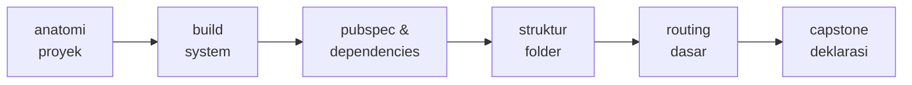
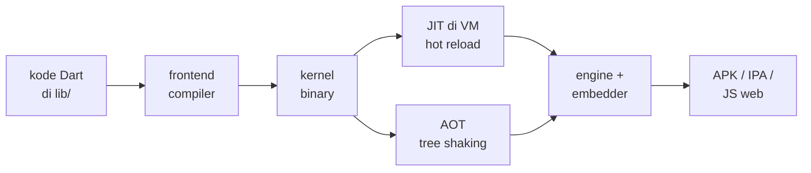
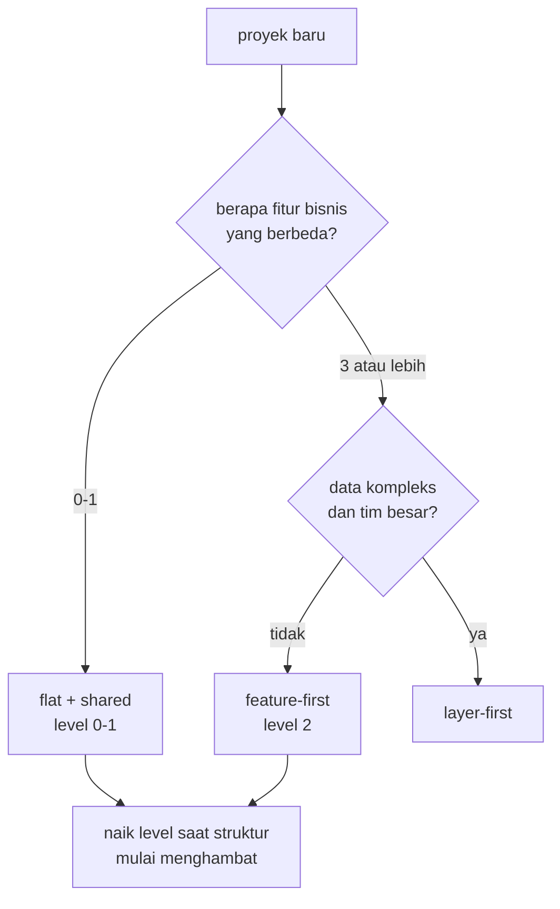

<!-- _class: title -->
<!-- _paginate: false -->

# Pertemuan 4
## Build System & Project Structure

Gradle & toolchain · Struktur proyek · pubspec & dependencies · Routing dasar

**Sub-CPMK92.1** — mampu merancang arsitektur UI aplikasi yang konsisten dan responsif
Bacaan: modul-buku bab 4 · Praktikum: `starter-code/p04-project-structure`

<div class="pengajar">

**Fahri Firdausillah, S.Kom, M.CS**
Teknik Informatika — Universitas Dian Nuswantoro

</div>

---

## Setelah pertemuan ini, Anda bisa

1. **Menjelaskan perjalanan kode Dart menjadi aplikasi**: kompilasi kernel, build mode, hot reload, dan tree shaking.
2. **Membaca dan mengubah `pubspec.yaml` dengan sengaja**: batas versi SDK, dependency, dev dependency, dan assets.
3. **Membaca konfigurasi Android modern (Kotlin DSL)** dan tahu bagian mana yang tidak perlu disentuh.
4. **Memilih struktur folder sesuai skala aplikasi** dan menyusun routing dasar dengan named routes.
5. **Menyusun deklarasi proyek capstone**: domain, masalah, layar utama, dan stack.

<div class="note">

Pekan lalu Tracker hidup utuh — navigasi, state, dialog tambah — tapi semuanya menumpuk di `lib/main.dart`. **Hari ini aplikasi itu mendapat aturan main untuk tumbuh:** ke mana file baru pergi, kapan dependency ditambah, dan capstone resmi dimulai.

</div>

---

## Peta perjalanan hari ini

Bukan lima topik terpisah — satu proyek yang hari ini mendapat aturan mainnya, lalu proyek Anda sendiri:



Empat segmen pertama memakai proyek yang sama; segmen terakhir sepenuhnya milik Anda.

Persiapan: buka `starter-code/p04-project-structure` — kerangka folder `models/services/screens/widgets/utils` + named routes.

---

<!-- _class: section-break -->

# 1 · Build System

Dari kode Dart ke aplikasi yang berjalan

---

## Anatomi proyek hasil `flutter create`

`flutter create tracker` menghasilkan proyek yang langsung bisa dijalankan — bukan kerangka kosong:

```text
tracker/
├── lib/                   # kode aplikasi Anda
│   └── main.dart
├── test/                  # dijalankan flutter test
├── android/  ios/  web/   # host aplikasi per platform
├── pubspec.yaml           # identitas, dependency, assets
├── pubspec.lock           # versi terkunci hasil pub get
└── analysis_options.yaml  # aturan linter
```

<div class="ok">

**Aturan praktis:** sehari-hari Anda hidup di `lib/`, `test/`, dan `pubspec.yaml`. Folder `android/` dan `ios/` hanya disentuh untuk pengaturan platform — dan mengedit isinya secara massal hampir selalu kesalahan.

</div>

---

## `flutter run` bukan satu tombol

Tahap pertama selalu sama: frontend compiler mengubah kode Dart menjadi **kernel binary**. Yang membedakan adalah ke mana kernel itu pergi:



Mode **debug** menjalankan kernel dengan JIT sehingga kode baru bisa disuntikkan ke proses yang sedang berjalan — itulah mesin di balik hot reload. Mode **release** mengompilasi AOT menjadi kode mesin target, dengan tree shaking membuang kode tak terpakai agar aplikasi ramping.

---

## Tiga build mode

| Mode | Kompilasi | Ukuran | Kecepatan | Dipakai untuk |
|---|---|---|---|---|
| `debug` | JIT | besar | lambat | pengembangan harian: hot reload, assertions on |
| `profile` | AOT | sedang | dekat rilis | mengukur performa realistis di DevTools |
| `release` | AOT | kecil | tercepat | distribusi ke pengguna |

<div class="warn">

**Mode `profile` paling sering dilupakan.** Mengukur performa di build debug menghasilkan angka yang menyesatkan — assertions dan overhead JIT ikut terukur. Sejak sekarang, klaim "aplikasinya lambat" hanya sah bila diukur di mode profile.

</div>

---

## Hot reload, hot restart, cold build

Tiga istilah yang sering tertukar:

- **Hot reload** (`r`): kode baru disuntikkan, **state aplikasi dipertahankan**. Tiga tugas yang Anda tambahkan tetap ada setelah warna chip diubah — inilah alasan iterasi UI di Flutter terasa cepat.
- **Hot restart** (`R`): kode dimuat ulang, **state kembali ke awal**. Dipakai saat perubahan menyentuh `main()` atau `initState` yang ingin diulang dari nol.
- **Cold build** (`flutter run` ulang): proses dibangun dari awal. Wajib saat dependency baru, perubahan manifest, atau `pubspec.yaml` berubah.

<div class="note">

Ketergantungan pada hot reload menjelaskan disiplin bab 3: alokasi di `initState`, pembersihan di `dispose` — agar state tetap sehat lintas ratusan reload. State yang bocor akan terasa: daftar tugas berlipat, controller mati dipakai lagi.

</div>

---

## Perintah yang perlu dikenal

```bash
flutter run                 # debug + hot reload
flutter run --profile       # mode profil performa
flutter analyze             # periksa kode terhadap linter
flutter test                # jalankan seluruh test di test/
flutter build apk --debug   # APK debug
flutter build appbundle     # AAB release (bab 14)
flutter clean               # hapus artefak build saat keadaan aneh
```

`flutter clean` adalah **palu terakhir, bukan rutinitas**. Sebelum menyentuhnya, baca dulu pesan errornya — mayoritas masalah build punya penyebab spesifik yang ditulis di log.

---

## Environment berbeda: `--dart-define`

Cara termurah membedakan lingkungan dev dan produksi — tanpa file konfigurasi tambahan:

```bash
flutter run --dart-define=APP_ENV=dev
flutter build apk --dart-define=APP_ENV=prod
```

```dart
const appEnv = String.fromEnvironment('APP_ENV', defaultValue: 'dev');

// Konstanta kompilasi: cabang yang tidak terpilih
// ikut ter-tree-shake dari build.
if (appEnv == 'dev') {
  // pengaturan khusus pengembangan
}
```

Karena `String.fromEnvironment` berlaku saat kompilasi, cabang environment yang tidak terpilih **benar-benar hilang dari binary** — log dev tidak pernah terbawa ke APK produksi. Tracker memakai pola ini di bab 9 untuk alamat API.

Kebutuhan yang tak bisa ia penuhi — dua aplikasi berdampingan dengan ikon berbeda — menuntut **flavor**, dibahas tuntas di bab 14.

---

<!-- _class: section-break -->

# 2 · pubspec.yaml

Pusat kendali semua yang masuk dari luar kode Dart

---

<!-- _class: split split-wide -->

## Satu file, banyak keputusan

```yaml
name: tracker
description: Aplikasi pencatat tugas.
publish_to: 'none'
version: 1.0.0+1

environment:
  sdk: ^3.11.0

dependencies:
  flutter:
    sdk: flutter

dev_dependencies:
  flutter_test:
    sdk: flutter
  flutter_lints: ^6.0.0

flutter:
  uses-material-design: true
```

<div>

- **`name`** menjadi nama package Dart — semua `import 'package:tracker/...'` merujuknya. Huruf kecil + underscore, tanpa strip.
- **`publish_to: 'none'`** — aplikasi, bukan package untuk pub.dev.
- **`version: 1.0.0+1`** — format `versi+build`; angka build naik tiap rilis.
- **`environment.sdk`** membatasi versi Dart yang boleh membangun. Salin dari template, jangan dari ingatan — setiap kenaikan menutup pintu toolchain lama.
- **`dependencies`** ikut terbang ke aplikasi; **`dev_dependencies`** hanya saat pengembangan — `flutter_test` tidak menambah ukuran APK.

</div>

---

## Menambah dependency: lewat perintah, bukan edit manual

```bash
flutter pub add http                # dependency aplikasi
flutter pub add --dev build_runner  # dev dependency
flutter pub get                     # pasang sesuai pubspec
```

`flutter pub add http` menuliskan `http: ^1.x.y` dengan versi terbaru yang kompatibel **sekaligus** menjalankan `pub get` — bukan mengedit YAML manual lalu berdoa.

Notasi caret adalah ringkasan semantic versioning yang perlu Anda pegang di tahap ini:

`^1.2.3` mengizinkan `1.9.0` namun menolak `2.0.0`. Major version naik berarti ada perubahan yang bisa memutus kode Anda — caret menjauhkannya secara otomatis.

---

## `pubspec.yaml` vs `pubspec.lock`

<div class="ok">

**`pubspec.yaml` adalah keinginan Anda** — batas dan aturan versi.
**`pubspec.lock` adalah komprominya** — versi persis hasil `pub get` menyelesaikan grafik dependency.

</div>

- Untuk **aplikasi**: commit `pubspec.lock` — rekan tim dan CI membangun dengan versi yang sama persis.
- Untuk **package** yang akan dipublikasikan: jangan commit — konsumen menyelesaikan versinya sendiri.
- **Jangan pernah mengedit lock dengan tangan.**

`.dart_tool/package_config.json` adalah artefak internal — abaikan saja.

---

## Prinsip dependency minimal

Godaan besar setelah paham pubspec: memasang semua paket yang "kelak pasti dipakai" — state management, database, charts. **Tahan.**

Setiap dependency adalah biaya: versi yang harus mengikuti rilis Flutter, permukaan API yang bisa berubah, dan permission platform yang bisa ikut aktif diam-diam lewat manifest paket.

<div class="warn">

**Aturan buku ini: paket ditambahkan pada bab yang mengimplementasikan fiturnya, tidak lebih awal.** `shared_preferences` hadir di bab 7, `http` di bab 9, `sqflite` di bab 8 dan 10. Sampai di titik ini Tracker justru membuktikan sebaliknya: aplikasi berfungsi penuh — model, state, navigasi — tanpa satu pun paket pihak ketiga.

**Dependency yang tidak ada tidak bisa rusak.**

</div>

---

## Assets: didaftarkan eksplisit

```yaml
flutter:
  uses-material-design: true
  assets:
    - assets/images/empty_state.png
    - assets/data/
```

Dua perilaku yang membedakan:

- Mendaftarkan satu **file** hanya memasukkan file itu; satu **direktori** (`assets/data/`) memasukkan semua isinya **tanpa** menelusuri subdirektori.
- Sediakan `2.0x/` dan `3.0x/` untuk gambar penting; Flutter memilih varian resolusi sesuai kepadatan layar.

<div class="warn">

Aset yang lupa didaftarkan memunculkan `Unable to load asset` **saat runtime, bukan saat build**. Kebiasaan penghemat waktu: setelah menambah aset, jalankan ulang aplikasi (cold build — `pubspec.yaml` berubah) sebelum menuduh kodenya salah.

</div>

---

## `analysis_options.yaml` — gerbang kualitas termurah

```yaml
include: package:flutter_lints/flutter.yaml

linter:
  rules:
    prefer_const_constructors: true
    prefer_final_locals: true
    avoid_print: true
```

Satu baris `include` mengaktifkan aturan resmi tim Flutter; blok `linter` memperketatnya. `avoid_print` layak ditegakkan sejak awal: **`print` yang tertinggal ikut ke build release** — untuk mencatat sesuatu, pakai `dart developer.log` yang tampil di DevTools dan tidak menodai aplikasi rilis.

Semua aturan dijalankan `flutter analyze` dan ditandai langsung oleh editor. Menjaga hijau sejak baris pertama jauh lebih murah daripada menumpuk utang lalu membereskan seratus peringatan sekaligus.

---

<!-- _class: section-break -->

# 3 · Konfigurasi Android

Kotlin DSL, variabel Flutter, dan permission yang tepat waktu

---

<!-- _class: code-dense -->

## `android/app/build.gradle.kts` bentuk modern

Sejak Flutter 3.29 template Android memakai Gradle **Kotlin DSL** — tutorial lama yang menampilkan `def` dan `apply plugin:` di file `.gradle` adalah tulisan era sebelumnya.

```kotlin
android {
    namespace = "com.example.tracker"
    compileSdk = flutter.compileSdkVersion
    ndkVersion = flutter.ndkVersion

    defaultConfig {
        applicationId = "com.example.tracker"
        minSdk = flutter.minSdkVersion
        targetSdk = flutter.targetSdkVersion
        versionCode = flutter.versionCode
        versionName = flutter.versionName
    }

    buildTypes {
        release {
            signingConfig = signingConfigs.getByName("debug")
        }
    }
}
```

---

## Mengapa tidak ada satu pun angka SDK manual?

`flutter.compileSdkVersion`, `flutter.minSdkVersion`, `flutter.targetSdkVersion` adalah **variabel yang diinjeksi Flutter tooling** — nilainya berpindah otomatis saat toolchain diperbarui. `versionCode` dan `versionName` diambil dari `version:` di `pubspec.yaml`, sehingga sumber kebenaran versi tetap satu.

Kebijakan Google Play mewajibkan aplikasi menargetkan API level tertentu untuk bisa diperbarui — target API 36 (Android 16) berlaku untuk update sejak 31 Agustus 2026, dan syarat itu terus naik.

<div class="ok">

Kode yang memakai variabel template hanya perlu **memperbarui Flutter**. Kode yang menulis `targetSdkVersion 34` manual akan menolak dijalankan berbulan-bulan kemudian **tanpa ada yang menyentuhnya**.

</div>

Bagian `signingConfig` memakai kunci debug agar `flutter run --release` bisa dicoba — bawaan template. Signing sungguhan menanti bab 14.

---

## Permission: ditambah saat fiturnya hadir

Buka `AndroidManifest.xml` hasil template — Anda tidak akan menemukan satu pun `<uses-permission>`. Itulah kondisi yang benar.

- Internet untuk **pengembangan** (hot reload, DevTools) diurus manifest `debug/` dan `profile/` khusus — ia tidak otomatis ada di build release. Baris `INTERNET` ditambahkan ke manifest utama saat Tracker mulai memanggil REST API di bab 9.
- Photo picker modern Android **tidak butuh** permission storage — picker berjalan di proses sistem dan hanya mengembalikan file yang dipilih. Menulis `READ_EXTERNAL_STORAGE` untuk itu sudah usang.
- Permission lokasi baru relevan di bab 12 bersama `geolocator`.

<div class="warn">

Menahan permission sampai fiturnya ada bukan sekadar kerapian: **setiap permission tampil ke pengguna saat instal** dan menurunkan kepercayaan bila gunanya tidak jelas.

</div>

---

<!-- _class: section-break -->

# 4 · Struktur Folder & Routing

Naik tingkat saat rasa sakitnya nyata, bukan sebelumnya

---

## Mulai kecil, naik saat sesak

**Level 0** — Tracker Anda saat ini; lima kelas yang masih terbaca sekali gulung:

```text
lib/
├── main.dart          # app, list, tile, detail — semua di sini
└── models/
    ├── task.dart
    └── task_repository.dart
```

Marker level ini mulai sesak: file melebihi ~300 baris, atau Anda scroll jauh antar kelas yang diedit bersama.

**Level 1** — pecah menurut peran, bukan menurut fitur:

```text
lib/
├── main.dart          # main() + TrackerApp saja
├── screens/           # task_list, task_detail
├── widgets/           # priority_chip (dipakai lintas layar)
└── models/            # task, task_repository
```

Aplikasi dua-tiga layar hidup nyaman lama di level ini.

---

## Level 2: feature-first saat fitur benar-benar beragam

Kuncinya memahami apa itu "fitur": **bukan layar, melainkan kapabilitas** yang punya model data dan aturan sendiri — `auth` (login, sesi), `tasks` (CRUD tugas), `analytics` (rekap). `TaskDetailScreen` bukan fitur; ia layar di dalam fitur *tasks*.

```text
lib/
├── main.dart
├── features/
│   ├── auth/
│   │   ├── models/  screens/  widgets/
│   └── tasks/
│       ├── models/  screens/  widgets/
└── shared/
    ├── widgets/  theme/  utils/
```

**Keunggulan:** satu folder = satu kapabilitas yang dikembangkan relatif mandiri; dua orang mengerjakan dua fitur tanpa saling menabrak file.

**Harga:** file peran sama (semua `models/`) tersebar, dan struktur lebih dalam.

---

## Pembanding: layer-first

```text
lib/
├── data/          # repository, sumber data (API, database)
├── domain/        # model dan aturan bisnis
└── presentation/  # widget dan layar
```

Pola clean architecture: kontrak antar lapisan tegas, `domain` tidak tahu apa-apa tentang UI maupun HTTP — logika bisnis bisa dites tanpa emulator. Harganya juga nyata: satu perubahan kecil menyentuh tiga lapisan; untuk aplikasi dua layar, lapisan hanya menambah jarak antara sebab dan akibat.

| Aspek | Flat + shared | Feature-first | Layer-first |
|---|---|---|---|
| Cocok untuk | 1–3 layar | 3+ fitur bisnis | data kompleks, tim besar |
| Biaya awal | minimal | sedang | tinggi |
| Menambah fitur | mudah jadi campur aduk | folder baru, mandiri | menyentuh banyak lapisan |
| Kapan berlebihan | setelah ~3 fitur | fitur masih 1 | hampir selalu, untuk kecil |

---

## Kapan naik level?



Untuk Tracker, keputusannya eksplisit: **tetap di level 0–1** selama bab-bab UI, menimbang naik ke feature-first saat penyimpanan dan autentikasi hadir di bab 8–9. Refactor struktur folder murah — pindah file, betulkan import — jadi menunda keputusan tidak menutup pintu apa pun.

**Yang mahal adalah menjalani kompleksitas yang belum dibutuhkan.**

---

## Struktur starter hari ini — pola acuan capstone

Starter P04 memakai bentuk level 1 dengan satu folder tambahan:

```text
lib/
├── main.dart            # wiring MaterialApp + routes
├── app_routes.dart      # pusat nama route
├── models/              # Task (pindahan dari P03)
├── services/            # sumber data: statis → API/SQLite
├── screens/             # home, task list
├── widgets/             # TaskCard (dipakai lintas layar)
└── utils/               # AppColors, AppSpacing
```

`services/` adalah tempat `TaskRepository` bab 3 berlabuh: layar tinggal memanggil, tidak perlu peduli data datang dari memori, API, atau SQLite.

<div class="note">

Capstone Anda **tidak wajib Flutter** — stack bebas dan rubrik menilai hasil. Tapi pemisahan `models / services / screens / widgets / utils` adalah pola pemisahan concern yang berlaku di stack apa pun.

</div>

---

<!-- _class: split -->

## Routing dasar: satu rumah untuk nama route

```dart
/// Pusat nama route — hindari string
/// tersebar di banyak file.
class AppRoutes {
  static const home = '/';
  static const taskList = '/tasks';

  // TODO(student): tambahkan '/tasks/new'
}
```

<div>

String route yang ditulis langsung di banyak file — `Navigator.pushNamed(context, '/tasks')` — adalah **magic string**: salah ketik satu huruf, error baru muncul saat runtime.

Kelas konstanta memberi nama route satu rumah: salah ketik jadi error kompilasi, dan IDE bisa menelusuri pemakaian tiap route.

Titik ini juga tempat alami untuk hal yang datang belakangan: guard autentikasi, route arguments, deep link.

</div>

---

<!-- _class: split split-wide -->

## Memasang routes di `MaterialApp`

```dart
MaterialApp(
  routes: {
    AppRoutes.home:
        (_) => const HomeScreen(),
    AppRoutes.taskList:
        (_) => const TaskListScreen(),
  },
  // Route yang belum terdaftar jatuh ke sini —
  // satu tempat guard/error handling.
  onGenerateRoute: (settings) {
    return MaterialPageRoute<void>(
      builder: (_) => const Scaffold(
        body: Center(
          child: Text('Route belum terdaftar'),
        ),
      ),
    );
  },
)
```

<div>

Peta `routes` untuk layar yang selalu sama; `onGenerateRoute` untuk sisanya — termasuk route yang perlu membaca `settings.arguments`.

Karena semua nama hidup di `AppRoutes`, menambah layar = tambah satu konstanta + satu baris di sini. Bukan mencari string `/tasks` di sepuluh file.

</div>

---

<!-- _class: section-break -->

# 5 · CAPSTONE

Deklarasi proyek — satu halaman, syarat ikut Gate 1 (P07)

---

## CAPSTONE START: pilih domain Anda

Proyek **individual** sepanjang semester — bobot 40% — dibangun bertahap lewat empat gate. Hari ini dimulai dari keputusan pertamanya: domain.

- **Local Business Solutions** — pemesanan warung/restoran, marketplace lokal, booking layanan, manajemen inventaris
- **Educational Technology** — LMS, platform asesmen, pengelolaan konten belajar, alat produktivitas mahasiswa
- **Health & Wellness** — pelacak kesehatan pribadi, pendukung telemedisin, pelacak kebugaran/nutrisi, pendamping kesehatan mental

<div class="warn">

**Topik harus berbeda dari StudyTracker.** Tracker adalah contoh yang dibedah di kelas; capstone menilai kemampuan Anda memindahkan pemahaman itu ke masalah lain. Stack bebas — Flutter hanyalah jalan yang paling mudah didukung modul.

</div>

---

## Deklarasi Proyek: satu halaman, empat hal

Ditulis **sendiri**, satu halaman. Tidak dinilai — tapi tanpa dia, Anda tidak ikut Gate 1.

1. **Domain dan masalah** yang diselesaikan, satu paragraf: untuk siapa, dan kenapa masalah itu nyata.
2. **Tiga sampai lima layar utama** — boleh sketsa tangan yang difoto. Wireframe + user flow.
3. **Stack yang dipilih** dan alasannya, satu kalimat.
4. **Satu hal yang belum Anda tahu caranya**, dan rencana mencarinya.

<div class="ok">

**Butir 4 justru yang paling berguna.** Proposal yang semua bagiannya sudah dikuasai penulisnya biasanya pertanda proyeknya terlalu kecil.

</div>

---

## Bentuk penyerahan gate — tiga hal, tidak pernah berubah

Yang dinilai adalah **repo, bukan laporan tentang repo**. Tidak ada dokumen penyerahan terpisah:

1. **Tag di repo**: `gate-1` sampai `gate-4`. Tag dibuat sebelum tenggat; commit setelah tag tidak dinilai.
2. **Satu blok baru di `CHANGELOG.md`**, maksimal satu halaman: **Jadi** (apa yang berfungsi) · **Macet** (apa yang gagal + dugaan penyebab) · **Keputusan** (satu keputusan teknis + alasan + alternatif yang ditolak) · **AI** (deklarasi pemakaian).
3. **Video demo 5 menit**, unlisted di YouTube, tautannya di CHANGELOG: satu alur utama dijalankan penuh + narasi satu keputusan teknis.

<div class="note">

**Gate yang jujur melaporkan kegagalan bernilai lebih tinggi** daripada gate yang mengaku lancar lalu tidak terbukti di video. Kualitas produksi tidak dinilai — rekaman layar bersuara sudah cukup.

</div>

---

## Praktikum hari ini

**Target:** proposal capstone + kerangka proyek yang siap tumbuh, dengan starter P04 sebagai pola.

1. **Pilih domain** capstone: Local Business / EdTech / Health & Wellness
2. **Tulis deklarasi proyek** satu halaman — domain & masalah, 3–5 layar, stack + alasan, satu hal yang belum Anda ketahui
3. **Rancang wireframe + user flow** layar utama; StudyTracker adalah pola referensi, bukan template yang disalin
4. **Susun struktur folder** bersih `models/ services/ screens/ widgets/ utils/` — pindahkan `Task`, `TaskCard`, dan service statis dari starter P03
5. **Konfigurasi `pubspec.yaml`**: aktifkan dependensi yang dibutuhkan proposal (provider, sqflite, image_picker, geolocator) satu per satu — `flutter pub get` tiap kali, amati `pubspec.lock` berubah
6. **Routing dasar**: tambahkan route `/tasks/new` lewat konstanta `AppRoutes` + `onGenerateRoute`

<div class="warn">

**Error-First Learning.** Pubspec dengan indentasi rusak adalah error paling umum hari ini — baca pesannya, tebak penyebabnya, baru perbaiki.

</div>

Starter: `starter-code/p04-*` · Deklarasi dikumpulkan lewat Moodle

---

## Bekerja dengan AI di materi ini

Peran AI dalam materi ini dibatasi: **debugging dan pesan error saja.**

**Pantas didelegasikan**
Menafsirkan kegagalan build yang pesannya panjang — kegagalan build biasanya berisi ratusan baris dengan penyebab sebenarnya terselip di tengah. Menanyakan arti pesan error konfigurasi yang tidak Anda kenal.

**Tulis sendiri**
Proposal capstone, keputusan struktur folder, dan wireframe Anda. Struktur yang benar bergantung pada bentuk aplikasi Anda dan cara Anda mencari berkas; struktur yang disalin dari jawaban umum akan terasa asing setiap kali Anda membukanya. Bagian ini yang menentukan apakah materi ini benar-benar Anda kuasai.

<div class="note">

**Latihan:** tempelkan satu kegagalan build lengkap ke AI dan minta ia menunjuk baris yang benar-benar menyebabkannya. Sesudahnya, temukan sendiri baris itu di log tanpa melihat jawaban AI, dan bandingkan.

</div>

---

## Ringkasan

- **Pekerjaan harian ada di `lib/`, `test/`, dan `pubspec.yaml`**; folder platform hanya untuk pengaturan platform — jangan diedit massal.
- **Debug = JIT + hot reload dengan state dipertahankan; release = AOT + tree shaking; ukur performa di mode profile.**
- **`pubspec.yaml` adalah pusat kendali**: paket ditambah `flutter pub add` saat fiturnya diimplementasikan; aplikasi meng-commit `pubspec.lock`; aset didaftarkan eksplisit.
- **Konfigurasi Android modern = Kotlin DSL dengan variabel `flutter.*`**, tanpa satu angka SDK manual — kebijakan Play dikejar lewat pembaruan toolchain.
- **Permission ditambahkan bersama fiturnya**; photo picker modern tidak butuh permission storage.
- **Struktur folder naik mengikuti skala**: flat, lalu shared, lalu feature-first; layer-first pembanding sah untuk data kompleks, bukan pakaian default.
- **Named routes terpusat di satu kelas konstanta** — menghindari magic string yang baru meledak saat runtime.
- **Capstone dimulai**: deklarasi proyek satu halaman adalah syarat ikut Gate 1; penyerahan gate = tag repo + blok CHANGELOG + video 5 menit.

---

<!-- _class: section-break -->

# Pertemuan berikutnya

**P05 — UI Design & Material Design Implementation**
Material 3, custom theme, dan **CAPSTONE: UI foundation phase**

Tracker hari ini masih tampilan default `MaterialApp` — berfungsi, tapi belum punya identitas.
Bab 5 memberi wajah: color scheme, tipografi, dan komponen Material 3.

Baca sebelum kelas: modul-buku bab 5
