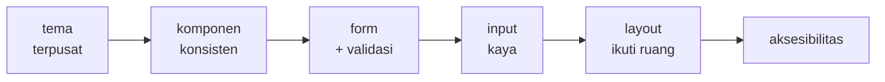
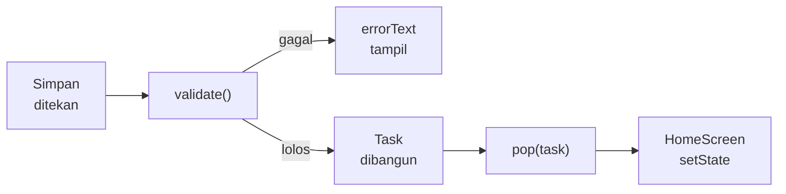
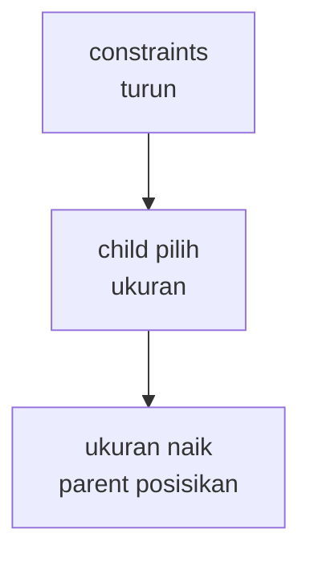

<!-- _class: title -->
<!-- _paginate: false -->

# Pertemuan 5
## UI Design & Material Design Implementation

Material 3 · ThemeData · Komponen UI · Form & input · CAPSTONE: UI foundation

**Sub-CPMK92.1** — mampu merancang arsitektur UI aplikasi yang konsisten dan responsif
Bacaan: modul-buku bab 5 · Praktikum: `starter-code/p05-material-form`

<div class="pengajar">

**Fahri Firdausillah, S.Kom, M.CS**
Teknik Informatika — Universitas Dian Nuswantoro

</div>

---

## Setelah pertemuan ini, Anda bisa

1. **Membangun tema Material 3 terpusat** dengan `ColorScheme.fromSeed` dan memilih peran warna yang tepat untuk setiap elemen.
2. **Menyatukan tampilan lewat tema** — `cardTheme`, `inputDecorationTheme`, AppBar, dan FAB konsisten tanpa style manual per widget.
3. **Menyusun form tambah/edit assignment** dengan `TextFormField` + validasi, dropdown kategori, date picker, dan pilihan prioritas `ChoiceChip`.
4. **Membuat layout yang mengikuti ruang** lewat `LayoutBuilder` dan `ConstrainedBox`, serta bertahan saat text scale membesar.
5. **Menerapkan fondasi aksesibilitas Material**: kontras lewat peran warna, target sentuh, semantics, dan `tooltip`.

<div class="note">

Bab 3–4 membangun kerangka: widget, navigasi, struktur proyek. Tampilannya masih "templatenya Flutter". **Hari ini lapisan tampilan diisi sistematis** — dan sekaligus membuka fase UI foundation capstone Anda.

</div>

---

## Peta perjalanan hari ini

Satu sistem tema yang menetes ke seluruh komponen dan form, bukan style tersebar per layar:



Persiapan: buka `starter-code/p05-material-form`, jalankan `flutter run`.
Model `Task` sudah membawa `category`, `priority`, `dueDate` — hari ini semuanya mendapat tampilan dan input.

---

<!-- _class: section-break -->

# 1 · Material Design

Peran warna dari satu benih, bukan katalog warna

---

## Material 3: sistem, bukan katalog warna

Material 3 (M3) aktif sebagai tampilan bawaan Flutter sejak versi 3.16 — `ThemeData()` sekarang berarti Material 3. Yang berubah dibanding tulisan tutorial era sebelumnya adalah cara berpikirnya: M3 tidak menyuruh Anda memilih warna, melainkan memilih **peran** warna. `primary` untuk tombol utama, `surface` untuk latar kartu, `error` untuk keadaan gagal. Nilai pasti tiap peran diturunkan dari satu warna benih:

```dart
final scheme = ColorScheme.fromSeed(seedColor: Color(0xFF00695C));
```

Dari satu benih hijau tua itu Flutter membangun puluhan warna yang saling selaras: versi terang dan gelap, varian tonal untuk kontainer.

<div class="ok">

**Mengganti identitas visual aplikasi nanti cukup mengganti satu baris ini** — itulah makna tema sebagai sistem, bukan dekorasi.

</div>

---

## `theme.dart` — satu sumber kebenaran tampilan

```dart
import 'package:flutter/material.dart';

/// Theme terpusat: satu sumber kebenaran visual StudyTracker.
abstract final class AppTheme {
  static const seed = Color(0xFF00695C);

  static ThemeData light() {
    return ThemeData(
      useMaterial3: true,
      colorScheme: ColorScheme.fromSeed(seedColor: seed),
    );
  }
}
```

`abstract final class` membuat kelas ini tidak bisa diinstansiasi — ia sekadar kumpulan konstanta dan fungsi tema, dan Dart 3 menyediakan sintaks itu persis untuk kebutuhan ini. Di `main.dart` tinggal `theme: AppTheme.light()`.

Ganti `seed`, seluruh aplikasi berubah nuansa — bukti satu sumber kebenaran bekerja.

---

## Peran-peran yang dipakai StudyTracker

| Peran | Dipakai untuk | Di StudyTracker |
|---|---|---|
| `primary` / `onPrimary` | tombol utama dan isinya | `FilledButton` "Simpan", FAB |
| `surface` / `onSurface` | latar kartu, teks utama | `Card`, judul tugas |
| `onSurfaceVariant` | teks sekunder | subtitle, tenggat normal |
| `error` / `onError` | keadaan gagal | tenggat terlambat, pesan validator |
| `secondaryContainer` / `onSecondaryContainer` | aksen tonal | chip prioritas |

<div class="note">

Perhatikan polanya: peran kontainer **selalu berpasangan** dengan peran `on`-nya (`errorContainer` dengan `onErrorContainer`). Pasangan ini dirancang sistem agar kontrasnya memadai.

</div>

---

## Pasangan tonal & migrasi `withValues`

```dart
// pasangan tonal — kontrasnya dijamin sistem
final background = scheme.errorContainer;   // latar
final foreground = scheme.onErrorContainer; // teks di atasnya

// usang sejak Flutter 3.27 → penggantinya
color.withOpacity(0.12)
color.withValues(alpha: 0.12)
```

`withValues` perilakunya sama untuk kebutuhan umum, tetapi mendukung gamut warna yang lebih lebar — semua kode di buku memakainya.

<div class="warn">

Memakai warna acak untuk teks di atas warna acak adalah cara paling umum **merusak keterbacaan** — dan akan kembali menghantui di bagian aksesibilitas. Ambil dari pasangan perannya, bukan pilih sendiri.

</div>

---

<!-- _class: split -->

## Teks dari `textTheme`, bukan `fontSize`

```dart
Text(
  task.title,
  style: Theme.of(context)
      .textTheme
      .titleMedium
      ?.copyWith(
        fontWeight:
            FontWeight.w600,
      ),
)
```

<div>

Skala tipografi M3 sudah berhierarki: `titleMedium`, `labelSmall`, `bodyMedium` punya ukuran dan bobot yang **dirancang saling melengkapi**.

`fontSize: 17` manual menghapus konsistensi itu — angka Anda tidak tahu apa-apa tentang hierarki tema.

`copyWith` menimpa minimal: hanya bobot yang diubah, sisanya tetap dari tema. Ubah tema, semua teks ikut.

</div>

---

<!-- _class: section-break -->

# 2 · Komponen Konsisten

AppBar, Card, FAB, dan input dari satu tema

---

## Aturan konsistensi: tiga sumber gaya

1. **Warna dari `colorScheme`** — dibaca lewat `Theme.of(context)`, bukan `Color(0xFF...)` tersebar di tiap layar.
2. **Teks dari `textTheme`** — peran tipografi, bukan angka manual.
3. **Spacing seragam** — jarak yang setara memakai angka yang setara, bukan 8, 10, 12, 16 bergilir per layar.

```dart
const SizedBox(height: 12);   // jarak antar input — angka yang
                              // sama di seluruh form
```

<div class="ok">

**Aturan uji sederhana:** bila satu nilai perlu diganti, berapa tempat yang harus diubah? Kalau jawabannya "banyak", gaya itu belum konsisten.

</div>

---

## Rumah untuk tema — struktur level 1

```
lib/
├── main.dart              # main() + StudyTrackerApp saja
├── theme/app_theme.dart   # tema terpusat (baru hari ini)
├── models/task.dart       # Task, Priority, categories
└── screens/
    ├── home_screen.dart
    └── task_form_screen.dart
```

Aturan bab 4: naik struktur saat rasa sakitnya nyata. Rasanya kini nyata — `main.dart` menampung tema dan layar sekaligus, tema baru tidak punya rumah.

`main.dart` pun mengecil: `theme: AppTheme.light()`, `home: const HomeScreen()`. Pemindahan file dan import; tidak ada logika yang berubah.

---

<!-- _class: code-dense -->

## Kustomisasi tema: sekali untuk semua widget

```dart
static ThemeData light() {
  final scheme = ColorScheme.fromSeed(seedColor: seed);

  return ThemeData(
    useMaterial3: true,
    colorScheme: scheme,
    cardTheme: const CardThemeData(elevation: 2),
    inputDecorationTheme: const InputDecorationTheme(
      border: OutlineInputBorder(),
      contentPadding: EdgeInsets.symmetric(
        horizontal: 16,
        vertical: 12,
      ),
    ),
  );
}
```

Kenapa lewat tema: elevasi kartu dan bentuk input ditetapkan sekali, lalu **semua** `Card` dan `TextFormField` mengikuti — properti `border:` per-field boleh dihapus. Konsistensi lewat penghapusan kode, bukan penambahan.

---

## Kartu daftar tugas

```dart
return Card(
  child: ListTile(
    title: Text(t.title),
    subtitle: Text('${t.category} • ${t.priority.name}'),
  ),
);
```

`Card` menyediakan latar `surface` dan elevasi dari `cardTheme`; `ListTile` memberi padding serta susunan leading/title/subtitle standar. Jarak antar kartu dijaga `ListView.separated` — satu tempat mengatur spacing daftar, bukan margin acak per item.

---

## AppBar & FloatingActionButton

```dart
Scaffold(
  appBar: AppBar(title: const Text('StudyTracker')),
  floatingActionButton: FloatingActionButton(
    tooltip: 'Tambah tugas',        // label semantik + hover
    onPressed: _openForm,
    child: const Icon(Icons.add),
  ),
)
```

Perhatikan: `AppBar` di sini polos, tanpa satu properti style — dan itulah poinnya. Warna latar dan tipografi judulnya mengikuti tema, semua layar otomatis seragam. FAB menampung **satu aksi utama** per layar; `tooltip`-nya berfungsi ganda: label saat hover dan label untuk pembaca layar.

---

<!-- _class: code-dense -->

## `TaskCard` — komponen kanonik, bagian 1

```dart
class TaskCard extends StatelessWidget {
  const TaskCard({
    super.key,
    required this.task,
    required this.onToggle,
    required this.onTap,
  });

  final Task task;
  final ValueChanged<bool?> onToggle;
  final VoidCallback onTap;

  @override
  Widget build(BuildContext context) {
    final theme = Theme.of(context);
    return Card(
      margin: const EdgeInsets.only(bottom: 8),
      child: InkWell(              // seluruh kartu = area sentuh
        onTap: onTap,
        child: Padding(
          padding: const EdgeInsets.all(8),
          child: Row(
            children: [
              Checkbox(value: task.done, onChanged: onToggle),
              const SizedBox(width: 8),
              // isi kartu — slide berikutnya
            ],
          ),
        ),
      ),
    );
  }
}
```

Kontraknya jelas: menerima `task` + dua callback; stateless, tidak memegang state dan tidak tahu cara memperoleh data. `InkWell` **di dalam** `Card` menjadikan seluruh kartu area sentuh dengan ripple Material — tata letaknya milik kita sepenuhnya.

---

<!-- _class: code-dense -->

## `TaskCard` — bagian 2: isi yang tahan membesar

```dart
              // menggantikan komentar di slide sebelumnya:
              Expanded(
                child: Column(
                  crossAxisAlignment: CrossAxisAlignment.start,
                  children: [
                    Text(
                      task.title,
                      maxLines: 2,
                      overflow: TextOverflow.ellipsis,
                      style: theme.textTheme.titleMedium?.copyWith(
                        fontWeight: FontWeight.w600,
                      ),
                    ),
                    const SizedBox(height: 4),
                    // Wrap, bukan Row: saat text scale besar,
                    // label turun ke baris berikutnya, bukan overflow.
                    Wrap(
                      spacing: 8,
                      runSpacing: 4,
                      children: [
                        PriorityChip(priority: task.priority),
                        if (task.dueDate != null)
                          Text(
                              'Tenggat ${task.dueDate!.day}/${task.dueDate!.month}'),
                      ],
                    ),
                  ],
                ),
              ),
```

`Expanded` memberi kolom sisa lebar berapa pun itu; `maxLines: 2` + elipsis memotong judul panjang dengan rapi. Tiga teknik ini membuat kartu bertahan saat teks membesar — detailnya di segmen terakhir.

---

<!-- _class: code-dense -->

## `PriorityChip` — prioritas ke pasangan peran

```dart
class PriorityChip extends StatelessWidget {
  const PriorityChip({super.key, required this.priority});

  final Priority priority;

  @override
  Widget build(BuildContext context) {
    final scheme = Theme.of(context).colorScheme;
    final (background, foreground) = switch (priority) {
      Priority.high => (scheme.errorContainer, scheme.onErrorContainer),
      Priority.medium => (scheme.tertiaryContainer, scheme.onTertiaryContainer),
      Priority.low => (scheme.secondaryContainer, scheme.onSecondaryContainer),
    };

    return Container(
      padding: const EdgeInsets.symmetric(horizontal: 8, vertical: 4),
      decoration: BoxDecoration(
        color: background,
        borderRadius: BorderRadius.circular(8),
      ),
      child: Text(
        priority.label,
        style: Theme.of(context).textTheme.labelSmall
            ?.copyWith(color: foreground, fontWeight: FontWeight.w600),
      ),
    );
  }
}
```

Ekspresi `switch` yang mengembalikan record lalu di-destructuring adalah idiom Dart 3. Prioritas tinggi memakai pasangan **error tonal**, bukan merah pekat: tetap terbaca sebagai informasi tanpa berteriak.

---

## `InkWell` vs `GestureDetector`

Setiap widget interaktif Material membawa state bawaan: ditekan, di-hover, difokus, dinonaktifkan. `InkWell` otomatis mendapat ripple dan state highlight; `Checkbox` dan `FilledButton` mendapat warna statenya dari `ColorScheme` — tanpa satu baris kode dari Anda.

<div class="warn">

Justru karena itu: jangan mengganti widget interaktif dengan `Container` + `GestureDetector` demi "custom". Anda membuang state visual **sekaligus semantik aksesibilitasnya** — `GestureDetector` tidak tahu apa pun untuk pembaca layar; `InkWell` tahu ia sebuah tombol.

</div>

---

<!-- _class: section-break -->

# 3 · Form & Input

TextFormField, validasi, dropdown, date picker, chips

---

<!-- _class: code-dense -->

## Anatomi form: `Form` + `GlobalKey`

```dart
class _TaskFormScreenState extends State<TaskFormScreen> {
  final _formKey = GlobalKey<FormState>();
  final _titleCtrl = TextEditingController();
  final _descCtrl = TextEditingController();

  String _category = categories.first;
  DateTime? _dueDate;

  @override
  void dispose() {
    _titleCtrl.dispose();
    _descCtrl.dispose();
    super.dispose();
  }

  @override
  Widget build(BuildContext context) {
    return Scaffold(
      appBar: AppBar(title: const Text('Tambah Tugas')),
      body: Form(
        key: _formKey,
        child: ListView(        // bukan Column: bisa scroll
          padding: const EdgeInsets.all(16),
          children: [ /* field — slide berikutnya */ ],
        ),
      ),
    );
  }
}
```

`Form` membungkus semua field agar validasi terkoordinasi lewat satu kunci. `ListView`, bukan `Column`, agar seluruh form bisa scroll saat keyboard muncul. Controller tetap dibuang di `dispose` — pola P03 tidak berubah.

---

## `TextFormField` + validator

```dart
TextFormField(
  controller: _titleCtrl,
  decoration: const InputDecoration(labelText: 'Judul'),
  validator: (value) {
    if (value == null || value.trim().isEmpty) {
      return 'Judul wajib diisi';
    }
    if (value.trim().length < 3) {
      return 'Minimal 3 karakter';
    }
    return null;   // null = lolos validasi
  },
)
```

Kontrak validatornya satu: **mengembalikan `null` berarti lolos**; mengembalikan string berarti string itu menjadi `errorText` di bawah field — berwarna `error` dari skema, otomatis. Dekorasi field ikut `inputDecorationTheme`, tanpa `border:` manual.

---

## Kategori: `DropdownButtonFormField`

```dart
DropdownButtonFormField<String>(
  value: _category,
  items: [
    for (final c in categories)
      DropdownMenuItem(value: c, child: Text(c)),
  ],
  onChanged: (v) => setState(() => _category = v ?? _category),
  decoration: const InputDecoration(labelText: 'Kategori'),
)
```

Akhiran `FormField` bukan hiasan: widget ini tampil dan berperilaku seperti input lain — ikut `inputDecorationTheme`, ikut mekanisme validasi `Form`. Collection-for membangun item dari konstanta `categories`; opsi baru tinggal ditambah di model, bukan di UI.

---

## Tenggat: `showDatePicker`

```dart
Future<void> _pickDate() async {
  final now = DateTime.now();
  final picked = await showDatePicker(
    context: context,
    initialDate: _dueDate ?? now,
    firstDate: now.subtract(const Duration(days: 365)),
    lastDate: now.add(const Duration(days: 365 * 2)),
  );
  if (picked != null) setState(() => _dueDate = picked);
}
```

`showDatePicker` adalah dialog future-based: **membatalkannya mengembalikan `null`** — jangan asumsikan selalu ada tanggal. Rentang `firstDate`/`lastDate` membatasi pilihan ke masa yang masuk akal untuk tugas kuliah.

---

<!-- _class: code-dense -->

## Menampilkan tanggal seperti input lain

```dart
Row(
  children: [
    Expanded(
      child: InputDecorator(
        decoration: const InputDecoration(labelText: 'Tenggat'),
        child: Text(_dueDate == null
            ? 'Pilih tanggal'
            : '${_dueDate!.day}/${_dueDate!.month}/${_dueDate!.year}'),
      ),
    ),
    const SizedBox(width: 8),
    IconButton.outlined(
      onPressed: _pickDate,
      icon: const Icon(Icons.calendar_month),
      tooltip: 'Pilih tanggal',
    ),
  ],
)
```

Tanggal bukan `TextFormField` — ia hanya teks yang *terlihat* seperti field. `InputDecorator` membungkus `Text` agar ikut bentuk dan padding tema input, sehingga baris ini tidak janggal di samping field sungguhan.

---

## Prioritas: `ChoiceChip` dalam `Wrap`

```dart
Wrap(
  spacing: 8,
  children: [
    for (final p in Priority.values)
      ChoiceChip(
        label: Text(p.name),
        selected: _priority == p,
        onSelected: (sel) => setState(() => _priority = p),
      ),
  ],
)
```

Kenapa chip, bukan dropdown ketiga: prioritas adalah pilihan yang **ingin terlihat semua opsinya** — `ChoiceChip` menandai terpilih dengan tonal dan centang. `Wrap` membuatnya turun-baris saat ruang sempit. Alternatif setara: `RadioListTile` bila tiap opsi butuh penjelasan panjang.

Catatan kecil: `_priority` kini bukan `final` — ia state yang berubah.

---

## Submit: validasi, bangun `Task`, kirim hasil

```dart
void _submit() {
  // menjalankan semua validator sekaligus
  if (_formKey.currentState?.validate() != true) return;

  final task = Task(
    title: _titleCtrl.text.trim(),
    category: _category,
    priority: _priority,
    dueDate: _dueDate,
  );
  Navigator.of(context).pop(task);
}
```



Ada validator yang gagal → `validate()` mengembalikan `false`, field bersangkutan menampilkan errornya sendiri. Lolos semua → `Task` dibangun dari state form dan dikirim lewat `pop` — pola `push`/`pop` P03, kini dengan data hasil form.

---

<!-- _class: section-break -->

# 4 · Ruang & Aksesibilitas

Layout mengikuti ruang, UI untuk semua pengguna

---

## Ruang, bukan jenis perangkat

Layout Flutter berjalan satu arah bergantian — rekap singkat dari P03:



Konsekuensinya, pertanyaan yang benar bukan "ini layar berapa inci?" melainkan **"berapa ruang yang tersedia untuk bagian ini?"** — Flutter tidak punya API `isTablet()`.

- **Responsif**: tata letak yang sama menyesuaikan ukurannya.
- **Adaptif**: tata letak yang berbeda dipilih menurut ruang.

---

## Margin daftar mengikuti ruang

```dart
body: LayoutBuilder(
  builder: (context, constraints) {
    // breakpoint berbasis ruang, bukan perangkat
    final horizontal =
        constraints.maxWidth < 600 ? 12.0 : 48.0;
    return ListView.separated(
      padding: EdgeInsets.symmetric(
          horizontal: horizontal, vertical: 12),
      itemCount: _tasks.length,
      itemBuilder: (context, i) =>
          TaskCard(task: _tasks[i], /* + callback */),
    );
  },
)
```

Angka 600 dp bukan kebetulan — batas lebar jendela ponsel potret menurut window size class. Yang penting bukan angkanya, melainkan alasannya: "sisa ruang kurang dari 600, baris teks akan terlalu panjang kalau margin besar."

---

## Form juga butuh batas lebar baca

```dart
body: Center(
  child: ConstrainedBox(
    constraints: const BoxConstraints(maxWidth: 600),
    child: ListView(
      padding: const EdgeInsets.all(16),
      // field-field form
    ),
  ),
)
```

`Center` + `ConstrainedBox(maxWidth: 600)` adalah pola paling murah untuk "form terbentang selebar tablet": di layar sempit keduanya transparan — konten mengisi layar seperti biasa; di layar lebar form berhenti di 600 dp dan berada di tengah. Tanpa cabang `if`, tanpa dua widget tree.

---

## Orientasi bukan jawaban

```dart
// hindari sebagai keputusan utama tata letak
final wide = MediaQuery.orientationOf(context) ==
    Orientation.landscape;
```

<div class="warn">

Ponsel dalam landscape memang lebih lebar, tetapi juga **jauh lebih pendek** — dua kolom di sana menghasilkan dua kolom sempit yang sama-sama tidak berguna. Sebaliknya, tablet dalam potret punya ruang berlimpah untuk dua kolom.

Orientasi berkorelasi dengan ruang, tetapi bukan ruang itu sendiri — dan yang Anda butuhkan adalah ruangnya.

</div>

---

## Text scaling: desain untuk teks yang membesar

Pengguna mengatur ukuran teks sistem di pengaturan aksesibilitas; Flutter menerapkannya otomatis ke seluruh `Text`.

```dart
// bila perlu tahu skalanya (hitung tinggi custom dsb.)
final scaler = MediaQuery.textScalerOf(context);
final tinggi = scaler.scale(14);   // 14 logis × skala
```

<div class="warn">

**Jangan pernah menonaktifkan text scaler.** Menimpa `textScaler` agar layout tidak rusak sama dengan memindahkan masalah ke pengguna yang paling tidak mampu mengatasinya.

</div>

Yang benar: membuat layout bertahan — dan `TaskCard` sudah mempraktikkan tiga tekniknya: **`Expanded`**, **`Wrap`**, **`maxLines`**. Bonus: layout yang tahan text scale umumnya tahan lokalisasi.

---

## Aksesibilitas: fondasi dari keputusan, bukan fitur

- **Semantik bawaan dipertahankan** — `InkWell` diumumkan "button", `Checkbox` mengumumkan statusnya; TalkBack/VoiceOver menelusuri pohon semantics yang Flutter bangun otomatis.
- **Ikon dekoratif disembunyikan** (`ExcludeSemantics`); ikon yang justru satu-satunya pembawa makna diberi `tooltip`.
- **Kontras dijamin peran** — selama pasangan container/`on`Container tidak ditukar-tukar, Anda tidak perlu mengukur rasio satu per satu.
- **Target sentuh minimal 48×48 dp** — dijamin bawaan M3; jangan pernah mengecilkan demi kerapian visual.
- **Text scale dihormati** — pengguna dengan penglihatan terbatas adalah pengguna aplikasi Anda.

<div class="ok">

Aktifkan TalkBack di emulator dan jelajahi form Anda: FAB diumumkan "Tambah tugas", status chip terbaca. Kalau semuanya terdengar masuk akal tanpa melihat layar, fondasi Anda benar.

</div>

---

## Praktikum hari ini

**Target:** implementasi Material Design untuk StudyTracker — tema terpusat dan form add/edit assignment yang lengkap.

1. Kustomisasi `AppTheme`: ganti seed color, tambah `inputDecorationTheme` (border rounded + padding) dan `cardTheme` elevasi 2 — semua input dan kartu tampil konsisten tanpa style manual
2. **Live coding:** validator judul — wajib diisi, minimal 3 karakter; submit kosong menampilkan pesan error
3. Lengkapi form: `DropdownButtonFormField` kategori, date picker tenggat, dan prioritas dengan `ChoiceChip` interaktif dalam `Wrap`
4. Periksa aksesibilitas: `tooltip` pada ikon, kontras dari peran warna, target sentuh, uji text scale maksimal

<div class="ok">

**CAPSTONE: fase UI foundation dimulai.** Dari praktikum ini, capstone Anda mengerjakan UI utuh untuk semua screen — tema konsisten, komponen reusable, form lengkap.

</div>

Starter: `starter-code/p05-material-form`

---

## Bekerja dengan AI di materi ini

**Pantas didelegasikan**
Debugging: menanyakan arti pesan error layout atau tema yang tidak terduga, dan properti widget yang belum Anda kenal saat error menyerang.

**Tulis sendiri**
Keputusan desain: memilih peran warna, menyusun `ThemeData`, dan merancang susunan form. Konsistensi visual adalah rangkaian keputusan — menyerahkannya berarti menyerahkan arsitektur UI Anda.

<div class="note">

**Latihan:** minta AI membuat satu layar Anda responsif. Kemungkinan besar jawabannya memakai `MediaQuery.of(context).size.width` dikali pecahan untuk ukuran font. Temukan kedua pola itu, jelaskan mengapa keliru menurut materi ini, lalu tulis ulang dengan `LayoutBuilder` — ini latihan menolak saran yang kelihatan benar.

</div>

---

## Ringkasan

- **Material 3 bawaan sejak Flutter 3.16** — pekerjaan Anda memilih peran warna, bukan nilai; seluruh palet diturunkan `ColorScheme.fromSeed` dari satu benih.
- **`theme.dart` = satu sumber kebenaran tampilan**; `cardTheme` dan `inputDecorationTheme` menetapkan sekali untuk semua widget.
- **Disiplin konsistensi:** warna dari `colorScheme`, teks dari `textTheme`, spacing seragam; `withOpacity` usang → `withValues(alpha:)`.
- **`TaskCard` kanonik:** stateless dengan kontrak callback; `InkWell` dalam `Card`, `Wrap` + `maxLines` agar tahan membesar.
- **Form = `Form` + `GlobalKey` + `ListView`**; validator mengembalikan `null` = lolos, string = `errorText`.
- **Input kaya tanpa style manual:** `DropdownButtonFormField`, `showDatePicker` + `InputDecorator`, `ChoiceChip` dalam `Wrap`.
- **Submit:** `validate()` → bangun `Task` → `pop(task)`; HomeScreen menyambut lewat `await` + `setState`.
- **Layout mengikuti ruang:** `LayoutBuilder` untuk margin, `Center` + `ConstrainedBox(600)` untuk lebar baca; orientasi bukan penentu.
- **Aksesibilitas:** semantik bawaan, `tooltip`, kontras peran, target sentuh 48 dp, text scale dihormati.

---

<!-- _class: section-break -->

# Pertemuan berikutnya

**P06 — Advanced UI & Custom Widgets**
Komposisi custom widget lanjutan dan animasi

Amati kode Anda setelah praktikum hari ini: **komponen yang di-copy-paste berulang adalah kandidat widget custom.** `TaskCard` dan label tenggatnya sudah contoh pertamanya — bab 6 membawa pola ini lebih jauh.

Baca sebelum kelas: modul-buku bab 6
