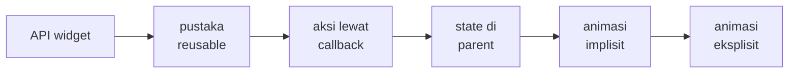
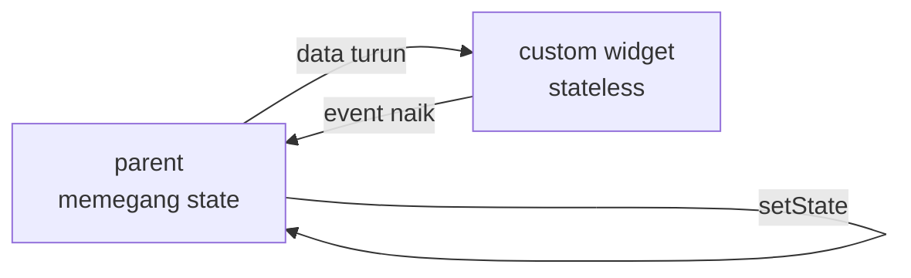
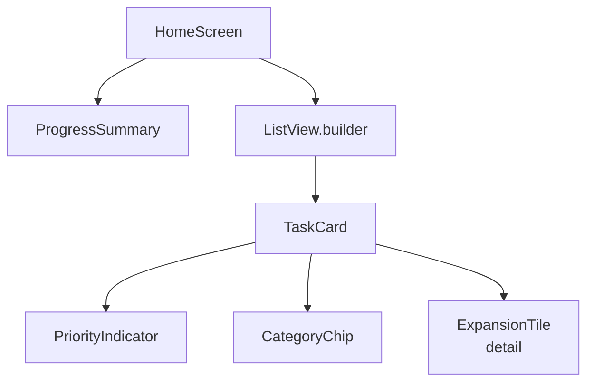

<!-- _class: title -->
<!-- _paginate: false -->

# Pertemuan 6
## Advanced UI & Custom Widgets

Komposisi widget · Widget reusable · Animasi dasar · CAPSTONE: advanced UI components

**Sub-CPMK92.1** — mampu merancang arsitektur UI aplikasi yang konsisten dan responsif
Bacaan: modul-buku bab 6 · Praktikum: `starter-code/p06-custom-widgets`

<div class="pengajar">

**Fahri Firdausillah, S.Kom, M.CS**
Teknik Informatika — Universitas Dian Nuswantoro

</div>

---

## Setelah pertemuan ini, Anda bisa

1. **Merancang API custom widget**: parameter wajib versus opsional, callback, dan `const` constructor.
2. **Menyusun widget besar dari widget kecil** — `TaskCard` dari `PriorityIndicator`, `CategoryChip`, dan `ExpansionTile` — tanpa menulis ulang kode yang sama.
3. **Mengalirkan data lewat constructor dan kejadian lewat callback**, sehingga widget tetap stateless, bisa diuji, dan dipakai ulang.
4. **Membangun komponen interaktif** — expandable details, dialog konfirmasi async, bottom sheet quick add — dengan state lokal `StatefulWidget`.
5. **Menerapkan animasi dasar**: fade saat complete, slide saat delete, progress bar yang bergerak halus.

<div class="note">

Bab 5 menutup dengan janji: `TaskCard` adalah komponen kanonik, dan bab berikutnya hanya mengubahnya sebagai delta. **Hari ini janji itu ditepati** — kartu dipecah menjadi pustaka widget yang utuh.

</div>

---

## Peta perjalanan hari ini

Satu pustaka widget yang tumbuh untuk StudyTracker, bukan contoh-contoh terpisah:



Setiap segmen hanya menambahkan **kode yang berubah** — kartu dari segmen 2 tetap dipakai di segmen 4.

Persiapan: buka `starter-code/p06-custom-widgets`, jalankan sekali, lalu intip `lib/widgets/`.

---

<!-- _class: section-break -->

# 1 · Komposisi Widget

Custom widget sebagai API kecil yang bisa dipegang

---

## Custom widget = komponen bernama

**Custom widget** menggabungkan widget bawaan menjadi komponen bernama dengan parameter sendiri.

```dart
class CategoryChip extends StatelessWidget {
  const CategoryChip({super.key, required this.label});
  final String label;

  @override
  Widget build(BuildContext context) => Chip(
    label: Text(label),
  );
}
```

Pemakainya cukup menulis `const CategoryChip(label: 'Kuliah')`.

<div class="note">Satu nama, satu tempat untuk mengubah tampilan.</div>

---

## Custom widget adalah API kecil

Setiap custom widget yang Anda tulis adalah API kecil bagi pemakainya — biasanya **diri sendiri tiga bulan kemudian**. Tiga keputusan membentuk kualitas API itu:

1. **Wajib atau opsional.** Parameter `required` untuk data yang membuat widget tidak bermakna tanpanya: `TaskCard` tanpa `task` bukan apa-apa. Parameter opsional dengan nilai bawaan untuk variasi yang punya default masuk akal. Callback umumnya opsional — widget tetap menampilkan apa pun tanpa handler.
2. **Satu tanggung jawab.** Widget yang menampilkan data, mengelola input, memanggil repository, sekaligus menganimasikan diri akan sulit diuji dan mustahil dipakai ulang.
3. **`const` constructor.** Instance yang bisa `const` di-cache framework — tidak dibangun ulang saat parent rebuild tanpa alasan.

<div class="ok">

**Aturan praktis satu tanggung jawab:** kalau deskripsi widget perlu kata "dan", pertimbangkan memecahnya.

</div>

---

## Wajib versus opsional — contoh dari bab 6

```dart
class PrioritySelector extends StatelessWidget {
  const PrioritySelector({
    super.key,
    required this.selected,   // wajib: tanpa ini widget tak bermakna
    this.onSelected,          // opsional: mode baca tetap jalan
  });

  final Priority selected;
  final ValueChanged<Priority>? onSelected;
}
```

Callback diuji `null` **sekali, di titik pemakaian** — bukan tersebar sebagai `!` di mana-mana:

```dart
onSelected: onSelected == null
    ? null                                        // chip otomatis nonaktif
    : (_) => onSelected!(priority),
```

Perhatikan: constructor tetap `const` meski menerima callback runtime. Yang tidak bisa `const` adalah *instance*-nya, bukan constructor-nya.

---

<!-- _class: split -->

## CategoryChip — styling seragam lewat satu widget

```dart
class CategoryChip extends StatelessWidget {
  const CategoryChip(
      {super.key, required this.label});

  final String label;

  @override
  Widget build(BuildContext context) {
    final scheme =
        Theme.of(context).colorScheme;
    return Container(
      padding: const EdgeInsets.symmetric(
          horizontal: 8, vertical: 2),
      decoration: BoxDecoration(
        color: scheme.secondaryContainer,
        borderRadius:
            BorderRadius.circular(999),
      ),
      child: Text(
        label,
        style: TextStyle(
          color: scheme.onSecondaryContainer,
          fontSize: 12,
        ),
      ),
    );
  }
}
```

<div>

Semua chip kategori mengambil warna dari **theme**, bukan angka hex yang tersebar — ganti tema sekali, semua chip ikut.

`BorderRadius.circular(999)` membentuk pill; angkanya sengaja berlebih agar selalu penuh.

Widget ini **tidak tahu apa itu `Task`** — ia hanya menerima `String label`. Justru itu yang membuatnya bisa dipakai di kartu, filter, dan form.

Satu data masuk, nol callback keluar: tidak ada yang bisa diketuk, jadi tidak ada `onXxx` sama sekali.

</div>

---

## Data turun, event naik

Aliran data pada widget yang patuh selalu satu pola:



- Widget menerima data lewat **constructor**, mengirim kejadian lewat **callback**.
- Hanya parent yang memanggil `setState` — widget stateless yang patuh pola ini bisa diuji terpisah dan dipakai di layar mana pun.

<div class="ok">

**Data mengalir ke bawah lewat konstruktor, kejadian mengalir ke atas lewat callback.** Satu kalimat ini merangkum arsitektur UI Flutter — hari ini kami memakainya sampai habis.

</div>

---

## `const` constructor, dan yang tidak bisa `const`

```dart
const CategoryChip(label: 'Belajar')   // const: di-cache, dipakai ulang
CategoryChip(label: task.category)     // runtime: dibuat tiap build — wajar
```

- `const` di titik pemakaian membuat framework memakai ulang instance yang sama saat tree dibangun ulang. Efisiensi gratis, perilaku tidak berubah.
- Widget yang menerima data runtime (`task.category`) memang tidak bisa `const` — itu normal, bukan kesalahan.

<div class="warn">

**Jebakan yang sering muncul di review kode:** menandai widget "hampir konstan" sebagai `const` padahal salah satu argumennya berubah tiap build. Compiler menolak — dan itu penolakan yang berguna: ia mengingatkan bahwa widget itu memang dibangun ulang.

</div>

---

## Bab 6 menepati janji: refactor sebagai delta

`TaskCard` bab 5 masih satu file berisi kartu dan `_DueDateLabel` privat. Refactor bab 6 memisahkan tiga hal tanpa menyentuh pemakainya:

1. `DueDateLabel` dipromosikan dari privat menjadi **widget publik** di file sendiri.
2. `TaskCardSummary` baru menampung isi kartu: judul, potongan catatan, baris chip.
3. `TaskCard` tinggal cangkang: `Card` + `InkWell` + baris checkbox dan isi.

<div class="ok">

**Yang penting bukan barisnya berkurang** — boleh bertambah. Yang penting: kontrak `TaskCard` tidak berubah sama sekali. `TaskListScreen` memanggil kartu dengan parameter yang sama; fitur baru masuk lewat `TaskCardSummary` tanpa menyentuh cangkang. Beginilah kode berevolusi tanpa bercabang-cabang.

</div>

---

<!-- _class: section-break -->

# 2 · Pustaka Widget StudyTracker

Empat widget kecil, dipakai di mana-mana

---

## Pustaka hari ini — satu kartu, banyak bagian



Setiap kotak di bawah `TaskCard` punya file sendiri di `lib/widgets/`. Kartu tidak menggambar dot warna atau bentuk chip sendiri — **ia merangkai**.

---

<!-- _class: split -->

## Kontrak TaskCard — API sebelum UI

```dart
class TaskCard extends StatelessWidget {
  const TaskCard({
    super.key,
    required this.task,
    required this.onToggle,
    required this.onDelete,
  });

  final Task task;
  final ValueChanged<bool> onToggle;
  final VoidCallback onDelete;

  // build: dua slide berikutnya
}
```

<div>

Tiga parameter, semuanya wajib: kartu tanpa `task` dan tanpa dua jalur interaksi bukan kartu yang berguna di aplikasi ini.

`ValueChanged<bool>` mengirim **nilai baru yang diinginkan** (`onToggle(!task.completed)`), bukan sekadar "ada perubahan" — kartu pemilik tombol, bukan pembaca checkbox.

Perhatikan juga yang *tidak ada*: tidak ada `List<Task>`, tidak ada repository, tidak ada `initState`. Kontrak sekecil ini yang membuat kartu bisa dipakai di layar mana pun.

Menulis field dulu, `build` belakangan — memaksa Anda memikirkan API sebelum terpikat tampilan.

</div>

---

<!-- _class: code-dense -->

## TaskCard — cangkang dan isi ringkas

```dart
@override
Widget build(BuildContext context) {
  return Card(
    margin: const EdgeInsets.symmetric(
        horizontal: 12, vertical: 4),
    child: Padding(
      padding: const EdgeInsets.symmetric(
          horizontal: 4, vertical: 2),
      child: ExpansionTile(
        title: Text(
          task.title,
          style: TextStyle(
            decoration: task.completed
                ? TextDecoration.lineThrough
                : null,
          ),
        ),
        subtitle: Row(children: [
          PriorityIndicator(priority: task.priority),
          const SizedBox(width: 12),
          CategoryChip(label: task.category),
        ]),
        // trailing & children: slide berikutnya
      ),
    ),
  );
}
```

Subtitle merangkai dua widget kecil — **komposisi menggantikan duplikasi**: satu tempat mengubah indikator prioritas, semua kartu ikut.

---

<!-- _class: code-dense -->

## TaskCard — aksi bawaan dan detail yang membuka

```dart
trailing: Row(
  mainAxisSize: MainAxisSize.min,
  children: [
    IconButton(
      tooltip: task.completed ? 'Buka lagi' : 'Tandai selesai',
      onPressed: () => onToggle(!task.completed),
      icon: Icon(task.completed ? Icons.undo : Icons.check),
    ),
    IconButton(
      tooltip: 'Hapus',
      onPressed: onDelete,
      icon: const Icon(Icons.delete_outline),
    ),
  ],
),
children: [
  Align(
    alignment: Alignment.centerLeft,
    child: Padding(
      padding: const EdgeInsets.only(left: 12, bottom: 12),
      child: Text(task.details.isEmpty
          ? '— tanpa detail —'
          : task.details),
    ),
  ),
],
```

Tombol **hanya memanggil callback** — kartu tidak pernah mengubah datanya sendiri. `children` milik `ExpansionTile` adalah area detail yang buka-tutup dengan animasi bawaan: komponen interaktif pertama hari ini, tanpa satu baris state yang Anda tulis.

---

<!-- _class: code-dense -->

## ProgressSummary — statistik untuk dashboard

```dart
class ProgressSummary extends StatelessWidget {
  const ProgressSummary(
      {super.key, required this.done, required this.total});

  final int done;
  final int total;

  @override
  Widget build(BuildContext context) {
    final ratio = total == 0 ? 0.0 : done / total;
    return Padding(
      padding: const EdgeInsets.all(16),
      child: Column(
        crossAxisAlignment: CrossAxisAlignment.start,
        children: [
          Text('$done dari $total tugas selesai'),
          const SizedBox(height: 8),
          LinearProgressIndicator(value: ratio, minHeight: 8),
        ],
      ),
    );
  }
}
```

Widget menerima **hasil hitung** (dua `int`), bukan `List<Task>` — ia tidak perlu tahu cara menghitung. Guard `total == 0` mencegah `NaN` saat daftar kosong. Versi animatifnya menyusul di segmen 4 (TODO P06-3).

---

## Kekuatan widget ada pada yang tidak diketahuinya

- `TaskCard` **tidak tahu di daftar mana ia berada** — `ListView.builder` apa pun bisa memakainya, selama ada `Task` dan dua callback.
- **Tidak tahu cara memperoleh `Task`** — di widget test, data cukup dibuat literal di konstruktor. Tidak perlu repository, tidak perlu layar.
- **Tidak mengubah data** — dua callback adalah seluruh kemampuannya memengaruhi dunia luar.
- `CategoryChip` bahkan tidak tahu apa itu tugas: hanya `String label`.

<div class="ok">

**Widget yang bisa diuji adalah widget yang tidak tahu banyak hal.** Setiap hal yang tidak diketahui sebuah widget adalah tempat ia bisa dipakai ulang tanpa Anda rencanakan.

</div>

---

<!-- _class: section-break -->

# 3 · Interaksi & State

Callback, dialog async, bottom sheet

---

## State daftar milik parent

Kartu hanya melapor — yang mengeksekusi adalah `HomeScreen`, pemilik `List<Task>`:

```dart
// _HomeScreenState — dipadatkan dari starter
void _toggle(String id, bool value) => setState(() {
      final i = _tasks.indexWhere((t) => t.id == id);
      if (i != -1) _tasks[i] = _tasks[i].copyWith(completed: value);
    });
```

Objek `Task` tidak pernah dimutasi — elemen daftar diganti lewat `copyWith`, sehingga rebuild murah dan tidak ada kode lain yang bisa mengubah objek lama diam-diam.

---

<!-- _class: code-dense -->

## Semua kartu terhubung dalam satu build

```dart
class _HomeScreenState extends State<HomeScreen> {
  final List<Task> _tasks = [...mockTasks];

  void _toggle(String id, bool value) => setState(() {
        final i = _tasks.indexWhere((t) => t.id == id);
        if (i != -1) _tasks[i] = _tasks[i].copyWith(completed: value);
      });

  @override
  Widget build(BuildContext context) {
    final done = _tasks.where((t) => t.completed).length;
    return Scaffold(
      appBar: AppBar(title: const Text('StudyTracker')),
      body: Column(children: [
        ProgressSummary(done: done, total: _tasks.length),
        Expanded(
          child: ListView.builder(
            itemCount: _tasks.length,
            itemBuilder: (context, i) => TaskCard(
              task: _tasks[i],
              onToggle: (v) => _toggle(_tasks[i].id, v),
              onDelete: () => _confirmDelete(_tasks[i]),
            ),
          ),
        ),
      ]),
    );
  }
}
```

`done` **dihitung ulang di `build`** dari `_tasks` — satu sumber kebenaran; bar progres dan daftar tidak bisa saling mendahului.

---

<!-- _class: code-dense -->

## Hapus dengan konfirmasi — dialog adalah Future

```dart
Future<void> _confirmDelete(Task task) async {
  final ok = await showDialog<bool>(
    context: context,
    builder: (context) => AlertDialog(
      title: const Text('Hapus tugas?'),
      content: Text('"${task.title}" akan dihapus permanen.'),
      actions: [
        TextButton(
          onPressed: () => Navigator.pop(context, false),
          child: const Text('Batal'),
        ),
        FilledButton(
          onPressed: () => Navigator.pop(context, true),
          child: const Text('Hapus'),
        ),
      ],
    ),
  );
  if (ok == true) {
    setState(() => _tasks.removeWhere((t) => t.id == task.id));
  }
}
```

Jawaban dialog bertipe `Future<bool?>`, bukan `bool`: **saat dialog dibuka, jawabannya belum ada** — ia datang kemudian, lewat `pop`. `null` (tombol back) dianggap batal; penghapusan hanya terjadi setelah jawaban benar-benar datang.

---

<!-- _class: code-dense -->

## Swipe-to-delete — Dismissible (TODO P06-1)

```dart
Dismissible(
  key: ValueKey(_tasks[i].id),        // identitas item, wajib
  direction: DismissDirection.endToStart,   // swipe kiri saja
  background: Container(
    alignment: Alignment.centerRight,
    padding: const EdgeInsets.only(right: 16),
    color: Theme.of(context).colorScheme.error,
    child: const Icon(Icons.delete_outline, color: Colors.white),
  ),
  confirmDismiss: (_) => _confirmDismiss(_tasks[i]),  // gerbang async
  onDismissed: (_) => setState(() {
    _tasks.removeWhere((t) => t.id == _tasks[i].id);
  }),
  child: TaskCard(
    task: _tasks[i],
    onToggle: (v) => _toggle(_tasks[i].id, v),
    onDelete: () => _confirmDelete(_tasks[i]),
  ),
)
```

<div class="note">

Animasi slide saat delete sudah menjadi bawaan `Dismissible` — Anda hanya menentukan arah dan latar. `confirmDismiss` menerima `Future<bool>`: kembalikan `false` saat dialog dibatalkan, item melenting kembali. Untuk itu, pisahkan pertanyaan (dialog mengembalikan `bool`) dari aksi hapus.

</div>

---

## State lokal komponen — kapan boleh?

Dua komponen hari ini memegang state sendiri, dan itu sah:

- `ExpansionTile` menyimpan **buka/tutup**-nya sendiri — Anda tidak menulis state itu, dan parent tidak memedulikannya.
- Bottom sheet quick add (slide berikutnya) mengelola **teks yang sedang diketik** sendiri.

Kriterianya: state itu privat, hanya urusan tampilan, dan tidak perlu diketahui siapa pun sampai hasilnya selesai.

<div class="warn">

**Batasnya tegas:** state yang menentukan *makna data aplikasi* — daftar tugas, status selesai — milik parent. Menyelundupkan `_tasks` ke dalam kartu agar "praktis" menghancurkan seluruh pola: kartu berhenti bisa dipakai ulang dan berhenti bisa diuji.

</div>

---

<!-- _class: code-dense -->

## Bottom sheet quick add

```dart
Future<void> _quickAdd() async {
  final title = await showModalBottomSheet<String>(
    context: context,
    builder: (context) => Padding(
      padding: const EdgeInsets.all(16),
      child: TextField(
        autofocus: true,
        decoration: const InputDecoration(
          labelText: 'Tugas baru',
        ),
        onSubmitted: (value) =>
            Navigator.pop(context, value.trim()),
      ),
    ),
  );
  if (title == null || title.isEmpty) return;
  if (!mounted) return;                       // async gap
  setState(() => _tasks.add(Task(
        id: 't-${DateTime.now().millisecondsSinceEpoch}',
        title: title,
      )));
}
```

Bentuknya identik dengan dialog hapus: **jawaban keluar lewat `pop`, kodemu menunggu lewat `await`**. Tanpa `TextEditingController` — nilai diambil dari `onSubmitted`, jadi tidak ada yang perlu dibuang.

---

## Tiga disiplin interaksi hari ini

1. **Guard `mounted` setelah setiap `await`.** Pengguna bisa menutup layar selagi sheet atau dialog terbuka; `State` yang sudah dibuang tidak boleh menjalankan `setState`.
2. **Jawaban async jangan dipaksa sinkron.** Dialog dan sheet mengembalikan `Future<T?>` — `null` berarti dibatalkan, dan itu cabang yang harus Anda tangani, bukan diabaikan.
3. **Semua mutasi daftar lewat `setState` di parent.** Komponen hanya melapor; satu tempat mengubah data berarti satu tempat mencari bug.

<div class="warn">

Melewati disiplin pertama memunculkan `setState() called after dispose()` **tepat saat pengguna paling tidak menyangka** — bukan di mesin Anda, tapi di perangkat mereka.

</div>

---

<!-- _class: section-break -->

# 4 · Animasi Dasar

Implisit dulu, eksplisit bila perlu

---

## Dua keluarga animasi

| Keluarga | Anda tulis | Yang mengelola controller |
|---|---|---|
| **Implisit** | nilai akhir — `AnimatedOpacity`, `AnimatedSwitcher`, `TweenAnimationBuilder` | framework |
| **Eksplisit** | `AnimationController`, kurva, `forward()`/`reverse()` | Anda — termasuk `dispose()` |

Aturan praktisnya: **mulai dari implisit.** Pindah ke eksplisit hanya bila butuh sesuatu yang tidak bisa dinyatakan sebagai nilai akhir — berjalan saat widget pertama muncul, mengulang, membalik arah di tengah jalan, atau mendengarkan tiap tick.

<div class="ok">

Praktikum hari ini semuanya implisit: fade saat complete (`AnimatedOpacity`), slide saat delete (`Dismissible`), crossfade penghitang (`AnimatedSwitcher`), bar progres (`TweenAnimationBuilder`). Eksplisit (`FadeIn`) kita bedah dari modul bab 6.

</div>

---

## Fade saat complete — AnimatedOpacity (TODO P06-2)

```dart
ExpansionTile(
  title: AnimatedOpacity(
    duration: const Duration(milliseconds: 300),
    opacity: task.completed ? 0.45 : 1,
    child: Text(
      task.title,
      style: TextStyle(
        decoration: task.completed
            ? TextDecoration.lineThrough
            : null,
      ),
    ),
  ),
  // ...
)
```

Anda hanya **mendeklarasikan nilai akhir** — saat `task.completed` berubah, framework menganimasikan menuju opacity baru. Tanpa controller, tanpa `dispose`, tanpa ticker. Strikethrough berubah seketika sementara opacity memudar: kombinasi yang justru terasa halus.

---

## Crossfade penghitang — AnimatedSwitcher

```dart
bottomNavigationBar: BottomAppBar(
  child: AnimatedSwitcher(
    duration: const Duration(milliseconds: 250),
    child: Text(
      '$done dari $total tugas selesai',
      key: ValueKey(done),   // kunci animasi
    ),
  ),
)
```

Kuncinya di **`key: ValueKey(done)`** — tanpa key yang berubah, `AnimatedSwitcher` menganggap widget yang sama dan tidak menganimasikan apa pun. Key baru membuat anak lama dan baru dianggap dua widget berbeda, lalu keduanya di-crossfade. Selain itu tidak ada yang dikelola.

---

## Progress bar yang bergerak — TweenAnimationBuilder (TODO P06-3)

```dart
TweenAnimationBuilder<double>(
  tween: Tween<double>(begin: 0, end: ratio),
  duration: const Duration(milliseconds: 400),
  builder: (context, value, _) => LinearProgressIndicator(
    value: value,
    minHeight: 8,
  ),
)
```

`builder` dipanggil **tiap frame dengan nilai antara** — `LinearProgressIndicator` tetap widget biasa; yang beranimasi adalah nilainya. Bonus: `TweenAnimationBuilder` juga menganimasikan tampilan pertama (`0` → `ratio`), jadi dashboard terasa hidup sejak layar dibuka.

---

<!-- _class: code-dense -->

## Eksplisit: FadeIn dengan AnimationController

Untuk animasi yang berjalan **saat layar pertama muncul**, keluarga implisit tidak punya jawaban langsung — tidak ada "nilai lama → nilai baru". Pola eksplisitnya:

```dart
class _FadeInState extends State<FadeIn>
    with SingleTickerProviderStateMixin {
  late final AnimationController _controller;
  late final Animation<double> _opacity;

  @override
  void initState() {
    super.initState();
    _controller = AnimationController(
      vsync: this,
      duration: widget.duration,
    );
    _opacity = CurvedAnimation(
      parent: _controller,
      curve: Curves.easeOut,
    );
    _controller.forward();   // berjalan sekali, saat mount
  }

  @override
  void dispose() {
    _controller.dispose();   // ticker wajib dimatikan
    super.dispose();
  }
  // build: FadeTransition(opacity: _opacity, child: widget.child)
}
```

---

## Empat bagian pola eksplisit — hafalkan bentuknya

1. **`SingleTickerProviderStateMixin`** — memberi controller akses ke sumber denyut frame yang otomatis berhenti saat layar tidak terlihat. Satu controller per State pakai ini; lebih dari satu pakai `TickerProviderStateMixin`.
2. **`late final`** — controller butuh `vsync: this` yang baru ada setelah State terpasang, jadi inisialisasinya pindah ke `initState`.
3. **`CurvedAnimation`** — nilai bergerak mengikuti kurva: ease-out berarti cepat di awal, melambat di akhir. Linear terasa mekanis.
4. **`_controller.dispose()`** — controller yang tidak dibuang meninggalkan ticker aktif: baterai terkuras dan exception ticker bocor.

<div class="ok">

Pola ini muncul di **semua** animasi eksplisit, ukuran apa pun. Begitu hafal bentuknya, semuanya terasa sama — seperti pola alokasi-di-`initState`, bersih-di-`dispose` dari pertemuan 3.

</div>

---

## Semua resource dibuang di `dispose`

Bab 6 adalah bab pertama saat Tracker memegang beberapa resource sekaligus. Daftarnya dipakai sampai akhir buku:

| Resource | Dibuat | Lupa `dispose()` berarti |
|---|---|---|
| `TextEditingController` | field State / `initState` | listener dan teks tertahan di memori |
| `FocusNode` | field State / `initState` | node fokus yatim, keyboard bisa macet |
| `AnimationController` | `initState` | ticker aktif terus — baterai dan exception |
| `ScrollController` | field State / `initState` | listener tertahan |

<div class="warn">

**UI tidak berubah setelah `setState`?** Hampir selalu nilainya disimpan di variabel lokal dalam `build` — tiap rebuild mengembalikan nilai awal. State yang menentukan tampilan hidup sebagai field di class State; `build` membaca, tidak menyimpan.

</div>

---

## Praktikum hari ini

**Target:** pustaka widget reusable untuk StudyTracker — dipakai di daftar, dashboard, dan nanti di capstone.

1. Pelajari starter `lib/widgets/`: kontrak `TaskCard` (aksi complete/delete bawaan + detail expandable), `PriorityIndicator`, `CategoryChip`, `ProgressSummary`.
2. **TODO P06-1:** bungkus tiap kartu dengan `Dismissible` — swipe kiri → konfirmasi → item hilang.
3. **TODO P06-2:** `AnimatedOpacity` pada judul — toggle → memudar 300 ms.
4. **TODO P06-3:** ganti `LinearProgressIndicator` dengan `TweenAnimationBuilder` — rasio berubah → bar bergerak halus.
5. **TODO P06-4:** tulis ulang `_confirmDelete` dari nol **tanpa copilot**, lalu jelaskan tiap baris ke teman sebangku.
6. Kalau cepat: bottom sheet quick add untuk tugas singkat.

<div class="warn">

**P06-4 adalah latihan tulis-manual:** melatih refleks menulis kode, bukan menyusun prompt. Ukurannya satu — bisa menjelaskan mengapa jawaban dialog bertipe `Future<bool>`, bukan `bool`. Kalau belum lancar, tulis ulang lagi.

</div>

Starter: `starter-code/p06-custom-widgets` · Komponen hari ini langsung terpakai sebagai advanced UI components capstone

---

## Bekerja dengan AI di materi ini

**Pantas didelegasikan**
Menanyakan properti widget yang belum Anda kenal. Meminta contoh animasi implisit untuk efek yang Anda bayangkan — kurva, durasi, boilerplate `AnimationController`. Menanyakan arti pesan error seperti ticker bocor atau `setState() called after dispose()`.

**Tulis sendiri**
**Logika inti widget Anda.** Desain API-nya: parameter apa yang diterima, callback apa yang dipancarkan, apa yang sengaja tidak diketahui widget. State internal komponen interaktif dan logika animasinya. Kontrak yang buruk baru terasa saat widget itu dipakai di tempat kedua — dan memperbaikinya jauh lebih mahal daripada menuliskannya benar dari awal.

<div class="note">

**Latihan:** minta AI membuat satu custom widget untuk aplikasi Anda. Periksa satu hal saja: apakah widget itu mengambil datanya sendiri dari suatu tempat, atau menerimanya lewat constructor? Jika mengambil sendiri, ia tidak bisa dipakai ulang dan tidak bisa diuji — perbaiki, lalu catat mengapa AI cenderung melakukan ini.

</div>

---

## Ringkasan

- **Custom widget = API kecil**: parameter wajib untuk data inti, opsional untuk variasi dan callback, `const` constructor, satu tanggung jawab per widget.
- **Data turun lewat constructor, event naik lewat callback**; hanya parent yang `setState` — widget stateless bisa diuji dan dipakai ulang.
- **TaskCard adalah komposisi**: `ExpansionTile` + `PriorityIndicator` + `CategoryChip`; aksi bawaan hanya memanggil callback, kartu tidak pernah mengubah datanya sendiri.
- **ProgressSummary menerima hasil hitung** (`int`), bukan sumber data — widget tidak perlu tahu cara menghitung.
- **Dialog dan bottom sheet adalah `Future`**: jawaban keluar lewat `pop`, `null` berarti batal; guard `mounted` setelah setiap async gap.
- **`Dismissible` menyediakan slide-delete bawaan**; `confirmDismiss` adalah gerbang async, key berbasis id data.
- **Animasi implisit mendeklarasikan nilai akhir** — `AnimatedOpacity`, `AnimatedSwitcher` + key baru, `TweenAnimationBuilder` — tanpa controller.
- **Animasi eksplisit = controller + kurva + `dispose()`**; pola `late final` dan `SingleTickerProviderStateMixin`.
- **Semua resource State dibuang di `dispose()`**; data parent dibaca lewat `widget.x`, tidak disalin di `initState`.

---

<!-- _class: section-break -->

# Pertemuan berikutnya

**P07 — Responsive Design & Adaptive Layouts**
MediaQuery, LayoutBuilder, breakpoint, dan master-detail

UI yang hari ini rapi di satu ukuran layar bisa hancur di ukuran lain — ponsel kecil, tablet, desktop. Pustaka yang Anda bangun hari ini akan diuji di semua itu.

Baca sebelum kelas: modul-buku bab 5 — Checkpoint 2–3, bagian layout responsif
