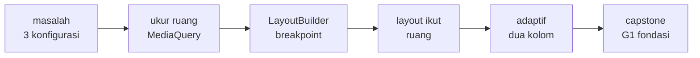
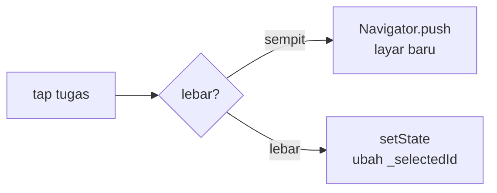

<!-- _class: title -->
<!-- _paginate: false -->

# Pertemuan 7
## Responsive Design & Adaptive Layouts

MediaQuery · LayoutBuilder · Breakpoint · Adaptive layout · CAPSTONE G1: Fondasi

**Sub-CPMK92.1** — mampu merancang arsitektur UI aplikasi yang konsisten dan responsif
Bacaan: modul-buku bab 5 (Checkpoint 2–3) · Praktikum: `starter-code/p07-responsive`

<div class="pengajar">

**Fahri Firdausillah, S.Kom, M.CS**
Teknik Informatika — Universitas Dian Nuswantoro

</div>

---

## Setelah pertemuan ini, Anda bisa

1. **Membaca fakta layar lewat `MediaQuery`** dan membedakannya dari constraints parent yang dilaporkan `LayoutBuilder`.
2. **Menetapkan breakpoint terpusat** dan menjelaskan alasannya — angka dengan alasan, bukan angka ajaib.
3. **Membuat layout yang mengikuti ruang**: `Expanded`/`Flexible`, dynamic padding, `AspectRatio`, `Center` + `ConstrainedBox`.
4. **Menulis conditional rendering** satu kolom vs dua kolom berdasar lebar tersedia, dan mempertahankan pilihan pengguna saat melewati ambang.
5. **Menyusun adaptive layout master-detail** dan menjelaskan mengapa "memilih item" berarti dua hal berbeda di tiap cabang.

<div class="note">

Semua teknik dipraktikkan pada StudyTracker dan diuji minimal di tiga konfigurasi layar — ponsel potret, ponsel landscape, tablet. **Itu juga syarat Gate 1 capstone yang disetor minggu ini.**

</div>

---

## Peta perjalanan hari ini

Satu pertanyaan yang benar — *berapa ruang yang tersedia?* — dan tiga lapis jawaban di atasnya:



Starter hari ini: `starter-code/p07-responsive` — sudah berisi breakpoint terpusat dan cabang satu/dua kolom; Anda menuntaskan TODO P07-3 (master-detail).

---

<!-- _class: section-break -->

# 1 · Ruang, Bukan Perangkat

Mengukur yang tersedia, bukan menebak jenis ponsel

---

## Satu aplikasi, tiga wadah

| Konfigurasi | Ukuran tipikal | Gejala bila tidak dirancang |
|---|---|---|
| Ponsel potret | 412 × 915 dp | Aman — inilah yang selama ini Anda uji |
| Ponsel landscape | 915 × 412 dp | Tinggi tinggal 412: overflow vertikal |
| Tablet | 1280 × 800 dp | Kartu dan teks terbentang selebar layar |

UI yang hanya diuji di satu emulator akan menemui kedua gejala itu **persis saat pertama kali diputar atau dipasang di tablet** — biasanya di depan penguji.

Flutter tidak menyediakan API `isTablet()`. Pertanyaan yang benar bukan "ini layar berapa inci?", melainkan **"berapa ruang yang tersedia untuk bagian ini?"**

---

## Responsif vs adaptif — dua kata, dua pekerjaan

- **Responsif**: tata letak yang *sama* menyesuaikan *ukurannya* — margin melebar, teks berhenti di tengah, konten menyusut.
- **Adaptif**: tata letak yang *berbeda* dipilih menurut ruang yang tersedia — satu kolom menjadi dua, navigasi bawah menjadi rail samping.

<div class="ok">

**Keduanya dibangun di atas satu fondasi yang sama: mengukur ruang.** Hari ini kita kerjakan berurutan: ukur (segmen 1), menyesuaikan ukuran (segmen 2), mengganti struktur (segmen 3) — lalu memakai semuanya untuk Gate 1 capstone.

</div>

---

## Satu kartu, dua jenis penyesuaian

<div class="two-col">
<div>

### Responsif

Komponennya tetap `TaskCard`. Lebar, padding, dan jumlah baris teks mengikuti ruang.

```text
TaskCard
└─ dibatasi maxWidth 600
```

</div>
<div>

### Adaptif

Struktur layar berubah. Pada layar lebar, daftar dan detail tampil berdampingan.

```text
isWide ? twoPane : taskList
```

</div>
</div>

<div class="note">Responsif mengubah ukuran; adaptif dapat mengubah struktur.</div>

---

## `MediaQuery` — jendela ke fakta layar

```dart
// MediaQuery: fakta layar, dibaca saat perlu.
final media = MediaQuery.of(context);

media.size;         // ukuran jendela dp
media.orientation;  // potret / lanskap
media.padding;      // inset status bar
media.textScaler;   // skala font user
```

<div>

`MediaQuery` menjawab **fakta jendela**: berapa ukurannya, seberapa besar font pengguna, area mana yang tertutup sistem.

Ia milik **layar**, bukan widget Anda. Di dalam panel kiri sebuah master-detail yang lebarnya 360 dp, `size.width` tetap melaporkan lebar penuh jendela — padahal ruang widget itu jauh lebih kecil.

Karena itu keputusan struktur layout jangan diambil dari sini. Itu pekerjaan `LayoutBuilder`, dua slide lagi.

</div>

---

## Apa yang dibaca, dan untuk apa

| Yang dibaca | Pertanyaan yang dijawab | Catatan |
|---|---|---|
| `size` | "Berapa lebar jendela?" | Statistik & informasi — bukan penentu ukuran font |
| `textScaler` | "Seberapa besar font pengguna?" | Untuk hitungan manual, mis. custom painter |
| `padding` | "Area mana yang tertutup sistem?" | `SafeArea` biasanya sudah cukup |
| `orientation` | "Panjang atau pendek?" | Untuk keputusan bentuk, bukan struktur |

<div class="warn">

**Anti-pattern yang paling sering dihasilkan AI:** `fontSize: screenWidth * 0.045`. Ukuran teks milik preferensi pengguna (`textScaler`), bukan lebar layar — di tablet formula ini menghasilkan teks raksasa.

</div>

Satu catatan performa: `MediaQuery.of(context)` berlangganan *semua* perubahan; `MediaQuery.sizeOf(context)` / `textScalerOf(context)` hanya yang dibutuhkan.

---

<!-- _class: split -->

## `LayoutBuilder` — constraints dari parent

```dart
LayoutBuilder(
  builder: (context, constraints) {
    final width = constraints.maxWidth;
    if (width >= Breakpoints.tablet) {
      return _twoColumn();
    }
    return _oneColumn();
  },
)
```

<div>

Builder dipanggil ulang **setiap kali constraints berubah** — rotasi perangkat, jendela di-resize, panel samping membuka.

Constraints datang **dari parent, bukan dari layar**. Widget yang sama bisa menerima 412 dp di ponsel dan 360 dp di panel kiri tablet.

Karena itu *semua* keputusan struktur — satu kolom atau dua — diambil di sini: jawabannya selalu tentang ruang yang benar-benar diberikan kepada widget ini.

</div>

---

## Kapan memakai yang mana

| Pertanyaan Anda | Alat yang tepat |
|---|---|
| "Berapa ruang untuk widget ini?" | `LayoutBuilder` — constraints parent |
| "Seberapa besar font pengguna?" | `MediaQuery.textScalerOf` |
| "Perlu menghindari area sistem?" | `SafeArea` (atau `media.padding`) |
| "Keputusan tentang bentuk, mis. kisi foto?" | `OrientationBuilder` |

<div class="note">

**Aturan praktisnya satu baris:** struktur dari `LayoutBuilder`, fakta dari `MediaQuery`, bentuk dari `OrientationBuilder`. Starter P07 merangkumnya di catatan README-nya — hafalkan ketiganya sebagai tiga pertanyaan berbeda, bukan tiga API yang saling menggantikan.

</div>

---

## Breakpoint terpusat, bukan angka ajaib

```dart
/// Breakpoint terpusat: satu sumber kebenaran untuk
/// ambang layout seluruh aplikasi.
library;

abstract final class Breakpoints {
  /// Di atas nilai ini: dua kolom.
  static const tablet = 600.0;

  /// Di atas nilai ini: master-detail.
  static const desktop = 1024.0;
}
```

Angka 600 bukan kebetulan: batas lebar jendela ponsel potret menurut panduan *window size class*. Yang penting bukan angkanya, melainkan alasannya — "di bawah 600, satu kolom sudah memakai lebar yang nyaman dibaca".

<div class="warn">

Ambang yang ditulis langsung di banyak file (`if (width > 600)` di sana-sini) mustahil dirawat. Satu tempat — `utils/breakpoints.dart` di starter — dan seluruh aplikasi mengikuti saat ia berubah.

</div>

---

## Orientasi bukan jawaban, ruang yang jawaban

```dart
// Hindari: orientasi sebagai keputusan utama tata letak.
final wide = MediaQuery.orientationOf(context)
    == Orientation.landscape;
```

Kenapa ini menyesatkan:

- **Ponsel landscape** memang lebih lebar, tetapi juga jauh lebih pendek — dua kolom menghasilkan dua kolom sempit yang keduanya tak cukup tinggi untuk berguna.
- **Tablet potret** berorientasi potret, tetapi punya ruang berlimpah untuk dua kolom.

Orientasi *berkorelasi* dengan ruang, tetapi bukan ruang itu sendiri — dan yang Anda butuhkan adalah ruangnya. `OrientationBuilder` tetap berguna untuk keputusan yang memang tentang bentuk: jumlah kolom kisi foto, atau gambar sampul lebar-pendek vs sempit-tinggi.

---

<!-- _class: section-break -->

# 2 · Mengikuti Ruang

Ukuran menyesuaikan, struktur tetap

---

## `Expanded` — menulis ulang constraints

Ingat aturan dari P03: parent memberi constraints, child memilih ukuran di dalamnya. **Overflow adalah negosiasi yang gagal** — dan penyebab paling umumnya adalah teks yang menolak menyusut.

```dart
Row(
  children: [
    Icon(task.completed
        ? Icons.check_circle
        : Icons.circle_outlined),
    const SizedBox(width: 8),
    Expanded(  // judul boleh menyusut, ikon tidak
      child: Text(
        task.title,
        maxLines: 2,
        overflow: TextOverflow.ellipsis,
      ),
    ),
  ],
)
```

`Expanded` memaksa child memenuhi sisa ruang sumbu utama; `Flexible` sama tetapi child boleh lebih kecil. Ditambah `maxLines` + `ellipsis`, teks panjang terpotong rapi di layar sempit mana pun.

---

<!-- _class: split -->

## `Spacer` — `Expanded` yang kosong

```dart
Card(
  child: Padding(
    padding: const EdgeInsets.all(12),
    child: Column(
      crossAxisAlignment:
          CrossAxisAlignment.start,
      children: [
        _titleRow(task),
        const Spacer(),  // isi sisa tinggi
        Text(task.category),
      ],
    ),
  ),
)
```

<div>

Di kartu grid, semua tile **dipaksa setinggi yang tertinggi**. Tanpa apa pun di antaranya, judul dan kategori berdempetan di atas.

`Spacer` hanyalah `Expanded` dengan child kosong — ia menyerap sisa tinggi, sehingga kategori selalu jatuh ke dasar kartu.

Hasilnya: deretan kartu yang tepinya rapi di semua lebar kolom, tanpa satu angka tinggi yang di-hardcode.

</div>

---

## Dynamic padding — boleh, dengan batas

```dart
final media = MediaQuery.of(context);

// Padding boleh mengikuti lebar layar — dengan
// lantai dan langit-langit agar tetap terbaca.
final horizontal =
    (media.size.width * 0.04).clamp(12.0, 48.0);
```

`clamp` memberi lantai dan langit-langit: ponsel potret 412 dp mendapat sekitar 16 dp, tablet 1280 dp **mentok di 48 dp** — baris teks tidak boleh tumbuh sepanjang layar tablet.

<div class="warn">

**Garis batasnya penting:** padding dan jarak boleh menskala lewat lebar; **ukuran font tidak** — ia milik `textScaler` pengguna. Formula `width * faktor` pada font adalah cara paling umum mencampuradukkan keduanya.

</div>

---

## Teks berhenti di tengah: `Center` + `ConstrainedBox`

```dart
body: Center(
  // Pola termurah untuk "teks terbentang selebar
  // tablet": layar sempit → transparan; lebar →
  // konten berhenti di 600 dp, di tengah.
  child: ConstrainedBox(
    constraints: const BoxConstraints(maxWidth: 600),
    child: ListView(
      padding: const EdgeInsets.all(16),
      // ... isi layar detail
    ),
  ),
)
```

Kenapa pola ini lebih baik daripada percabangan `if`: di layar sempit kedua widget **transparan** (konten mengisi layar seperti biasa), di layar lebar konten berhenti di 600 dp. Tidak ada cabang, tidak ada dua widget tree, tidak ada yang di-build dua kali.

---

## `AspectRatio` — ukuran dari rasio

```dart
AspectRatio(
  aspectRatio: 16 / 9,  // lebar : tinggi
  child: Image.asset(
    'assets/cover.png',
    fit: BoxFit.cover,
  ),
)
```

Widget ini menentukan ukurannya **dari rasio terhadap constraints yang diberikan parent** — saat parent melebar (landscape, tablet), tinggi ikut dihitung ulang, gambar tidak gepeng.

Di dalam grid, peran yang sama dipegang `childAspectRatio` — kita pakai di slide berikutnya.

---

<!-- _class: code-dense -->

## Dua kolom tanpa hitungan manual

```dart
Padding(
  padding: EdgeInsets.symmetric(horizontal: horizontal),
  child: GridView.builder(
    gridDelegate: const SliverGridDelegateWithMaxCrossAxisExtent(
      maxCrossAxisExtent: 320, // lebar maksimum per kolom
      childAspectRatio: 2.4,   // tinggi = lebar / 2.4
      mainAxisSpacing: 8,
      crossAxisSpacing: 8,
    ),
    itemCount: mockTasks.length,
    itemBuilder: (context, i) => TaskTile(task: mockTasks[i]),
  ),
)
```

Anda tidak menghitung `crossAxisCount` dari `size.width`. Cukup nyatakan **lebar maksimum kolom yang nyaman dibaca** (320 dp), dan Flutter menghitung jumlahnya: 600 dp → 2 kolom, 1280 dp → 4 kolom. `childAspectRatio: 2.4` menjaga proporsi kartu tetap sama di semua lebar — tugas `AspectRatio` di dalam grid.

---

## Text scaling — milik pengguna

Pengguna mengatur ukuran teks di pengaturan aksesibilitas; Flutter menerapkannya **otomatis** ke seluruh `Text`. Pembacaan manual hanya untuk ukuran non-teks:

```dart
// Bila harus tahu skalanya (mis. custom painter):
final scaler = MediaQuery.textScalerOf(context);
final tinggi = scaler.scale(14);  // 14 logis × skala
```

<div class="warn">

**Jangan pernah menimpa `textScaler` agar layout tidak rusak.** Itu sama dengan memindahkan masalah ke pengguna yang paling tidak mampu mengatasinya. Yang benar: buat layout bertahan saat teks membesar — tiga tekniknya di slide berikutnya.

</div>

---

## Tiga teknik tahan teks besar

Semua sudah ada di `TaskCard` modul — dan ketiganya bekerja lewat constraints, bukan menonaktifkan skala:

1. **`Expanded`** pada kolom isi kartu — judul dan label mendapat sisa lebar berapa pun itu.
2. **`Wrap`, bukan `Row`**, untuk deretan chip dan tenggat — label turun ke baris baru, bukan meluber keluar layar.
3. **`maxLines` + `TextOverflow.ellipsis`** pada judul — terpotong rapi, bukan menggeser layout.

```dart
Wrap(
  spacing: 8,    // antar item sebaris
  runSpacing: 4, // antar baris
  children: [
    PriorityChip(priority: task.priority),
    if (task.dueDate != null) _DueDateLabel(date: task.dueDate!),
  ],
)
```

Bonus yang gratis: layout yang tahan text scale umumnya tahan pula **lokalisasi** — teks yang memanjang setelah diterjemahkan berperilaku sama seperti teks yang membesar.

---

<!-- _class: section-break -->

# 3 · Adaptive Layout

Struktur yang berubah, bukan sekadar margin

---

## Responsif berhenti di margin

Teknik segmen 2 menjawab satu pertanyaan: "teks terbentang selebar tablet". Jawabannya benar — `Center` + `maxWidth` + grid 320 dp.

Pertanyaan kedua belum terjawab: pada layar selebar 1000 dp, **dua pertiga layar dibiarkan kosong** sementara detail tugas tetap dibuka sebagai layar penuh yang menutupi daftar. Ruangnya ada, tetapi tidak dipakai.

Inilah batas dua istilah itu: tata letak sama menyesuaikan ukuran = **responsif**; tata letak berbeda dipilih menurut ruang = **adaptif**. Sampai sini StudyTracker baru responsif.

---

<!-- _class: code-dense -->

## Dua cabang, satu ambang

```dart
class _TaskHomeScreenState extends State<TaskHomeScreen> {
  String? _selectedId;

  @override
  Widget build(BuildContext context) {
    return LayoutBuilder(
      builder: (context, constraints) {
        // Ambang terpusat yang sama: di bawah 600,
        // satu kolom sudah memakai lebar nyaman.
        final wide =
            constraints.maxWidth >= Breakpoints.tablet;
        return wide
            ? _buildWide(context)
            : _buildNarrow(context);
      },
    );
  }
}
```

Satu titik percabangan untuk seluruh aplikasi. Ambangnya **angka yang sama** dengan margin dan lebar baca segmen 2 — itulah gunanya breakpoint terpusat: satu alasan, dipakai berkali-kali.

---

<!-- _class: code-dense -->

## Cabang sempit — aplikasi yang sudah Anda punya

```dart
Widget _buildNarrow(BuildContext context) {
  return Scaffold(
    appBar: AppBar(title: const Text('Tugas')),
    body: TaskListView(
      // Sempit: memilih = membuka layar baru.
      onSelect: (task) => Navigator.of(context).push(
        MaterialPageRoute(
          builder: (_) => TaskDetailScreen(id: task.id),
        ),
      ),
    ),
    bottomNavigationBar: const TrackerBottomNav(),
  );
}
```

Tidak ada yang ditulis ulang: daftar memenuhi layar, navigasi bawah, memilih tugas berarti mendorong layar baru — persis aplikasi sebelum checkpoint ini.

---

<!-- _class: code-dense -->

## Cabang lebar — menukar dua hal sekaligus

```dart
Widget _buildWide(BuildContext context) {
  return Scaffold(
    body: Row(
      children: [
        const TrackerNavigationRail(),
        const VerticalDivider(width: 1),
        SizedBox(
          width: 360,
          child: TaskListView(
            selectedId: _selectedId,
            onSelect: (task) =>
                setState(() => _selectedId = task.id),
          ),
        ),
        const VerticalDivider(width: 1),
        Expanded(
          child: _selectedId == null
              ? const Center(
                  child: Text('Pilih tugas untuk detail'))
              : TaskDetailView(id: _selectedId!),
        ),
      ],
    ),
  );
}
```

Navigasi bawah menjadi `NavigationRail` di samping, dan detail **berhenti menjadi layar terpisah** — daftar dan detail berdampingan.

---

## Pelajaran sebenarnya: memilih itu dua hal berbeda

Perhatikan `onSelect` pada kedua cabang. Perbuatan penggunanya sama; artinya bagi aplikasi berbeda:



`_selectedId` dimiliki layar induk, bukan salah satu cabang — sehingga **bertahan saat jendela melewati ambang bolak-balik**.

<div class="ok">

**Adaptif bukan soal widget.** Widgetnya mudah; yang menuntut pemikiran adalah menyadari satu perbuatan pengguna bisa berarti dua hal, dan menyusun kode agar keduanya tidak saling menyandera.

</div>

---

## Satu isi, dua cara menyajikan

Alasan `TaskDetailScreen` dan `TaskDetailView` dipisah:

- **`TaskDetailView`** — isinya: menerima `id`, menampilkan detail, tidak tahu apa-apa soal `Scaffold` maupun tombol kembali.
- **`TaskDetailScreen`** — pembungkus tipis: `Scaffold` + `AppBar` di sekeliling `TaskView`, untuk keperluan cabang sempit.

<div class="warn">

Kalau Anda menempelkan layar penuh langsung ke dalam `Row`, akibatnya segera terlihat: **dua `AppBar` bertumpuk**, dan tombol kembali yang tidak punya tujuan untuk dituju.

</div>

---

## Daftar periksa tiga konfigurasi

Jalankan dan tandai satu per satu — daftar ini pula yang dipakai menilai gate capstone pertama:

- [ ] **Ponsel potret**: tampilan persis seperti sebelum checkpoint; tidak ada yang rusak
- [ ] **Ponsel landscape**: tetap satu kolom, tidak ada meluap, bilah bawah terjangkau
- [ ] **Tablet / jendela lebar**: dua kolom muncul, `NavigationRail` menggantikan bilah bawah
- [ ] Memilih tugas di layar lebar **tidak** mendorong layar baru
- [ ] Hanya ada satu `AppBar` di layar lebar
- [ ] Jendela diperkecil pelan-pelan melewati ambang 600: tata letak berpindah **tanpa crash**, tugas yang dipilih tidak hilang
- [ ] Skala teks 150% pada ketiga konfigurasi: tidak ada yang meluap

<div class="note">

Butir jendela-diperkecil paling sering gagal, dan paling mudah diuji di desktop atau emulator tablet dengan jendela yang bisa diubah ukurannya.

</div>

---

## Praktikum hari ini

**Target:** StudyTracker yang enak di beragam ukuran layar — dan lolos daftar periksa di atas. Starter: `starter-code/p07-responsive`.

1. Jalankan starter di **tiga konfigurasi** (phone potret, phone landscape, tablet) dan catat masalahnya: di mana overflow, teks terbentang, kartu terlalu lebar.
2. **Dynamic padding**: ganti `EdgeInsets` tetap dengan `MediaQuery` + `clamp(12, 48)`.
3. **Bungkus teks bermasalah**: `Expanded` + `maxLines` + `ellipsis`; deretan chip `Row` → `Wrap`.
4. **Conditional rendering** dengan breakpoint terpusat: satu kolom → dua kolom lewat `GridView` `maxCrossAxisExtent` + `childAspectRatio`.
5. Selesaikan **TODO P07-3**: master-detail di `Breakpoints.desktop` — panel kiri list (lebar 360), panel kanan detail.
6. Uji ulang: tiga konfigurasi + **font size maksimal** dari pengaturan sistem.

<div class="warn">

Uji dengan mengecilkan jendela pelan-pelan melewati ambang 600 dan 1024 — crash atau pilihan yang hilang saat transisi adalah cacat yang paling sering lolos kalau hanya diuji per konfigurasi terpisah.

</div>

---

## Bekerja dengan AI di materi ini

**Pantas didelegasikan**
Menanyakan arti pesan error layout — misalnya *"RenderFlex overflowed by 37 pixels on the right"* — dan minta penjelasan lewat model constraints. Debugging pesan seperti ini justru belajar cepat: AI menjelaskan, Anda yang membetulkan.

**Tulis sendiri**
Keputusan breakpoint: angka ambang beserta alasannya, yang datang dari melihat layout *Anda* rusak di lebar tertentu. Susunan adaptive layout: cabang mana yang `push`, cabang mana yang `setState`, pemisahan Screen vs View. Bagian ini yang menentukan apakah materi ini benar-benar Anda kuasai.

<div class="note">

**Latihan:** minta AI membuat satu layar Anda responsif, lalu periksa jawabannya. Bila ia memakai `MediaQuery.of(context).size.width` dikali pecahan untuk ukuran font, temukan itu, jelaskan kenapa keliru, dan tulis ulang dengan `LayoutBuilder`. Urutannya penting: temukan sendiri dulu, konfirmasi kemudian.

</div>

---

## Ringkasan

- **Responsif** menyesuaikan ukuran tata letak yang sama; **adaptif** memilih struktur berbeda menurut ruang — keduanya berdiri di atas satu pertanyaan: "berapa ruang yang tersedia?"
- **`MediaQuery` = fakta layar** (size, textScaler, padding, orientation); **`LayoutBuilder` = constraints parent**. Keputusan struktur milik yang terakhir.
- **Breakpoint terpusat** (`Breakpoints.tablet` 600 / `desktop` 1024); yang penting alasan angkanya, bukan angkanya — dan ia hidup di satu file.
- **Orientasi bukan ruang**: ponsel landscape pendek, tablet potret lega; orientasi hanya untuk keputusan bentuk.
- **`Expanded`/`Flexible` menulis ulang constraints**; `Spacer` menyerap sisa; `Wrap` + `maxLines` membuat layout tahan teks besar tanpa menonaktifkan `textScaler`.
- **Padding boleh menskala lebar dengan `clamp`**; ukuran font tidak pernah — ia milik pengguna.
- **`Center` + `ConstrainedBox(maxWidth: 600)`** menghentikan teks di tengah tanpa cabang if; **grid `maxCrossAxisExtent`** menghitung jumlah kolom tanpa hitungan manual.
- **Adaptif sejati = makna "memilih" berbeda per cabang** (`Navigator.push` vs `setState`) dengan pemisahan Screen/View — dan state pilihan bertahan saat melewati ambang.

---

<!-- _class: section-break -->

# 4 · Capstone Gate 1

Fondasi — disetor minggu ini

---

## G1 — apa yang harus berdiri

Gate ini bukan soal fitur banyak, tapi **satu hal yang utuh**:

- **Satu alur utama utuh** dari awal sampai akhir tanpa mentok — lebih baik satu alur tuntas daripada lima layar setengah jadi.
- **Navigasi antar layar** yang konsisten, minimal tiga layar.
- **Tampilan terpisah dari data** — widget tidak menyusun datanya sendiri; ada tempat lain yang memegang daftar.
- **Bertahan di tiga konfigurasi layar**: ponsel potret, landscape, tablet/jendela lebar. Tidak harus berubah bentuk, tapi tidak boleh rusak — tanpa overflow, teks terpotong, tombol keluar layar.

<div class="note">

Data boleh masih hidup di memori — penyimpanan permanen, jaringan, autentikasi, test semuanya datang di gate berikutnya. Stack bebas: rubrik menilai outcome, bukan pilihan teknologi.

</div>

---

## G1 — penyerahan dan verifikasi

Tiga artefak, semuanya wajib:

1. **Tag `gate-1`** di repo, sudah dipush ke remote.
2. **Satu blok `gate-1` di `CHANGELOG.md`** berisi empat butir (lihat format di README capstone).
3. **Video demo 5 menit**, diunggah unlisted, tautannya ada di blok CHANGELOG.

Rubrik lengkap: `penugasan/capstone/G1_Fondasi.md` · Peer review siklus 1 dikirim sebelum gate.

<div class="warn">

**Video diverifikasi lewat tanya jawab** — pastikan Anda bisa menjelaskan setiap keputusan layout yang tampil di video Anda. Untuk video G1 sendiri cukup dua hal: alur utama dijalankan penuh, lalu putar perangkat ke landscape sambil aplikasi tetap berjalan.

</div>

---

## G1 — periksa sendiri sebelum menyetor

Jalankan daftar ini untuk diri sendiri, jangan diserahkan:

- [ ] Aplikasi dipasang dari nol, langsung bisa dibuka tanpa langkah rahasia
- [ ] Alur utama dijalankan tiga kali berturut-turut tanpa crash
- [ ] Masukan kosong dan aneh dicoba di setiap form — aplikasi tidak mati
- [ ] Landscape di setiap layar: tidak ada yang meluap
- [ ] Tablet / jendela lebar: tidak ada teks terbentang sampai sulit dibaca
- [ ] **Skala teks 150%** pada ketiganya: tata letak masih terbaca
- [ ] Blok `gate-1` di CHANGELOG + tag + tautan video lengkap

<div class="warn">

Butir skala teks paling sering terlewat — dan paling sering jadi temuan saat tanya jawab. Hari ini Anda sudah punya semua tekniknya: `Expanded`, `Wrap`, `maxLines`.

</div>

---

<!-- _class: section-break -->

# Pertemuan berikutnya

**UTS — Live Coding & Demo StudyTracker**

Live coding 60 menit di lab, lalu demo lima fitur StudyTracker: add dengan validasi, list dengan filter kategori, mark complete dengan feedback visual, edit pre-filled, delete dengan konfirmasi — ditutup presentasi progres capstone.

Bahan latihan: `Ujian/UTS/` — lima soal berpola ujian, kerjakan bergilir dengan timer.
