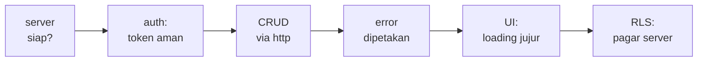
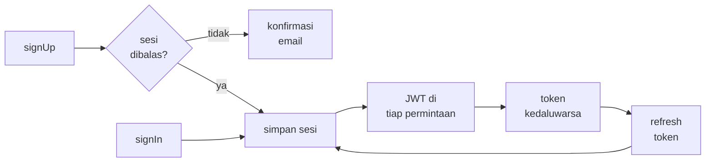
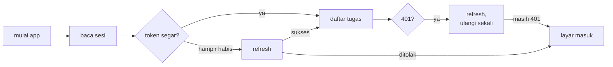

<!-- _class: title -->
<!-- _paginate: false -->

# Pertemuan 9
## API Integration & HTTP Operations

REST & http · Supabase · Autentikasi · CAPSTONE: backend integration

**Sub-CPMK53.2** — mampu mengintegrasikan data persistence dan layanan API eksternal
Bacaan: modul-buku bab 9 · Praktikum: `starter-code/p09-rest-api`

<div class="pengajar">

**Fahri Firdausillah, S.Kom, M.CS**
Teknik Informatika — Universitas Dian Nuswantoro

</div>

---

## Setelah pertemuan ini, Anda bisa

1. **Memverifikasi endpoint REST dan kunci API lewat curl/Postman** sebelum menulis satu baris Dart pun.
2. **Menyusun permintaan HTTP** — `GET`, `POST`, `PUT`/`PATCH`, `DELETE` — ke endpoint PostgREST `/rest/v1` dengan header `apikey` dan `Authorization: Bearer`.
3. **Mengelola sesi autentikasi email/password**: `signUp`, `signIn`, refresh token, dan penyimpanannya di `flutter_secure_storage`.
4. **Memetakan status code** — 200, 401, 403, 404, 422 — ke jenis error yang ditanggapi UI dengan tindakan berbeda.
5. **Mengaktifkan Row Level Security** sehingga tiap pengguna hanya bisa membaca dan menulis datanya sendiri.

<div class="note">

Sebelum UTS, StudyTracker berhenti di penyimpanan lokal: memori, preferences, lalu SQLite — semuanya di dalam perangkat. **Hari ini aplikasi ini terhubung ke backend: tugas tersimpan di server dan mengikuti akun, bukan perangkat.**

</div>

---

## Peta perjalanan hari ini

Satu backend Supabase, satu aplikasi — bukan lima contoh terpisah:



Semua langkah memakai dua endpoint yang sama: `/auth/v1` untuk sesi, `/rest/v1/tasks` untuk data.

Persiapan: project Supabase aktif + akun email untuk uji. Starter `p09-rest-api` tetap jalan tanpa backend lewat `MockTaskApi`.

---

<!-- _class: section-break -->

# 1 · REST & HTTP

Method, status, dan JSON sebagai bahasa pengangkut

---

## REST: kontrak di balik jaringan

REST memakai HTTP sebagai bahasa pengangkut. Permintaan membawa **method, path, header, dan kadang body**; balasan membawa **status dan body**.

Dua lapisan Supabase yang dipakai StudyTracker:

- `/auth/v1/*` — pendaftaran, masuk, segarkan token
- `/rest/v1/*` — data, dijalankan **PostgREST**: mesin yang mengubah tabel PostgreSQL menjadi endpoint REST tanpa server aplikasi tambahan

JSON menjadi format isi kedua arah. Pemetaannya mengulang pola bab 8: `priority` tetap angka bobot enum, `done` boolean asli (Postgres punya tipe boolean), dan tanggal berupa string ISO 8601 yang diurai `DateTime.parse`.

---

## Empat method, satu tabel

| Method | Dipakai untuk | PostgREST di Tracker |
|---|---|---|
| `GET` | Membaca koleksi | `/rest/v1/tasks?select=*` |
| `POST` | Menambah / upsert baris | `/rest/v1/tasks?on_conflict=id` |
| `PUT`/`PATCH` | Mengubah sebagian kolom | `PATCH /rest/v1/tasks?id=eq.<id>` |
| `DELETE` | Menghapus baris | `/rest/v1/tasks?id=eq.t-1` |

<div class="note">

**ID tetap milik klien.** Tabel `tasks` memakai `id text primary key`, bukan `serial` buatan server — model `Task` sudah membawa ID sejak awal, dan bab 10 akan menciptakan tugas saat perangkat offline. Penomoran dari dua sumber kebenaran adalah resep konflik sinkronisasi. Upsert (`on_conflict=id`) membuat keputusan ini bekerja.

</div>

---

## Status code: cara server bicara tanpa body

Yang penting bukan menghafal daftarnya, tapi tahu **aplikasi harus melakukan apa**:

| Status | Arti | Tanggapan aplikasi |
|---|---|---|
| 200 / 201 / 204 | Sukses | proses body bila ada |
| 400 | Permintaan ditolak (termasuk login salah) | tampilkan pesan dari server |
| 401 | Token tidak ada, salah, kedaluwarsa | segarkan sekali, ulangi, lalu paksa masuk |
| 403 | Terkena kebijakan RLS | data bukan milik Anda — jangan coba lagi |
| 404 | Sumber tidak ada | periksa nama tabel / endpoint |
| 422 | Payload gagal validasi | perbaiki data, tampilkan detail |
| 5xx | Server bermasalah | tampilkan pesan, tawarkan coba lagi |

---

## Kenapa `http`, padahal ada SDK

Supabase punya paket Dart resmi yang membuat semua materi ini muat dalam beberapa baris. Modul tidak memakainya — dan itu keputusan yang disengaja.

- Supabase dipakai sebagai **server PostgREST yang kebetulan gratis dan cepat disiapkan**, bukan sebagai platform.
- Yang dilatih adalah keterampilan yang tersisa saat Anda pindah: **menyusun header, memilih method, membaca status code, menyegarkan token**.
- Backend tempat Anda bekerja nanti hampir pasti berbicara REST — dan hampir pasti tanpa SDK semewah ini.

<div class="note">

SDK-nya bukan musuh. Setelah memahami materi ini Anda justru berada di posisi tepat untuk memakainya — karena tahu apa yang disembunyikannya.

</div>

---

## Dua kunci, satu rahasia

**Publishable key** (dulu: anon key) dirancang dikirim dari klien — boleh ada di repo dan binary; yang menjaganya bukan kerahasiaan, melainkan **RLS**. **Service role key** menembus RLS sepenuhnya: hanya untuk server tepercaya, **tidak pernah menyentuh aplikasi Flutter**.

```bash
flutter run \
  --dart-define=SUPABASE_URL=https://xxxxxxxx.supabase.co \
  --dart-define=SUPABASE_ANON_KEY=eyJ...placeholder...
```

```dart
const supabaseUrl = String.fromEnvironment('SUPABASE_URL');
const supabaseAnonKey = String.fromEnvironment('SUPABASE_ANON_KEY');
```

Konstanta lingkungan tidak masuk source control dan bisa berbeda antara build development dan produksi. `String.fromEnvironment` dievaluasi saat kompilasi — mengganti nilai berarti menjalankan ulang `flutter run`, hot restart tidak cukup.

<div class="warn">

Nilai yang di-`const` di dalam kode terkunci selamanya di repo. Begitu repo tersalin, rotasi kunci jauh lebih mahal daripada sekadar mengubah baris perintah.

</div>

---

## Periksa server sebelum menulis Dart

```bash
curl -i "$SUPABASE_URL/rest/v1/tasks?select=*" \
  -H "apikey: $SUPABASE_ANON_KEY" \
  -H "Authorization: Bearer $SUPABASE_ANON_KEY"
```

Membaca balasannya:

| Balasan | Arti |
|---|---|
| `200` + array kosong | tabel ada, kunci diterima |
| `401` | kunci salah |
| `404` | nama tabel salah |

<div class="ok">

Melakukan ini lebih dulu **memisahkan dua kegagalan yang terlihat sama dari dalam aplikasi**: konfigurasi yang keliru, dan kode yang keliru. Postman bekerja sama baiknya bila Anda lebih suka antarmuka.

</div>

---

<!-- _class: section-break -->

# 2 · Autentikasi

Token sebagai sesi, rahasia tetap rahasia

---

## Alur autentikasi email/password



| Endpoint | Fungsi |
|---|---|
| `POST /auth/v1/signup` | daftar akun |
| `POST /auth/v1/token?grant_type=password` | masuk |
| `POST /auth/v1/token?grant_type=refresh_token` | segarkan akses token |
| `POST /auth/v1/logout` | cabut refresh token |

Saat konfirmasi email diaktifkan di dashboard, `signup` menjawab `200` **tanpa** sesi — pendaftaran sukses bukan berarti masuk.

---

<!-- _class: split -->

## AuthSession: satu objek, bukan potongan tersebar

```dart
class AuthSession {
  AuthSession({
    required this.accessToken,
    required this.refreshToken,
    required this.userId,
    required this.email,
    required this.expiresAt,
  });

  final String accessToken;
  final String refreshToken;
  final String userId;
  final String email;
  final DateTime expiresAt;

  static const refreshWindow =
      Duration(seconds: 30);

  bool get needsRefresh =>
      DateTime.now().isAfter(
          expiresAt
              .subtract(refreshWindow));
}
```

<div>

Server mengembalikan sesi sebagai **satu balasan JSON** — simpan sebagai satu class, bukan empat string tersebar di empat kunci storage.

**Akses token** hidup singkat, dikirim di setiap permintaan. **Refresh token** umur panjang, hanya untuk minta akses token baru.

`needsRefresh` mengembalikan true **30 detik sebelum** kedaluwarsa, bukan setelah — meminta token baru tepat setelah yang lama mati berarti sebagian permintaan pasti ditolak 401 dulu.

</div>

---

## Token adalah rahasia: `flutter_secure_storage`

Preferences (bab 7) untuk mode tema, SQLite (bab 8) untuk data — **token tidak boleh di keduanya**. Rumahnya Keychain iOS / Keystore Android.

```dart
abstract interface class SecretVault {
  Future<String?> read(String key);
  Future<void> write(String key, String value);
  Future<void> delete(String key);
}

class SecureVault implements SecretVault {
  SecureVault([FlutterSecureStorage? storage])
      : _storage = storage ?? const FlutterSecureStorage();

  final FlutterSecureStorage _storage;

  @override
  Future<String?> read(String key) => _storage.read(key: key);

  @override
  Future<void> write(String key, String value) =>
      _storage.write(key: key, value: value);

  @override
  Future<void> delete(String key) => _storage.delete(key: key);
}
```

Kontrak dulu, implementasi belakangan — pola bab 7–8. Versi memori tiga baris membuat logika di atasnya bisa diuji tanpa Keychain.

---

<!-- _class: code-dense -->

## SessionStore: satu kunci, atomik

```dart
class SessionStore {
  SessionStore(this._vault);

  static const _key = 'tracker.session';

  final SecretVault _vault;

  Future<AuthSession?> read() async {
    final raw = await _vault.read(_key);
    if (raw == null) return null;
    try {
      final decoded = jsonDecode(raw);
      if (decoded is! Map<String, dynamic>) {
        return await _discard();
      }
      return AuthSession.fromStorage(decoded);
    } on FormatException {
      return await _discard();
    }
  }

  Future<void> save(AuthSession session) =>
      _vault.write(_key, jsonEncode(session.toJson()));

  Future<void> clear() => _vault.delete(_key);

  Future<AuthSession?> _discard() async {
    await clear();
    return null;
  }
}
```

Kenapa **satu blob**, bukan lima kunci terpisah? Penulisan bertahap ke lima kunci bisa berhenti di tengah — listrik habis, proses dibunuh — dan meninggalkan akses token baru dipadu `user_id` lama. Satu `write` adalah satu operasi: isinya valid seluruhnya atau tidak sama sekali. Data yang terbaca rusak dibuang dan dilaporkan sebagai "belum masuk".

---

## Tiga hasil wajar autentikasi

```dart
sealed class AuthResult {
  const AuthResult();
}

final class Authenticated extends AuthResult {
  const Authenticated(this.session);
  final AuthSession session;
}

/// Saat server menuntut konfirmasi email: balasan tidak
/// membawa sesi — pengguna belum dianggap masuk.
final class ConfirmationRequired extends AuthResult {
  const ConfirmationRequired(this.email);
  final String email;
}

final class AuthRejected extends AuthResult {
  const AuthRejected(this.reason);
  final String reason;
}
```

`ConfirmationRequired` ada karena perilaku server berubah menurut pengaturan proyek: tanpa jenis ini, aplikasi menyimpan token `null` dan pengguna resmi "masuk" dengan sesi kosong.

---

<!-- _class: code-dense -->

## signUp — tiga keadaan eksplisit

```dart
Future<AuthResult> signUp(String email, String password) async {
  final response = await _post(
    '/auth/v1/signup',
    body: {'email': email, 'password': password},
  );
  if (response.statusCode >= 500) {
    throw ServerError(response.statusCode);
  }
  if (response.statusCode == 200) {
    final data = _decodeObject(response.body);
    final hasSession = data['access_token'] is String &&
        (data['access_token']! as String).isNotEmpty;
    if (!hasSession) return ConfirmationRequired(email);
    final session = AuthSession.fromTokenResponse(data);
    await _sessions.save(session);
    return Authenticated(session);
  }
  return AuthRejected(messageOf(response.body, 'Pendaftaran ditolak.'));
}
```

Perhatikan urutan pemeriksaan: **5xx dicek sebelum 200** karena kesalahan server bukan hasil autentikasi. Balasan 200 pun divalidasi bentuknya oleh `_decodeObject` — "status sukses" belum berarti "balasan sehat".

---

<!-- _class: code-dense -->

## signIn — salah sandi adalah jawaban, bukan crash

```dart
Future<AuthResult> signIn(String email, String password) async {
  final response = await _post(
    '/auth/v1/token?grant_type=password',
    body: {'email': email, 'password': password},
  );
  if (response.statusCode >= 500) throw ServerError(response.statusCode);
  if (response.statusCode == 200) {
    final session = AuthSession.fromTokenResponse(_decodeObject(response.body));
    await _sessions.save(session);
    return Authenticated(session);
  }
  return AuthRejected(messageOf(response.body, 'Email atau kata sandi salah.'));
}

Future<http.Response> _post(String path, {Map<String, dynamic>? body}) {
  return guarded(
    () => _client.post(
      Uri.parse('$baseUrl$path'),
      headers: _headers,
      body: jsonEncode(body ?? const {}),
    ),
    timeout: timeout,
  );
}
```

Aturan yang memisah dua dunia kegagalan: **hasil autentikasi wajar** (salah sandi, email terpakai) dikembalikan sebagai nilai; **kegagalan infrastruktur** (jaringan, 5xx) adalah exception. Aturan inilah yang membuat UI tidak menampilkan "periksa koneksi Anda" kepada pengguna yang salah ketik sandi.

---

## Segarkan sebelum lewat, ulang sekali setelah 401

`currentSession` membaca sesi tersimpan dan hanya memanggil refresh saat `needsRefresh` — refresh sendiri adalah permintaan tersendiri, bukan sihir middleware:

```dart
Future<AuthSession?> _doRefresh() async {
  final saved = await _sessions.read();
  if (saved == null) return null;
  final response = await _post(
    '/auth/v1/token?grant_type=refresh_token',
    body: {'refresh_token': saved.refreshToken},
  );
  if (response.statusCode == 200) {
    final session =
        AuthSession.fromTokenResponse(_decodeObject(response.body));
    await _sessions.save(session);
    return session;
  }
  if (response.statusCode == 400 || response.statusCode == 401) {
    await _sessions.clear(); // sesi habis, bukan gangguan jaringan
    return null;
  }
  if (response.statusCode >= 500) throw ServerError(response.statusCode);
  throw mapStatus(response.statusCode, response.body);
}
```

**Penolakan dibedakan dari kegagalan:** 400 berarti server menolak refresh token (sesi habis, bersihkan penyimpanan), sedangkan kegagalan jaringan tetap exception — pengguna offline tidak tiba-tiba dilogout. Dan `refreshSession` mendeduplikasi panggilan serentak: refresh token yang dipakai berganda bisa dibatalkan server secara berantai.

---

## Siklus hidup sesi yang utuh



<div class="ok">

**Kenapa ulang hanya sekali?** 401 setelah refresh yang sukses bukan lagi soal umur token — sesi sudah tidak diterima server, dan mengulang tanpa batas hanya membuang baterai dan kuota. Operasi Tracker kebetulan idempaten (baca, upsert, hapus dengan filter sama), sehingga satu percobaan ulang aman.

</div>

---

<!-- _class: section-break -->

# 3 · CRUD & Error Handling

Empat operasi, satu jalur pengiriman

---

## CRUD di atas PostgREST

| Metode service | HTTP ke PostgREST | Sukses |
|---|---|---|
| `getAllTasks()` | `GET /rest/v1/tasks?select=*` | `200` + array |
| `createTask(task)` | `POST /rest/v1/tasks` | `201` |
| `updateTask(task)` | `PATCH /rest/v1/tasks?id=eq.<id>` | `200` / `204` |
| `deleteTask(id)` | `DELETE /rest/v1/tasks?id=eq.<id>` | `204` |

`?id=eq.<id>` adalah **filter PostgREST**, bukan bagian path — server mengubah baris yang cocok filternya.

<div class="warn">

Perhatikan apa yang **tidak** dilakukan `getAllTasks`: tidak memfilter `user_id` di klien. Filter klien sekaligus mempercayai klien adalah cara klasik membocorkan data lintas akun — pembatasan per pengguna adalah pekerjaan RLS di server.

</div>

<div class="note">

Variasi modul: Tracker memakai **upsert** — `POST /rest/v1/tasks?on_conflict=id` + header `prefer: resolution=merge-duplicates` — sehingga create dan update berbagi satu jalur.

</div>

---

## Dua identitas dalam setiap permintaan

```dart
Map<String, String> _headers(String accessToken) => {
  'apikey': apiKey,                        // proyek mana yang dituju
  'authorization': 'Bearer $accessToken',  // siapa pemilik permintaan
  'content-type': 'application/json',
};
```

`apikey` menyampaikan publishable key — server tahu proyek mana yang dipanggil. `Authorization: Bearer` menyampaikan JWT — server tahu siapa penggunanya, dan **RLS mengevaluasi `auth.uid()` dari JWT yang ditandatangani server**: klien tidak punya andil dalam keputusan itu.

Sebelum masuk, `Authorization` membawa anon key (peran `anon`); setelah masuk, membawa JWT pengguna (peran `authenticated`).

---

<!-- _class: code-dense -->

## Satu jalur pengiriman: segarkan-dan-ulang

```dart
Future<http.Response> _send(
  Future<http.Response> Function(Map<String, String> headers) exchange,
) async {
  var session = await _auth.currentSession();
  if (session == null) throw const NotSignedIn();

  var response = await guarded(
    () => exchange(_headers(session!.accessToken)),
    timeout: timeout,
  );
  if (response.statusCode == 401) {
    final refreshed = await _auth.refreshSession();
    if (refreshed == null) throw const SessionExpired();
    response = await guarded(
      () => exchange(_headers(refreshed.accessToken)),
      timeout: timeout,
    );
    if (response.statusCode == 401) throw const SessionExpired();
  }
  if (response.statusCode >= 300) {
    throw mapStatus(response.statusCode, response.body);
  }
  return response;
}
```

Ketiga operasi CRUD melewati `_send` yang sama — di sinilah 401 ditangani, token dipasang, dan batas waktu diberlakukan. Satu tempat berarti satu tempat untuk menguji.

---

## createTask — user_id dari sesi, bukan dari form

```dart
Future<void> createTask(Task task) async {
  final session = await _auth.currentSession();
  if (session == null) throw const NotSignedIn();

  await _send(
    (headers) => _client.post(
      _uri('/rest/v1/tasks'),
      headers: {
        ...headers,
        'prefer': 'return=minimal',
      },
      body: jsonEncode(
        _taskToJson(task, userId: session.userId),
      ),
    ),
  );
}
```

`user_id` diisi dari sesi — bukan dari form, bukan tebakan — sehingga klausul `WITH CHECK` kebijakan RLS di sisi server selalu menguji kecocokannya dengan pemilik token. Header `prefer: return=minimal` memangkas balasan: ID klien memang sudah final sejak dikirim.

---

## updateTask & deleteTask — filter, bukan path

```dart
Future<void> updateTask(Task task) async {
  await _send(
    (headers) => _client.patch(
      _uri('/rest/v1/tasks?id=eq.${Uri.encodeQueryComponent(task.id)}'),
      headers: {...headers, 'content-type': 'application/json'},
      body: jsonEncode({'title': task.title, 'done': task.done}),
    ),
  );
}

Future<void> deleteTask(String id) async {
  await _send(
    (headers) => _client.delete(
      _uri('/rest/v1/tasks?id=eq.${Uri.encodeQueryComponent(id)}'),
      headers: headers,
    ),
  );
}
```

`PATCH` mengubah **sebagian kolom** — kirim hanya field yang berubah, bukan seluruh baris. `Uri.encodeQueryComponent` menjaga ID yang mengandung karakter khusus agar tidak merusak query. Sukses tanpa body adalah `204 No Content`: jangan mencoba `jsonDecode` balasan kosong.

---

## Satu hierarki error tertutup

```dart
sealed class ApiException implements Exception {
  const ApiException(this.message);
  final String message; // layak ditampilkan ke pengguna
}

final class NetworkFailure extends ApiException {
  const NetworkFailure() : super('Tidak ada koneksi. Periksa jaringan Anda.');
}

final class RequestTimeout extends ApiException {
  const RequestTimeout() : super('Server tidak merespons. Coba lagi nanti.');
}

final class SessionExpired extends ApiException {
  const SessionExpired() : super('Sesi berakhir. Silakan masuk kembali.');
}

final class InvalidPayload extends ApiException {
  const InvalidPayload([super.message = 'Data tidak lolos validasi.']);
}

final class ServerError extends ApiException {
  const ServerError(this.statusCode)
      : super('Server sedang bermasalah (HTTP $statusCode).');
  final int statusCode;
}
```

`sealed` berarti `switch` di UI bisa memeriksa setiap kemungkinan — dan compiler menolak bila ada yang terlewat saat hierarki bertambah. Lengkapnya masih ada `AccessDenied`, `TooManyRequests`, `NotSignedIn`, dan `MalformedResponse`.

---

## Memetakan status code ke jenis error

```dart
ApiException mapStatus(int statusCode, String body) {
  switch (statusCode) {
    case 400:
      return AccessDenied(messageOf(body, 'Permintaan tidak valid.'));
    case 403:
      return const AccessDenied('Anda tidak berhak atas data ini.');
    case 404:
      return const AccessDenied('Data tidak ditemukan.');
    case 422:
      return InvalidPayload(messageOf(body, 'Data tidak lolos validasi.'));
    case 429:
      return const TooManyRequests();
  }
  if (statusCode >= 500) return ServerError(statusCode);
  return AccessDenied('Permintaan gagal (HTTP $statusCode).');
}
```

`messageOf` mengutip pesan error dari body JSON server bila ada — pesan server hampir selalu lebih informatif daripada teks generik — dengan teks cadangan untuk balasan tanpa JSON.

---

## Setiap permintaan dibatasi waktu

```dart
Future<http.Response> guarded(
  Future<http.Response> Function() call, {
  Duration timeout = const Duration(seconds: 15),
}) async {
  try {
    return await call().timeout(timeout);
  } on SocketException {
    throw const NetworkFailure();
  } on TimeoutException {
    throw const RequestTimeout();
  }
}
```

Lima belas detik adalah keputusan, bukan kebetulan: cukup untuk koneksi seluler yang lambat, terlalu lama untuk membuat pengguna menatap spinner tanpa jalan keluar. `SocketException` menjadi `NetworkFailure`, `TimeoutException` menjadi `RequestTimeout` — dua kejadian yang berbeda bagi pengguna, dua jenis error yang berbeda di kode.

<div class="note">

Catatan platform: `SocketException` berasal dari `dart:io` — helper ini untuk target mobile/desktop; kode web menangkap kegagalan transport lewat mekanisme browser yang berbeda.

</div>

---

## Jenis error menentukan tombol apa yang tampil

| Jenis error | Tanggapan UI |
|---|---|
| `NetworkFailure` / `RequestTimeout` | pesan + tombol **Coba lagi** |
| `SessionExpired` | arahkan masuk lagi — tanpa tombol coba |
| `AccessDenied` (403) | "bukan data Anda" — jangan tawarkan ulang |
| `InvalidPayload` (422) | tampilkan detail, perbaiki form |
| `TooManyRequests` (429) | tahan percobaan berikutnya |
| `ServerError` (5xx) | pesan + coba lagi dengan jeda |

```dart
try {
  final tasks = await api.getAllTasks();
} on NetworkFailure catch (e) {
  // pesan e.message + tombol coba lagi
} on SessionExpired {
  // AuthGate mengarahkan masuk kembali
} on ApiException catch (e) {
  // TooManyRequests, ServerError, dll: tampilkan e.message
}
```

Inilah alasan hierarki tertutup dibangun, bukan sekadar string pesan: **jenis error adalah data yang menentukan tindakan**, bukan hanya teks yang dibaca pengguna.

---

<!-- _class: section-break -->

# 4 · UI & Sisi Server

Loading yang jujur, pagar di tempat data tinggal

---

<!-- _class: split -->

## Loading state: tiga keadaan eksplisit

```dart
FutureBuilder<List<Task>>(
  future: _future,
  builder: (context, snapshot) {
    if (snapshot.connectionState !=
        ConnectionState.done) {
      return const Center(
        child: CircularProgressIndicator(),
      );
    }
    if (snapshot.hasError) {
      return TaskListError(
        error: snapshot.error!,
        onRetry: _load,
      );
    }
    final tasks =
        snapshot.data ?? const <Task>[];
    return ListView.builder(
      itemCount: tasks.length,
      itemBuilder: (context, i) =>
          TaskTile(task: tasks[i]),
    );
  },
)
```

<div>

Operasi jaringan lambat dan bisa gagal — UI-nya harus punya **tiga wajah berbeda**: memuat, gagal, dan data.

Tanpa keadaan memuat, daftar kosong jadi ambigu: apakah memang kosong, atau masih mengambil?

Tanpa keadaan gagal, error jadi `snapshot.error` yang tak pernah digambar — aplikasi terlihat "selesai" tapi kosong.

`onRetry` mengoper `_load` ke widget error: **tombol coba lagi adalah bagian dari kontrak UI jaringan**, bukan pelengkap.

</div>

---

## Memuat ulang dan celah waktu

```dart
void _load() {
  setState(() {
    _future = widget.api.getAllTasks(); // siklus baru: loading -> data
  });
}
```

`_future` diganti **di dalam** `setState` agar `FutureBuilder` mengulang seluruh siklusnya — membangun future baru di luar `setState` membuat snapshot lama terus tampil.

```dart
await widget.api.createTask(task);
if (!mounted) return; // async gap: layar mungkin sudah tertutup
_load();
```

Setiap `await` adalah celah waktu — pengguna bisa menutup layar selagi permintaan berjalan. Dan `RefreshIndicator` butuh child yang **scrollable** (`ListView`, bukan `Column`); itulah kenapa layar error di starter tetap memakai `ListView`.

---

## RLS: pagar di sisi server

Semua kode klien tadi berdiri di atas satu asumsi: **server menolak permintaan yang menyentuh data orang lain**. Asumsi itu bernama Row Level Security — dan tabel Supabase baru **tidak otomatis** terlindungi; ia terbuka sampai Anda mengaktifkannya.

<div class="warn">

**Mengapa tidak memfilter `user_id` di klien?** Filter klien adalah janji, bukan pagar. Balasan `200` dari `select=*` sudah berisi seluruh baris yang kebijakan izinkan — kalau kebijakan longgar, data yang tidak seharusnya sudah menyeberang jaringan sebelum kode Dart sempat memfilter apa pun.

</div>

<div class="ok">

RLS mengevaluasi kebijakan **di tempat data tinggal**, dengan identitas yang diambil dari JWT yang ditandatangani server. Klien tidak punya andil dalam keputusan itu — dan justru itulah yang membuat publishable key aman dipasang di aplikasi.

</div>

---

<!-- _class: code-dense -->

## Tabel dan kebijakan own-user

```sql
create table tasks (
  id text primary key,
  user_id uuid not null references auth.users (id),
  title text not null,
  note text,
  priority int not null default 2,
  done boolean not null default false,
  due_date timestamptz,
  created_at timestamptz not null default now()
);

alter table tasks enable row level security;

create policy "own_rows" on tasks
  for all to authenticated
  using (auth.uid() = user_id)
  with check (auth.uid() = user_id);
```

Satu kebijakan `for all` memuat dua klausul berbeda peran: `using` dievaluasi untuk **baris yang sudah ada** — hanya milik sendiri yang terlihat, terbarui, terhapus; `with check` dievaluasi untuk **baris baru** — upsert atas nama `user_id` lain ditolak sebelum menyentuh penyimpanan. Bab 9 membuktikannya dengan skrip SQL yang menyamar sebagai dua pengguna berbeda.

---

## Merakit: konfigurasi masuk saat kompilasi

```dart
void main() {
  // flutter run --dart-define=API_BASE_URL=... --dart-define=API_KEY=...
  const baseUrl = String.fromEnvironment('API_BASE_URL');
  const apiKey = String.fromEnvironment('API_KEY');

  final TaskApi api = baseUrl.isEmpty || apiKey.isEmpty
      ? MockTaskApi() // fallback kelas: tetap jalan tanpa backend
      : SupabaseService(baseUrl: baseUrl, apiKey: apiKey);

  runApp(StudyTrackerApp(api: api));
}
```

Fallback mock berarti starter selalu bisa dijalankan di kelas tanpa backend — dan masalah konfigurasi tidak menyamar jadi bug kode.

<div class="note">

Pola `abstract TaskApi` di sini adalah dependency injection sederhana: UI bergantung pada abstraksi, dipakai lagi di P10 (sinkronisasi) dan P12 (pengujian dengan mock). Modul melangkah lebih jauh — `http.Client` disuntikkan lewat konstruktor sehingga `MockClient` menguji seluruh perilaku (401, JSON rusak, timeout) tanpa server dan tanpa perangkat.

</div>

---

## Praktikum hari ini

**Target:** StudyTracker terhubung backend Supabase — autentikasi + CRUD tugas lewat REST. **CAPSTONE: fase backend integration dimulai dari sini.**

1. **Setup:** buat project Supabase + tabel `tasks` lewat SQL Editor; aktifkan RLS dengan kebijakan own-user
2. **Verifikasi dulu:** uji endpoint & anon key lewat curl/Postman **sebelum** menulis Dart
3. **Starter:** jalankan mode mock (`flutter run`), lalu sambungkan backend via `--dart-define=API_BASE_URL=... --dart-define=API_KEY=...`
4. **Auth:** alur email/password — signUp, signIn, refresh token; sesi di `flutter_secure_storage`
5. **Service:** susun `SupabaseService` — `signIn`, `signUp`, `getAllTasks`, `createTask`, `updateTask`, `deleteTask` — dengan header `apikey` + JWT
6. **Error handling:** pemetaan per status code (200/401/403/404/422) + pesan dan tombol yang sesuai
7. **UX:** loading state untuk setiap operasi jaringan — `FutureBuilder` + `RefreshIndicator`

<div class="warn">

**Aturan emas kredensial:** nilai `--dart-define` hanya hidup lokal / file `.env` yang tergitignore — jangan pernah hardcode key lalu push. Kunci yang bocor menghabiskan kuota proyek Anda.

</div>

Starter: `starter-code/p09-rest-api`

---

## Bekerja dengan AI di materi ini

**Pantas didelegasikan**
Pola optimisasi panggilan API: debounce agar tidak satu ketikan satu permintaan, `Prefer: return=minimal` untuk memangkas balasan, kapan permintaan boleh diulang dengan aman. Review error handling: minta AI mengaudit pemetaan status-mu dan mencari jalur kegagalan yang ditelan `try-catch` generik.

**Tulis sendiri**
Lapisan service dan alur autentikasi: menyusun header, urutan signUp/signIn/refresh, keputusan menyegarkan-lalu-mengulang. Memetakan kegagalan ke tindakan yang dilihat pengguna adalah keputusan produk, bukan keputusan teknis — apa yang tampil saat token habis di tengah pekerjaan hanya Anda yang bisa memutuskan.

<div class="note">

**Latihan:** minta AI menulis fungsi yang memanggil endpoint Anda. Hampir pasti ia membungkus semuanya dalam satu `try-catch` dan mengembalikan pesan tunggal. Pisahkan sendiri menjadi tiga jalur: jaringan mati, sesi habis, dan data ditolak. Lalu tanyakan pada diri Anda kenapa AI cenderung menyatukan ketiganya, padahal pengguna mengalaminya sebagai tiga kejadian yang sangat berbeda.

</div>

---

## Ringkasan

- **REST memakai HTTP sebagai pengangkut:** method, path, header, body; status code adalah cara server bicara tanpa perlu dibaca body-nya.
- **Verifikasi server dulu** lewat curl/Postman sebelum menulis Dart — memisahkan kegagalan konfigurasi dari kegagalan kode.
- **Publishable key boleh di klien dan masuk lewat `--dart-define`;** service role key tidak pernah menyentuh aplikasi. Yang menjaga data adalah RLS.
- **Sesi = satu blob JSON atomik** di `flutter_secure_storage` (Keychain/Keystore) — bukan preferences, bukan SQLite polos.
- **Hasil autentikasi wajar adalah nilai** (`Authenticated` / `ConfirmationRequired` / `AuthRejected`); kegagalan infrastruktur adalah exception.
- **Akses token disegarkan sebelum kedaluwarsa;** setelah 401: segarkan sekali, ulangi sekali; masih ditolak berarti `SessionExpired`.
- **Semua permintaan data lewat satu jalur `_send`** dengan header `apikey` + JWT, batas waktu, dan pemetaan ke hierarki `ApiException` tertutup.
- **RLS menjaga data per pengguna di server** — filter `user_id` tidak pernah dipercayakan ke klien.

---

<!-- _class: section-break -->

# Pertemuan berikutnya

**P10 — Real-time Features & Advanced API Integration**

Tugas kini hidup di dua tempat: lokal dan server. Begitu koneksi datang-pergi, **sinkronisasi** menjadi masalah yang baru.

Capstone Anda baru saja memasuki fase backend integration — pastikan ia berbicara data sungguhan sebelum bertambah kompleks.

Baca sebelum kelas: modul-buku bab 10
