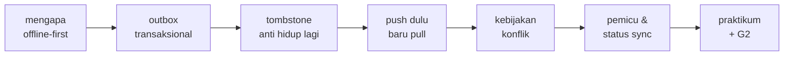
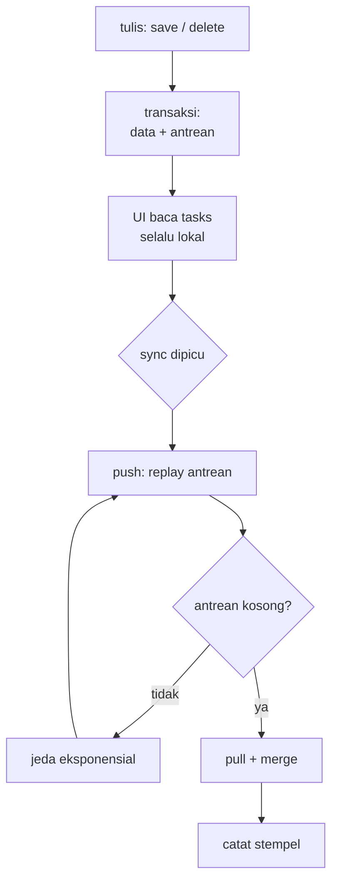

<!-- _class: title -->
<!-- _paginate: false -->

# Pertemuan 10
## Real-time Features & Advanced API Integration

Offline-first · SQLite lokal · Sinkronisasi & konflik · CAPSTONE G2: Data

<div class="note">"Advanced API" pada sesi ini berarti sinkronisasi lokal–remote yang tahan gangguan, bukan real-time streaming.</div>

**Sub-CPMK53.2** — mampu mengintegrasikan data persistence dan layanan API eksternal
Bacaan: modul-buku bab 10 · Praktikum: `starter-code/p10-offline-sync`

<div class="pengajar">

**Fahri Firdausillah, S.Kom, M.CS**
Teknik Informatika — Universitas Dian Nuswantoro

</div>

---

## Setelah pertemuan ini, Anda bisa

1. **Menjelaskan tiga penyakit sinkronisasi naif** — refresh yang menimpa, hapus tanpa kabar, semua error dianggap offline — dan empat keputusan arsitektural yang menyembuhkannya.
2. **Menaikkan skema SQLite ke v3** dengan tabel `outbox`, `tombstones`, dan `sync_meta` lewat migrasi tambah-saja.
3. **Menulis data yang tahan mati-aplikasi**: baris tugas dan operasi kirimnya tersimpan dalam satu transaksi.
4. **Menjalankan push sebelum pull**: replay antrean idempoten, merge dengan kebijakan konflik, dan ulang-jeda eksponensial untuk kegagalan yang wajar diulang.
5. **Mendemonstrasikan konflik nyata** antar-perangkat dan menjelaskan siapa menang serta mengapa.

<div class="note">

Bab 8 menutup dengan SQLite, bab 9 dengan REST dan autentikasi. **Hari ini keduanya digabung** — dan sesi tetap urusan vault bab 9: tidak ada satu byte pun yang pindah ke preferences.

</div>

---

## Peta perjalanan hari ini

Satu sistem yang menyembuhkan tiga penyakit, bukan kumpulan trik terpisah:



Empat keputusan pertama saling menopang; melepas satu, sisanya goyah.

Pertemuan ini juga **Gate 2 capstone** — segmen khusus di akhir kelas.

---

<!-- _class: section-break -->

# 1 · Mengapa Offline-First

Tiga penyakit klasik dan obatnya yang bukan trik

---

## Offline-first dalam satu kalimat

**Offline-first** berarti aplikasi membaca dan menulis ke penyimpanan lokal lebih dahulu. Jaringan menyamakan data setelahnya.

Contoh di StudyTracker:

```text
mode pesawat aktif
→ tambah tugas
→ tugas langsung muncul
→ tutup dan buka aplikasi: tugas tetap ada
→ koneksi pulih: perubahan dikirim ke server
```

<div class="ok">

Pengguna tetap bisa bekerja tanpa jaringan dan tidak perlu mengulang pekerjaannya saat koneksi kembali.

</div>

---

## Tiga penyakit penggabungan yang dilakukan asal

Bab 8 punya `SqliteTaskRepository`, bab 9 punya `ApiTaskRepository`. Menggabungkannya dengan asal melahirkan tiga penyakit yang semuanya pernah hidup di versi lama:

1. **Refresh yang menimpa.** Tarik seluruh data server, kosongkan tabel lokal, isi ulang — setiap tugas yang dibuat saat offline lenyap pada sinkronisasi pertama.
2. **Hapus tanpa kabar.** Delete hanya dijalankan di tabel lokal; server tidak pernah tahu; pull berikutnya memuat baris itu kembali — data terhapus hidup lagi.
3. **Semua kegagalan dianggap offline.** Token kedaluwarsa, payload ditolak, balasan rusak, dan jaringan putus masuk satu `catch` yang sama:

```dart
} catch (e) {
  // "mode offline" — padahal bisa 401, 422, atau JSON rusak
}
```

<div class="warn">

Penyakit ketiga paling licik: `getUnsyncedTasks()` ada di codebase tapi tak pernah dipanggil — replay tidak pernah terjadi, dan indikator tersinkron berbohong.

</div>

---

## Empat keputusan yang saling menopang

| Keputusan | Satu kalimat |
|---|---|
| **Outbox transaksional** | Baris data dan operasi kirimnya ditulis dalam SATU transaksi SQLite |
| **Tombstone** | Hapus lokal meninggalkan batu nisan; pull tidak membangkitkan baris mati |
| **Push sebelum pull** | Merge hanya berjalan setelah antrean kosong |
| **Kebijakan konflik di muka** | Siapa menang ditetapkan sebelum kasusnya terjadi, dibuktikan lewat pengujian |

Empat komponen baru, tugasnya tidak saling direbutkan:

| Komponen | Tugas tunggal |
|---|---|
| `OutboxStore` | tulis transaksional dan merge hasil pull |
| `SyncingTaskRepository` | kontrak `TaskRepository`: baca lokal, tulis lokal-plus-antrean |
| `SyncEngine` | protokol push lalu pull, dengan ulang-jeda |
| `ApiTaskRepository` | transport bab 9 — tidak tahu outbox ada |

---

## Siklus penuh satu putaran sinkronisasi



<div class="ok">

Konsekuensi terpentingnya: **UI tidak pernah menunggu jaringan**. `all()` membaca SQLite dan selesai dalam hitungan milidetik; sinkronisasi berjalan di belakang. Jaringan adalah penundaan yang diurus diam-diam — bukan gerbang di depan setiap layar.

</div>

---

<!-- _class: section-break -->

# 2 · Outbox & Tombstone

Niat mengirim tidak boleh terpisah dari datanya

---

<!-- _class: code-dense -->

## Outbox dan tombstone: mencatat niat pengguna

Dua catatan kecil menjaga niat pengguna:

- **Outbox**: operasi lokal yang sudah terjadi tetapi belum diterima server.
- **Tombstone**: penanda id yang sudah dihapus agar tidak hidup lagi saat pull.

```text
offline: tambah T1 → tasks: T1, outbox: upsert T1
offline: hapus T1  → tasks: kosong, tombstone: T1, outbox: delete T1
online: sinkron    → kirim antrean, baru tarik data server
```

<div class="note">

Outbox menyimpan "belum terkirim"; tombstone menyimpan "memang sudah dihapus".

</div>

---

## Skema v3: tiga tabel baru, migrasi tambah-saja

```dart
class TaskDatabase {
  /// v3 (bab 10): tabel outbox, tombstones, sync_meta.
  static const schemaVersion = 3;

  /// onCreate dan onUpgrade memakai jalur yang sama
  /// supaya skemanya tidak bisa berbeda.
  Future<void> _createSyncTables(Database db) async {
    await db.execute('''
      CREATE TABLE outbox (
        seq INTEGER PRIMARY KEY AUTOINCREMENT,
        op TEXT NOT NULL,
        task_id TEXT NOT NULL,
        payload TEXT,
        queued_at INTEGER NOT NULL
      )
    ''');
    await db.execute('''
      CREATE TABLE tombstones (
        task_id TEXT PRIMARY KEY,
        deleted_at INTEGER NOT NULL
      )
    ''');
    await db.execute('''
      CREATE TABLE sync_meta (
        key TEXT PRIMARY KEY,
        value TEXT NOT NULL
      )
    ''');
  }
}
```

Mengapa tambah-saja: instalasi bab 8 versi 2 dibuka dengan kode baru, `onUpgrade` hanya menambah tiga tabel — seluruh baris `tasks` lama selamat.

---

## Tiga keputusan kecil di skema ini

- **`seq` adalah `AUTOINCREMENT`** — urutan adalah bagian dari makna: upsert lalu delete lalu upsert untuk id sama menghasilkan keadaan akhir berbeda bila diacak.

- **`payload` menyimpan snapshot JSON saat diantrekan**, bukan saat dikirim** — edit berikutnya atas tugas sama mengantre sebagai operasi baru, tidak menimpa operasi lama yang mungkin sudah terkirim.

- **`tombstones` memakai `task_id` sebagai primary key** — satu hapus yang belum dikonfirmasi cukup satu batu nisan.

<div class="note">

Bandingkan dengan bab 8: di sana transaksi menjaga impor cadangan utuh; di sini transaksi menjaga **niat tidak terpisah dari akibatnya**. Prinsip yang sama, arah pemakaiannya berbeda.

</div>

---

<!-- _class: code-dense -->

## OutboxStore: simpan berpasangan atau tidak sama sekali

```dart
Future<void> upsertWithOutbox(Map<String, Object?> row) async {
  final db = await _database.database;
  await db.transaction((txn) async {
    await txn.insert(
      'tasks',
      row,
      conflictAlgorithm: ConflictAlgorithm.replace,
    );
    await txn.insert('outbox', {
      'op': 'upsert',
      'task_id': row['id']! as String,
      'payload': jsonEncode(row),   // snapshot saat antre
      'queued_at': DateTime.now().millisecondsSinceEpoch,
    });
  });
}
```

Mengapa transaksinya bukan formalitas: tanpanya, insert baris lalu insert antrean adalah dua operasi terpisah — aplikasi dibunuh sistem operasi di antara keduanya (kejadian sepele di mobile) meninggalkan **baris tanpa operasi**: data terlihat tersimpan tapi tidak akan pernah terkirim.

---

<!-- _class: code-dense -->

## Hapus: tiga tulisan dalam satu transaksi

```dart
Future<void> deleteWithTombstone(String taskId) async {
  final db = await _database.database;
  await db.transaction((txn) async {
    await txn.delete('tasks', where: 'id = ?', whereArgs: [taskId]);
    await txn.insert('tombstones', {
      'task_id': taskId,
      'deleted_at': DateTime.now().millisecondsSinceEpoch,
    }, conflictAlgorithm: ConflictAlgorithm.replace);
    await txn.insert('outbox', {
      'op': 'delete',
      'task_id': taskId,
      'payload': null,
      'queued_at': DateTime.now().millisecondsSinceEpoch,
    });
  });
}
```

Tombstone bertahan sampai server **mengonfirmasi** hapus — itulah yang mencegah pull membangkitkan baris yang sudah dihapus lokal. Inilah obat penyakit kedua: hapus yang tidak berpesan.

---

<!-- _class: code-dense -->

## Merge: kebijakan konflik dalam bentuk kode

```dart
Future<MergeReport> mergeRemoteRows(
  List<Map<String, Object?>> remoteRows,
) async {
  final db = await _database.database;
  final report = MergeReport();
  await db.transaction((txn) async {
    final pending = await _pendingTaskIds(txn);
    final dead = await _tombstonedIds(txn);
    final remoteIds = <String>{};

    for (final row in remoteRows) {
      final id = row['id']! as String;
      remoteIds.add(id);
      if (dead.contains(id)) {
        report.skippedTombstone++;   // delete menang
        continue;
      }
      if (pending.contains(id)) {
        report.skippedPending++;     // tulisan lokal menang
        continue;
      }
      await txn.insert('tasks', row,
          conflictAlgorithm: ConflictAlgorithm.replace);
      report.applied++;
    }
    // kelanjutan: baris lokal yang hilang dari server — slide berikut
  });
  return report;
}
```

Kebijakan konflik hidup di sini, bukan di dokumen desain: setiap baris server melewati dua pemeriksaan sebelum boleh menimpa lokal.

---

## Aturan ketiga: hilang dari server berarti dihapus

```dart
    final localRows = await txn.query('tasks', columns: ['id']);
    for (final local in localRows) {
      final id = local['id']! as String;
      final protected = pending.contains(id) || dead.contains(id);
      if (!remoteIds.contains(id) && !protected) {
        await txn.delete('tasks', where: 'id = ?', whereArgs: [id]);
        report.removedLocal++;
      }
    }
```

Bila baris lokal **tanpa** operasi menggantung tidak muncul di hasil pull, satu-satunya penjelasan konsisten: baris itu dihapus dari perangkat lain — lokal harus mengikuti. Tanpa aturan ini, hapus tidak pernah menjalar antar-perangkat.

<div class="warn">

Perhatikan siapa yang dilindungi: hanya baris dengan operasi menggantung atau tombstone. Baris yang "sekadar ada di lokal" **tidak punya hak menang** atas server.

</div>

---

<!-- _class: section-break -->

# 3 · Push Sebelum Pull

Merge hanya berjalan saat antrean kosong

---

<!-- _class: code-dense -->

## SyncingTaskRepository: kontrak yang sama, dunia yang baru

```dart
class SyncingTaskRepository implements TaskRepository {
  SyncingTaskRepository({
    required TaskDatabase database,
    required TaskRepository remote,
  }) : _local = SqliteTaskRepository(database),
       _store = OutboxStore(database),
       _remote = remote;

  final SqliteTaskRepository _local;
  final OutboxStore _store;
  final TaskRepository _remote;

  @override
  Future<List<Task>> all() => _local.all();   // lokal, seketika

  @override
  Future<void> save(Task task) =>
      _store.upsertWithOutbox(_local.taskToRow(task));

  @override
  Future<void> delete(String id) =>
      _store.deleteWithTombstone(id);
}
```

Tidak ada satu baris pun di sini yang menyentuh jaringan. Menyimpan tugas saat mode pesawat punya harga yang sama dengan Wi-Fi kencang: satu transaksi SQLite. Akibatnya: `TaskListController` bab 7 **tetap tidak berubah satu baris** — kontrak tetap kontrak.

---

<!-- _class: code-dense -->

## SyncEngine: satu putaran penuh

```dart
Future<SyncReport> sync() async {
  final report = SyncReport()..status = SyncStatus.syncing;

  final pushed = await _push(report);
  if (!pushed) return report;

  try {
    final remoteTasks = await _remote.all();
    final merge = await _store.mergeRemoteRows([
      for (final task in remoteTasks) _repository.taskToRow(task),
    ]);
    report
      ..appliedRows = merge.applied
      ..skippedPending = merge.skippedPending
      ..skippedTombstone = merge.skippedTombstone
      ..removedLocal = merge.removedLocal;
    await _store.markSynced(DateTime.now());
    report.status = SyncStatus.idle;
  } on ApiException catch (error) {
    report
      ..error = error
      ..status = SyncStatus.offline;
  }
  return report;
}
```

---

## Lima kata termahal di bab ini

```dart
if (!pushed) return report;   // pull tidak pernah berjalan
```

Versi lama menarik data server kapan pun koneksi kelihatan ada — hasilnya suntingan offline tertimpa baris server yang belum tahu suntingan itu. Dengan push-dulu, satu-satunya momen merge berjalan adalah **saat antrean kosong**.

Meski begitu, merge tetap memeriksa operasi menggantung (aturan kedua kebijakan konflik) — antrean bisa mendapat entri baru dari ketukan pengguna di tengah putaran yang sedang berjalan.

Dan bila pull gagal setelah push tuntas? Cukup laporkan `offline`: tidak ada tulisan lokal yang berisiko hilang, pull berikutnya menyusul.

---

<!-- _class: code-dense -->

## Replay: antrean dikirim berurutan

```dart
Future<bool> _push(SyncReport report) async {
  for (var attempt = 1; attempt <= maxAttempts; attempt++) {
    if (attempt > 1) await _sleep(nextDelay(attempt - 1));
    try {
      while (true) {
        final ops = await _store.pendingOps();
        if (ops.isEmpty) return true;
        for (final op in ops) {
          switch (op.op) {
            case OutboxOp.upsert:
              await _remote.save(
                  _repository.taskFromRow(op.row!));
            case OutboxOp.delete:
              await _remote.delete(op.taskId);
          }
          await _store.removeOp(op.seq);
          if (op.op == OutboxOp.delete) {
            await _store.clearTombstone(op.taskId);
          }
        }
      }
    } on ApiException catch (error) {
      if (!_retryable(error) || attempt == maxAttempts) {
        report.error = error;
        return false;   // status jujur, antrean utuh
      }
    }
  }
  return false;
}
```

Operasi dihapus dari antrean **satu per satu setelah diterima** — aplikasi mati setelah kirim tapi sebelum hapus hanya menyebabkan pengiriman ulang operasi yang sama, dan itu aman.

---

## Tiga properti yang membuat replay bisa dipercaya

1. **Idempoten.** `save` bab 9 memakai upsert `on_conflict=id`, `delete` memakai filter id — mengirim operasi sama dua kali berakhir di keadaan yang sama. "Server sudah menerima tapi jawaban hilang di jaringan" jadi kasus membosankan, bukan bencana.

2. **Berurutan.** Operasi diproses menaik `seq`: delete yang diikuti upsert untuk id sama tiba di server dengan makna yang benar.

3. **Berhenti yang tepat.** Kegagalan non-retryable tidak dibantai dengan ulangan — antrean dibiarkan utuh dan statusnya jujur.

<div class="ok">

Batas yang jujur: dua edit cepat atas tugas sama menghasilkan dua operasi — baris akhirnya benar, biayanya dua permintaan. Konsolidasi antrean adalah optimasi sah yang sengaja tidak ditulis, supaya kebenaran replay terlihat polos.

</div>

---

<!-- _class: split -->

## Ulang dengan jeda eksponensial

```dart
Duration nextDelay(int attempt) {
  final growth = pow(2, attempt - 1);
  final ms = (initialDelay
          .inMilliseconds * growth)
      .round();
  return Duration(milliseconds:
      min(ms, maxDelay.inMilliseconds));
}
```

<div>

Kegagalan jaringan dan tekanan server **wajar dicoba ulang** — tetapi tidak boleh beruntun tanpa jeda: 1 dtk, 2, 4, 8, dipatok `maxDelay` 30 detik.

Kezaliman lain tidak akan membaik dengan diulang: sesi habis butuh masuk lagi, payload ditolak butuh perbaikan data.

<div class="note">

Produksi menambah **jitter acak**: ribuan klien yang gagal bersamaan tidak menyerang server pada detik yang sama (*thundering herd*).

</div>

</div>

---

## Pemetaan kegagalan ke tindakan

| Kegagalan | Tindakan SyncEngine | Status akhir |
|---|---|---|
| Jaringan putus / timeout | ulang dengan jeda eksponensial sampai batas | `offline` |
| 429 / 5xx | ulang dengan jeda; produksi menghormati `Retry-After` | `offline` |
| 401 tak kunjung sehat | berhenti; antrean aman menunggu masuk lagi | `needsSignIn` |
| Payload ditolak (422) | berhenti; butuh perbaikan data, bukan pengulangan | `failed` |
| 403 / balasan rusak | berhenti; laporkan apa adanya | `failed` |

Sesi tetap urusan bab 9: 401 disambut penyegaran lewat **refresh token** di `AuthApi`; bila refresh ditolak, SyncEngine menerima `SessionExpired` dan berhenti jujur.

<div class="ok">

`needsSignIn` yang bisa dipercaya berarti UI cukup beralih ke layar masuk — setelah pengguna masuk kembali, sinkronisasi berikutnya menemukan antrean yang masih utuh. Bandingkan dengan satu `catch` "offline": pengguna menatap indikator tersinkron yang bohong.

</div>

---

## Kebijakan konflik: tiga kalimat, ditulis di muka

Konflik sinkronisasi bukan pertanyaan *apakah*, tapi *kapan*. Kebijakan bab ini:

1. **Operasi lokal yang menggantung mengalahkan baris server.** Tulisan yang belum terkirim tidak boleh dikalahkan data yang ditarik.
2. **Delete mengalahkan update.** Baris yang dihapus pengguna tidak dibangkitkan hidup kembali oleh pull.
3. **Untuk sisanya, server menang.** Baris yang sudah tersinkron mengikuti keadaan global — termasuk hapus dari perangkat lain.

Semuanya sudah hidup di `mergeRemoteRows`, dibuktikan oleh test.

<div class="warn">

**Kejujuran soal batas:** pemenang ditentukan urutan antrean, bukan perbandingan isi — dua edit pada field berbeda tetap saling menimpa utuh, edit yang kalah benar-benar hilang. Resolusi per-field butuh `updated_at` per kolom; resolusi tanpa kekalahan (CRDT) butuh struktur jauh lebih berat. **Kebijakan eksplisit dan sederhana mengalahkan yang canggih tapi tidak ditulis.**

</div>

---

## Dua demonstrasi konflik

### 1. Edit simultan dua perangkat

Ponsel mode pesawat menyunting "Kirim laporan" menjadi "Kirim laporan Q3" — upsert menggantung di antrean. Laptop menyunting tugas sama; server menyimpan versi laptop. Ponsel kembali online:

- Push mengirim versi ponsel **lebih dulu**; upsert `on_conflict=id` menimpa versi laptop di server.
- Pull mengembalikan baris — kini versi ponsel sendiri; merge menerapkannya tanpa drama.
- Versi laptop kalah total: bukan karena salah, tapi karena kebijakan memilih satu pemenang, dan yang menyinkronkan terakhir adalah ponsel.

### 2. Delete saat offline

Ponsel menghapus tugas saat offline. Pull mengembalikan baris itu — server memang belum tahu. Tombstone menolaknya, lalu push mengirim delete. **Baris tidak hidup lagi, di kedua sisi.**

---

<!-- _class: section-break -->

# 4 · Pemicu & Status

Kapan sync menyala, dan bagaimana pengguna tahu

---

<!-- _class: code-dense -->

## Tiga pemicu yang sama-sama menekan satu tombol

```dart
class SyncTriggers {
  SyncTriggers(this._engine);

  final SyncEngine _engine;
  StreamSubscription<List<ConnectivityResult>>? _connectivity;
  Timer? _periodic;

  void start() {
    // 1. Koneksi pulih: antrean biasanya menumpuk
    //    justru karena jaringan tadi mati.
    _connectivity = Connectivity().onConnectivityChanged
        .listen((results) {
      final online =
          results.any((r) => r != ConnectivityResult.none);
      if (online) unawaited(_engine.sync());
    });

    // 2. Jaring pengaman tiap 15 menit: menangkap kasus
    //    jaringan tak pernah benar-benar putus tapi gagal.
    _periodic = Timer.periodic(
      const Duration(minutes: 15),
      (_) => unawaited(_engine.sync()),
    );
  }

  void dispose() {
    _connectivity?.cancel();
    _periodic?.cancel();
  }
}
```

Pemicu ketiga: tombol manual di app bar — memanggil `_engine.sync()` langsung. Pemicu hanya selera; **protokolnya sudah selesai**.

---

## Dari menarik menjadi didorong

Ketiga pemicu di atas satu sifatnya: aplikasi **menebak** kapan sebaiknya bertanya. Untuk data yang berubah dari tempat lain, tebakan yang baik pun terasa lambat. Supabase bisa membalik arahnya — server memberi tahu:

```dart
final channel = supabase
    .channel('public:tasks')
    .onPostgresChanges(
      event: PostgresChangeEvent.all,
      schema: 'public',
      table: 'tasks',
      callback: (payload) => unawaited(_engine.sync()),
    )
    .subscribe();
```

Perhatikan apa yang **tidak berubah**: callback tidak menyentuh SQLite, tidak menulis baris dari payload, tidak menyalip antrean. Ia memanggil `sync()` — persis seperti tombol di app bar.

---

## Godaan yang hampir selalu keliru

<div class="warn">

**"Menghemat satu putaran" dengan menulis payload realtime langsung ke tabel lokal.**

Payload itu tidak melewati kebijakan konflik Anda — ia bisa menimpa perubahan lokal yang masih mengantre. Anda memperoleh kembali penyakit pertama yang baru dibasmi: **refresh yang menimpa**.

Realtime adalah **pemicu yang lebih baik**, bukan jalur data yang kedua. Seluruh arsitektur — outbox, tombstone, push-dulu, merge — tetap satu-satunya jalan data masuk.

</div>

`sync()` aman dipanggil berkali-kali: replay idempoten karena bergantung pada upsert `on_conflict=id`, dan `SyncEngine` menolak putaran kedua selama putaran pertama masih berjalan. Ketiga pemicu boleh menyala bersamaan tanpa saling merusak.

Satu aturan wiring lagi: **keluar akun membersihkan database lokal** — baris milik akun lama tidak berhak terbaca sesi berikutnya.

---

## Status yang layak ditampilkan pengguna

```dart
switch (report.status) {
  case SyncStatus.idle:
    // antrean kosong, data menyatu: "tersinkron"
  case SyncStatus.offline:
    // jaringan/tekanan server: ulang nanti, antrean aman
  case SyncStatus.needsSignIn:
    // sesi habis: arahkan masuk lagi, antrean menunggu
  case SyncStatus.failed:
    // payload/kebijakan: periksa report.error.message
  case SyncStatus.syncing:
    // sedang berjalan
}
```

UI membungkusnya tipis lewat `SyncController extends ChangeNotifier`: simpan `status` dan jumlah operasi `pending`, panggil `notifyListeners()` setelah setiap putaran — indikator di app bar ikut berubah tanpa layar tahu soal `SyncEngine`.

<div class="note">

Lima status ini adalah kontrak antara lapisan sinkronisasi dan UI. Bedakan juga **kegagalan** dari **kemacetan**: `offline` berarti coba lagi nanti; `failed` berarti ada yang harus diperbaiki.

</div>

---

## Pagination, delta pull, dan operasi massal

**Batas yang jujur dari bab ini:** `sync()` menarik seluruh baris milik pengguna setiap putaran — untuk ribuan baris ini boros.

- **Delta pull.** Perbaikan yang lurus: tarik hanya baris dengan `updated_at` melampaui `last_synced_at` yang sudah tersimpan di `sync_meta`. Menuntut jaminan jam server — itulah sebabnya tidak dicampur ke protokol inti.

- **Pagination REST** (bab 9 dan 13): `?limit=&offset=` atau header `Range` — muat 20 baris pertama, bukan 200, saat daftar panjang.

- **Bulk operations.** Banyak tulisan lokal sekaligus dibungkus **satu transaksi batch** SQLite; kirim antrean berkelompok untuk memangkas round-trip.

- **Sinkronisasi latar belakang saat aplikasi tertutup** sengaja tidak dibahas: menuntut penjadwal sistem (`workmanager`) dan berhadapan dengan Doze serta pembatasan per pabrikan — biayanya besar, nyaris tak ada aplikasi produktivitas yang butuh.

---

## Praktikum hari ini

**Target:** sinkronisasi dua arah SQLite ↔ server dengan resolusi konflik last-write-wins — di `starter-code/p10-offline-sync`, memakai server palsu in-memory sehingga pull/push/konflik bisa dilatih tanpa jaringan.

1. Jalankan starter, tambah dua tugas saat offline (badge pending), tekan **Sinkronkan** — push `dao.pendingOnly()`, lalu tiap baris ditandai `synced`
2. **TODO P10-2 (pull):** item `srv-1` dari `MemoryRemoteApi` tersimpan lokal setelah sync
3. **TODO P10-3 (konflik LWW):** panggil `debugServerSideEdit('srv-1', ...)` lalu edit item sama secara lokal, sync — `updatedAt` yang lebih baru menang, `conflicts` terhitung; jangan menimpa pending dengan data lama
4. Nyalakan airplane mode, tambah tugas, sync gagal — bungkus `_syncNow` dengan try-catch dan tampilkan kegagalan dengan jelas
5. Lanjutan di modul: pemicu `connectivity_plus`, backoff eksponensial, tombstone penuh, delta pull

<div class="note">

Urutan di starter sama dengan modul: **push dulu baru pull** — mencegah data pending tertimpa versi lama dari server.

</div>

---

## Bekerja dengan AI di materi ini

**Pantas didelegasikan**
*Architecture design feedback.* Ceritakan draf arsitektur sinkronisasi Anda kepada AI dan minta ulasannya: menanyakan pola umum seperti transactional outbox, membandingkan strategi resolusi konflik, menafsirkan kegagalan sinkronisasi yang aneh.

**Tulis sendiri**
Kebijakan konflik dan urutan push-pull Anda. "Siapa yang menang saat dua perangkat mengubah baris yang sama" adalah keputusan produk yang berakibat pada data pengguna — jawaban umum yang sopan dari AI tidak menanggung akibat itu. Bagian ini yang menentukan apakah materi ini benar-benar Anda kuasai.

<div class="note">

**Latihan:** minta AI mengusulkan penyederhanaan atas arsitektur outbox ini. Kemungkinan besar ia menawarkan tulis-langsung-ke-server dengan cadangan lokal — lebih pendek, lebih mudah dibaca. Telusuri usul itu terhadap tiga penyakit di awal kelas dan tunjukkan penyakit mana yang kembali. Ini latihan menolak saran yang **tampak lebih sederhana, tetapi salah**.

</div>

---

## Ringkasan

- **Offline-first bukan "simpan lokal plus coba kirim"** — tiga penyakitnya (refresh menimpa, hapus tanpa kabar, semua error dianggap offline) disembuhkan empat keputusan: outbox transaksional, tombstone, push sebelum pull, kebijakan konflik eksplisit.
- **Skema v3 menambah `outbox`, `tombstones`, `sync_meta`** lewat migrasi tambah-saja; `onCreate` dan `onUpgrade` berbagi jalur yang sama.
- **Data dan niat mengirimnya ditulis dalam satu transaksi** — aplikasi mati di tengah hanya menyisakan antrean yang jujur.
- **`SyncingTaskRepository` menepati kontrak lama**: UI tidak pernah menunggu jaringan, controller tidak berubah satu baris.
- **Replay idempoten** (upsert `on_conflict=id`), **berurutan** (`seq`), dan **berhenti pada kegagalan yang tepat**.
- **Kegagalan dipetakan**: jaringan diulang dengan jeda eksponensial; sesi habis → `needsSignIn` dengan antrean aman; payload ditolak → berhenti.
- **Kebijakan konflik tiga kalimat** hidup di kode merge: pending menang, delete menang, sisanya server — dibuktikan test, bukan keberuntungan.
- **Realtime hanyalah pemicu yang lebih baik**, bukan jalur data kedua — payload tidak pernah menulis langsung ke tabel lokal.

---

<!-- _class: section-break -->

# 5 · Capstone — Gate 2

Aplikasi Anda berhenti menjadi demo

---

## G2 — Data: target minggu ini

**Bobot 10% · due minggu ini.** Dua kemampuan baru: data hidup di server, dan aplikasi tetap berguna saat jaringan mati.

- **REST API**: minimal satu entitas dengan baca, tulis, hapus — diakses lewat HTTP, bukan SDK yang menyembunyikan request-nya. Backend bebas: Supabase, Firebase, buatan sendiri.
- **Autentikasi**: daftar dan masuk; token tersimpan aman dan tidak hilang saat dibuka ulang.
- **Penyimpanan lokal** yang bertahan setelah aplikasi ditutup.
- **Offline**: data yang pernah dimuat tetap terbaca tanpa jaringan, dan perubahan offline tidak lenyap begitu saja — sinkronisasi dua arah penuh **tidak dituntut** di gate ini.
- **Kegagalan dibedakan**: tanpa jaringan, sesi kedaluwarsa, dan data ditolak server terlihat berbeda oleh pengguna. Satu `catch` "terjadi kesalahan" dinilai belum memenuhi.

---

## G2 — penyerahan dan verifikasi sendiri

**Penyerahan:** tag `gate-2` di repo + satu blok `CHANGELOG.md` + video demo 5 menit. Rubrik lengkap: `penugasan/capstone/G2_Data.md`.

<div class="ok">

**Untuk video: perlihatkan mode pesawat dinyalakan sambil aplikasi berjalan.** Itu satu adegan yang membuktikan paling banyak.

</div>

Sebelum menyetor, periksa:

- [ ] Kunci API tidak ada di repo — tidak juga di riwayat commit
- [ ] Aplikasi ditutup lalu dibuka lagi, pengguna masih masuk
- [ ] Mode pesawat: data lama masih terbaca
- [ ] Mode pesawat: satu perubahan dibuat, jaringan pulih, perubahan tidak hilang
- [ ] Token dirusak sengaja: aplikasi bilang sesi berakhir, bukan "terjadi kesalahan"
- [ ] Server dimatikan / URL disalahkan: aplikasi tidak crash

---

<!-- _class: section-break -->

# Pertemuan berikutnya

**P11 — Advanced State Management**

Tracker hari ini sudah utuh: UI, penyimpanan, jaringan, sinkronisasi. Tapi semakin banyak layar yang menyimpan state masing-masing, semakin mudah data tidak sinkron antar layar — saatnya arsitektur state.

Baca sebelum kelas: modul-buku bab 7 (bagian Provider)
