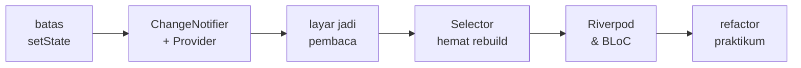
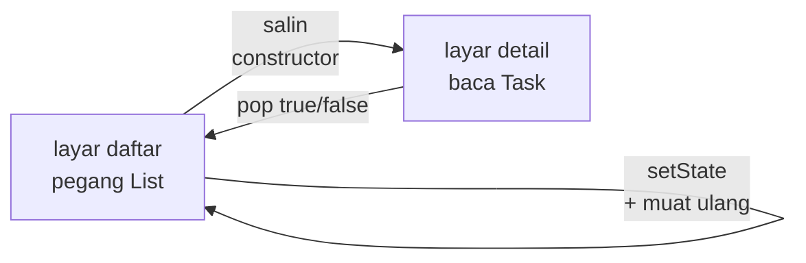

<!-- _class: title -->
<!-- _paginate: false -->

# Pertemuan 11
## Advanced State Management

Dari setState ke Provider · ChangeNotifier · BLoC & Riverpod (pembanding) · CAPSTONE: state refactoring

**Sub-CPMK53.2** — mampu mengintegrasikan data persistence dan layanan API eksternal
Bacaan: modul-buku bab 7 · Praktikum: `starter-code/p11-provider-state`

<div class="pengajar">

**Fahri Firdausillah, S.Kom, M.CS**
Teknik Informatika — Universitas Dian Nuswantoro

</div>

---

## Setelah pertemuan ini, Anda bisa

1. **Menganalisis keterbatasan `setState`** — duplicate state, prop drilling, update kompleks — dan menentukan kapan state perlu diangkat keluar widget tree.
2. **Membangun `ChangeNotifier`** (`TaskProvider`, `AuthProvider`, `SyncProvider`) sebagai satu sumber kebenaran dengan update immutable.
3. **Menghubungkan state ke widget tree** lewat `MultiProvider`, dan memilih `Consumer`, `context.watch`, `context.read`, atau `Selector` sesuai kebutuhan data versus aksi.
4. **Merefactor StudyTracker dari `setState` ke Provider** dengan perilaku yang tetap sama, plus persist dan restore state lintas restart.
5. **Menilai kapan BLoC atau Riverpod layak dipakai** dengan membandingkan controller yang sama ditulis ulang di ketiga pustaka.

<div class="note">

Dua pain point P03 — duplicate state antar screen dan prop drilling — hari ini diselesaikan tuntas: rasakan sendiri saat `AuthGate` berganti layar tanpa satu pun `Navigator` manual.

</div>

---

## Peta perjalanan hari ini

Satu refactor besar, bukan lima contoh terpisah:



Semua kode diadaptasi dari bab 7 dan starter `p11-provider-state` — nama class mengikuti starter: `TaskProvider`, `AuthProvider`, `SyncProvider`.

Starter: `flutter create` di `starter-code/p11-provider-state`, lalu `flutter pub get`.

---

<!-- _class: section-break -->

# 1 · Batas setState

Duplicate state, prop drilling, dan kepemilikan yang kabur

---

## Titik berangkat: pola P03 yang kita tinggalkan

```dart
class _HomeScreenState extends State<HomeScreen> {
  var _tasks = <Task>[];                 // salinan milik layar ini

  Future<void> _toggle(Task task) async {
    await repository.save(task.copyWith(completed: !task.completed));
    final tasks = await repository.all();
    if (!mounted) return;
    setState(() => _tasks = tasks);      // sinkronisasi manual
  }
}
```

Pola ini jujur dan bekerja: setiap aksi = simpan, muat ulang, cek `mounted`, `setState`. Masalahnya bukan sintaks, melainkan **kepemilikan data** — setiap layar memegang salinannya sendiri.

---

## Apa yang sebenarnya terjadi antar layar



Setiap layar baru yang butuh data yang sama memerlukan **salinan dan protokol pelaporannya sendiri**.

Dua salinan data berarti dua tempat yang bisa tidak sinkron; setiap protokol pelaporan adalah satu kontrak yang harus dijaga. Aplikasi tiga layar masih tertangani — sepuluh layar dengan lima jenis perubahan data, tidak lagi.

---

## Prop drilling dan update yang makin kompleks

- **Filter pencarian** — `query` hidup di `HomeScreen`. Begitu field cari dipindah ke widget terpisah atau bottom sheet, nilai dan notifikasinya harus dioper turun-naik lewat konstruktor plus callback berlapis.

- **Status sesi** — layar mana pun perlu tahu pengguna sudah login. Tanpa pemilik bersama, tiap layar memeriksa sendiri — dan hasilnya bisa saling bertentangan.

- **Update kompleks** — satu toggle = simpan, muat ulang, `mounted`, `setState`. Kalikan dengan jumlah aksi, kalikan lagi dengan jumlah layar.

<div class="warn">

**Gejala khas prop drilling:** widget di tengah tree hanya meneruskan parameter dan callback tanpa memakainya sendiri. Menambah layar berarti menambah protokol sinkronisasi baru.

</div>

---

## State lokal atau app state

`setState` bukan teknologi yang harus dihindari; ia alat yang tepat untuk pekerjaan tertentu.

| | State lokal | App state |
|---|---|---|
| Contoh | teks yang diketik, indeks tab, status animasi | daftar tugas, sesi login, status sinkronisasi |
| Pembacanya | satu widget | layar dan panel yang tak saling mengenal |
| Umurnya | seumur widget | seumur aplikasi |
| Alat tepat | `setState` | `ChangeNotifier` + provider |

<div class="ok">

**Sebelum menambah alat, pastikan masalahnya memang ada.** Hari ini masalahnya ada: StudyTracker sudah punya banyak layar yang membaca data yang sama.

</div>

---

<!-- _class: section-break -->

# 2 · Provider & ChangeNotifier

Satu sumber kebenaran di luar widget tree

---

## Solusi strukturnya: pisahkan penyebaran dan pemberitahuan

Solusinya sederhana diucapkan: pindahkan kepemilikan data ke **satu tempat di luar semua layar**, beri tahu siapa pun yang peduli saat data berubah, dan biarkan layar menjadi pembaca murni.

Flutter lama punya `InheritedWidget` — penyebaran data ke bawah tree, mekanisme di balik `Theme.of(context)`. Yang tidak disediakan: **pemberitahuan perubahan yang nyaman**. Paket `provider` mengisi kekosongan itu:

```dart
// InheritedWidget  = penyebaran data ke bawah tree
// ChangeNotifier   = pemberitahuan saat data berubah
// provider         = keduanya, satu pola dalam hitungan baris
```

Paket pertama StudyTracker — dan seperti janji bab 4, tiap paket membayar "biaya sewa"-nya di `pubspec.yaml`:

```yaml
dependencies:
  provider: ^6.1.2
```

---

<!-- _class: code-dense -->

## TaskProvider — pemilik state, bagian 1

```dart
class TaskProvider extends ChangeNotifier {
  final List<Task> _tasks = [
    const Task(id: 't1', title: 'Refactor ke Provider',
        category: 'Proyek', priority: Priority.high),
    const Task(id: 't2', title: 'Coba Consumer vs Selector',
        category: 'Belajar'),
    const Task(id: 't3',
        title: 'Hapus semua setState', completed: true),
  ];

  /// Kata kunci filter — layar mana pun bisa
  /// mengubahnya lewat setQuery, tanpa callback.
  String query = '';

  List<Task> get tasks {
    final q = query.toLowerCase();
    if (q.isEmpty) return List.unmodifiable(_tasks);
    return List.unmodifiable(_tasks.where(
        (t) => t.title.toLowerCase().contains(q)));
  }

  int get doneCount =>
      _tasks.where((t) => t.completed).length;
}
```

Tidak ada satu pun widget di class ini — ia class Dart biasa yang bisa diuji tanpa menjalankan aplikasi. Justru itu intinya.

---

<!-- _class: code-dense -->

## TaskProvider — bagian 2: perubahan lewat metode

```dart
  final List<void Function()> _undoStack = [];

  void setQuery(String value) {
    query = value;
    notifyListeners();
  }

  void addTask(String title) {
    _tasks.add(Task(
        id: 't${DateTime.now().millisecondsSinceEpoch}',
        title: title));
    notifyListeners();
  }

  void toggleComplete(String id) {
    final i = _tasks.indexWhere((t) => t.id == id);
    if (i == -1) return;
    _tasks[i] = _tasks[i].copyWith(
        completed: !_tasks[i].completed);
    notifyListeners();
  }

  void deleteTask(String id) {
    final index = _tasks.indexWhere((t) => t.id == id);
    if (index == -1) return;
    final removed = _tasks.removeAt(index);
    _undoStack.add(() {
      _tasks.insert(index, removed);
      notifyListeners();
    });
    notifyListeners();
  }
```

`deleteTask` menyimpan **operasi kebalikannya** ke `_undoStack` — benih undo/redo yang Anda selesaikan sendiri di praktikum.

---

## Empat keputusan yang membentuk class ini

- **State privat, dibaca lewat getter.** Satu-satunya jalan mengubah daftar adalah memanggil metode class ini — dan semuanya berakhir di `notifyListeners()`.

- **Getter mengembalikan `List.unmodifiable`.** UI tidak bisa mengubah daftar diam-diam; kolom ` subtitle` di `ListView` tidak bisa menambah item.

- **Update immutable.** `copyWith` mengembalikan objek baru dan meninggalkan objek lama utuh — mutasi diam-diam adalah bug yang paling sulit dilacak.

- **Filter terpusat di `query`.** Layar mana pun memanggil `setQuery` tanpa callback berlapis; prop drilling mati di sini.

<div class="note">

Bandingkan dengan `_toggle` P03: simpan, muat ulang, `mounted`, `setState` — kini satu panggilan metode. Sinkronisasi adalah tanggung jawab satu pihak.

</div>

---

<!-- _class: code-dense -->

## MultiProvider — memasang pemilik state di puncak tree

```dart
class StudyTrackerApp extends StatelessWidget {
  const StudyTrackerApp({super.key});

  @override
  Widget build(BuildContext context) {
    // Semua provider hidup DI ATAS widget yang memakainya.
    return MultiProvider(
      providers: [
        ChangeNotifierProvider(
            create: (_) => AuthProvider()),
        ChangeNotifierProvider(
            create: (_) => TaskProvider()),
      ],
      child: MaterialApp(
        title: 'StudyTracker P11',
        theme: ThemeData(
          colorScheme: ColorScheme.fromSeed(
              seedColor: const Color(0xFF00695C)),
        ),
        home: const AuthGate(),
      ),
    );
  }
}
```

`create` bersifat **malas (lazy)**: instance baru dibuat saat pertama kali dibaca oleh widget — bukan saat aplikasi start. Provider juga otomatis memanggil `dispose()` saat aplikasi ditutup.

---

<!-- _class: split -->

## AuthGate — navigasi menjadi reaktif

```dart
/// Bereaksi terhadap perubahan sesi —
/// navigasi tidak lagi manual.
class AuthGate extends StatelessWidget {
  const AuthGate({super.key});

  @override
  Widget build(BuildContext context) {
    final auth =
        context.watch<AuthProvider>();
    return auth.isSignedIn
        ? const HomeScreen()
        : const LoginScreen();
  }
}
```

<div>

**Ini slide terpenting hari ini.**

Dulu (P03): login sukses → `Navigator.pushReplacement` → kirim flag bolak-balik.

Sekarang: `AuthGate` **membaca state sesi** dan memetakan dua kondisi menjadi dua layar.

Sign out dari mana pun → `notifyListeners` → `AuthGate` membangun ulang → aplikasi kembali ke `LoginScreen`. **Tanpa satu pun `Navigator` manual.**

Navigasi adalah fungsi dari state — bukan urutan perintah.

</div>

---

<!-- _class: split -->

## AuthProvider — provider kedua, pola yang sama

```dart
class AuthProvider extends ChangeNotifier {
  String? _email;

  bool get isSignedIn =>
      _email != null;

  /// Simulasi signIn — tanpa backend.
  Future<bool> signIn(
      String email, String password) async {
    await Future<void>.delayed(
        const Duration(milliseconds: 500));
    if (!email.contains('@') ||
        password.length < 6) {
      return false;
    }
    _email = email;
    notifyListeners();  // AuthGate dengar
    return true;
  }

  void signOut() {
    _email = null;
    notifyListeners();
  }
}
```

<div>

Masalahnya sejenis dengan daftar tugas, maka polanya pun sama: **satu sumber kebenaran yang memberi tahu pendengarnya.**

Di aplikasi sungguhan, `signIn` memanggil API (hasil belajar P09) dan token disimpan aman untuk di-restore saat restart — itu bagian praktikum hari ini.

`isSignedIn` dihitung dari `_email`, bukan disimpan sebagai boolean terpisah: **tidak ada dua field yang bisa saling bertentangan.**

</div>

---

<!-- _class: code-dense -->

## Layar menjadi pembaca murni

```dart
  @override
  Widget build(BuildContext context) {
    return Consumer<TaskProvider>(
      builder: (context, tasks, _) {
        return Scaffold(
          appBar: AppBar(title: const Text('StudyTracker')),
          body: Column(
            children: [
              TextField(
                decoration: const InputDecoration(
                    labelText: 'Cari tugas'),
                onChanged: (v) => context
                    .read<TaskProvider>()
                    .setQuery(v),
              ),
              Padding(
                padding: const EdgeInsets.all(12),
                child: Text('${tasks.doneCount} dari '
                    '${tasks.tasks.length} selesai'),
              ),
              Expanded(
                  child: _TaskList(tasks: tasks.tasks)),
            ],
          ),
        );
      },
    );
  }
```

`HomeScreen` kehilangan seluruh state lokalnya: tidak ada `initState`, tidak ada `_tasks`, tidak ada `_load`. Ia `StatelessWidget` yang menerjemahkan state menjadi tampilan dan event menjadi panggilan provider.

---

<!-- _class: code-dense -->

## Aksi lewat context.read — tanpa listen

```dart
class _TaskList extends StatelessWidget {
  const _TaskList({required this.tasks});

  final List<Task> tasks;

  @override
  Widget build(BuildContext context) {
    return ListView.builder(
      itemCount: tasks.length,
      itemBuilder: (context, i) {
        final task = tasks[i];
        return ListTile(
          leading: Icon(task.completed
              ? Icons.check_circle
              : Icons.circle_outlined),
          title: Text(task.title),
          subtitle: Text(task.category),
          trailing: IconButton(
            icon: const Icon(Icons.delete_outline),
            onPressed: () => context
                .read<TaskProvider>()
                .deleteTask(task.id),
          ),
          onTap: () => context
              .read<TaskProvider>()
              .toggleComplete(task.id),
        );
      },
    );
  }
}
```

Menekan tombol tidak butuh rebuild — jadi pakai `read`, bukan `watch`. Setelah `notifyListeners`, `Consumer` di atas yang membangun ulang daftar ini dengan data terbaru.

---

## Empat mode akses — seberapa sempit wilayah rebuild

| Mode akses | Kapan dipakai | Efek rebuild |
|---|---|---|
| `Consumer<T>` / `context.watch<T>()` | membangun subtree dari data provider | subtree di bawahnya tiap notifikasi |
| `context.read<T>()` | aksi: memanggil metode, tak butuh nilai | tidak ada |
| `Selector<T, R>` | hanya butuh sebagian data (`R`) | hanya saat nilai `R` berubah |
| `context.select<T, R>` | sama seperti Selector, satu baris di `build` | hanya saat nilai `R` berubah |

Pilihan mode akses adalah **kontrak performa** Anda: `watch` untuk data, `read` untuk aksi, `Selector` saat sebagian data cukup.

---

## Dua aturan praktis penutup

### 1. `read` hanya untuk aksi; `watch` hanya di `build`

`context.watch` di dalam callback `onPressed` salah — callback tidak punya siklus hidup build. Sebaliknya `context.read` di `build` untuk menampilkan nilai hampir selalu salah: nilainya tidak akan pernah diperbarui.

### 2. Gunakan context yang tepat

Dialog dan route baru punya context sendiri; provider dicari **ke atas dari context itu**.

<div class="warn">

**`ProviderNotFoundException`** penyebabnya hampir selalu salah satu dari dua: provider dipasang terlalu rendah di tree (di bawah layar yang membacanya), atau pembacaan memakai context dialog padahal provider berada di atas layar pemanggil.

Untuk aksi dari dalam dialog: simpan referensi controller dari context layar **sebelum** membuka dialog.

</div>

---

<!-- _class: section-break -->

# 3 · Mendengar Granular

Rebuild hanya bagian yang peduli

---

## Setiap notifikasi membangun ulang semua pendengarnya

Maka pendengar yang boros adalah **widget yang membaca lebih dari yang dibutuhkan**.

Ambil penghitung di atas daftar: ia hanya peduli dua angka — `doneCount` dan panjang daftar. Saat pengguna mengubah judul satu tugas, kedua angka itu tidak berubah.

Tapi karena ia dibangun di dalam `Consumer<TaskProvider>` yang membaca seluruh provider, ia ikut dibangun ulang **setiap kali** `notifyListeners` terjadi — mengetik satu huruf di kolom pencarian pun.

<div class="ok">

**Granularitas pendengaran adalah API performa Anda.** Prinsipnya sama dengan memilih parameter widget secermat mungkin: beri widget tepat data yang ia perlukan, tidak lebih.

</div>

---

## Selector — dengar hanya sebagian data

```dart
Selector<TaskProvider, bool>(
  selector: (_, provider) => provider.canUndo,
  builder: (context, canUndo, _) => IconButton(
    tooltip: 'Undo',
    onPressed: canUndo
        ? () => context.read<TaskProvider>().undo()
        : null,
    icon: const Icon(Icons.undo),
  ),
)
```

Tombol undo ini hanya peduli satu boolean: `canUndo`.

Saat pengguna mengubah judul tugas, `canUndo` tidak berubah — tombol ini **tidak dibangun ulang**. Saat penghapusan pertama terjadi, hanya tombol ini yang ikut bangun ulang, bukan seluruh AppBar apalagi daftar.

---

## Ukur sendiri: rebuild itu bisa dibuktikan

```dart
Selector<TaskProvider, int>(
  selector: (_, provider) => provider.tasks.length,
  builder: (context, count, _) {
    debugPrint('penghitung rebuild: $count');
    return Text('$count tugas');
  },
)
```

Ganti satu `Consumer` menjadi `Selector<int>` seperti ini (checkpoint praktikum), lalu amati konsol:

- Menambah dan menghapus tugas → print muncul; jumlah berubah.
- Toggle atau ketik di pencarian → **print tidak muncul**; nilai terpilih tidak berubah.

<div class="note">

Bandingkan dengan `debugPrint` di dalam `Consumer`: ia muncul pada **setiap** perubahan provider. Selisih keduanya adalah biaya rebuild yang baru Anda hematkan.

</div>

---

<!-- _class: section-break -->

# 4 · BLoC & Riverpod

Controller yang sama, ditulis ulang

---

## Riverpod: provider sebagai grafik, bukan widget

```dart
final taskRepositoryProvider = Provider<TaskRepository>(
  (ref) => throw UnimplementedError(
      'override di ProviderScope'),
);

final taskListProvider =
    AsyncNotifierProvider<TaskListNotifier, List<Task>>(
        TaskListNotifier.new);

class TaskListNotifier extends AsyncNotifier<List<Task>> {
  @override
  Future<List<Task>> build() =>
      ref.watch(taskRepositoryProvider).all();

  Future<void> toggle(Task task) =>
      save(task.copyWith(completed: !task.completed));

  Future<void> save(Task task) async {
    final repository = ref.read(taskRepositoryProvider);
    state = const AsyncLoading();
    state = await AsyncValue.guard(() async {
      await repository.save(task);
      return repository.all();
    });
  }
}
```

Keluhan paling sah terhadap `provider` adalah ketergantungannya pada `BuildContext`. Riverpod memindahkan penyediaan **keluar widget tree**: provider jadi variabel global — tidak ada satu pun context di kode ini.

---

## Yang hilang, dan yang Anda bayar

Di layar, tiga kondisi tidak lagi di-`switch` manual:

```dart
ref.watch(taskListProvider).when(
  loading: () => const Center(
      child: CircularProgressIndicator()),
  error: (e, _) => Center(child: Text('Gagal: $e')),
  data: (tasks) => TaskListView(tasks: tasks),
);
```

**Yang hilang dari versi Provider:** `TaskListState` beserta `TaskListLoading`, `TaskListReady`, `TaskListError` — seluruh sealed class buatan kita — plus `notifyListeners()`. `AsyncValue` bawaan Riverpod sudah merupakan sealed class dengan tiga kemungkinan yang persis sama, dan `AsyncValue.guard` membungkus try-catch manual.

Karena Anda pernah menulis sealed class itu sendiri, Anda tahu apa yang sebenarnya diberikan `AsyncValue` — bukan sihir.

**Yang Anda bayar:** kosakata baru (`ref`, `ProviderScope`, `AsyncValue`, keluarga `Notifier`) dan provider global yang membuat "siapa memiliki apa" kurang kasatmata dibanding `MultiProvider` di `main.dart`.

---

<!-- _class: code-dense -->

## BLoC: perubahan sebagai peristiwa yang bisa dicatat

```dart
sealed class TaskListEvent {}
final class LoadRequested extends TaskListEvent {}
final class TaskToggled extends TaskListEvent {
  TaskToggled(this.task);
  final Task task;
}

class TaskListBloc extends Bloc<TaskListEvent, TaskListState> {
  TaskListBloc(this.repository) : super(TaskListLoading()) {
    on<LoadRequested>(_onLoadRequested);
    on<TaskToggled>(_onTaskToggled);
  }

  final TaskRepository repository;

  Future<void> _onLoadRequested(
      LoadRequested e, Emitter<TaskListState> emit) async {
    emit(TaskListReady(await repository.all()));
  }

  Future<void> _onTaskToggled(
      TaskToggled e, Emitter<TaskListState> emit) async {
    await repository.save(
        e.task.copyWith(completed: !e.task.completed));
    emit(TaskListReady(await repository.all()));
  }
}
```

BLoC menolak gagasan UI memanggil metode. UI **mengirim peristiwa**, BLoC **memancarkan state**, dan tidak ada jalan lain di antara keduanya.

---

## Riwayat perubahan: yang Anda dapat dan bayar

UI tidak lagi memanggil `toggle(task)`, melainkan:

```dart
context.read<TaskListBloc>().add(TaskToggled(task));
```

Perhatikan juga: `TaskListState` dari versi Provider dipakai **apa adanya, tanpa satu baris berubah** — sealed class memang bentuk yang dituju BLoC.

**Yang Anda dapat:** setiap perubahan state punya nama dan sebab yang tererekam. Laporan bug "datanya tiba-tiba kosong" bisa diselidiki dengan memutar ulang urutan peristiwa. Fitur undo/redo dan jejak audit tinggal satu langkah dari sini.

**Yang Anda bayar:** satu class event untuk setiap hal yang bisa dilakukan pengguna. Tracker punya empat aksi, maka empat class; aplikasi tiga puluh aksi punya tiga puluh class — sebagian besar hanya membungkus satu argumen.

---

## Perbandingan atas kode, bukan selera

| | Provider | Riverpod | BLoC |
|---|---|---|---|
| Baris untuk fitur yang sama | paling sedikit | sedikit, digantikan bawaan | paling banyak |
| Ketergantungan `BuildContext` | ya | tidak | ya, untuk kirim peristiwa |
| Salah pakai ketahuan saat | dijalankan | dikompilasi | dikompilasi |
| Riwayat perubahan | tidak ada | tidak ada | ada, itu intinya |
| Pengujian | suntik constructor | override provider | kirim event, cek urutan |
| Cocok saat | state sedikit, kepemilikan jelas | banyak state saling bergantung | perubahan perlu dilacak |

Ketiganya dibangun di atas keputusan yang sama: **state terpusat, perubahan diberitahukan, UI bereaksi.** Kuasai polanya di Provider; dua lainnya tinggal variasi bentuk.

---

## Kapan berpindah — tiga tanda, bukan tren

Jangan berpindah karena sebuah pustaka sedang populer. Pindahlah saat salah satu tanda ini muncul:

1. **Beberapa bagian state saling bergantung** — Anda mulai memanggil `notifyListeners()` dari satu controller agar controller lain ikut menyesuaikan. Riverpod dibangun untuk ketergantungan semacam ini.

2. **Anda perlu tahu kenapa state berubah**, bukan sekadar bahwa ia berubah: batal-ulangi, jejak audit, bug yang hanya muncul pada urutan tindakan tertentu. Ini wilayah BLoC.

3. **Tim Anda membesar** dan setiap orang meletakkan state di tempat berbeda. Kerangka yang lebih kaku membeli keseragaman dengan harga boilerplate.

<div class="ok">

Kalau tidak satu pun berlaku, Provider yang Anda tulis hari ini sudah merupakan jawaban yang benar. Berpindah tanpa alasan hanya memindahkan kerumitan dari kepala Anda ke dalam `pubspec.yaml`.

</div>

---

## Satu hal yang tidak diselesaikan ketiganya

Tidak ada satu pun dari ketiga pustaka ini yang menyelamatkan state Anda ketika sistem operasi **mematikan proses aplikasi di latar belakang**, lalu pengguna kembali dan mengira aplikasinya masih terbuka.

State di memori lenyap bersama proses — apa pun pustakanya.

Yang menyelamatkannya adalah **penyimpanan**: apa pun yang tidak boleh hilang harus ditulis ke suatu tempat sebelum aplikasi kehilangan kesempatan.

<div class="note">

Pertanyaan yang benar bukan "pustaka mana yang menjaga state saya", melainkan **"bagian mana dari state saya yang tidak boleh hilang"** — dan itu pekerjaan praktikum hari ini: persist lintas lifecycle, restore setelah restart.

</div>

---

## Praktikum hari ini

**Target:** refactor StudyTracker dari `setState` ke state terpusat. Starter: `starter-code/p11-provider-state`.

1. **Analisis dulu**: temukan duplicate state dan prop drilling di kode P03 — login, home, daftar — sebelum menyentuh apa pun
2. **`TaskProvider` (ChangeNotifier)**: reactive update — layar jadi stateless, semua perubahan lewat metode
3. **`AuthProvider` untuk sesi**: `AuthGate` berganti layar reaktif, tanpa `Navigator` manual
4. **Undo/redo** (TODO P11-1, P11-2): dorong toggle ke `_undoStack`, implement `undo()` — hapus tugas, tombol undo aktif, item kembali
5. **`Selector` untuk optimasi rebuild**: ganti satu `Consumer` menjadi `Selector<int>`, buktikan dengan `debugPrint` bahwa print tidak muncul saat perubahan tak relevan
6. **`SyncProvider`** (status idle/syncing/error): operasi latar — status tampil di AppBar tanpa membangun ulang list
7. **Persist & restore**: state bertahan lintas lifecycle, direstore setelah restart; manfaatkan `create:` yang malas untuk lazy loading

**CAPSTONE — fase state refactoring:** terapkan pola yang sama di proyek Anda.

Starter: `starter-code/p11-provider-state` · Login: email mengandung `@`, password 6 karakter

---

## Bekerja dengan AI di materi ini

**Pantas didelegasikan**
Validasi keputusan arsitektur. Minta AI me-review pembagian tanggung jawab antar provider Anda, menanyakan `Consumer` vs `Selector` vs `read`, dan membandingkan Provider/Riverpod/BLoC untuk kasus Anda — lalu perlakukan jawabannya sebagai masukan, bukan putusan.

**Tulis sendiri**
Desain state: memutuskan **state ini milik siapa**, provider mana bertanggung jawab atas apa, dan mana yang cukup sebagai state lokal. AI tidak tahu bagian mana dari aplikasi Anda yang akan tumbuh — dan itu menentukan semua keputusan ini. Bagian inilah yang menentukan apakah materi hari ini benar-benar Anda kuasai.

<div class="note">

**Latihan:** minta AI me-review arsitektur provider aplikasi Anda, minta daftar keberatan atas pembagiannya. Evaluasi tiap saran terhadap kode Anda sendiri, lalu tulis **satu saran yang Anda tolak beserta alasannya**. Menolak saran dengan alasan adalah keterampilan arsitek — menyetujui semuanya bukan.

</div>

---

## Ringkasan

- **`setState` tepat untuk state lokal satu widget**; app state yang dibaca banyak layar membutuhkan satu pemilik di luar widget tree.
- **`ChangeNotifier` adalah pemilik state**: field privat, getter publik, semua perubahan lewat metode yang berakhir di `notifyListeners()`, update immutable lewat `copyWith`.
- **`MultiProvider` memasang provider di puncak tree**; `create` bersifat malas — instance dibuat saat pertama dibaca.
- **`AuthGate` membuat navigasi reaktif**: layar yang tampil adalah fungsi dari state sesi, tanpa satu pun `Navigator` manual.
- **`watch`/`Consumer` untuk data, `read` untuk aksi, `Selector` untuk mempersempit rebuild** — dan `watch` hanya di `build`.
- **Granularitas pendengaran adalah API performa**: ukur dengan `debugPrint` di dalam `Selector` versus `Consumer`.
- **Riverpod** melepas ketergantungan `BuildContext` dan menggantikan sealed state buatan dengan `AsyncValue`; **BLoC** menukar boilerplate event dengan riwayat perubahan yang bisa dilacak.
- **Berpindah hanya saat tiga tandanya muncul** — dan tidak satu pun pustaka menyelamatkan state dari proses yang dimatikan OS; itu pekerjaan persistensi.

---

<!-- _class: section-break -->

# Pertemuan berikutnya

**P12 — Testing & Quality Assurance**
Unit test, widget test, dan integrasi — jaring pengaman refactor

Hari ini kita me-refactor StudyTracker besar-besaran tanpa satu pun test: kita tidak benar-benar tahu perilaku mana yang rusak diam-diam. **Refactor tanpa test adalah berjalan dalam gelap.**

Bab 11 menyalakan lampunya: mengunci perilaku lama dengan test sebelum Anda mengubah apa pun lagi.

Baca sebelum kelas: modul-buku bab 11
