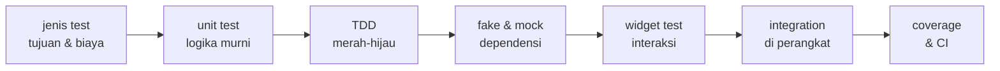
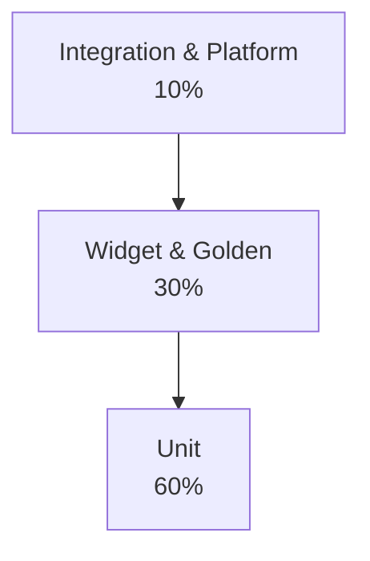
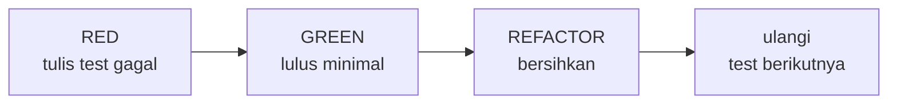

<!-- _class: title -->
<!-- _paginate: false -->

# Pertemuan 12
## Testing & Quality Assurance

Unit test · Widget test · Integration test · TDD · CAPSTONE: testing implementation

**Sub-CPMK92.2** — mampu mengembangkan aplikasi interaktif dengan fitur platform spesifik, pengujian menyeluruh, dan dokumentasi bermutu
Bacaan: modul-buku bab 11 · Praktikum: `starter-code/p12-testing`

<div class="pengajar">

**Fahri Firdausillah, S.Kom, M.CS**
Teknik Informatika — Universitas Dian Nuswantoro

</div>

---

## Setelah pertemuan ini, Anda bisa

1. **Memilih jenis test** — unit, widget, golden, integration, platform — berdasarkan tujuan dan biayanya, bukan karena namanya kedengaran serius.
2. **Menulis unit test** untuk model dan business logic: validasi, filter/sort/search, serialisasi — selesai dalam hitungan detik.
3. **Mengganti dependensi dengan fake atau mock**: store dalam memori untuk keadaan, `MockClient` untuk service HTTP, mock hanya untuk interaksi.
4. **Menulis widget test**: render, interaksi tap/input, verifikasi perubahan state — termasuk jalur kegagalannya.
5. **Menjalankan disiplin TDD** red-green-refactor, membaca laporan coverage, dan menyiapkan test di CI.

<div class="note">

Bab 3–10 menutup dengan janji yang sama: "semua lapisan ini diuji tanpa perangkat dan tanpa server sungguhan." **Hari ini janji itu dibayar** — dan starter praktikum sengaja dikirim merah sebagai bahan latihan TDD.

</div>

---

## Peta perjalanan hari ini

Dari "kenapa test" sampai suite yang berjalan sendiri di CI:



Starter hari ini dibalik arahnya: bukan kode dulu lalu diuji, tapi **test merah dulu** yang memandu perbaikan kode.

Persiapan: clone `starter-code/p12-testing`, jalankan `flutter test`, dan biarkan merah.

---

<!-- _class: section-break -->

# 1 · Kenapa Test

Tujuan dan biaya, bukan tren

---

## Dua penyakit testing yang buruk

<div class="warn">

**Penyakit pertama: semua diuji dengan semuanya.**

Setiap test menyalakan emulator, memakai database betulan, memanggil server sungguhan. Suite-nya jujur tapi lambat, rapuh, dan lama-lama dihentikan orang — dan test yang tidak dijalankan sama saja dengan tidak ada.

</div>

<div class="warn">

**Penyakit kedua: semua dimock.**

Setiap dependensi diganti tiruan yang menjawab apa saja. Suite-nya cepat tapi berhenti menguji hal yang penting — sampai-sampai test "persistence" berjalan di atas data yang tidak pernah menyinggah disk.

</div>

Obatnya bukan alat baru, tapi **disiplin klasifikasi**: kenali jenis test dari tujuan dan biayanya, lalu bayar biaya itu hanya ketika ada yang dibelinya.

---

## Test adalah spesifikasi yang bisa dieksekusi

- Test yang baik **mendokumentasikan perilaku**: namanya dibaca seperti kalimat — *"judul < 3 karakter tidak valid"* — dan gagal berarti spesifikasi dilanggar.
- Ia menjadi **jaring pengaman refactor**: mengubah struktur kode tanpa mengubah perilaku harus tetap hijau. Tanpa jaring ini, capstone yang terus tumbuh akan melambat lalu membeku.
- Ia **memaksa arsitektur yang bisa diuji**: logika yang tidak bisa diuji tanpa emulator adalah gejala logika yang terlalu menempel pada UI.

<div class="ok">

**Angka nyata dari bab 11:** fixture buku menjalankan **103 test** (unit + widget + golden) dalam **sekitar 3 detik**. Mayoritas pengujian memang bisa hidup di zona murah — sisanya adalah pilihan, bukan nasib.

</div>

---

## Test pertama: satu perilaku, satu harapan

**Test** menjalankan satu perilaku lalu membandingkan hasilnya dengan harapan. Contoh ini berasal dari starter P12:

```dart
expect(Task.isTitleValid('ab'), isFalse);
```

Kalimatnya: "judul dua karakter tidak valid". Modul bab 11 memakai bentuk yang sama pada studi kasus BMI.

<div class="note">

Model, widget, plugin, dan perangkat membutuhkan biaya pengujian yang berbeda. Setelah bentuk kecil ini jelas, kita memilih jenis test berdasarkan klaim yang ingin dibuktikan.

</div>

---

## Lima jenis test: satu tabel untuk memutuskan

| Jenis | Tujuan tunggal | Lingkungan | Runtime kasar |
|---|---|---|---|
| **Unit** | logika murni: hitungan, validasi, aturan domain | Dart VM, tanpa rendering | milidetik per test |
| **Widget** | satu widget: render, interaksi, state lokal | Flutter test env, rendering software | 1–2 detik per test |
| **Golden** | regresi visual: piksel sebagai kontrak | Flutter test env, font terkunci | ±1 detik per file |
| **Integration** | alur aplikasi utuh, plugin sungguhan | emulator atau perangkat betulan | puluhan detik per skenario |
| **Platform** | fitur perangkat: kamera, GPS, izin | perangkat sungguhan | menit, bergantung perangkat |

Aturan praktis dua baris terakhir yang sering tertukar: klaim mengandung kata **"perangkat"** → platform test; klaim mengandung kata **"alur"** → integration test.

---

## Piramida adalah akibat, bukan sebab



Proporsi itu bukan dogma yang dihafal — ia **akibat langsung dari kolom biaya** di tabel sebelumnya:

- Mayoritas klaim Anda ("hasil hitungan benar", "validasi menolak") bisa dibeli di zona milidetik → **unit**.
- Klaim "widget ini merespons" butuh rendering → **widget**, masih detik.
- Klaim "alur utuh" dan "data bertahan di disk" tidak bisa dibeli lebih murah → **integration**, bayar seperlunya.

Setiap test integration yang menduplikasi unit test adalah **pembayaran kedua untuk barang yang sama**.

---

<!-- _class: section-break -->

# 2 · Unit Test

Logika murni, biaya nyaris nol

---

## Anatomi satu test

```dart
import 'package:flutter_test/flutter_test.dart';
import 'package:study_tracker_p12/models/task.dart';

void main() {
  group('Task.isTitleValid', () {            // kelompok skenario
    test('judul normal valid', () {          // satu perilaku
      expect(Task.isTitleValid('Belajar Flutter'), isTrue);
    });

    test('judul terlalu pendek tidak valid', () {
      expect(Task.isTitleValid('ab'), isFalse);
    });
  });
}
```

Nama test adalah kalimat spesifikasi: dibaca dari atas, Anda tahu perilaku yang dijanjikan **tanpa membuka implementasinya**. `group` mengelompokkan skenario sejenis, `test` mengunci satu perilaku, `expect` membandingkan hasil dengan harapan.

---

<!-- _class: split -->

## Logika murni = tanpa satu pun import Flutter

```dart
// lib/services/task_filter.dart
import '../models/task.dart';

enum StatusFilter { all, open, done }

/// Filter + pencarian judul. Murni:
/// tanpa satu pun import Flutter.
class TaskFilter {
  static List<Task> apply(
    List<Task> tasks, {
    StatusFilter status = StatusFilter.all,
    String query = '',
  }) {
    return tasks.where((t) {
      final statusOk = switch (status) {
        StatusFilter.all => true,
        StatusFilter.open => !t.completed,
        StatusFilter.done => t.completed,
      };
      final q = query.toLowerCase();
      final match = q.isEmpty
          || t.title.toLowerCase()
              .contains(q);
      return statusOk && match;
    }).toList();
  }
}
```

<div>

Class ini persis yang dipakai starter P12.

**Kenapa ini penting:** tanpa import Flutter, test berjalan di Dart VM murni — ribuan test selesai dalam hitungan detik, tanpa rendering, tanpa emulator.

Itu bukan kebetulan, tapi **keputusan arsitektural**: business logic (filter, sort, search) dipisahkan dari UI, sehingga bisa diuji murah.

Di praktikum nanti versi starter ini mengandung satu bug yang test-nya akan tangkap.

</div>

---

## Menguji tepi, bukan tengah

```dart
// ambang kategori BMI — bab 11
test('ambang kategori tepat: 18,5 mulai Normal', () {
  expect(service.determineCategory(18.4), 'Kurus');
  expect(service.determineCategory(18.5), 'Normal');
  expect(service.determineCategory(24.9), 'Normal');
  expect(service.determineCategory(25), 'Gemuk');
  expect(service.determineCategory(30), 'Obesitas');
});

// validasi judul — starter P12
test('judul < 3 karakter tidak valid', () {
  expect(Task.isTitleValid('ab'), isFalse);    // tepi bawah aturan
  expect(Task.isTitleValid('   '), isFalse);   // spasi setelah trim
});
```

**Ambang adalah tempat bug paling sering sembunyi** — `18.4` vs `18.5`, `'ab'` vs `'abc'` — karena satu baris kode mengurus dua kategori. Menguji nilai tengah rentang itu menghibur; menguji tepi rentang itu menangkap bug. Dan biayanya nyaris nol.

---

## Serialisasi: kontrak data lewat round-trip

```dart
test('toJson lalu fromJson: nilai pulih sama', () {
  final task = Task(
    id: 't-1',
    title: 'Belajar test',
    priority: Priority.high,
    completed: true,
  );

  final pulih = Task.fromJson(task.toJson());

  expect(pulih.id, task.id);
  expect(pulih.title, task.title);
  expect(pulih.priority, task.priority);
  expect(pulih.completed, task.completed);
});
```

Serialisasi adalah **kontrak data antara memori, disk, dan API** — dan test round-trip menguncinya tanpa perangkat, tanpa jaringan, tanpa database. Pola lengkapnya (termasuk melewatkan baris rusak) ada di `BmiRecord` bab 11.

---

## Menjalankan test dan membaca kegagalannya

```bash
flutter test                            # seluruh suite
flutter test test/task_filter_test.dart # satu file
flutter test --name "isTitleValid"      # filter nama test
flutter test --coverage                 # + coverage/lcov.info
```

Yang dibaca saat merah: **expected** vs **actual**, lalu nama file dan nomor baris test yang gagal — Flutter mencetak semuanya tanpa perlu debugger.

<div class="ok">

**Umpan balik dalam hitungan detik berarti test dijalankan setiap kali menyimpan file** — kesalahan ketemu saat konteksnya masih di kepala Anda, bukan seminggu kemudian di demo.

</div>

---

## TDD: red → green → refactor



- **Red** — tulis test untuk perilaku yang belum ada; pastikan ia gagal *karena alasan yang benar*. Test yang tidak pernah merah tidak terbukti menguji apa pun.
- **Green** — tulis kode paling sederhana yang membuatnya lulus. Bukan kode tercantik — cantik itu urusan berikutnya.
- **Refactor** — rapikan struktur dengan jaring pengaman hijau; perilaku tidak boleh berubah.

---

## Starter P12: merah by design

```dart
// starter: cabang yang salah — test menangkapnya
final statusOk = switch (status) {
  StatusFilter.all => true,
  StatusFilter.open => t.completed,   // kebalik dari namanya!
  StatusFilter.done => t.completed,
};

// test yang membuktikannya merah:
test('filter open: hanya yang belum selesai', () {
  final open = TaskFilter.apply(tasks, status: StatusFilter.open);
  expect(open.first.id, 'a');   // GAGAL: dapat 'b'
});
```

Hukum TDD starter ini: **test adalah spesifikasi — bug ada di `lib/`, bukan di test.** Lima test di starter sengaja merah; tugas Anda membaca kegagalannya, menebak penyebabnya, lalu memperbaiki kodenya.

<div class="warn">

Jangan pernah "membenarkan" dengan mengubah test agar hijau — itu menyangkal spesifikasi, bukan memperbaiki aplikasi.

</div>

---

<!-- _class: section-break -->

# 3 · Fake & Mock

Fake untuk keadaan, mock untuk interaksi

---

## Kontrak store, dua implementasi

```dart
abstract interface class TaskStore {
  Future<List<Task>> load();
  Future<void> saveAll(List<Task> tasks);
}

/// Fake: memenuhi kontrak tanpa plugin apa pun.
class MemoryTaskStore implements TaskStore {
  final List<Task> _tasks = [];

  @override
  Future<List<Task>> load() async =>
      List.unmodifiable(_tasks);

  @override
  Future<void> saveAll(List<Task> tasks) async {
    _tasks
      ..clear()
      ..addAll(tasks);
  }
}
```

**Satu kontrak, dua implementasi** (pola `BmiHistoryStore` bab 11): produksi memakai database/preferences sungguhan, test memakai memori — dan layar tidak berubah satu baris di antara keduanya. Semua aturan domain lalu bisa diuji tanpa plugin.

---

## Service HTTP tanpa jaringan: MockClient

```dart
import 'package:http/http.dart';
import 'package:http/testing.dart';

final client = MockClient((request) async {
  if (request.url.path == '/tasks') {
    return Response(
      '[{"id":"t-1","title":"Belajar test"}]',
      200,
      headers: {'content-type': 'application/json'},
    );
  }
  return Response('not found', 404);
});

final repository = ApiTaskRepository(client: client);
```

`MockClient` dari `package:http/testing.dart` menjawab sesuai skenario yang Anda tulis — sukses, 404, error jaringan — sehingga **repository diuji tanpa server betulan**, termasuk jalur kegagalannya. Pola `abstract TaskApi` dari P09 membuat injeksi seperti ini mudah; prinsip yang sama berlaku untuk mock database lewat kontrak store.

---

## Kapan fake, kapan mock?

- **Fake (default)** menjawab *"apa yang terjadi pada data?"* — `MemoryTaskStore`, `MockClient`, script lemparan di remote palsu. Test jadi terbaca seperti skenario, bukan daftar panggilan.
- **Mock** (`mocktail`/`mockito`) menjawab *"siapa memanggil siapa, berapa kali, dengan argumen apa?"* — pakai hanya ketika **interaksi itu sendiri** adalah perilaku yang dijanjikan.

<div class="ok">

**Contoh keputusan nyata (bab 10):** `SyncEngine` harus *berhenti* memanggil `save` setelah server menjawab `InvalidPayload` — menelepon ulang payload yang ditolak hanya membakar baterai. Itu pertanyaan interaksi → mock/verify. Sebaliknya "riwayat terbatas sepuluh catatan" adalah keadaan → fake memenuhinya tanpa menghitung panggilan.

</div>

<div class="warn">

Jangan pernah keduanya sekaligus untuk satu dependensi dalam satu test — test yang setengah memverifikasi keadaan setengah interaksi biasanya sedang menguji dua hal dan menjelaskan nol.

</div>

---

<!-- _class: section-break -->

# 4 · Widget Test

Satu widget: render, interaksi, state

---

## Anatomi widget test

```dart
testWidgets('TaskCard menampilkan judul', (tester) async {
  // MaterialApp wajib: Theme & Directionality
  // hidup sebagai inherited widget di atasnya.
  Widget wrap(Widget child) =>
      MaterialApp(home: Scaffold(body: child));

  const task = Task(id: 't1', title: 'Judul uji');
  await tester.pumpWidget(
      wrap(const TaskCard(task: task, onToggle: null)));

  expect(find.text('Judul uji'), findsOneWidget);
  expect(find.byIcon(Icons.circle_outlined), findsOneWidget);
});
```

Widget test menguji **satu widget** di lingkungan render software: cepat, deterministik, tanpa emulator — `pumpWidget` menanam widget lengkap dengan konteks yang dibutuhkannya, `finder` mencari apa yang tergambar.

---

<!-- _class: split -->

## Key adalah alamat widget di test

```dart
// di widget: Key dibangun dari id data
IconButton(
  key: Key('toggle-${task.id}'),
  icon: Icon(task.completed
      ? Icons.check_circle
      : Icons.circle_outlined),
  onPressed: onToggle,
);

// di test: cari lewat Key
await tester.tap(
  find.byKey(const Key('toggle-t1')),
);
```

<div>

Key bukan dekorasi — ia **alamat** widget di test.

`find.byKey` tahan refactor: ganti teks, ubah urutan, restrukturisasi layout — test tetap menemukan widget yang sama.

`find.text` ikut berubah setiap kali copywriting disentuh; simpan untuk **asersi** yang memang mengklaim tentang teks.

Starter P12 memakai `toggle-t1`, `card-t1` — praktikum menyusul pola ini.

</div>

---

## Interaksi dan verifikasi perubahan state

```dart
testWidgets('tap toggle memanggil callback', (tester) async {
  var dipanggil = 0;
  const task = Task(id: 't1', title: 'Judul uji');

  await tester.pumpWidget(wrap(
      TaskCard(task: task, onToggle: () => dipanggil++)));

  await tester.tap(find.byKey(const Key('toggle-t1')));
  await tester.pump();   // proses frame setelah tap

  expect(dipanggil, 1);
});
```

`tester` menyediakan gerakan pengguna: `tap`, `enterText`, `longPress`, `drag` untuk scroll. **Verifikasi perubahan state dilakukan lewat apa yang tergambar setelah `pump`** — teks yang muncul, widget yang hilang, counter yang bertambah. State privat tidak diintip; perilakunya yang diamati.

---

## `pump` vs `pumpAndSettle` — salah pilih = test berosilasi

- **`pump()`** memajukan **satu frame**. Cukup untuk reaksi sinkron setelah `tap` atau `enterText`.
- **`pumpAndSettle()`** memajukan frame **sampai tidak ada lagi yang terjadwal** — untuk animasi, transisi, dan alur async seperti pemuatan data.
- `pump(Duration(...))` memajukan waktu palsu — untuk debounce, timeout, snackbar yang hilang.

<div class="warn">

Widget test yang kadang merah kadang hijau hampir selalu salah memilih di antara keduanya: animasi yang belum selesai saat asersi dievaluasi. Aturan ini datang langsung dari dokumentasi `flutter_test` — mengabaikannya adalah sumber utama test rapuh.

</div>

---

## Jalur kegagalan punya test sendiri

```dart
/// Store yang selalu melempar: disk penuh, plugin
/// error — tanpa harus membuat kegagalannya sungguhan.
class FailingTaskStore implements TaskStore {
  @override
  Future<List<Task>> load() async => const [];

  @override
  Future<void> saveAll(List<Task> tasks) async =>
      throw Exception('disk penuh');
}

testWidgets('simpan gagal: hasil tetap tampil', (tester) async {
  await pumpScreen(tester, store: FailingTaskStore());
  await isiForm(tester, 'Belajar test');

  expect(find.text('Belajar test'), findsOneWidget);
  expect(find.text('Gagal menyimpan'), findsOneWidget);
  expect(tester.takeException(), isNull);   // tidak crash
});
```

Kegagalan penyimpanan **tidak boleh menelan aplikasi**: hasil tetap tampil, kegagalan dilaporkan (pola `FailingBmiHistoryStore` bab 11). Jalur sukses yang diuji tanpa jalur gagal baru setengah spesifikasi.

---

## Golden test: piksel sebagai kontrak — secukupnya

```dart
await expectLater(
  find.byKey(const Key('category_row')),
  matchesGoldenFile('goldens/category_row.png'),
);
```

Golden merender widget ke gambar dan membandingkan **piksel demi piksel** dengan berkas acuan yang di-commit:

- Buat acuan dengan `flutter test --update-goldens`, **review gambarnya dengan mata Anda**, commit bersama test-nya.
- Rapuh terhadap font, versi Flutter, anti-aliasing — makanya toolchain dikunci.
- Cocok untuk widget kecil yang **bentuk adalah kontraknya** (chip, badge). Golden seluruh layar berumur pendek: setiap perubahan teks membatalkannya.

Widget test tahu chip berisi teks "Gemuk"; hanya golden yang tahu **warna dan ukurannya**.

---

<!-- _class: section-break -->

# 5 · Integration & CI

Alur utuh, perangkat sungguhan

---

## Integration test: alur end-to-end di perangkat

```dart
// integration_test/app_test.dart
void main() {
  IntegrationTestWidgetsFlutterBinding.ensureInitialized();

  testWidgets('tambah tugas: form → database → UI', (tester) async {
    await tester.pumpWidget(const StudyTrackerApp());
    await tester.pumpAndSettle();

    await tester.enterText(
        find.byKey(const Key('title_field')), 'Belajar test');
    await tester.tap(find.byKey(const Key('add_button')));
    await tester.pumpAndSettle();

    expect(find.text('Belajar test'), findsOneWidget);
  });
}
```

Sintaksnya mirip widget test — yang berbeda adalah **apa yang berdiri di belakangnya**: aplikasi utuh berjalan di emulator/perangkat dengan plugin database sungguhan. Satu-satunya tempat klaim "alur" dibuktikan; jalankan dengan `flutter test integration_test/app_test.dart`.

---

## Durability: klaim yang hanya sah di sini

```dart
testWidgets('data bertahan setelah restart', (tester) async {
  // sesi 1: tambah satu tugas — tertulis ke disk
  await tester.pumpWidget(const StudyTrackerApp());
  await tester.pumpAndSettle();
  await tambahTugas(tester, 'Belajar test');

  // "restart": state lama benar-benar dibuang —
  // satu-satunya jalan balik data adalah database.
  await tester.pumpWidget(const StudyTrackerApp());
  await tester.pumpAndSettle();

  expect(find.text('Belajar test'), findsOneWidget);
});
```

<div class="warn">

Store dalam memori (`MemoryTaskStore`, `InMemorySharedPreferencesAsync`) membuktikan **logika dan serialisasi — bukan durability**. Persistence nyata hanya dibuktikan integration test dengan plugin asli di perangkat. Test memori yang berpose sebagai bukti durability adalah bug dokumentasi yang hijau di CI.

</div>

---

## Coverage: apa yang diukur, apa yang tidak

```bash
flutter test --coverage
genhtml coverage/lcov.info -o coverage/html
open coverage/html/index.html
```

Coverage baris mengukur **kode yang dieksekusi test** — alat menemukan wilayah yang belum tersentuh sama sekali, dan itulah nilai utamanya.

<div class="warn">

Coverage **bukan** ukuran kepercayaan: baris yang dieksekusi tanpa assertion bernilai nol, dan 100% coverage tidak membuktikan bebas bug. Angka tinggi yang diburu demi angka menghasilkan test yang tidak pernah bisa gagal.

</div>

Target praktikum: baris `lib/` ≥ 70% — cukup untuk wilayah kritis tercover, jujur tentang yang belum.

---

## Test di CI: dari saran menjadi kontrak

```yaml
# .github/workflows/test.yml
name: test
on: [push, pull_request]
jobs:
  flutter-test:
    runs-on: ubuntu-latest
    steps:
      - uses: actions/checkout@v4
      - uses: subosito/flutter-action@v2
        with:
          channel: stable
      - run: flutter pub get
      - run: flutter analyze
      - run: flutter test --coverage
```

Suite yang hanya jalan di laptop Anda adalah **saran**; suite yang jalan di CI pada setiap push adalah **kontrak** — beberapa menit per push membeli kepastian bahwa merah terlihat semua orang, termasuk saat Anda lupa menjalankannya.

---

## Praktikum hari ini

**Target:** membalikkan starter yang sengaja merah menjadi hijau — satu siklus TDD penuh.

1. `flutter create --platforms=android,ios,web .` lalu `flutter test` — mulai **MERAH** (5 test gagal, itu tujuannya)
2. Unit test model: perbaiki `Task.isTitleValid` (TODO P12-1) — tanpa mengubah test
3. Unit test business logic: perbaiki cabang `StatusFilter.open` di `TaskFilter.apply` (TODO P12-2)
4. Widget test: perbaiki `TaskCard` untuk tugas completed (TODO P12-3)
5. TDD: tulis 2 test **baru** untuk `sortByPriority` kasus prioritas sama — verifikasi merah dulu, lalu hijau, lalu refactor
6. Coverage: `flutter test --coverage` — pastikan baris `lib/` ≥ 70%
7. Bagi capstone: mulai fase **testing implementation** — unit test untuk logika inti, widget test untuk komponen utama

<div class="warn">

**Hukum TDD starter ini:** bug ada di `lib/`, bukan di test. Aplikasi tetap jalan normal (`flutter run`) — hanya test yang tahu yang sebenarnya.

</div>

Starter: `starter-code/p12-testing`

---

## Bekerja dengan AI di materi ini

**Pantas didelegasikan**
Meminta daftar kasus batas yang mungkin terlewat dari satu fungsi. Meminta kerangka test untuk satu class yang belum punya test. Menanyakan cara menguji satu perilaku yang membingungkan Anda.

**Tulis sendiri**
Assertion inti dan definisi perilaku yang diuji. Test adalah spesifikasi — bila AI yang memutuskan apa yang dihitung "benar", spesifikasi Anda menyerah pada tebakan mesin. Test yang tidak pernah bisa gagal hanya memperlambat build; bagian inilah yang menentukan apakah materi ini benar-benar Anda kuasai.

<div class="note">

**Latihan:** minta AI menulis test untuk satu class Anda, lalu rusak satu baris kode yang seharusnya membuatnya gagal. Test yang tetap hijau saat kodenya rusak tidak menguji apa pun — hapus. Hitung berapa yang lolos saringan ini; angkanya biasanya mengejutkan.

</div>

---

## Ringkasan

- **Lima jenis test dibedakan dari tujuan dan biayanya:** unit (milidetik), widget (detik), golden (piksel), integration (alur utuh), platform (perangkat) — piramida adalah akibat dari tabel itu.
- **Unit test hidup di logika murni:** class tanpa import Flutter; ribuan test selesai dalam hitungan detik.
- **Uji tepi, bukan tengah:** ambang dan kasus batas adalah tempat bug sembunyi; biayanya nyaris nol.
- **TDD = red → green → refactor**; test adalah spesifikasi, bug dicari di `lib/`, bukan di test.
- **Fake adalah default pengujian** (store memori, `MockClient`); mock hanya ketika interaksi itulah yang diverifikasi — jangan keduanya sekaligus.
- **Widget test:** `pumpWidget` + finder; cari lewat `Key`, asersi teks hanya untuk klaim tentang teks; `pump` untuk satu frame, `pumpAndSettle` untuk alur async.
- **Jalur kegagalan punya test sendiri:** kegagalan penyimpanan dilaporkan, hasil tetap tampil, aplikasi tetap hidup.
- **Durability hanya dibuktikan integration test** dengan plugin asli di perangkat; coverage mengukur eksekusi, bukan verifikasi; CI mengubah saran menjadi kontrak.

---

<!-- _class: section-break -->

# Pertemuan berikutnya

**P13 — Platform Features & Device Integration**
Kamera, GPS, sensor, izin — aplikasi keluar dari layar

Suite hari ini membuat aplikasi Anda bisa diubah tanpa rasa takut.
Bab 12 mengajak aplikasi itu keluar dari layar: kamera dan GPS,
dengan disiplin yang sama — lepas logika dari channel, uji logikanya murah.

Baca sebelum kelas: modul-buku bab 12
