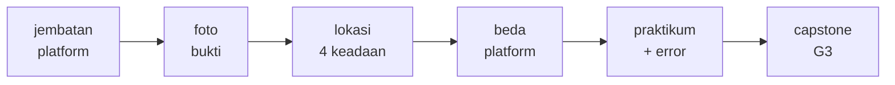
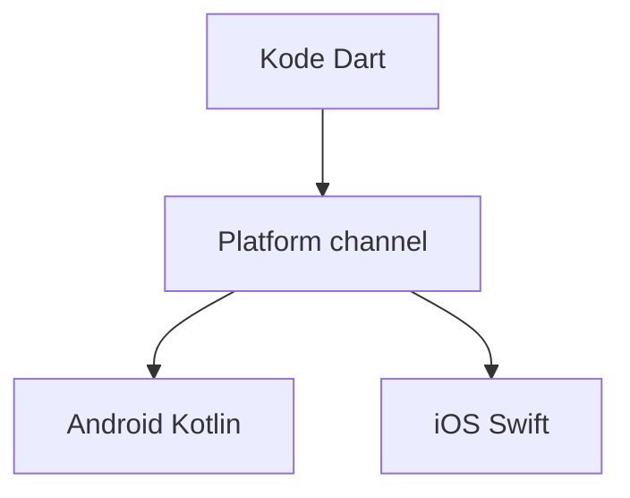
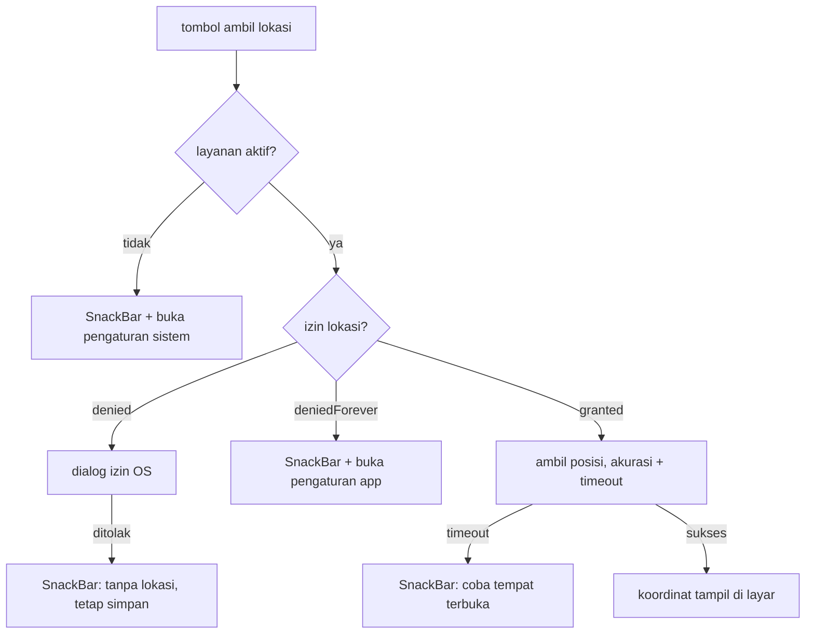

<!-- _class: title -->
<!-- _paginate: false -->

# Pertemuan 13
## Platform Features & Device Integration

Kamera & foto · Lokasi & GPS · Permission · CAPSTONE G3: Arsitektur & kualitas

**Sub-CPMK92.2** — mampu mengembangkan aplikasi interaktif dengan fitur platform spesifik, pengujian menyeluruh, dan dokumentasi bermutu
Bacaan: modul-buku bab 12 · Praktikum: `starter-code/p13-device-features`

<div class="pengajar">

**Fahri Firdausillah, S.Kom, M.CS**
Teknik Informatika — Universitas Dian Nuswantoro

</div>

---

## Setelah pertemuan ini, Anda bisa

1. **Mengambil foto lewat `image_picker`** dari kamera dan galeri, dengan kompresi sejak decode (`maxWidth`, `imageQuality`) untuk efisiensi storage.
2. **Mengelola empat keadaan izin lokasi** — layanan mati, `denied`, `deniedForever`, granted — dan memberi tiap keadaan aksi UI yang berbeda.
3. **Membaca posisi GPS dengan akurasi dan batas waktu eksplisit**, bukan menunggu tanpa akhir.
4. **Menyimpan foto ke direktori dokumen** dan memulihkan hasil kamera saat Android mematikan proses aplikasi di tengah jalan.
5. **Merawat UX kegagalan lintas platform**: loading yang benar, pesan untuk pengguna, dan perbedaan Android vs iOS.

<div class="note">

Tracker sampai bab 11 mencatat apa yang harus dikerjakan. Hari ini sebuah tugas bisa membawa **bukti pengerjaan**: foto dan koordinat. Fitur native masuk **tanpa membongkar arsitektur lama**.

</div>

---

## Peta perjalanan hari ini

Satu tema: aplikasi menyentuh perangkat sungguhan — kamera, GPS, izin — dan tetap hidup saat semuanya berbalik melawan kita:



Kode diadaptasi dari starter `p13-device-features` (struktur `services/` + `screens/`) dan bab 12.

Inti praktikum: foto bukti task, lokasi saat menandai selesai, dan daftar periksa kegagalan di perangkat fisik.

---

<!-- _class: section-break -->

# 1 · Foto Bukti

Kamera dan galeri lewat image_picker — bukan katalog plugin

---

## Bab 12 menolak jadi katalog plugin

Tutorial "device" biasanya berisi snippet delapan baris per plugin. Bab 12 membahas sedikit topik tetapi utuh — sampai ke keputusan datanya.

**Dibahas:**

- **Foto** lewat `image_picker`: kamera, galeri, kompresi, pemulihan process death.
- **Lokasi** lewat `geolocator`: empat keadaan izin dan layanan, akurasi, batas waktu.
- **Izin dan lifecycle sebagai warga kelas satu**, bukan catatan kaki setelah kode selesai.

**Tidak dibahas, dengan alasan:**

- **Sensor stream** (`sensors_plus`) — polanya stream + throttle, beda dunia dari sekali-ambil.
- **Push notification** — menuntut backend pengirim dan konfigurasi FCM/APNs.
- **Preview kamera penuh** (package `camera`) — proyek berbeda dengan kelas masalahnya sendiri.

<div class="ok">

Menyempitkan cakupan bukan kemunduran: tiap topik yang dibahas mendapat data layer, jalur kegagalan, dan strategi pengujian.

</div>

---

## Semua fitur perangkat adalah percakapan lintas bahasa

Flutter menggambar sendiri seluruh UI-nya lewat engine — ia tidak mewarisi komponen native. Untuk hal yang dikontrol sistem operasi (kamera, GPS, baterai), kode Dart bicara dengan kode platform lewat **platform channel**:



| Channel | Bentuk | Contoh |
|---|---|---|
| `MethodChannel` | Request-response sekali jalan | Ambil satu foto, level baterai |
| `EventChannel` | Stream berkelanjutan | Update lokasi, sensor |
| `BasicMessageChannel` | Pesan bebas dua arah | Protokol custom |

<div class="note">

Semua plugin yang dipakai buku ini — `sqflite`, `shared_preferences`, `image_picker`, `geolocator` — adalah platform channel yang dikemas rapi. Memahami channel membuat perilaku plugin berhenti terasa seperti sihir.

</div>

---

<!-- _class: split -->

## Plugin adalah pembungkus channel

**Plugin Flutter** menyembunyikan percakapan Android/iOS di balik API Dart yang lebih nyaman.

```dart
final file = await ImagePicker().pickImage(
  source: ImageSource.camera,
);
```

Contoh ini mengasumsikan package `image_picker` sudah ditambahkan; konfigurasi izin dan jalur gagal dibahas setelah ini.

Satu pemanggilan itu sebenarnya:

1. meminta sistem operasi membuka kamera,
2. menunggu pengguna selesai,
3. menerima jalur file kembali ke Flutter.

<div class="note">

API-nya ringkas, tetapi izin, lifecycle, dan kegagalannya tetap mengikuti aturan perangkat.

</div>

---

## PhotoService — tipis, tapi tiga keputusan di dalamnya

```dart
class PhotoService {
  final _picker = ImagePicker();

  /// Ambil dari kamera.
  Future<File?> capture() =>
      _pick(ImageSource.camera);

  /// Ambil dari galeri.
  Future<File?> pickFromGallery() =>
      _pick(ImageSource.gallery);

  Future<File?> _pick(
      ImageSource source) async {
    final xfile =
        await _picker.pickImage(
      source: source,
      maxWidth: 1080,
      imageQuality: 70,
    );
    if (xfile == null) {
      return null; // batal, bukan error
    }
    return File(xfile.path);
  }
}
```

<div>

`image_picker` tidak membuka kamera sendiri; ia **meminta sistem melakukannya** — itulah seluruh sihirnya, sisanya keputusan kita.

**Tiga keputusan di sini:**

`maxWidth: 1080` dan `imageQuality: 70` — kompresi sederhana tanpa package tambahan (slide berikutnya).

Return `File?` — `null` berarti pengguna membatalkan. **Pembatalan bukan error** dan tidak boleh diperlakukan sebagai error.

Satu method privat `_pick` untuk dua sumber — kamera dan galeri hanya beda `ImageSource`.

</div>

---

## Kompresi bekerja saat decode, bukan sesudahnya

```dart
final xfile = await _picker.pickImage(
  source: source,
  maxWidth: 1080,     // skalakan saat decode
  imageQuality: 70,   // kompresi ulang JPEG
);
```

**Kenapa ini penting:** kamera ponsel menghasilkan berkas belasan megabyte. Memuatnya utuh ke memori untuk lalu ditampilkan sebagai thumbnail adalah pemborosan yang bisa membuat OS menghilangkan aplikasi Anda.

- `maxWidth` **men-decode dan menskalakan gambar sebelum menyerahkannya** — yang berjalan di aplikasi sudah kecil sejak awal, bukan dikecilkan setelah dimuat penuh.
- `imageQuality: 70` mengompresi ulang hasilnya; untuk foto progres, penurunan kualitasnya nyaris tak terlihat.

<div class="ok">

**Validasi di praktikum:** bandingkan `file.lengthSync()` sebelum dan sesudah — angkanya turun drastis. Ini kompresi gratis tanpa satu baris kode image processing sendiri.

</div>

---

## Tiga jalur keluar, bukan satu

Kode contoh biasanya hanya menangani jalan lancar. Dunia nyata punya tiga kemungkinan:

```dart
// 1. Jalan lancar: File dikembalikan.
// 2. Pengguna membatalkan: null — bukan exception.
if (xfile == null) return null;

// 3. Sistem gagal: PlatformException —
//    kamera tak tersedia, izin ditolak OS.
```

<div class="warn">

**Jebakan klasik:** melebur batal dan gagal jadi satu jalur `catch` — pengguna yang menekan back di aplikasi kamera diperlakukan seolah terjadi error, dan muncul SnackBar "Gagal" padahal tidak ada yang gagal.

</div>

Dua jalur terakhir wajib dibedakan karena UX-nya berbeda: batal = diam saja; gagal = satu kalimat apa yang terjadi + satu aksi yang bisa diambil.

---

<!-- _class: code-dense -->

## Layarnya — tombol, preview, dan satu sumber kebenaran `_busy`

```dart
Row(
  children: [
    Expanded(
      child: FilledButton.tonalIcon(
        onPressed: _busy ? null : () => _takePhoto(true),
        icon: const Icon(Icons.photo_camera),
        label: const Text('Kamera'),
      ),
    ),
    const SizedBox(width: 8),
    Expanded(
      child: FilledButton.tonalIcon(
        onPressed: _busy ? null : () => _takePhoto(false),
        icon: const Icon(Icons.photo_library),
        label: const Text('Galeri'),
      ),
    ),
  ],
),
if (_photo != null)
  ClipRRect(
    borderRadius: BorderRadius.circular(12),
    child: Image.file(_photo!, height: 220, fit: BoxFit.cover),
  )
else
  const Card(
    child: SizedBox(
      height: 120,
      child: Center(child: Text('Belum ada foto progres')),
    ),
  ),
```

`_busy` menonaktifkan **semua** tombol sekaligus: saat kamera terbuka, ketukan kedua di tombol galeri tidak boleh menumpuk operasi. Preview memakai `Image.file` langsung dari jalur hasil picker.

---

<!-- _class: code-dense -->

## `_takePhoto` — try, catch, finally

```dart
Future<void> _takePhoto(bool fromCamera) async {
  setState(() => _busy = true);
  try {
    final file = fromCamera
        ? await _photos.capture()
        : await _photos.pickFromGallery();
    if (file != null) setState(() => _photo = file);
  } on Exception catch (e) {
    // Kamera tidak tersedia / izin ditolak OS.
    _snack('Gagal membuka '
        '${fromCamera ? "kamera" : "galeri"}: $e');
  } finally {
    if (mounted) setState(() => _busy = false);
  }
}
```

**Kenapa bentuknya persis begini:**

- `try` — operasi lintas proses (membuka aplikasi kamera sistem) bisa gagal kapan saja.
- `catch` on `Exception` — kegagalan diterjemahkan jadi pesan, bukan crash; `LocationException` dan `PlatformException` sama-sama tertangani pola ini.
- `finally` dengan cek `mounted` — apa pun hasilnya, tombol **pasti** menyala kembali; `await` di atas adalah celah waktu saat layar bisa saja sudah ditutup.

---

<!-- _class: split -->

## Salin dari cache ke direktori dokumen

```dart
class AttachmentStore {
  AttachmentStore(
      this._documentsDirectory);

  final Future<Directory> Function()
      _documentsDirectory;

  /// Salin [source] ke direktori dokumen
  /// dengan nama unik berbasis waktu.
  Future<String> persist(File source) async {
    final directory =
        await _documentsDirectory();
    final fileName =
        'evidence-'
        '${DateTime.now()
            .microsecondsSinceEpoch}'
        '${p.extension(source.path)}';
    final target =
        File(p.join(directory.path, fileName));
    await source.copy(target.path);
    return target.path;
  }
}
```

<div>

**Kenapa menyalin bukan opsional.** Picker mengembalikan jalur di **cache milik sistem** — dan sistem berhak membersihkannya kapan pun.

Foto bukti yang hilang diam-diam dua hari kemudian lebih buruk daripada foto yang gagal disimpan dengan pesan error.

Direktori dokumen milik aplikasi: isinya bertahan sampai aplikasi dihapus. Itulah alasan tabel bukti di bab 12 menyimpan **jalur** di sana.

**Kenapa direktori disuntikkan sebagai fungsi:** produksi memakai `path_provider`, test memakai direktori sementara — pola yang sama dengan repository bab 8.

Database menyimpan jalur, bukan piksel.

</div>

---

## Saat Android membunuh aplikasi Anda

Skenario nyata: pengguna menekan tombol kamera → sistem membuka aplikasi kamera → Android kehabisan memori → **proses Flutter Anda dimatikan**. Foto tersimpan di aplikasi kamera, tapi proses aplikasi sudah tiada; sistem melahirkan ulang activity tanpa ingatan proses lama.

```dart
Future<void> _recoverLostPhoto() async {
  // Pemulihan hanya relevan di Android; iOS
  // menyerahkan hasil lewat delegate.
  if (defaultTargetPlatform != TargetPlatform.android) {
    return;
  }

  final response = await _picker.retrieveLostData();
  if (response.isEmpty) return;   // tidak ada yang hilang
  if (response.file != null) {
    // Jalur yang sama seperti pick() normal.
    final store = AttachmentStore(getApplicationDocumentsDirectory);
    await store.persist(File(response.file!.path));
  }
}
```

Dipanggil di `initState` layar bukti. Polanya satu arah: **tanya sekali, salurkan hasilnya lewat jalur penyimpanan yang sama** dengan pengambilan normal.

---

<!-- _class: section-break -->

# 2 · Lokasi & Izin

Empat keadaan dunia nyata, empat respons berbeda

---

## Mengambil koordinat itu mudah — sisanya yang sulit

`getCurrentPosition()` memang hanya beberapa baris. Masalahnya tidak pernah di baris itu, melainkan di segala sesuatu yang bisa salah di sekitarnya:

| Keadaan | Gejala | Aksi yang benar |
|---|---|---|
| Layanan lokasi mati | GPS dimatikan dari quick settings | Arahkan ke pengaturan **sistem** (`openLocationSettings`) |
| Izin belum pernah ditanya | `denied` pertama kali | Dialog izin OS (`requestPermission`) |
| Izin ditolak permanen | `deniedForever`, dialog tak tampil lagi | Arahkan ke pengaturan **aplikasi** (`openAppSettings`) |
| Semua beres | `whileInUse` atau `always` | Ambil posisi |

<div class="warn">

Dialog izin yang ditolak **dua kali** di Android berubah menjadi `deniedForever`: OS tidak akan menampilkan dialog lagi. Aplikasi yang tetap memanggil `requestPermission` di keadaan ini hanya mendapat keheningan — pengguna menekan tombol, tidak terjadi apa-apa, kepercayaan turun satu tingkat.

</div>

Urutan pemeriksaan: **layanan dulu, baru izin** — izin "ya" tanpa layanan tetap tidak menghasilkan koordinat.

---

<!-- _class: code-dense -->

## LocationService — starter code hari ini

```dart
class LocationService {
  Future<Position> getCurrentLocation() async {
    // 1. Layanan dulu: izin "ya" tanpa GPS
    //    tetap tidak menghasilkan koordinat.
    final serviceEnabled =
        await Geolocator.isLocationServiceEnabled();
    if (!serviceEnabled) {
      throw const LocationException(
          'GPS dimatikan — nyalakan lokasi dulu');
    }

    // 2. Cek izin; minta hanya bila belum pernah
    //    ditanyakan (denied pertama kali).
    var permission = await Geolocator.checkPermission();
    if (permission == LocationPermission.denied) {
      permission = await Geolocator.requestPermission();
    }
    if (permission == LocationPermission.denied) {
      throw const LocationException('Izin lokasi ditolak');
    }

    // TODO(student) P13-2: deniedForever
    // — bedakan pesannya (slide berikutnya)

    return Geolocator.getCurrentPosition();
  }
}
```

Catatan: `geolocator` sudah membawa penanganan izin plus `openAppSettings`/`openLocationSettings` — untuk kasus ini tidak perlu package permission terpisah.

---

## P13-2 — `deniedForever` butuh pintu lain

```dart
if (permission == LocationPermission.deniedForever ||
    permission == LocationPermission.unableToDetermine) {
  // Dialog izin tidak akan tampil lagi —
  // satu-satunya jalan pulang: pengaturan aplikasi.
  await Geolocator.openAppSettings();
  throw const LocationException(
    'Izin ditolak permanen — aktifkan manual '
    'di pengaturan aplikasi',
  );
}
```

**Kenapa cabang ini wajib ada terpisah:** di keadaan `deniedForever`, `requestPermission()` tidak menampilkan apa pun. Satu-satunya jalan pulang adalah layar pengaturan aplikasi — jadi pesannya harus **menyebut ke mana pengguna harus pergi**, bukan sekadar "izin ditolak".

Ini TODO P13-2 di praktikum: ubah pesan generik `"Izin lokasi tidak tersedia"` menjadi pesan yang mengarahkan ke pengaturan. Validasinya: tolak permanen dari pengaturan, tekan tombol lokasi, SnackBar harus menyebut pengaturan.

---

## Akurasi dan batas waktu — selalu eksplisit

```dart
return Geolocator.getCurrentPosition(
  locationSettings: const LocationSettings(
    accuracy: LocationAccuracy.medium,
    timeLimit: Duration(seconds: 15),
  ),
);
```

Dua parameter yang tidak pernah ditulis diam-diam:

- **`accuracy: medium`.** Untuk bukti tempat pengerjaan, akurasi tingkat kota cukup. `best` menghidupkan GPS hardware penuh dan menghabiskan baterai demi presisi meter yang tidak dibutuhkan kolom `latitude`/`longitude`. Pilih akurasi dari **kebutuhan data**, bukan keinginan merasa presisi.
- **`timeLimit: 15 detik`.** Tanpa batas, `getCurrentPosition` bisa menggantung lama di perangkat yang GPS-nya lambat mengunci. Timeout mengubah keheningan menjadi **kegagalan yang bisa ditangani** — dan pesan ke penggunanya jujur: "coba lagi di tempat terbuka".

---

## Alur lengkap dari sisi pengguna



<div class="ok">

**Penolakan izin bukan error yang memblokir penyimpanan.** Tugas dengan foto tapi tanpa koordinat adalah tugas yang sah — GPS gagal di dalam gedung, di bawah tanah, di luar jangkauan. Bukti bersifat berlapis: foto saja boleh, koordinat saja boleh, keduanya lebih baik.

</div>

---

## Pesan untuk pengguna, bukan untuk programmer

Setiap kegagalan diterjemahkan menjadi **satu kalimat tentang apa yang terjadi** dan **satu aksi yang bisa diambil**:

```dart
throw const LocationException(
    'GPS dimatikan — nyalakan lokasi dulu');
// bukan: throw Exception('PermissionDenied');
```

- `e.toString()` mentah **tidak pernah** sampai ke layar — `PlatformException(platform_error, ...)` bukan kalimat untuk manusia.
- Pesan yang baik menyebut keadaan **dan** jalan keluarnya: "ditolak permanen — aktifkan manual di pengaturan aplikasi".
- Starter menyeragamkan bentuknya lewat `LocationException(this.message)` — satu jenis exception, isi pesan yang membedakan tiap keadaan.

<div class="note">

Ini pembeda aplikasi yang terasa dirawat dari aplikasi yang menampilkan `Exception: Permissions denied` mentah. Empat keadaan dunia nyata, empat kalimat — bukan satu SnackBar untuk semuanya.

</div>

---

<!-- _class: section-break -->

# 3 · Beda Platform & Kegagalan

Android dan iOS berbeda pendapat; simulator berbohong

---

## Dua platform, dua pendapat tentang izin

**Android — photo picker modern:**

- Memilih dari galeri lewat **photo picker milik sistem**: UI bawaan yang berjalan di luar proses aplikasi Anda, hanya menyerahkan berkas yang benar-benar dipilih.
- Konsekuensinya menyenangkan: **tidak ada permission storage** yang perlu diminta. Menuliskan `READ_MEDIA_IMAGES` untuk kebutuhan ini sudah usang.
- Kamera lewat intent membuka aplikasi kamera sistem — aplikasi kamera itulah yang berurusan dengan izinnya sendiri.

**iOS — pendapatnya berbeda:**

- Aplikasi yang menyentuh kamera/galeri **wajib menuliskan alasan** di `Info.plist`.
- Tanpa kunci ini aplikasi **crash saat fitur pertama kali dipakai** — bukan saat build, bukan saat review, tapi di depan pengguna.

<div class="warn">

Teks deskripsi bukan formalitas: iOS menampilkannya persis apa adanya di dialog izin. Kalimat generik seperti "needed to access camera" menurunkan kepercayaan dan berpotensi ditolak saat review App Store.

</div>

---

## Konfigurasi native — seluruhnya di dua file

```xml
<!-- android/app/src/main/AndroidManifest.xml -->
<uses-permission android:name="android.permission.CAMERA"/>
<uses-permission
    android:name="android.permission.ACCESS_FINE_LOCATION"/>
<uses-permission
    android:name="android.permission.ACCESS_COARSE_LOCATION"/>
```

```xml
<!-- ios/Runner/Info.plist -->
<key>NSCameraUsageDescription</key>
<string>Foto progres tugas belajar</string>
<key>NSLocationWhenInUseUsageDescription</key>
<string>Mencatat lokasi sesi belajar</string>
```

**Kenapa `whenInUse`, bukan `always`:** aplikasi membaca posisi saat pengguna menekan tombol, bukan di latar belakang. Izin `always` menampilkan indikator biru yang mengikuti pengguna — memintanya tanpa fitur latar belakang adalah cara paling cepat kehilangan kepercayaan.

Izin ditempatkan di bab yang mengimplementasikan fiturnya, bukan ditumpuk di awal proyek.

---

## Simulator berbohong — daftar periksa perangkat fisik

Simulator hampir selalu mengabulkan izin dan selalu melaporkan layanan aktif. Enam skenario ini hanya bisa dibuktikan di perangkat sungguhan:

| Skenario | Cara memicu | Hasil yang benar |
|---|---|---|
| Izin kamera ditolak | tolak dialog pertama kali | tidak crash; tugas tetap bisa disimpan |
| Izin lokasi ditolak sekali | tolak dialog izin pertama | SnackBar penjelasan; bisa dicoba lagi |
| Izin lokasi ditolak permanen | tolak dua kali, tekan ambil lokasi | SnackBar + tombol ke pengaturan aplikasi |
| Layanan lokasi mati | matikan lokasi dari quick settings | SnackBar + tombol ke pengaturan sistem |
| Process death di tengah foto | ambil foto, matikan app dari recent | foto dipulihkan lewat `retrieveLostData` |
| Foto besar dari kamera | motret langsung | tidak tersendat; berkas hasil jauh lebih kecil |

<div class="ok">

Daftar ini bagian dari **definisi selesai**, bukan langkah opsional — dan tiap kegagalan yang ditemukan kembali menjadi test logika baru bila mungkin. Pola piramida bab 11: logika diuji murah, channel diuji di tempat channel hidup.

</div>

---

## Dari koordinat ke fitur: riwayat dan saran

Koordinat yang tersimpan bukan sekadar angka — ia jadi **data produk**. Checkpoint 4 praktikum hari ini arahnya begitu:

- **Riwayat lokasi belajar** — simpan metadata sesi (`photoPath` + `latitude`/`longitude`) ke `Map` lokal, tampilkan riwayat sesi lengkap dengan tempatnya. Pola tempat belajar muncul dari data.
- **Saran task berbasis lokasi** — task berlabel "kampus" disarankan saat pengguna berada di dekat kampus. Untuk saran sekelas ini, akurasi `medium` lebih dari cukup — jangan minta presisi meter.
- **Galeri bukti** — daftar sesi dengan foto thumbnail kecil; `Image.file` memuat berkas yang **sudah** terkompresi sejak picker.

<div class="note">

Batas yang jujur dari bab 12: bukti masih lokal, belum ikut sinkronisasi. Menyinkronkan berkas menuntut storage server dan kebijakan kompresi — itu pembahasan tersendiri. Upload ke Supabase Storage bisa jadi lanjutan mandiri Anda di capstone G3.

</div>

---

## Praktikum hari ini — foto bukti task documentation

**Target:** alur lengkap foto progres — dari izin sampai tampil di galeri. Starter: `starter-code/p13-device-features`.

1. **Deklarasi izin** di kedua platform — `AndroidManifest.xml` dan `Info.plist` (salin dari README starter), lalu jalankan di device/emulator.
2. **Capture & select**: tombol kamera (`PhotoService.capture()`) dan galeri (`pickFromGallery()`) di `AttachmentScreen`.
3. **Kompresi**: bandingkan `file.lengthSync()` sebelum/sesudah — bukti angka bahwa `maxWidth` + `imageQuality` bekerja.
4. **Selesaikan TODO P13-2**: `deniedForever` → pesan arahkan-ke-pengaturan.
5. **Riwayat**: simpan metadata sesi ke `Map` lokal, tampilkan galeri riwayat sesi.

<div class="note">

Lanjutan mandiri untuk capstone G3: upload foto ke **Supabase Storage** — berkas piksel di server, jalur di database (lihat catatan README starter).

</div>

---

## Praktikum hari ini — lokasi & penanganan kegagalan

**Target:** tiga jalur lokasi memberi pesan yang tepat tanpa crash — dibuktikan, bukan diklaim.

1. **Lokasi saat menandai selesai**: `LocationService.getCurrentLocation()` di tombol "Selesaikan sesi + catat lokasi".
2. **Tiga jalur wajib diuji**: GPS dimatikan, tolak izin, kabulkan izin — tiap jalur pesannya tepat (checkpoint 3 starter).
3. **Beda platform**: uji di Android dan iOS, atau minimal verifikasi konfigurasi keduanya — perilaku izinnya memang berbeda.
4. **UX loading**: `_busy` menonaktifkan tombol + `LinearProgressIndicator`; `mounted` diperiksa di `finally`.

<div class="warn">

**Error-First Learning.** Skenario gagal di atas adalah bahan utamanya: picu tiap kegagalan, baca pesannya, tebak penyebabnya, baru perbaiki. Jangan langsung tanya AI.

</div>

---

## Bekerja dengan AI di materi ini

**Pantas didelegasikan**
Membaca dokumentasi izin per platform yang berubah antarversi — mana yang usang, mana yang wajib. Menanyakan paket mana yang masih terawat untuk kebutuhan Anda, dan minta AI menjelaskan pesan error plugin yang samar.

**Tulis sendiri**
Alur permission dan keputusan UX. Kamera tidak tersedia, izin ditolak permanen, GPS mati se-unuh sistem: apa yang dilihat pengguna di tiap keadaan itu adalah rancangan Anda — dan bagian inilah yang paling sering dilewatkan kode contoh.

<div class="note">

**Latihan:** minta AI menulis pengambilan foto lengkap. Lalu hitung berapa keadaan dunia nyata yang ia tangani — biasanya satu: jalan lancar. Tambahkan sendiri izin ditolak, ditolak permanen, dan perangkat tanpa kamera. Perbandingan jumlahnya adalah pelajaran materi ini.

</div>

---

## Ringkasan

- **Semua fitur perangkat adalah platform channel**; `image_picker` dan `geolocator` adalah channel yang dikemas rapi — bukan sihir.
- **Photo picker Android tidak butuh permission storage**; iOS menuntut kunci `Info.plist` dengan kalimat alasan yang dibaca pengguna — tanpa itu, crash di depan pengguna.
- **`pickImage` mengembalikan `null` saat batal** — pembatalan bukan error; kegagalan sistem adalah `PlatformException` yang diterjemahkan jadi pesan.
- **`maxWidth` + `imageQuality` mengompresi sejak decode** — berkas kecil sejak awal, bukan dikecilkan setelah dimuat penuh.
- **Foto disalin dari cache ke direktori dokumen**; database menyimpan jalur, bukan piksel. Process death dipulihkan lewat `retrieveLostData` (Android saja).
- **Empat keadaan lokasi = empat respons**: layanan mati → pengaturan sistem, `denied` → dialog izin, `deniedForever` → pengaturan aplikasi, granted → ambil posisi.
- **Posisi dibaca dengan `accuracy` + `timeLimit` eksplisit** — keheningan berubah menjadi kegagalan yang bisa ditangani.
- **Penolakan izin bukan blocker**: bukti berlapis, tugas tanpa koordinat tetap sah.
- **Simulator berbohong** — daftar periksa kegagalan dijalankan dengan tangan di perangkat fisik.

---

<!-- _class: section-break -->

# 4 · Capstone G3

Arsitektur & kualitas — gate berbobot terbesar, due minggu ini

---

## G3 — apa yang dinilai: tiga pilar

**1. State terpusat.** State aplikasi tidak lagi tersebar di banyak `setState` — ada satu tempat yang memegangnya dan memberitahu tampilan saat berubah. Pustaka apa pun boleh; **yang dinilai konsistensinya, bukan mereknya**.

**2. Keputusan arsitektur yang bisa dipertahankan.** Butir "Keputusan" di CHANGELOG wajib membahas pilihan state Anda: apa yang dipilih, apa yang ditolak, dan apa yang akan berubah kalau aplikasi ini tumbuh sepuluh kali lipat.

**3. Test yang benar-benar dijalankan.** Minimal **enam test yang lulus dan pernah gagal saat kode dirusak sengaja** — dua pertiga untuk logika, sepertiga untuk tampilan. Cakupan tidak dinilai angkanya: enam test bermakna lebih bernilai daripada lima puluh test yang hanya memanggil getter.

<div class="ok">

Butir kedua adalah inti gate ini: test yang tidak pernah terbukti bisa gagal belum diketahui menguji apa pun.

</div>

---

## G3 — fitur perangkat: dua, di dalam alur

- **Minimal dua fitur perangkat yang benar-benar dipakai alur aplikasi** — bukan tombol demo di layar terpisah. Pilihan: kamera, galeri, lokasi, sensor, berkas, notifikasi.
- Masing-masing **menangani izin ditolak dan perangkat tidak mendukung, tanpa crash** — persis daftar periksa segmen 3 hari ini.

<div class="note">

Hari ini menyediakan dua di antaranya sekaligus: **foto** (`image_picker`) dan **lokasi** (`geolocator`). Tugas Anda memasangnya ke alur nyata aplikasi capstone — foto progres dan lokasi penyelesaian adalah kandidat alami.

</div>

Materi pendukung: bab 7 (state), bab 11 (testing), bab 12 (fitur perangkat dan izin), bab 13 (cakupan rebuild).

---

## G3 — penyerahan

1. **Tag `gate-3` di repo** — dibuat sebelum tenggat; commit setelah tag tidak dinilai.
2. **Satu blok baru di `CHANGELOG.md`**, maksimal satu halaman.
3. **Video demo 5 menit**, diunggah ke YouTube sebagai *unlisted*, tautannya di CHANGELOG. Isi: aplikasi berjalan di perangkat/emulator, **satu alur utama dijalankan penuh**, lalu narasi singkat satu keputusan teknis yang Anda ambil.

<div class="ok">

Kualitas produksi tidak dinilai sama sekali — rekaman layar dengan suara sudah cukup. Video yang rapi tapi aplikasinya tidak jalan bernilai lebih rendah daripada rekaman seadanya yang aplikasinya jalan.

</div>

Rubrik lengkap: `penugasan/capstone/G3_Arsitektur-Kualitas.md` — ini gate dengan bobot terbesar (12%). Tanya jawab di kelas sesudahnya mengambil bahan dari video dan commit Anda sendiri.

---

## G3 — satu saran AI yang ditolak

Mulai gate ini, blok AI di CHANGELOG memuat satu hal baru: **satu saran AI yang Anda tolak**, beserta alasan kenapa saran itu keliru untuk konteks aplikasi Anda.

Tiga bagian yang ditulis:

1. **Sarannya** — apa yang AI usulkan.
2. **Keberatan Anda** — kenapa keliru untuk konteks aplikasi Anda.
3. **Penggantinya** — apa yang Anda kerjakan sebagai gantinya.

<div class="note">

Menemukan bahan untuk butir ini tidak sulit. Yang sulit adalah **menyadari saat sedang terjadi** — dan itulah yang sedang dilatih. Hari ini penuh momennya: AI akan dengan senang hati menulis alur foto yang hanya menangani jalan lancar.

</div>

---

## G3 — verifikasi sendiri sebelum menyetor

- [ ] `setState` yang tersisa hanya untuk state milik satu widget (animasi, buka-tutup, fokus)
- [ ] Satu baris logika dirusak sengaja → ada test yang gagal karenanya → dikembalikan
- [ ] Test dijalankan dari nol di direktori bersih dan lulus semua
- [ ] Izin ditolak lalu fitur perangkat dicoba → aplikasi memberi tahu dengan jelas dan tetap hidup
- [ ] Izin diberikan lalu dicabut dari pengaturan sistem → dibuka lagi → tidak crash
- [ ] Peer review siklus 2 terkirim
- [ ] Tag `gate-3` dibuat, blok CHANGELOG lengkap dengan pembahasan arsitektur, video terunggah

<div class="warn">

Jangan verifikasi lewat ingatan. Jalankan daftarnya dengan tangan — tiap baris adalah skenario yang persis bisa dicontoh dari praktikum hari ini.

</div>

---

<!-- _class: section-break -->

# Pertemuan berikutnya

**P14 — Performance Optimization & Production Prep**

Aplikasi Anda kini penuh fitur yang numpang di perangkat — foto besar, plugin, rebuild liar. Performa ikut turun diam-diam: **saatnya mengukur sebelum menebak.**

Baca sebelum kelas: modul-buku bab 13
