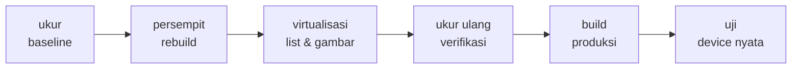
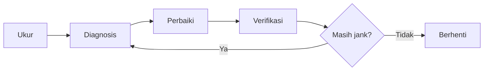
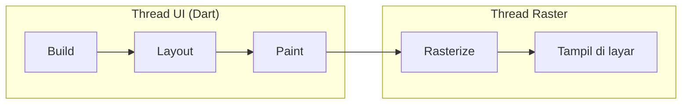

<!-- _class: title -->
<!-- _paginate: false -->

# Pertemuan 14
## Performance Optimization & Production Prep

DevTools profiling · Optimasi rebuild & list · Ukuran build · CAPSTONE: performance tuning

**Sub-CPMK53.2** — mampu mengoptimalkan performa aplikasi hingga siap untuk deployment
Bacaan: modul-buku bab 13 · Praktikum: `starter-code/p14-performance`

<div class="pengajar">

**Fahri Firdausillah, S.Kom, M.CS**
Teknik Informatika — Universitas Dian Nuswantoro

</div>

---

## Setelah pertemuan ini, Anda bisa

1. **Menjalankan siklus ukur-diagnosis-perbaiki-verifikasi** dengan Flutter DevTools di mode profile pada perangkat fisik, dan mencatat baseline yang bisa dibandingkan.
2. **Membedakan jank thread UI dari thread raster** di frame timeline, lalu memilih perbaikan yang mengena sesuai sumber masalahnya.
3. **Mempersempit wilayah rebuild secara kontekstual**: `const`, ekstraksi widget, parameter `child`, dan pemilihan `Consumer` vs `Selector`.
4. **Membuat daftar besar tetap mulus**: `ListView.builder` + `itemExtent` + `cacheExtent`, decode gambar terbatas, dan pagination yang aman dari balapan.
5. **Membangun versi rilis**: ukuran APK, obfuscation, error reporting — lalu mengujinya di perangkat nyata.

<div class="note">

Tracker bab 12 sudah lengkap: SQLite lokal, sinkronisasi Supabase, sesi, foto bukti, lokasi. **Hari ini kita membuatnya cepat — dan membuktikannya dengan angka, bukan perasaan.**

</div>

---

## Peta perjalanan hari ini

Satu siklus yang sama berulang sepanjang kelas: ukur, perbaiki satu hal, ukur ulang.



Praktikum memakai starter `p14-performance`: lab performa dengan 3000 item, badge penghitung rebuild, dan mode naive vs builder yang bisa ditukar live.

---

<!-- _class: section-break -->

# 1 · Ukur Dulu

Baseline sebelum menyentuh kode — dan sebelum percaya dogma

---

## Optimasi tanpa angka adalah tebakan

Banyak tutorial performa berbentuk **daftar dogma**: pakai `const`, hindari `Consumer`, batasi `setState`, sisipkan `RepaintBoundary` — masing-masing dengan snippet dan klaim "lebih cepat" tanpa angka.

Masalah strukturalnya: **setiap aturan itu benar di satu konteks dan salah di konteks lain**, dan tanpa pengukuran Anda tidak tahu di konteks mana Anda berada.



<div class="ok">

**Satu perubahan terkecil yang mengena, lalu ukur ulang skenario yang sama.** Angka tidak bergerak berarti diagnosis salah — kembali ke Diagnosis, jangan menambah dogma.

</div>

---

## Mode profile, bukan debug, bukan emulator

```bash
# Profiling akurat: kecepatan nyaris release,
# tracing DevTools tetap aktif
flutter run --profile -d <id-perangkat>
```

Debug build tidak bisa dipakai menilai performa: assertion aktif, "slow mode" sengaja memperlambat operasi tertentu, overlay debug menambah pekerjaan render. Release build cepat tapi mematikan service protocol yang dipakai DevTools. **Mode profile adalah titik tengahnya.**

<div class="warn">

**Emulator menyimpan GPU di host dan CPU-nya bukan CPU ponsel** — hasilnya sistematis terlalu optimis untuk jank. Profil di perangkat fisik kelas yang dipakai pengguna target Anda; satu ponsel Android menengah yang sama dan konsisten sepanjang proyek sudah cukup.

</div>

---

## Frame budget: 16 ms bukan angka suci

Layar 60 Hz menyegarkan gambar tiap 1/60 detik — semua pekerjaan satu frame harus selesai **±16,67 ms**. Tapi angka itu bukan konstanta universal:

| Refresh rate | Anggaran per frame | Catatan |
|---|---|---|
| 60 Hz | ± 16,67 ms | Acuan paling umum, paling longgar |
| 90 Hz | ± 11,1 ms | Umum di ponsel menengah |
| 120 Hz | ± 8,3 ms | Panel flagship; margin makin tipis |

Aplikasi yang "mulus di emulator 60 Hz" bisa jank di perangkat 90–120 Hz yang benar-benar dipakai pengguna.

<div class="ok">

**Anggaran mengikuti perangkat target Anda**, bukan tabel di buku mana pun. Tentukan target dari perangkat pengguna Anda, lalu ukur di sana.

</div>

---

## Jank berasal dari dua thread yang berbeda obat

Anggaran itu dibagi dua thread: **thread UI** menjalankan kode Dart Anda, **thread raster** menerjemahkan hasilnya untuk GPU.



- **Thread UI lambat** → biasanya soal rebuild yang terlalu luas atau komputasi di Dart.
- **Thread raster lambat** → biasanya soal gambar terlalu besar, opacity mahal, atau efek yang memaksa repaint luas.

Frame timeline DevTools menampilkan keduanya — **diagnosis salah thread berarti obat yang salah**.

---

## Empat metrik yang direkam di DevTools

Angka hanya bermakna jika dibandingkan dengan angka dari kondisi yang sama. Tetapkan **skenario tertulis** (buka daftar, tunggu selesai, gulir sampai akhir, kembali ke atas, centang satu tugas), jalankan sekali sebagai pemanasan, baru rekam:

| Metrik | Cara baca di DevTools |
|---|---|
| Frame janky / total frame | Performance view: frame merah dan oranye |
| Durasi frame terburuk | Frame chart: puncak tertinggi — catat thread-nya |
| Puncak memori | Memory view: grafik setelah paksa GC |
| Permintaan jaringan | Network view: jumlah dan durasi permintaan |

Catat hasil di tabel dengan kolom yang sama, sehingga setiap perbaikan tinggal mengisi kolom "sesudah".

---

## Baseline: contoh satu sesi nyata

Tracker bab 12, daftar 200 tugas berisi foto bukti, perangkat Android menengah, mode profile:

| Metrik | Baseline |
|---|---|
| Frame janky saat gulir | 41 dari 480 |
| Frame terburuk | 58 ms (thread UI) |
| Puncak memori | 96 MB |
| Permintaan saat buka daftar | 1 (semua data sekaligus) |

Empat angka ini langsung menjadi arah diagnosis: jank di **thread UI** + **satu permintaan besar** menunjuk ke dua kandidat — wilayah rebuild terlalu luas, dan seluruh daftar dimuat sekaligus.

<div class="note">

Angka Anda akan berbeda, dan itu normal. Yang Anda bandingkan adalah kolom "sebelum" dan "sesudah" milik Anda sendiri pada perangkat yang sama — bukan angka dari slide ini.

</div>

---

<!-- _class: section-break -->

# 2 · Wilayah Rebuild

Samakan cakupan rebuild dengan cakupan data yang benar-benar dipakai

---

<!-- _class: split -->

## Diagnosis dulu: siapa yang dibangun ulang?

```dart
class _RebuildBadgeState
    extends State<RebuildBadge> {
  int _builds = 0;

  @override
  Widget build(BuildContext context) {
    _builds++;  // bukti kasat mata
    return Container(
      padding: const EdgeInsets.all(8),
      decoration: BoxDecoration(
        color: Theme.of(context)
            .colorScheme
            .secondaryContainer,
        borderRadius:
            BorderRadius.circular(999),
      ),
      child: Text(
        '${widget.label}: $_builds',
      ),
    );
  }
}
```

<div>

Di Performance view, aktifkan **Widget rebuild tracking** — atau pakai `RebuildBadge` dari starter: widget yang menghitung build-nya sendiri.

Starter menaruh badge di `AppBar` dan di badan layar. Tekan **"Paksa rebuild"** — lalu lihat badge mana yang ikut naik.

Kalau badge pada subtree yang tidak berubah ikut bertambah, wilayah rebuild Anda terlalu luas.

Verifikasi setiap optimasi nanti memakai alat yang sama: **jumlah rebuild per interaksi harus turun**.

</div>

---

## `const` pada yang memang konstan

`const` membuat satu instance kanonik yang dipakai ulang — saat parent rebuild dan child-nya instance `const` identik, Flutter bisa **melewati subtree itu**.

```dart
// Sebelum: tiga objek baru setiap build layar,
// tiap kali notifikasi tiba
AppBar(title: Text('Daftar Tugas'))
FloatingActionButton(child: Icon(Icons.add))
SizedBox(height: 16)

// Sesudah: dibuat sekali, dipakai ulang lintas rebuild
AppBar(title: const Text('Daftar Tugas'))
FloatingActionButton(child: const Icon(Icons.add))
const SizedBox(height: 16)
```

Dampaknya nyata pada **widget statis yang hidup di dalam subtree yang sering rebuild** — persis kasus `AppBar` di layar daftar.

---

## Apa yang `const` TIDAK lakukan

<div class="warn">

`const` **tidak menghentikan rebuild parent** — parent tetap membangun; hanya subtree konstannya yang dilewati.

`const` **tidak menolong widget yang datanya memang berubah**: `Text(task.title)` tidak mungkin `const`. Memburu `const` di widget yang berubah adalah dogma tanpa efek.

</div>

Satu pengecualian yang membingkai semuanya: untuk **daftar yang bisa berubah urutan** (misalnya setelah sortir), key berbasis id data seperti `ValueKey(task.id)` menjaga state dan posisi tetap menempel pada item yang benar — materi bab 3 yang kini berdampak performa.

<div class="ok">

Pola umumnya: **persempit dulu wilayah rebuild** (ekstraksi, `const`), baru kecilkan isinya. Urutan ini yang membuat setiap perbaikan terukur.

</div>

---

## Ekstraksi widget dan parameter `child`

Bagian subtree yang **tidak bergantung pada data yang berubah** sebaiknya tidak ikut dibangun ulang. Dua caranya: ekstrak ke class sendiri, atau serahkan lewat parameter `child` milik `Consumer`/`Selector`:

```dart
Consumer<TaskListController>(
  builder: (context, controller, child) {
    return Column(
      children: [
        TaskCountLabel(count: controller.tasks.length),
        child!, // subtree besar, tak tergantung controller
      ],
    );
  },
  child: const TaskListFooter(), // dibangun sekali, dipakai ulang
)
```

`child` dibangun sekali di luar builder, diterima utuh saat rebuild — cara paling murah menyelamatkan subtree besar yang statis.

---

## Consumer vs Selector: pilih sesuai cakupan

Bab ini **sengaja tidak** mengajarkan "`Consumer` itu buruk" — pernyataan itu salah secara kontekstual:

| Alat | Tepat bila | Harganya |
|---|---|---|
| `Consumer<T>` / `context.watch<T>()` | subtree memang butuh sebagian besar state provider (mis. isi daftar) | seluruh subtree rebuild tiap notifikasi |
| `Selector<T, R>` / `context.select<T, R>` | subtree hanya butuh irisan sempit `R` | fungsi selector + cek kesetaraan tiap notifikasi |

Aturan praktisnya satu kalimat: **samakan cakupan rebuild dengan cakupan data yang benar-benar dipakai.**

Widget yang membaca hampir semua milik provider, `Consumer` adalah pilihan paling jujur. Widget yang hanya butuh satu angka, `Consumer` membangun ulang semuanya demi angka itu.

---

## `context.select`: Selector dalam satu baris

Widget penghitung di bawah daftar hanya peduli agregat, bukan isi daftar — contoh pas untuk irisan tunggal:

```dart
class TaskCountBar extends StatelessWidget {
  const TaskCountBar({super.key});

  @override
  Widget build(BuildContext context) {
    // context.select: Selector dalam satu baris, untuk irisan tunggal
    final pending = context.select<TaskListController, int>(
      (controller) => controller.pendingCount,
    );
    return Text('Belum selesai: $pending');
  }
}
```

Setelah Anda mencentang satu tugas, yang boleh rebuild hanya baris penghitung ini — bukan seluruh layar. Verifikasi ulang dengan rebuild tracking.

---

<!-- _class: code-dense -->

## Irisan majemuk: satu nilai agregat, bukan tiga Selector

Untuk total + selesai sekaligus, jangan tiga `Selector` terpisah — kembalikan **satu nilai agregat** yang mengimplementasikan `==` dan `hashCode`:

```dart
class TaskStatsData {
  final int total;
  final int done;

  const TaskStatsData({required this.total, required this.done});

  @override
  bool operator ==(Object other) =>
      other is TaskStatsData && total == other.total && done == other.done;

  @override
  int get hashCode => Object.hash(total, done);
}

Selector<TaskListController, TaskStatsData>(
  selector: (context, controller) => TaskStatsData(
    total: controller.tasks.length,
    done: controller.tasks.length - controller.pendingCount,
  ),
  builder: (context, stats, child) => TaskCountLabel(stats: stats),
)
```

Tanpa `==` yang benar, setiap notifikasi menghasilkan "nilai baru" dan `Selector` **tidak pernah bisa melewatkan rebuild** — optimasinya sia-sia.

---

## Dua jebakan yang membuat Selector sia-sia

<div class="warn">

**1. Selector mengembalikan objek baru tanpa `==`**

Setiap notifikasi menghasilkan instance berbeda yang "tidak sama dengan" pendahulunya — rebuild selalu terjadi padahal isinya identik. Pastikan nilai kembalian mengimplementasikan `==` dan `hashCode`.

**2. Selector mengembalikan seluruh list, lalu menyaringnya di builder**

Itu bukan mempersempit irisan — Anda menyerahkan seluruh data lalu tetap membayar rebuild penuh. Saring di dalam fungsi selector, kembalikan hanya yang dibutuhkan subtree.

</div>

Verifikasi tetap mekanis: setelah centang satu tugas, **hanya baris penghitung yang boleh rebuild**, bukan seluruh layar.

---

<!-- _class: split -->

## Kerja berat tidak boleh hidup di dalam `build`

```dart
class HeavyRow extends StatelessWidget {
  const HeavyRow(
      {super.key, required this.index,
       required this.label});

  final int index;
  final String label;

  @override
  Widget build(BuildContext context) {
    // TODO P14-1: pindahkan keluar
    final heavy =
        expensiveLabel(label, 2000);

    return ListTile(
      dense: true,
      leading:
          CircleAvatar(child: Text('$index')),
      title: Text(
          'Tugas #$index — $heavy'),
    );
  }
}
```

<div>

`expensiveLabel()` adalah simulasi beban: 2000 iterasi operasi string — dan ia berjalan **tiap kali row ini di-build**.

Di aplikasi nyata wujudnya: format tanggal berulang, parse JSON, penghitungan statistik di dalam `build`.

**Perbaikannya:** hitung sekali saat data dibuat (di repository/model), atau cache di field — jangan diulang tiap frame.

Verifikasi starter: frame rata-rata turun, tapi badge rebuild **tetap naik** — build tetap terjadi, isinya yang diringankan.

</div>

---

## `MediaQuery.of` membuat semua ikut rebuild

`MediaQuery.of(context)` di widget besar membuat **seluruh widget itu rebuild pada setiap perubahan** — termasuk keyboard yang muncul:

```dart
// Sebelum: dependensi penuh — keyboard muncul, semua rebuild
final mq = MediaQuery.of(context);

// Sesudah: hanya irisan yang benar-benar dipakai
final scale = MediaQuery.textScalerOf(context);
final width = MediaQuery.sizeOf(context).width;
```

Pola `sizeOf` / `textScalerOf` mempersempit dependensi persis seperti `Selector` mempersempit state — prinsip yang sama, sumber datanya berbeda.

---

<!-- _class: section-break -->

# 3 · List, Gambar & Data

Virtualisasi, decode terbatas, dan pagination yang aman balapan

---

<!-- _class: split -->

## Column naif vs `ListView.builder`

```dart
// Naive: SEMUA widget dibangun
// sejak awal — scroll lambat,
// memori membengkak
ListView(
  children: [
    for (var i = 0; i < _count; i++)
      HeavyRow(
          index: i, label: 'belajar'),
  ],
)

// Builder: hanya yang terlihat
// (plus cache) yang dibangun
ListView.builder(
  itemCount: _count,
  itemBuilder: (context, i) =>
      HeavyRow(
          index: i, label: 'belajar'),
)
```

<div>

Bukan lagi daftar `children` yang sudah jadi, tapi **`itemCount` + fungsi pembangun** — framework memanggil `itemBuilder` sesuai kebutuhan scroll.

Di starter, kedua mode ditukar lewat `SegmentedButton` dan jumlah item lewat slider sampai 3000.

Coba 3000 item di mode naive: scroll tersendat dan memori naik terus, karena 3000 `HeavyRow` semuanya hidup sejak frame pertama.

Builder membangun belasan saja — sisanya menunggu masuk viewport.

</div>

---

## `itemExtent` dan `cacheExtent`

Dua properti kecil dengan efek besar pada daftar panjang:

```dart
ListView.builder(
  // Tinggi baris seragam: layout O(1) per item
  // saat scroll lompat jauh (scroll anchor)
  itemExtent: 56,
  // Prefetch: mulai bangun item sebelum terlihat,
  // sembunyikan latency build di balik scroll
  cacheExtent: 300,
  itemCount: _count,
  itemBuilder: (context, i) => HeavyRow(index: i, label: 'belajar'),
)
```

`itemExtent` menghilangkan pengukuran tinggi per item — di starter, **hapus lalu rasakan bedanya** saat melompat jauh di 3000 item. `cacheExtent` membangun item sedikit lebih awal sehingga scroll terasa mulus.

---

## Gambar: ukuran decode, bukan ukuran unduhan

Memori gambar dihitung dari **piksel, bukan byte berkas**: `lebar × tinggi × 4 byte`. Thumbnail 100 px yang didecode dari berkas 3000 px memakai memori seolah ditampilkan 3000 px.

```dart
// Disk cache sekali unduh; decode dibatasi ke ukuran tampilan riil
CachedNetworkImage(
  imageUrl: evidence.url,
  memCacheWidth: 200, // sesuaikan ukuran thumbnail di daftar
  placeholder: (_, __) => const SkeletonTile(),
  errorWidget: (_, __, ___) => const BrokenImageTile(),
);
```

Untuk gambar lokal (`Image.file`), padanannya `cacheWidth`/`cacheHeight` — nilai idealnya ukuran tampil dikali `MediaQuery.devicePixelRatio`: 100 px logis pada layar 3x butuh 300 px fisik agar tetap tajam.

---

## Kebocoran memori ditutup lewat dispose yang mekanis

Diagnosis lewat Memory view: paksa GC, jalankan skenario berulang (buka-tutup layar detail 10 kali), paksa GC lagi — **memori yang terus naik setelah GC berarti bocor**. Penyebab paling umum: sumber daya yang tidak ditutup:

| Sumber daya | Ditutup dengan | Milik siapa di Tracker |
|---|---|---|
| `TextEditingController` | `.dispose()` | Layar tambah/sunting tugas |
| `ScrollController` | `.dispose()` | Layar daftar bertahap |
| `StreamSubscription` | `.cancel()` | Langganan perubahan sesi/lokal |
| `Timer` / `FocusNode` | `.cancel()` / `.dispose()` | Debounce, kolom input |

Aturannya mekanis: apa pun yang dibuat di `initState` atau sebagai field `State` ditutup di `dispose`, **kebalikan urutan pembuatannya**.

---

## Pagination: dua balapan klasik sebelum menulis UI

Baseline tadi mencatat **satu permintaan besar** yang mengambil seluruh 200 baris — pemborosan tiga kali: byte diunduh, JSON diparse, widget dibangun. Solusinya ambil per halaman. Tapi dua balapan harus dijawab dulu:

1. **Permintaan duplikat.** Scroll listener bisa menyala berkali-kali dalam satu gestur — tiga kejadian scroll dalam 100 ms bisa melahirkan tiga permintaan halaman 2 yang identik. Jawabannya *single-flight*: selama satu permintaan berjalan, `loadMore` berikutnya mengembalikan `Future` yang sama.

2. **Hasil basi setelah refresh.** Pull-to-refresh terjadi saat permintaan halaman 3 masih di udara — jawaban lama tiba setelah daftar direset dan menempel di posisi salah. Jawabannya *penanda generasi* (epoch): dinaikkan tiap refresh, hasil generasi lewat dibuang saat tiba.

<div class="note">

Satu keputusan lagi menentukan kebenarannya: **urutan pengambilan harus stabil** — `order=created_at.desc` saja tidak cukup, tambahkan pemecah seri `id`.

</div>

---

<!-- _class: code-dense -->

## Controller pagination — state dan refresh

```dart
class PagedTaskController extends ChangeNotifier {
  PagedTaskController({
    required TaskPageFetcher fetchPage,
    this.pageSize = 20,
  }) : _fetchPage = fetchPage;

  final TaskPageFetcher _fetchPage;
  final int pageSize;

  final List<Task> _items = [];
  var _hasMore = true;
  var _epoch = 0;                 // penanda generasi
  Future<void>? _inFlight;        // pegangan single-flight

  List<Task> get items => List.unmodifiable(_items);
  bool get hasMore => _hasMore;

  Future<void> refresh() {
    _epoch++;          // generasi baru: jawaban lama dibuang saat tiba
    _items.clear();
    _hasMore = true;
    _inFlight = null;
    notifyListeners();
    return loadMore();
  }
}
```

Permintaan lama tidak dibatalkan di soketnya (mahal, jarang perlu) — cukup **dibuang** lewat generasi.

---

<!-- _class: code-dense -->

## Controller pagination — loadMore yang aman

```dart
  Future<void> loadMore() {
    if (!_hasMore) return Future.value();
    return _inFlight ??= _loadMore();   // single-flight
  }

  Future<void> _loadMore() async {
    final epoch = _epoch;
    try {
      final page = await _fetchPage(_items.length, pageSize);
      if (epoch != _epoch) return;          // basi: refresh terjadi
      _items.addAll(page);
      if (page.length < pageSize) _hasMore = false;  // halaman pendek
    } finally {
      if (epoch == _epoch) {        // jangan tutup permintaan generasi baru
        _inFlight = null;
        notifyListeners();
      }
    }
  }
}
```

Perhatikan `finally`: ia hanya membersihkan `_inFlight` bila generasinya masih berlaku — tanpa itu, jawaban basi yang tiba terlambat menutup permintaan baru dan UI macet di "memuat".

Sambungan UI-nya: `ScrollController` dengan ambang 200 px sebelum dasar memanggil `loadMore`, `itemCount` ditambah satu slot indikator saat `hasMore`, pull-to-refresh memanggil `refresh`.

---

## Fetcher Supabase: urutan stabil dengan pemecah seri

```dart
typedef TaskPageFetcher =
    Future<List<Task>> Function(int offset, int limit);

Future<List<Task>> fetchTaskPage(int offset, int limit) async {
  final uri = Uri.parse(
    '$baseUrl/rest/v1/tasks'
    '?select=*&order=created_at.desc,id.desc'
    '&offset=$offset&limit=$limit',
  );
  // kirim dengan header sesi bab 9,
  // parse seperti ApiTaskRepository
}
```

`id.desc` adalah pemecah seri: tanpa itu, dua baris dengan `created_at` sama bisa **bertukar posisi antar halaman** — baris yang sama muncul dua kali, baris lain hilang. Parameter `offset`/`limit` adalah pagination standar PostgREST.

---

## Cache data: lapisannya sudah ada sejak bab 10

Versi lama materi ini mengajarkan menyimpan JSON daftar tugas di `SharedPreferences`. Pola itu **ditolak**: preferensi dimuat ke memori seutuhnya saat pertama dibaca, tanpa indeks, tanpa kontrol umur — Anda membayar parse penuh di isolate UI tepat saat startup.

| Strategi | Di Tracker diwujudkan oleh | Cocok untuk |
|---|---|---|
| Stale-while-revalidate | `SyncingTaskRepository` bab 10: baca SQLite instan, sync di belakang | Daftar tugas |
| Cache-first | `AttachmentStore` bab 12: berkas bukti lokal | Foto bukti |
| Network-first | `AuthApi` bab 9: refresh, jatuh ke sesi tersimpan | Sesi dan token |

<div class="ok">

Optimasi bab ini selesai di **lapisan UI dan ukuran muatan** (rebuild, decode, pagination). Lapisan data sudah benar — menulis lapisan paralel di atas `SharedPreferences` justru menciptakan dua sumber kebenaran.

</div>

---

<!-- _class: section-break -->

# 4 · Production Prep

Dari aplikasi yang cepat ke aplikasi yang siap rilis

---

## Build rilis: ukur ukurannya, sama seperti performa

```bash
# Build rilis + rincian ukuran per bagian APK,
# terbuka di DevTools
flutter build apk --release --analyze-size
```

Prinsip yang sama seperti frame budget: **optimasi ukuran dimulai dari bukti**, bukan tebakan. Analisis menunjukkan aset gambar, native library, dan package mana yang paling gemuk — baru tahu apa yang perlu dipangkas.

Setelah tahu bagiannya, dua langkah termurah biasanya: kompres/resize aset gambar besar, dan pastikan build mengirim hanya arsitektur yang diperlukan — slide berikutnya.

---

## Tree shaking dan ABI: jangan kirim yang tak dipakai

```bash
# App Bundle: Play mengirim hanya ABI yang cocok
# dengan perangkat tiap pengguna
flutter build appbundle --release

# APK per-ABI bila memang harus distribusi langsung
flutter build apk --split-per-abi
```

- **Icon tree-shaking** aktif otomatis di build release — hanya ikon dari `Icons` yang benar-benar dipakai yang ikut dibundel. Aset ikon terpisah yang tidak terpakai tidak.
- Satu APK "fat" berisi library untuk empat arsitektur — pengguna mengunduh tiga yang tidak akan pernah dijalankan. **App Bundle menyerahkan pemilihan ini ke Play Store.**

---

## Obfuscation: sembunyikan simbol, simpan kuncinya

```bash
flutter build apk --release \
  --obfuscate \
  --split-debug-info=build/debug-info
```

Tanpa `--obfuscate`, nama class dan field Dart tetap terbaca di APK hasil AOT — reversing jadi mudah. `--split-debug-info` memindahkan tabel simbol keluar bundle; stack trace rilis kini berisi alamat obfuscated.

<div class="note">

**Simpan folder `build/debug-info` dari setiap rilis.** Untuk membaca stack trace pengguna: `flutter symbolize -d <berkas .symbols>` menerjemahkan kembali alamat menjadi nama fungsi — tanpa berkas itu, crash report rilis tidak bisa dibaca.

</div>

---

## Debug print tidak boleh ikut ke production

`print` di release tetap dieksekusi dan menulis log — pekerjaan gratis yang tidak dibutuhkan siapa pun:

```dart
void logRequest(Uri uri, Map<String, String> headers) {
  if (kDebugMode) {                  // blok ini hilang di build release
    debugPrint('-> $uri  $headers'); // throttled, tidak membanjiri log
  }
}
```

Guard `kDebugMode` dari `package:flutter/foundation.dart` membuat compiler membuang seluruh blok saat build release. `debugPrint` dipilih di atas `print` karena di-throttle — tidak membanjiri log saat ribuan baris menyala bersamaan.

---

## Error reporting: dua pintu yang harus dipasang

Tanpa penanganan, aplikasi production **gagal diam-diam tanpa jejak** — Anda tidak tahu kalau pengguna mengalami crash:

```dart
void main() {
  FlutterError.onError = (details) {
    reportToService(details.exception, details.stack);  // error framework/widget
  };
  PlatformDispatcher.instance.onError = (error, stack) {
    reportToService(error, stack);   // exception async tak tertangkap
    return true;
  };
  runApp(const StudyTrackerApp());
}
```

Dua pintunya berbeda sumber: `FlutterError` menangkap error dari build widget dan framework; `PlatformDispatcher.instance.onError` menangkap exception async yang tidak tertangkap handler mana pun. Layanan seperti Sentry atau Crashlytics menyediakan pembungkus siap pakai untuk keduanya.

---

## Uji terakhir: perangkat nyata, kondisi nyata

Emulator tidak bisa menjawab pertanyaan-pertanyaan ini:

- **Baterai** — adakah Timer, langganan, atau pelacak lokasi yang terus berjalan di latar belakang? Profiling di mode profile sembari memakai aplikasi 10 menit.
- **Jaringan lambat / offline** — mode pesawat dan 2G: apakah jalur cache bab 10 benar-benar bekerja, atau aplikasi blank?
- **Memori rendah dan proses dibunuh OS** — setelah sistem membunuh dan memulihkan aplikasi, apakah state pengguna selamat?
- **Perangkat kelas pengguna** — ponsel menengah 4 GB, bukan flagship di meja Anda.

<div class="ok">

Checklist rilis: baseline performa tercatat, ukuran APK dianalisis, obfuscation + symbol terpasang, debug print ter-guard, error reporting hidup, lulus uji baterai dan offline.

</div>

---

## Praktikum hari ini

**Target:** menemukan bottleneck dengan DevTools, memperbaikinya satu per satu, membuktikannya dengan angka — lalu mem-build versi rilis.

1. `flutter run --profile` di **perangkat fisik** — rekam baseline (janky, frame terburuk, puncak memori) di tabel
2. Lab starter `perf_lab`: bandingkan `Column` naif vs `ListView.builder` pada 3000 item; hapus `itemExtent`, rasakan scroll lompat jauh
3. Kerjakan **TODO P14-1**: keluarkan `expensiveLabel` dari build, ukur ulang di Performance view
4. Persempit rebuild: `const` pada widget statis, `context.select` untuk irisan sempit, `ValueKey` untuk daftar yang diurut ulang
5. Gambar & data: `memCacheWidth` untuk foto, pagination dengan ambang scroll
6. Build rilis: `--analyze-size` + `--obfuscate`, catat ukuran APK sebelum-sesudah; uji baterai dan jaringan lambat di perangkat nyata

<div class="note">

**CAPSTONE — fase performance tuning:** tabel baseline-sesudah Anda hari ini menjadi bukti tuning di gate rilis capstone. Simpan angkanya.

</div>

Starter: `starter-code/p14-performance`

---

## Bekerja dengan AI di materi ini

**Pantas didelegasikan**
Analisis metrik performa: tempelkan tabel baseline atau cuplikan flame chart, minta AI menjelaskan pola yang terlihat dan kandidat penyebab jank-nya. Juga menjelaskan istilah DevTools atau hasil profil yang belum Anda kenal.

**Tulis sendiri**
Interpretasi akhir flame chart dan keputusan **prioritas optimasi**. AI tidak bisa mengukur aplikasi Anda — menentukan mana yang dikerjakan lebih dulu, dan kapan berhenti, adalah keputusan yang harus lahir dari angka Anda sendiri.

<div class="note">

**Latihan:** minta AI menganalisis performa satu layar Anda **tanpa diberi data profil**. Catat semua sarannya, lalu ukur layar itu sungguhan dengan DevTools. Bandingkan: berapa banyak saran yang menyentuh bagian yang benar-benar lambat? Latihan ini sekali saja biasanya cukup mengubah kebiasaan seseorang soal optimasi selamanya.

</div>

---

## Ringkasan

- **Optimasi yang bisa dipercaya lahir dari siklus ukur-diagnosis-perbaiki-verifikasi** — satu perubahan terkecil yang mengena, lalu ukur ulang skenario yang sama.
- **Profil di mode profile pada perangkat representatif**; debug build dan emulator menghasilkan angka yang menyesatkan.
- **Frame budget fungsi refresh rate** (16,67 / 11,1 / 8,3 ms); jank thread UI dan thread raster butuh obat yang berbeda.
- **`const` dan ekstraksi widget mengecilkan wilayah rebuild** pada subtree konstan — bukan mantra untuk semua widget.
- **Samakan cakupan rebuild dengan cakupan data**: `Consumer` untuk subtree yang hidup dari sebagian besar state, `Selector`/`context.select` untuk irisan sempit dengan `==` yang benar.
- **Kerja berat tidak boleh hidup di dalam `build`** — hitung sekali saat data dibuat, simpan hasilnya.
- **Daftar besar**: `ListView.builder` + `itemExtent` + `cacheExtent`; gambar dibatasi decode-nya (`memCacheWidth` × device pixel ratio) plus cache disk; kebocoran ditutup dispose yang mekanis.
- **Pagination aman balapan**: single-flight menahan duplikat, penanda generasi membuang hasil basi, urutan stabil dengan pemecah seri — cache data sudah dijaga SQLite sejak bab 10.
- **Siap rilis**: `--analyze-size`, `--obfuscate` + `--split-debug-info`, debug print ter-guard `kDebugMode`, error reporting terpasang, lulus uji perangkat nyata.

---

<!-- _class: section-break -->

# Pertemuan berikutnya

**P15 — Deployment & Distribution Strategies**
Signing, Play Console, dan rilis publik

App yang cepat belum otomatis siap rilis — tanpa signing key yang benar dan listing store yang lengkap, pengguna tidak akan pernah melihatnya.

Bab 14 membawa Tracker yang terukur ini ke Google Play Store.

Baca sebelum kelas: modul-buku bab 14
