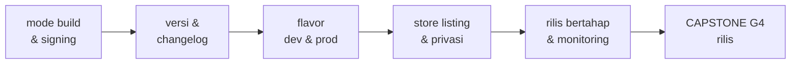
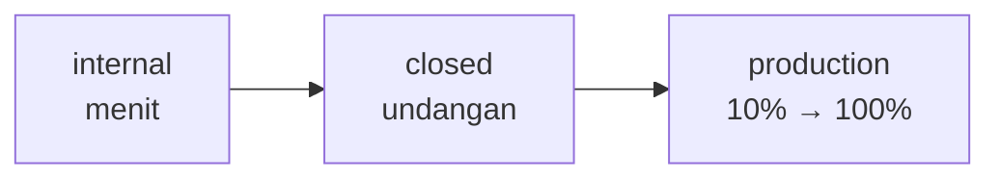

<!-- _class: title -->
<!-- _paginate: false -->

# Pertemuan 15
## Deployment & Distribution Strategies

App Bundle & signing · Store listing · Rilis bertahap · CAPSTONE G4: Rilis

**Sub-CPMK53.2** — mampu mengoptimalkan performa aplikasi hingga siap untuk deployment
Bacaan: modul-buku bab 14 · Praktikum: `starter-code/p15-release-prep`

<div class="pengajar">

**Fahri Firdausillah, S.Kom, M.CS**
Teknik Informatika — Universitas Dian Nuswantoro

</div>

---

## Setelah pertemuan ini, Anda bisa

1. **Membedakan upload key dan app signing key** di bawah Play App Signing, dan menjelaskan mana yang pulih kalau hilang.
2. **Menyiapkan signing rilis** — keystore, `key.properties` yang diabaikan Git, dan `signingConfigs` di `build.gradle.kts` — tanpa membocorkan kredensial.
3. **Mengelola versi dan changelog dari satu sumber kebenaran** di `pubspec.yaml`, serta menyiapkan flavor dev/prod berdampingan.
4. **Mengisi store listing dan Data Safety sebagai checklist verifikasi** yang cocok dengan perilaku nyata aplikasi, bukan klaim asal isi.
5. **Merencanakan rilis bertahap dan monitoring pasca-rilis**, lalu menuntaskan Gate 4: build tertandatangani plus dokumentasi.

<div class="note">

Bab 13 mengukur performa; hari ini hasilnya dikemas, ditandatangani, dan diamankan menjadi **rilis yang bisa dipasang orang lain**.

</div>

---

## Peta perjalanan hari ini

Dari aplikasi yang jalan di laptop menuju berkas yang dibagikan:



Semua langkah hari ini bermuara ke **Gate 4 — Rilis**, yang jatuh tempo minggu ini.

Starter: `starter-code/p15-release-prep` — logger aman produksi + `RELEASE-CHECKLIST.md`.

---

<!-- _class: section-break -->

# 1 · Build Rilis & Signing

Dari `flutter run` ke AAB tertandatangani

---

## Tiga mode build, satu tabel

| Aspek | Debug | Profile | Release |
|---|---|---|---|
| Hot reload | Ada | Tidak | Tidak |
| Assertions | Aktif | Aktif | Nonaktif, `assert` terbuang |
| DevTools | Penuh | Performance view | Tidak |
| Optimisasi AOT | Tidak | Sebagian | Penuh |
| Kegunaan | Pengembangan harian | Pengukuran (bab 13) | Pengguna akhir |

<div class="warn">

**Build release menjalankan kode yang berbeda dari yang Anda uji selama ini.** `assert` mati, tree shaking membuang kode tak terjangkau — bug yang tak pernah muncul di debug bisa muncul di rilis. Selain itu `print` dan `debugPrint` yang lolos ikut terkirim ke pengguna. Karena itu **menguji build rilis adalah tahap wajib**, bukan formalitas.

</div>

---

## Signing: dua kunci di bawah Play App Signing

Sejak Agustus 2021 aplikasi baru di Play otomatis mengikuti **Play App Signing** — satu tanggung jawab dibagi dua kunci:

| | Upload key | App signing key |
|---|---|---|
| Dipegang oleh | Anda | Google |
| Dipakai untuk | Menandatangani AAB yang diunggah | Menandatangani APK ke pengguna |
| Kalau hilang | Bisa **direset** via Play Console | Fatal tanpa Play App Signing |
| Rotasi | Ajukan kunci baru | Fitur upgrade key |

<div class="ok">

Nasihat lama *"jangan kehilangan keystore atau aplikasi mati"* menjadi dua kalimat: hilangnya **upload key** buruk tapi pulih; **app signing key** aman di Google selama Anda tidak keluar dari program.

</div>

---

<!-- _class: split -->

## Membuat upload keystore

```bash
# simpan di luar folder proyek,
# di mesin yang dibackup
mkdir -p ~/upload-keystores

keytool -genkey -v \
  -keystore \
  ~/upload-keystores/upload.jks \
  -keyalg RSA -keysize 2048 \
  -validity 10000 \
  -alias tracker-upload
```

<div>

`keytool` ada di JDK bawaan Android Studio; ia menanyakan password keystore, identitas, dan password kunci.

Keystore disimpan **di luar repo** karena ia identitas Anda, bukan bagian kode.

Opsi `-storetype JKS` dari tutorial lama tidak diperlukan — format bawaan PKCS12 sudah didukung penuh.

Untuk belajar, keystore percobaan cukup — asal jelas berbeda dari keystore produksi dan tak pernah dipakai rilis nyata.

</div>

---

## `key.properties`: memisahkan kredensial dari build

Rahasia tidak boleh ikut kode — ia hidup di berkas terpisah yang dibaca Gradle saat build:

```properties
storePassword=<password-keystore-anda>
keyPassword=<password-kunci-anda>
keyAlias=tracker-upload
storeFile=/home/<nama-anda>/upload-keystores/upload.jks
```

Pastikan `.gitignore` benar-benar mengecualikannya, lalu verifikasi dengan `git status`:

```gitignore
key.properties
**/*.keystore
**/*.jks
```

Password juga dicatat di pengelola password — satu salinan di laptop bukan backup.

---

<!-- _class: code-dense -->

## Signing di `build.gradle.kts` — memuat kredensial

```kotlin
import java.io.FileInputStream
import java.util.Properties

plugins {
    id("com.android.application")
    id("kotlin-android")
    id("dev.flutter.flutter-gradle-plugin")
}

// Pernyataan setelah plugins {} — jangan pernah di atasnya
val keystoreProperties = Properties()
val keystorePropertiesFile = rootProject.file("key.properties")
if (keystorePropertiesFile.exists()) {
    keystoreProperties.load(FileInputStream(keystorePropertiesFile))
}
```

Susunannya ketat: **`import` boleh mendahului `plugins {}`** (itu deklarasi Kotlin), tetapi pernyataan tidak boleh. Tutorial Groovy usang yang menulis `def keystoreProperties = ...` di atas `plugins` membuat build gagal — tanda tulisan dari masa lalu.

---

<!-- _class: code-dense -->

## Signing di `build.gradle.kts` — konfigurasi & fallback

```kotlin
android {
    // defaultConfig dari bab 4 tetap: versionCode/versionName
    // mengalir dari flutter.versionCode / flutter.versionName

    signingConfigs {
        create("release") {
            if (keystorePropertiesFile.exists()) {
                keyAlias = keystoreProperties["keyAlias"] as String
                keyPassword = keystoreProperties["keyPassword"] as String
                storeFile = keystoreProperties["storeFile"]?.let { file(it) }
                storePassword = keystoreProperties["storePassword"] as String
            }
        }
    }

    buildTypes {
        release {
            signingConfig = if (keystorePropertiesFile.exists())
                signingConfigs.getByName("release")
            else
                signingConfigs.getByName("debug")   // fallback uji lokal
        }
    }
}
```

Fallback ke kunci debug membuat build **gagal secara ramah** di mesin tanpa `key.properties` — berguna untuk mencoba pipeline. Tapi ingat: **Play menolak AAB bertanda debug**, jadi fallback ini tidak pernah untuk unggah.

---

<!-- _class: section-break -->

# 2 · Versi, Flavor & Simbol

Identitas yang naik teratur

---

## Satu sumber kebenaran versi

Versi hanya ditulis di satu tempat — `pubspec.yaml` — lalu mengalir ke Gradle:

```yaml
name: study_tracker
description: Pencatat tugas dengan sinkronisasi Supabase
version: 1.0.0+1
#       │ │ │ └── build number → versionCode Android
#       │ │ └──── patch
#       │ └────── minor
#       └──────── major
```

`build.gradle.kts` tidak menulis angka versi ganda: `versionCode = flutter.versionCode` dan `versionName = flutter.versionName` mengikuti `pubspec.yaml` otomatis.

---

## Dua aturan yang dipegang Play

1. **`versionCode` (angka setelah `+`) wajib naik monoton untuk setiap unggahan.** Play menolak kode versi yang sudah terpakai — setiap rilis, naikkan minimal angka ini.
2. **`versionName` (format `x.y.z`) untuk mata manusia:** major untuk perubahan cara pakai, minor untuk fitur baru, patch untuk perbaikan.

<div class="warn">

**"Version code 1 has already been used"** — penyebab paling umum unggahan ditolak. Naikkan build number di `pubspec.yaml`, bangun ulang, selesai.

</div>

---

## Changelog yang jujur

Ditulis untuk pengguna — dan untuk diri Anda tiga bulan ke depan:

```markdown
## [1.0.0] — 2026-09-22

### Ditambahkan
- Daftar tugas dengan status dan foto bukti
- Sinkronisasi dua arah dengan Supabase
- Mode offline: tersinkron saat koneksi kembali

### Perbaikan
- Gulir daftar panjang stabil di refresh rate tinggi
```

Setiap poin bisa dilacak ke fitur yang benar-benar dikirim. Changelog yang menjanjikan fitur yang belum ada bukan dokumen, melainkan **utang**.

---

<!-- _class: split -->

## Flavor: dev dan prod berdampingan

```kotlin
// di dalam android { }
flavorDimensions += "env"
productFlavors {
    create("dev") {
        dimension = "env"
        applicationIdSuffix = ".dev"
        versionNameSuffix = "-dev"
        resValue("string", "app_name",
            "Tracker Dev")
    }
    create("prod") {
        dimension = "env"
        resValue("string", "app_name",
            "Tracker")
    }
}
```

<div>

Kenapa flavor: versi `dev` menunjuk proyek Supabase percobaan, `prod` ke proyek sungguhan — keduanya ingin terpasang **berdampingan** di satu ponsel.

`applicationIdSuffix = ".dev"` membuat dev jadi aplikasi berbeda: dua ikon, dua data lokal, tak saling menimpa.

`resValue` menghasilkan `app_name` per flavor — dipakai manifest lewat `android:label="@string/app_name"`.

Flavor mengatur identitas paket; `--dart-define` mengatur nilai Dart. Keduanya menyelesaikan masalah berbeda dan dipakai bersama.

</div>

---

## Build dengan flavor — dan pengamannya

```bash
# versi pengembangan ke proyek percobaan
flutter run --flavor dev \
  --dart-define=APP_ENV=dev \
  --dart-define=SUPABASE_URL=https://xxxx.supabase.co \
  --dart-define=SUPABASE_ANON_KEY=eyJ...

# build rilis produksi
flutter build appbundle --release --flavor prod \
  --dart-define=APP_ENV=prod \
  --dart-define=SUPABASE_URL=https://yyyy.supabase.co \
  --dart-define=SUPABASE_ANON_KEY=eyJ...
```

Setelah flavor didefinisikan, setiap build **wajib menyebut `--flavor`** — tanpa itu build gagal dengan pesan jelas. Itu pengaman, bukan gangguan: build yang gagal jelas lebih murah daripada AAB produksi yang tak sengaja menunjuk server percobaan.

---

## AAB, obfuscation, dan simbol

Play mewajibkan format **App Bundle** untuk aplikasi baru; APK hanya untuk sideload. Rilis publik ditambah obfuscation Dart:

```bash
flutter build appbundle --release --flavor prod \
  --dart-define=APP_ENV=prod \
  --obfuscate --split-debug-info=build/symbols

# saat laporan crash datang dari pengguna:
flutter symbolize --id=<obfuscation-id> \
  --input=stack-trace.txt -d build/symbols
```

<div class="warn">

Obfuscation mengubah nama kelas dan fungsi menjadi samaran — stack trace pengguna jadi tak terbaca **kecuali simbol pemetaannya disimpan**. Direktori `build/symbols` adalah bagian dari rilis: simpan bersama tag rilis; simbol tiap build berbeda dan tak bisa direkonstruksi setelahnya.

</div>

---

## Menguji build rilis sebelum unggah

`flutter install --release --flavor dev`, lalu jalankan skenario inti di perangkat fisik:

| Area | Yang diuji | Dibangun di |
|---|---|---|
| Startup | Terbuka tanpa crash, splash dan ikon benar | bab 4 |
| Auth | Login, registrasi, logout; token segar | bab 9 |
| CRUD | Buat, ubah, selesaikan, hapus tugas | bab 3, 7 |
| Offline | Putus jaringan tetap jalan, tersinkron kembali | bab 10 |
| Device | Foto bukti, koordinat tercatat | bab 12 |
| Performa | Gulir daftar panjang mulus di mode rilis | bab 13 |
| Flavor | Dev dan prod berdampingan, data tak tertukar | bab ini |

Keputusan rilis diambil dari **perangkat fisik** — emulator hanya sanity check.

---

## Kegagalan umum dan jawabannya

| Gejala | Penyebab | Penanganan |
|---|---|---|
| "Version code already used" | `+` di pubspec tidak dinaikkan | Naikkan build number |
| AAB ditolak: kunci debug | Fallback karena `key.properties` absen | Sediakan berkas di lingkungan build |
| Tanda tangan tak cocok | Upload key beda dari terdaftar | Reset upload key via Console |
| Target API tak memenuhi | Toolchain lebih tua dari kebijakan | `flutter upgrade` — jangan tulis angka |
| Trace crash tak terbaca | Simbol `--split-debug-info` hilang | `flutter symbolize` dengan simbol build itu |
| Upload key hilang | Keystore terhapus / laptop hilang | Reset via Console; app signing key aman |

Aturan di balik tabel ini: **angka SDK hanya di tabel kebijakan, tidak pernah di file build** — `flutter.targetSdkVersion` mengikuti toolchain yang mengikuti kebijakan Play.

---

<!-- _class: section-break -->

# 3 · Store Listing & Kepatuhan

Klaim yang bisa diverifikasi

---

## Play Console: akun dan pendaftaran

1. Buka `play.google.com/console`, masuk dengan akun Google.
2. Bayar pendaftaran sekali bayar (USD 25), lengkapi profil developer.
3. **Create app**: nama, bahasa, kategori — pilihan gratis/berbayar **permanen** dan tak bisa berubah setelah rilis pertama.

<div class="warn">

Akun personal yang dibuat sejak November 2023 wajib menjalankan **closed testing: minimal 20 penguji aktif selama 14 hari** sebelum boleh rilis produksi. Rencanakan ini sebagai bagian jadwal rilis, bukan kejutan minggu terakhir.

</div>

---

## Aset listing: yang menyita waktu justru bukan kodenya

| Aset | Spesifikasi | Catatan |
|---|---|---|
| Ikon toko | 512x512, PNG 32-bit | Tanpa transparansi |
| Ikon launcher | Adaptif (foreground + background) | `flutter_launcher_icons` |
| Feature graphic | 1024x500, PNG/JPG | Wajib meski tanpa video |
| Screenshot | Minimal 2 per jenis perangkat | Data realistis, bukan placeholder |
| Deskripsi singkat | Maksimum 80 karakter | Satu kalimat nilai utama |
| Deskripsi lengkap | Hingga 4000 karakter | Fokus fitur nyata |

Console menampilkan daftar riksa yang harus hijau semua sebelum rilis bisa dikirim — bagian teknisnya sudah kita bahas; aset dan deklarasi ini yang menyita waktu.

---

## Data Safety: checklist, bukan klaim

Formulir **Data Safety** dibandingkan Google dengan perilaku nyata aplikasi (termasuk pemindaian otomatis) — ketidakcocokan adalah alasan penolakan dan penghapusan. Tiap butir dicocokkan dengan bukti:

- **Cakupan data cocok dengan yang dikumpulkan.** StudyTracker: email (registrasi), konten pengguna (judul tugas, status, foto, koordinat), ID pengguna — masing-masing dinyatakan dengan tujuan dan enkripsi transitnya.
- **Permission yang diminta dipakai dan bisa dijelaskan.** Permission dideklarasikan tapi tak terpakai adalah temuan audit, bukan cadangan.
- **Tidak ada klaim keamanan tak terbukti.** Yang bisa ditulis jujur: data di Supabase dengan RLS aktif sehingga tiap pengguna hanya membaca barisnya sendiri — spesifik dan bisa diverifikasi.

---

## Privacy policy dan penghapusan akun

- **Kebijakan privasi menjelaskan data satu per satu:** di mana disimpan (region proyek Supabase Anda), untuk apa, berapa lama, bagaimana dihapus. Dihosting di URL publik dan stabil.
- **Jalur penghapusan akun wajib** untuk aplikasi yang memungkinkan pembuatan akun: tersedia **di dalam aplikasi** (aksi yang memanggil endpoint hapus) **dan lewat tautan web**.
- Teks hukum yang benar bergantung pada data dan yurisdiksi Anda — bab ini memberi daftar hal yang harus benar, bukan template untuk disalin.

<div class="warn">

Formulir yang diisi asal jalan adalah **sumber penolakan paling umum**. Isinya bukan paragraf keyakinan, melainkan daftar verifikasi yang tiap butirnya punya bukti di kode Anda.

</div>

---

<!-- _class: split -->

## Audit data sensitif: sunyi di rilis

```dart
abstract final class AppLogger {
  static void debug(String message) {
    if (kReleaseMode) return;
    dev.log(message, name: 'StudyTracker');
  }

  static void error(
      Object error, StackTrace stack) {
    if (kReleaseMode) {
      // TODO(student) P15-2: sambungkan ke
      // layanan (Crashlytics/Sentry)
      return;
    }
    dev.log('$error',
        name: 'StudyTracker-error',
        error: error, stackTrace: stack);
  }
}
```

<div>

Log yang bocor ke produksi adalah **kebocoran informasi**: data pengguna dan struktur internal.

Kuncinya `kReleaseMode`: riuh di debug, sunyi di rilis — dari satu titik, bukan `if` tersebar di tiap layar.

Sebelum membangun, audit: tak ada `print` yang lolos, tak ada kunci API di berkas rilis, tak ada menu percobaan yang tertinggal.

Ini inti butir *bersih untuk produksi* di Gate 4.

</div>

---

<!-- _class: section-break -->

# 4 · Rilis Bertahap & Dokumentasi

Kepada penerima yang makin sulit memaafkan

---

## Jalur rilis bertahap



- **Internal testing** — unggahan pertama tiap rilis; menyebar dalam hitungan menit, pre-launch report otomatis berjalan.
- **Closed testing** — undangan via tautan; jalur wajib akun personal baru; tempat termurah menemukan masalah.
- **Staged rollout** — mulai 10%, pantau crash rate di Android vitals, naik bertahap.

Rollout yang berhenti di 10% karena crash jauh lebih murah daripada 100% pengguna menemukannya bersamaan.

---

## Monitoring pasca-rilis

Error framework (build/layout) mengalir ke satu titik sebelum aplikasi jalan:

```dart
void main() {
  WidgetsFlutterBinding.ensureInitialized();
  FlutterError.onError = (details) {
    AppLogger.error(details.exception, details.stack ?? StackTrace.empty);
  };
  runApp(const StudyTrackerApp());
}
```

Di build rilis, titik ini yang Anda sambungkan ke layanan crash analytics (Crashlytics/Sentry) — itulah TODO `P15-2` di starter. Pantau Android vitals untuk crash rate, dan sediakan kanal **feedback** pengguna: laporan mereka adalah sumber perbaikan rilis berikutnya.

---

## Dokumentasi: arsitektur, user manual, API docs

- **README 1–2 halaman**: apa aplikasinya, cara menjalankan dari nol, gambaran arsitektur, dan **keterbatasan yang Anda sadari** — bagian keterbatasan wajib dan dinilai.
- **Arsitektur**: diagram lapisan (models/services/screens/widgets) dan aliran data — cukup untuk orang asing menempatkan kode baru di tempat yang benar.
- **User manual**: cara memakai dari sudut pandang pengguna, bukan developer.
- **API docs**: kontrak backend yang dipakai aplikasi (endpoint, autentikasi, bentuk respons).

README yang paling sering gagal: melewatkan satu langkah yang penulisnya lakukan berbulan lalu dan lupa pernah melakukannya — karena itu diuji dengan **klon repo baru**.

---

## Persiapan presentasi final

- **Demo script** — skenario 5 menit yang menyoroti alur inti; siapkan jalur cadangan bila jaringan gagal.
- **Penjelasan teknis** — keputusan arsitektur dan trade-off-nya: kenapa Provider, kenapa offline-first, kenapa struktur begini.
- **Refleksi portofolio** — apa yang akan Anda buat berbeda kalau mengulang; ini bahan cerita yang tak bisa digantikan siapa pun.

<div class="ok">

G4 adalah keadaan akhir aplikasi; presentasi menilai kemampuan Anda **mempertahankannya**. Tidak ada fitur baru yang dituntut di antara keduanya — pakai waktunya untuk presentasi dan menutup keterbatasan yang Anda tulis sendiri di README.

</div>

---

<!-- _class: section-break -->

# 5 · CAPSTONE G4

Gate 4 — Rilis, jatuh tempo minggu ini

---

## G4: target gate

Aplikasi berpindah dari *"jalan di laptop saya"* menjadi berkas yang bisa dipasang orang lain:

- **Build rilis tertandatangani** dengan keystore Anda sendiri — keystore dan password **tidak** masuk repo.
- **Bukti profiling**: satu masalah performa nyata, angka sebelum dan sesudah. Kalau ternyata aplikasi memang sudah cepat, katakan begitu dan tunjukkan pengukurannya — itu jawaban yang sah.
- **Bersih untuk produksi**: tanpa log debug bocor, tanpa kunci di berkas rilis, tanpa menu percobaan.
- **README utuh** + **refleksi AI** satu paragraf: di mana AI mempercepat, di mana menyesatkan.

Rubrik lengkap: `penugasan/capstone/G4_Rilis.md`

---

## G4: bentuk penyerahan

1. **Tag repo** — `gate-4`
2. **Satu blok `CHANGELOG.md`** — versi, bukti profiling, dan deklarasi AI
3. **Video demo 5 menit**

```markdown
## [gate-4] — <tanggal>
### Dirilis
- AAB produksi tertandatangani, versi 1.0.0+1
### Profiling
- Gulir daftar: jank 180ms → 16ms (bukti terlampir)
### AI
- Diterima: draf README bagian arsitektur
- Ditolak: ganti semua FutureBuilder dengan Timer
  — alasan: mengubah perilaku sinkronisasi
```

<div class="warn">

**Wajib menunjukkan satu saran AI yang Anda tolak beserta alasannya.** Kemampuan menolak adalah bukti Anda masih pengambil keputusan.

</div>

---

## G4: verifikasi sendiri sebelum menyetor

- [ ] Berkas rilis dipasang di perangkat yang belum pernah memasang aplikasi ini — dan berjalan
- [ ] Repo diklon ke direktori baru, README diikuti dari nol, aplikasi jalan
- [ ] `git log` dan seluruh isi repo diperiksa: tak ada keystore, kata sandi, kunci API
- [ ] Aplikasi jalan tanpa koneksi ke alat pengembangan — tak ada yang macet menunggu
- [ ] Angka sebelum dan sesudah profiling tercatat di CHANGELOG
- [ ] Tag `gate-4` dibuat, blok CHANGELOG lengkap, video terunggah

Butir kedua paling sering gagal — uji README dengan repo yang diklon baru.

---

## Praktikum hari ini

**Target:** StudyTracker siap rilis — dari build bertanda sampai dokumen dan presentasi.

1. Generate **Android App Bundle**, signing dengan release keystore (`key.properties`, tidak di-commit)
2. **Versioning semantik** di `pubspec.yaml` + perbarui `CHANGELOG.md`
3. **Store listing**: screenshot, deskripsi, metadata
4. **Privacy policy** untuk kepatuhan data
5. **Security audit** data sensitif — selesaikan TODO `P15-1` dan `P15-2`
6. **Beta testing**: internal tester, gradual rollout
7. **Monitoring pasca-rilis**: crash analytics, feedback
8. **Dokumentasi**: arsitektur, user manual, API docs — bekal presentasi final

<div class="warn">

Keystore, password, dan kunci API **tidak pernah masuk repo** — di kelas ini cukup placeholder. Kerjakan `RELEASE-CHECKLIST.md` di starter; bukti per butir masuk ke CHANGELOG G4.

</div>

Starter: `starter-code/p15-release-prep`

---

## Bekerja dengan AI di materi ini

**Pantas didelegasikan**
Menyusun draf dokumentasi: README, user guide, deskripsi toko, kerangka presentasi, dan rangkuman arsitektur dari kode — lalu Anda periksa dan betulkan sendiri. Ini penggunaan AI yang paling produktif di tahap rilis.

**Tulis sendiri**
Demo script dan refleksi portofolio. Hanya Anda yang tahu apa yang sebenarnya terjadi di proyek itu — bagian inilah yang menentukan apakah materi ini benar-benar Anda kuasai.

<div class="note">

**Latihan:** minta AI meninjau `build.gradle.kts` dan konfigurasi rilis Anda, mencari rahasia yang tertinggal. Perlakukan hasilnya sebagai **daftar kecurigaan, bukan vonis** — periksa sendiri tiap temuan, dan periksa juga riwayat commit: kunci yang dihapus dari berkas masih hidup di sana. AI membaca keadaan sekarang, bukan riwayatnya.

</div>

---

## Ringkasan

- **Build release menjalankan kode berbeda** — assert mati, tree shaking, obfuscation; menguji build rilis adalah tahap wajib.
- **Play App Signing membagi dua kunci**: upload key (Anda, bisa direset) dan app signing key (Google, identitas aplikasi).
- **Kredensial hidup di `key.properties`** yang diabaikan Git; di Kotlin DSL, `import` boleh sebelum `plugins {}`, pernyataan tidak boleh.
- **Versi satu sumber kebenaran** di `pubspec.yaml`; `versionCode` naik monoton tiap unggahan; changelog hanya berisi yang benar-benar dikirim.
- **Flavor dev/prod** menempatkan dua aplikasi berdampingan; build tanpa `--flavor` gagal jelas — itu pengaman.
- **AAB + `--obfuscate --split-debug-info`**; simbol disimpan bersama tag, tanpa itu crash produksi tak terbaca.
- **Data Safety dan privacy policy adalah checklist verifikasi** yang cocok dengan perilaku nyata; klaim keamanan hanya yang bisa dibuktikan.
- **Rilis bertahap** internal → closed → staged rollout; monitoring lewat `FlutterError.onError` + crash analytics + feedback.
- **G4**: signed build + dokumentasi; penyerahan = tag `gate-4` + blok CHANGELOG + video 5 menit + satu saran AI yang ditolak.

---

<!-- _class: section-break -->

# Pertemuan berikutnya

**UAS — Presentasi Proyek Akhir**
Technical demo & code review (20 menit) + Q&A komprehensif

G4 adalah keadaan akhir aplikasi Anda; UAS menilai kemampuan mempresentasikan dan mempertahankannya. Pakai waktunya untuk demo script dan menutup keterbatasan yang Anda tulis di README.

Baca sebelum ujian: `penugasan/capstone/` (rubrik G4)
